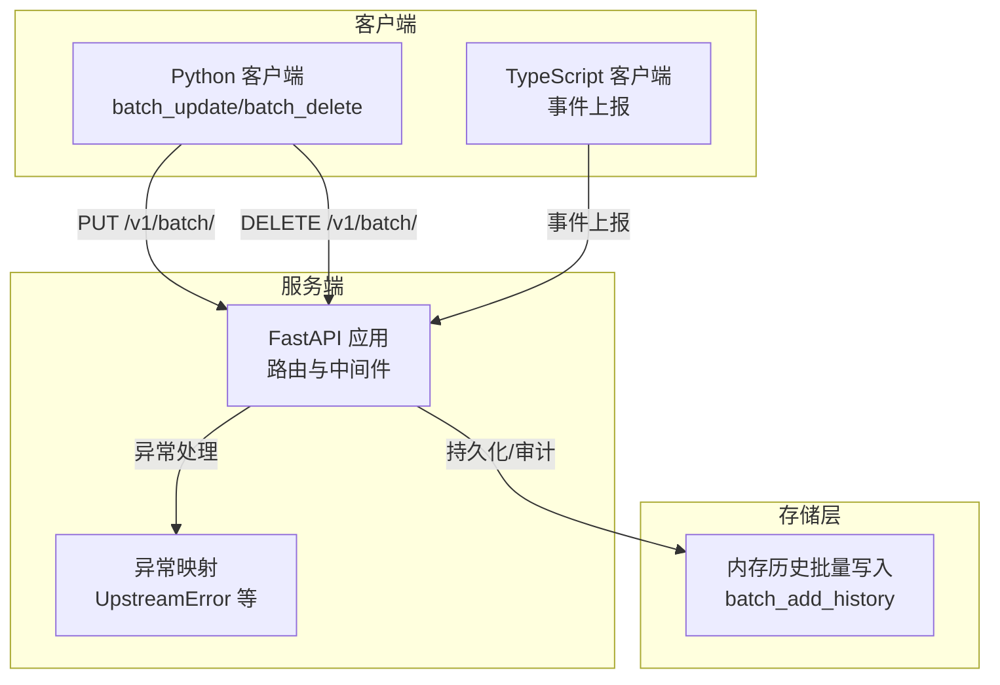
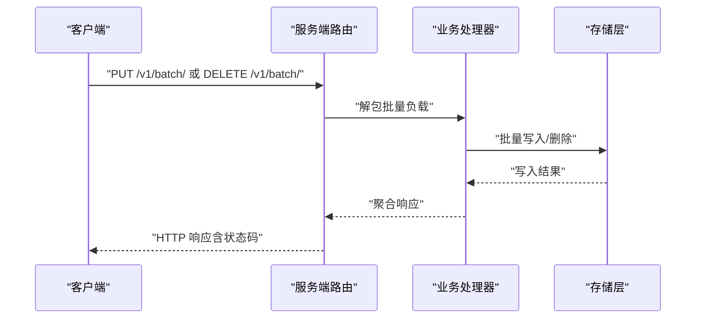
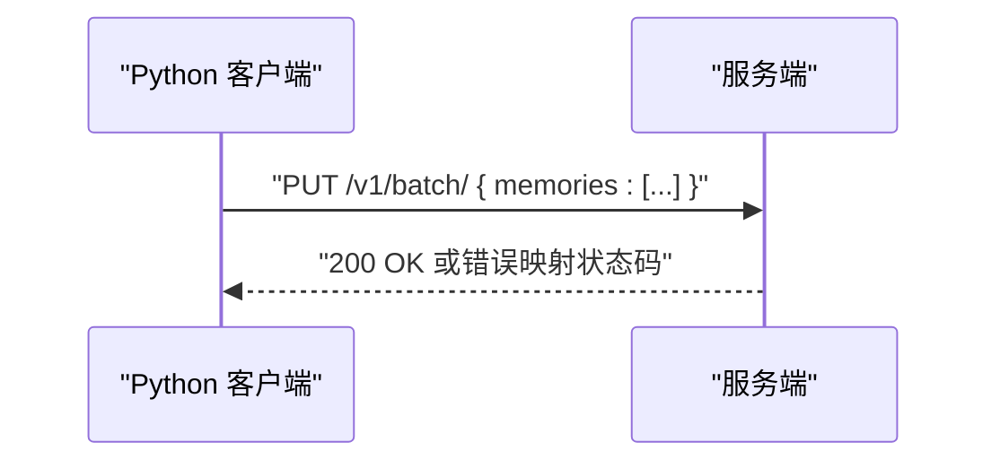
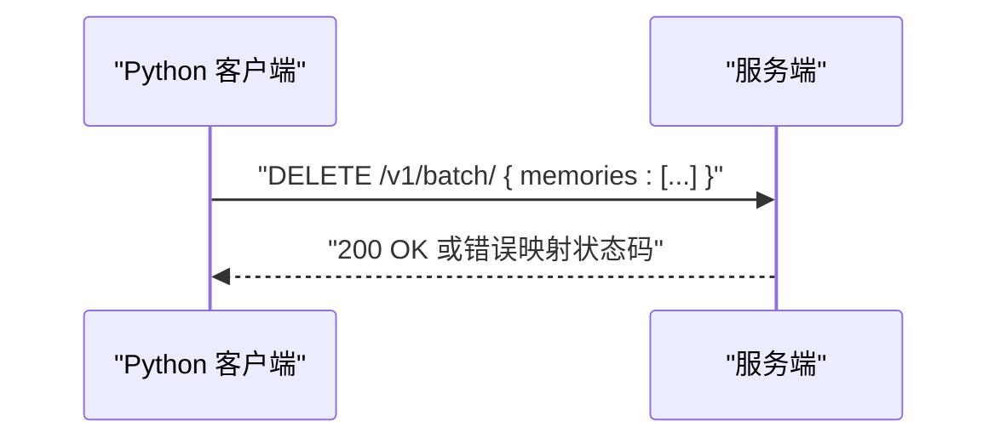
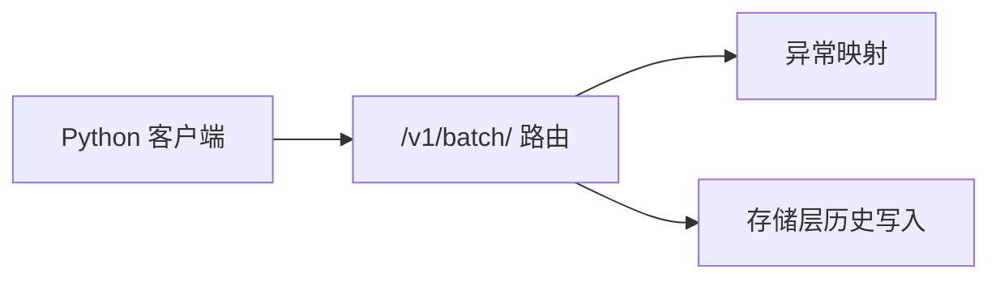

# 批量操作

<cite>
**本文引用的文件**
- [mem0/client/main.py](file://mem0/client/main.py)
- [docs/api-reference/memory/batch-update.mdx](file://docs/api-reference/memory/batch-update.mdx)
- [docs/api-reference/memory/batch-delete.mdx](file://docs/api-reference/memory/batch-delete.mdx)
- [docs/api-reference/memory/update-memory.mdx](file://docs/api-reference/memory/update-memory.mdx)
- [mem0/memory/storage.py](file://mem0/memory/storage.py)
- [server/main.py](file://server/main.py)
- [server/errors.py](file://server/errors.py)
- [mem0-ts/src/client/mem0.ts](file://mem0-ts/src/client/mem0.ts)
</cite>

## 目录
1. [简介](#简介)
2. [项目结构](#项目结构)
3. [核心组件](#核心组件)
4. [架构总览](#架构总览)
5. [详细组件分析](#详细组件分析)
6. [依赖关系分析](#依赖关系分析)
7. [性能考量](#性能考量)
8. [故障排查指南](#故障排查指南)
9. [结论](#结论)
10. [附录](#附录)

## 简介
本文件系统化梳理 mem0 的批量操作能力，重点覆盖以下三类接口与其实现要点：
- 批量添加记忆（batch_add）
- 批量删除记忆（batch_delete）
- 批量更新记忆（batch_update）

文档从架构、数据流、错误处理、事务性保证、性能优化与最佳实践等维度进行深入解析，并提供可直接定位到源码位置的参考路径，帮助开发者在生产环境中安全、高效地处理大规模记忆数据。

## 项目结构
围绕批量操作的关键代码分布在客户端 SDK、服务端入口与存储层：
- 客户端 SDK 提供同步与异步批量接口，统一通过 /v1/batch/ 路由提交请求
- 服务端入口注册路由并集中处理异常映射
- 存储层提供历史记录批量写入能力，便于审计与回溯

图表来源
- [mem0/client/main.py:557-606](file://mem0/client/main.py#L557-L606)
- [mem0/client/main.py:1467-1516](file://mem0/client/main.py#L1467-L1516)
- [server/main.py:144-171](file://server/main.py#L144-L171)
- [server/errors.py:12-31](file://server/errors.py#L12-L31)
- [mem0/memory/storage.py:192-192](file://mem0/memory/storage.py#L192-L192)

章节来源
- [mem0/client/main.py:557-606](file://mem0/client/main.py#L557-L606)
- [mem0/client/main.py:1467-1516](file://mem0/client/main.py#L1467-L1516)
- [server/main.py:144-171](file://server/main.py#L144-L171)
- [server/errors.py:12-31](file://server/errors.py#L12-L31)
- [mem0/memory/storage.py:192-192](file://mem0/memory/storage.py#L192-L192)

## 核心组件
- Python 客户端批量接口
  - 同步：batch_update、batch_delete
  - 异步：async batch_update、async batch_delete
  - 统一通过 PUT/DELETE /v1/batch/ 提交批量负载
- 服务端异常映射
  - 将上游错误、速率限制、网络异常等归类为标准 HTTP 状态
- 存储层历史记录批量写入
  - 支持批量历史记录入库，便于审计与回溯

章节来源
- [mem0/client/main.py:557-606](file://mem0/client/main.py#L557-L606)
- [mem0/client/main.py:1467-1516](file://mem0/client/main.py#L1467-L1516)
- [server/errors.py:12-31](file://server/errors.py#L12-L31)
- [mem0/memory/storage.py:192-192](file://mem0/memory/storage.py#L192-L192)

## 架构总览
批量操作的端到端流程如下：
- 客户端构造批量请求体（memories 列表），发送至 /v1/batch/
- 服务端接收请求，执行业务校验与限流
- 成功后返回响应；失败时按异常类型映射为标准状态码
- 存储层可选地记录历史变更，确保可审计

图表来源
- [mem0/client/main.py:557-606](file://mem0/client/main.py#L557-L606)
- [mem0/client/main.py:1467-1516](file://mem0/client/main.py#L1467-L1516)
- [server/main.py:144-171](file://server/main.py#L144-L171)
- [server/errors.py:12-31](file://server/errors.py#L12-L31)

## 详细组件分析

### 批量更新记忆（batch_update）
- 接口职责
  - 在单次请求中完成多条记忆的更新
  - 返回批量操作的汇总结果
- 请求与响应
  - 方法：PUT
  - 路径：/v1/batch/
  - 负载字段：memories（列表，每项包含目标记忆标识与待更新字段）
- 错误处理
  - 输入校验失败映射为 422/409
  - 额度超限映射为 413
  - 速率限制映射为 429
  - 网络异常映射为 502/503/504
  - 其他内部错误映射为 500
- 异步版本
  - 使用异步客户端调用相同端点，事件上报区分 sync/async

图表来源
- [mem0/client/main.py:557-582](file://mem0/client/main.py#L557-L582)
- [mem0/client/main.py:1487-1492](file://mem0/client/main.py#L1487-L1492)
- [server/errors.py:12-31](file://server/errors.py#L12-L31)

章节来源
- [mem0/client/main.py:557-582](file://mem0/client/main.py#L557-L582)
- [mem0/client/main.py:1487-1492](file://mem0/client/main.py#L1487-L1492)
- [docs/api-reference/memory/batch-update.mdx:1-5](file://docs/api-reference/memory/batch-update.mdx#L1-L5)
- [server/errors.py:12-31](file://server/errors.py#L12-L31)

### 批量删除记忆（batch_delete）
- 接口职责
  - 在单次请求中删除多条记忆
  - 返回批量删除的确认信息
- 请求与响应
  - 方法：DELETE
  - 路径：/v1/batch/
  - 负载字段：memories（列表，每项至少包含 memory_id）
- 错误处理
  - 输入校验失败映射为 422/409
  - 额度超限映射为 413
  - 速率限制映射为 429
  - 网络异常映射为 502/503/504
  - 其他内部错误映射为 500

图表来源
- [mem0/client/main.py:584-606](file://mem0/client/main.py#L584-L606)
- [mem0/client/main.py:1513-1516](file://mem0/client/main.py#L1513-L1516)
- [server/errors.py:12-31](file://server/errors.py#L12-L31)

章节来源
- [mem0/client/main.py:584-606](file://mem0/client/main.py#L584-L606)
- [mem0/client/main.py:1513-1516](file://mem0/client/main.py#L1513-L1516)
- [docs/api-reference/memory/batch-delete.mdx:1-5](file://docs/api-reference/memory/batch-delete.mdx#L1-L5)
- [server/errors.py:12-31](file://server/errors.py#L12-L31)

### 单条更新（对比参考）
- 接口职责
  - 更新单条记忆内容或元数据
- 请求与响应
  - 方法：PUT
  - 路径：/v1/memories/{memory_id}/
- 用途说明
  - 适用于小规模、逐条的更新场景
  - 批量更新更适合高吞吐与低延迟

章节来源
- [docs/api-reference/memory/update-memory.mdx:1-5](file://docs/api-reference/memory/update-memory.mdx#L1-L5)

### 存储层历史记录批量写入
- 能力概述
  - 提供批量历史记录入库能力，便于审计与回溯
- 典型用途
  - 在批量新增/更新/删除后，记录变更轨迹
  - 支持按记忆 ID 查询历史，验证一致性

章节来源
- [mem0/memory/storage.py:192-192](file://mem0/memory/storage.py#L192-L192)

### TypeScript 客户端事件上报
- 能力概述
  - 在批量更新/删除后触发事件上报，便于观测与追踪
- 事件名称
  - batch_update、batch_delete

章节来源
- [mem0-ts/src/client/mem0.ts:525-543](file://mem0-ts/src/client/mem0.ts#L525-L543)

## 依赖关系分析
- 客户端对服务端的依赖
  - 通过 /v1/batch/ 统一承载批量操作
  - 对异常映射依赖服务端的标准化状态码
- 服务端对异常处理的依赖
  - 将上游错误、速率限制、网络异常等映射为标准 HTTP 状态
- 存储层对审计的依赖
  - 批量历史写入用于审计与回溯

图表来源
- [mem0/client/main.py:557-606](file://mem0/client/main.py#L557-L606)
- [server/main.py:144-171](file://server/main.py#L144-L171)
- [server/errors.py:12-31](file://server/errors.py#L12-L31)
- [mem0/memory/storage.py:192-192](file://mem0/memory/storage.py#L192-L192)

章节来源
- [mem0/client/main.py:557-606](file://mem0/client/main.py#L557-L606)
- [server/main.py:144-171](file://server/main.py#L144-L171)
- [server/errors.py:12-31](file://server/errors.py#L12-L31)
- [mem0/memory/storage.py:192-192](file://mem0/memory/storage.py#L192-L192)

## 性能考量
- 批量操作的性能优势
  - 减少网络往返次数与协议开销
  - 降低服务端解析与鉴权的重复成本
  - 更适合高吞吐与低延迟场景
- 分批大小优化建议
  - 根据服务端限流阈值与内存占用动态调整批次大小
  - 建议以“百级”为起点逐步压测，找到吞吐峰值对应的批次大小
- 并发与重试
  - 控制并发度，避免触发速率限制
  - 对非幂等失败采用指数退避重试，幂等失败可直接重放
- 数据预处理
  - 在客户端侧完成去重、格式校验与字段裁剪
  - 预先计算向量嵌入（如本地缓存）以减少往返
- 事务性保证
  - 批量接口未声明原子性语义；若需强一致，应在应用层实现幂等与补偿逻辑
  - 可结合存储层历史记录进行最终一致性校验与修复

## 故障排查指南
- 常见错误与定位
  - 422/409：输入参数校验失败，检查 memories 结构与必填字段
  - 413：额度超限，检查配额与批量大小
  - 429：触发速率限制，降低并发与批次大小，增加退避
  - 502/503/504：网络异常，检查服务可用性与超时设置
  - 500：内部错误，收集请求 ID 并复现最小样本
- 客户端异常映射
  - 服务端将各类异常映射为标准 HTTP 状态，便于统一处理
- 观测与追踪
  - TypeScript 客户端在批量更新/删除后触发事件上报，可用于端到端追踪

章节来源
- [server/errors.py:12-31](file://server/errors.py#L12-L31)
- [mem0-ts/src/client/mem0.ts:525-543](file://mem0-ts/src/client/mem0.ts#L525-L543)

## 结论
- 批量操作通过统一的 /v1/batch/ 路由显著提升吞吐与稳定性
- 客户端与服务端的异常映射体系确保了跨语言的一致性体验
- 存储层的历史记录能力为审计与回溯提供了基础
- 实际部署中建议结合分批大小优化、并发控制与幂等设计，达成稳定高效的批量处理

## 附录

### 使用示例（路径指引）
- 批量更新
  - 同步调用：参见 [mem0/client/main.py:557-582](file://mem0/client/main.py#L557-L582)
  - 异步调用：参见 [mem0/client/main.py:1487-1492](file://mem0/client/main.py#L1487-L1492)
- 批量删除
  - 同步调用：参见 [mem0/client/main.py:584-606](file://mem0/client/main.py#L584-L606)
  - 异步调用：参见 [mem0/client/main.py:1513-1516](file://mem0/client/main.py#L1513-L1516)
- 单条更新（对比参考）
  - 参见 [docs/api-reference/memory/update-memory.mdx:1-5](file://docs/api-reference/memory/update-memory.mdx#L1-L5)
- 文档规范
  - 批量更新接口文档：参见 [docs/api-reference/memory/batch-update.mdx:1-5](file://docs/api-reference/memory/batch-update.mdx#L1-L5)
  - 批量删除接口文档：参见 [docs/api-reference/memory/batch-delete.mdx:1-5](file://docs/api-reference/memory/batch-delete.mdx#L1-L5)