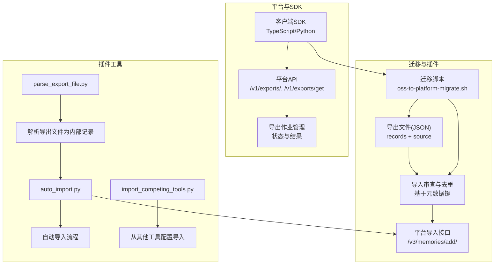
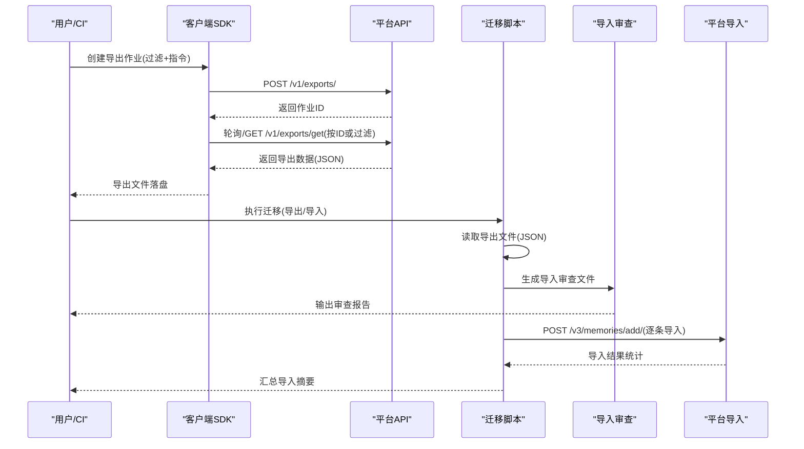
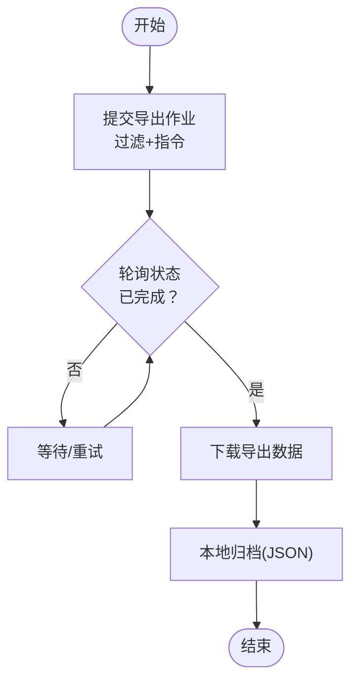
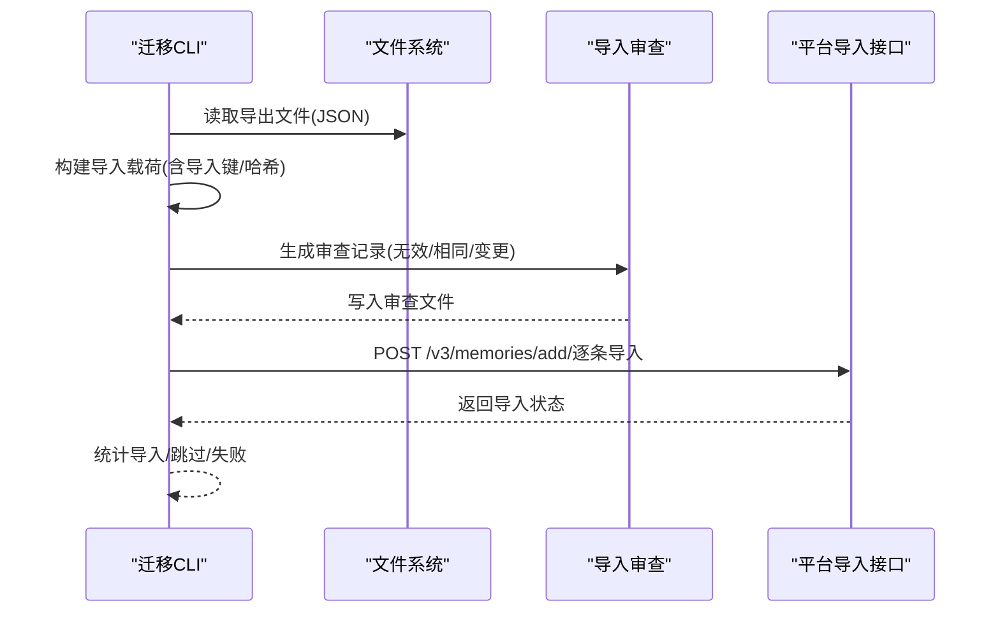
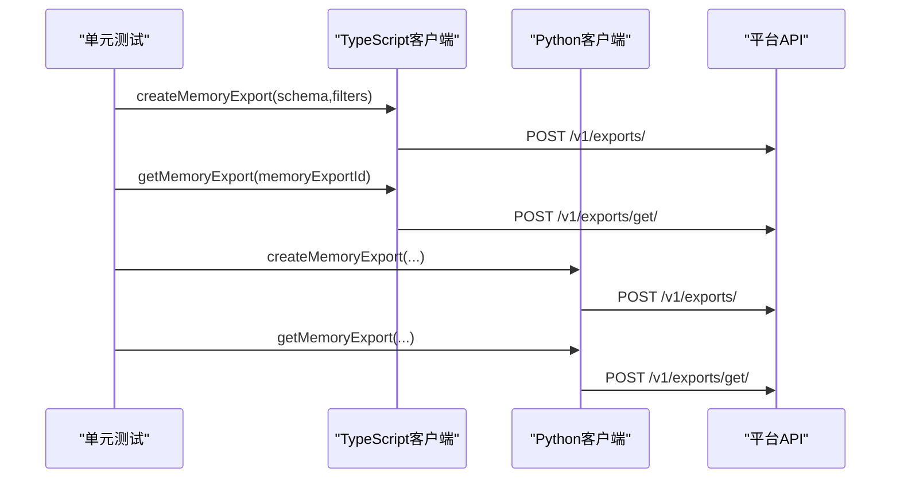
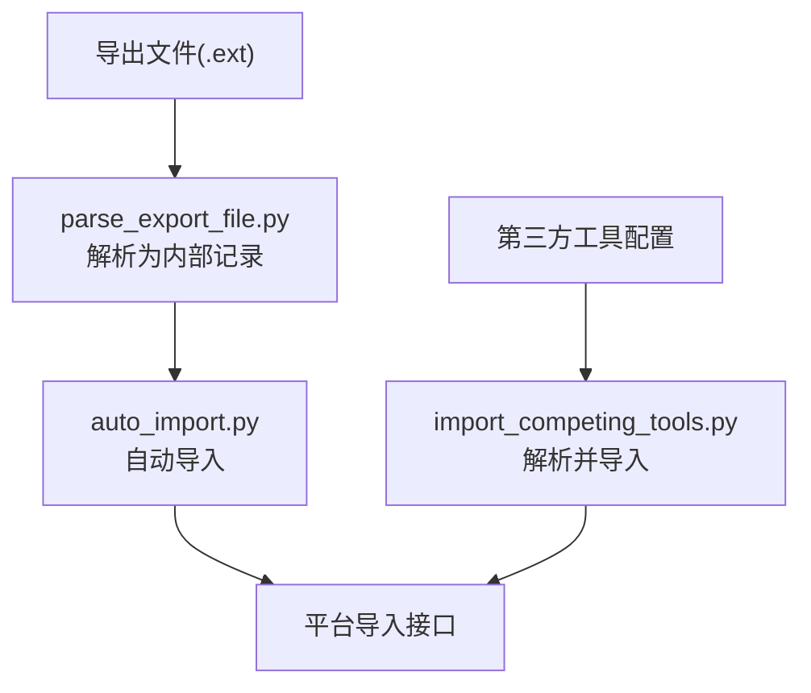
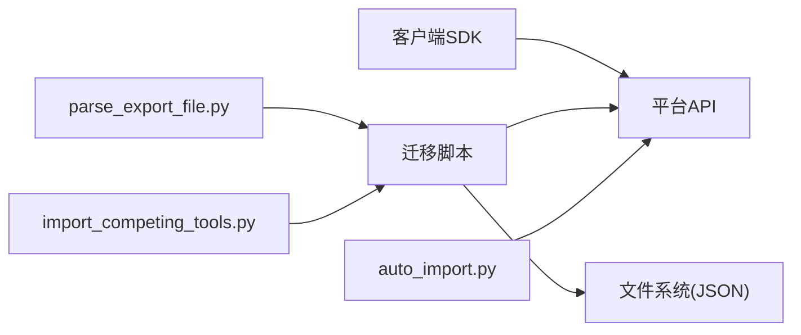

# 记忆导出导入

<cite>
**本文引用的文件**
- [oss-to-platform-migrate.sh](file://scripts/oss-to-platform-migrate.sh)
- [test_oss_to_platform_migrate.py](file://tests/test_oss_to_platform_migrate.py)
- [exporting-memories.mdx](file://docs/cookbooks/essentials/exporting-memories.mdx)
- [create-memory-export.mdx](file://docs/api-reference/memory/create-memory-export.mdx)
- [get-memory-export.mdx](file://docs/api-reference/memory/get-memory-export.mdx)
- [memory-export.mdx](file://docs/platform/features/memory-export.mdx)
- [memoryClient.project.test.ts](file://mem0-ts/src/client/tests/memoryClient.project.test.ts)
- [differences.md](file://integrations/mem0-plugin/skills/mem0/client/differences.md)
- [python.md](file://integrations/mem0-plugin/skills/mem0/client/python.md)
- [features.md](file://integrations/mem0-plugin/skills/mem0/references/features.md)
- [sdk-guide.md](file://integrations/mem0-plugin/skills/mem0/references/sdk-guide.md)
- [parse_export_file.py](file://integrations/mem0-plugin/scripts/parse_export_file.py)
- [auto_import.py](file://integrations/mem0-plugin/scripts/auto_import.py)
- [import_competing_tools.py](file://integrations/mem0-plugin/scripts/import_competing_tools.py)
- [test_parse_export_file.py](file://integrations/mem0-plugin/tests/test_parse_export_file.py)
- [test_import_competing_tools.py](file://integrations/mem0-plugin/tests/test_import_competing_tools.py)
</cite>

## 目录
1. [简介](#简介)
2. [项目结构](#项目结构)
3. [核心组件](#核心组件)
4. [架构总览](#架构总览)
5. [详细组件分析](#详细组件分析)
6. [依赖关系分析](#依赖关系分析)
7. [性能考量](#性能考量)
8. [故障排查指南](#故障排查指南)
9. [结论](#结论)
10. [附录](#附录)

## 简介
本文件系统化阐述“记忆导出导入”能力：涵盖导出格式与结构、导入方法与数据迁移策略、完整性校验与版本兼容性、批量迁移最佳实践（含增量导出、断点续传、数据验证）、与其他系统的数据交换方案（CSV/JSON 转换）以及自动化迁移脚本示例。目标是帮助平台用户与集成开发者在不同场景下安全、可控地完成记忆数据的迁移与归档。

## 项目结构
围绕记忆导出导入的关键位置与职责如下：
- 平台侧导出与导入
  - 导出接口与文档：API 参考与平台特性文档定义了导出作业提交、状态轮询与下载流程。
  - 迁移脚本：提供从开源版到平台版的完整迁移流程，支持导出、审查与导入三阶段。
- 客户端 SDK 与测试
  - TypeScript/Python 客户端对导出接口进行调用与验证，确保请求路径与参数正确。
- 插件生态与工具
  - 解析导出文件、自动导入、竞争工具导入等脚本，支撑本地或第三方工具的记忆导入与格式转换。

图表来源
- [create-memory-export.mdx](file://docs/api-reference/memory/create-memory-export.mdx)
- [get-memory-export.mdx](file://docs/api-reference/memory/get-memory-export.mdx)
- [oss-to-platform-migrate.sh](file://scripts/oss-to-platform-migrate.sh)
- [parse_export_file.py](file://integrations/mem0-plugin/scripts/parse_export_file.py)
- [auto_import.py](file://integrations/mem0-plugin/scripts/auto_import.py)
- [import_competing_tools.py](file://integrations/mem0-plugin/scripts/import_competing_tools.py)

章节来源
- [exporting-memories.mdx](file://docs/cookbooks/essentials/exporting-memories.mdx)
- [memory-export.mdx](file://docs/platform/features/memory-export.mdx)
- [create-memory-export.mdx](file://docs/api-reference/memory/create-memory-export.mdx)
- [get-memory-export.mdx](file://docs/api-reference/memory/get-memory-export.mdx)

## 核心组件
- 导出作业与下载
  - 提交导出作业：通过导出接口提交结构化导出任务，可指定过滤条件与导出指令。
  - 下载与过期：完成后通过作业ID或过滤器获取导出内容；导出数据有有效期，需及时下载归档。
- 平台导入与去重
  - 导入接口：将单条或多条记忆写入平台。
  - 去重与变更检测：通过导入键与本地哈希判断是否跳过或提示变更。
- 迁移脚本
  - 导出：生成包含源信息与记录列表的 JSON 文件。
  - 审查：输出导入审查文件，记录无效、已存在且相同、已存在但变更等情况。
  - 导入：按记录构建导入载荷并调用平台导入接口。
- 插件工具
  - 导出文件解析：将外部导出文件转为内部记录。
  - 自动导入：在满足条件时自动触发导入。
  - 竞争工具导入：解析第三方工具配置并导入对应记忆。

章节来源
- [exporting-memories.mdx](file://docs/cookbooks/essentials/exporting-memories.mdx)
- [memory-export.mdx](file://docs/platform/features/memory-export.mdx)
- [oss-to-platform-migrate.sh](file://scripts/oss-to-platform-migrate.sh)
- [parse_export_file.py](file://integrations/mem0-plugin/scripts/parse_export_file.py)
- [auto_import.py](file://integrations/mem0-plugin/scripts/auto_import.py)
- [import_competing_tools.py](file://integrations/mem0-plugin/scripts/import_competing_tools.py)

## 架构总览
下图展示从导出到导入的整体流程，包括平台 API、迁移脚本与插件工具之间的交互。

图表来源
- [create-memory-export.mdx](file://docs/api-reference/memory/create-memory-export.mdx)
- [get-memory-export.mdx](file://docs/api-reference/memory/get-memory-export.mdx)
- [oss-to-platform-migrate.sh](file://scripts/oss-to-platform-migrate.sh)

## 详细组件分析

### 组件A：导出作业与下载（平台）
- 功能要点
  - 支持按用户、运行、会话、应用等实体维度过滤导出。
  - 可附加导出指令以指导冲突处理与字段填充策略。
  - 导出完成后通过作业ID或过滤器获取最新导出数据。
  - 导出数据具有有效期，到期需重新创建导出作业。
- 数据结构
  - 导出作业响应包含作业ID。
  - 导出数据为结构化 JSON，承载按模式组织的记忆字段集合。
- 错误处理
  - 导出未完成即下载会返回不完整数据；应轮询至完成态后再下载。
- 最佳实践
  - 在批量导出前先确认过滤条件与导出指令，避免重复作业。
  - 导出完成后立即下载并本地归档，防止过期。

图表来源
- [create-memory-export.mdx](file://docs/api-reference/memory/create-memory-export.mdx)
- [get-memory-export.mdx](file://docs/api-reference/memory/get-memory-export.mdx)
- [exporting-memories.mdx](file://docs/cookbooks/essentials/exporting-memories.mdx)

章节来源
- [create-memory-export.mdx](file://docs/api-reference/memory/create-memory-export.mdx)
- [get-memory-export.mdx](file://docs/api-reference/memory/get-memory-export.mdx)
- [exporting-memories.mdx](file://docs/cookbooks/essentials/exporting-memories.mdx)
- [memory-export.mdx](file://docs/platform/features/memory-export.mdx)

### 组件B：迁移脚本（从开源到平台）
- 功能要点
  - 导出：读取本地存储，生成包含 source 与 records 的 JSON 文件。
  - 审查：对每条记录构建导入载荷，输出无效、已存在且相同、已存在但变更等审查项。
  - 导入：查询平台现有记忆，基于导入键与本地哈希决定跳过或提示变更；否则调用导入接口。
- 数据结构
  - 导出文件根对象包含 source（源环境信息）与 records（记忆记录数组）。
  - 记录中包含唯一标识、内容、时间戳、哈希等字段，用于去重与变更检测。
  - 导入载荷包含目标作用域、元数据（含导入键与本地哈希）、记忆文本等。
- 完整性与一致性
  - 通过导入键与本地哈希实现幂等与一致性控制。
  - 对无效记录单独输出审查文件，便于人工复核。
- 版本兼容性
  - 导出文件包含版本号与类型标记，便于未来演进与回滚。
- 断点续传与批量
  - 支持分批导入与多次运行；每次运行会先查询已有记忆，避免重复导入。
  - 审查文件可用于定位失败与变更记录，辅助后续修复与重试。

图表来源
- [oss-to-platform-migrate.sh](file://scripts/oss-to-platform-migrate.sh)

章节来源
- [oss-to-platform-migrate.sh](file://scripts/oss-to-platform-migrate.sh)
- [test_oss_to_platform_migrate.py](file://tests/test_oss_to_platform_migrate.py)

### 组件C：客户端SDK对接导出接口
- 功能要点
  - TypeScript/Python 客户端分别对导出与获取导出接口进行调用，并在测试中验证请求路径与参数。
- 验证要点
  - createMemoryExport 发送 POST 到导出接口。
  - getMemoryExport 发送 POST 到获取导出接口。
  - 缺少必要参数时抛出明确错误。

图表来源
- [memoryClient.project.test.ts](file://mem0-ts/src/client/tests/memoryClient.project.test.ts)
- [differences.md](file://integrations/mem0-plugin/skills/mem0/client/differences.md)
- [python.md](file://integrations/mem0-plugin/skills/mem0/client/python.md)
- [sdk-guide.md](file://integrations/mem0-plugin/skills/mem0/references/sdk-guide.md)

章节来源
- [memoryClient.project.test.ts](file://mem0-ts/src/client/tests/memoryClient.project.test.ts)
- [differences.md](file://integrations/mem0-plugin/skills/mem0/client/differences.md)
- [python.md](file://integrations/mem0-plugin/skills/mem0/client/python.md)
- [sdk-guide.md](file://integrations/mem0-plugin/skills/mem0/references/sdk-guide.md)

### 组件D：插件工具（解析与导入）
- 导出文件解析
  - 将外部导出文件解析为内部记录，便于统一处理。
- 自动导入
  - 在满足条件时自动触发导入流程，减少人工干预。
- 竞争工具导入
  - 解析第三方工具配置（如 Cursor/Copilot/Cline/Continue），拆分并导入对应记忆。

图表来源
- [parse_export_file.py](file://integrations/mem0-plugin/scripts/parse_export_file.py)
- [auto_import.py](file://integrations/mem0-plugin/scripts/auto_import.py)
- [import_competing_tools.py](file://integrations/mem0-plugin/scripts/import_competing_tools.py)

章节来源
- [parse_export_file.py](file://integrations/mem0-plugin/scripts/parse_export_file.py)
- [auto_import.py](file://integrations/mem0-plugin/scripts/auto_import.py)
- [import_competing_tools.py](file://integrations/mem0-plugin/scripts/import_competing_tools.py)
- [test_parse_export_file.py](file://integrations/mem0-plugin/tests/test_parse_export_file.py)
- [test_import_competing_tools.py](file://integrations/mem0-plugin/tests/test_import_competing_tools.py)

## 依赖关系分析
- 组件耦合
  - 导出接口与客户端 SDK 强耦合，二者通过 OpenAPI 文档约定一致的请求/响应契约。
  - 迁移脚本依赖导出文件格式与平台导入接口；导入审查文件作为中间产物提升可审计性。
  - 插件工具与迁移脚本共享“导入键/哈希”的一致性模型，降低跨系统差异。
- 外部依赖
  - 平台 API 的认证与速率限制影响导出与导入的吞吐。
  - 第三方工具配置格式变化可能影响导入成功率，需定期更新解析逻辑。

图表来源
- [create-memory-export.mdx](file://docs/api-reference/memory/create-memory-export.mdx)
- [get-memory-export.mdx](file://docs/api-reference/memory/get-memory-export.mdx)
- [oss-to-platform-migrate.sh](file://scripts/oss-to-platform-migrate.sh)
- [parse_export_file.py](file://integrations/mem0-plugin/scripts/parse_export_file.py)
- [auto_import.py](file://integrations/mem0-plugin/scripts/auto_import.py)
- [import_competing_tools.py](file://integrations/mem0-plugin/scripts/import_competing_tools.py)

章节来源
- [create-memory-export.mdx](file://docs/api-reference/memory/create-memory-export.mdx)
- [get-memory-export.mdx](file://docs/api-reference/memory/get-memory-export.mdx)
- [oss-to-platform-migrate.sh](file://scripts/oss-to-platform-migrate.sh)

## 性能考量
- 导出性能
  - 大规模导出建议分页/分批获取，结合过滤条件缩小范围。
  - 使用导出指令减少歧义与二次处理成本。
- 导入性能
  - 批量导入时注意平台速率限制与并发度，避免触发限流。
  - 利用导入键与本地哈希进行去重，减少重复写入开销。
- 存储与传输
  - 导出数据建议压缩后传输与归档，降低带宽与存储压力。
  - 审查文件用于快速定位失败与变更，减少重复导入尝试。

## 故障排查指南
- 导出未完成即下载
  - 现象：下载到不完整的导出数据。
  - 处理：轮询至完成态后再下载；遵循导出文档中的状态检查建议。
- 导入失败
  - 现象：部分记录导入失败或被跳过。
  - 处理：查看导入审查文件，修正无效记录或解决冲突；对变更记录进行确认后再导入。
- 权限与认证
  - 现象：请求返回认证失败。
  - 处理：检查 API Key 与基础地址配置，必要时重新登录或刷新凭据。
- 第三方工具导入异常
  - 现象：解析第三方配置失败或导入不完整。
  - 处理：升级解析脚本以适配新格式；核对配置文件结构与权限。

章节来源
- [exporting-memories.mdx](file://docs/cookbooks/essentials/exporting-memories.mdx)
- [oss-to-platform-migrate.sh](file://scripts/oss-to-platform-migrate.sh)
- [test_oss_to_platform_migrate.py](file://tests/test_oss_to_platform_migrate.py)

## 结论
记忆导出导入体系以“结构化导出 + 幂等导入 + 审查与去重”为核心，覆盖从平台 API 到迁移脚本再到插件工具的全链路。通过明确的数据结构、严格的完整性校验与版本标记，以及完善的审查与错误处理机制，能够在复杂场景下实现安全、可控、可审计的数据迁移与归档。

## 附录

### A. 导出数据结构与完整性校验
- 导出文件根对象
  - 字段：version、kind、created_at、source、records。
  - 用途：版本与类型标记、创建时间、源环境信息、记忆记录列表。
- 记录字段
  - 关键字段：id、memory、hash、user_id、agent_id、run_id、session_id、metadata 等。
  - 用途：导入键计算、哈希比对、作用域限定、去重与变更检测。
- 完整性校验
  - 必填校验：导出文件必须为有效 JSON；记录必须包含关键字段。
  - 哈希校验：本地哈希与平台现有哈希一致则跳过；不一致则提示变更。
  - 元数据键：使用统一的导入键字段，避免跨系统碰撞。

章节来源
- [oss-to-platform-migrate.sh](file://scripts/oss-to-platform-migrate.sh)
- [test_oss_to_platform_migrate.py](file://tests/test_oss_to_platform_migrate.py)

### B. CSV/JSON 格式转换与自动化迁移脚本示例
- CSV/JSON 转换
  - 导出文件为 JSON；若需 CSV，可在本地进行转换（例如将 records 展开为行）。
  - 转换时保留关键字段（如 id、memory、user_id、hash、metadata），确保导入可用。
- 自动化迁移脚本
  - 示例流程：导出 → 审查 → 导入 → 报告汇总。
  - 建议：在 CI 中定时执行导出与导入，结合审查文件进行人工复核与修复。

章节来源
- [exporting-memories.mdx](file://docs/cookbooks/essentials/exporting-memories.mdx)
- [memory-export.mdx](file://docs/platform/features/memory-export.mdx)
- [oss-to-platform-migrate.sh](file://scripts/oss-to-platform-migrate.sh)