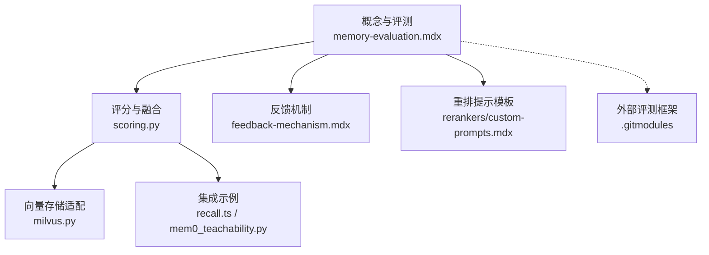
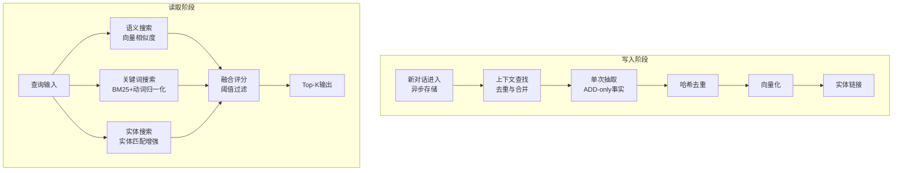
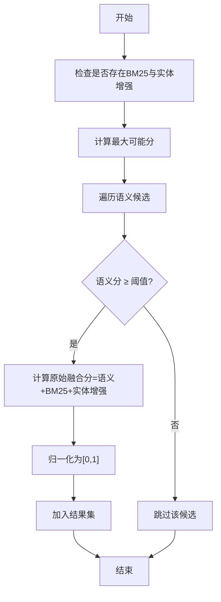
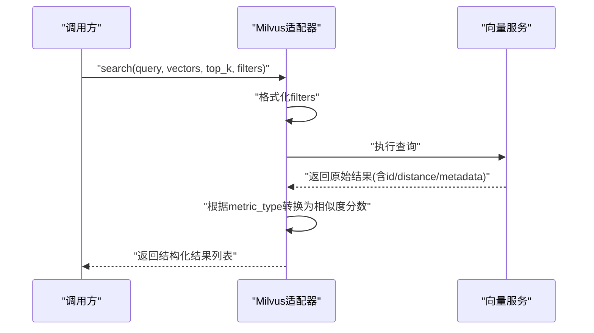
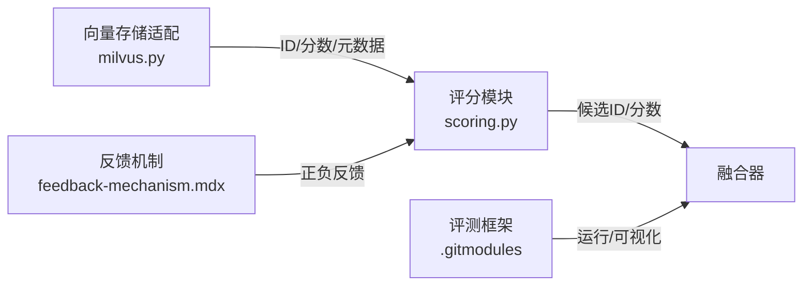

# 记忆评估

<cite>
**本文引用的文件**
- [docs/core-concepts/memory-evaluation.mdx](file://docs/core-concepts/memory-evaluation.mdx)
- [docs/platform/features/feedback-mechanism.mdx](file://docs/platform/features/feedback-mechanism.mdx)
- [docs/components/rerankers/custom-prompts.mdx](file://docs/components/rerankers/custom-prompts.mdx)
- [mem0/utils/scoring.py](file://mem0/utils/scoring.py)
- [mem0/vector_stores/milvus.py](file://mem0/vector_stores/milvus.py)
- [tests/utils/test_scoring.py](file://tests/utils/test_scoring.py)
- [examples/notebooks/helper/mem0_teachability.py](file://examples/notebooks/helper/mem0_teachability.py)
- [integrations/openclaw/recall.ts](file://integrations/openclaw/recall.ts)
- [.gitmodules](file://.gitmodules)
</cite>

## 目录
1. [简介](#简介)
2. [项目结构](#项目结构)
3. [核心组件](#核心组件)
4. [架构总览](#架构总览)
5. [详细组件分析](#详细组件分析)
6. [依赖关系分析](#依赖关系分析)
7. [性能考量](#性能考量)
8. [故障排查指南](#故障排查指南)
9. [结论](#结论)
10. [附录](#附录)

## 简介
本文件系统化阐述记忆评估功能，覆盖记忆质量评估指标、相似度与重排计算方法、检索效果分析与阈值设定，并提供可操作的记忆有效性测试、性能基准测试与A/B测试策略。同时给出评估报告生成、趋势分析与优化建议，结合实际评估场景与改进示例，帮助在生产环境中平衡准确性、成本与延迟。

## 项目结构
围绕“记忆评估”的知识与实现主要分布在以下区域：
- 概念与评测：核心评测文档（含LoCoMo、LongMemEval、BEAM等基准）、反馈机制说明
- 评分与融合：Python侧评分工具、BM25归一化与多信号融合逻辑
- 向量存储与距离策略：Milvus等向量库的相似度转换与过滤
- 集成与示例：OpenCLAW重要性权重、Teachability阈值示例
- 外部评测框架：通过子模块链接到开源评测仓库

图表来源
- [docs/core-concepts/memory-evaluation.mdx:18-62](file://docs/core-concepts/memory-evaluation.mdx#L18-L62)
- [mem0/utils/scoring.py:83-119](file://mem0/utils/scoring.py#L83-L119)
- [mem0/vector_stores/milvus.py:149-193](file://mem0/vector_stores/milvus.py#L149-L193)
- [docs/platform/features/feedback-mechanism.mdx:1-202](file://docs/platform/features/feedback-mechanism.mdx#L1-L202)
- [docs/components/rerankers/custom-prompts.mdx:87-153](file://docs/components/rerankers/custom-prompts.mdx#L87-L153)
- [integrations/openclaw/recall.ts:57-105](file://integrations/openclaw/recall.ts#L57-L105)
- [examples/notebooks/helper/mem0_teachability.py:124-151](file://examples/notebooks/helper/mem0_teachability.py#L124-L151)
- [.gitmodules:1-4](file://.gitmodules#L1-L4)

章节来源
- [docs/core-concepts/memory-evaluation.mdx:18-62](file://docs/core-concepts/memory-evaluation.mdx#L18-L62)
- [.gitmodules:1-4](file://.gitmodules#L1-L4)

## 核心组件
- 多信号检索与融合
  - 三路信号：语义相似度、关键词匹配（BM25，带动词形态归一化）、实体匹配增强
  - 融合策略：按最大可能分归一化后加权融合，支持阈值过滤与可解释细节
- 基准评测与结果格式
  - 支持LoCoMo、LongMemEval、BEAM三大基准；结果包含检索详情、生成答案、判别分数与不同Top-K截断下的表现
- 反馈机制
  - 提供正负反馈接口与批量反馈能力，支持错误处理与分析维度
- 重排提示与自定义标准
  - 支持基于任务域的多准则打分与链式推理打分模板

章节来源
- [docs/core-concepts/memory-evaluation.mdx:44-61](file://docs/core-concepts/memory-evaluation.mdx#L44-L61)
- [mem0/utils/scoring.py:83-119](file://mem0/utils/scoring.py#L83-L119)
- [docs/core-concepts/memory-evaluation.mdx:276-310](file://docs/core-concepts/memory-evaluation.mdx#L276-L310)
- [docs/platform/features/feedback-mechanism.mdx:14-202](file://docs/platform/features/feedback-mechanism.mdx#L14-L202)
- [docs/components/rerankers/custom-prompts.mdx:87-153](file://docs/components/rerankers/custom-prompts.mdx#L87-L153)

## 架构总览
下图展示了从查询到最终排序的关键流程：提取（写入）与检索（读取）双阶段，以及实体链接层；检索阶段并行计算三路信号并通过融合器输出Top-K候选。

图表来源
- [docs/core-concepts/memory-evaluation.mdx:22-42](file://docs/core-concepts/memory-evaluation.mdx#L22-L42)
- [docs/core-concepts/memory-evaluation.mdx:44-61](file://docs/core-concepts/memory-evaluation.mdx#L44-L61)

## 详细组件分析

### 组件A：评分与融合（scoring.py）
- 功能要点
  - 输入：语义候选、归一化BM25得分、实体增强、阈值、Top-K、是否解释
  - 输出：按融合分降序排列的结果列表，包含组合分与可选明细
  - 归一化：根据是否存在BM25与实体增强动态调整最大可能分，确保融合分在[0,1]
  - 过滤：仅保留语义分不低于阈值的候选
- 关键参数与权重
  - 实体增强权重：通过常量控制实体增强对融合分的影响程度
  - BM25与实体增强各贡献最多1.0，融合分经最大可能分归一化
- 测试验证
  - 单测覆盖BM25参数随查询长度变化、归一化在中点与极端值的行为

图表来源
- [mem0/utils/scoring.py:83-119](file://mem0/utils/scoring.py#L83-L119)

章节来源
- [mem0/utils/scoring.py:83-119](file://mem0/utils/scoring.py#L83-L119)
- [tests/utils/test_scoring.py:11-45](file://tests/utils/test_scoring.py#L11-L45)

### 组件B：向量存储与相似度转换（milvus.py）
- 功能要点
  - 过滤表达式拼接：支持字符串与数值元数据字段的and连接
  - 结果解析：将原始距离转换为可解释的相似度分数（如L2使用1/(1+d)映射）
  - 搜索接口：统一返回包含ID、分数与payload的结构化结果
- 性能与距离策略
  - 不同度量类型（如L2、内积、余弦）影响相似度映射方式
  - 与评测框架中的距离策略一致，便于跨平台一致性

图表来源
- [mem0/vector_stores/milvus.py:149-193](file://mem0/vector_stores/milvus.py#L149-L193)

章节来源
- [mem0/vector_stores/milvus.py:149-193](file://mem0/vector_stores/milvus.py#L149-L193)

### 组件C：反馈机制（feedback-mechanism.mdx）
- 功能要点
  - 支持正向、负向、极负反馈；可批量提交；支持移除已有反馈
  - 错误处理：针对记忆不存在与API异常的捕获与提示
  - 分析维度：完成率、分布、质量趋势、用户满意度关联
- 使用建议
  - 在检索后立即评估相关性并提交反馈
  - 保持标准一致性，提供具体原因，定期复盘模式

章节来源
- [docs/platform/features/feedback-mechanism.mdx:14-202](file://docs/platform/features/feedback-mechanism.mdx#L14-L202)

### 组件D：重排提示与自定义标准（custom-prompts.mdx）
- 功能要点
  - 教育类、个人助理类等定制提示词，支持多准则加权与链式推理
  - 通过明确权重分配（如RELEVANCE 40%、RECENCY 20%等）指导模型输出数值化相关性
- 应用场景
  - 将领域知识或业务规则转化为可执行的评分模板，提升检索意图契合度

章节来源
- [docs/components/rerankers/custom-prompts.mdx:87-153](file://docs/components/rerankers/custom-prompts.mdx#L87-L153)

### 组件E：阈值与重要性示例（recall.ts / mem0_teachability.py）
- OpenCLAW示例
  - 依据类别为记忆赋予默认重要性权重，用于后续排序或筛选
- Teachability示例
  - 以阈值过滤召回结果，避免低相关度记忆进入上下文

章节来源
- [integrations/openclaw/recall.ts:57-105](file://integrations/openclaw/recall.ts#L57-L105)
- [examples/notebooks/helper/mem0_teachability.py:124-151](file://examples/notebooks/helper/mem0_teachability.py#L124-L151)

## 依赖关系分析
- 内聚与耦合
  - 评分模块与向量存储解耦：评分仅依赖候选ID与分数，不关心底层存储实现
  - 检索阶段并行计算三路信号，融合器作为统一出口，降低信号间耦合
- 外部依赖
  - 评测框架通过子模块引入，支持独立运行与结果可视化
- 循环依赖
  - 未见循环导入；评分与向量存储通过函数调用传递数据

图表来源
- [mem0/utils/scoring.py:83-119](file://mem0/utils/scoring.py#L83-L119)
- [mem0/vector_stores/milvus.py:149-193](file://mem0/vector_stores/milvus.py#L149-L193)
- [docs/platform/features/feedback-mechanism.mdx:14-202](file://docs/platform/features/feedback-mechanism.mdx#L14-L202)
- [.gitmodules:1-4](file://.gitmodules#L1-L4)

章节来源
- [mem0/utils/scoring.py:83-119](file://mem0/utils/scoring.py#L83-L119)
- [mem0/vector_stores/milvus.py:149-193](file://mem0/vector_stores/milvus.py#L149-L193)
- [docs/platform/features/feedback-mechanism.mdx:14-202](file://docs/platform/features/feedback-mechanism.mdx#L14-L202)
- [.gitmodules:1-4](file://.gitmodules#L1-L4)

## 性能考量
- 准确性、成本与延迟的平衡
  - 评测强调在受限上下文窗口与实用令牌预算下的表现，避免仅靠扩大上下文或前沿模型获得小规模收益
- 评测指标
  - 准确率（基准分数）、平均令牌数/查询（成本）、延迟（性能）
- 结果解读
  - BEAM在10M规模下的表现更具代表性，反映真实生产环境下的可扩展性
  - 对比时需在同一检索预算、同一模型与同一延迟预算下进行

章节来源
- [docs/core-concepts/memory-evaluation.mdx:8-16](file://docs/core-concepts/memory-evaluation.mdx#L8-L16)
- [docs/core-concepts/memory-evaluation.mdx:125-141](file://docs/core-concepts/memory-evaluation.mdx#L125-L141)

## 故障排查指南
- 反馈提交常见问题
  - 记忆不存在：确认ID正确且未被删除
  - API错误：检查密钥、网络连通与服务状态
  - 批量反馈：逐条校验参数，必要时增加重试与幂等处理
- 评分异常
  - 若融合分异常或全为0，检查阈值设置、BM25与实体增强是否为空、最大可能分归一化是否生效
- 向量检索
  - 距离映射异常：核对metric_type与距离策略；确认元数据过滤条件拼接无语法错误

章节来源
- [docs/platform/features/feedback-mechanism.mdx:145-193](file://docs/platform/features/feedback-mechanism.mdx#L145-L193)
- [mem0/utils/scoring.py:83-119](file://mem0/utils/scoring.py#L83-L119)
- [mem0/vector_stores/milvus.py:149-193](file://mem0/vector_stores/milvus.py#L149-L193)

## 结论
通过多信号检索与融合评分、严格的基准评测与反馈闭环，结合阈值与领域提示模板，可在生产环境中实现高准确率、低令牌消耗与稳定延迟的综合优化。建议持续以BEAM等大上下文规模基准驱动迭代，并以反馈与趋势分析指导参数与阈值调优。

## 附录

### 评估指标与阈值设置
- 指标体系
  - 准确率：基准分数（LoCoMo/LongMemEval/BEAM）
  - 成本：平均令牌数/查询
  - 性能：检索延迟
- 阈值与Top-K
  - 语义阈值：过滤低相关候选，减少上下文开销
  - Top-K：结合任务特性选择，参考评测默认配置并做A/B验证
- 截断评估
  - 在多个Top-K（如10/50/200）下评估准确率，观察饱和效应与收益递减

章节来源
- [docs/core-concepts/memory-evaluation.mdx:178-249](file://docs/core-concepts/memory-evaluation.mdx#L178-L249)
- [docs/core-concepts/memory-evaluation.mdx:312-321](file://docs/core-concepts/memory-evaluation.mdx#L312-L321)

### 相似度计算与重排方法
- 语义相似度
  - 向量相似度（余弦/内积/L2），必要时1/(1+d)映射
- 关键词相似度
  - BM25，动词形态归一化，按查询长度动态调整参数
- 实体增强
  - 基于实体匹配的加权提升，权重由常量控制
- 融合策略
  - 原始融合分经最大可能分归一化，支持解释性明细

章节来源
- [mem0/vector_stores/milvus.py:149-193](file://mem0/vector_stores/milvus.py#L149-L193)
- [mem0/utils/scoring.py:83-119](file://mem0/utils/scoring.py#L83-L119)
- [tests/utils/test_scoring.py:11-45](file://tests/utils/test_scoring.py#L11-L45)

### 检索效果分析与报告生成
- 结果结构
  - 包含检索查询、检索结果、延迟、生成答案、判别分数与不同Top-K截断结果
- 报告维度
  - 按问题组统计准确率、平均令牌数、延迟分布
  - 对比不同阈值与Top-K下的召回-精度曲线
- 可视化
  - 使用评测UI浏览每题结果，对比多次运行差异

章节来源
- [docs/core-concepts/memory-evaluation.mdx:264-310](file://docs/core-concepts/memory-evaluation.mdx#L264-L310)

### A/B测试策略
- 变量设计
  - 阈值：0.1~0.9步进
  - Top-K：20/50/100/200
  - 融合权重：实体增强权重±10%
- 指标监控
  - 准确率、平均令牌数、P95延迟、反馈分布
- 实施建议
  - 分层抽样（按问题组与会话规模），保证统计显著性；滚动窗口对比最近N天数据

章节来源
- [docs/core-concepts/memory-evaluation.mdx:178-249](file://docs/core-concepts/memory-evaluation.mdx#L178-L249)

### 实际评估场景与改进建议
- 场景示例
  - 教育助手：使用教育类重排提示，提高学习相关性
  - 客服Agent：基于情感与行为信号的Criteria检索，优先召回积极记忆
- 改进建议
  - 引入实体增强权重的A/B验证，结合反馈分析确定最优值
  - 针对长上下文任务（BEAM 10M）逐步提升Top-K并监控成本与延迟
  - 建立阈值与Top-K的联合搜索空间网格搜索，寻找性价比最优组合

章节来源
- [docs/components/rerankers/custom-prompts.mdx:87-153](file://docs/components/rerankers/custom-prompts.mdx#L87-L153)
- [docs/platform/features/criteria-retrieval.mdx:1-30](file://docs/platform/features/criteria-retrieval.mdx#L1-L30)
- [examples/notebooks/helper/mem0_teachability.py:124-151](file://examples/notebooks/helper/mem0_teachability.py#L124-L151)