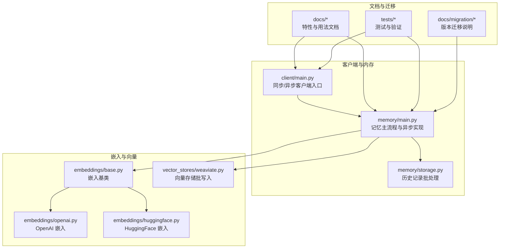
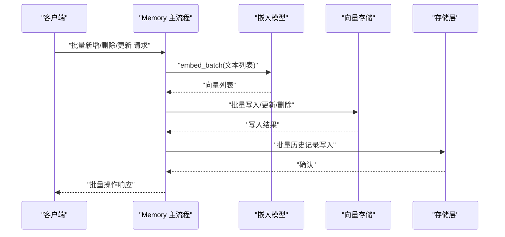
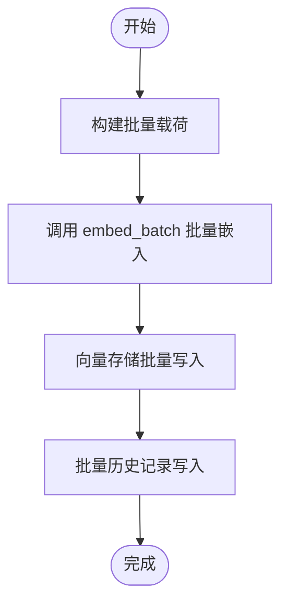
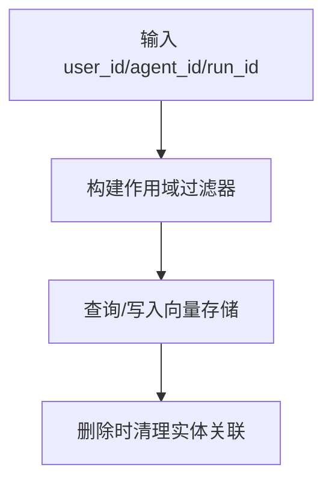
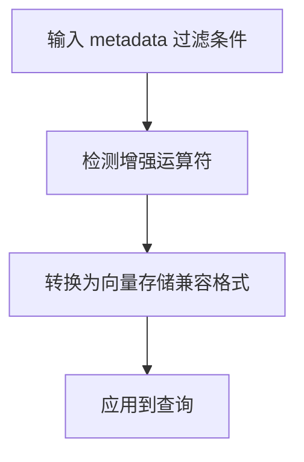
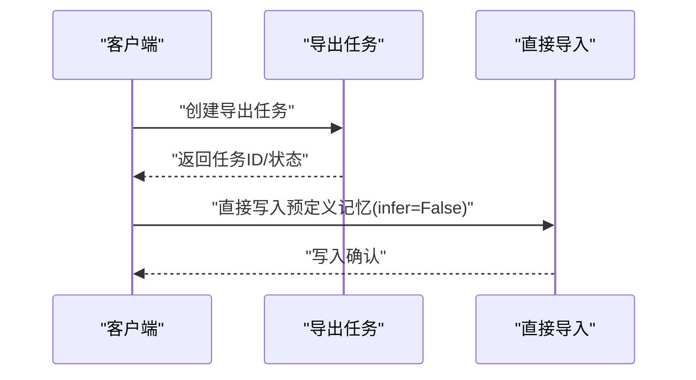
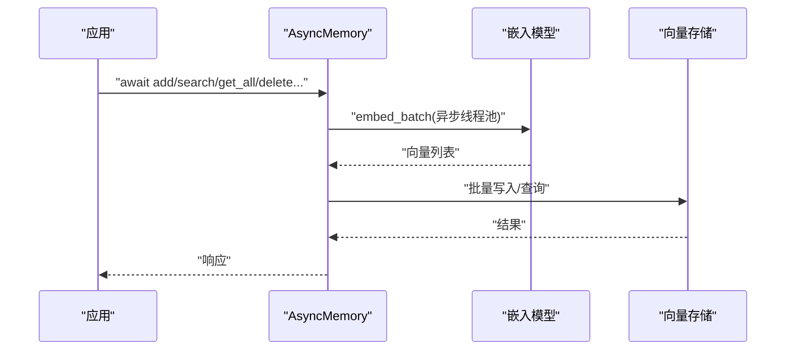
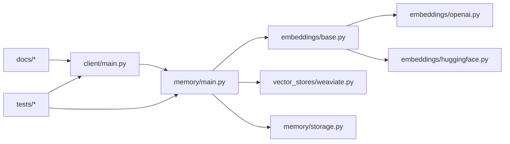

# 高级功能

<cite>
**本文引用的文件**   
- [mem0/client/main.py](file://mem0/client/main.py)
- [mem0/memory/main.py](file://mem0/memory/main.py)
- [mem0/memory/storage.py](file://mem0/memory/storage.py)
- [mem0/embeddings/base.py](file://mem0/embeddings/base.py)
- [mem0/embeddings/openai.py](file://mem0/embeddings/openai.py)
- [mem0/embeddings/huggingface.py](file://mem0/embeddings/huggingface.py)
- [mem0/vector_stores/weaviate.py](file://mem0/vector_stores/weaviate.py)
- [docs/open-source/features/async-memory.mdx](file://docs/open-source/features/async-memory.mdx)
- [docs/platform/features/memory-decay.mdx](file://docs/platform/features/memory-decay.mdx)
- [docs/platform/features/temporal-reasoning.mdx](file://docs/platform/features/temporal-reasoning.mdx)
- [docs/platform/features/feedback-mechanism.mdx](file://docs/platform/features/feedback-mechanism.mdx)
- [docs/platform/features/entity-scoped-memory.mdx](file://docs/platform/features/entity-scoped-memory.mdx)
- [docs/platform/features/memory-export.mdx](file://docs/platform/features/memory-export.mdx)
- [docs/platform/features/direct-import.mdx](file://docs/platform/features/direct-import.mdx)
- [docs/platform/advanced-memory-operations.mdx](file://docs/platform/advanced-memory-operations.mdx)
- [docs/cookbooks/essentials/entity-partitioning-playbook.mdx](file://docs/cookbooks/essentials/entity-partitioning-playbook.mdx)
- [docs/cookbooks/essentials/exporting-memories.mdx](file://docs/cookbooks/essentials/exporting-memories.mdx)
- [docs/migration/platform-v2-to-v3.mdx](file://docs/migration/platform-v2-to-v3.mdx)
- [tests/memory/test_main.py](file://tests/memory/test_main.py)
- [tests/test_telemetry.py](file://tests/test_telemetry.py)
</cite>

## 目录
1. [简介](#简介)
2. [项目结构](#项目结构)
3. [核心组件](#核心组件)
4. [架构总览](#架构总览)
5. [详细组件分析](#详细组件分析)
6. [依赖关系分析](#依赖关系分析)
7. [性能考量](#性能考量)
8. [故障排查指南](#故障排查指南)
9. [结论](#结论)
10. [附录](#附录)

## 简介
本文件面向希望深入使用 Python SDK 的高级用户，系统性梳理以下能力与实践：批量操作（批量新增、批量删除、批量更新）、实体分区（entity partitioning）、元数据过滤、记忆导出与直接导入、异步操作（AsyncMemoryClient 与 AsyncMemory）、记忆衰减、时间推理、反馈机制，以及复杂查询场景与性能优化建议。文档以仓库内现有实现与官方文档为依据，辅以可视化图示帮助理解。

## 项目结构
围绕“高级功能”的相关代码与文档主要分布在如下位置：
- 客户端与内存主流程：mem0/client/main.py、mem0/memory/main.py
- 批处理与嵌入：mem0/client/main.py、mem0/embeddings/base.py、mem0/embeddings/openai.py、mem0/embeddings/huggingface.py
- 向量存储批写入：mem0/vector_stores/weaviate.py
- 存储层历史记录批处理：mem0/memory/storage.py
- 异步能力与用法说明：docs/open-source/features/async-memory.mdx
- 高级特性文档：memory-decay.mdx、temporal-reasoning.mdx、feedback-mechanism.mdx、entity-scoped-memory.mdx、memory-export.mdx、direct-import.mdx、advanced-memory-operations.mdx
- 实体分区与导出实践：cookbooks 中的 entity-partitioning-playbook.mdx、exporting-memories.mdx
- 迁移与行为变更：migration/platform-v2-to-v3.mdx
- 测试与生命周期验证：tests/memory/test_main.py、tests/test_telemetry.py

图表来源
- [mem0/client/main.py](file://mem0/client/main.py)
- [mem0/memory/main.py](file://mem0/memory/main.py)
- [mem0/memory/storage.py](file://mem0/memory/storage.py)
- [mem0/embeddings/base.py](file://mem0/embeddings/base.py)
- [mem0/embeddings/openai.py](file://mem0/embeddings/openai.py)
- [mem0/embeddings/huggingface.py](file://mem0/embeddings/huggingface.py)
- [mem0/vector_stores/weaviate.py](file://mem0/vector_stores/weaviate.py)
- [docs/open-source/features/async-memory.mdx](file://docs/open-source/features/async-memory.mdx)
- [docs/platform/features/memory-decay.mdx](file://docs/platform/features/memory-decay.mdx)
- [docs/platform/features/temporal-reasoning.mdx](file://docs/platform/features/temporal-reasoning.mdx)
- [docs/platform/features/feedback-mechanism.mdx](file://docs/platform/features/feedback-mechanism.mdx)
- [docs/platform/features/entity-scoped-memory.mdx](file://docs/platform/features/entity-scoped-memory.mdx)
- [docs/platform/features/memory-export.mdx](file://docs/platform/features/memory-export.mdx)
- [docs/platform/features/direct-import.mdx](file://docs/platform/features/direct-import.mdx)
- [docs/platform/advanced-memory-operations.mdx](file://docs/platform/advanced-memory-operations.mdx)
- [docs/cookbooks/essentials/entity-partitioning-playbook.mdx](file://docs/cookbooks/essentials/entity-partitioning-playbook.mdx)
- [docs/cookbooks/essentials/exporting-memories.mdx](file://docs/cookbooks/essentials/exporting-memories.mdx)
- [docs/migration/platform-v2-to-v3.mdx](file://docs/migration/platform-v2-to-v3.mdx)
- [tests/memory/test_main.py](file://tests/memory/test_main.py)
- [tests/test_telemetry.py](file://tests/test_telemetry.py)

章节来源
- [mem0/client/main.py](file://mem0/client/main.py)
- [mem0/memory/main.py](file://mem0/memory/main.py)
- [mem0/memory/storage.py](file://mem0/memory/storage.py)
- [mem0/embeddings/base.py](file://mem0/embeddings/base.py)
- [mem0/embeddings/openai.py](file://mem0/embeddings/openai.py)
- [mem0/embeddings/huggingface.py](file://mem0/embeddings/huggingface.py)
- [mem0/vector_stores/weaviate.py](file://mem0/vector_stores/weaviate.py)
- [docs/open-source/features/async-memory.mdx](file://docs/open-source/features/async-memory.mdx)
- [docs/platform/features/memory-decay.mdx](file://docs/platform/features/memory-decay.mdx)
- [docs/platform/features/temporal-reasoning.mdx](file://docs/platform/features/temporal-reasoning.mdx)
- [docs/platform/features/feedback-mechanism.mdx](file://docs/platform/features/feedback-mechanism.mdx)
- [docs/platform/features/entity-scoped-memory.mdx](file://docs/platform/features/entity-scoped-memory.mdx)
- [docs/platform/features/memory-export.mdx](file://docs/platform/features/memory-export.mdx)
- [docs/platform/features/direct-import.mdx](file://docs/platform/features/direct-import.mdx)
- [docs/platform/advanced-memory-operations.mdx](file://docs/platform/advanced-memory-operations.mdx)
- [docs/cookbooks/essentials/entity-partitioning-playbook.mdx](file://docs/cookbooks/essentials/entity-partitioning-playbook.mdx)
- [docs/cookbooks/essentials/exporting-memories.mdx](file://docs/cookbooks/essentials/exporting-memories.mdx)
- [docs/migration/platform-v2-to-v3.mdx](file://docs/migration/platform-v2-to-v3.mdx)
- [tests/memory/test_main.py](file://tests/memory/test_main.py)
- [tests/test_telemetry.py](file://tests/test_telemetry.py)

## 核心组件
- 同步与异步客户端：支持批量新增、批量删除、批量更新；异步版本通过 AsyncMemoryClient 与 AsyncMemory 提供非阻塞 I/O。
- 记忆主流程：负责消息到记忆的抽取、嵌入、向量存储、历史记录与实体清理。
- 嵌入模型：统一的 embed_batch 接口，支持批量文本向量化，便于批处理路径优化。
- 向量存储：部分后端支持批量写入，降低网络往返开销。
- 元数据过滤：在查询阶段对 metadata 字段进行增强过滤，支持运算符转换。
- 实体分区：基于 user_id、agent_id、run_id 构建作用域，实现跨会话与多智能体的记忆隔离。
- 导出与直接导入：支持导出任务创建与直接导入模式（跳过推断）。
- 反馈机制：支持对单条记忆进行评分或标注，用于后续重排序与检索优化。
- 记忆衰减与时间推理：平台特性，强调随时间变化的事实保留与排序策略。

章节来源
- [mem0/client/main.py](file://mem0/client/main.py)
- [mem0/memory/main.py](file://mem0/memory/main.py)
- [mem0/embeddings/base.py](file://mem0/embeddings/base.py)
- [mem0/vector_stores/weaviate.py](file://mem0/vector_stores/weaviate.py)
- [docs/platform/features/memory-decay.mdx](file://docs/platform/features/memory-decay.mdx)
- [docs/platform/features/temporal-reasoning.mdx](file://docs/platform/features/temporal-reasoning.mdx)
- [docs/platform/features/feedback-mechanism.mdx](file://docs/platform/features/feedback-mechanism.mdx)
- [docs/platform/features/entity-scoped-memory.mdx](file://docs/platform/features/entity-scoped-memory.mdx)
- [docs/platform/features/memory-export.mdx](file://docs/platform/features/memory-export.mdx)
- [docs/platform/features/direct-import.mdx](file://docs/platform/features/direct-import.mdx)

## 架构总览
下图展示从客户端到嵌入、向量存储与历史记录的端到端流程，突出批量路径与异步执行点。

图表来源
- [mem0/client/main.py](file://mem0/client/main.py)
- [mem0/memory/main.py](file://mem0/memory/main.py)
- [mem0/embeddings/base.py](file://mem0/embeddings/base.py)
- [mem0/vector_stores/weaviate.py](file://mem0/vector_stores/weaviate.py)
- [mem0/memory/storage.py](file://mem0/memory/storage.py)

## 详细组件分析

### 批量操作（批量新增、批量删除、批量更新）
- 同步与异步客户端均提供批量接口，事件上报区分 sync/async 类型，便于观测与排障。
- 批量路径中，嵌入模型统一走 embed_batch，向量存储可利用后端的批量写入能力，减少往返次数。
- 存储层提供批量历史记录写入，确保操作审计与可追溯性。

图表来源
- [mem0/client/main.py](file://mem0/client/main.py)
- [mem0/memory/main.py](file://mem0/memory/main.py)
- [mem0/embeddings/base.py](file://mem0/embeddings/base.py)
- [mem0/vector_stores/weaviate.py](file://mem0/vector_stores/weaviate.py)
- [mem0/memory/storage.py](file://mem0/memory/storage.py)

章节来源
- [mem0/client/main.py](file://mem0/client/main.py)
- [mem0/memory/main.py](file://mem0/memory/main.py)
- [mem0/embeddings/base.py](file://mem0/embeddings/base.py)
- [mem0/vector_stores/weaviate.py](file://mem0/vector_stores/weaviate.py)
- [mem0/memory/storage.py](file://mem0/memory/storage.py)

### 实体分区（entity partitioning）
- 通过 user_id、agent_id、run_id 构建作用域，确保不同用户、智能体与运行会话之间的记忆相互隔离。
- 在过滤与查询时，这些字段作为基础过滤条件参与构建，保证检索范围可控。
- 删除记忆时，还会清理实体存储中的关联记录，避免悬挂引用。

图表来源
- [mem0/memory/main.py](file://mem0/memory/main.py)

章节来源
- [mem0/memory/main.py](file://mem0/memory/main.py)

### 元数据过滤
- 支持在查询阶段对 metadata 字段进行增强过滤，包含运算符转换逻辑，将高级过滤表达式转换为向量存储兼容格式。
- 该能力允许按标签、类型、来源等维度精细筛选记忆，满足复杂检索需求。

图表来源
- [mem0/memory/main.py](file://mem0/memory/main.py)

章节来源
- [mem0/memory/main.py](file://mem0/memory/main.py)

### 记忆导出与直接导入
- 导出：通过导出任务接口创建导出任务，后续轮询获取导出结果，适合跨环境迁移与备份。
- 直接导入：设置 infer=False 跳过推断阶段，直接将预定义记忆写入存储，适用于已知事实的高效入库。

图表来源
- [docs/platform/features/memory-export.mdx](file://docs/platform/features/memory-export.mdx)
- [docs/platform/features/direct-import.mdx](file://docs/platform/features/direct-import.mdx)

章节来源
- [docs/platform/features/memory-export.mdx](file://docs/platform/features/memory-export.mdx)
- [docs/platform/features/direct-import.mdx](file://docs/platform/features/direct-import.mdx)

### 异步操作（AsyncMemoryClient 与 AsyncMemory）
- 方法对等：异步版本提供与同步 API 对应的操作集合，保持参数形状一致，便于复用。
- 并发执行：利用 asyncio.gather 并行调度多个记忆任务，降低总体延迟。
- 生命周期与可观测性：提供日志装饰器示例，记录耗时与异常，便于生产监控。

图表来源
- [docs/open-source/features/async-memory.mdx](file://docs/open-source/features/async-memory.mdx)
- [mem0/client/main.py](file://mem0/client/main.py)
- [mem0/memory/main.py](file://mem0/memory/main.py)

章节来源
- [docs/open-source/features/async-memory.mdx](file://docs/open-source/features/async-memory.mdx)
- [mem0/client/main.py](file://mem0/client/main.py)
- [mem0/memory/main.py](file://mem0/memory/main.py)

### 记忆衰减、时间推理与反馈机制
- 记忆衰减：平台特性，强调随时间变化的事实保留与排序策略，避免覆盖导致的信息丢失。
- 时间推理：新算法不再覆盖旧记忆，而是保留多条事实并通过多信号检索提升当前相关性权重。
- 反馈机制：支持对记忆进行评分/标注，辅助后续重排序与检索优化。

章节来源
- [docs/platform/features/memory-decay.mdx](file://docs/platform/features/memory-decay.mdx)
- [docs/platform/features/temporal-reasoning.mdx](file://docs/platform/features/temporal-reasoning.mdx)
- [docs/platform/features/feedback-mechanism.mdx](file://docs/platform/features/feedback-mechanism.mdx)
- [docs/migration/platform-v2-to-v3.mdx](file://docs/migration/platform-v2-to-v3.mdx)

### 复杂查询场景与实现要点
- 组合过滤：结合实体作用域与元数据过滤，形成多维约束。
- 增强元数据过滤：利用运算符转换，实现更灵活的检索条件。
- 批量路径：在查询前先做批量嵌入与索引准备，减少重复计算。
- 实体清理：删除记忆后同步清理实体关联，防止脏数据。

章节来源
- [mem0/memory/main.py](file://mem0/memory/main.py)

## 依赖关系分析
- 客户端依赖内存主流程；内存主流程依赖嵌入模型与向量存储；存储层依赖历史记录批处理。
- 异步路径通过线程池包装阻塞操作，避免阻塞事件循环。
- 文档与测试共同验证异步生命周期与批处理正确性。

图表来源
- [mem0/client/main.py](file://mem0/client/main.py)
- [mem0/memory/main.py](file://mem0/memory/main.py)
- [mem0/embeddings/base.py](file://mem0/embeddings/base.py)
- [mem0/embeddings/openai.py](file://mem0/embeddings/openai.py)
- [mem0/embeddings/huggingface.py](file://mem0/embeddings/huggingface.py)
- [mem0/vector_stores/weaviate.py](file://mem0/vector_stores/weaviate.py)
- [mem0/memory/storage.py](file://mem0/memory/storage.py)
- [docs/open-source/features/async-memory.mdx](file://docs/open-source/features/async-memory.mdx)
- [tests/memory/test_main.py](file://tests/memory/test_main.py)
- [tests/test_telemetry.py](file://tests/test_telemetry.py)

章节来源
- [mem0/client/main.py](file://mem0/client/main.py)
- [mem0/memory/main.py](file://mem0/memory/main.py)
- [mem0/embeddings/base.py](file://mem0/embeddings/base.py)
- [mem0/embeddings/openai.py](file://mem0/embeddings/openai.py)
- [mem0/embeddings/huggingface.py](file://mem0/embeddings/huggingface.py)
- [mem0/vector_stores/weaviate.py](file://mem0/vector_stores/weaviate.py)
- [mem0/memory/storage.py](file://mem0/memory/storage.py)
- [docs/open-source/features/async-memory.mdx](file://docs/open-source/features/async-memory.mdx)
- [tests/memory/test_main.py](file://tests/memory/test_main.py)
- [tests/test_telemetry.py](file://tests/test_telemetry.py)

## 性能考量
- 批处理优先：尽可能使用 embed_batch 与向量存储的批量写入，减少网络往返。
- 异步并发：在高吞吐场景使用 asyncio.gather 并行处理多个请求，但注意控制并发度避免资源争用。
- 线程池隔离：将阻塞操作放入线程池，避免阻塞事件循环。
- 查询优化：合理使用实体作用域与元数据过滤，缩小检索空间；必要时缓存热点查询结果。
- 存储层优化：根据向量存储后端特性调整批大小与超时参数，平衡吞吐与延迟。

## 故障排查指南
- 初始化失败：检查配置与环境变量，确保依赖可用。
- 操作缓慢：关注数据规模与网络延迟，考虑缓存与参数调优。
- 记忆未找到：核对 ID 来源与软删除状态。
- 连接超时：增加重试与退避策略，检查基础设施健康状况。
- 内存溢出：减小并发或拆分批次，避免一次性处理过大集合。
- 异步生命周期：通过日志装饰器记录耗时与异常，定位问题根因。

章节来源
- [docs/open-source/features/async-memory.mdx](file://docs/open-source/features/async-memory.mdx)
- [tests/memory/test_main.py](file://tests/memory/test_main.py)
- [tests/test_telemetry.py](file://tests/test_telemetry.py)

## 结论
本文从架构与实现角度梳理了 Python SDK 的高级功能，重点覆盖批量操作、实体分区、元数据过滤、导出/导入、异步执行、记忆衰减、时间推理与反馈机制。结合文档与测试，读者可在复杂查询与高并发场景中获得稳健的实践指导与性能优化建议。

## 附录
- 实体分区最佳实践与导出流程参考：cookbooks 中的实体分区与导出指南。
- 行为变更与迁移说明：平台 v2 到 v3 的迁移文档，解释新增的记忆累积与时间推理策略。

章节来源
- [docs/cookbooks/essentials/entity-partitioning-playbook.mdx](file://docs/cookbooks/essentials/entity-partitioning-playbook.mdx)
- [docs/cookbooks/essentials/exporting-memories.mdx](file://docs/cookbooks/essentials/exporting-memories.mdx)
- [docs/migration/platform-v2-to-v3.mdx](file://docs/migration/platform-v2-to-v3.mdx)