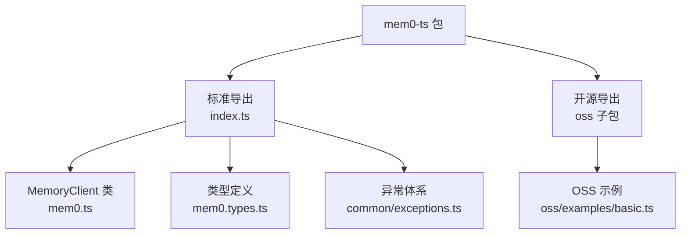
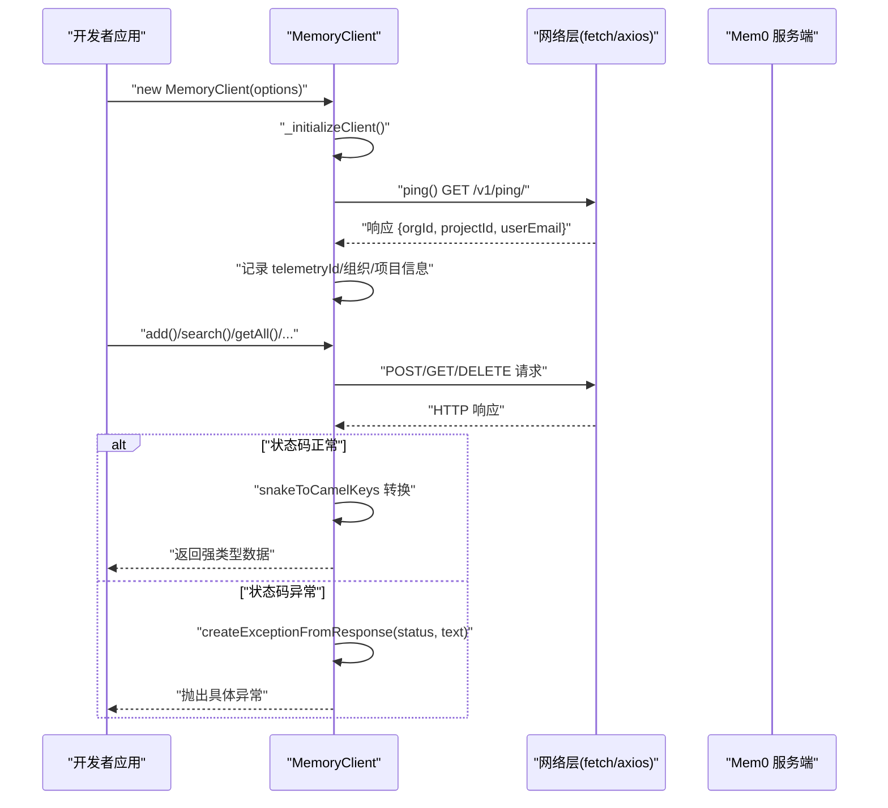
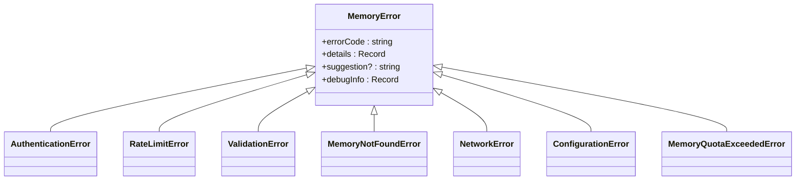
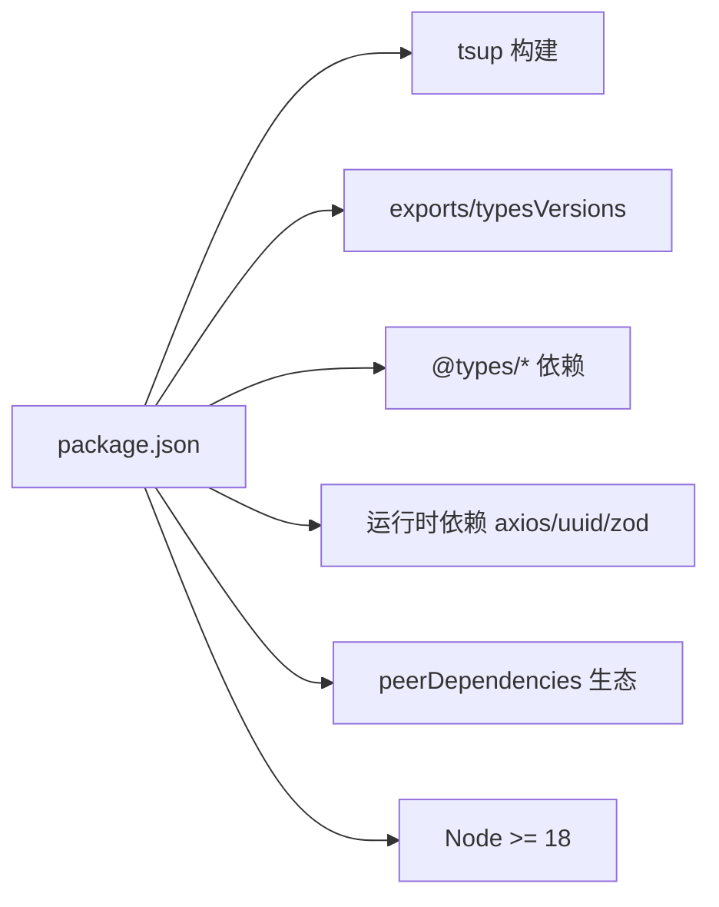

# TypeScript/Node.js SDK 使用指南

<cite>
**本文档引用的文件**
- [mem0-ts/src/client/index.ts](file://mem0-ts/src/client/index.ts)
- [mem0-ts/src/client/mem0.ts](file://mem0-ts/src/client/mem0.ts)
- [mem0-ts/src/client/mem0.types.ts](file://mem0-ts/src/client/mem0.types.ts)
- [mem0-ts/src/common/exceptions.ts](file://mem0-ts/src/common/exceptions.ts)
- [mem0-ts/package.json](file://mem0-ts/package.json)
- [mem0-ts/tsconfig.json](file://mem0-ts/tsconfig.json)
- [mem0-ts/README.md](file://mem0-ts/README.md)
- [mem0-ts/src/oss/examples/basic.ts](file://mem0-ts/src/oss/examples/basic.ts)
</cite>

## 目录
1. [简介](#简介)
2. [项目结构](#项目结构)
3. [核心组件](#核心组件)
4. [架构总览](#架构总览)
5. [详细组件分析](#详细组件分析)
6. [依赖关系分析](#依赖关系分析)
7. [性能考虑](#性能考虑)
8. [故障排查指南](#故障排查指南)
9. [结论](#结论)
10. [附录](#附录)

## 简介
本指南面向在 TypeScript/Node.js 环境下使用 Mem0 SDK 的开发者，涵盖安装、配置、类型定义、异步处理（Promise/async-await）、类型安全示例、与 Next.js/Express 等框架集成、客户端配置、错误处理与性能监控最佳实践，以及从 JavaScript 迁移到 TypeScript 的步骤建议。

## 项目结构
mem0-ts 包含两类主要导出路径：
- 标准云版 SDK：通过默认导出 MemoryClient 提供云端 API 能力
- 开源版 SDK：通过子路径导出，支持本地向量库、嵌入模型与 LLM 的自托管能力



图表来源
- [mem0-ts/src/client/index.ts:1-49](file://mem0-ts/src/client/index.ts#L1-L49)
- [mem0-ts/src/client/mem0.ts:82-742](file://mem0-ts/src/client/mem0.ts#L82-L742)
- [mem0-ts/src/client/mem0.types.ts:1-229](file://mem0-ts/src/client/mem0.types.ts#L1-L229)
- [mem0-ts/src/common/exceptions.ts:1-206](file://mem0-ts/src/common/exceptions.ts#L1-L206)
- [mem0-ts/src/oss/examples/basic.ts:1-328](file://mem0-ts/src/oss/examples/basic.ts#L1-L328)

章节来源
- [mem0-ts/src/client/index.ts:1-49](file://mem0-ts/src/client/index.ts#L1-L49)
- [mem0-ts/package.json:18-29](file://mem0-ts/package.json#L18-L29)

## 核心组件
- MemoryClient：SDK 的核心类，封装所有云端 API 操作（添加、查询、搜索、删除、历史、用户、项目、Webhook、反馈、导出等），统一进行请求发送、错误转换与遥测上报。
- 类型系统：通过 mem0.types.ts 定义了 AddMemoryOptions、SearchMemoryOptions、GetAllMemoryOptions、DeleteAllMemoryOptions、ProjectOptions、Memory、MemoryHistory、Message、Feedback、Webhook、FeedbackPayload、CreateMemoryExportPayload、GetMemoryExportPayload 等完整类型，确保调用端具备强类型体验。
- 异常体系：通过 exceptions.ts 提供 MemoryError 及其子类（AuthenticationError、RateLimitError、ValidationError、MemoryNotFoundError、NetworkError、ConfigurationError、MemoryQuotaExceededError），并提供 createExceptionFromResponse 工具函数将 HTTP 状态映射为具体异常类型，便于统一捕获与处理。
- 导出策略：index.ts 对外 re-export 所有类型与异常，并导出 MemoryClient 作为默认导出；同时对枚举值也以“值”形式导出，便于运行时使用。

章节来源
- [mem0-ts/src/client/mem0.ts:82-742](file://mem0-ts/src/client/mem0.ts#L82-L742)
- [mem0-ts/src/client/mem0.types.ts:1-229](file://mem0-ts/src/client/mem0.types.ts#L1-L229)
- [mem0-ts/src/common/exceptions.ts:1-206](file://mem0-ts/src/common/exceptions.ts#L1-L206)
- [mem0-ts/src/client/index.ts:5-49](file://mem0-ts/src/client/index.ts#L5-L49)

## 架构总览
SDK 的调用流程遵循“构造客户端 -> 初始化校验 -> 发起请求 -> 错误转换 -> 返回结果”的模式。内部包含遥测初始化、匿名 ID 别名、事件采集等辅助逻辑。



图表来源
- [mem0-ts/src/client/mem0.ts:125-250](file://mem0-ts/src/client/mem0.ts#L125-L250)
- [mem0-ts/src/client/mem0.ts:183-198](file://mem0-ts/src/client/mem0.ts#L183-L198)
- [mem0-ts/src/common/exceptions.ts:191-205](file://mem0-ts/src/common/exceptions.ts#L191-L205)

## 详细组件分析

### MemoryClient 类
- 职责：封装所有云端内存操作接口，负责请求构建、参数转换（驼峰/蛇形互转）、错误处理与遥测上报。
- 关键方法：
  - add：添加记忆，支持消息数组与实体标识、元数据、时间戳等选项
  - search：基于查询词与过滤条件检索相关记忆
  - getAll：分页获取记忆列表，支持过滤器与字段选择
  - get/update/delete/history：单条记忆的读取、更新、删除与历史查询
  - deleteAll/batchUpdate/batchDelete：批量管理
  - users/deleteUsers：用户实体管理
  - getProject/updateProject：项目级提示词与分类配置
  - getWebhooks/createWebhook/updateWebhook/deleteWebhook：Webhook 生命周期
  - feedback：提交反馈
  - createMemoryExport/getMemoryExport：导出任务创建与查询
- 参数校验：拒绝顶层直接传入 user_id/agent_id/app_id/run_id 等实体参数，必须放入 filters 中；否则抛错
- 错误处理：统一通过 _fetchWithErrorHandling 捕获非 OK 响应，使用 createExceptionFromResponse 映射为具体异常类型
- 遥测：初始化时生成 telemetryId，事件上报通过 _captureEvent 记录方法名与参数键

```mermaid
classDiagram
class MemoryClient {
+apiKey : string
+host : string
+organizationId : string|number|null
+projectId : string|number|null
+headers : Record<string,string>
+constructor(options)
+ping() : Promise<void>
+add(messages, options) : Promise<Memory[]>
+search(query, options?) : Promise<{results : Memory[]}>
+getAll(options?) : Promise<PaginatedMemories>
+get(memoryId) : Promise<Memory>
+update(memoryId, payload) : Promise<Memory[]>
+delete(memoryId, options?) : Promise<{message : string}>
+deleteAll(options?) : Promise<{message : string}>
+history(memoryId) : Promise<MemoryHistory[]>
+users(options?) : Promise<AllUsers>
+deleteUsers(params?) : Promise<{message : string}>
+batchUpdate(memories) : Promise<string>
+batchDelete(memoryIds) : Promise<string>
+getProject(options) : Promise<ProjectResponse>
+updateProject(prompts) : Promise<Record<string,any>>
+getWebhooks(data?) : Promise<Webhook[]>
+createWebhook(webhook) : Promise<Webhook>
+updateWebhook(webhook) : Promise<{message : string}>
+deleteWebhook(data) : Promise<{message : string}>
+feedback(data) : Promise<{message : string}>
+createMemoryExport(data) : Promise<{message : string,id : string}>
+getMemoryExport(data) : Promise<{message : string,id : string}>
-_fetchWithErrorHandling(url, options) : Promise<any>
-_captureEvent(name, args) : void
}
```

图表来源
- [mem0-ts/src/client/mem0.ts:82-742](file://mem0-ts/src/client/mem0.ts#L82-L742)

章节来源
- [mem0-ts/src/client/mem0.ts:252-738](file://mem0-ts/src/client/mem0.ts#L252-L738)

### 类型系统与枚举
- 方法选项类型：AddMemoryOptions、SearchMemoryOptions、GetAllMemoryOptions、DeleteAllMemoryOptions、ProjectOptions 等，均支持 filters、元数据、阈值、排序等参数
- 数据模型：Memory、MemoryHistory、User、AllUsers、PaginatedMemories、ProjectResponse 等
- 消息与反馈：Messages/MultiModalMessages、Feedback 枚举（POSITIVE/NEGATIVE/VERY_NEGATIVE）
- Webhook：Webhook、WebhookEvent 枚举、WebhookCreatePayload/WebhookUpdatePayload
- 导出：CreateMemoryExportPayload、GetMemoryExportPayload
- 枚举导出：index.ts 将 Feedback、WebhookEvent 以“值”形式导出，便于运行时判断

章节来源
- [mem0-ts/src/client/mem0.types.ts:1-229](file://mem0-ts/src/client/mem0.types.ts#L1-L229)
- [mem0-ts/src/client/index.ts:5-29](file://mem0-ts/src/client/index.ts#L5-L29)

### 异常体系
- MemoryError 为基础异常类，派生出 AuthenticationError、RateLimitError、ValidationError、MemoryNotFoundError、NetworkError、ConfigurationError、MemoryQuotaExceededError
- HTTP 状态到异常类型的映射表，以及通用建议文案
- createExceptionFromResponse：根据状态码与响应文本创建具体异常实例



图表来源
- [mem0-ts/src/common/exceptions.ts:35-140](file://mem0-ts/src/common/exceptions.ts#L35-L140)

章节来源
- [mem0-ts/src/common/exceptions.ts:142-205](file://mem0-ts/src/common/exceptions.ts#L142-L205)

### 异步处理与 Promise/async-await
- 所有公开方法均返回 Promise，推荐使用 async/await 语法进行调用
- SDK 内部统一通过 _fetchWithErrorHandling 处理网络请求与错误转换
- 在调用前可先执行 ping() 校验 API Key 有效性并初始化 telemetryId

章节来源
- [mem0-ts/src/client/mem0.ts:215-250](file://mem0-ts/src/client/mem0.ts#L215-L250)
- [mem0-ts/README.md:50-52](file://mem0-ts/README.md#L50-L52)

### 类型安全示例
- 添加记忆：传入消息数组与实体标识（如 userId），返回 Memory[]
- 搜索记忆：传入查询词与可选 filters/topK/threshold 等，返回包含 results 的对象
- 获取/更新/删除：按记忆 ID 操作，返回标准化后的 Memory 或成功消息
- 批量操作：批量更新与批量删除，传入记忆 ID 列表或更新体列表
- 项目配置：getProject 支持 fields 字段筛选；updateProject 支持自定义指令、分类、检索条件等
- Webhook：增删改查与事件类型枚举
- 导出：createMemoryExport 与 getMemoryExport，支持 filters 与 schema

章节来源
- [mem0-ts/src/client/mem0.ts:252-738](file://mem0-ts/src/client/mem0.ts#L252-L738)
- [mem0-ts/src/client/mem0.types.ts:10-229](file://mem0-ts/src/client/mem0.types.ts#L10-L229)

### 与 Next.js/Express 集成
- Next.js：可在 app router 或 pages router 中使用 async/await 调用 MemoryClient；注意在边缘运行时需遵守平台限制（例如 fetch 的使用）。建议在服务端组件或 API 路由中初始化客户端并在请求期间复用
- Express：在路由处理器中初始化 MemoryClient，使用 async/await 处理请求与响应；将错误通过异常体系转换为 HTTP 状态码与友好消息

（本节为概念性说明，不直接分析具体文件）

### 客户端配置
- 必填项：apiKey（字符串，不能为空）
- 可选项：host（默认 https://api.mem0.ai）
- 初始化：构造函数会校验 API Key 并发起 ping 校验；若启用遥测，会尝试将匿名 ID 与邮箱进行别名关联
- 事件上报：每个公开方法调用都会记录一次事件，包含方法名与参数键集合

章节来源
- [mem0-ts/src/client/mem0.ts:77-123](file://mem0-ts/src/client/mem0.ts#L77-L123)
- [mem0-ts/src/client/mem0.ts:125-171](file://mem0-ts/src/client/mem0.ts#L125-L171)

### 错误处理与性能监控
- 错误处理：优先捕获具体异常类型（如 MemoryNotFoundError、RateLimitError），并结合 suggestion 与 debugInfo 进行重试或降级
- 性能监控：通过 _captureEvent 上报方法调用次数、参数键等指标；初始化阶段会记录 client_type 与错误详情
- 建议：在生产环境设置合理的超时与重试策略；对高频调用进行缓存与去重

章节来源
- [mem0-ts/src/common/exceptions.ts:191-205](file://mem0-ts/src/common/exceptions.ts#L191-L205)
- [mem0-ts/src/client/mem0.ts:173-181](file://mem0-ts/src/client/mem0.ts#L173-L181)

### 从 JavaScript 迁移到 TypeScript
- 安装依赖：确保已安装 TypeScript、@types/node 与相关 LLM/向量库类型
- 配置编译：使用 tsconfig.json 的严格模式与模块解析策略；确保 include/exclude 覆盖 src 目录
- 类型导入：优先使用命名空间导入与类型断言，逐步替换 any
- 异步重构：将回调改为 Promise/async-await；为每个函数签名补充返回值类型
- 错误处理：引入异常体系，避免裸抛字符串或任意值

章节来源
- [mem0-ts/tsconfig.json:1-34](file://mem0-ts/tsconfig.json#L1-L34)
- [mem0-ts/package.json:87-101](file://mem0-ts/package.json#L87-L101)

## 依赖关系分析
- 构建与打包：tsup 生成 cjs/esm 两种格式，dts 自动解析；exports 与 typesVersions 精确映射主入口与 oss 子包
- 运行时依赖：axios、uuid、zod；peerDependencies 覆盖主流 LLM 与向量库生态
- 引擎要求：Node >= 18



图表来源
- [mem0-ts/package.json:18-70](file://mem0-ts/package.json#L18-L70)

章节来源
- [mem0-ts/package.json:102-128](file://mem0-ts/package.json#L102-L128)

## 性能考虑
- 请求超时：默认 60 秒，可根据网络环境调整
- 分页查询：getAll/search 支持分页与过滤，避免一次性拉取过多数据
- 批量操作：优先使用 batchUpdate/batchDelete 减少往返
- 缓存策略：对频繁访问的记忆 ID 与搜索结果进行短期缓存
- 重试与退避：对 RateLimitError 与 NetworkError 实施指数退避重试

（本节提供通用建议，不直接分析具体文件）

## 故障排查指南
- API Key 无效：检查构造函数参数与环境变量；首次调用会触发 ping 校验
- 参数错误：确认实体参数必须放入 filters；否则会抛出参数非法错误
- 网络异常：捕获 NetworkError 并进行重试；检查 host 与防火墙
- 速率限制：捕获 RateLimitError，等待 retryAfter 后重试
- 资源未找到：捕获 MemoryNotFoundError，确认记忆 ID 与实体标识是否正确
- 导出失败：检查 filters 与 schema 是否完整

章节来源
- [mem0-ts/src/client/mem0.ts:55-68](file://mem0-ts/src/client/mem0.ts#L55-L68)
- [mem0-ts/src/common/exceptions.ts:150-181](file://mem0-ts/src/common/exceptions.ts#L150-L181)

## 结论
mem0-ts SDK 提供了完善的类型系统、异常体系与异步调用支持，适用于 Node.js 与浏览器环境。通过严格的类型约束与统一的错误处理，开发者可以更安全地在 TypeScript 项目中集成长期记忆能力。配合 Next.js/Express 等框架，可快速搭建具备上下文记忆的智能应用。

## 附录

### 安装与基础配置
- 安装：使用包管理器安装 mem0ai
- 配置：在运行环境中设置 API Key；如需本地向量库与 LLM，请参考 OSS 示例中的配置方式

章节来源
- [mem0-ts/README.md:8-14](file://mem0-ts/README.md#L8-L14)
- [mem0-ts/README.md:16-18](file://mem0-ts/README.md#L16-L18)

### OSS 示例参考
- 基础示例：演示默认配置、内存增删改查、搜索与历史查询
- 向量库示例：覆盖内存、PGVector、Qdrant、Redis 等多种存储后端

章节来源
- [mem0-ts/src/oss/examples/basic.ts:1-328](file://mem0-ts/src/oss/examples/basic.ts#L1-L328)