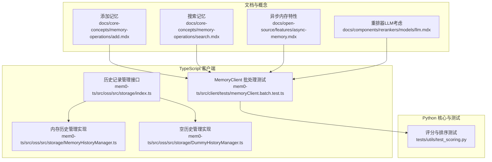
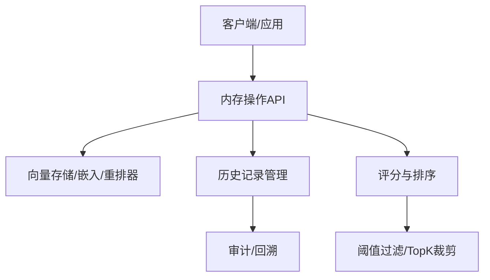
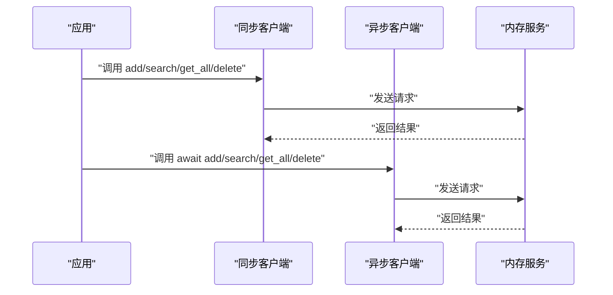
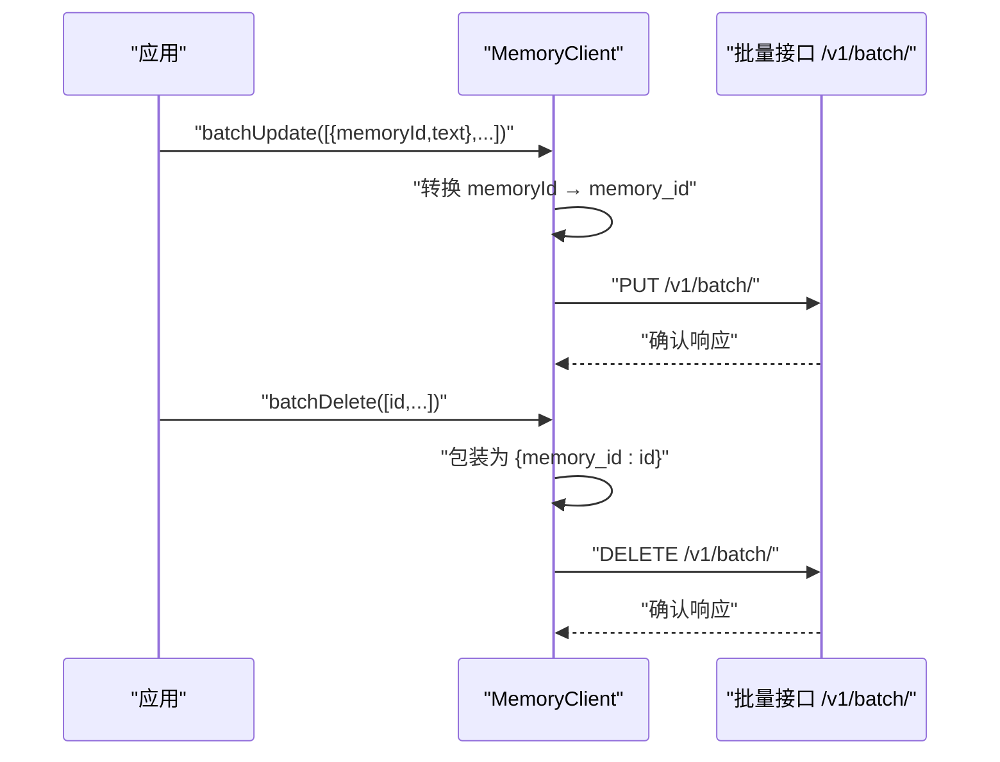
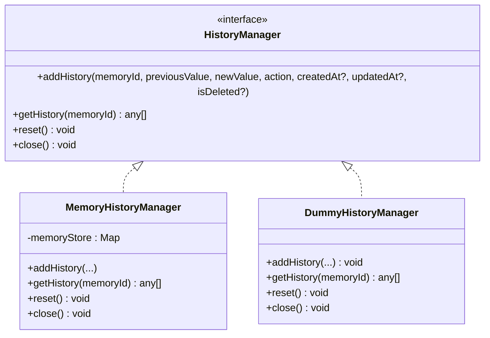
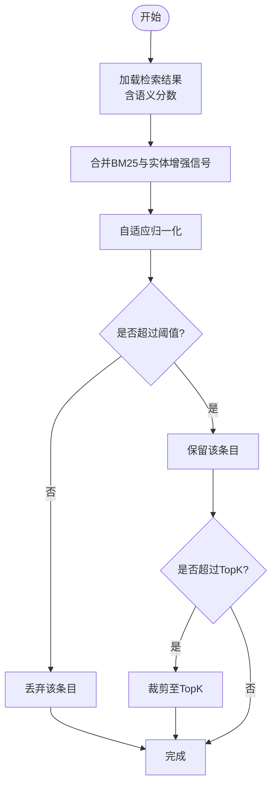
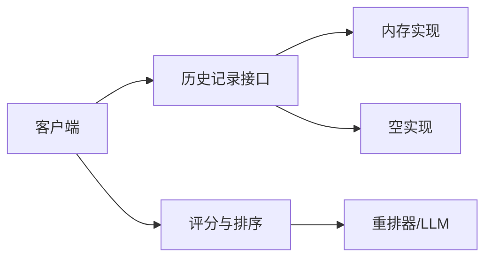

# 内存操作

<cite>
**本文引用的文件**
- [add.mdx](file://docs/core-concepts/memory-operations/add.mdx)
- [search.mdx](file://docs/core-concepts/memory-operations/search.mdx)
- [batch.test.ts](file://mem0-ts/src/client/tests/memoryClient.batch.test.ts)
- [storage.unit.test.ts](file://mem0-ts/src/oss/tests/storage.unit.test.ts)
- [MemoryHistoryManager.ts](file://mem0-ts/src/oss/src/storage/MemoryHistoryManager.ts)
- [DummyHistoryManager.ts](file://mem0-ts/src/oss/src/storage/DummyHistoryManager.ts)
- [index.ts](file://mem0-ts/src/oss/src/storage/index.ts)
- [test_scoring.py](file://tests/utils/test_scoring.py)
- [async-memory.mdx](file://docs/open-source/features/async-memory.mdx)
- [llm.mdx](file://docs/components/rerankers/models/llm.mdx)
</cite>

## 目录
1. [简介](#简介)
2. [项目结构](#项目结构)
3. [核心组件](#核心组件)
4. [架构总览](#架构总览)
5. [详细组件分析](#详细组件分析)
6. [依赖关系分析](#依赖关系分析)
7. [性能考量](#性能考量)
8. [故障排查指南](#故障排查指南)
9. [结论](#结论)
10. [附录](#附录)

## 简介
本指南聚焦于“内存操作”的完整使用方法与最佳实践，覆盖以下主题：
- 标准同步与异步方法：添加、搜索、更新、删除记忆
- 批量操作：批量更新与批量删除的实现与注意事项
- 实体分区与元数据过滤：如何通过用户、代理、运行等作用域隔离记忆
- 时间戳与历史记录：变更审计与回溯
- 检索策略：语义相似度、BM25、实体增强与综合评分排序
- 上下文增强与历史管理：高级用法与集成建议

## 项目结构
围绕“内存操作”，本仓库的关键位置如下：
- 文档层（概念与特性）：docs/core-concepts/memory-operations/* 与 docs/open-source/features/*
- TypeScript 客户端与存储：mem0-ts/src/client 与 mem0-ts/src/oss/src/storage
- Python 核心逻辑与测试：mem0/memory/*、mem0/client/* 与 tests/*

**图表来源**
- [add.mdx](file://docs/core-concepts/memory-operations/add.mdx)
- [search.mdx](file://docs/core-concepts/memory-operations/search.mdx)
- [async-memory.mdx](file://docs/open-source/features/async-memory.mdx)
- [llm.mdx](file://docs/components/rerankers/models/llm.mdx)
- [batch.test.ts](file://mem0-ts/src/client/tests/memoryClient.batch.test.ts)
- [index.ts](file://mem0-ts/src/oss/src/storage/index.ts)
- [MemoryHistoryManager.ts](file://mem0-ts/src/oss/src/storage/MemoryHistoryManager.ts)
- [DummyHistoryManager.ts](file://mem0-ts/src/oss/src/storage/DummyHistoryManager.ts)
- [test_scoring.py](file://tests/utils/test_scoring.py)

**章节来源**
- [add.mdx](file://docs/core-concepts/memory-operations/add.mdx)
- [search.mdx](file://docs/core-concepts/memory-operations/search.mdx)
- [async-memory.mdx](file://docs/open-source/features/async-memory.mdx)
- [llm.mdx](file://docs/components/rerankers/models/llm.mdx)
- [batch.test.ts](file://mem0-ts/src/client/tests/memoryClient.batch.test.ts)
- [index.ts](file://mem0-ts/src/oss/src/storage/index.ts)
- [MemoryHistoryManager.ts](file://mem0-ts/src/oss/src/storage/MemoryHistoryManager.ts)
- [DummyHistoryManager.ts](file://mem0-ts/src/oss/src/storage/DummyHistoryManager.ts)
- [test_scoring.py](file://tests/utils/test_scoring.py)

## 核心组件
- 同步与异步客户端：支持标准增删改查与批量操作；异步版本提供并发执行能力与更低延迟的本地存储访问。
- 历史记录管理：提供内存级变更审计，支持按记忆ID查询变更序列，便于审计与回滚。
- 评分与排序：综合语义相似度、BM25与实体增强信号，支持阈值过滤与TopK裁剪，并可输出评分明细用于调试。

**章节来源**
- [async-memory.mdx](file://docs/open-source/features/async-memory.mdx)
- [MemoryHistoryManager.ts](file://mem0-ts/src/oss/src/storage/MemoryHistoryManager.ts)
- [DummyHistoryManager.ts](file://mem0-ts/src/oss/src/storage/DummyHistoryManager.ts)
- [test_scoring.py](file://tests/utils/test_scoring.py)

## 架构总览
下图展示了从客户端到历史记录管理与评分排序的整体交互：

**图表来源**
- [async-memory.mdx](file://docs/open-source/features/async-memory.mdx)
- [MemoryHistoryManager.ts](file://mem0-ts/src/oss/src/storage/MemoryHistoryManager.ts)
- [test_scoring.py](file://tests/utils/test_scoring.py)

## 详细组件分析

### 同步与异步内存操作
- 方法对等性：异步版本保留与同步API一致的参数形状，便于复用。
- 并发执行：利用非阻塞I/O与并发调度，提升批量任务吞吐。
- 作用域组织：继续使用 user_id、agent_id、run_id 进行跨会话与代理的记忆隔离。

**图表来源**
- [async-memory.mdx](file://docs/open-source/features/async-memory.mdx)

**章节来源**
- [async-memory.mdx](file://docs/open-source/features/async-memory.mdx)

### 批量操作：批量更新与批量删除
- 批量更新：将 memoryId 转换为 memory_id 字段后提交；空数组安全处理。
- 批量删除：将字符串ID包装为包含 memory_id 的对象列表；空数组安全处理。
- 测试验证：单元测试覆盖请求路径、字段转换与边界条件。

**图表来源**
- [batch.test.ts](file://mem0-ts/src/client/tests/memoryClient.batch.test.ts)

**章节来源**
- [batch.test.ts](file://mem0-ts/src/client/tests/memoryClient.batch.test.ts)

### 历史记录与时间戳管理
- 历史记录模型：包含 memory_id、previous_value、new_value、action、created_at、updated_at、is_deleted 等字段。
- 查询排序：按 created_at 降序返回，限制返回条目数量。
- 隔离与审计：按 memory_id 进行隔离，支持审计与回滚场景。
- 接口导出：通过统一入口导出不同实现（内存、空实现等），便于替换与测试。

**图表来源**
- [MemoryHistoryManager.ts](file://mem0-ts/src/oss/src/storage/MemoryHistoryManager.ts)
- [DummyHistoryManager.ts](file://mem0-ts/src/oss/src/storage/DummyHistoryManager.ts)
- [index.ts](file://mem0-ts/src/oss/src/storage/index.ts)

**章节来源**
- [MemoryHistoryManager.ts](file://mem0-ts/src/oss/src/storage/MemoryHistoryManager.ts)
- [DummyHistoryManager.ts](file://mem0-ts/src/oss/src/storage/DummyHistoryManager.ts)
- [index.ts](file://mem0-ts/src/oss/src/storage/index.ts)
- [storage.unit.test.ts](file://mem0-ts/src/oss/tests/storage.unit.test.ts)

### 检索策略、评分与排序
- 综合评分：融合语义相似度、BM25与实体增强信号，采用自适应归一化，支持阈值过滤与TopK裁剪。
- 评分明细：可选输出评分细节，便于调试与可观测性。
- 重排器LLM：具备成本与一致性权衡，建议使用零温度、精心设计提示与缓存策略。

**图表来源**
- [test_scoring.py](file://tests/utils/test_scoring.py)

**章节来源**
- [test_scoring.py](file://tests/utils/test_scoring.py)
- [llm.mdx](file://docs/components/rerankers/models/llm.mdx)

### 实体分区、元数据过滤与时间戳
- 实体分区：通过 user_id、agent_id、run_id 等作用域参数进行分区，确保不同实体间的数据隔离。
- 元数据过滤：在搜索时结合元数据字段进行过滤，以缩小候选集并提高相关性。
- 时间戳管理：历史记录按 created_at 降序排列，支持审计与回溯。

**章节来源**
- [async-memory.mdx](file://docs/open-source/features/async-memory.mdx)
- [MemoryHistoryManager.ts](file://mem0-ts/src/oss/src/storage/MemoryHistoryManager.ts)

### 上下文增强与历史记录管理（高级）
- 上下文增强：在检索或生成阶段引入历史上下文，提升对话连贯性与个性化。
- 历史记录管理：结合历史记录与评分排序，构建可审计、可回滚的记忆系统。

**章节来源**
- [MemoryHistoryManager.ts](file://mem0-ts/src/oss/src/storage/MemoryHistoryManager.ts)
- [test_scoring.py](file://tests/utils/test_scoring.py)

## 依赖关系分析
- 客户端对历史记录管理的抽象依赖：通过接口与具体实现解耦，便于替换为数据库或远程存储。
- 评分模块独立于检索实现：可在不同检索后端上复用评分与排序逻辑。
- 异步客户端与同步客户端共享相同数据契约，降低迁移成本。

**图表来源**
- [index.ts](file://mem0-ts/src/oss/src/storage/index.ts)
- [MemoryHistoryManager.ts](file://mem0-ts/src/oss/src/storage/MemoryHistoryManager.ts)
- [DummyHistoryManager.ts](file://mem0-ts/src/oss/src/storage/DummyHistoryManager.ts)
- [test_scoring.py](file://tests/utils/test_scoring.py)
- [llm.mdx](file://docs/components/rerankers/models/llm.mdx)

**章节来源**
- [index.ts](file://mem0-ts/src/oss/src/storage/index.ts)
- [MemoryHistoryManager.ts](file://mem0-ts/src/oss/src/storage/MemoryHistoryManager.ts)
- [DummyHistoryManager.ts](file://mem0-ts/src/oss/src/storage/DummyHistoryManager.ts)
- [test_scoring.py](file://tests/utils/test_scoring.py)
- [llm.mdx](file://docs/components/rerankers/models/llm.mdx)

## 性能考量
- 异步并发：利用异步客户端并发调度多个任务，减少整体等待时间。
- 批量接口：优先使用批量更新/删除，降低网络往返与状态切换开销。
- 评分与排序：合理设置阈值与TopK，避免返回过多低质量结果；必要时启用评分明细辅助定位问题。
- 重排器成本：LLM重排器存在延迟与成本，建议在高价值场景使用并配合缓存与错误处理。

[本节为通用指导，无需列出具体文件来源]

## 故障排查指南
- 批量操作异常
  - 症状：请求未到达预期端点或请求体字段不正确
  - 排查：检查客户端是否正确将 memoryId 转换为 memory_id，以及空数组是否被正确传递
  - 参考：[批量测试用例](file://mem0-ts/src/client/tests/memoryClient.batch.test.ts)
- 历史记录为空或顺序异常
  - 症状：查询历史为空或排序不符合预期
  - 排查：确认 memory_id 是否正确、created_at 是否按降序返回、是否超过最大返回条数限制
  - 参考：[历史记录测试用例](file://mem0-ts/src/oss/tests/storage.unit.test.ts)、[历史记录实现](file://mem0-ts/src/oss/src/storage/MemoryHistoryManager.ts)
- 评分与排序异常
  - 症状：最终分数超出范围或缺少评分明细
  - 排查：确认输入分数与权重归一化逻辑，必要时开启 explain 输出
  - 参考：[评分与排序测试](file://tests/utils/test_scoring.py)

**章节来源**
- [batch.test.ts](file://mem0-ts/src/client/tests/memoryClient.batch.test.ts)
- [storage.unit.test.ts](file://mem0-ts/src/oss/tests/storage.unit.test.ts)
- [MemoryHistoryManager.ts](file://mem0-ts/src/oss/src/storage/MemoryHistoryManager.ts)
- [test_scoring.py](file://tests/utils/test_scoring.py)

## 结论
通过同步与异步客户端、批量操作、历史记录管理与评分排序的组合，可以构建高性能、可审计且可扩展的记忆系统。建议在生产中结合实体分区、元数据过滤与合理的阈值/TopK策略，以获得更佳的相关性与性能表现。

[本节为总结性内容，无需列出具体文件来源]

## 附录
- 快速参考
  - 添加记忆：遵循文档中的参数与作用域约定
  - 搜索记忆：结合元数据过滤与评分排序
  - 更新/删除：优先使用批量接口以提升吞吐
  - 历史记录：按 memory_id 查询变更序列，用于审计与回滚

[本节为概览性内容，无需列出具体文件来源]