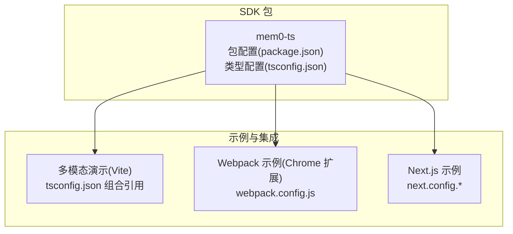
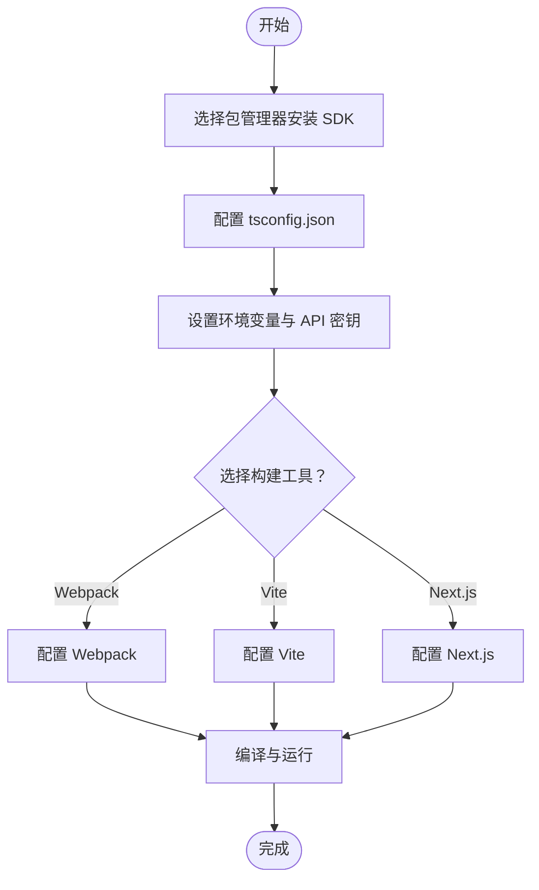
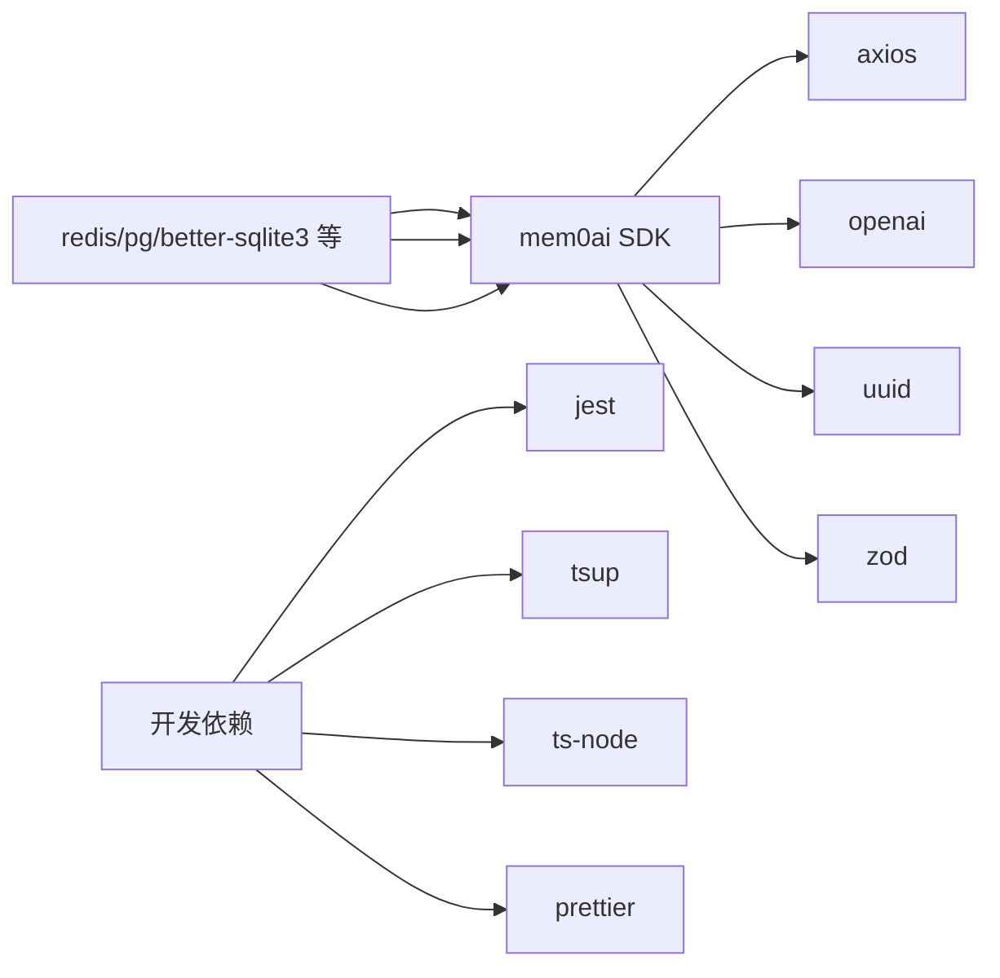

# 安装和配置

<cite>
**本文引用的文件**
- [mem0-ts 包配置](file://mem0-ts/package.json)
- [mem0-ts 类型配置](file://mem0-ts/tsconfig.json)
- [mem0-ts 说明文档](file://mem0-ts/README.md)
- [多模态示例包配置](file://examples/multimodal-demo/package.json)
- [多模态示例类型配置（组合）](file://examples/multimodal-demo/tsconfig.json)
- [多模态示例应用类型配置](file://examples/multimodal-demo/tsconfig.app.json)
- [多模态示例节点类型配置](file://examples/multimodal-demo/tsconfig.node.json)
- [CLI 类型配置](file://cli/node/tsconfig.json)
- [CLI 包配置](file://cli/node/package.json)
- [Chrome 扩展 Webpack 配置](file://examples/yt-assistant-chrome/webpack.config.js)
- [Vite 配置（多模态演示）](file://examples/multimodal-demo/vite.config.ts)
- [Vite 配置（Vercel AI SDK 演示）](file://examples/vercel-ai-sdk-chat-app/vite.config.ts)
- [Next.js 配置（mem0 示例）](file://examples/mem0-demo/next.config.ts)
- [Next.js 配置（OpenMemory UI）](file://openmemory/ui/next.config.mjs)
- [Next.js 配置（Dashboard）](file://server/dashboard/next.config.mjs)
</cite>

## 目录
1. [简介](#简介)
2. [项目结构](#项目结构)
3. [核心组件](#核心组件)
4. [架构总览](#架构总览)
5. [详细组件分析](#详细组件分析)
6. [依赖分析](#依赖分析)
7. [性能考虑](#性能考虑)
8. [故障排除指南](#故障排除指南)
9. [结论](#结论)
10. [附录](#附录)

## 简介
本指南面向希望在 TypeScript/Node.js 环境中使用 Mem0 TypeScript SDK 的开发者，涵盖以下内容：
- 通过 npm、yarn、pnpm 安装 SDK 的步骤与注意事项
- tsconfig.json 的关键配置项与最佳实践
- 环境变量与 API 密钥设置建议
- 基础项目结构搭建要点
- 与 Webpack、Vite、Next.js 等构建工具的集成配置
- 类型声明文件的使用与自定义类型扩展方法

## 项目结构
该仓库包含多个与 SDK 使用相关的示例与配置，其中与安装和配置最相关的是：
- mem0-ts：SDK 核心包及其构建与类型配置
- examples/multimodal-demo：基于 Vite 的前端示例，展示 tsconfig 多引用与 bundler 模式
- examples/yt-assistant-chrome：基于 Webpack 的浏览器扩展示例
- server/dashboard、openmemory/ui：基于 Next.js 的服务端渲染示例
- cli/node：CLI 工具的类型与打包配置

**图表来源**
- [mem0-ts 包配置:1-162](file://mem0-ts/package.json#L1-L162)
- [mem0-ts 类型配置:1-34](file://mem0-ts/tsconfig.json#L1-L34)
- [多模态示例类型配置（组合）:1-14](file://examples/multimodal-demo/tsconfig.json#L1-L14)
- [Chrome 扩展 Webpack 配置](file://examples/yt-assistant-chrome/webpack.config.js)
- [Next.js 配置（mem0 示例）](file://examples/mem0-demo/next.config.ts)
- [Next.js 配置（OpenMemory UI）](file://openmemory/ui/next.config.mjs)
- [Next.js 配置（Dashboard）](file://server/dashboard/next.config.mjs)

**章节来源**
- [mem0-ts 包配置:1-162](file://mem0-ts/package.json#L1-L162)
- [mem0-ts 类型配置:1-34](file://mem0-ts/tsconfig.json#L1-L34)
- [多模态示例类型配置（组合）:1-14](file://examples/multimodal-demo/tsconfig.json#L1-L14)

## 核心组件
- SDK 包与导出
  - 主入口与子路径导出均提供 ESM/CJS 两种格式，并生成对应的类型声明文件，便于在不同模块系统中使用。
  - 提供 oss 子路径导出，用于开放源码版本的功能别名或扩展。
- 构建与打包
  - 使用 tsup 进行构建，开启 dts 解析、树摇优化、源码映射等，确保产物质量与可调试性。
  - 将 @mem0/community 设为外部依赖，避免将社区包打包进主包。
- 类型与兼容性
  - tsconfig.json 启用严格模式、模块解析为 node、支持 JSX、路径映射等，适配 Node 与浏览器场景。
  - peerDependencies 覆盖主流 LLM、向量库、数据库等生态，便于按需安装。

**章节来源**
- [mem0-ts 包配置:18-70](file://mem0-ts/package.json#L18-L70)
- [mem0-ts 类型配置:3-30](file://mem0-ts/tsconfig.json#L3-L30)

## 架构总览
下图展示了从安装到运行的关键流程：选择包管理器安装 SDK → 配置 tsconfig → 设置环境变量与 API 密钥 → 在不同构建工具中集成 → 编译与运行。

[此图为概念性流程图，不直接映射具体源文件，故无“图表来源”标注]

## 详细组件分析

### 安装与包管理器选择
- 支持的包管理器
  - npm、yarn、pnpm 均可使用，仓库内多处使用 pnpm 并在包配置中声明了 pnpm 版本与 overrides。
- 安装命令
  - 可参考 SDK 说明文档中的安装示例进行安装。
- 注意事项
  - 若使用 pnpm，请确保版本满足要求；若使用 npm/yarn，请确认 Node 版本满足 engines 字段要求（>=18）。

**章节来源**
- [mem0-ts 包配置:129-135](file://mem0-ts/package.json#L129-L135)
- [mem0-ts 说明文档:10-14](file://mem0-ts/README.md#L10-L14)

### tsconfig.json 配置详解与最佳实践
- 关键配置项
  - 目标与模块：ES2018/ESNext，配合 Node 环境与现代浏览器。
  - 模块解析：node，保证与 CommonJS 生态兼容。
  - 严格模式：启用，提升类型安全。
  - JSX：react-jsx，适用于 React 项目。
  - 路径映射：@/* -> ./src/*，便于统一导入路径。
  - 其他：声明文件生成、源码映射、跳过库检查、隔离模块等。
- 最佳实践
  - 在前端项目中优先采用 bundler 模式（如 Vite），并在 tsconfig 中使用 Bundler 对应的 moduleResolution 与 moduleDetection。
  - 保持 skipLibCheck 为 true，减少第三方库类型检查开销。
  - 在 monorepo 中使用复合项目（references）组织多个 tsconfig 文件，分离应用与节点侧配置。

**章节来源**
- [mem0-ts 类型配置:3-30](file://mem0-ts/tsconfig.json#L3-L30)
- [多模态示例类型配置（组合）:1-14](file://examples/multimodal-demo/tsconfig.json#L1-L14)
- [多模态示例应用类型配置:16-22](file://examples/multimodal-demo/tsconfig.app.json#L16-L22)
- [多模态示例节点类型配置:9-14](file://examples/multimodal-demo/tsconfig.node.json#L9-L14)

### 环境变量与 API 密钥设置
- 环境变量
  - SDK 依赖 axios 与 openai 等库，通常需要配置网络代理、超时等环境变量以适配企业网络。
  - 如使用云平台版本，需准备并注入 API 密钥。
- API 密钥
  - 云平台版本请在控制台获取密钥；开放源码版本通常无需密钥即可本地运行。
- 实践建议
  - 将敏感信息放入 .env 文件并通过 dotenv 加载（开发期）。
  - 在 CI/CD 中通过机密变量注入，避免硬编码。

**章节来源**
- [mem0-ts 包配置:102-128](file://mem0-ts/package.json#L102-L128)
- [mem0-ts 说明文档:16-18](file://mem0-ts/README.md#L16-L18)

### 基础项目结构搭建
- 目录建议
  - src：存放源代码
  - dist：存放构建输出（由 tsup/编译器生成）
  - tests：测试目录（如 jest）
- 配置文件
  - package.json：定义脚本、依赖、导出与打包配置
  - tsconfig.json：统一类型检查与编译目标
- 开发体验
  - 使用 nodemon/tsup watch 模式提升迭代效率
  - Jest 配置用于单元与集成测试

**章节来源**
- [mem0-ts 包配置:33-46](file://mem0-ts/package.json#L33-L46)
- [mem0-ts 类型配置:10-11](file://mem0-ts/tsconfig.json#L10-L11)

### 与 Webpack 集成配置
- 典型场景
  - 浏览器扩展、Electron 应用等需要 Webpack 打包的项目。
- 关键点
  - 保持模块解析与 tsconfig 一致，避免路径解析差异导致的导入失败。
  - 在 Webpack 中正确处理 .ts/.tsx 文件与资源文件。
  - 若使用 esbuild 等预处理器，确保与 tsconfig 的 target/module 保持一致。
- 参考
  - 仓库提供了 Chrome 扩展示例的 webpack.config.js，可作为起点。

**章节来源**
- [Chrome 扩展 Webpack 配置](file://examples/yt-assistant-chrome/webpack.config.js)

### 与 Vite 集成配置
- 推荐做法
  - 使用 Vite 时，建议在 tsconfig 中采用 bundler 模式（moduleResolution: Bundler），并启用 moduleDetection: force。
  - 多入口/多页面项目可结合 tsconfig 的 references 组织多个 tsconfig 文件。
- 参考
  - 多模态演示与 Vercel AI SDK 演示均提供了 vite.config.ts，可作为集成模板。

**章节来源**
- [多模态示例应用类型配置:16-22](file://examples/multimodal-demo/tsconfig.app.json#L16-L22)
- [Vite 配置（多模态演示）](file://examples/multimodal-demo/vite.config.ts)
- [Vite 配置（Vercel AI SDK 演示）](file://examples/vercel-ai-sdk-chat-app/vite.config.ts)

### 与 Next.js 集成配置
- 场景
  - SSR/CSR 混合应用、服务端渲染、静态生成等。
- 关键点
  - 保持 tsconfig 的 strict 与 isolatedModules，避免在服务端/客户端混用时出现类型问题。
  - 注意路径别名与模块解析一致性，确保在不同运行环境中导入正常。
- 参考
  - mem0 示例、OpenMemory UI、Dashboard 均提供了 next.config.*，可作为参考。

**章节来源**
- [Next.js 配置（mem0 示例）](file://examples/mem0-demo/next.config.ts)
- [Next.js 配置（OpenMemory UI）](file://openmemory/ui/next.config.mjs)
- [Next.js 配置（Dashboard）](file://server/dashboard/next.config.mjs)

### 类型声明文件的使用与自定义类型扩展
- 使用方式
  - SDK 在 exports 与 typesVersions 中为根路径与 oss 子路径分别提供类型声明文件，确保 IDE 与编译器能正确识别。
  - 在 tsconfig 中启用 declaration 与 declarationMap，有助于调试与二次开发。
- 自定义类型扩展
  - 在项目中新增全局类型或模块声明时，建议放在 src/global.d.ts 或独立的类型声明文件中，并通过 tsconfig 的 include/exclude 控制范围。
  - 若需扩展 SDK 类型，可在项目根目录新增类型合并文件，确保与现有类型体系兼容。

**章节来源**
- [mem0-ts 包配置:8-29](file://mem0-ts/package.json#L8-L29)
- [mem0-ts 类型配置:7-9](file://mem0-ts/tsconfig.json#L7-L9)

## 依赖分析
- 直接依赖
  - axios：HTTP 请求
  - openai：OpenAI 相关能力
  - uuid、zod：标识符与数据校验
- 开发依赖
  - jest、tsup、ts-node、prettier 等，支撑测试、构建与格式化
- Peer 依赖
  - LLM SDK、向量库、数据库驱动等，按需安装以避免重复打包与版本冲突

**图表来源**
- [mem0-ts 包配置:102-128](file://mem0-ts/package.json#L102-L128)
- [mem0-ts 包配置:87-101](file://mem0-ts/package.json#L87-L101)

**章节来源**
- [mem0-ts 包配置:102-128](file://mem0-ts/package.json#L102-L128)

## 性能考虑
- 构建优化
  - 启用 treeshake 与最小化关闭策略，平衡包体大小与调试成本
  - 使用 sourcemap 便于定位问题
- 运行时优化
  - 在浏览器端使用 bundler 模式与模块检测，减少运行时解析开销
  - 严格模式与跳过库检查可降低编译与运行时负担
- 网络与缓存
  - 合理设置请求超时与重试策略，避免阻塞主线程

[本节为通用指导，不直接分析具体文件，故无“章节来源”标注]

## 故障排除指南
- Node 版本不匹配
  - 确认 Node 版本满足 engines 字段要求（>=18）
- 模块解析错误
  - 检查 tsconfig 的 moduleResolution 与构建工具是否一致
  - 确保路径映射（paths）与实际目录结构一致
- 类型检查失败
  - 在 monorepo 中使用复合项目（references）组织 tsconfig
  - 保持 skipLibCheck 与 isolatedModules 配置一致
- 构建失败
  - 清理 dist 目录后重新构建
  - 确认 peerDependencies 已正确安装对应 SDK/驱动

**章节来源**
- [mem0-ts 包配置:129-131](file://mem0-ts/package.json#L129-L131)
- [mem0-ts 类型配置:13-14](file://mem0-ts/tsconfig.json#L13-L14)
- [CLI 类型配置:2-14](file://cli/node/tsconfig.json#L2-L14)

## 结论
通过遵循本指南，您可以在 TypeScript/Node.js 环境中高效地安装与配置 Mem0 SDK，并根据项目需求选择合适的构建工具与类型配置。建议在团队内统一 tsconfig 与构建策略，以减少跨环境差异带来的问题。

[本节为总结性内容，不直接分析具体文件，故无“章节来源”标注]

## 附录
- 快速清单
  - 选择包管理器并安装 SDK
  - 配置 tsconfig.json（含路径映射与严格模式）
  - 设置环境变量与 API 密钥
  - 选择并配置构建工具（Webpack/Vite/Next.js）
  - 运行测试与构建，验证功能

[本节为补充性内容，不直接分析具体文件，故无“章节来源”标注]