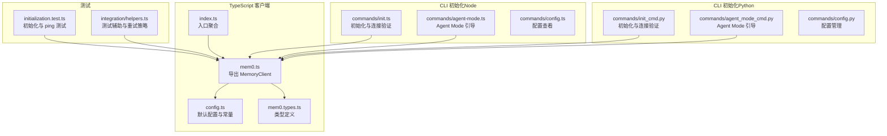
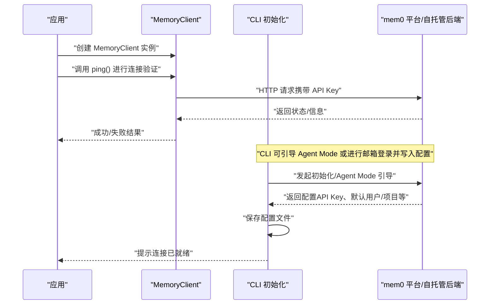
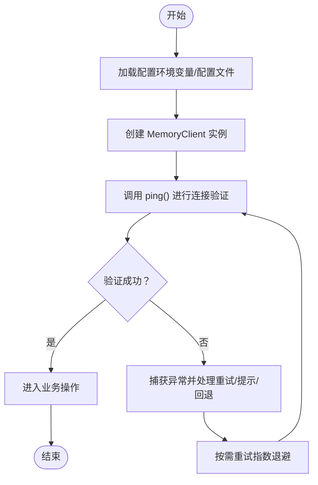
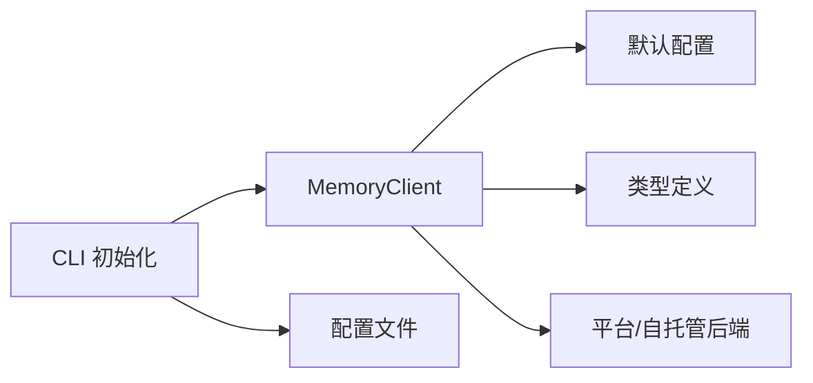

# 客户端初始化

<cite>
**本文引用的文件**
- [mem0.ts](file://mem0-ts/src/client/mem0.ts)
- [index.ts](file://mem0-ts/src/client/index.ts)
- [config.ts](file://mem0-ts/src/client/config.ts)
- [mem0.types.ts](file://mem0-ts/src/client/mem0.types.ts)
- [initialization.test.ts](file://mem0-ts/src/client/tests/integration/initialization.test.ts)
- [helpers.ts](file://mem0-ts/src/client/tests/integration/helpers.ts)
- [init.ts](file://cli/node/src/commands/init.ts)
- [agent-mode.ts](file://cli/node/src/commands/agent-mode.ts)
- [config.ts](file://cli/node/src/commands/config.ts)
- [init_cmd.py](file://cli/python/src/mem0_cli/commands/init_cmd.py)
- [agent_mode_cmd.py](file://cli/python/src/mem0_cli/commands/agent_mode_cmd.py)
- [config.ts](file://cli/python/src/mem0_cli/commands/config.py)
</cite>

## 目录
1. [简介](#简介)
2. [项目结构](#项目结构)
3. [核心组件](#核心组件)
4. [架构总览](#架构总览)
5. [详细组件分析](#详细组件分析)
6. [依赖关系分析](#依赖关系分析)
7. [性能考虑](#性能考虑)
8. [故障排除指南](#故障排除指南)
9. [结论](#结论)
10. [附录](#附录)

## 简介
本指南面向需要在应用中集成并正确初始化 mem0 客户端的开发者，重点覆盖 TypeScript/JavaScript 客户端 MemoryClient 的创建与配置、部署模式（自托管与云平台）的连接设置、初始化示例（含错误处理与连接验证）、客户端生命周期管理与资源清理，以及多项目配置与环境隔离的最佳实践。

## 项目结构
与客户端初始化直接相关的核心位置如下：
- TypeScript 客户端：mem0-ts/src/client 下的入口、配置与类型定义
- 测试用例：mem0-ts/src/client/tests/integration 中的初始化测试与辅助工具
- CLI 初始化流程（Node 与 Python）：用于理解真实环境下的初始化与连接验证
- 配置管理：CLI 提供的配置查看与导出能力

图表来源
- [mem0.ts](file://mem0-ts/src/client/mem0.ts)
- [config.ts](file://mem0-ts/src/client/config.ts)
- [mem0.types.ts](file://mem0-ts/src/client/mem0.types.ts)
- [index.ts](file://mem0-ts/src/client/index.ts)
- [initialization.test.ts](file://mem0-ts/src/client/tests/integration/initialization.test.ts)
- [helpers.ts](file://mem0-ts/src/client/tests/integration/helpers.ts)
- [init.ts](file://cli/node/src/commands/init.ts)
- [agent-mode.ts](file://cli/node/src/commands/agent-mode.ts)
- [config.ts](file://cli/node/src/commands/config.ts)
- [init_cmd.py](file://cli/python/src/mem0_cli/commands/init_cmd.py)
- [agent_mode_cmd.py](file://cli/python/src/mem0_cli/commands/agent_mode_cmd.py)
- [config.py](file://cli/python/src/mem0_cli/commands/config.py)

章节来源
- [mem0.ts](file://mem0-ts/src/client/mem0.ts)
- [config.ts](file://mem0-ts/src/client/config.ts)
- [mem0.types.ts](file://mem0-ts/src/client/mem0.types.ts)
- [index.ts](file://mem0-ts/src/client/index.ts)
- [initialization.test.ts](file://mem0-ts/src/client/tests/integration/initialization.test.ts)
- [helpers.ts](file://mem0-ts/src/client/tests/integration/helpers.ts)
- [init.ts](file://cli/node/src/commands/init.ts)
- [agent-mode.ts](file://cli/node/src/commands/agent-mode.ts)
- [config.ts](file://cli/node/src/commands/config.ts)
- [init_cmd.py](file://cli/python/src/mem0_cli/commands/init_cmd.py)
- [agent_mode_cmd.py](file://cli/python/src/mem0_cli/commands/agent_mode_cmd.py)
- [config.py](file://cli/python/src/mem0_cli/commands/config.py)

## 核心组件
- MemoryClient：SDK 的核心类，负责与 mem0 平台或自托管服务进行通信。通过构造函数注入配置（如 API 密钥、基础 URL 等），随后可执行内存增删改查、用户管理等操作。
- 默认配置与常量：包含默认的基础 URL、超时时间、重试策略等，便于在无显式配置时获得合理的默认行为。
- 类型系统：对请求与响应的数据结构进行约束，确保调用方在编译期即可发现潜在的类型问题。
- CLI 初始化与配置：提供命令行工具完成初始化、Agent Mode 引导、连接验证与配置导出，帮助在真实环境中快速建立可用的客户端实例。

章节来源
- [mem0.ts](file://mem0-ts/src/client/mem0.ts)
- [config.ts](file://mem0-ts/src/client/config.ts)
- [mem0.types.ts](file://mem0-ts/src/client/mem0.types.ts)

## 架构总览
下图展示了从应用到 SDK 再到平台/自托管后端的整体交互路径，以及初始化阶段的关键步骤（认证、连接验证、配置落地）。

图表来源
- [mem0.ts](file://mem0-ts/src/client/mem0.ts)
- [initialization.test.ts](file://mem0-ts/src/client/tests/integration/initialization.test.ts)
- [helpers.ts](file://mem0-ts/src/client/tests/integration/helpers.ts)
- [init.ts](file://cli/node/src/commands/init.ts)
- [agent-mode.ts](file://cli/node/src/commands/agent-mode.ts)
- [init_cmd.py](file://cli/python/src/mem0_cli/commands/init_cmd.py)
- [agent_mode_cmd.py](file://cli/python/src/mem0_cli/commands/agent_mode_cmd.py)

## 详细组件分析

### MemoryClient 构造与配置
- 构造函数参数
  - apiKey：必需，用于鉴权。测试用例显示通过传入无效密钥可触发异常，表明 SDK 会在 ping 阶段进行鉴权校验。
  - base_url：可选，用于指向平台或自托管后端地址。CLI 层面会从环境变量或默认值推断该值。
  - 其他可选配置：根据类型定义与默认配置文件，通常还包含超时、重试、代理、日志级别等，具体以实际类型声明为准。
- 默认值
  - 基础 URL 与超时等默认值由默认配置模块提供；在无显式传入时，SDK 将采用这些合理默认。
- 配置加载顺序建议
  - 环境变量 > CLI 写入的配置文件 > SDK 默认值。CLI 提供了配置查看与导出能力，便于在多项目间共享与复用。

章节来源
- [mem0.ts](file://mem0-ts/src/client/mem0.ts)
- [config.ts](file://mem0-ts/src/client/config.ts)
- [mem0.types.ts](file://mem0-ts/src/client/mem0.types.ts)
- [initialization.test.ts](file://mem0-ts/src/client/tests/integration/initialization.test.ts)
- [helpers.ts](file://mem0-ts/src/client/tests/integration/helpers.ts)
- [init.ts](file://cli/node/src/commands/init.ts)
- [agent-mode.ts](file://cli/node/src/commands/agent-mode.ts)
- [config.ts](file://cli/node/src/commands/config.ts)
- [init_cmd.py](file://cli/python/src/mem0_cli/commands/init_cmd.py)
- [agent_mode_cmd.py](file://cli/python/src/mem0_cli/commands/agent_mode_cmd.py)
- [config.py](file://cli/python/src/mem0_cli/commands/config.py)

### 部署模式与连接配置
- 云平台模式
  - 使用官方平台作为后端，基础 URL 指向官方域名；API Key 通过 CLI 初始化或手动配置注入。
  - CLI 支持邮箱登录与 Agent Mode 引导，自动写入配置文件并缓存用户邮箱用于遥测标识。
- 自托管模式
  - 将 base_url 指向自建后端地址，并确保网络可达与证书有效；API Key 仍沿用同一机制。
  - 若后端支持特定鉴权头或代理要求，可在 SDK 外层通过环境变量或中间层代理满足。

章节来源
- [init.ts](file://cli/node/src/commands/init.ts)
- [agent-mode.ts](file://cli/node/src/commands/agent-mode.ts)
- [init_cmd.py](file://cli/python/src/mem0_cli/commands/init_cmd.py)
- [agent_mode_cmd.py](file://cli/python/src/mem0_cli/commands/agent_mode_cmd.py)
- [config.ts](file://cli/node/src/commands/config.ts)
- [config.py](file://cli/python/src/mem0_cli/commands/config.py)

### 初始化示例与最佳实践
以下为“完整初始化示例”的步骤化说明（不包含具体代码内容，仅给出路径与要点）：
- 步骤一：准备配置
  - 通过 CLI 完成初始化或 Agent Mode 引导，确保生成并保存配置文件（包含 API Key 与基础 URL）。
  - 路径参考：
    - [init.ts](file://cli/node/src/commands/init.ts)
    - [agent-mode.ts](file://cli/node/src/commands/agent-mode.ts)
    - [init_cmd.py](file://cli/python/src/mem0_cli/commands/init_cmd.py)
    - [agent_mode_cmd.py](file://cli/python/src/mem0_cli/commands/agent_mode_cmd.py)
- 步骤二：创建客户端实例
  - 使用 SDK 导出的入口创建 MemoryClient 实例，传入 API Key（可来自环境变量或配置文件）。
  - 路径参考：
    - [mem0.ts](file://mem0-ts/src/client/mem0.ts)
    - [index.ts](file://mem0-ts/src/client/index.ts)
- 步骤三：连接验证
  - 调用 ping() 方法进行连接验证；若失败，捕获异常并按需重试或提示用户检查配置。
  - 路径参考：
    - [initialization.test.ts](file://mem0-ts/src/client/tests/integration/initialization.test.ts)
    - [helpers.ts](file://mem0-ts/src/client/tests/integration/helpers.ts)
- 步骤四：执行业务操作
  - 在确认连接正常后，方可进行内存增删改查、用户管理等操作。

图表来源
- [initialization.test.ts](file://mem0-ts/src/client/tests/integration/initialization.test.ts)
- [helpers.ts](file://mem0-ts/src/client/tests/integration/helpers.ts)
- [mem0.ts](file://mem0-ts/src/client/mem0.ts)

章节来源
- [initialization.test.ts](file://mem0-ts/src/client/tests/integration/initialization.test.ts)
- [helpers.ts](file://mem0-ts/src/client/tests/integration/helpers.ts)
- [mem0.ts](file://mem0-ts/src/client/mem0.ts)
- [index.ts](file://mem0-ts/src/client/index.ts)
- [init.ts](file://cli/node/src/commands/init.ts)
- [agent-mode.ts](file://cli/node/src/commands/agent-mode.ts)
- [init_cmd.py](file://cli/python/src/mem0_cli/commands/init_cmd.py)
- [agent_mode_cmd.py](file://cli/python/src/mem0_cli/commands/agent_mode_cmd.py)

### 错误处理与连接验证
- 常见异常
  - 认证失败：当 API Key 无效或过期时，ping() 将抛出异常；测试用例覆盖了该场景。
  - 网络与限流：测试辅助提供了针对网络错误与限流错误的重试封装，适用于不稳定环境。
- 建议处理策略
  - 对瞬时性错误（网络波动、服务限流）采用指数退避重试。
  - 对认证错误与不可恢复错误，应立即终止并提示用户修正配置。
  - 在 CI 环境中，可使用带重试的包装器包裹所有 SDK 调用，提升稳定性。

章节来源
- [initialization.test.ts](file://mem0-ts/src/client/tests/integration/initialization.test.ts)
- [helpers.ts](file://mem0-ts/src/client/tests/integration/helpers.ts)

### 客户端生命周期管理与资源清理
- 生命周期阶段
  - 创建：初始化 MemoryClient 实例并完成连接验证。
  - 使用：在应用运行期间复用该实例执行各类操作。
  - 关闭：在应用退出前释放底层资源（如关闭长连接、清理定时任务等）。具体清理逻辑取决于 SDK 的实现细节。
- 资源清理建议
  - 应用退出钩子：在进程信号或优雅停机事件中触发清理。
  - 超时与中断：确保在超时或中断发生时能及时释放资源，避免悬挂连接。
  - 日志与监控：记录清理过程与异常，便于排障。

章节来源
- [mem0.ts](file://mem0-ts/src/client/mem0.ts)

### 多项目配置与环境隔离
- 配置隔离
  - 使用不同的配置文件或环境变量区分开发、测试、生产环境。
  - CLI 提供配置查看与导出能力，便于在团队内共享与复用。
- 最佳实践
  - 为每个项目维护独立的 API Key 与默认用户/项目范围。
  - 在 CI/CD 中通过环境变量注入敏感配置，避免硬编码。
  - 使用 CLI 的配置导出功能，将关键配置（如默认用户 ID、基础 URL）固化到配置文件中，减少手工配置成本。

章节来源
- [config.ts](file://cli/node/src/commands/config.ts)
- [config.py](file://cli/python/src/mem0_cli/commands/config.py)
- [mem0.ts](file://mem0-ts/src/client/mem0.ts)

## 依赖关系分析
- 组件耦合
  - MemoryClient 依赖于默认配置模块与类型系统，确保在无显式配置时具备合理默认值。
  - CLI 与 SDK 之间通过配置文件与环境变量解耦，CLI 负责配置生成与验证，SDK 负责网络通信。
- 外部依赖
  - HTTP 客户端（fetch 或类似）用于与后端通信。
  - 遥测与日志：CLI 在初始化过程中会缓存用户邮箱用于遥测标识，SDK 也提供遥测相关模块。

图表来源
- [mem0.ts](file://mem0-ts/src/client/mem0.ts)
- [config.ts](file://mem0-ts/src/client/config.ts)
- [mem0.types.ts](file://mem0-ts/src/client/mem0.types.ts)
- [init.ts](file://cli/node/src/commands/init.ts)
- [agent-mode.ts](file://cli/node/src/commands/agent-mode.ts)
- [init_cmd.py](file://cli/python/src/mem0_cli/commands/init_cmd.py)
- [agent_mode_cmd.py](file://cli/python/src/mem0_cli/commands/agent_mode_cmd.py)

章节来源
- [mem0.ts](file://mem0-ts/src/client/mem0.ts)
- [config.ts](file://mem0-ts/src/client/config.ts)
- [mem0.types.ts](file://mem0-ts/src/client/mem0.types.ts)
- [init.ts](file://cli/node/src/commands/init.ts)
- [agent-mode.ts](file://cli/node/src/commands/agent-mode.ts)
- [init_cmd.py](file://cli/python/src/mem0_cli/commands/init_cmd.py)
- [agent_mode_cmd.py](file://cli/python/src/mem0_cli/commands/agent_mode_cmd.py)

## 性能考虑
- 连接池与并发
  - 合理控制并发请求数，避免对后端造成过大压力；在高并发场景下建议引入队列与限流。
- 超时与重试
  - 为网络请求设置合适的超时时间；对瞬时性错误采用指数退避重试，降低抖动影响。
- 缓存与预热
  - 在应用启动阶段预热客户端实例，减少首次请求延迟；对频繁访问的元数据进行本地缓存。

## 故障排除指南
- 常见问题与定位
  - API Key 无效：检查配置文件与环境变量是否正确注入；使用 CLI 的连接验证功能确认后端状态。
  - 网络不通：检查基础 URL 是否可达、代理与防火墙设置；在 CI 环境中增加重试与降级策略。
  - 限流与配额：关注返回的限流错误，调整请求频率或升级配额。
- 排障工具
  - CLI 配置查看：导出当前配置，核对 API Key、基础 URL、默认用户/项目等关键字段。
  - SDK ping：在应用侧调用 ping() 快速判断连通性与鉴权状态。

章节来源
- [initialization.test.ts](file://mem0-ts/src/client/tests/integration/initialization.test.ts)
- [helpers.ts](file://mem0-ts/src/client/tests/integration/helpers.ts)
- [config.ts](file://cli/node/src/commands/config.ts)
- [config.py](file://cli/python/src/mem0_cli/commands/config.py)

## 结论
通过 CLI 完成初始化与配置落地，再在应用中创建并验证 MemoryClient 实例，是确保客户端稳定运行的关键路径。结合默认配置、环境变量与配置文件，可在多项目与多环境下实现良好的隔离与复用。配合重试与错误处理策略，可显著提升在复杂网络环境中的可靠性。

## 附录
- 快速参考
  - 创建客户端：参考 [mem0.ts](file://mem0-ts/src/client/mem0.ts) 与 [index.ts](file://mem0-ts/src/client/index.ts)
  - 连接验证：参考 [initialization.test.ts](file://mem0-ts/src/client/tests/integration/initialization.test.ts) 与 [helpers.ts](file://mem0-ts/src/client/tests/integration/helpers.ts)
  - CLI 初始化与 Agent Mode：参考 [init.ts](file://cli/node/src/commands/init.ts)、[agent-mode.ts](file://cli/node/src/commands/agent-mode.ts)、[init_cmd.py](file://cli/python/src/mem0_cli/commands/init_cmd.py)、[agent_mode_cmd.py](file://cli/python/src/mem0_cli/commands/agent_mode_cmd.py)
  - 配置查看与导出：参考 [config.ts](file://cli/node/src/commands/config.ts)、[config.py](file://cli/python/src/mem0_cli/commands/config.py)