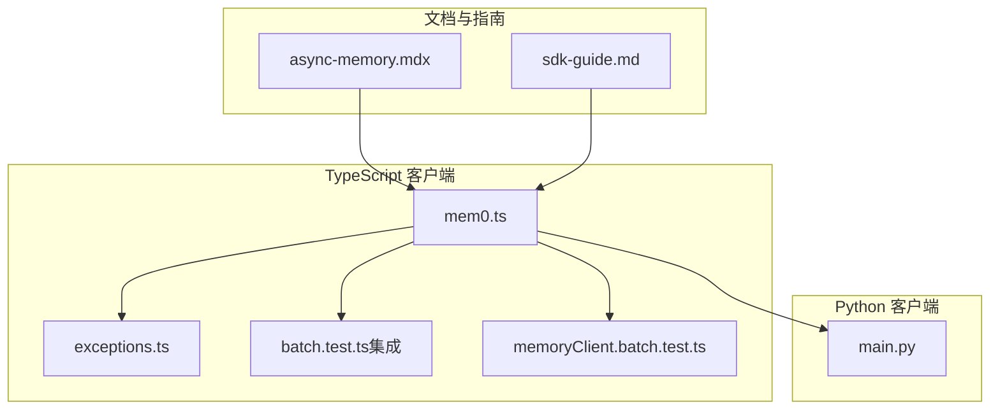
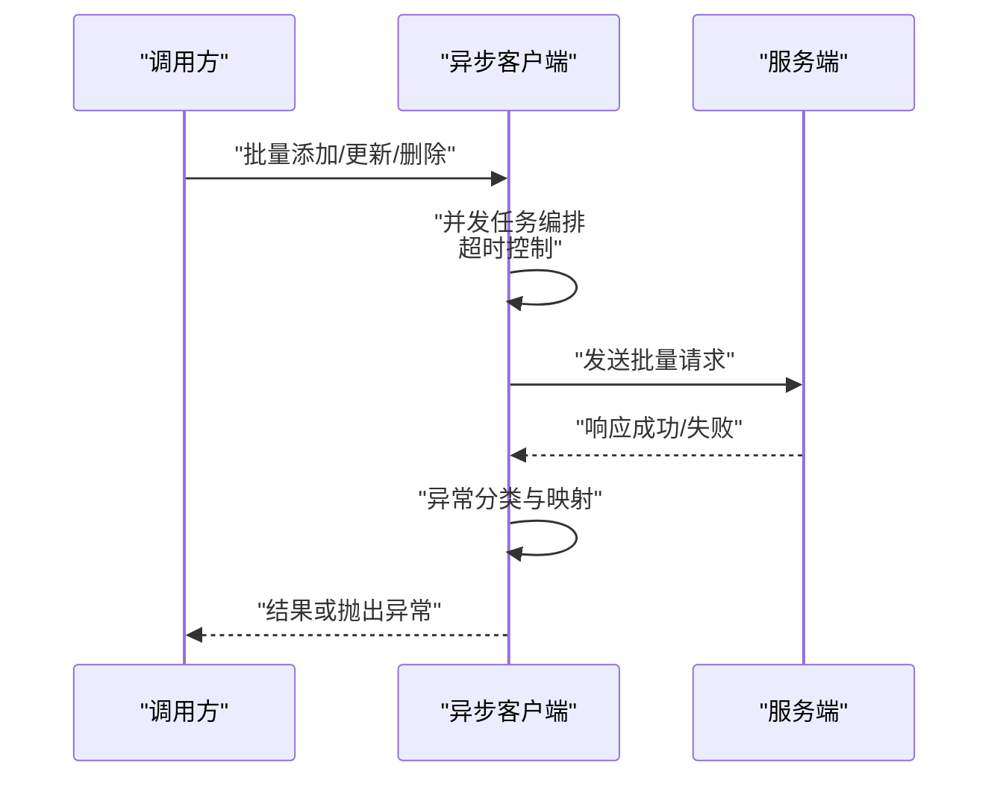
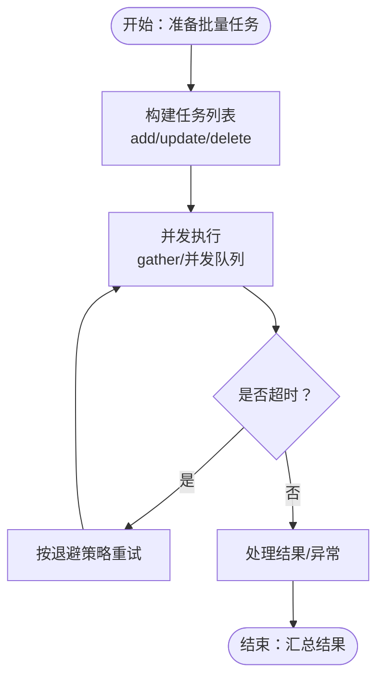
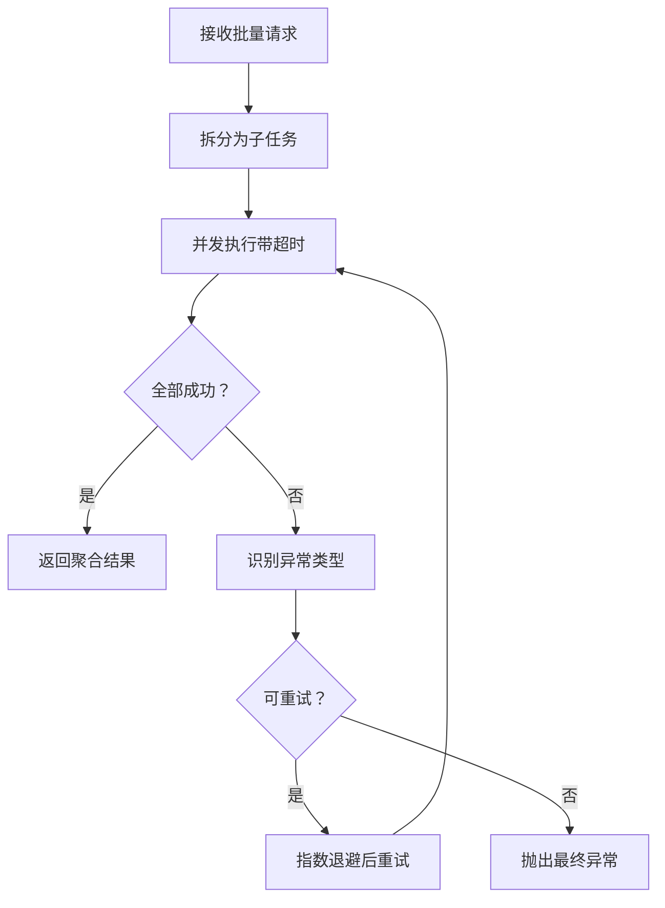
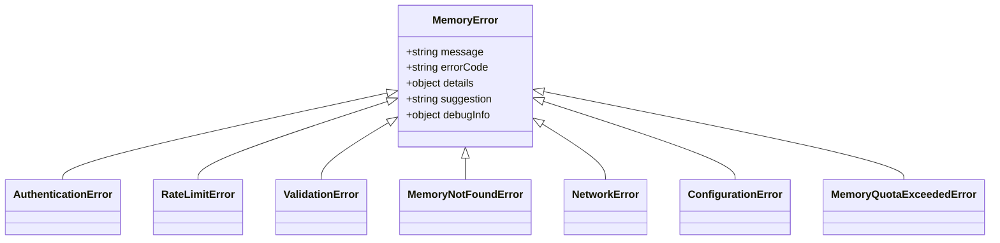
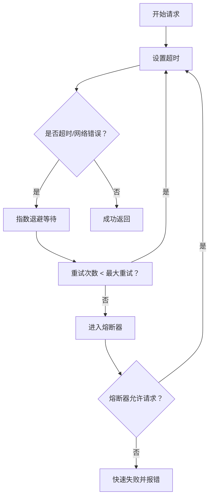
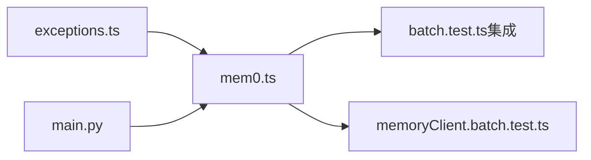

# 异步操作处理

<cite>
**本文引用的文件**
- [async-memory.mdx](file://docs/open-source/features/async-memory.mdx)
- [exceptions.ts](file://mem0-ts/src/common/exceptions.ts)
- [exceptions.test.ts](file://mem0-ts/src/common/exceptions.test.ts)
- [mem0.ts](file://mem0-ts/src/client/mem0.ts)
- [batch.test.ts](file://mem0-ts/src/client/tests/integration/batch.test.ts)
- [memoryClient.batch.test.ts](file://mem0-ts/src/client/tests/memoryClient.batch.test.ts)
- [main.py](file://mem0/client/main.py)
- [sdk-guide.md](file://skills/mem0/references/sdk-guide.md)
- [batch.test.ts（集成）](file://mem0-ts/src/client/tests/integration/batch.test.ts)
- [crud.test.ts（集成）](file://mem0-ts/src/client/tests/integration/crud.test.ts)
- [storage.unit.test.ts](file://mem0-ts/src/oss/tests/storage.unit.test.ts)
</cite>

## 目录
1. [引言](#引言)
2. [项目结构](#项目结构)
3. [核心组件](#核心组件)
4. [架构总览](#架构总览)
5. [详细组件分析](#详细组件分析)
6. [依赖分析](#依赖分析)
7. [性能考虑](#性能考虑)
8. [故障排查指南](#故障排查指南)
9. [结论](#结论)
10. [附录](#附录)

## 引言
本指南聚焦于 SDK 中的异步操作处理，系统讲解 Promise 与 async/await 的使用模式；覆盖批量操作、并发控制与超时处理的最佳实践；提供网络错误、API 错误与数据验证错误的完整错误处理示例；解释重试机制、退避策略与熔断器模式的应用；并包含内存泄漏防护与资源管理的注意事项。内容以仓库中已实现的 Python 与 TypeScript 客户端、异常体系与测试用例为依据，确保可落地、可复现。

## 项目结构
围绕异步操作的关键目录与文件如下：
- 文档与特性说明：docs/open-source/features/async-memory.mdx
- TypeScript 异常体系：mem0-ts/src/common/exceptions.ts 及其单元测试
- TypeScript 客户端与批处理：mem0-ts/src/client/mem0.ts、batch 测试与单元测试
- Python 同步/异步客户端：mem0/client/main.py
- SDK 使用指南与注意事项：skills/mem0/references/sdk-guide.md
- 集成测试与单元测试：mem0-ts/src/client/tests/integration 与 mem0-ts/src/client/tests/memoryClient.*.test.ts

图表来源
- [async-memory.mdx](file://docs/open-source/features/async-memory.mdx)
- [sdk-guide.md](file://skills/mem0/references/sdk-guide.md)
- [mem0.ts](file://mem0-ts/src/client/mem0.ts)
- [exceptions.ts](file://mem0-ts/src/common/exceptions.ts)
- [batch.test.ts（集成）](file://mem0-ts/src/client/tests/integration/batch.test.ts)
- [memoryClient.batch.test.ts](file://mem0-ts/src/client/tests/memoryClient.batch.test.ts)
- [main.py](file://mem0/client/main.py)

章节来源
- [async-memory.mdx](file://docs/open-source/features/async-memory.mdx)
- [sdk-guide.md](file://skills/mem0/references/sdk-guide.md)
- [mem0.ts](file://mem0-ts/src/client/mem0.ts)
- [exceptions.ts](file://mem0-ts/src/common/exceptions.ts)
- [batch.test.ts（集成）](file://mem0-ts/src/client/tests/integration/batch.test.ts)
- [memoryClient.batch.test.ts](file://mem0-ts/src/client/tests/memoryClient.batch.test.ts)
- [main.py](file://mem0/client/main.py)

## 核心组件
- 异步客户端与批处理
  - TypeScript 客户端通过异步方法支持批量更新与删除，并在单元测试中验证请求体转换与空数组处理。
  - Python 客户端提供同步与异步两种实现，均支持批量更新与删除。
- 异常体系
  - 提供统一的 MemoryError 基类及子类（认证、速率限制、校验、未找到、网络、配置、配额超限等），并建立 HTTP 状态码到异常类型的映射与建议提示。
- 文档与指南
  - 文档提供了异步批量操作、超时与重试、日志记录等实践范式，便于工程化落地。

章节来源
- [mem0.ts](file://mem0-ts/src/client/mem0.ts)
- [exceptions.ts](file://mem0-ts/src/common/exceptions.ts)
- [exceptions.test.ts](file://mem0-ts/src/common/exceptions.test.ts)
- [main.py](file://mem0/client/main.py)
- [async-memory.mdx](file://docs/open-source/features/async-memory.mdx)

## 架构总览
下图展示异步调用在客户端层的典型流程：从用户发起异步请求，到内部进行并发聚合、超时与重试控制，再到异常分类与返回。

图表来源
- [mem0.ts](file://mem0-ts/src/client/mem0.ts)
- [exceptions.ts](file://mem0-ts/src/common/exceptions.ts)
- [batch.test.ts（集成）](file://mem0-ts/src/client/tests/integration/batch.test.ts)

## 详细组件分析

### 组件一：异步客户端与批量操作
- 批量更新与删除
  - TypeScript 客户端对批量接口进行请求体转换（如 memoryId → memory_id），并在单元测试中验证空数组与多条目场景。
  - 集成测试覆盖真实 API 的批量更新与删除路径。
- Python 客户端
  - 同步与异步方法均提供批量更新与删除能力，便于在不同运行时选择合适实现。
- 注意事项
  - 文档强调异步处理的延迟与等待窗口，避免过早查询导致未命中。

图表来源
- [async-memory.mdx](file://docs/open-source/features/async-memory.mdx)
- [memoryClient.batch.test.ts](file://mem0-ts/src/client/tests/memoryClient.batch.test.ts)
- [batch.test.ts（集成）](file://mem0-ts/src/client/tests/integration/batch.test.ts)
- [main.py](file://mem0/client/main.py)

章节来源
- [memoryClient.batch.test.ts](file://mem0-ts/src/client/tests/memoryClient.batch.test.ts)
- [batch.test.ts（集成）](file://mem0-ts/src/client/tests/integration/batch.test.ts)
- [main.py](file://mem0/client/main.py)
- [sdk-guide.md](file://skills/mem0/references/sdk-guide.md)

### 组件二：并发控制与超时处理
- 并发聚合
  - 使用并发收集（如 gather）同时提交多个任务，结合 return_exceptions 处理部分失败。
- 超时控制
  - 对单个任务设置超时，超时即触发重试或失败上报。
- 资源管理
  - 避免一次性创建过多并发任务导致资源耗尽；可通过外部并发限制库或内置队列控制。

图表来源
- [async-memory.mdx](file://docs/open-source/features/async-memory.mdx)

章节来源
- [async-memory.mdx](file://docs/open-source/features/async-memory.mdx)

### 组件三：错误处理与异常映射
- 异常层次
  - MemoryError 为基类，派生出 AuthenticationError、RateLimitError、ValidationError、MemoryNotFoundError、NetworkError、ConfigurationError、MemoryQuotaExceededError 等。
- HTTP 映射
  - 建立 HTTP 状态码到具体异常类的映射表，并提供建议提示文本，便于前端与运维快速定位问题。
- 单元测试验证
  - 测试覆盖常见状态码映射、未知状态码兜底行为与建议提示。

图表来源
- [exceptions.ts](file://mem0-ts/src/common/exceptions.ts)

章节来源
- [exceptions.ts](file://mem0-ts/src/common/exceptions.ts)
- [exceptions.test.ts](file://mem0-ts/src/common/exceptions.test.ts)

### 组件四：重试机制、退避策略与熔断器
- 重试与退避
  - 对超时与网络类错误采用指数退避策略，降低抖动对下游的影响。
- 熔断器模式
  - 当错误率超过阈值时短时间拒绝请求，待健康度恢复后再放行，避免雪崩效应。
- 实施要点
  - 结合超时、重试与熔断器，形成“超时-重试-退避-熔断”的闭环。

图表来源
- [async-memory.mdx](file://docs/open-source/features/async-memory.mdx)
- [exceptions.ts](file://mem0-ts/src/common/exceptions.ts)

章节来源
- [async-memory.mdx](file://docs/open-source/features/async-memory.mdx)
- [exceptions.ts](file://mem0-ts/src/common/exceptions.ts)

### 组件五：内存泄漏防护与资源管理
- 事件与定时器清理
  - 在长时间运行的异步任务中，及时清理定时器与事件监听，避免悬挂回调。
- 并发上限与背压
  - 通过并发队列或信号量限制同时进行的任务数量，防止内存峰值过高。
- 日志与可观测性
  - 记录每次异步操作的耗时与结果，便于定位异常与回归性能问题。

章节来源
- [async-memory.mdx](file://docs/open-source/features/async-memory.mdx)

## 依赖分析
- 客户端对异常体系的依赖
  - 异常类用于统一错误语义与建议提示，便于上层业务分支处理。
- 批处理测试对客户端实现的依赖
  - 单元测试验证请求体转换与边界条件；集成测试验证真实 API 行为。
- Python 与 TypeScript 客户端的协同
  - 两端实现保持一致的批量接口语义，便于跨语言迁移与一致性验证。

图表来源
- [exceptions.ts](file://mem0-ts/src/common/exceptions.ts)
- [mem0.ts](file://mem0-ts/src/client/mem0.ts)
- [batch.test.ts（集成）](file://mem0-ts/src/client/tests/integration/batch.test.ts)
- [memoryClient.batch.test.ts](file://mem0-ts/src/client/tests/memoryClient.batch.test.ts)
- [main.py](file://mem0/client/main.py)

章节来源
- [exceptions.ts](file://mem0-ts/src/common/exceptions.ts)
- [mem0.ts](file://mem0-ts/src/client/mem0.ts)
- [batch.test.ts（集成）](file://mem0-ts/src/client/tests/integration/batch.test.ts)
- [memoryClient.batch.test.ts](file://mem0-ts/src/client/tests/memoryClient.batch.test.ts)
- [main.py](file://mem0/client/main.py)

## 性能考虑
- 并发度权衡
  - 过高的并发会放大网络与服务端压力，建议根据服务端限流与资源情况动态调整并发度。
- 超时与重试
  - 为不同阶段设置合理的超时与重试间隔，避免无效自旋。
- 观测性
  - 通过日志与指标记录异步任务的耗时分布，持续优化批大小与并发度。

## 故障排查指南
- 常见错误类型与处理
  - 网络错误：检查超时与重试策略，必要时启用熔断器。
  - 数据验证错误：核对请求参数与过滤条件，遵循 SDK 指南中的命名与过滤规则。
  - 配额超限：减少请求规模或提升配额。
- 排查步骤
  - 采集请求 ID 与时间戳，结合建议提示定位问题来源。
  - 对批量操作，先验证单条操作是否稳定，再逐步扩大并发度。

章节来源
- [exceptions.ts](file://mem0-ts/src/common/exceptions.ts)
- [sdk-guide.md](file://skills/mem0/references/sdk-guide.md)

## 结论
通过统一的异常体系、完善的批处理与并发控制、以及超时与重试策略，SDK 能够在复杂网络环境下稳定地完成异步操作。配合熔断器与资源管理实践，可在高负载场景下保持系统的韧性与可维护性。建议在生产环境中结合日志与监控，持续优化并发度与批大小，确保吞吐与延迟的平衡。

## 附录
- 关键实现参考路径
  - 批量更新/删除接口与请求体转换：[memoryClient.batch.test.ts](file://mem0-ts/src/client/tests/memoryClient.batch.test.ts)
  - 集成测试（批量更新/删除）：[batch.test.ts（集成）](file://mem0-ts/src/client/tests/integration/batch.test.ts)
  - CRUD 分页与更新验证（集成）：[crud.test.ts（集成）](file://mem0-ts/src/client/tests/integration/crud.test.ts)
  - 异常映射与建议提示：[exceptions.ts](file://mem0-ts/src/common/exceptions.ts)
  - Python 同步/异步客户端（批量）：[main.py](file://mem0/client/main.py)
  - 异步批量与超时/重试示例（文档）：[async-memory.mdx](file://docs/open-source/features/async-memory.mdx)
  - SDK 使用指南与注意事项：[sdk-guide.md](file://skills/mem0/references/sdk-guide.md)
  - 历史记录异步处理验证（存储模块）：[storage.unit.test.ts](file://mem0-ts/src/oss/tests/storage.unit.test.ts)