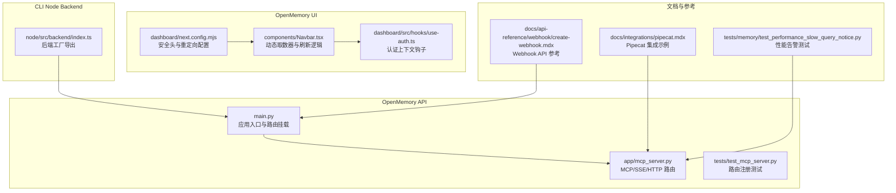
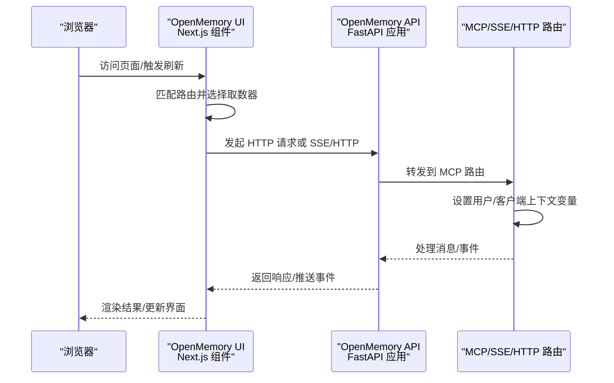
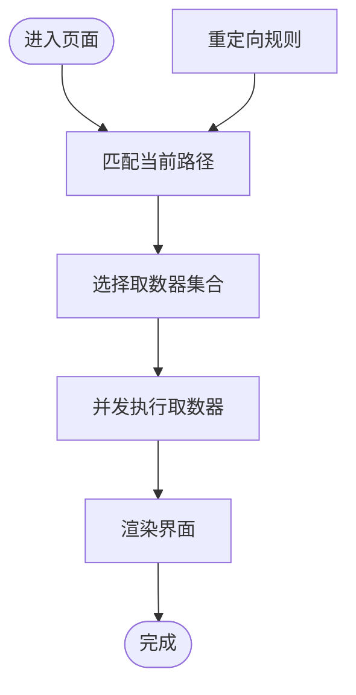
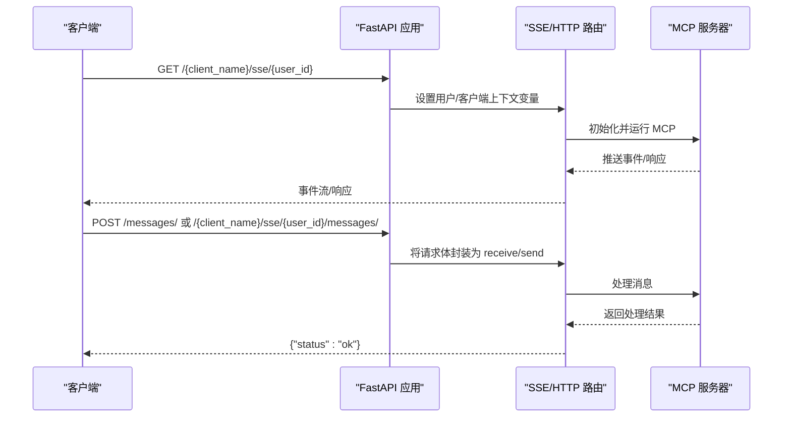
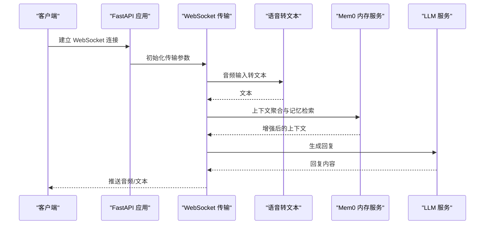
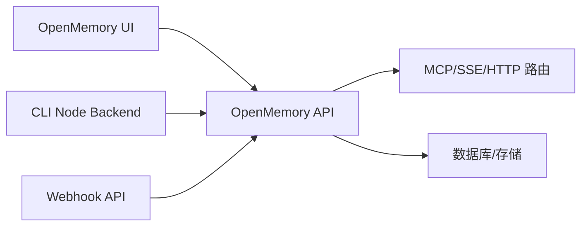
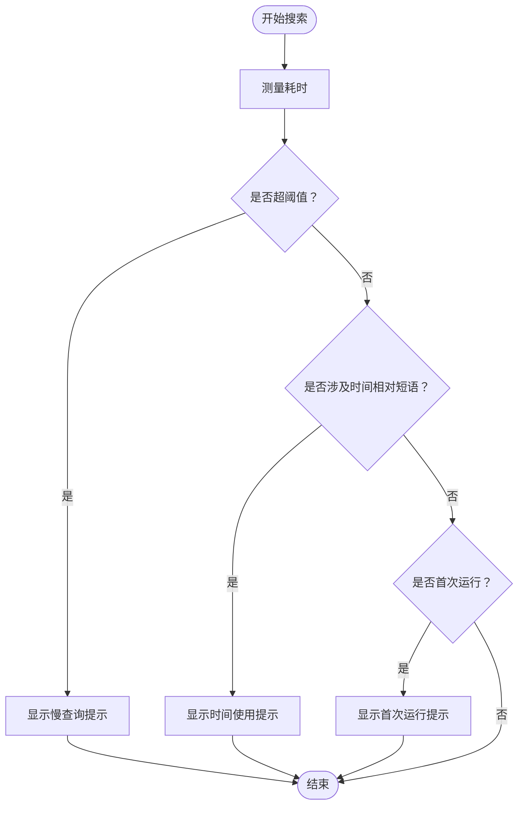

# 框架集成

<cite>
**本文引用的文件**
- [openmemory/api/main.py](file://openmemory/api/main.py)
- [openmemory/api/app/mcp_server.py](file://openmemory/api/app/mcp_server.py)
- [openmemory/api/tests/test_mcp_server.py](file://openmemory/api/tests/test_mcp_server.py)
- [openmemory/ui/components/Navbar.tsx](file://openmemory/ui/components/Navbar.tsx)
- [server/dashboard/next.config.mjs](file://server/dashboard/next.config.mjs)
- [server/dashboard/src/hooks/use-auth.ts](file://server/dashboard/src/hooks/use-auth.ts)
- [cli/node/src/backend/index.ts](file://cli/node/src/backend/index.ts)
- [docs/integrations/pipecat.mdx](file://docs/integrations/pipecat.mdx)
- [docs/api-reference/webhook/create-webhook.mdx](file://docs/api-reference/webhook/create-webhook.mdx)
- [tests/memory/test_performance_slow_query_notice.py](file://tests/memory/test_performance_slow_query_notice.py)
</cite>

## 目录
1. [简介](#简介)
2. [项目结构](#项目结构)
3. [核心组件](#核心组件)
4. [架构总览](#架构总览)
5. [详细组件分析](#详细组件分析)
6. [依赖关系分析](#依赖关系分析)
7. [性能考虑](#性能考虑)
8. [故障排查指南](#故障排查指南)
9. [结论](#结论)
10. [附录](#附录)

## 简介
本指南聚焦于在主流框架中集成内存系统（mem0）的实践路径，覆盖以下场景：
- 前端：Next.js（App Router 与 Pages Router）的集成要点与安全配置
- 后端：FastAPI/FastAPI 生态（如 Pipecat 集成）、通用 ASGI/WSGI 兼容接口
- 实时通信：WebSocket、Server-Sent Events（SSE）与 Streamable HTTP
- 微服务与多客户端：基于用户标识与客户端名称的上下文隔离
- 性能与缓存：查询性能告警、分页与访问日志等

本指南以仓库中的实际实现为依据，提供可操作的集成步骤、数据流图与最佳实践。

## 项目结构
围绕“框架集成”的相关模块主要分布在以下位置：
- OpenMemory API：提供 FastAPI 应用、MCP 路由与 SSE/HTTP 传输接口
- OpenMemory UI：Next.js 前端，演示路由与安全头配置
- Server Dashboard：Next.js 控制台，展示认证上下文与安全策略
- CLI Node Backend：Node 侧后端工厂导出，便于在 Node 生态中复用
- 文档与测试：Pipecat 集成示例、Webhook API 参考、性能测试

**图表来源**
- [openmemory/api/main.py:74-89](file://openmemory/api/main.py#L74-L89)
- [openmemory/api/app/mcp_server.py:435-512](file://openmemory/api/app/mcp_server.py#L435-L512)
- [openmemory/ui/components/Navbar.tsx:64-91](file://openmemory/ui/components/Navbar.tsx#L64-L91)
- [server/dashboard/next.config.mjs:17-39](file://server/dashboard/next.config.mjs#L17-L39)
- [server/dashboard/src/hooks/use-auth.ts:1-8](file://server/dashboard/src/hooks/use-auth.ts#L1-L8)
- [cli/node/src/backend/index.ts:1-14](file://cli/node/src/backend/index.ts#L1-L14)
- [docs/integrations/pipecat.mdx:90-134](file://docs/integrations/pipecat.mdx#L90-L134)
- [docs/api-reference/webhook/create-webhook.mdx:1-5](file://docs/api-reference/webhook/create-webhook.mdx#L1-L5)
- [tests/memory/test_performance_slow_query_notice.py:208-426](file://tests/memory/test_performance_slow_query_notice.py#L208-L426)

**章节来源**
- [openmemory/api/main.py:74-89](file://openmemory/api/main.py#L74-L89)
- [openmemory/api/app/mcp_server.py:435-512](file://openmemory/api/app/mcp_server.py#L435-L512)
- [openmemory/ui/components/Navbar.tsx:64-91](file://openmemory/ui/components/Navbar.tsx#L64-L91)
- [server/dashboard/next.config.mjs:1-41](file://server/dashboard/next.config.mjs#L1-L41)
- [server/dashboard/src/hooks/use-auth.ts:1-8](file://server/dashboard/src/hooks/use-auth.ts#L1-L8)
- [cli/node/src/backend/index.ts:1-14](file://cli/node/src/backend/index.ts#L1-L14)
- [docs/integrations/pipecat.mdx:90-134](file://docs/integrations/pipecat.mdx#L90-L134)
- [docs/api-reference/webhook/create-webhook.mdx:1-5](file://docs/api-reference/webhook/create-webhook.mdx#L1-L5)
- [tests/memory/test_performance_slow_query_notice.py:208-426](file://tests/memory/test_performance_slow_query_notice.py#L208-L426)

## 核心组件
- OpenMemory API 应用入口与路由挂载：负责默认用户/应用初始化、MCP 服务器设置以及路由注册（含分页支持）
- MCP/SSE/Streamable HTTP 传输：提供 SSE 与 Streamable HTTP 接口，支持状态无关的无状态交互，并通过上下文变量传递用户与客户端标识
- OpenMemory UI（Next.js）：演示路由匹配、动态取数器、刷新机制；同时提供安全头与重定向配置
- Server Dashboard（Next.js）：认证上下文钩子与安全策略
- CLI Node Backend：Node 侧后端工厂导出，便于在 Node 生态中统一接入
- Pipecat 集成示例：展示 WebSocket 场景下的内存服务集成
- Webhook API 参考：用于接收内存事件的实时通知
- 性能告警与测试：慢查询性能提示与首次运行提示的测试用例

**章节来源**
- [openmemory/api/main.py:74-89](file://openmemory/api/main.py#L74-L89)
- [openmemory/api/app/mcp_server.py:435-512](file://openmemory/api/app/mcp_server.py#L435-L512)
- [openmemory/ui/components/Navbar.tsx:64-91](file://openmemory/ui/components/Navbar.tsx#L64-L91)
- [server/dashboard/src/hooks/use-auth.ts:1-8](file://server/dashboard/src/hooks/use-auth.ts#L1-L8)
- [cli/node/src/backend/index.ts:1-14](file://cli/node/src/backend/index.ts#L1-L14)
- [docs/integrations/pipecat.mdx:90-134](file://docs/integrations/pipecat.mdx#L90-L134)
- [docs/api-reference/webhook/create-webhook.mdx:1-5](file://docs/api-reference/webhook/create-webhook.mdx#L1-L5)
- [tests/memory/test_performance_slow_query_notice.py:208-426](file://tests/memory/test_performance_slow_query_notice.py#L208-L426)

## 架构总览
下图展示了前端（Next.js）与后端（FastAPI/MCP）之间的典型交互流程，涵盖路由处理、上下文注入与实时传输。

**图表来源**
- [openmemory/ui/components/Navbar.tsx:64-91](file://openmemory/ui/components/Navbar.tsx#L64-L91)
- [openmemory/api/app/mcp_server.py:435-512](file://openmemory/api/app/mcp_server.py#L435-L512)
- [openmemory/api/main.py:74-89](file://openmemory/api/main.py#L74-L89)

## 详细组件分析

### Next.js 集成（App Router 与 Pages Router）
- 路由与取数器映射：根据当前路径匹配路由规则，动态选择取数器集合并并发刷新
- 安全头与重定向：统一设置安全头（如 X-Frame-Options、Content-Security-Policy），并进行旧路径到新路径的重定向
- 认证上下文：通过自定义 Hook 获取认证上下文，便于在组件中读取用户状态

**图表来源**
- [openmemory/ui/components/Navbar.tsx:64-91](file://openmemory/ui/components/Navbar.tsx#L64-L91)
- [server/dashboard/next.config.mjs:17-39](file://server/dashboard/next.config.mjs#L17-L39)

**章节来源**
- [openmemory/ui/components/Navbar.tsx:64-91](file://openmemory/ui/components/Navbar.tsx#L64-L91)
- [server/dashboard/next.config.mjs:1-41](file://server/dashboard/next.config.mjs#L1-L41)
- [server/dashboard/src/hooks/use-auth.ts:1-8](file://server/dashboard/src/hooks/use-auth.ts#L1-L8)

### FastAPI/MCP 实时传输（SSE 与 Streamable HTTP）
- SSE 连接：通过路径参数提取用户 ID 与客户端名称，设置上下文变量后建立连接
- POST 消息：提供 HTTP POST 接口转发消息至 SSE 流
- Streamable HTTP：无状态模式，直接写入 ASGI send，避免重复响应问题
- 路由注册验证：测试确保 SSE、消息 POST 与 Streamable HTTP 路由均正确注册

**图表来源**
- [openmemory/api/app/mcp_server.py:435-512](file://openmemory/api/app/mcp_server.py#L435-L512)
- [openmemory/api/tests/test_mcp_server.py:383-396](file://openmemory/api/tests/test_mcp_server.py#L383-L396)

**章节来源**
- [openmemory/api/app/mcp_server.py:435-512](file://openmemory/api/app/mcp_server.py#L435-L512)
- [openmemory/api/tests/test_mcp_server.py:383-396](file://openmemory/api/tests/test_mcp_server.py#L383-L396)

### Pipecat 集成（WebSocket 实时应用）
- WebSocket 端点：接受连接并配置传输层（音频输入/输出、VAD、序列化）
- 内存服务：通过 Mem0MemoryService 注入用户上下文，增强对话记忆
- LLM 与 STT：结合 OpenAI LLM 与 Whisper STT，构建语音助手管道
- 管道编排：按输入到记忆再到 LLM 的顺序串联各组件

**图表来源**
- [docs/integrations/pipecat.mdx:90-134](file://docs/integrations/pipecat.mdx#L90-L134)

**章节来源**
- [docs/integrations/pipecat.mdx:90-134](file://docs/integrations/pipecat.mdx#L90-L134)

### CLI Node Backend（Node 生态后端工厂）
- 导出后端工厂与类型：统一 Node 侧的添加、搜索、列表、删除等选项与错误类型
- 便于在 Node/Koa/Express 等框架中复用同一套后端能力

**章节来源**
- [cli/node/src/backend/index.ts:1-14](file://cli/node/src/backend/index.ts#L1-L14)

### Webhook 实时通知（微服务架构）
- Webhook 创建：为项目创建 Webhook，接收内存事件的实时通知
- 适用于微服务架构中的事件驱动与解耦

**章节来源**
- [docs/api-reference/webhook/create-webhook.mdx:1-5](file://docs/api-reference/webhook/create-webhook.mdx#L1-L5)

## 依赖关系分析
- 应用入口依赖：默认用户/应用初始化、MCP 服务器设置、路由挂载与分页支持
- UI 依赖：路由匹配、取数器集合、认证上下文与安全头配置
- 实时传输依赖：ASGI 接口、上下文变量、SSE/HTTP 传输与 MCP 服务器
- Node 后端依赖：后端工厂导出，供 Node/Koa/Express 使用

**图表来源**
- [openmemory/api/main.py:74-89](file://openmemory/api/main.py#L74-L89)
- [openmemory/api/app/mcp_server.py:435-512](file://openmemory/api/app/mcp_server.py#L435-L512)
- [cli/node/src/backend/index.ts:1-14](file://cli/node/src/backend/index.ts#L1-L14)
- [docs/api-reference/webhook/create-webhook.mdx:1-5](file://docs/api-reference/webhook/create-webhook.mdx#L1-L5)

**章节来源**
- [openmemory/api/main.py:74-89](file://openmemory/api/main.py#L74-L89)
- [openmemory/api/app/mcp_server.py:435-512](file://openmemory/api/app/mcp_server.py#L435-L512)
- [cli/node/src/backend/index.ts:1-14](file://cli/node/src/backend/index.ts#L1-L14)
- [docs/api-reference/webhook/create-webhook.mdx:1-5](file://docs/api-reference/webhook/create-webhook.mdx#L1-L5)

## 性能考虑
- 查询性能告警：当搜索耗时超过阈值时，触发性能慢查询提示；同时优先显示时间相关使用提示
- 首次运行提示：异步搜索在首次运行时显示相应提示
- 分页与访问日志：在 API 中启用分页支持，并记录内存访问日志，辅助性能分析与审计

**图表来源**
- [tests/memory/test_performance_slow_query_notice.py:208-426](file://tests/memory/test_performance_slow_query_notice.py#L208-L426)

**章节来源**
- [tests/memory/test_performance_slow_query_notice.py:208-426](file://tests/memory/test_performance_slow_query_notice.py#L208-L426)

## 故障排查指南
- 路由未注册：确认 SSE、消息 POST 与 Streamable HTTP 路由已在应用中注册
- 上下文变量未生效：检查用户 ID 与客户端名称是否正确设置与清理
- 双重响应问题：使用捕获 send 的方式处理 Streamable HTTP，避免 FastAPI 重复响应
- 安全头与重定向：核对安全头与重定向配置，确保符合预期

**章节来源**
- [openmemory/api/tests/test_mcp_server.py:383-396](file://openmemory/api/tests/test_mcp_server.py#L383-L396)
- [openmemory/api/app/mcp_server.py:496-512](file://openmemory/api/app/mcp_server.py#L496-L512)
- [server/dashboard/next.config.mjs:17-39](file://server/dashboard/next.config.mjs#L17-L39)

## 结论
通过本指南，可以在 Next.js（App Router/Pages Router）、FastAPI/MCP、Pipecat（WebSocket）以及 Node/Koa/Express 等多种框架中高效集成内存能力。结合安全头配置、上下文变量注入、SSE/Streamable HTTP 与 Webhook 实时通知，可满足从单体应用到微服务架构的多样化需求。配合性能告警与分页策略，有助于在高负载场景下保持稳定与可观测性。

## 附录
- Next.js 安全头与重定向配置参考：[server/dashboard/next.config.mjs:17-39](file://server/dashboard/next.config.mjs#L17-L39)
- OpenMemory API 路由挂载与分页支持：[openmemory/api/main.py:74-89](file://openmemory/api/main.py#L74-L89)
- MCP/SSE/HTTP 路由实现与上下文变量：[openmemory/api/app/mcp_server.py:435-512](file://openmemory/api/app/mcp_server.py#L435-L512)
- Pipecat WebSocket 集成示例：[docs/integrations/pipecat.mdx:90-134](file://docs/integrations/pipecat.mdx#L90-L134)
- CLI Node Backend 工厂导出：[cli/node/src/backend/index.ts:1-14](file://cli/node/src/backend/index.ts#L1-L14)
- Webhook API 参考：[docs/api-reference/webhook/create-webhook.mdx:1-5](file://docs/api-reference/webhook/create-webhook.mdx#L1-L5)
- 性能告警测试用例：[tests/memory/test_performance_slow_query_notice.py:208-426](file://tests/memory/test_performance_slow_query_notice.py#L208-L426)