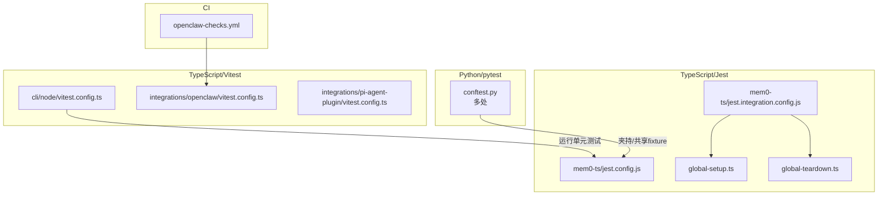
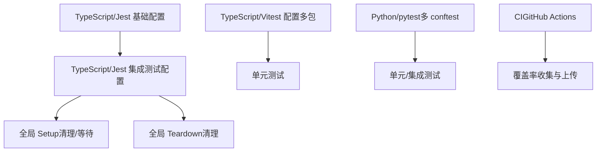
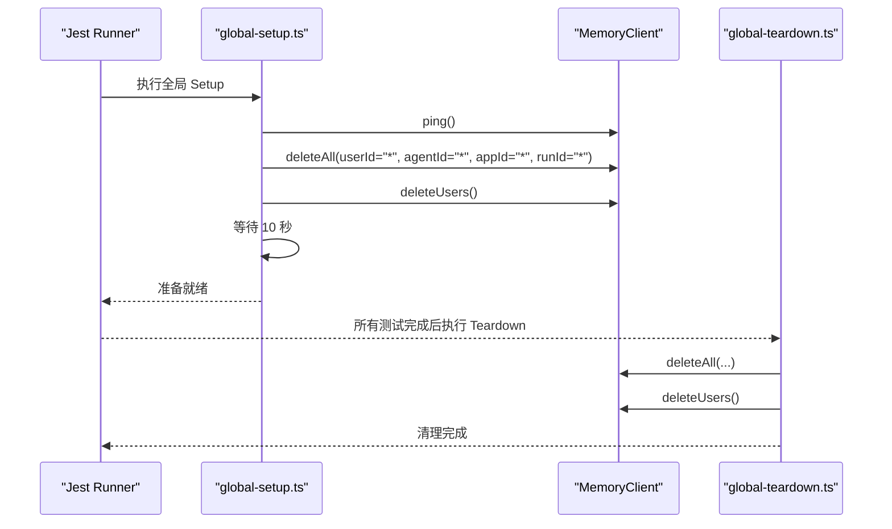
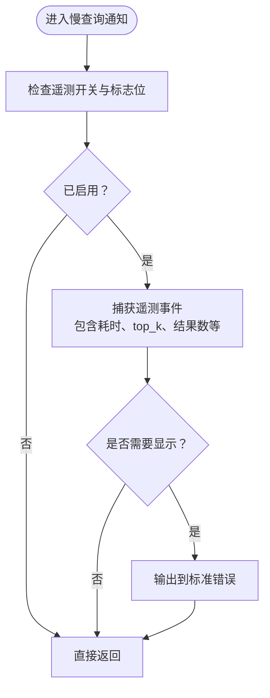
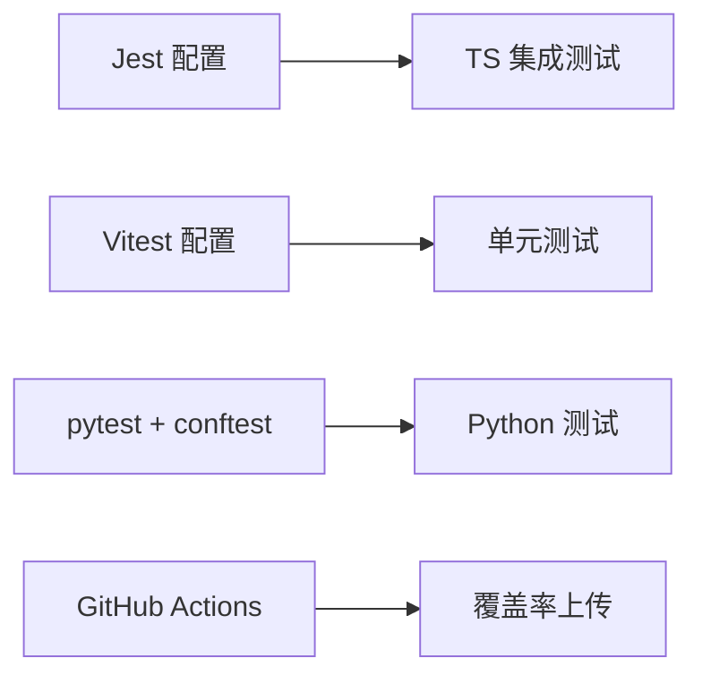

# 测试和调试

<cite>
**本文引用的文件**
- [cli/node/vitest.config.ts](file://cli/node/vitest.config.ts)
- [integrations/openclaw/vitest.config.ts](file://integrations/openclaw/vitest.config.ts)
- [integrations/pi-agent-plugin/vitest.config.ts](file://integrations/pi-agent-plugin/vitest.config.ts)
- [mem0-ts/jest.config.js](file://mem0-ts/jest.config.js)
- [mem0-ts/jest.integration.config.js](file://mem0-ts/jest.integration.config.js)
- [mem0-ts/src/client/tests/integration/global-setup.ts](file://mem0-ts/src/client/tests/integration/global-setup.ts)
- [mem0-ts/src/client/tests/integration/global-teardown.ts](file://mem0-ts/src/client/tests/integration/global-teardown.ts)
- [integrations/vercel-ai-sdk/jest.config.js](file://integrations/vercel-ai-sdk/jest.config.js)
- [integrations/vercel-ai-sdk/teardown.ts](file://integrations/vercel-ai-sdk/teardown.ts)
- [cli/python/tests/conftest.py](file://cli/python/tests/conftest.py)
- [integrations/mem0-plugin/tests/conftest.py](file://integrations/mem0-plugin/tests/conftest.py)
- [tests/rerankers/conftest.py](file://tests/rerankers/conftest.py)
- [cli/node/tests/setup.ts](file://cli/node/tests/setup.ts)
- [mem0-ts/src/client/tests/setup.ts](file://mem0-ts/src/client/tests/setup.ts)
- [cli/node/src/output.ts](file://cli/node/src/output.ts)
- [tests/memory/test_performance_slow_query_notice.py](file://tests/memory/test_performance_slow_query_notice.py)
- [mem0/memory/notices.py](file://mem0/memory/notices.py)
- [.github/workflows/openclaw-checks.yml](file://.github/workflows/openclaw-checks.yml)
</cite>

## 目录
1. [简介](#简介)
2. [项目结构](#项目结构)
3. [核心组件](#核心组件)
4. [架构总览](#架构总览)
5. [详细组件分析](#详细组件分析)
6. [依赖关系分析](#依赖关系分析)
7. [性能考量](#性能考量)
8. [故障排除指南](#故障排除指南)
9. [结论](#结论)
10. [附录](#附录)

## 简介
本指南面向开发与测试工程师，系统性介绍本仓库中单元测试、集成测试与端到端测试的编写方法，涵盖模拟对象、测试替身与测试环境配置；同时总结调试技巧、日志记录与性能分析实践，并提供常见问题诊断与故障排除流程，以及测试覆盖率提升与持续集成配置示例。

## 项目结构
本仓库采用多语言与多子系统的测试布局：
- TypeScript/JavaScript 测试：mem0-ts 使用 Jest（含集成测试配置），CLI Node 层使用 Vitest。
- Python 测试：根目录 tests 与各插件/CLI 的 tests 目录，使用 pytest（通过 conftest.py 统一夹持）。
- 集成测试与端到端测试：mem0-ts 提供全局 setup/teardown 清理逻辑，确保测试隔离与数据一致性。
- CI 覆盖率：GitHub Actions 对特定包（如 openclaw）执行覆盖率上传。

图示来源
- [mem0-ts/jest.config.js:1-6](file://mem0-ts/jest.config.js#L1-L6)
- [mem0-ts/jest.integration.config.js:1-9](file://mem0-ts/jest.integration.config.js#L1-L9)
- [mem0-ts/src/client/tests/integration/global-setup.ts:1-40](file://mem0-ts/src/client/tests/integration/global-setup.ts#L1-L40)
- [mem0-ts/src/client/tests/integration/global-teardown.ts:1-36](file://mem0-ts/src/client/tests/integration/global-teardown.ts#L1-L36)
- [.github/workflows/openclaw-checks.yml:58-99](file://.github/workflows/openclaw-checks.yml#L58-L99)

章节来源
- [mem0-ts/jest.config.js:1-6](file://mem0-ts/jest.config.js#L1-L6)
- [mem0-ts/jest.integration.config.js:1-9](file://mem0-ts/jest.integration.config.js#L1-L9)
- [cli/node/vitest.config.ts:1-7](file://cli/node/vitest.config.ts#L1-L7)
- [integrations/openclaw/vitest.config.ts:1-7](file://integrations/openclaw/vitest.config.ts#L1-L7)
- [integrations/pi-agent-plugin/vitest.config.ts:1-7](file://integrations/pi-agent-plugin/vitest.config.ts#L1-L7)
- [cli/python/tests/conftest.py:1-200](file://cli/python/tests/conftest.py#L1-L200)
- [integrations/mem0-plugin/tests/conftest.py:1-200](file://integrations/mem0-plugin/tests/conftest.py#L1-L200)
- [tests/rerankers/conftest.py:1-200](file://tests/rerankers/conftest.py#L1-L200)

## 核心组件
- 测试运行器与配置
  - TypeScript/Jest：基础配置与集成测试专用配置，支持全局 setup/teardown。
  - TypeScript/Vitest：在多个子包中启用全局模式，便于快速编写单元测试。
  - Python/pytest：通过 conftest.py 提供共享 fixture、命令行参数与自动夹持。
- 测试替身与模拟
  - 在集成测试中通过全局清理函数确保外部状态一致（删除用户、全量清理等）。
  - 在 Python 单元测试中可使用 pytest 的 patch/mocker 进行依赖替换。
- 日志与输出
  - CLI 输出模块提供结构化 JSON 包裹与结果摘要打印，便于测试断言与调试。
- 性能通知与遥测
  - 内存模块包含慢查询性能通知与遥测事件捕获，用于定位性能瓶颈。

章节来源
- [mem0-ts/jest.config.js:1-6](file://mem0-ts/jest.config.js#L1-L6)
- [mem0-ts/jest.integration.config.js:1-9](file://mem0-ts/jest.integration.config.js#L1-L9)
- [mem0-ts/src/client/tests/integration/global-setup.ts:1-40](file://mem0-ts/src/client/tests/integration/global-setup.ts#L1-L40)
- [mem0-ts/src/client/tests/integration/global-teardown.ts:1-36](file://mem0-ts/src/client/tests/integration/global-teardown.ts#L1-L36)
- [cli/node/vitest.config.ts:1-7](file://cli/node/vitest.config.ts#L1-L7)
- [integrations/pi-agent-plugin/vitest.config.ts:1-7](file://integrations/pi-agent-plugin/vitest.config.ts#L1-L7)
- [cli/python/tests/conftest.py:1-200](file://cli/python/tests/conftest.py#L1-L200)
- [cli/node/src/output.ts:203-397](file://cli/node/src/output.ts#L203-L397)
- [mem0/memory/notices.py:582-686](file://mem0/memory/notices.py#L582-L686)

## 架构总览
下图展示测试体系在不同语言与子系统中的组织方式及交互：

图示来源
- [mem0-ts/jest.config.js:1-6](file://mem0-ts/jest.config.js#L1-L6)
- [mem0-ts/jest.integration.config.js:1-9](file://mem0-ts/jest.integration.config.js#L1-L9)
- [mem0-ts/src/client/tests/integration/global-setup.ts:1-40](file://mem0-ts/src/client/tests/integration/global-setup.ts#L1-L40)
- [mem0-ts/src/client/tests/integration/global-teardown.ts:1-36](file://mem0-ts/src/client/tests/integration/global-teardown.ts#L1-L36)
- [cli/node/vitest.config.ts:1-7](file://cli/node/vitest.config.ts#L1-L7)
- [integrations/openclaw/vitest.config.ts:1-7](file://integrations/openclaw/vitest.config.ts#L1-L7)
- [integrations/pi-agent-plugin/vitest.config.ts:1-7](file://integrations/pi-agent-plugin/vitest.config.ts#L1-L7)
- [cli/python/tests/conftest.py:1-200](file://cli/python/tests/conftest.py#L1-L200)
- [.github/workflows/openclaw-checks.yml:58-99](file://.github/workflows/openclaw-checks.yml#L58-L99)

## 详细组件分析

### TypeScript/Jest 集成测试流水线
- 全局 Setup：在测试开始前连接服务、执行全量清理并等待异步清理生效，避免跨用例污染。
- 全局 Teardown：在所有测试结束后再次清理，保证环境干净。
- 集成测试串行执行：限制并发以降低限流与竞态风险。

图示来源
- [mem0-ts/src/client/tests/integration/global-setup.ts:1-40](file://mem0-ts/src/client/tests/integration/global-setup.ts#L1-L40)
- [mem0-ts/src/client/tests/integration/global-teardown.ts:1-36](file://mem0-ts/src/client/tests/integration/global-teardown.ts#L1-L36)

章节来源
- [mem0-ts/jest.integration.config.js:1-9](file://mem0-ts/jest.integration.config.js#L1-L9)
- [mem0-ts/src/client/tests/integration/global-setup.ts:1-40](file://mem0-ts/src/client/tests/integration/global-setup.ts#L1-L40)
- [mem0-ts/src/client/tests/integration/global-teardown.ts:1-36](file://mem0-ts/src/client/tests/integration/global-teardown.ts#L1-L36)

### TypeScript/Vitest 多包配置
- 各子包（CLI Node、OpenClaw、Pi-Agent 插件）均启用 Vitest 全局模式，便于快速编写与运行单元测试。
- 适用于对纯函数、工具函数与轻量模块进行快速验证。

章节来源
- [cli/node/vitest.config.ts:1-7](file://cli/node/vitest.config.ts#L1-L7)
- [integrations/openclaw/vitest.config.ts:1-7](file://integrations/openclaw/vitest.config.ts#L1-L7)
- [integrations/pi-agent-plugin/vitest.config.ts:1-7](file://integrations/pi-agent-plugin/vitest.config.ts#L1-L7)

### Python/pytest 夹持与共享 Fixture
- 多个 conftest.py 文件提供共享夹持逻辑，统一注入命令行参数、环境准备与测试前置条件。
- 适合在 Python 测试中进行数据库、外部服务或配置的模拟与替换。

章节来源
- [cli/python/tests/conftest.py:1-200](file://cli/python/tests/conftest.py#L1-L200)
- [integrations/mem0-plugin/tests/conftest.py:1-200](file://integrations/mem0-plugin/tests/conftest.py#L1-L200)
- [tests/rerankers/conftest.py:1-200](file://tests/rerankers/conftest.py#L1-L200)

### CLI 输出与结构化日志
- CLI 输出模块提供结构化 JSON 包裹与结果摘要打印，便于：
  - 在测试中断言响应格式与关键字段。
  - 在调试时快速定位命令执行状态、耗时与范围信息。

章节来源
- [cli/node/src/output.ts:203-397](file://cli/node/src/output.ts#L203-L397)

### 慢查询性能通知与遥测
- 内存模块包含慢查询性能通知与遥测事件捕获，用于：
  - 记录慢查询触发函数、同步类型、阈值与耗时。
  - 在满足条件时输出到标准错误，辅助定位性能瓶颈。

图示来源
- [mem0/memory/notices.py:582-686](file://mem0/memory/notices.py#L582-L686)

章节来源
- [tests/memory/test_performance_slow_query_notice.py:429-445](file://tests/memory/test_performance_slow_query_notice.py#L429-L445)
- [mem0/memory/notices.py:582-686](file://mem0/memory/notices.py#L582-L686)

## 依赖关系分析
- 测试运行器与子系统耦合度低，通过各自配置文件独立管理。
- 集成测试依赖外部服务（通过 MemoryClient），因此需要全局清理与等待机制。
- Python 测试通过 conftest 夹持实现跨目录共享，减少重复配置。

图示来源
- [mem0-ts/jest.config.js:1-6](file://mem0-ts/jest.config.js#L1-L6)
- [mem0-ts/jest.integration.config.js:1-9](file://mem0-ts/jest.integration.config.js#L1-L9)
- [cli/node/vitest.config.ts:1-7](file://cli/node/vitest.config.ts#L1-L7)
- [integrations/openclaw/vitest.config.ts:1-7](file://integrations/openclaw/vitest.config.ts#L1-L7)
- [cli/python/tests/conftest.py:1-200](file://cli/python/tests/conftest.py#L1-L200)
- [.github/workflows/openclaw-checks.yml:58-99](file://.github/workflows/openclaw-checks.yml#L58-L99)

## 性能考量
- 集成测试串行执行：避免并发导致的限流与竞态，提高稳定性。
- 清理与等待：在全局 Setup 中等待异步清理生效，减少跨用例干扰。
- 性能通知：利用慢查询通知与遥测事件捕获，定位耗时操作与阈值触发点。

章节来源
- [mem0-ts/jest.integration.config.js:7-9](file://mem0-ts/jest.integration.config.js#L7-L9)
- [mem0-ts/src/client/tests/integration/global-setup.ts:36-39](file://mem0-ts/src/client/tests/integration/global-setup.ts#L36-L39)
- [mem0/memory/notices.py:582-686](file://mem0/memory/notices.py#L582-L686)

## 故障排除指南
- 集成测试失败（外部服务不可达）
  - 检查 API Key 环境变量与服务连通性。
  - 查看全局 Setup/Teardown 是否正确执行清理。
- 测试间数据污染
  - 确认全局清理逻辑是否覆盖了用户与全量数据。
  - 检查是否遗漏等待异步清理生效。
- 日志与断言
  - 使用 CLI 输出模块提供的结构化 JSON 包裹与摘要打印，辅助断言与排错。
- 性能问题
  - 关注慢查询通知输出与遥测事件，结合触发函数与耗时阈值定位瓶颈。

章节来源
- [mem0-ts/src/client/tests/integration/global-setup.ts:1-40](file://mem0-ts/src/client/tests/integration/global-setup.ts#L1-L40)
- [mem0-ts/src/client/tests/integration/global-teardown.ts:1-36](file://mem0-ts/src/client/tests/integration/global-teardown.ts#L1-L36)
- [cli/node/src/output.ts:203-397](file://cli/node/src/output.ts#L203-L397)
- [mem0/memory/notices.py:582-686](file://mem0/memory/notices.py#L582-L686)

## 结论
本仓库在多语言环境下提供了完善的测试基础设施：TypeScript/Jest 的集成测试具备可靠的全局清理与等待机制；TypeScript/Vitest 支持多子包快速单元测试；Python/pytest 通过 conftest 实现共享夹持。配合 CLI 输出与内存模块的性能通知，能够高效地进行调试与性能分析。建议在新增测试时遵循现有模式，确保隔离性与可维护性。

## 附录

### 测试编写要点
- 单元测试
  - 使用 Vitest（多包）或 Jest（TS）编写，优先针对纯函数与小模块。
  - 利用模拟对象替换外部依赖，确保输入输出可控。
- 集成测试
  - 使用全局 Setup/Teardown 清理环境，必要时串行执行。
  - 断言结构化输出与关键遥测事件。
- 端到端测试
  - 通过 CLI 或 SDK 完整路径验证，关注错误处理与边界场景。

### 测试环境配置
- TypeScript/Jest
  - 基础配置与集成测试配置分别管理运行环境与全局生命周期。
- TypeScript/Vitest
  - 各子包启用全局模式，便于快速编写单元测试。
- Python/pytest
  - 通过 conftest 注入共享 fixture 与命令行参数。

章节来源
- [mem0-ts/jest.config.js:1-6](file://mem0-ts/jest.config.js#L1-L6)
- [mem0-ts/jest.integration.config.js:1-9](file://mem0-ts/jest.integration.config.js#L1-L9)
- [cli/node/vitest.config.ts:1-7](file://cli/node/vitest.config.ts#L1-L7)
- [integrations/openclaw/vitest.config.ts:1-7](file://integrations/openclaw/vitest.config.ts#L1-L7)
- [integrations/pi-agent-plugin/vitest.config.ts:1-7](file://integrations/pi-agent-plugin/vitest.config.ts#L1-L7)
- [cli/python/tests/conftest.py:1-200](file://cli/python/tests/conftest.py#L1-L200)

### 调试技巧与日志记录
- 使用 CLI 输出模块的结构化 JSON 包裹与摘要打印，便于断言与可视化。
- 在慢查询场景下，关注通知输出与遥测事件，结合耗时阈值定位问题。

章节来源
- [cli/node/src/output.ts:203-397](file://cli/node/src/output.ts#L203-L397)
- [mem0/memory/notices.py:582-686](file://mem0/memory/notices.py#L582-L686)

### 性能分析工具与覆盖率
- 使用 GitHub Actions 对指定包执行覆盖率收集与上传，形成持续反馈闭环。

章节来源
- [.github/workflows/openclaw-checks.yml:58-99](file://.github/workflows/openclaw-checks.yml#L58-L99)