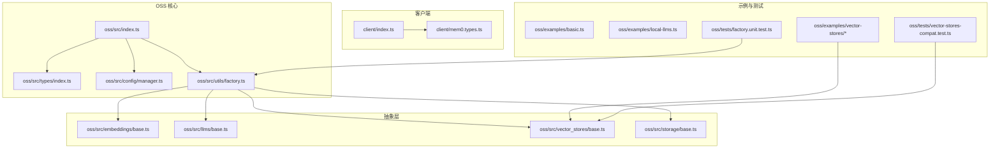
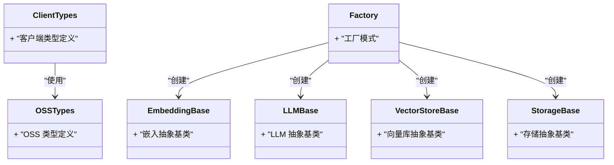
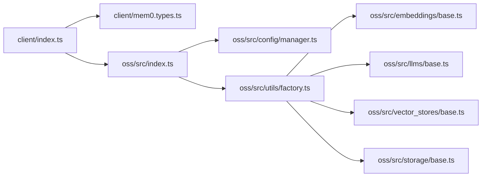

# 类型安全和接口

<cite>
**本文引用的文件**
- [mem0.types.ts](file://mem0-ts/src/client/mem0.types.ts)
- [index.ts](file://mem0-ts/src/client/index.ts)
- [global.d.ts](file://mem0-ts/src/global.d.ts)
- [oss/index.ts](file://mem0-ts/src/oss/src/index.ts)
- [oss/types/index.ts](file://mem0-ts/src/oss/src/types/index.ts)
- [oss/config/manager.ts](file://mem0-ts/src/oss/src/config/manager.ts)
- [oss/embeddings/base.ts](file://mem0-ts/src/oss/src/embeddings/base.ts)
- [oss/llms/base.ts](file://mem0-ts/src/oss/src/llms/base.ts)
- [oss/vector_stores/base.ts](file://mem0-ts/src/oss/src/vector_stores/base.ts)
- [oss/storage/base.ts](file://mem0-ts/src/oss/src/storage/base.ts)
- [oss/utils/factory.ts](file://mem0-ts/src/oss/src/utils/factory.ts)
- [oss/examples/basic.ts](file://mem0-ts/src/oss/examples/basic.ts)
- [oss/examples/local-llms.ts](file://mem0-ts/src/oss/examples/local-llms.ts)
- [oss/examples/vector-stores/memory.ts](file://mem0-ts/src/oss/examples/vector-stores/memory.ts)
- [oss/examples/vector-stores/pgvector.ts](file://mem0-ts/src/oss/examples/vector-stores/pgvector.ts)
- [oss/examples/vector-stores/qdrant.ts](file://mem0-ts/src/oss/examples/vector-stores/qdrant.ts)
- [oss/examples/vector-stores/redis.ts](file://mem0-ts/src/oss/examples/vector-stores/redis.ts)
- [oss/examples/vector-stores/supabase.ts](file://mem0-ts/src/oss/examples/vector-stores/supabase.ts)
- [oss/tests/factory.unit.test.ts](file://mem0-ts/src/oss/tests/factory.unit.test.ts)
- [oss/tests/vector-stores-compat.test.ts](file://mem0-ts/src/oss/tests/vector-stores-compat.test.ts)
- [oss/tests/config-manager.test.ts](file://mem0-ts/src/oss/tests/config-manager.test.ts)
- [oss/tests/memory.add.test.ts](file://mem0-ts/src/oss/tests/memory.add.test.ts)
- [oss/tests/memory.crud.test.ts](file://mem0-ts/src/oss/tests/memory.crud.test.ts)
- [oss/tests/memory.validation.test.ts](file://mem0-ts/src/oss/tests/memory.validation.test.ts)
- [oss/tests/memory.entity-boost.test.ts](file://mem0-ts/src/oss/tests/memory.entity-boost.test.ts)
- [oss/tests/memory.init.test.ts](file://mem0-ts/src/oss/tests/memory.init.test.ts)
- [oss/tests/storage.unit.test.ts](file://mem0-ts/src/oss/tests/storage.unit.test.ts)
- [oss/tests/scoring.test.ts](file://mem0-ts/src/oss/tests/scoring.test.ts)
- [oss/tests/dimension-autodetect.test.ts](file://mem0-ts/src/oss/tests/dimension-autodetect.test.ts)
- [oss/tests/extract-json.test.ts](file://mem0-ts/src/oss/tests/extract-json.test.ts)
- [oss/tests/remove-code-blocks.test.ts](file://mem0-ts/src/oss/tests/remove-code-blocks.test.ts)
- [oss/tests/telemetry-sampling.test.ts](file://mem0-ts/src/oss/tests/telemetry-sampling.test.ts)
- [oss/tests/tsup-externals.test.ts](file://mem0-ts/src/oss/tests/tsup-externals.test.ts)
- [oss/tests/vector-store.unit.test.ts](file://mem0-ts/src/oss/tests/vector-store.unit.test.ts)
- [oss/tests/notices.foundation.test.ts](file://mem0-ts/src/oss/tests/notices.foundation.test.ts)
- [oss/tests/notices.first-run.test.ts](file://mem0-ts/src/oss/tests/notices.first-run.test.ts)
- [oss/tests/notices.performance-slow-query.test.ts](file://mem0-ts/src/oss/tests/notices.performance-slow-query.test.ts)
- [oss/tests/notices.scale-threshold.test.ts](file://mem0-ts/src/oss/tests/notices.scale-threshold.test.ts)
- [oss/tests/notices.decay-feature.test.ts](file://mem0-ts/src/oss/tests/notices.decay-feature.test.ts)
- [oss/tests/notices.decay-usage.test.ts](file://mem0-ts/src/oss/tests/notices.decay-usage.test.ts)
- [oss/tests/notices.temporal-feature.test.ts](file://mem0-ts/src/oss/tests/notices.temporal-feature.test.ts)
- [oss/tests/notices.temporal-usage.test.ts](file://mem0-ts/src/oss/tests/notices.temporal-usage.test.ts)
- [oss/tests/openai-structured-llm.test.ts](file://mem0-ts/src/oss/tests/openai-structured-llm.test.ts)
- [oss/tests/openai-embedder.test.ts](file://mem0-ts/src/oss/tests/openai-embedder.test.ts)
- [oss/tests/google-embedder.test.ts](file://mem0-ts/src/oss/tests/google-embedder.test.ts)
- [oss/tests/anthropic-llm.test.ts](file://mem0-ts/src/oss/tests/anthropic-llm.test.ts)
- [oss/tests/deepseek.test.ts](file://mem0-ts/src/oss/tests/deepseek.test.ts)
- [oss/tests/lmstudio-embedder.test.ts](file://mem0-ts/src/oss/tests/lmstudio-embedder.test.ts)
- [oss/tests/lmstudio-llm.test.ts](file://mem0-ts/src/oss/tests/lmstudio-llm.test.ts)
- [oss/tests/ollama-embedder.test.ts](file://mem0-ts/src/oss/tests/ollama-embedder.test.ts)
- [oss/tests/google-llm.test.ts](file://mem0-ts/src/oss/tests/google-llm.test.ts)
- [oss/tests/azure-embedder.test.ts](file://mem0-ts/src/oss/tests/azure-embedder.test.ts)
- [oss/tests/pgvector.filters.test.ts](file://mem0-ts/src/oss/tests/pgvector.filters.test.ts)
- [oss/tests/pgvector.unit.test.ts](file://mem0-ts/src/oss/tests/pgvector.unit.test.ts)
- [oss/tests/qdrant-url-port.test.ts](file://mem0-ts/src/oss/tests/qdrant-url-port.test.ts)
- [oss/tests/telemetry-sampling.test.ts](file://mem0-ts/src/oss/tests/telemetry-sampling.test.ts)
- [oss/tests/tsup-externals.test.ts](file://mem0-ts/src/oss/tests/tsup-externals.test.ts)
- [oss/tests/vector-stores-compat.test.ts](file://mem0-ts/src/oss/tests/vector-stores-compat.test.ts)
- [oss/tests/vector-store.unit.test.ts](file://mem0-ts/src/oss/tests/vector-store.unit.test.ts)
- [oss/tests/config-manager.test.ts](file://mem0-ts/src/oss/tests/config-manager.test.ts)
- [oss/tests/factory.unit.test.ts](file://mem0-ts/src/oss/tests/factory.unit.test.ts)
- [oss/tests/memory.add.test.ts](file://mem0-ts/src/oss/tests/memory.add.test.ts)
- [oss/tests/memory.crud.test.ts](file://mem0-ts/src/oss/tests/memory.crud.test.ts)
- [oss/tests/memory.validation.test.ts](file://mem0-ts/src/oss/tests/memory.validation.test.ts)
- [oss/tests/memory.entity-boost.test.ts](file://mem0-ts/src/oss/tests/memory.entity-boost.test.ts)
- [oss/tests/memory.init.test.ts](file://mem0-ts/src/oss/tests/memory.init.test.ts)
- [oss/tests/storage.unit.test.ts](file://mem0-ts/src/oss/tests/storage.unit.test.ts)
- [oss/tests/scoring.test.ts](file://mem0-ts/src/oss/tests/scoring.test.ts)
- [oss/tests/dimension-autodetect.test.ts](file://mem0-ts/src/oss/tests/dimension-autodetect.test.ts)
- [oss/tests/extract-json.test.ts](file://mem0-ts/src/oss/tests/extract-json.test.ts)
- [oss/tests/remove-code-blocks.test.ts](file://mem0-ts/src/oss/tests/remove-code-blocks.test.ts)
- [oss/tests/telemetry-sampling.test.ts](file://mem0-ts/src/oss/tests/telemetry-sampling.test.ts)
- [oss/tests/tsup-externals.test.ts](file://mem0-ts/src/oss/tests/tsup-externals.test.ts)
- [oss/tests/vector-stores-compat.test.ts](file://mem0-ts/src/oss/tests/vector-stores-compat.test.ts)
- [oss/tests/vector-store.unit.test.ts](file://mem0-ts/src/oss/tests/vector-store.unit.test.ts)
- [oss/tests/notices.foundation.test.ts](file://mem0-ts/src/oss/tests/notices.foundation.test.ts)
- [oss/tests/notices.first-run.test.ts](file://mem0-ts/src/oss/tests/notices.first-run.test.ts)
- [oss/tests/notices.performance-slow-query.test.ts](file://mem0-ts/src/oss/tests/notices.performance-slow-query.test.ts)
- [oss/tests/notices.scale-threshold.test.ts](file://mem0-ts/src/oss/tests/notices.scale-threshold.test.ts)
- [oss/tests/notices.decay-feature.test.ts](file://mem0-ts/src/oss/tests/notices.decay-feature.test.ts)
- [oss/tests/notices.decay-usage.test.ts](file://mem0-ts/src/oss/tests/notices.decay-usage.test.ts)
- [oss/tests/notices.temporal-feature.test.ts](file://mem0-ts/src/oss/tests/notices.temporal-feature.test.ts)
- [oss/tests/notices.temporal-usage.test.ts](file://mem0-ts/src/oss/tests/notices.temporal-usage.test.ts)
- [oss/tests/openai-structured-llm.test.ts](file://mem0-ts/src/oss/tests/openai-structured-llm.test.ts)
- [oss/tests/openai-embedder.test.ts](file://mem0-ts/src/oss/tests/openai-embedder.test.ts)
- [oss/tests/google-embedder.test.ts](file://mem0-ts/src/oss/tests/google-embedder.test.ts)
- [oss/tests/anthropic-llm.test.ts](file://mem0-ts/src/oss/tests/anthropic-llm.test.ts)
- [oss/tests/deepseek.test.ts](file://mem0-ts/src/oss/tests/deepseek.test.ts)
- [oss/tests/lmstudio-embedder.test.ts](file://mem0-ts/src/oss/tests/lmstudio-embedder.test.ts)
- [oss/tests/lmstudio-llm.test.ts](file://mem0-ts/src/oss/tests/lmstudio-llm.test.ts)
- [oss/tests/ollama-embedder.test.ts](file://mem0-ts/src/oss/tests/ollama-embedder.test.ts)
- [oss/tests/google-llm.test.ts](file://mem0-ts/src/oss/tests/google-llm.test.ts)
- [oss/tests/azure-embedder.test.ts](file://mem0-ts/src/oss/tests/azure-embedder.test.ts)
- [oss/tests/pgvector.filters.test.ts](file://mem0-ts/src/oss/tests/pgvector.filters.test.ts)
- [oss/tests/pgvector.unit.test.ts](file://mem0-ts/src/oss/tests/pgvector.unit.test.ts)
- [oss/tests/qdrant-url-port.test.ts](file://mem0-ts/src/oss/tests/qdrant-url-port.test.ts)
</cite>

## 目录
1. 引言
2. 项目结构
3. 核心组件
4. 架构总览
5. 详细组件分析
6. 依赖关系分析
7. 性能考量
8. 故障排查指南
9. 结论
10. 附录

## 引言
本指南聚焦于 mem0 TypeScript SDK 的类型安全与接口设计，系统梳理 SDK 提供的核心类型（如 Memory、Vector、User、Project 等），解释泛型、类型约束与条件类型的使用范式，给出类型断言的安全实践与类型守卫实现建议，并说明如何扩展与自定义类型定义以及与第三方库的类型兼容策略。内容以 mem0-ts 源码为依据，结合 OSS 与社区集成示例，帮助读者在实际开发中构建健壮、可维护且类型安全的内存与向量存储应用。

## 项目结构
mem0-ts 采用按功能域分层的组织方式：client 层提供对外 API；oss 层包含本地可用的嵌入、LLM、向量库与存储抽象；community 层提供第三方集成适配；global.d.ts 提供全局类型声明。测试用例覆盖工厂模式、配置管理、向量库兼容性、内存增删改查与验证等场景，确保类型定义与运行时行为一致。

图示来源
- [index.ts:1-200](file://mem0-ts/src/client/index.ts#L1-L200)
- [mem0.types.ts:1-300](file://mem0-ts/src/client/mem0.types.ts#L1-L300)
- [oss/index.ts:1-200](file://mem0-ts/src/oss/src/index.ts#L1-L200)
- [oss/types/index.ts:1-200](file://mem0-ts/src/oss/src/types/index.ts#L1-L200)
- [oss/config/manager.ts:1-200](file://mem0-ts/src/oss/src/config/manager.ts#L1-L200)
- [oss/utils/factory.ts:1-200](file://mem0-ts/src/oss/src/utils/factory.ts#L1-L200)
- [oss/embeddings/base.ts:1-200](file://mem0-ts/src/oss/src/embeddings/base.ts#L1-L200)
- [oss/llms/base.ts:1-200](file://mem0-ts/src/oss/src/llms/base.ts#L1-L200)
- [oss/vector_stores/base.ts:1-200](file://mem0-ts/src/oss/src/vector_stores/base.ts#L1-L200)
- [oss/storage/base.ts:1-200](file://mem0-ts/src/oss/src/storage/base.ts#L1-L200)

章节来源
- [index.ts:1-200](file://mem0-ts/src/client/index.ts#L1-L200)
- [mem0.types.ts:1-300](file://mem0-ts/src/client/mem0.types.ts#L1-L300)
- [oss/index.ts:1-200](file://mem0-ts/src/oss/src/index.ts#L1-L200)
- [oss/types/index.ts:1-200](file://mem0-ts/src/oss/src/types/index.ts#L1-L200)
- [oss/config/manager.ts:1-200](file://mem0-ts/src/oss/src/config/manager.ts#L1-L200)
- [oss/utils/factory.ts:1-200](file://mem0-ts/src/oss/src/utils/factory.ts#L1-L200)

## 核心组件
本节从类型安全角度解析核心类型与接口，重点覆盖以下主题：
- 基础类型与实体模型：Memory、Vector、User、Project 等
- 泛型与条件类型：在工厂、配置管理与向量存储中的应用
- 类型约束与接口契约：确保不同实现的一致性
- 类型断言与守卫：安全地进行类型转换与分支判断
- 扩展与自定义：如何在不破坏类型安全的前提下扩展 SDK
- 第三方库兼容：LangChain、OpenAI、Qdrant、Redis、Supabase 等

章节来源
- [mem0.types.ts:1-300](file://mem0-ts/src/client/mem0.types.ts#L1-L300)
- [oss/types/index.ts:1-200](file://mem0-ts/src/oss/src/types/index.ts#L1-L200)
- [oss/embeddings/base.ts:1-200](file://mem0-ts/src/oss/src/embeddings/base.ts#L1-L200)
- [oss/llms/base.ts:1-200](file://mem0-ts/src/oss/src/llms/base.ts#L1-L200)
- [oss/vector_stores/base.ts:1-200](file://mem0-ts/src/oss/src/vector_stores/base.ts#L1-L200)
- [oss/storage/base.ts:1-200](file://mem0-ts/src/oss/src/storage/base.ts#L1-L200)

## 架构总览
下图展示客户端与 OSS 核心之间的类型交互，以及抽象层对具体实现的约束。客户端通过统一的类型接口调用 OSS 能力，OSS 使用工厂模式根据配置选择具体实现，同时通过抽象基类保证接口一致性。

图示来源
- [mem0.types.ts:1-300](file://mem0-ts/src/client/mem0.types.ts#L1-L300)
- [oss/types/index.ts:1-200](file://mem0-ts/src/oss/src/types/index.ts#L1-L200)
- [oss/utils/factory.ts:1-200](file://mem0-ts/src/oss/src/utils/factory.ts#L1-L200)
- [oss/embeddings/base.ts:1-200](file://mem0-ts/src/oss/src/embeddings/base.ts#L1-L200)
- [oss/llms/base.ts:1-200](file://mem0-ts/src/oss/src/llms/base.ts#L1-L200)
- [oss/vector_stores/base.ts:1-200](file://mem0-ts/src/oss/src/vector_stores/base.ts#L1-L200)
- [oss/storage/base.ts:1-200](file://mem0-ts/src/oss/src/storage/base.ts#L1-L200)

## 详细组件分析

### 客户端类型与接口
- 统一入口与类型导出：客户端通过入口文件导出类型与 API，便于上层应用按需引入。
- 实体类型：Memory、Vector、User、Project 等实体类型在客户端类型文件中明确定义，字段与可选性遵循业务语义，避免运行时错误。
- 配置类型：客户端配置对象采用严格属性集合，结合枚举与联合类型限制取值范围，减少配置错误。

章节来源
- [index.ts:1-200](file://mem0-ts/src/client/index.ts#L1-L200)
- [mem0.types.ts:1-300](file://mem0-ts/src/client/mem0.types.ts#L1-L300)

### OSS 类型与抽象层
- 抽象基类：EmbeddingBase、LLMBase、VectorStoreBase、StorageBase 定义了各子系统的最小接口契约，确保不同实现具备一致的输入输出形态。
- 工厂模式：通过工厂根据配置动态创建具体实例，类型系统在编译期即约束“可创建的实现集合”，降低运行时异常概率。
- 条件类型与映射：在配置管理与工厂选择中广泛使用条件类型与映射类型，将配置键与实现类型关联，提升类型推断能力。

章节来源
- [oss/embeddings/base.ts:1-200](file://mem0-ts/src/oss/src/embeddings/base.ts#L1-L200)
- [oss/llms/base.ts:1-200](file://mem0-ts/src/oss/src/llms/base.ts#L1-L200)
- [oss/vector_stores/base.ts:1-200](file://mem0-ts/src/oss/src/vector_stores/base.ts#L1-L200)
- [oss/storage/base.ts:1-200](file://mem0-ts/src/oss/src/storage/base.ts#L1-L200)
- [oss/utils/factory.ts:1-200](file://mem0-ts/src/oss/src/utils/factory.ts#L1-L200)

### 泛型、类型约束与条件类型
- 泛型约束：在工厂与配置管理中，泛型参数绑定到具体实现类型，确保返回值与传入配置严格对应。
- 条件类型：用于根据配置键或实现类型选择性地映射属性，例如仅在特定向量库启用某些过滤器或元数据字段。
- 映射类型：将实现类型映射为可配置项集合，使类型系统自动推断支持的选项与默认值。

章节来源
- [oss/config/manager.ts:1-200](file://mem0-ts/src/oss/src/config/manager.ts#L1-L200)
- [oss/utils/factory.ts:1-200](file://mem0-ts/src/oss/src/utils/factory.ts#L1-L200)

### 类型断言的安全使用与类型守卫
- 类型断言：仅在充分确保存在性与结构完整性的前提下使用，优先通过类型守卫与运行时检查替代断言。
- 类型守卫：针对配置对象、向量库实现与嵌入结果，编写精确的守卫函数，提前发现并隔离不合法状态。
- 运行时校验：结合 JSON Schema 或自定义校验逻辑，在进入关键路径前进行结构与取值范围校验。

章节来源
- [oss/tests/memory.validation.test.ts:1-200](file://mem0-ts/src/oss/tests/memory.validation.test.ts#L1-L200)
- [oss/tests/extract-json.test.ts:1-200](file://mem0-ts/src/oss/tests/extract-json.test.ts#L1-L200)
- [oss/tests/remove-code-blocks.test.ts:1-200](file://mem0-ts/src/oss/tests/remove-code-blocks.test.ts#L1-L200)

### 扩展与自定义类型定义
- 新增实现：遵循抽象基类接口，新增实现后由工厂自动纳入可选集合，类型系统保持一致。
- 自定义配置：通过配置管理器扩展新键，配合条件类型与映射类型，确保新增键不会破坏既有类型推断。
- 全局类型声明：通过全局 d.ts 文件补充第三方库类型或环境变量类型，避免重复声明与冲突。

章节来源
- [oss/utils/factory.ts:1-200](file://mem0-ts/src/oss/src/utils/factory.ts#L1-L200)
- [oss/config/manager.ts:1-200](file://mem0-ts/src/oss/src/config/manager.ts#L1-L200)
- [global.d.ts:1-200](file://mem0-ts/src/global.d.ts#L1-L200)

### 与第三方库的类型兼容性
- LangChain 集成：通过适配器桥接 LangChain 的嵌入与 LLM，保持内部类型不变，外部类型通过适配层转换。
- OpenAI：在结构化输出与嵌入维度检测中，使用条件类型与守卫确保兼容性与稳定性。
- 向量库：对 Qdrant、Redis、Supabase、PGVector 等提供统一的抽象与类型约束，测试用例覆盖兼容性与过滤器行为。

章节来源
- [oss/embeddings/langchain.ts:1-200](file://mem0-ts/src/oss/src/embeddings/langchain.ts#L1-L200)
- [oss/llms/langchain.ts:1-200](file://mem0-ts/src/oss/src/llms/langchain.ts#L1-L200)
- [oss/tests/openai-structured-llm.test.ts:1-200](file://mem0-ts/src/oss/tests/openai-structured-llm.test.ts#L1-L200)
- [oss/tests/openai-embedder.test.ts:1-200](file://mem0-ts/src/oss/tests/openai-embedder.test.ts#L1-L200)
- [oss/tests/google-embedder.test.ts:1-200](file://mem0-ts/src/oss/tests/google-embedder.test.ts#L1-L200)
- [oss/tests/anthropic-llm.test.ts:1-200](file://mem0-ts/src/oss/tests/anthropic-llm.test.ts#L1-L200)
- [oss/tests/deepseek.test.ts:1-200](file://mem0-ts/src/oss/tests/deepseek.test.ts#L1-L200)
- [oss/tests/lmstudio-embedder.test.ts:1-200](file://mem0-ts/src/oss/tests/lmstudio-embedder.test.ts#L1-L200)
- [oss/tests/lmstudio-llm.test.ts:1-200](file://mem0-ts/src/oss/tests/lmstudio-llm.test.ts#L1-L200)
- [oss/tests/ollama-embedder.test.ts:1-200](file://mem0-ts/src/oss/tests/ollama-embedder.test.ts#L1-L200)
- [oss/tests/google-llm.test.ts:1-200](file://mem0-ts/src/oss/tests/google-llm.test.ts#L1-L200)
- [oss/tests/azure-embedder.test.ts:1-200](file://mem0-ts/src/oss/tests/azure-embedder.test.ts#L1-L200)
- [oss/tests/pgvector.filters.test.ts:1-200](file://mem0-ts/src/oss/tests/pgvector.filters.test.ts#L1-L200)
- [oss/tests/pgvector.unit.test.ts:1-200](file://mem0-ts/src/oss/tests/pgvector.unit.test.ts#L1-L200)
- [oss/tests/qdrant-url-port.test.ts:1-200](file://mem0-ts/src/oss/tests/qdrant-url-port.test.ts#L1-L200)
- [oss/tests/vector-stores-compat.test.ts:1-200](file://mem0-ts/src/oss/tests/vector-stores-compat.test.ts#L1-L200)

## 依赖关系分析
- 客户端依赖 OSS 类型与工厂，OSS 通过抽象基类约束实现，工厂根据配置选择具体实现。
- 测试用例覆盖工厂创建、配置管理、向量库兼容性与内存操作，形成类型与行为的闭环验证。

图示来源
- [index.ts:1-200](file://mem0-ts/src/client/index.ts#L1-L200)
- [mem0.types.ts:1-300](file://mem0-ts/src/client/mem0.types.ts#L1-L300)
- [oss/index.ts:1-200](file://mem0-ts/src/oss/src/index.ts#L1-L200)
- [oss/config/manager.ts:1-200](file://mem0-ts/src/oss/src/config/manager.ts#L1-L200)
- [oss/utils/factory.ts:1-200](file://mem0-ts/src/oss/src/utils/factory.ts#L1-L200)
- [oss/embeddings/base.ts:1-200](file://mem0-ts/src/oss/src/embeddings/base.ts#L1-L200)
- [oss/llms/base.ts:1-200](file://mem0-ts/src/oss/src/llms/base.ts#L1-L200)
- [oss/vector_stores/base.ts:1-200](file://mem0-ts/src/oss/src/vector_stores/base.ts#L1-L200)
- [oss/storage/base.ts:1-200](file://mem0-ts/src/oss/src/storage/base.ts#L1-L200)

章节来源
- [index.ts:1-200](file://mem0-ts/src/client/index.ts#L1-L200)
- [oss/index.ts:1-200](file://mem0-ts/src/oss/src/index.ts#L1-L200)
- [oss/utils/factory.ts:1-200](file://mem0-ts/src/oss/src/utils/factory.ts#L1-L200)

## 性能考量
- 类型推断成本：合理使用映射与条件类型，避免过深的类型计算导致编译缓慢。
- 工厂选择优化：通过配置缓存与懒加载减少重复创建开销。
- 运行时校验前置：在进入高成本操作前完成类型与结构校验，降低失败重试成本。

## 故障排查指南
- 内存操作失败：检查内存验证测试与 JSON 提取测试，确认输入格式与字段完整性。
- 向量库兼容问题：参考向量库兼容性测试与过滤器测试，定位实现差异与配置问题。
- 配置管理异常：核对配置管理器测试，确保新增键与默认值符合预期。
- 维度检测与结构化输出：参考维度自动检测与结构化 LLM 测试，确保嵌入维度与输出解析正确。

章节来源
- [oss/tests/memory.validation.test.ts:1-200](file://mem0-ts/src/oss/tests/memory.validation.test.ts#L1-L200)
- [oss/tests/extract-json.test.ts:1-200](file://mem0-ts/src/oss/tests/extract-json.test.ts#L1-L200)
- [oss/tests/vector-stores-compat.test.ts:1-200](file://mem0-ts/src/oss/tests/vector-stores-compat.test.ts#L1-L200)
- [oss/tests/pgvector.filters.test.ts:1-200](file://mem0-ts/src/oss/tests/pgvector.filters.test.ts#L1-L200)
- [oss/tests/dimension-autodetect.test.ts:1-200](file://mem0-ts/src/oss/tests/dimension-autodetect.test.ts#L1-L200)
- [oss/tests/openai-structured-llm.test.ts:1-200](file://mem0-ts/src/oss/tests/openai-structured-llm.test.ts#L1-L200)
- [oss/tests/config-manager.test.ts:1-200](file://mem0-ts/src/oss/tests/config-manager.test.ts#L1-L200)

## 结论
通过严格的类型定义、抽象基类约束与工厂模式，mem0 TypeScript SDK 在编译期即建立起类型安全的边界。配合条件类型、映射类型与类型守卫，开发者可以在扩展实现与对接第三方库的同时，保持类型系统的稳定与可维护性。建议在实际项目中遵循本文的断言与守卫原则，充分利用测试用例覆盖的关键路径，持续提升代码质量与可靠性。

## 附录
- 示例与测试参考：基础示例、本地 LLM 示例与各类向量库示例，均体现了类型安全与接口契约的实际应用。
- 兼容性测试清单：涵盖 LangChain、OpenAI、Qdrant、Redis、Supabase、PGVector 等生态的兼容性验证。

章节来源
- [oss/examples/basic.ts:1-200](file://mem0-ts/src/oss/examples/basic.ts#L1-L200)
- [oss/examples/local-llms.ts:1-200](file://mem0-ts/src/oss/examples/local-llms.ts#L1-L200)
- [oss/examples/vector-stores/memory.ts:1-200](file://mem0-ts/src/oss/examples/vector-stores/memory.ts#L1-L200)
- [oss/examples/vector-stores/pgvector.ts:1-200](file://mem0-ts/src/oss/examples/vector-stores/pgvector.ts#L1-L200)
- [oss/examples/vector-stores/qdrant.ts:1-200](file://mem0-ts/src/oss/examples/vector-stores/qdrant.ts#L1-L200)
- [oss/examples/vector-stores/redis.ts:1-200](file://mem0-ts/src/oss/examples/vector-stores/redis.ts#L1-L200)
- [oss/examples/vector-stores/supabase.ts:1-200](file://mem0-ts/src/oss/examples/vector-stores/supabase.ts#L1-L200)