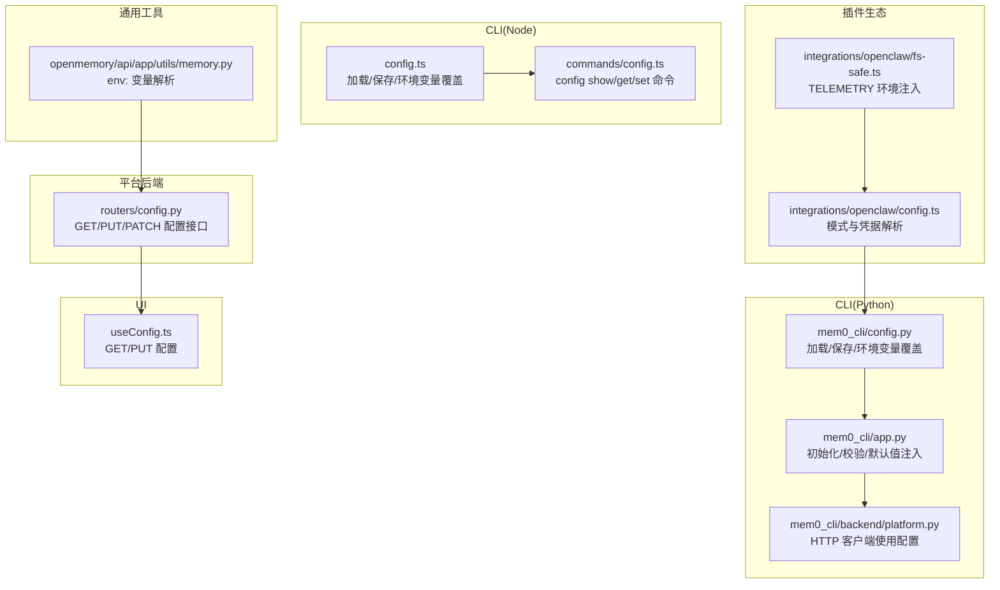
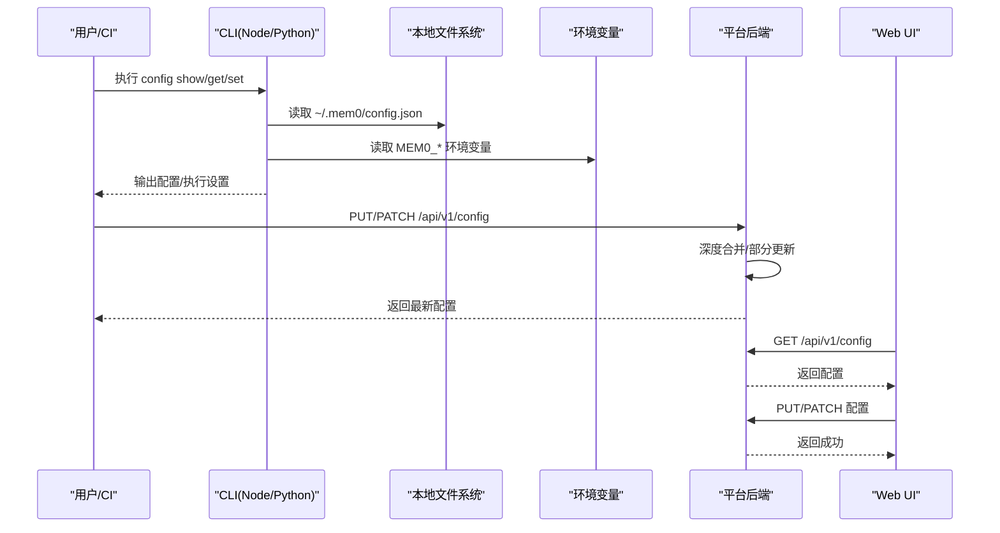
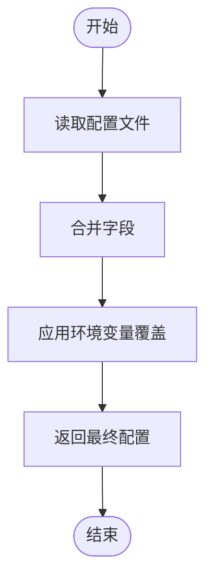
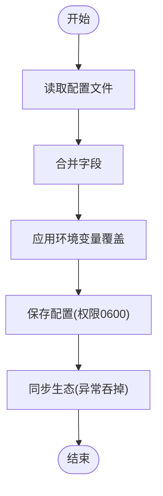
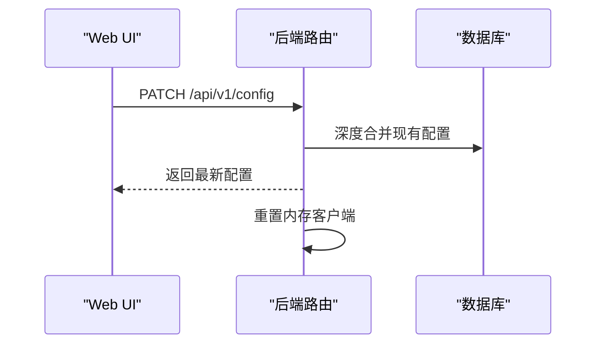
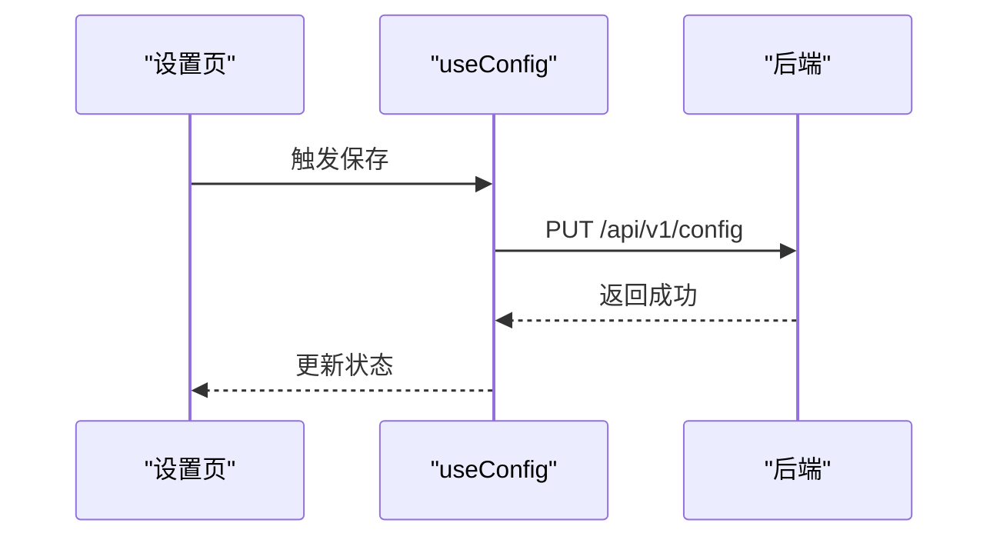
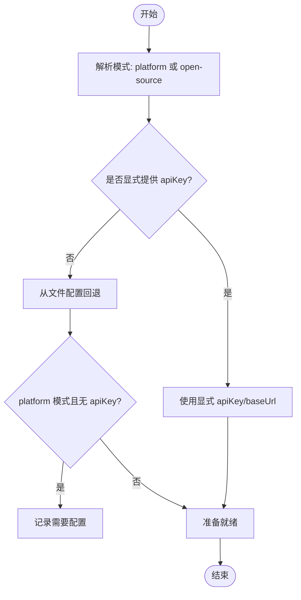
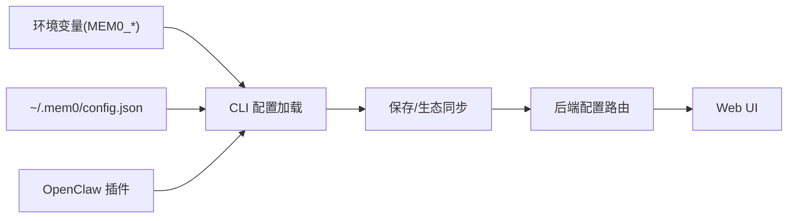

# 配置管理

<cite>
**本文引用的文件**
- [cli/node/src/config.ts](file://cli/node/src/config.ts)
- [cli/node/src/commands/config.ts](file://cli/node/src/commands/config.ts)
- [cli/python/src/mem0_cli/config.py](file://cli/python/src/mem0_cli/config.py)
- [cli/python/src/mem0_cli/app.py](file://cli/python/src/mem0_cli/app.py)
- [cli/python/src/mem0_cli/backend/platform.py](file://cli/python/src/mem0_cli/backend/platform.py)
- [openmemory/api/app/routers/config.py](file://openmemory/api/app/routers/config.py)
- [openmemory/ui/hooks/useConfig.ts](file://openmemory/ui/hooks/useConfig.ts)
- [integrations/openclaw/config.ts](file://integrations/openclaw/config.ts)
- [integrations/openclaw/fs-safe.ts](file://integrations/openclaw/fs-safe.ts)
- [openmemory/api/app/utils/memory.py](file://openmemory/api/app/utils/memory.py)
- [cli/node/tests/config.test.ts](file://cli/node/tests/config.test.ts)
</cite>

## 目录
1. [引言](#引言)
2. [项目结构](#项目结构)
3. [核心组件](#核心组件)
4. [架构总览](#架构总览)
5. [详细组件分析](#详细组件分析)
6. [依赖关系分析](#依赖关系分析)
7. [性能考量](#性能考量)
8. [故障排查指南](#故障排查指南)
9. [结论](#结论)
10. [附录](#附录)

## 引言
本指南系统性阐述 mem0 的配置管理体系，覆盖以下主题：
- 运行时配置的动态更新与热重载机制
- 环境变量优先级与配置合并策略
- 不同部署环境（开发、测试、生产）的最佳实践
- 插件配置与自定义组件的集成方法
- 配置验证、默认值设置与配置迁移处理方案

目标是帮助开发者在多语言（Node/Python）、多形态（CLI/服务端/UI/插件）环境中一致地管理配置，并安全可靠地进行变更。

## 项目结构
围绕配置管理的关键位置如下：
- CLI（Node/Python）：负责本地配置文件读写、环境变量覆盖、密钥脱敏显示
- 平台后端：提供配置读取与更新接口，支持部分更新与深度合并
- UI：通过 HTTP 接口拉取与保存配置
- 插件生态：OpenClaw 插件从文件配置或环境变量解析 mem0 模式与凭据
- 工具函数：统一的密钥脱敏、嵌套键访问与类型转换

图表来源
- [cli/node/src/config.ts:90-132](file://cli/node/src/config.ts#L90-L132)
- [cli/node/src/commands/config.ts:19-109](file://cli/node/src/commands/config.ts#L19-L109)
- [cli/python/src/mem0_cli/config.py:88-144](file://cli/python/src/mem0_cli/config.py#L88-L144)
- [cli/python/src/mem0_cli/app.py:103-145](file://cli/python/src/mem0_cli/app.py#L103-L145)
- [cli/python/src/mem0_cli/backend/platform.py:18-22](file://cli/python/src/mem0_cli/backend/platform.py#L18-L22)
- [openmemory/api/app/routers/config.py:141-177](file://openmemory/api/app/routers/config.py#L141-L177)
- [openmemory/ui/hooks/useConfig.ts:35-68](file://openmemory/ui/hooks/useConfig.ts#L35-L68)
- [integrations/openclaw/config.ts:196-214](file://integrations/openclaw/config.ts#L196-L214)
- [integrations/openclaw/fs-safe.ts:38-43](file://integrations/openclaw/fs-safe.ts#L38-L43)
- [openmemory/api/app/utils/memory.py:379-401](file://openmemory/api/app/utils/memory.py#L379-L401)

章节来源
- [cli/node/src/config.ts:1-233](file://cli/node/src/config.ts#L1-L233)
- [cli/python/src/mem0_cli/config.py:1-242](file://cli/python/src/mem0_cli/config.py#L1-L242)
- [openmemory/api/app/routers/config.py:141-177](file://openmemory/api/app/routers/config.py#L141-L177)
- [openmemory/ui/hooks/useConfig.ts:29-68](file://openmemory/ui/hooks/useConfig.ts#L29-L68)
- [integrations/openclaw/config.ts:183-214](file://integrations/openclaw/config.ts#L183-L214)
- [integrations/openclaw/fs-safe.ts:1-43](file://integrations/openclaw/fs-safe.ts#L1-L43)
- [openmemory/api/app/utils/memory.py:379-401](file://openmemory/api/app/utils/memory.py#L379-L401)

## 核心组件
- 配置数据模型与默认值
  - Node/Python 两端均定义了统一的数据结构：版本号、平台配置（API Key、Base URL、用户邮箱等）、默认作用域（用户/代理/应用/运行）、遥测匿名 ID、Agent Rush 确认时间戳等。
  - 默认值在加载配置失败或缺失字段时生效，确保最小可用状态。

- 加载与保存流程
  - 读取顺序：本地配置文件 → 环境变量 → 默认值
  - 写入顺序：保存到本地配置文件；同时尝试同步到生态触点（如插件环境注入），保证一致性但不阻塞主流程

- 嵌套键访问与类型转换
  - 支持“点路径”访问与短名别名（如 api_key 对应 platform.api_key）
  - 在设置时根据目标字段类型进行布尔/整数转换，提升易用性

- 密钥脱敏
  - 显示敏感字段时自动脱敏，避免泄露

章节来源
- [cli/node/src/config.ts:49-83](file://cli/node/src/config.ts#L49-L83)
- [cli/node/src/config.ts:90-132](file://cli/node/src/config.ts#L90-L132)
- [cli/node/src/config.ts:187-232](file://cli/node/src/config.ts#L187-L232)
- [cli/node/src/config.ts:181-185](file://cli/node/src/config.ts#L181-L185)
- [cli/python/src/mem0_cli/config.py:61-68](file://cli/python/src/mem0_cli/config.py#L61-L68)
- [cli/python/src/mem0_cli/config.py:88-144](file://cli/python/src/mem0_cli/config.py#L88-L144)
- [cli/python/src/mem0_cli/config.py:205-242](file://cli/python/src/mem0_cli/config.py#L205-L242)

## 架构总览
下图展示配置在各层之间的流转与控制流，体现“文件优先、环境变量覆盖、默认值兜底”的原则。

图表来源
- [cli/node/src/commands/config.ts:19-109](file://cli/node/src/commands/config.ts#L19-L109)
- [cli/python/src/mem0_cli/config.py:88-144](file://cli/python/src/mem0_cli/config.py#L88-L144)
- [openmemory/api/app/routers/config.py:141-177](file://openmemory/api/app/routers/config.py#L141-L177)
- [openmemory/ui/hooks/useConfig.ts:35-68](file://openmemory/ui/hooks/useConfig.ts#L35-L68)

## 详细组件分析

### Node CLI 配置模块
- 职责
  - 定义配置结构体、默认值、加载/保存逻辑
  - 解析环境变量覆盖
  - 提供嵌套键访问与类型转换
  - 保存时同步到生态触点（插件环境注入）

- 关键流程
  - 加载：读取 JSON 文件 → 合并字段 → 应用环境变量覆盖
  - 设置：按点路径定位字段 → 类型转换 → 写回文件 → 同步生态
  - 显示：对敏感字段脱敏

图表来源
- [cli/node/src/config.ts:90-132](file://cli/node/src/config.ts#L90-L132)

章节来源
- [cli/node/src/config.ts:1-233](file://cli/node/src/config.ts#L1-L233)
- [cli/node/src/commands/config.ts:19-109](file://cli/node/src/commands/config.ts#L19-L109)
- [cli/node/tests/config.test.ts:1-59](file://cli/node/tests/config.test.ts#L1-L59)

### Python CLI 配置模块
- 职责
  - 数据类定义配置结构与默认值
  - 从文件加载并应用环境变量覆盖
  - 提供嵌套访问与类型转换
  - 保存配置并设置安全权限

- 关键流程
  - 加载：读取 JSON → 合并字段 → 环境变量覆盖
  - 设置：短名别名映射 → 点路径解析 → 类型转换
  - 保存：写入 JSON → 设置权限 0600 → 生态同步（异常吞掉）

图表来源
- [cli/python/src/mem0_cli/config.py:88-144](file://cli/python/src/mem0_cli/config.py#L88-L144)
- [cli/python/src/mem0_cli/config.py:147-194](file://cli/python/src/mem0_cli/config.py#L147-L194)

章节来源
- [cli/python/src/mem0_cli/config.py:1-242](file://cli/python/src/mem0_cli/config.py#L1-L242)
- [cli/python/src/mem0_cli/app.py:103-145](file://cli/python/src/mem0_cli/app.py#L103-L145)
- [cli/python/src/mem0_cli/backend/platform.py:18-22](file://cli/python/src/mem0_cli/backend/platform.py#L18-L22)

### 平台后端配置路由
- 能力
  - GET：返回当前配置
  - PUT：整体替换 mem0 配置（可选更新 openmemory 子配置）
  - PATCH：深度合并（仅传入字段覆盖）

- 热重载
  - PATCH 成功后触发客户端重置，实现配置变更后的即时生效

图表来源
- [openmemory/api/app/routers/config.py:141-177](file://openmemory/api/app/routers/config.py#L141-L177)

章节来源
- [openmemory/api/app/routers/config.py:141-177](file://openmemory/api/app/routers/config.py#L141-L177)

### UI 配置交互
- 能力
  - 拉取配置：GET /api/v1/config
  - 保存配置：PUT /api/v1/config
  - 支持表单视图与 JSON 编辑器两种编辑方式

图表来源
- [openmemory/ui/hooks/useConfig.ts:35-68](file://openmemory/ui/hooks/useConfig.ts#L35-L68)

章节来源
- [openmemory/ui/hooks/useConfig.ts:29-68](file://openmemory/ui/hooks/useConfig.ts#L29-L68)

### 插件生态配置解析（OpenClaw）
- 能力
  - 从插件配置中解析 mem0 模式（platform/open-source）
  - 从文件配置回退解析 API Key/Base URL
  - 对未知模式给出警告并回退为 platform 模式
  - 支持 ${VAR} 变量展开（构建期注入）

图表来源
- [integrations/openclaw/config.ts:183-214](file://integrations/openclaw/config.ts#L183-L214)

章节来源
- [integrations/openclaw/config.ts:183-214](file://integrations/openclaw/config.ts#L183-L214)

### 环境变量注入与工具
- TELEMETRY 环境注入
  - 通过 fs-safe 模块在全局标记 telemetry 覆盖值，便于上层组件读取

- env: 变量解析
  - 在配置值中以“env:VAR_NAME”形式引用环境变量，运行时解析为真实值；若未设置则保留原值并打印警告

章节来源
- [integrations/openclaw/fs-safe.ts:38-43](file://integrations/openclaw/fs-safe.ts#L38-L43)
- [openmemory/api/app/utils/memory.py:379-401](file://openmemory/api/app/utils/memory.py#L379-L401)

## 依赖关系分析
- 组件耦合
  - CLI 与本地文件系统强耦合，负责配置的持久化与生态同步
  - 平台后端与数据库耦合，负责集中式配置存储与对外暴露
  - UI 与后端路由耦合，负责可视化配置编辑
  - 插件生态与 CLI 配置存在回退依赖（OpenClaw 从文件配置回退）

- 外部依赖
  - 环境变量 MEM0_* 作为最高优先级覆盖源
  - 插件生态的环境注入与变量展开

图表来源
- [cli/node/src/config.ts:120-131](file://cli/node/src/config.ts#L120-L131)
- [cli/python/src/mem0_cli/config.py:119-143](file://cli/python/src/mem0_cli/config.py#L119-L143)
- [openmemory/api/app/routers/config.py:141-177](file://openmemory/api/app/routers/config.py#L141-L177)
- [integrations/openclaw/config.ts:196-204](file://integrations/openclaw/config.ts#L196-L204)

章节来源
- [cli/node/src/config.ts:120-131](file://cli/node/src/config.ts#L120-L131)
- [cli/python/src/mem0_cli/config.py:119-143](file://cli/python/src/mem0_cli/config.py#L119-L143)
- [openmemory/api/app/routers/config.py:141-177](file://openmemory/api/app/routers/config.py#L141-L177)
- [integrations/openclaw/config.ts:196-204](file://integrations/openclaw/config.ts#L196-L204)

## 性能考量
- 加载开销
  - 本地文件读取与 JSON 解析成本极低，适合频繁调用
  - 环境变量覆盖为常量时间操作

- 写入与同步
  - 保存配置为磁盘写入，建议批量修改后再落盘
  - 生态同步（如插件环境注入）为尽力而为，异常不阻塞主流程

- 后端热重载
  - PATCH 后立即重置客户端，避免缓存旧配置带来的延迟

## 故障排查指南
- 常见问题与定位
  - 配置未生效：检查环境变量前缀是否正确（MEM0_*），确认加载顺序
  - 密钥泄露风险：仅在显示时脱敏，避免直接日志输出
  - 插件未识别配置：确认 OpenClaw 是否从文件配置回退，或显式提供 apiKey/baseUrl
  - 后端配置未更新：确认使用 PATCH 进行部分更新，或 PUT 替换整体配置

- 验证步骤
  - 使用 CLI 命令查看/设置配置，核对嵌套键路径与类型
  - 在 UI 中拉取配置，确认返回值与预期一致
  - 查看后端日志，确认 PATCH 成功与客户端重置

章节来源
- [cli/node/src/commands/config.ts:68-109](file://cli/node/src/commands/config.ts#L68-L109)
- [cli/python/src/mem0_cli/config.py:196-203](file://cli/python/src/mem0_cli/config.py#L196-L203)
- [openmemory/api/app/routers/config.py:141-177](file://openmemory/api/app/routers/config.py#L141-L177)
- [integrations/openclaw/config.ts:196-214](file://integrations/openclaw/config.ts#L196-L214)

## 结论
本指南提供了跨语言、跨形态的配置管理蓝图：以文件为权威、以环境变量为动态开关、以默认值为安全兜底；通过后端路由实现集中式配置与热重载；通过插件生态实现灵活的模式与凭据解析。遵循本文的最佳实践，可在开发、测试、生产环境中稳定地演进配置体系。

## 附录

### 环境变量优先级与合并策略
- 优先级（从高到低）
  - 环境变量（MEM0_*）
  - 本地配置文件（~/.mem0/config.json）
  - 默认值

- 合并策略
  - 字段级合并：文件中缺失字段由默认值补齐；环境变量覆盖文件中的对应字段
  - 类型安全：设置时按目标字段类型进行布尔/整数转换
  - UI/后端：PATCH 采用深度合并，PUT 整体替换

章节来源
- [cli/node/src/config.ts:4-9](file://cli/node/src/config.ts#L4-L9)
- [cli/node/src/config.ts:120-131](file://cli/node/src/config.ts#L120-L131)
- [cli/python/src/mem0_cli/config.py:3-8](file://cli/python/src/mem0_cli/config.py#L3-L8)
- [cli/python/src/mem0_cli/config.py:119-143](file://cli/python/src/mem0_cli/config.py#L119-L143)
- [openmemory/api/app/routers/config.py:164-173](file://openmemory/api/app/routers/config.py#L164-L173)

### 不同部署环境的最佳实践
- 开发环境
  - 使用环境变量快速切换 Base URL 与 API Key，避免频繁修改文件
  - 在 UI 中启用 JSON 编辑器进行快速验证

- 测试环境
  - 通过 CI 注入 MEM0_* 环境变量，确保测试一致性
  - 使用 PATCH 进行细粒度配置变更，减少对其他测试的影响

- 生产环境
  - 将敏感信息置于只读的环境变量或密管系统
  - 严格限制配置文件权限（0600），避免被非授权读取
  - 通过后端路由进行集中化配置管理与审计

章节来源
- [cli/python/src/mem0_cli/config.py:177-180](file://cli/python/src/mem0_cli/config.py#L177-L180)
- [openmemory/api/app/routers/config.py:141-177](file://openmemory/api/app/routers/config.py#L141-L177)

### 插件配置与自定义组件集成
- OpenClaw 插件
  - 从插件配置解析模式与凭据，必要时回退到文件配置
  - 支持构建期变量展开，便于打包发布

- 自定义组件
  - 通过环境变量注入（如 TELEMETRY）实现行为控制
  - 通过 env: 变量解析在运行时注入外部配置

章节来源
- [integrations/openclaw/config.ts:183-214](file://integrations/openclaw/config.ts#L183-L214)
- [integrations/openclaw/fs-safe.ts:38-43](file://integrations/openclaw/fs-safe.ts#L38-L43)
- [openmemory/api/app/utils/memory.py:379-401](file://openmemory/api/app/utils/memory.py#L379-L401)

### 配置验证、默认值与迁移
- 配置验证
  - CLI 层面：嵌套键访问与类型转换在设置时完成基础校验
  - 后端层面：PATCH 深度合并，避免覆盖不需要的字段

- 默认值
  - 平台默认 Base URL、空字符串 API Key、空匿名 ID 等
  - 作用域 ID 默认为空，按需在调用侧补充

- 迁移
  - 版本字段用于标识配置格式版本，加载时读取并兼容
  - 插件侧对未知模式给出警告并回退为 platform 模式，降低升级风险

章节来源
- [cli/node/src/config.ts:57-83](file://cli/node/src/config.ts#L57-L83)
- [cli/python/src/mem0_cli/config.py:22-24](file://cli/python/src/mem0_cli/config.py#L22-L24)
- [cli/python/src/mem0_cli/config.py:96-118](file://cli/python/src/mem0_cli/config.py#L96-L118)
- [integrations/openclaw/config.ts:183-194](file://integrations/openclaw/config.ts#L183-L194)