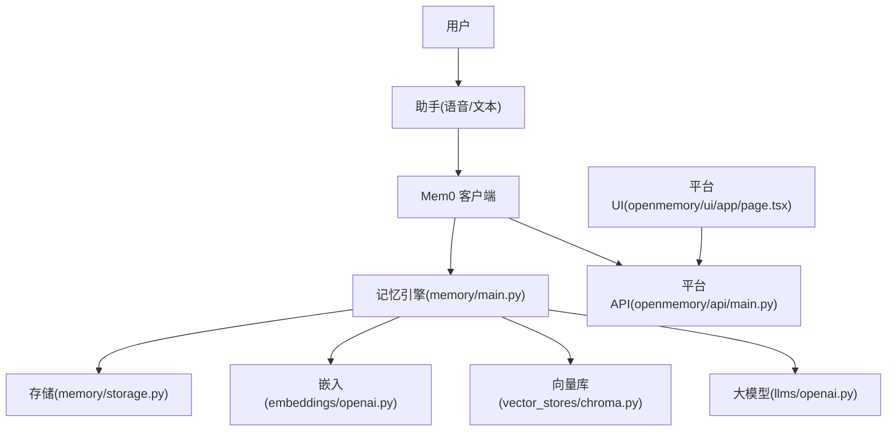
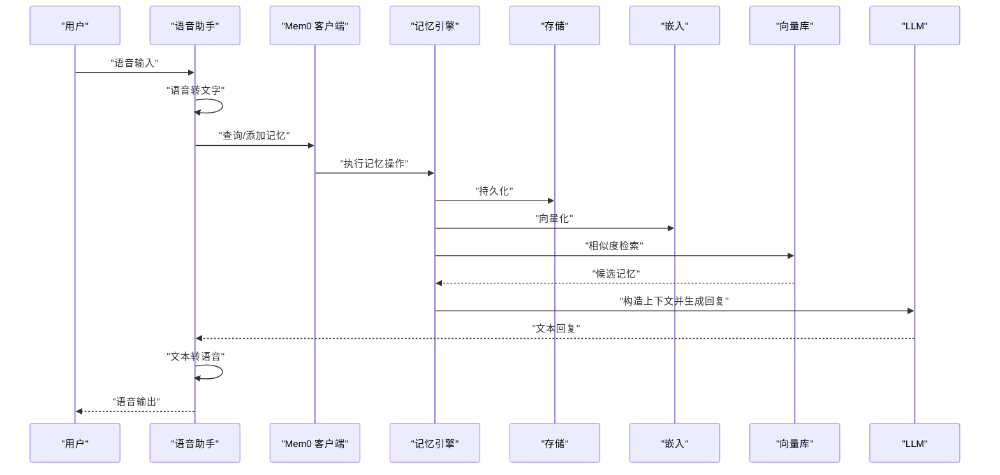
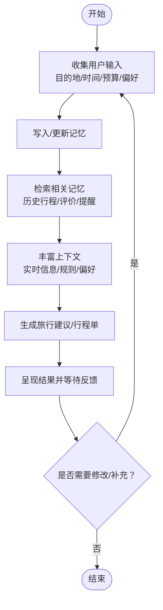
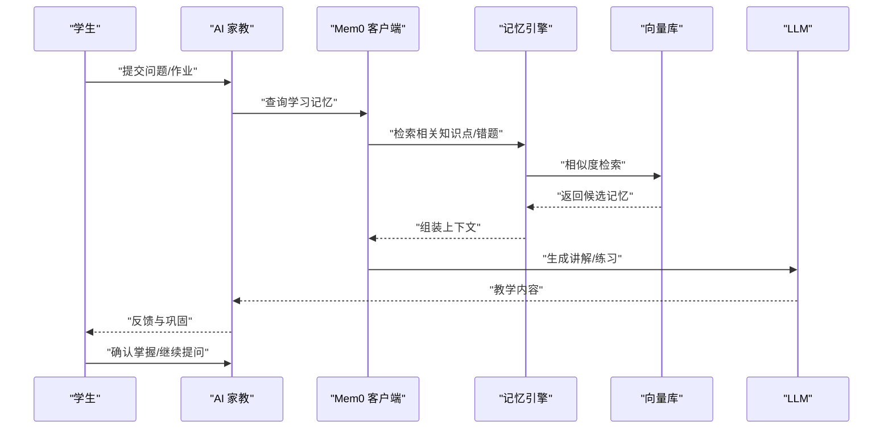
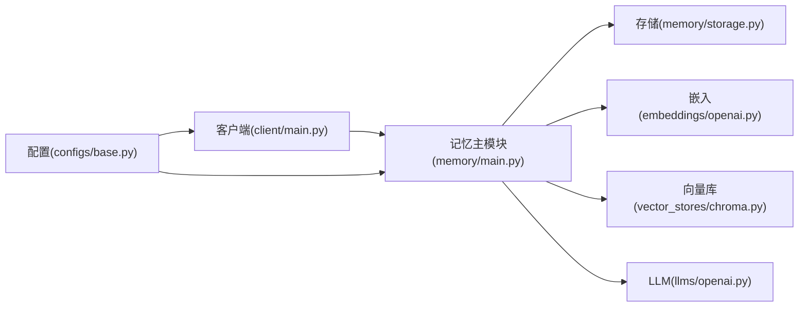

# AI 助手案例

<cite>
**本文引用的文件**
- [ai-tutor.mdx](file://docs/cookbooks/companions/ai-tutor.mdx)
- [travel-assistant.mdx](file://docs/cookbooks/companions/travel-assistant.mdx)
- [voice-companion-openai.mdx](file://docs/cookbooks/companions/voice-companion-openai.mdx)
- [diet_assistant_voice_cartesia.py](file://examples/misc/diet_assistant_voice_cartesia.py)
- [voice_assistant_elevenlabs.py](file://examples/misc/voice_assistant_elevenlabs.py)
- [personal_assistant_agno.py](file://examples/misc/personal_assistant_agno.py)
- [study_buddy.py](file://examples/misc/study_buddy.py)
- [fitness_checker.py](file://examples/misc/fitness_checker.py)
- [healthcare_assistant_google_adk.py](file://examples/misc/healthcare_assistant_google_adk.py)
- [multillm_memory.py](file://examples/misc/multillm_memory.py)
- [mem0-demo/app/assistant.tsx](file://examples/mem0-demo/app/assistant.tsx)
- [mem0-demo/components/mem0/Mem0Provider.tsx](file://examples/mem0-demo/components/mem0/Mem0Provider.tsx)
- [mem0-demo/components/assistant-ui/Mem0ChatUI.tsx](file://examples/mem0-demo/components/assistant-ui/Mem0ChatUI.tsx)
- [mem0-demo/lib/utils.ts](file://examples/mem0-demo/lib/utils.ts)
- [mem0/client/main.py](file://mem0/client/main.py)
- [mem0/memory/main.py](file://mem0/memory/main.py)
- [mem0/memory/storage.py](file://mem0/memory/storage.py)
- [mem0/configs/base.py](file://mem0/configs/base.py)
- [mem0/embeddings/openai.py](file://mem0/embeddings/openai.py)
- [mem0/vector_stores/chroma.py](file://mem0/vector_stores/chroma.py)
- [mem0/llms/openai.py](file://mem0/llms/openai.py)
- [openmemory/api/main.py](file://openmemory/api/main.py)
- [openmemory/ui/app/page.tsx](file://openmemory/ui/app/page.tsx)
</cite>

## 目录
1. [引言](#引言)
2. [项目结构](#项目结构)
3. [核心组件](#核心组件)
4. [架构总览](#架构总览)
5. [详细组件分析](#详细组件分析)
6. [依赖关系分析](#依赖关系分析)
7. [性能考虑](#性能考虑)
8. [故障排除指南](#故障排除指南)
9. [结论](#结论)
10. [附录](#附录)

## 引言
本章节聚焦于 Mem0 在不同场景下的 AI 助手应用实践，涵盖语音助手、旅行助手与 AI 家教等典型用例。我们将从设计思路、功能特性、技术实现到部署方案进行系统化说明，并给出可直接参考的代码片段路径与配置要点，帮助读者快速在自身场景中落地“带记忆”的智能体。

## 项目结构
围绕 AI 助手案例，仓库提供了多语言示例与官方文档 Cookbook，覆盖 Python、前端 Next.js Demo 以及平台化部署入口。下图展示了与“助手案例”相关的核心目录与文件：

```mermaid
graph TB
subgraph "文档(Cookbook)"
DOC_AI_TUTOR["ai-tutor.mdx"]
DOC_TRAVEL["travel-assistant.mdx"]
DOC_VOICE["voice-companion-openai.mdx"]
end
subgraph "示例(Python)"
EX_VOICE_CARTESIA["diet_assistant_voice_cartesia.py"]
EX_VOICE_ELEVEN["voice_assistant_elevenlabs.py"]
EX_PERSONAL_ASSISTANT["personal_assistant_agno.py"]
EX_STUDY_BUDDY["study_buddy.py"]
EX_FITNESS["fitness_checker.py"]
EX_HEALTHCARE["healthcare_assistant_google_adk.py"]
EX_MULTI_LLM["multillm_memory.py"]
end
subgraph "示例(Next.js Demo)"
DEMO_ASSISTANT["assistant.tsx"]
DEMO_MEM0_PROVIDER["Mem0Provider.tsx"]
DEMO_CHAT_UI["Mem0ChatUI.tsx"]
DEMO_UTILS["utils.ts"]
end
subgraph "核心库"
LIB_CLIENT["client/main.py"]
LIB_MEMORY_MAIN["memory/main.py"]
LIB_MEMORY_STORAGE["memory/storage.py"]
LIB_CONFIGS["configs/base.py"]
LIB_EMB_OPENAI["embeddings/openai.py"]
LIB_VEC_CHROMA["vector_stores/chroma.py"]
LIB_LLM_OPENAI["llms/openai.py"]
end
subgraph "平台"
PLATFORM_API["openmemory/api/main.py"]
PLATFORM_UI["openmemory/ui/app/page.tsx"]
end
DOC_AI_TUTOR --> LIB_MEMORY_MAIN
DOC_TRAVEL --> LIB_MEMORY_MAIN
DOC_VOICE --> LIB_MEMORY_MAIN
EX_VOICE_CARTESIA --> LIB_CLIENT
EX_VOICE_ELEVEN --> LIB_CLIENT
EX_PERSONAL_ASSISTANT --> LIB_CLIENT
EX_STUDY_BUDDY --> LIB_CLIENT
EX_FITNESS --> LIB_CLIENT
EX_HEALTHCARE --> LIB_CLIENT
EX_MULTI_LLM --> LIB_CLIENT
DEMO_ASSISTANT --> LIB_CLIENT
DEMO_MEM0_PROVIDER --> LIB_CLIENT
DEMO_CHAT_UI --> LIB_CLIENT
LIB_CLIENT --> LIB_MEMORY_MAIN
LIB_MEMORY_MAIN --> LIB_MEMORY_STORAGE
LIB_MEMORY_MAIN --> LIB_EMB_OPENAI
LIB_MEMORY_MAIN --> LIB_VEC_CHROMA
LIB_MEMORY_MAIN --> LIB_LLM_OPENAI
PLATFORM_API --> LIB_MEMORY_STORAGE
PLATFORM_UI --> PLATFORM_API
```

图表来源
- [ai-tutor.mdx](file://docs/cookbooks/companions/ai-tutor.mdx)
- [travel-assistant.mdx](file://docs/cookbooks/companions/travel-assistant.mdx)
- [voice-companion-openai.mdx](file://docs/cookbooks/companions/voice-companion-openai.mdx)
- [diet_assistant_voice_cartesia.py](file://examples/misc/diet_assistant_voice_cartesia.py)
- [voice_assistant_elevenlabs.py](file://examples/misc/voice_assistant_elevenlabs.py)
- [personal_assistant_agno.py](file://examples/misc/personal_assistant_agno.py)
- [study_buddy.py](file://examples/misc/study_buddy.py)
- [fitness_checker.py](file://examples/misc/fitness_checker.py)
- [healthcare_assistant_google_adk.py](file://examples/misc/healthcare_assistant_google_adk.py)
- [multillm_memory.py](file://examples/misc/multillm_memory.py)
- [mem0-demo/app/assistant.tsx](file://examples/mem0-demo/app/assistant.tsx)
- [mem0-demo/components/mem0/Mem0Provider.tsx](file://examples/mem0-demo/components/mem0/Mem0Provider.tsx)
- [mem0-demo/components/assistant-ui/Mem0ChatUI.tsx](file://examples/mem0-demo/components/assistant-ui/Mem0ChatUI.tsx)
- [mem0/client/main.py](file://mem0/client/main.py)
- [mem0/memory/main.py](file://mem0/memory/main.py)
- [mem0/memory/storage.py](file://mem0/memory/storage.py)
- [mem0/configs/base.py](file://mem0/configs/base.py)
- [mem0/embeddings/openai.py](file://mem0/embeddings/openai.py)
- [mem0/vector_stores/chroma.py](file://mem0/vector_stores/chroma.py)
- [mem0/llms/openai.py](file://mem0/llms/openai.py)
- [openmemory/api/main.py](file://openmemory/api/main.py)
- [openmemory/ui/app/page.tsx](file://openmemory/ui/app/page.tsx)

章节来源
- [ai-tutor.mdx](file://docs/cookbooks/companions/ai-tutor.mdx)
- [travel-assistant.mdx](file://docs/cookbooks/companions/travel-assistant.mdx)
- [voice-companion-openai.mdx](file://docs/cookbooks/companions/voice-companion-openai.mdx)
- [diet_assistant_voice_cartesia.py](file://examples/misc/diet_assistant_voice_cartesia.py)
- [voice_assistant_elevenlabs.py](file://examples/misc/voice_assistant_elevenlabs.py)
- [personal_assistant_agno.py](file://examples/misc/personal_assistant_agno.py)
- [study_buddy.py](file://examples/misc/study_buddy.py)
- [fitness_checker.py](file://examples/misc/fitness_checker.py)
- [healthcare_assistant_google_adk.py](file://examples/misc/healthcare_assistant_google_adk.py)
- [multillm_memory.py](file://examples/misc/multillm_memory.py)
- [mem0-demo/app/assistant.tsx](file://examples/mem0-demo/app/assistant.tsx)
- [mem0-demo/components/mem0/Mem0Provider.tsx](file://examples/mem0-demo/components/mem0/Mem0Provider.tsx)
- [mem0-demo/components/assistant-ui/Mem0ChatUI.tsx](file://examples/mem0-demo/components/assistant-ui/Mem0ChatUI.tsx)
- [mem0/client/main.py](file://mem0/client/main.py)
- [mem0/memory/main.py](file://mem0/memory/main.py)
- [mem0/memory/storage.py](file://mem0/memory/storage.py)
- [mem0/configs/base.py](file://mem0/configs/base.py)
- [mem0/embeddings/openai.py](file://mem0/embeddings/openai.py)
- [mem0/vector_stores/chroma.py](file://mem0/vector_stores/chroma.py)
- [mem0/llms/openai.py](file://mem0/llms/openai.py)
- [openmemory/api/main.py](file://openmemory/api/main.py)
- [openmemory/ui/app/page.tsx](file://openmemory/ui/app/page.tsx)

## 核心组件
- 记忆引擎：负责记忆的增删改查、检索与持久化，贯穿所有助手案例。
- 配置系统：统一管理嵌入模型、向量库、LLM 等外部依赖。
- 客户端封装：为 Python 与前端提供一致的记忆操作接口。
- 平台化入口：OpenMemory 提供 API 与 UI，便于团队协作与可视化管理。

章节来源
- [mem0/memory/main.py](file://mem0/memory/main.py)
- [mem0/memory/storage.py](file://mem0/memory/storage.py)
- [mem0/configs/base.py](file://mem0/configs/base.py)
- [mem0/client/main.py](file://mem0/client/main.py)
- [openmemory/api/main.py](file://openmemory/api/main.py)
- [openmemory/ui/app/page.tsx](file://openmemory/ui/app/page.tsx)

## 架构总览
下图展示了“助手案例”的通用架构：用户输入经由助手（语音/文本）进入，通过客户端调用记忆引擎，结合嵌入与向量库检索上下文，再由 LLM 生成回复，最终返回给用户。平台层提供 API 与 UI 支撑。

图表来源
- [mem0/client/main.py](file://mem0/client/main.py)
- [mem0/memory/main.py](file://mem0/memory/main.py)
- [mem0/memory/storage.py](file://mem0/memory/storage.py)
- [mem0/embeddings/openai.py](file://mem0/embeddings/openai.py)
- [mem0/vector_stores/chroma.py](file://mem0/vector_stores/chroma.py)
- [mem0/llms/openai.py](file://mem0/llms/openai.py)
- [openmemory/api/main.py](file://openmemory/api/main.py)
- [openmemory/ui/app/page.tsx](file://openmemory/ui/app/page.tsx)

## 详细组件分析

### 语音助手案例
- 设计思路
  - 以语音输入/输出为核心交互方式，强调连续对话与个性化记忆。
  - 将语音识别与合成集成到助手流程，确保自然流畅的用户体验。
- 功能特性
  - 实时语音转写与播放
  - 基于记忆的历史上下文增强回答
  - 可扩展的技能与工具调用
- 技术实现
  - 使用 Mem0 客户端进行记忆的增删改查与检索
  - 结合嵌入与向量库实现语义检索
  - 通过 LLM 生成自然语言回复
- 部署方案
  - 本地开发：使用 Chroma 向量库与 OpenAI 嵌入/LLM
  - 生产部署：容器化平台（如 OpenMemory）或云服务

图表来源
- [mem0/client/main.py](file://mem0/client/main.py)
- [mem0/memory/main.py](file://mem0/memory/main.py)
- [mem0/memory/storage.py](file://mem0/memory/storage.py)
- [mem0/embeddings/openai.py](file://mem0/embeddings/openai.py)
- [mem0/vector_stores/chroma.py](file://mem0/vector_stores/chroma.py)
- [mem0/llms/openai.py](file://mem0/llms/openai.py)

章节来源
- [voice-companion-openai.mdx](file://docs/cookbooks/companions/voice-companion-openai.mdx)
- [diet_assistant_voice_cartesia.py](file://examples/misc/diet_assistant_voice_cartesia.py)
- [voice_assistant_elevenlabs.py](file://examples/misc/voice_assistant_elevenlabs.py)
- [mem0/client/main.py](file://mem0/client/main.py)
- [mem0/memory/main.py](file://mem0/memory/main.py)
- [mem0/memory/storage.py](file://mem0/memory/storage.py)
- [mem0/embeddings/openai.py](file://mem0/embeddings/openai.py)
- [mem0/vector_stores/chroma.py](file://mem0/vector_stores/chroma.py)
- [mem0/llms/openai.py](file://mem0/llms/openai.py)

### 旅行助手案例
- 设计思路
  - 围绕行程规划、实时信息查询与个性化推荐构建记忆闭环。
  - 将用户偏好、历史行程与实时数据融合，提供动态建议。
- 功能特性
  - 行程记忆与提醒
  - 多轮对话理解与上下文保持
  - 与外部服务（天气、交通、地图）集成
- 技术实现
  - 使用记忆检索增强 LLM 回答
  - 通过分类与标签组织记忆，提升检索精度
- 部署方案
  - 单体服务：基于 OpenMemory 的 API 与 UI
  - 微服务：将记忆服务独立部署，其他模块按需调用

图表来源
- [travel-assistant.mdx](file://docs/cookbooks/companions/travel-assistant.mdx)
- [mem0/memory/main.py](file://mem0/memory/main.py)
- [mem0/memory/storage.py](file://mem0/memory/storage.py)

章节来源
- [travel-assistant.mdx](file://docs/cookbooks/companions/travel-assistant.mdx)
- [mem0/memory/main.py](file://mem0/memory/main.py)
- [mem0/memory/storage.py](file://mem0/memory/storage.py)

### AI 家教助手案例
- 设计思路
  - 以学习目标为导向，记录学习进度、错题与知识点掌握情况。
  - 通过记忆驱动个性化教学路径与练习推荐。
- 功能特性
  - 学习档案与知识图谱
  - 自适应题目生成与讲解
  - 错题本与复习提醒
- 技术实现
  - 利用记忆检索定位薄弱环节
  - 结合 LLM 进行知识点拆解与举例
- 部署方案
  - 教育平台集成：通过 SDK 或 API 调用
  - 私有化部署：使用 Chroma/PGVector 等向量库

图表来源
- [ai-tutor.mdx](file://docs/cookbooks/companions/ai-tutor.mdx)
- [mem0/client/main.py](file://mem0/client/main.py)
- [mem0/memory/main.py](file://mem0/memory/main.py)
- [mem0/vector_stores/chroma.py](file://mem0/vector_stores/chroma.py)
- [mem0/llms/openai.py](file://mem0/llms/openai.py)

章节来源
- [ai-tutor.mdx](file://docs/cookbooks/companions/ai-tutor.mdx)
- [mem0/client/main.py](file://mem0/client/main.py)
- [mem0/memory/main.py](file://mem0/memory/main.py)
- [mem0/vector_stores/chroma.py](file://mem0/vector_stores/chroma.py)
- [mem0/llms/openai.py](file://mem0/llms/openai.py)

### 其他助手示例
- 个人助理：结合日程、任务与偏好记忆，提供自动化提醒与建议。
- 健康助手：记录健康数据、用药与症状，形成长期跟踪。
- 健身助手：基于运动习惯与目标制定计划并追踪进展。
- 多 LLM 记忆：在同一记忆空间内协调多个模型的输出与反馈。

章节来源
- [personal_assistant_agno.py](file://examples/misc/personal_assistant_agno.py)
- [healthcare_assistant_google_adk.py](file://examples/misc/healthcare_assistant_google_adk.py)
- [fitness_checker.py](file://examples/misc/fitness_checker.py)
- [study_buddy.py](file://examples/misc/study_buddy.py)
- [multillm_memory.py](file://examples/misc/multillm_memory.py)

## 依赖关系分析
- 组件耦合
  - 客户端与记忆引擎松耦合，通过统一接口访问
  - 记忆引擎对嵌入与向量库存在运行时依赖
- 外部依赖
  - OpenAI 嵌入/LLM、Chroma/PGVector 等
- 潜在风险
  - 向量库性能瓶颈与检索延迟
  - LLM 输出质量与提示词工程

图表来源
- [mem0/client/main.py](file://mem0/client/main.py)
- [mem0/memory/main.py](file://mem0/memory/main.py)
- [mem0/memory/storage.py](file://mem0/memory/storage.py)
- [mem0/configs/base.py](file://mem0/configs/base.py)
- [mem0/embeddings/openai.py](file://mem0/embeddings/openai.py)
- [mem0/vector_stores/chroma.py](file://mem0/vector_stores/chroma.py)
- [mem0/llms/openai.py](file://mem0/llms/openai.py)

章节来源
- [mem0/client/main.py](file://mem0/client/main.py)
- [mem0/memory/main.py](file://mem0/memory/main.py)
- [mem0/memory/storage.py](file://mem0/memory/storage.py)
- [mem0/configs/base.py](file://mem0/configs/base.py)
- [mem0/embeddings/openai.py](file://mem0/embeddings/openai.py)
- [mem0/vector_stores/chroma.py](file://mem0/vector_stores/chroma.py)
- [mem0/llms/openai.py](file://mem0/llms/openai.py)

## 性能考虑
- 向量检索优化
  - 合理设置维度与索引参数
  - 使用批量插入与异步检索
- LLM 调用节流
  - 控制上下文长度与并发数
  - 使用缓存与预热
- 存储与网络
  - 选择低延迟的向量库与稳定的网络环境
  - 对敏感数据进行加密与备份

## 故障排除指南
- 记忆未生效
  - 检查记忆写入是否成功与标签/分类是否正确
  - 核对检索关键词与相似度阈值
- 检索结果偏差
  - 调整嵌入模型与向量库参数
  - 优化检索前的过滤条件
- LLM 输出异常
  - 检查提示词与上下文拼接逻辑
  - 关注模型版本与 API 密钥配置

## 结论
通过将 Mem0 的记忆能力与不同场景的助手需求相结合，可以快速构建具备长期记忆与上下文感知的智能体。建议在实际落地时，优先从最小可行产品出发，逐步完善记忆策略、检索与交互模式，并结合平台化能力实现团队协作与可视化运营。

## 附录
- 快速开始
  - 参考官方文档中的“AI 助手” Cookbook 获取完整步骤
  - 使用示例脚本验证核心流程
- 配置清单
  - 嵌入模型、向量库、LLM 的基础配置项
  - 平台 API 与 UI 的访问方式
- 示例代码片段路径
  - 语音助手：[diet_assistant_voice_cartesia.py](file://examples/misc/diet_assistant_voice_cartesia.py)，[voice_assistant_elevenlabs.py](file://examples/misc/voice_assistant_elevenlabs.py)
  - 旅行助手：[travel-assistant.mdx](file://docs/cookbooks/companions/travel-assistant.mdx)
  - AI 家教：[ai-tutor.mdx](file://docs/cookbooks/companions/ai-tutor.mdx)
  - 前端 Demo：[assistant.tsx](file://examples/mem0-demo/app/assistant.tsx)，[Mem0Provider.tsx](file://examples/mem0-demo/components/mem0/Mem0Provider.tsx)，[Mem0ChatUI.tsx](file://examples/mem0-demo/components/assistant-ui/Mem0ChatUI.tsx)，[utils.ts](file://examples/mem0-demo/lib/utils.ts)
  - 核心库：[client/main.py](file://mem0/client/main.py)，[memory/main.py](file://mem0/memory/main.py)，[memory/storage.py](file://mem0/memory/storage.py)，[configs/base.py](file://mem0/configs/base.py)，[embeddings/openai.py](file://mem0/embeddings/openai.py)，[vector_stores/chroma.py](file://mem0/vector_stores/chroma.py)，[llms/openai.py](file://mem0/llms/openai.py)
  - 平台：[openmemory/api/main.py](file://openmemory/api/main.py)，[openmemory/ui/app/page.tsx](file://openmemory/ui/app/page.tsx)