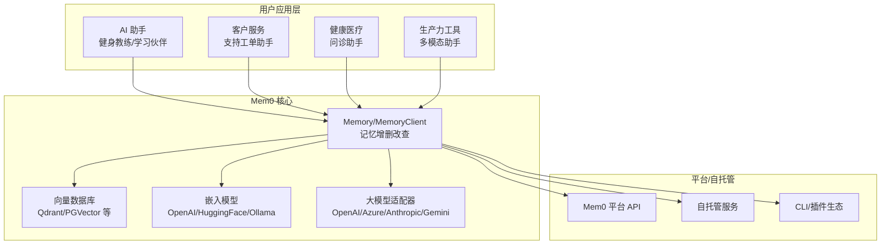
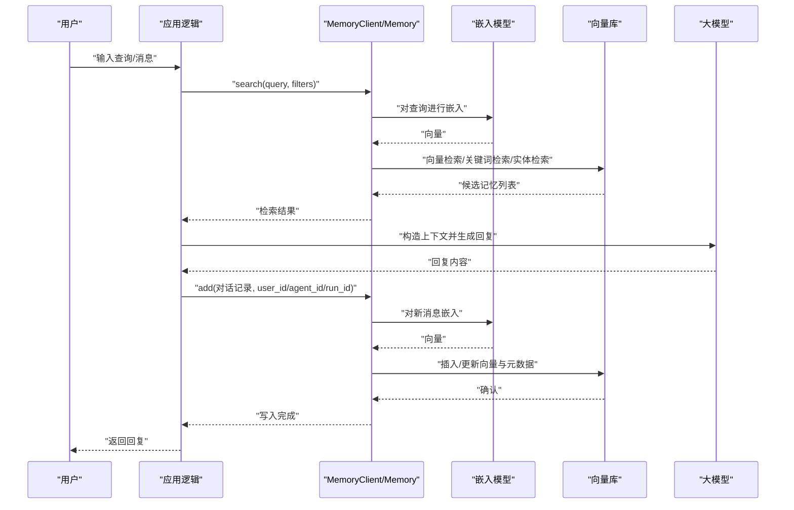
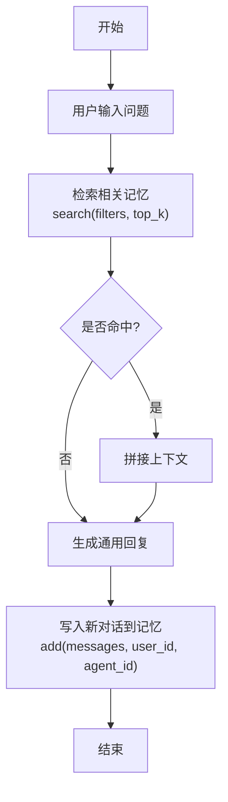
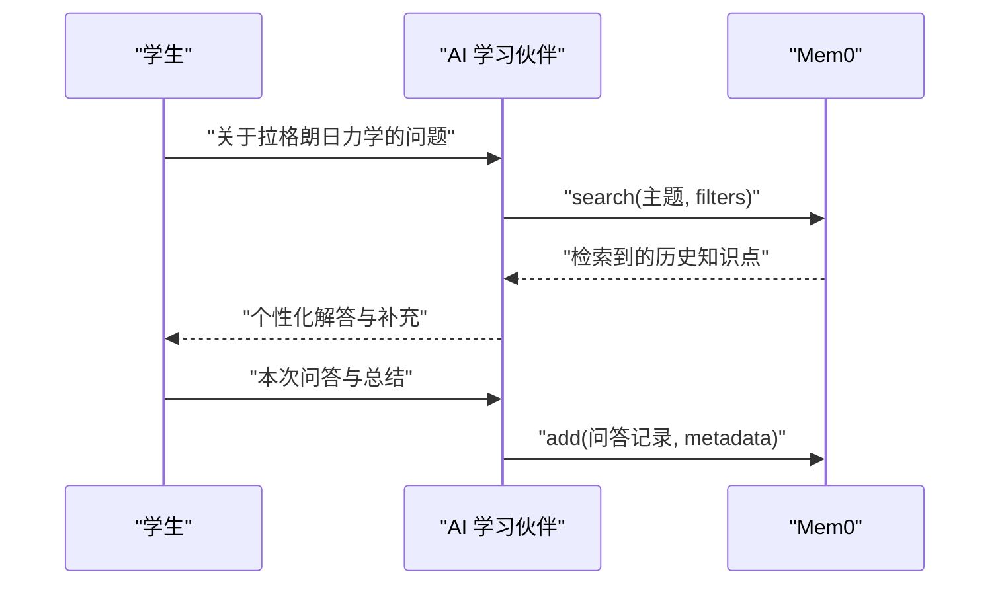
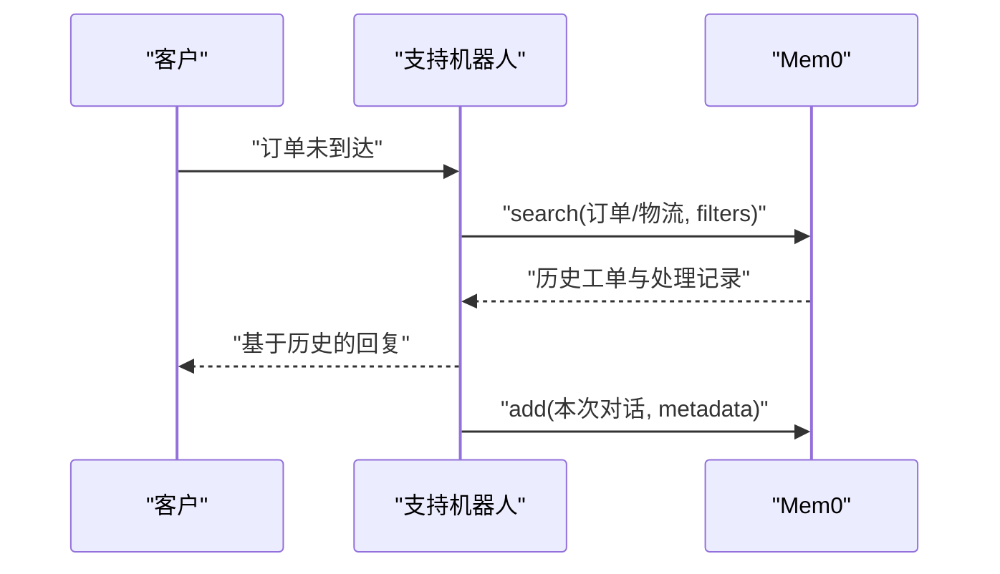
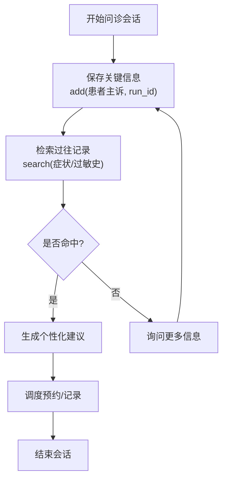
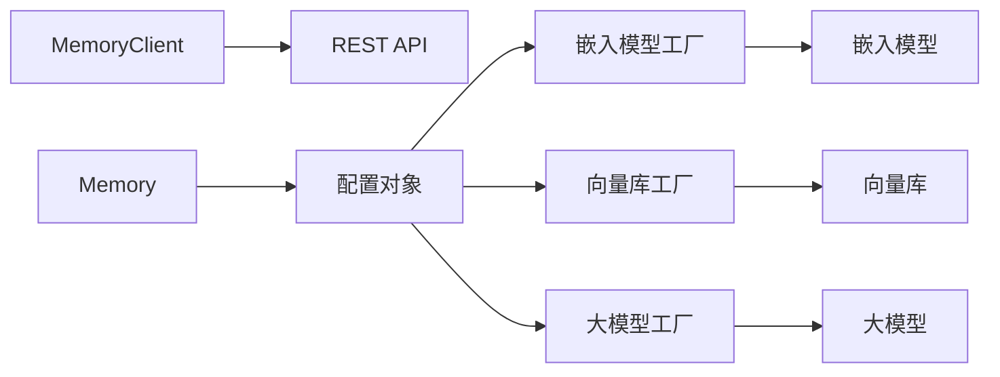

# 使用案例和教程

<cite>
**本文引用的文件**
- [README.md](file://README.md)
- [docs/introduction.mdx](file://docs/introduction.mdx)
- [docs/cookbooks/overview.mdx](file://docs/cookbooks/overview.mdx)
- [docs/cookbooks/essentials/building-ai-companion.mdx](file://docs/cookbooks/essentials/building-ai-companion.mdx)
- [docs/cookbooks/companions/ai-tutor.mdx](file://docs/cookbooks/companions/ai-tutor.mdx)
- [docs/cookbooks/operations/support-inbox.mdx](file://docs/cookbooks/operations/support-inbox.mdx)
- [docs/integrations/crewai.mdx](file://docs/integrations/crewai.mdx)
- [examples/notebooks/customer-support-chatbot.ipynb](file://examples/notebooks/customer-support-chatbot.ipynb)
- [examples/misc/personal_assistant_agno.py](file://examples/misc/personal_assistant_agno.py)
- [examples/misc/healthcare_assistant_google_adk.py](file://examples/misc/healthcare_assistant_google_adk.py)
- [examples/misc/study_buddy.py](file://examples/misc/study_buddy.py)
- [mem0/memory/main.py](file://mem0/memory/main.py)
- [mem0/client/main.py](file://mem0/client/main.py)
- [examples/mem0-demo/package.json](file://examples/mem0-demo/package.json)
</cite>

## 目录
1. [简介](#简介)
2. [项目结构](#项目结构)
3. [核心组件](#核心组件)
4. [架构总览](#架构总览)
5. [详细组件分析](#详细组件分析)
6. [依赖关系分析](#依赖关系分析)
7. [性能考虑](#性能考虑)
8. [故障排除指南](#故障排除指南)
9. [结论](#结论)
10. [附录](#附录)

## 简介
本文件面向希望在真实业务中落地 Mem0 的工程师与产品团队，系统化整理从入门到进阶的使用案例与端到端教程，覆盖 AI 助手、客户服务、健康医疗、生产力工具等多类场景。内容以“概念讲解 + 架构设计 + 实现细节 + 部署建议 + 最佳实践 + 故障排除”为主线，帮助读者快速构建稳定、可扩展、可维护的记忆增强型应用。

## 项目结构
仓库提供了完整的 SDK（Python/TypeScript）、平台与自托管服务、大量集成示例与教程文档。核心要点如下：
- SDK 层：Python SDK 提供 Memory/MemoryClient；TypeScript SDK 提供对应客户端能力
- 平台与自托管：支持云端平台、自托管服务与本地开发环境
- 教程与示例：cookbooks 指南、notebooks 示例、misc 示例脚本、前端演示工程
- 集成生态：与 CrewAI、LangGraph、OpenAI 工具调用、Google ADK、ElevenLabs 等对接

图示来源
- [README.md:1-270](file://README.md#L1-L270)
- [docs/introduction.mdx:1-186](file://docs/introduction.mdx#L1-L186)

章节来源
- [README.md:1-270](file://README.md#L1-L270)
- [docs/introduction.mdx:1-186](file://docs/introduction.mdx#L1-L186)

## 核心组件
- 记忆存储与检索
  - 向量检索：基于嵌入模型与向量数据库的语义相似度检索
  - 关键词检索：BM25 关键词匹配（部分向量库支持）
  - 实体链接：抽取并链接实体，提升跨记忆召回质量
  - 时间推理：支持时间感知的检索排序
- 记忆生命周期管理
  - 新增：消息解析、事实抽取、去噪与过滤、批量写入
  - 查询：阈值与 top_k 控制、过滤器组合、重排与融合
  - 更新/删除：按需更新或级联删除
  - 导出：结构化导出与摘要统计
- 客户端与平台
  - MemoryClient：统一的 REST API 客户端，支持搜索、新增、批量操作、导出等
  - 平台项目配置：自定义指令、分类、检索策略、多语言等
- 多模态与实体
  - 视觉消息解析、多模态输入处理
  - 实体提取与链接，支持跨记忆关联

章节来源
- [mem0/memory/main.py:1-800](file://mem0/memory/main.py#L1-L800)
- [mem0/client/main.py:1-800](file://mem0/client/main.py#L1-L800)

## 架构总览
下图展示了典型“记忆增强应用”的端到端数据流：应用侧发起请求，通过 Mem0 客户端或 SDK 调用，经由 LLM/嵌入模型与向量库完成检索与生成，再将新的交互写回记忆。

图示来源
- [mem0/client/main.py:288-333](file://mem0/client/main.py#L288-L333)
- [mem0/memory/main.py:653-759](file://mem0/memory/main.py#L653-L759)

## 详细组件分析

### 基础教程：构建“记忆增强的 AI 助手”
目标：以“健身教练”为例，演示如何在每次对话中读取历史、个性化输出，并持续积累长期记忆。

- 场景拆解
  - 会话边界：使用 user_id 区分不同用户；使用 run_id 区分不同训练周期
  - 记忆类型：目标（goals）、限制（constraints）、偏好（preferences）
  - 过滤与分类：通过 metadata 或平台分类控制召回范围
  - 自动清理：临时约束设置过期时间后定期清理
- 实现要点
  - 检索：search(query, filters, top_k, threshold)
  - 写入：add(messages, user_id, agent_id, metadata)
  - 分类与过滤：metadata.memory_bucket 或平台 categories
  - 会话隔离：run_id 限定检索范围
- 参考路径
  - [docs/cookbooks/essentials/building-ai-companion.mdx:50-170](file://docs/cookbooks/essentials/building-ai-companion.mdx#L50-L170)
  - [docs/cookbooks/essentials/building-ai-companion.mdx:175-410](file://docs/cookbooks/essentials/building-ai-companion.mdx#L175-L410)
  - [docs/cookbooks/essentials/building-ai-companion.mdx:414-483](file://docs/cookbooks/essentials/building-ai-companion.mdx#L414-L483)
  - [docs/cookbooks/essentials/building-ai-companion.mdx:532-570](file://docs/cookbooks/essentials/building-ai-companion.mdx#L532-L570)
  - [docs/cookbooks/essentials/building-ai-companion.mdx:724-788](file://docs/cookbooks/essentials/building-ai-companion.mdx#L724-L788)

图示来源
- [mem0/client/main.py:288-333](file://mem0/client/main.py#L288-L333)
- [mem0/client/main.py:172-211](file://mem0/client/main.py#L172-L211)

章节来源
- [docs/cookbooks/essentials/building-ai-companion.mdx:1-800](file://docs/cookbooks/essentials/building-ai-companion.mdx#L1-L800)
- [mem0/client/main.py:172-333](file://mem0/client/main.py#L172-L333)
- [mem0/memory/main.py:653-759](file://mem0/memory/main.py#L653-L759)

### 应用案例一：AI 辅导员（学习伙伴）
- 场景：学生在不同课程与阶段间切换，需要持续追踪学习进度、薄弱环节与偏好
- 关键点
  - 使用 metadata 标注主题与类型，便于后续检索
  - 支持 PDF/图片上传，结合视觉理解与记忆检索
  - 结合“间隔重复”提示，引导复习
- 参考路径
  - [docs/cookbooks/companions/ai-tutor.mdx:1-126](file://docs/cookbooks/companions/ai-tutor.mdx#L1-L126)
  - [examples/misc/study_buddy.py:1-87](file://examples/misc/study_buddy.py#L1-L87)

图示来源
- [docs/cookbooks/companions/ai-tutor.mdx:54-84](file://docs/cookbooks/companions/ai-tutor.mdx#L54-L84)
- [examples/misc/study_buddy.py:39-61](file://examples/misc/study_buddy.py#L39-L61)

章节来源
- [docs/cookbooks/companions/ai-tutor.mdx:1-126](file://docs/cookbooks/companions/ai-tutor.mdx#L1-L126)
- [examples/misc/study_buddy.py:1-87](file://examples/misc/study_buddy.py#L1-L87)

### 应用案例二：客户支持智能体（支持工单助手）
- 场景：客服机器人需要记住用户历史、已解决的问题与沟通风格，提升一致性与效率
- 关键点
  - 使用 user_id 维持同一用户的连续对话
  - 将历史对话写入记忆，检索时优先参考最近相关交互
  - 支持导出与摘要，辅助运营分析
- 参考路径
  - [docs/cookbooks/operations/support-inbox.mdx:1-124](file://docs/cookbooks/operations/support-inbox.mdx#L1-L124)
  - [examples/notebooks/customer-support-chatbot.ipynb:1-226](file://examples/notebooks/customer-support-chatbot.ipynb#L1-L226)

图示来源
- [docs/cookbooks/operations/support-inbox.mdx:51-83](file://docs/cookbooks/operations/support-inbox.mdx#L51-L83)
- [examples/notebooks/customer-support-chatbot.ipynb:75-112](file://examples/notebooks/customer-support-chatbot.ipynb#L75-L112)

章节来源
- [docs/cookbooks/operations/support-inbox.mdx:1-124](file://docs/cookbooks/operations/support-inbox.mdx#L1-L124)
- [examples/notebooks/customer-support-chatbot.ipynb:1-226](file://examples/notebooks/customer-support-chatbot.ipynb#L1-L226)

### 应用案例三：健康医疗助手（Google ADK）
- 场景：在 Google ADK 会话中保存患者信息、检索过往记录、调度预约
- 关键点
  - 使用 run_id 标识一次问诊会话，避免跨会话污染
  - 工具函数封装 add/search，便于在会话流程中复用
  - 注意隐私与合规：仅存储必要信息，遵循最小化原则
- 参考路径
  - [examples/misc/healthcare_assistant_google_adk.py:1-209](file://examples/misc/healthcare_assistant_google_adk.py#L1-L209)

图示来源
- [examples/misc/healthcare_assistant_google_adk.py:18-58](file://examples/misc/healthcare_assistant_google_adk.py#L18-L58)

章节来源
- [examples/misc/healthcare_assistant_google_adk.py:1-209](file://examples/misc/healthcare_assistant_google_adk.py#L1-L209)

### 应用案例四：多模态个人助理（AGNO + 图像）
- 场景：同时处理文本与图像，将图片内容与历史对话结合，提供更丰富的上下文
- 关键点
  - 将图片编码为 base64，作为多模态消息的一部分写入记忆
  - 检索时结合文本与图像相关的记忆，提升回答准确性
- 参考路径
  - [examples/misc/personal_assistant_agno.py:1-97](file://examples/misc/personal_assistant_agno.py#L1-L97)

章节来源
- [examples/misc/personal_assistant_agno.py:1-97](file://examples/misc/personal_assistant_agno.py#L1-L97)

### 集成案例：CrewAI + Mem0
- 场景：使用 CrewAI 的多智能体编排，结合 Mem0 的持久化记忆，实现跨智能体的知识共享与个性化服务
- 关键点
  - 通过 MemoryClient 将用户偏好与历史写入记忆
  - 在 Crew 中启用 memory，并指定 provider 为 mem0
  - 利用工具（如 Serper）进行实时信息检索
- 参考路径
  - [docs/integrations/crewai.mdx:1-173](file://docs/integrations/crewai.mdx#L1-L173)

章节来源
- [docs/integrations/crewai.mdx:1-173](file://docs/integrations/crewai.mdx#L1-L173)

### 端到端项目示例：Next.js 前端演示
- 项目：mem0-demo（Next.js + Assistant UI + Vercel AI SDK Provider）
- 特点：提供可直接运行的 Web Demo，集成 Mem0 与 AI SDK，便于快速验证
- 参考路径
  - [examples/mem0-demo/package.json:1-60](file://examples/mem0-demo/package.json#L1-L60)

章节来源
- [examples/mem0-demo/package.json:1-60](file://examples/mem0-demo/package.json#L1-L60)

## 依赖关系分析
- 组件耦合
  - Memory/MemoryClient 与嵌入模型、向量库、大模型之间为松耦合，通过工厂与配置驱动
  - 客户端与平台/自托管服务通过统一 API 接口对接
- 外部依赖
  - 向量库：Qdrant、PGVector、Faiss、Weaviate 等
  - 嵌入模型：OpenAI、HuggingFace、Ollama、VertexAI 等
  - 大模型：OpenAI、Anthropic、Gemini、Azure OpenAI 等
- 配置与版本
  - 通过配置对象统一管理 provider 与 config，支持热切换与灰度升级

图示来源
- [mem0/client/main.py:84-147](file://mem0/client/main.py#L84-L147)
- [mem0/memory/main.py:407-432](file://mem0/memory/main.py#L407-L432)

章节来源
- [mem0/client/main.py:84-147](file://mem0/client/main.py#L84-L147)
- [mem0/memory/main.py:407-432](file://mem0/memory/main.py#L407-L432)

## 性能考虑
- 检索性能
  - 合理设置 top_k 与阈值，避免过多候选导致延迟上升
  - 对于长上下文，优先使用“重要事实”进入记忆，短期上下文保留在应用内存
- 向量库选择
  - 优先选择支持关键词检索（BM25）与实体链接的向量库，提升召回质量
  - 控制集合命名与维度，确保索引与嵌入维度一致
- 批量写入
  - 使用批量接口减少网络往返，注意幂等性与冲突处理
- 清理策略
  - 对临时记忆设置过期时间，定期清理无效数据，保持检索效率
- 多模态
  - 图像/视频等高维输入需谨慎评估嵌入成本，必要时降采样或裁剪

## 故障排除指南
- 常见错误与定位
  - 参数校验失败：检查 user_id/agent_id/run_id 是否为空或包含空格
  - 查询格式非法：确保 query 为非空字符串，去除首尾空白
  - API Key 无效：确认 MEM0_API_KEY 设置正确，或在初始化时传入
  - 向量库连接异常：核对 host/port/collection_name 与嵌入维度
- 日志与诊断
  - 开启调试日志，关注检索耗时与向量写入失败
  - 使用 get_all 与 search 返回结构核对过滤条件
- 回滚与迁移
  - 平台与自托管版本差异：留意 API 版本与字段变更
  - 迁移指南：参考平台迁移文档，确保数据与配置平滑过渡

章节来源
- [mem0/memory/main.py:170-210](file://mem0/memory/main.py#L170-L210)
- [mem0/client/main.py:149-171](file://mem0/client/main.py#L149-L171)

## 结论
通过本教程与案例，您可以在多种业务场景中快速落地 Mem0：从简单的“记忆增强助手”，到复杂的“客户服务/健康医疗/多智能体编排”。建议在项目初期明确“记忆边界”（用户/会话/代理）、“记忆类型”（目标/限制/偏好）与“过滤策略”，并在生产环境中建立“写入去噪、检索优化、定期清理”的闭环机制，以获得稳定且可扩展的记忆体验。

## 附录
- 快速开始
  - 安装 SDK：pip install mem0ai 或 npm install mem0ai
  - 初始化：Memory.from_config 或 MemoryClient(api_key)
  - 基本操作：add/search/get_all/delete
- 参考文档导航
  - 教程总览：cookbooks/overview
  - 入门教程：building-ai-companion
  - 客户服务：support-inbox
  - AI 辅导：ai-tutor
  - 集成：crewai
  - 示例：notebooks 与 misc

章节来源
- [docs/cookbooks/overview.mdx:1-212](file://docs/cookbooks/overview.mdx#L1-L212)
- [README.md:87-239](file://README.md#L87-L239)