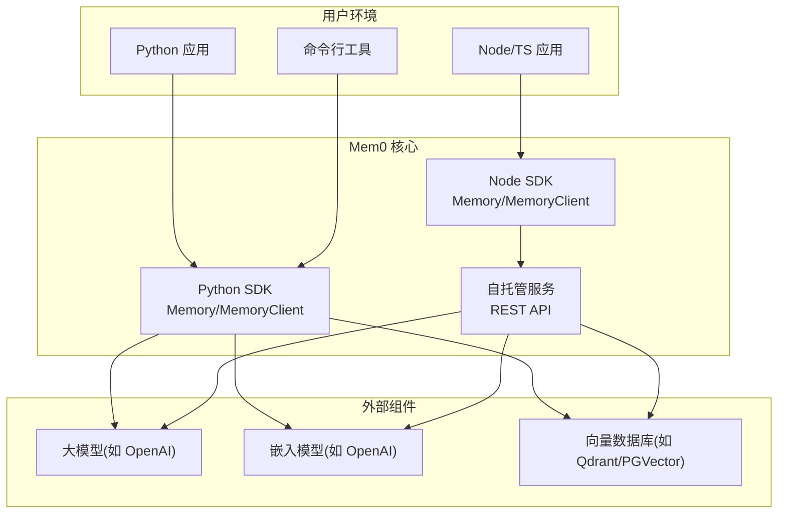
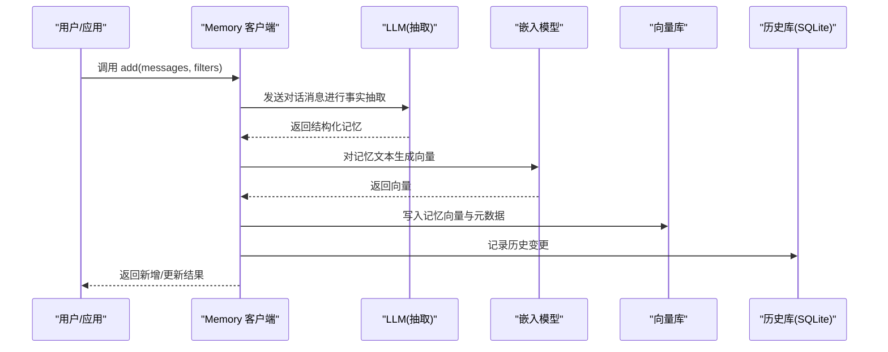
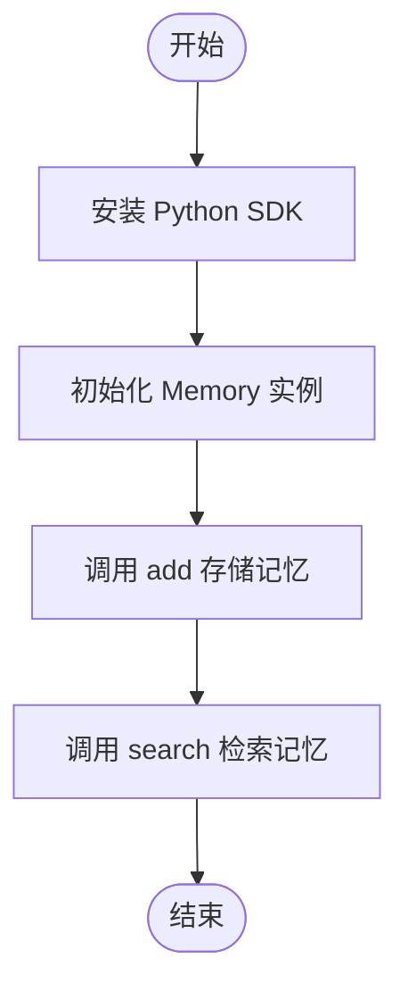
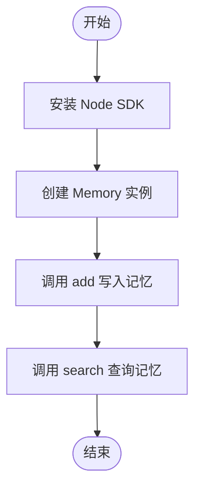
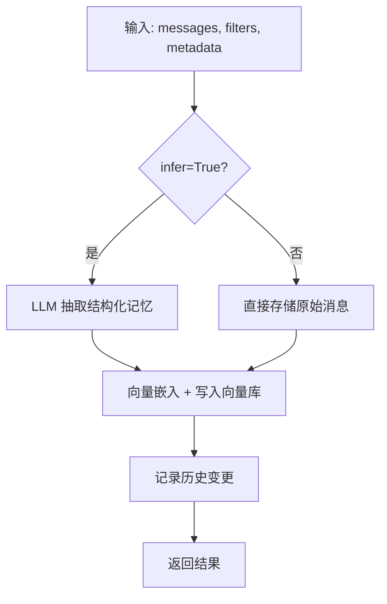
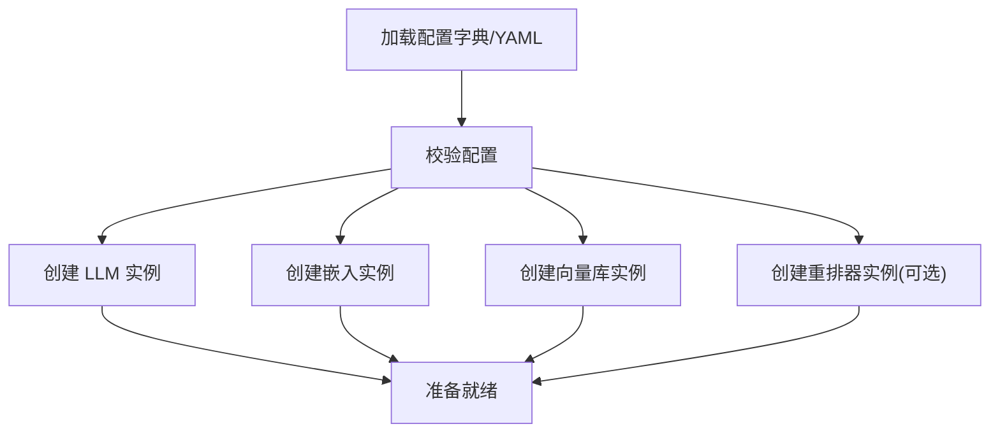
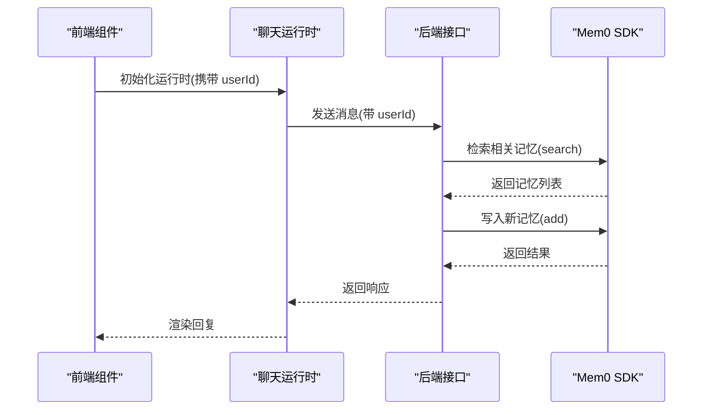
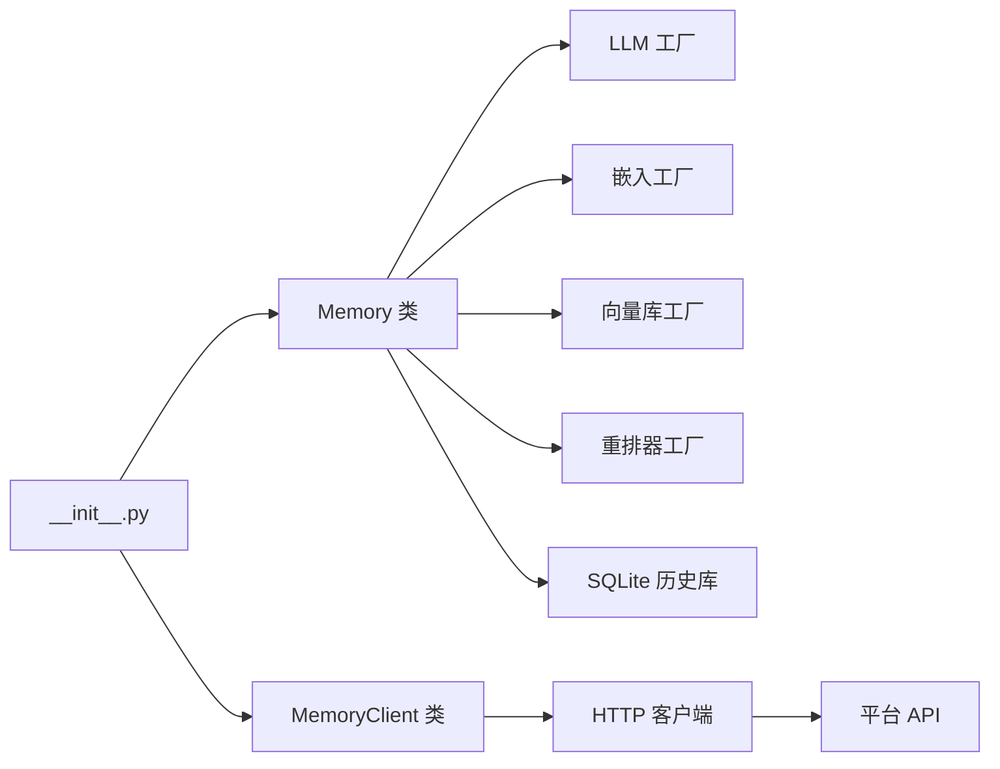

# 基础教程

<cite>
**本文引用的文件**
- [README.md](file://README.md)
- [docs/introduction.mdx](file://docs/introduction.mdx)
- [docs/open-source/overview.mdx](file://docs/open-source/overview.mdx)
- [docs/open-source/python-quickstart.mdx](file://docs/open-source/python-quickstart.mdx)
- [docs/open-source/node-quickstart.mdx](file://docs/open-source/node-quickstart.mdx)
- [docs/core-concepts/memory-operations/add.mdx](file://docs/core-concepts/memory-operations/add.mdx)
- [docs/core-concepts/memory-operations/search.mdx](file://docs/core-concepts/memory-operations/search.mdx)
- [docs/open-source/configuration.mdx](file://docs/open-source/configuration.mdx)
- [mem0/__init__.py](file://mem0/__init__.py)
- [mem0/memory/main.py](file://mem0/memory/main.py)
- [mem0/client/main.py](file://mem0/client/main.py)
- [examples/mem0-demo/app/assistant.tsx](file://examples/mem0-demo/app/assistant.tsx)
</cite>

## 目录
1. [简介](#简介)
2. [项目结构](#项目结构)
3. [核心组件](#核心组件)
4. [架构总览](#架构总览)
5. [详细组件分析](#详细组件分析)
6. [依赖关系分析](#依赖关系分析)
7. [性能考虑](#性能考虑)
8. [故障排查指南](#故障排查指南)
9. [结论](#结论)
10. [附录](#附录)

## 简介
本教程面向初学者，带你从零开始掌握 Mem0 的核心能力与入门流程。你将学会如何安装与初始化、添加与检索记忆、管理配置，并在 Python 与 Node 环境中完成端到端的实践。教程提供循序渐进的学习路径：先从“添加记忆”和“搜索记忆”的最简操作入手，再逐步引入过滤、元数据、重排器、实体链接等高级特性。

## 项目结构
Mem0 提供多语言 SDK（Python 与 Node）、自托管服务、平台托管方案以及丰富的集成示例。你可以选择以下任一方式开始：
- 使用 Python SDK 在本地应用中直接调用
- 使用 Node SDK 在前端或全栈应用中集成
- 使用 CLI 快速体验命令行工作流
- 自建服务或使用平台托管以获得更高可用性与运维便利

图示来源
- [docs/open-source/overview.mdx:1-103](file://docs/open-source/overview.mdx#L1-L103)
- [docs/open-source/python-quickstart.mdx:1-110](file://docs/open-source/python-quickstart.mdx#L1-L110)
- [docs/open-source/node-quickstart.mdx:1-288](file://docs/open-source/node-quickstart.mdx#L1-L288)

章节来源
- [README.md:87-171](file://README.md#L87-L171)
- [docs/introduction.mdx:1-186](file://docs/introduction.mdx#L1-L186)
- [docs/open-source/overview.mdx:1-103](file://docs/open-source/overview.mdx#L1-L103)

## 核心组件
- 记忆客户端（Memory/MemoryClient）：负责添加、查询、更新、删除记忆；支持过滤、重排器、历史审计等。
- 组件工厂：按配置动态创建 LLM、嵌入、向量库、重排器实例。
- 实体存储：抽取并链接实体，提升检索召回质量。
- 配置系统：支持从字典或 YAML 加载配置，覆盖默认组件。

章节来源
- [mem0/__init__.py:1-7](file://mem0/__init__.py#L1-L7)
- [mem0/memory/main.py:407-501](file://mem0/memory/main.py#L407-L501)
- [mem0/client/main.py:71-148](file://mem0/client/main.py#L71-L148)

## 架构总览
下图展示了“添加记忆”的端到端流程：消息经 LLM 抽取事实，冲突检测后写入向量库与历史库，同时可选地进行实体链接与重排。

图示来源
- [mem0/memory/main.py:653-760](file://mem0/memory/main.py#L653-L760)

章节来源
- [docs/core-concepts/memory-operations/add.mdx:1-200](file://docs/core-concepts/memory-operations/add.mdx#L1-L200)

## 详细组件分析

### 快速开始（Python）
- 安装与初始化：通过包管理器安装 SDK 后，导入 Memory 并创建实例。
- 添加记忆：传入用户-助手对话消息，自动抽取关键信息并写入。
- 检索记忆：基于自然语言查询，结合用户 ID 过滤，返回相关记忆列表。

图示来源
- [docs/open-source/python-quickstart.mdx:24-77](file://docs/open-source/python-quickstart.mdx#L24-L77)

章节来源
- [docs/open-source/python-quickstart.mdx:1-110](file://docs/open-source/python-quickstart.mdx#L1-L110)
- [README.md:194-237](file://README.md#L194-L237)

### 快速开始（Node/TS）
- 安装与初始化：通过 npm 安装 SDK，创建 Memory 实例。
- 添加记忆：支持传入消息数组与元数据（如分类），并可指定用户 ID。
- 检索记忆：支持 filters 与 explain 参数，便于调试与优化。

图示来源
- [docs/open-source/node-quickstart.mdx:14-67](file://docs/open-source/node-quickstart.mdx#L14-L67)

章节来源
- [docs/open-source/node-quickstart.mdx:1-288](file://docs/open-source/node-quickstart.mdx#L1-L288)

### 基础记忆操作：添加与搜索
- 添加记忆（Add）：支持“推理抽取”和“原始消息直存”，默认启用冲突检测与去重。
- 搜索记忆（Search）：支持过滤、阈值、top_k、可选重排器；OSS 支持 explain 输出评分细节。

图示来源
- [docs/core-concepts/memory-operations/add.mdx:26-52](file://docs/core-concepts/memory-operations/add.mdx#L26-L52)
- [mem0/memory/main.py:653-760](file://mem0/memory/main.py#L653-L760)

章节来源
- [docs/core-concepts/memory-operations/add.mdx:1-200](file://docs/core-concepts/memory-operations/add.mdx#L1-L200)
- [docs/core-concepts/memory-operations/search.mdx:1-282](file://docs/core-concepts/memory-operations/search.mdx#L1-L282)

### 配置管理
- 默认组件：Python SDK 默认使用 OpenAI LLM 与嵌入、本地 Qdrant、SQLite 历史库。
- 自定义组件：通过 from_config 或 from_config_file 加载 YAML，替换 LLM、嵌入、向量库、重排器。
- 生产建议：明确集合名、控制温度、限制重排深度、确保网络连通性。

图示来源
- [docs/open-source/configuration.mdx:54-131](file://docs/open-source/configuration.mdx#L54-L131)

章节来源
- [docs/open-source/configuration.mdx:1-174](file://docs/open-source/configuration.mdx#L1-L174)

### 示例应用（Next.js + Assistant UI）
- 前端侧：使用 React 组件与本地存储维护用户 ID，发起聊天请求。
- 后端侧：结合 Mem0 SDK 实现上下文检索与记忆写入，形成闭环。

图示来源
- [examples/mem0-demo/app/assistant.tsx:45-106](file://examples/mem0-demo/app/assistant.tsx#L45-L106)

章节来源
- [examples/mem0-demo/app/assistant.tsx:1-107](file://examples/mem0-demo/app/assistant.tsx#L1-L107)

## 依赖关系分析
- Python SDK 导出同步与异步客户端类，统一入口为 __init__.py。
- Memory 类内部依赖工厂创建 LLM、嵌入、向量库、重排器，并维护 SQLite 历史库。
- MemoryClient 通过 HTTP 客户端访问平台 API，参数校验与错误处理集中在客户端层。

图示来源
- [mem0/__init__.py:1-7](file://mem0/__init__.py#L1-L7)
- [mem0/memory/main.py:407-432](file://mem0/memory/main.py#L407-L432)
- [mem0/client/main.py:71-148](file://mem0/client/main.py#L71-L148)

章节来源
- [mem0/__init__.py:1-7](file://mem0/__init__.py#L1-L7)
- [mem0/memory/main.py:407-432](file://mem0/memory/main.py#L407-L432)
- [mem0/client/main.py:71-148](file://mem0/client/main.py#L71-L148)

## 性能考虑
- 检索参数：合理设置 top_k 与阈值，避免过多候选导致延迟上升。
- 重排器：仅在需要时启用，注意深度限制与网络开销。
- 向量维度与存储：确保嵌入模型与向量库维度一致，避免维度不匹配引发异常。
- 实体链接：在大规模场景下可显著提升召回质量，但需权衡写入与更新成本。

## 故障排查指南
- Qdrant 连接失败：检查端口暴露与 API Key 是否正确。
- 搜索无结果：确认嵌入模型名称与维度是否匹配。
- 未知重排器：升级 SDK 以加载最新提供商注册表。
- 参数校验错误：确保查询非空、阈值在 0~1、top_k 为非负整数；实体 ID 不得包含空白字符。

章节来源
- [docs/open-source/configuration.mdx:150-159](file://docs/open-source/configuration.mdx#L150-L159)
- [mem0/memory/main.py:170-195](file://mem0/memory/main.py#L170-L195)

## 结论
通过本教程，你已掌握 Mem0 的核心概念与入门流程：安装、初始化、添加与检索记忆，并了解如何定制组件与优化性能。建议在本地完成基础验证后，逐步引入过滤、元数据、重排器与实体链接，最终在生产环境中落地端到端的记忆闭环。

## 附录
- 参考路径
  - [Python 快速开始:1-110](file://docs/open-source/python-quickstart.mdx#L1-L110)
  - [Node 快速开始:1-288](file://docs/open-source/node-quickstart.mdx#L1-L288)
  - [添加记忆概念:1-200](file://docs/core-concepts/memory-operations/add.mdx#L1-L200)
  - [搜索记忆概念:1-282](file://docs/core-concepts/memory-operations/search.mdx#L1-L282)
  - [配置指南:1-174](file://docs/open-source/configuration.mdx#L1-L174)
  - [示例应用:1-107](file://examples/mem0-demo/app/assistant.tsx#L1-L107)