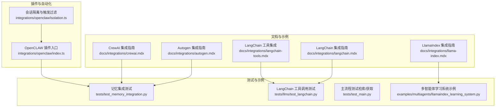
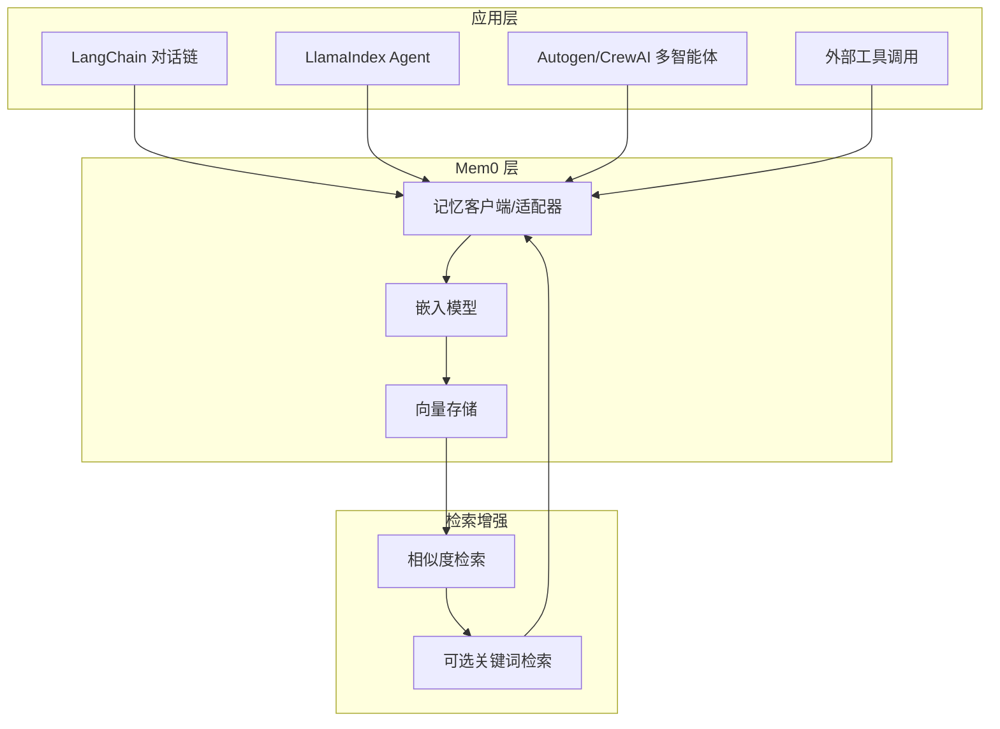
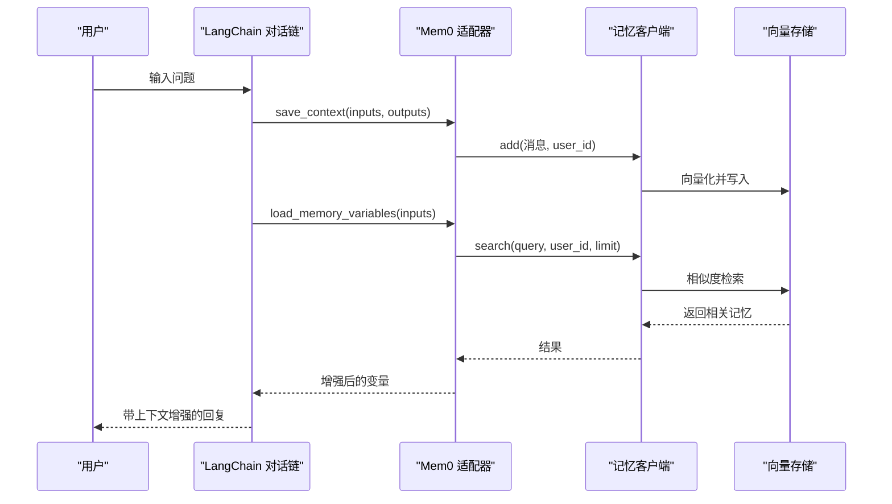
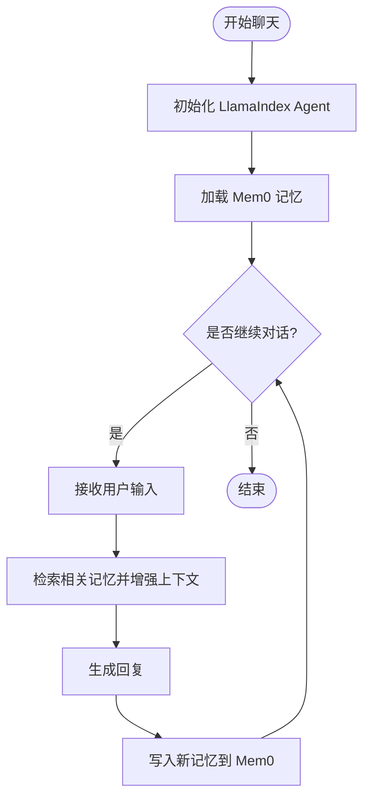
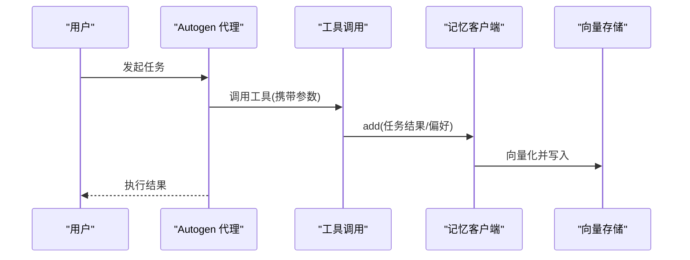
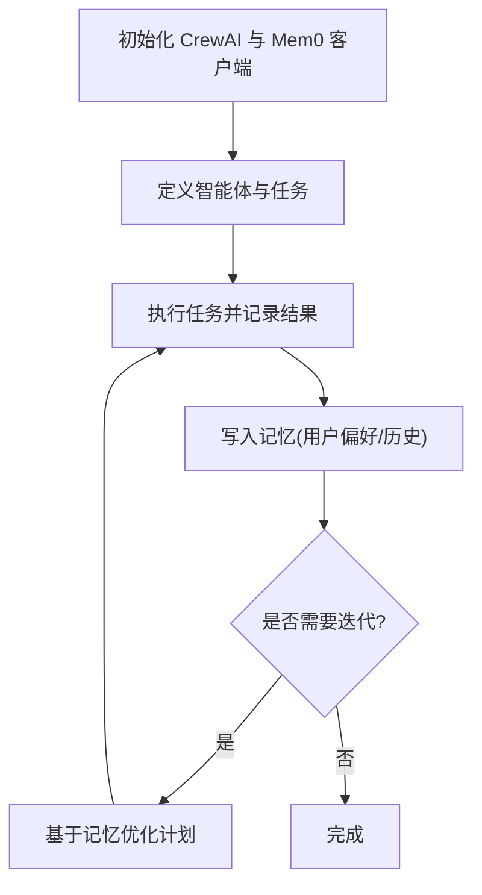
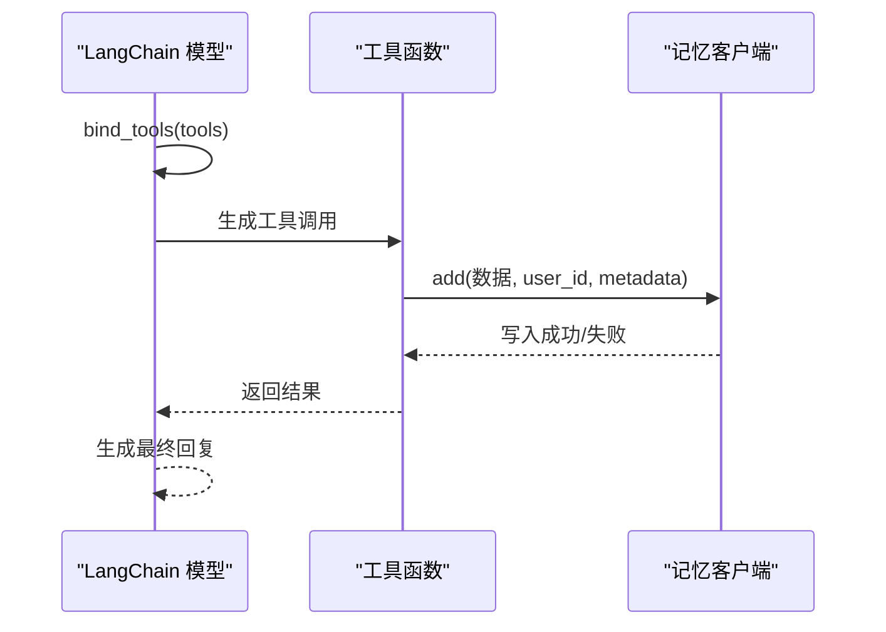
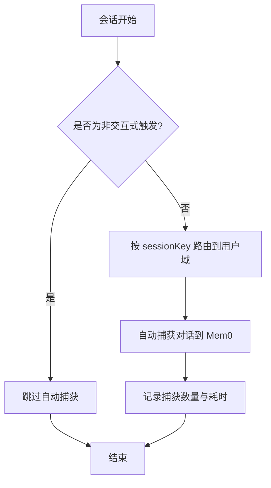
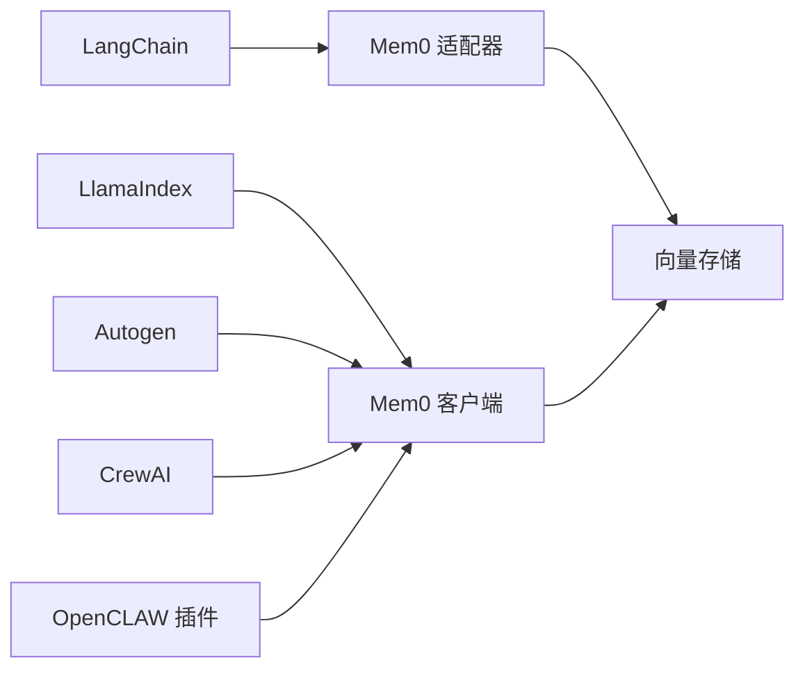

# 框架集成案例

<cite>
**本文引用的文件**
- [langchain.mdx](file://docs/integrations/langchain.mdx)
- [llama-index.mdx](file://docs/integrations/llama-index.mdx)
- [autogen.mdx](file://docs/integrations/autogen.mdx)
- [crewai.mdx](file://docs/integrations/crewai.mdx)
- [langchain-tools.mdx](file://docs/integrations/langchain-tools.mdx)
- [llm.md](file://LLM.md)
- [test_memory_integration.py](file://tests/test_memory_integration.py)
- [test_langchain.py](file://tests/llms/test_langchain.py)
- [test_main.py](file://tests/test_main.py)
- [index.ts](file://integrations/openclaw/index.ts)
- [isolation.ts](file://integrations/openclaw/isolation.ts)
</cite>

## 目录
1. [简介](#简介)
2. [项目结构](#项目结构)
3. [核心组件](#核心组件)
4. [架构总览](#架构总览)
5. [详细组件分析](#详细组件分析)
6. [依赖关系分析](#依赖关系分析)
7. [性能考量](#性能考量)
8. [故障排查指南](#故障排查指南)
9. [结论](#结论)
10. [附录](#附录)

## 简介
本章节聚焦于 Mem0 与主流 AI 框架和工具的集成实践，覆盖 LangChain、LlamaIndex、Autogen、CrewAI 等生态中的典型用法。内容围绕集成架构、配置方法、最佳实践与性能优化展开，并结合仓库内现有示例与测试，帮助读者在不同框架中高效利用 Mem0 的记忆能力，构建具备长期记忆与上下文增强的智能体系统。

## 项目结构
- 文档侧：各框架集成指南位于 docs/integrations 下，涵盖 LangChain、LlamaIndex、Autogen、CrewAI 及 LangChain Tools 等专题。
- 示例与测试：examples 与 tests 目录包含多智能体学习系统、LangChain 工具调用等端到端示例与单元测试，验证记忆写入、检索与工具调用链路。
- 插件与自动化：integrations/openclaw 提供自动捕获与会话隔离策略，支撑多智能体场景下的用户域隔离与触发过滤。

**图表来源**
- [langchain.mdx](file://docs/integrations/langchain.mdx)
- [llama-index.mdx](file://docs/integrations/llama-index.mdx)
- [autogen.mdx](file://docs/integrations/autogen.mdx)
- [crewai.mdx](file://docs/integrations/crewai.mdx)
- [langchain-tools.mdx](file://docs/integrations/langchain-tools.mdx)
- [test_memory_integration.py](file://tests/test_memory_integration.py)
- [test_langchain.py](file://tests/llms/test_langchain.py)
- [test_main.py](file://tests/test_main.py)
- [index.ts](file://integrations/openclaw/index.ts)
- [isolation.ts](file://integrations/openclaw/isolation.ts)

**章节来源**
- [langchain.mdx](file://docs/integrations/langchain.mdx)
- [llama-index.mdx](file://docs/integrations/llama-index.mdx)
- [autogen.mdx](file://docs/integrations/autogen.mdx)
- [crewai.mdx](file://docs/integrations/crewai.mdx)
- [langchain-tools.mdx](file://docs/integrations/langchain-tools.mdx)
- [test_memory_integration.py](file://tests/test_memory_integration.py)
- [test_langchain.py](file://tests/llms/test_langchain.py)
- [test_main.py](file://tests/test_main.py)
- [index.ts](file://integrations/openclaw/index.ts)
- [isolation.ts](file://integrations/openclaw/isolation.ts)

## 核心组件
- 记忆客户端与工具链：通过 MemoryClient/内存接口在工具调用或对话流中写入与检索记忆，支持基于用户维度的隔离与检索增强。
- LangChain 集成适配器：自定义 ConversationBufferMemory 子类，统一保存上下文并同步写入 Mem0，同时在加载变量时注入相关长程记忆。
- LlamaIndex 多智能体：以 LlamaIndex 为编排层，结合 Mem0 实现跨轮次的记忆累积与个性化响应。
- Autogen/CrewAI 场景：在多智能体编排中，通过工具调用或外部客户端写入记忆，实现任务执行与偏好持久化。
- OpenCLAW 自动捕获与隔离：在多智能体工作流中按会话键路由到独立用户域，过滤非交互式触发，避免污染用户记忆空间。

**章节来源**
- [test_memory_integration.py](file://tests/test_memory_integration.py)
- [test_langchain.py](file://tests/llms/test_langchain.py)
- [index.ts](file://integrations/openclaw/index.ts)
- [isolation.ts](file://integrations/openclaw/isolation.ts)

## 架构总览
下图展示了在不同框架中使用 Mem0 的通用架构：应用层通过工具调用或对话流触发记忆写入；Mem0 将消息转换为向量并存储到向量数据库；后续检索阶段根据查询相似度返回相关记忆，用于增强上下文。

**图表来源**
- [test_main.py](file://tests/test_main.py)
- [test_memory_integration.py](file://tests/test_memory_integration.py)

## 详细组件分析

### LangChain 集成
- 集成方式：自定义 ConversationBufferMemory 子类，重写 save_context 与 load_memory_variables，在保存短期对话的同时写入 Mem0，并在加载变量时拼接相关历史记忆。
- 关键点：
  - 写入时机：在 save_context 中同步调用 Mem0.add，确保每次对话轮次都持久化。
  - 上下文增强：在 load_memory_variables 中通过 Mem0.search 获取相关记忆，拼接到 history 变量中，提升回复个性化程度。
  - 用户隔离：通过 user_id 维度隔离不同用户的记忆空间。
- 测试验证：测试覆盖了从配置、写入到检索的完整链路，断言返回结果数量与字段完整性。

**图表来源**
- [llm.md](file://LLM.md)
- [test_memory_integration.py](file://tests/test_memory_integration.py)

**章节来源**
- [langchain.mdx](file://docs/integrations/langchain.mdx)
- [llm.md](file://LLM.md)
- [test_memory_integration.py](file://tests/test_memory_integration.py)

### LlamaIndex 集成
- 集成要点：
  - 使用 LlamaIndex 的 Agent 编排器，将 Mem0 作为记忆后端，实现跨轮次的记忆累积与个性化响应。
  - 支持多智能体学习系统示例，体现复杂场景下的记忆复用与协作。
- 关键特性：
  - 记忆集成：通过 Mem0 存储与检索过往交互信息。
  - 个性化：基于用户历史与偏好生成定制化建议与服务。
  - 灵活架构：LlamaIndex 易于与记忆模块对接，便于扩展。
  - 连续学习：每次交互均被记录，持续优化未来回复质量。

**图表来源**
- [llama-index.mdx](file://docs/integrations/llama-index.mdx)
- [test_main.py](file://tests/test_main.py)

**章节来源**
- [llama-index.mdx](file://docs/integrations/llama-index.mdx)
- [test_main.py](file://tests/test_main.py)

### Autogen 集成
- 集成思路：
  - 在 Autogen 的代理交互中，通过工具调用或外部客户端写入记忆，使代理能够“记住”先前的决策与偏好。
  - 利用测试用例验证工具调用链路，确保工具参数正确传递并触发记忆写入。
- 最佳实践：
  - 将记忆写入放在关键决策点之后，保证上下文连贯性。
  - 使用用户维度隔离不同角色的记忆空间，避免交叉污染。

**图表来源**
- [autogen.mdx](file://docs/integrations/autogen.mdx)
- [test_langchain.py](file://tests/llms/test_langchain.py)

**章节来源**
- [autogen.mdx](file://docs/integrations/autogen.mdx)
- [test_langchain.py](file://tests/llms/test_langchain.py)

### CrewAI 集成
- 集成目标：
  - 将 CrewAI 的多智能体编排与 Mem0 的持久记忆结合，实现跨智能体的任务执行与偏好持久化。
- 配置步骤：
  - 安装必要依赖并设置 API 密钥。
  - 初始化 MemoryClient 并在任务执行后写入记忆。
- 典型流程：
  - 初始化客户端与代理。
  - 执行任务并记录结果。
  - 基于历史记忆调整后续任务策略。

**图表来源**
- [crewai.mdx](file://docs/integrations/crewai.mdx)

**章节来源**
- [crewai.mdx](file://docs/integrations/crewai.mdx)

### LangChain 工具集成
- 工具调用链路：
  - LangChain 模型绑定工具，当模型生成工具调用时，由工具执行并将结果回传给模型。
  - 测试覆盖了工具调用的生成与解析，确保参数正确传递并触发记忆写入。
- 集成建议：
  - 将 add_memory 等工具封装为稳定接口，明确参数规范与错误处理。
  - 在工具执行后进行幂等检查，避免重复写入相同内容。

**图表来源**
- [langchain-tools.mdx](file://docs/integrations/langchain-tools.mdx)
- [test_langchain.py](file://tests/llms/test_langchain.py)

**章节来源**
- [langchain-tools.mdx](file://docs/integrations/langchain-tools.mdx)
- [test_langchain.py](file://tests/llms/test_langchain.py)

### 多智能体系统与协作模式
- OpenCLAW 插件：
  - 自动捕获：在会话结束后异步写入记忆，统计捕获数量与延迟，便于可观测性。
  - 会话隔离：通过 sessionKey 将不同代理路由到独立的 userId 命名空间，避免交叉污染。
  - 触发过滤：对非交互式触发（如 cron/heartbeat/automation）跳过自动捕获，保持用户记忆纯净。
- 协作模式：
  - 代理间共享公共知识库，但各自维护独立的用户偏好与历史。
  - 在关键决策点进行记忆同步，确保后续代理能继承上下文。

**图表来源**
- [index.ts](file://integrations/openclaw/index.ts)
- [isolation.ts](file://integrations/openclaw/isolation.ts)

**章节来源**
- [index.ts](file://integrations/openclaw/index.ts)
- [isolation.ts](file://integrations/openclaw/isolation.ts)

## 依赖关系分析
- 框架依赖：
  - LangChain：依赖 ConversationBufferMemory 与工具绑定机制，通过自定义适配器实现与 Mem0 的双向集成。
  - LlamaIndex：依赖 Agent 编排与检索增强能力，结合 Mem0 实现跨轮次记忆。
  - Autogen/CrewAI：依赖工具调用与任务编排，通过外部客户端写入记忆。
- 内部依赖：
  - 记忆客户端依赖嵌入模型与向量存储，检索阶段可能包含相似度与关键词混合策略。
  - OpenCLAW 插件依赖会话键与触发类型，实现自动捕获与隔离。

**图表来源**
- [test_memory_integration.py](file://tests/test_memory_integration.py)
- [test_main.py](file://tests/test_main.py)
- [index.ts](file://integrations/openclaw/index.ts)

**章节来源**
- [test_memory_integration.py](file://tests/test_memory_integration.py)
- [test_main.py](file://tests/test_main.py)
- [index.ts](file://integrations/openclaw/index.ts)

## 性能考量
- 向量化与索引
  - 控制嵌入维度与向量存储规模，避免检索开销过大。
  - 在高并发场景下启用批量写入与异步捕获（参考 OpenCLAW 的异步写入与统计）。
- 检索策略
  - 结合相似度检索与关键词检索，减少无关结果带来的额外计算。
  - 限制检索返回条数与阈值，平衡召回率与性能。
- 会话隔离与过滤
  - 使用会话键路由与触发过滤，降低无效写入与检索压力。
- 工具调用幂等
  - 在工具层增加去重逻辑，避免重复写入造成存储膨胀与查询抖动。

[本节为通用指导，无需列出具体文件来源]

## 故障排查指南
- 写入失败
  - 检查 API 密钥与网络连通性；确认用户维度与元数据格式符合预期。
  - 参考测试用例断言，定位写入阶段的异常点。
- 检索无结果
  - 核对查询文本预处理与向量化一致性；适当放宽阈值或增加检索条数。
  - 确认向量存储已建立索引且数据已落盘。
- 工具调用未生效
  - 校验工具绑定与参数序列化；确保工具函数签名与调用参数一致。
- 多智能体交叉污染
  - 检查会话键路由规则与触发过滤配置；确保非交互式会话被正确跳过。

**章节来源**
- [test_memory_integration.py](file://tests/test_memory_integration.py)
- [test_langchain.py](file://tests/llms/test_langchain.py)
- [index.ts](file://integrations/openclaw/index.ts)
- [isolation.ts](file://integrations/openclaw/isolation.ts)

## 结论
通过上述集成案例可以看出，Mem0 能够与 LangChain、LlamaIndex、Autogen、CrewAI 等主流框架无缝衔接。其核心价值在于：
- 将短期对话与长期记忆统一管理，提升回复的一致性与个性化；
- 在多智能体场景中提供稳定的用户域隔离与协作机制；
- 通过工具链与自动捕获策略，降低人工干预成本并提升可观测性。

建议在实际项目中结合自身业务形态选择合适的集成方式，并遵循本文的最佳实践与性能优化建议。

[本节为总结性内容，无需列出具体文件来源]

## 附录
- 相关文档与示例路径
  - LangChain 集成指南：docs/integrations/langchain.mdx
  - LlamaIndex 集成指南：docs/integrations/llama-index.mdx
  - Autogen 集成指南：docs/integrations/autogen.mdx
  - CrewAI 集成指南：docs/integrations/crewai.mdx
  - LangChain 工具集成：docs/integrations/langchain-tools.mdx
  - 多智能体学习系统示例：examples/multiagents/llamaindex_learning_system.py
  - OpenCLAW 插件入口与隔离逻辑：integrations/openclaw/index.ts、integrations/openclaw/isolation.ts

[本节为导航性内容，无需列出具体文件来源]