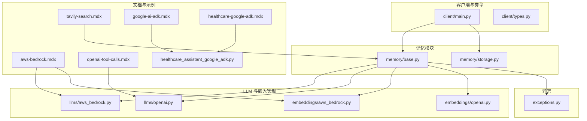
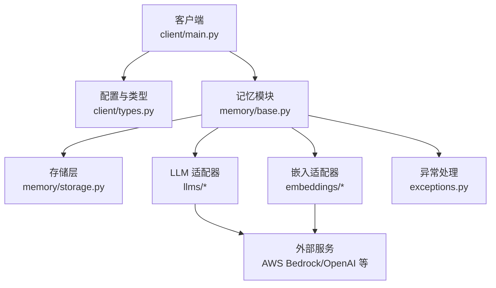
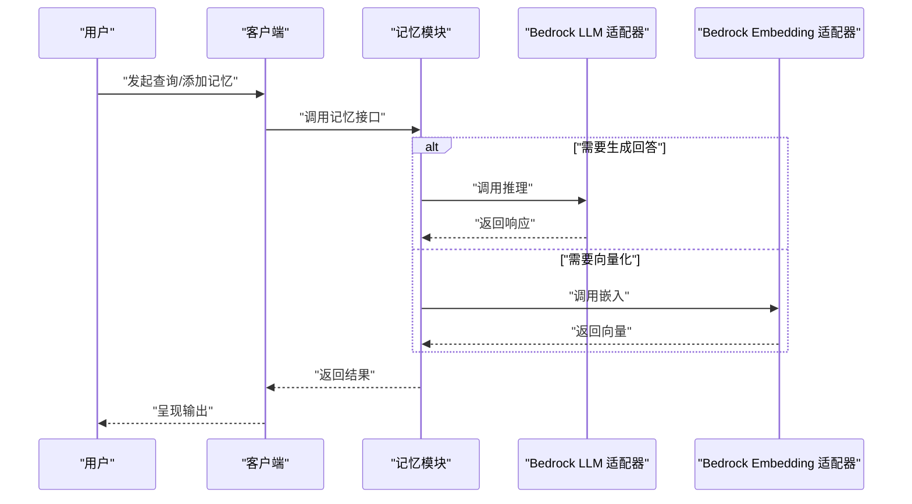
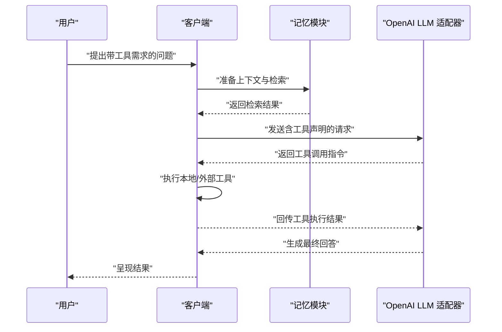
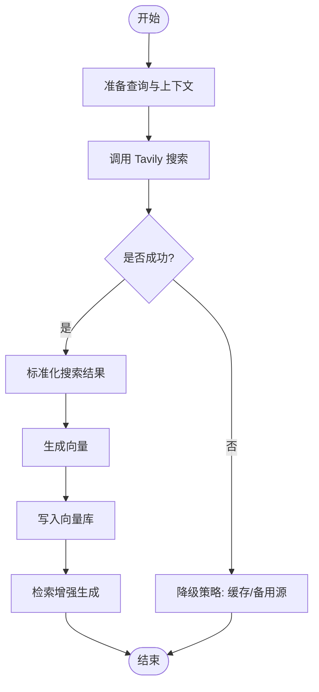
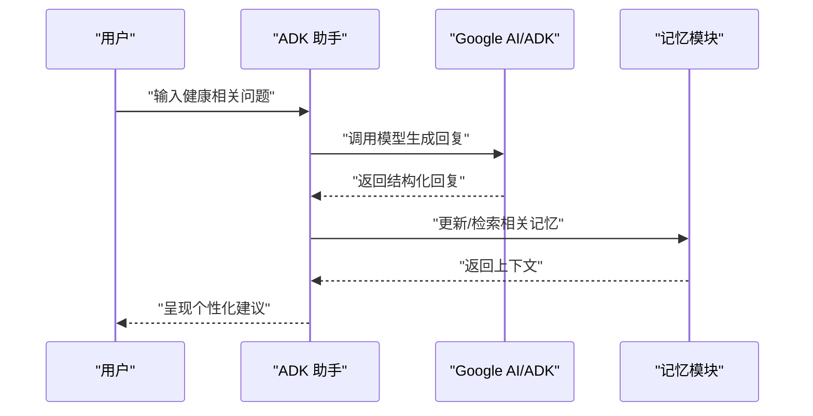
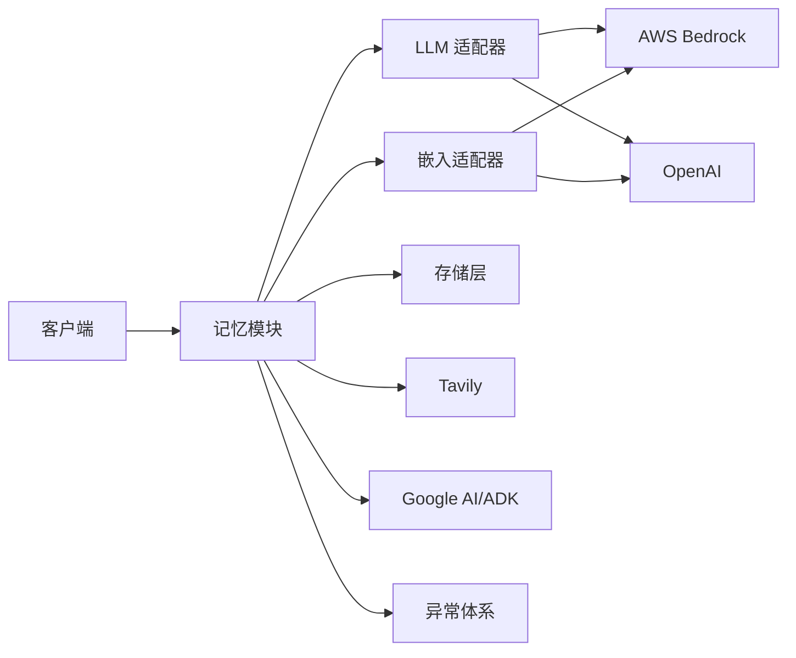

# 第三方集成案例

<cite>
**本文引用的文件**
- [aws-bedrock.mdx](file://docs/cookbooks/integrations/aws-bedrock.mdx)
- [openai-tool-calls.mdx](file://docs/cookbooks/integrations/openai-tool-calls.mdx)
- [tavily-search.mdx](file://docs/cookbooks/integrations/tavily-search.mdx)
- [google-ai-adk.mdx](file://docs/integrations/google-ai-adk.mdx)
- [healthcare_google_adk.mdx](file://docs/cookbooks/integrations/healthcare-google-adk.mdx)
- [healthcare_assistant_google_adk.py](file://examples/misc/healthcare_assistant_google_adk.py)
- [aws_bedrock.py](file://mem0/embeddings/aws_bedrock.py)
- [aws_bedrock.py](file://mem0/llms/aws_bedrock.py)
- [openai.py](file://mem0/llms/openai.py)
- [openai.py](file://mem0/embeddings/openai.py)
- [types.py](file://mem0/client/types.py)
- [main.py](file://mem0/client/main.py)
- [base.py](file://mem0/memory/base.py)
- [storage.py](file://mem0/memory/storage.py)
- [exceptions.py](file://mem0/exceptions.py)
</cite>

## 目录
1. [简介](#简介)
2. [项目结构](#项目结构)
3. [核心组件](#核心组件)
4. [架构总览](#架构总览)
5. [详细组件分析](#详细组件分析)
6. [依赖关系分析](#依赖关系分析)
7. [性能考虑](#性能考虑)
8. [故障排除指南](#故障排除指南)
9. [结论](#结论)
10. [附录](#附录)

## 简介
本章节聚焦于 Mem0 与外部服务和工具的第三方集成实践，覆盖以下场景：
- AWS Bedrock：大模型与嵌入向量服务的集成
- Google AI/ADK：面向医疗健康领域的对话式助手集成
- OpenAI 工具调用：函数调用与工具执行流程
- Tavily 搜索：检索增强生成（RAG）中的搜索增强

内容涵盖 API 配置、认证设置、数据格式转换、错误处理、扩展现有功能的方法以及与其他服务协同工作的最佳实践。

## 项目结构
围绕第三方集成的关键目录与文件：
- 文档与示例：docs/cookbooks/integrations 与 examples/misc
- 客户端与类型：mem0/client
- 记忆模块：mem0/memory
- LLM 与 Embedding 实现：mem0/llms 与 mem0/embeddings
- 异常定义：mem0/exceptions.py

图示来源
- [aws-bedrock.mdx](file://docs/cookbooks/integrations/aws-bedrock.mdx)
- [openai-tool-calls.mdx](file://docs/cookbooks/integrations/openai-tool-calls.mdx)
- [tavily-search.mdx](file://docs/cookbooks/integrations/tavily-search.mdx)
- [google-ai-adk.mdx](file://docs/integrations/google-ai-adk.mdx)
- [healthcare_google_adk.mdx](file://docs/cookbooks/integrations/healthcare-google-adk.mdx)
- [healthcare_assistant_google_adk.py](file://examples/misc/healthcare_assistant_google_adk.py)
- [aws_bedrock.py](file://mem0/llms/aws_bedrock.py)
- [aws_bedrock.py](file://mem0/embeddings/aws_bedrock.py)
- [openai.py](file://mem0/llms/openai.py)
- [openai.py](file://mem0/embeddings/openai.py)
- [main.py](file://mem0/client/main.py)
- [types.py](file://mem0/client/types.py)
- [base.py](file://mem0/memory/base.py)
- [storage.py](file://mem0/memory/storage.py)
- [exceptions.py](file://mem0/exceptions.py)

章节来源
- [aws-bedrock.mdx](file://docs/cookbooks/integrations/aws-bedrock.mdx)
- [openai-tool-calls.mdx](file://docs/cookbooks/integrations/openai-tool-calls.mdx)
- [tavily-search.mdx](file://docs/cookbooks/integrations/tavily-search.mdx)
- [google-ai-adk.mdx](file://docs/integrations/google-ai-adk.mdx)
- [healthcare_google_adk.mdx](file://docs/cookbooks/integrations/healthcare-google-adk.mdx)
- [healthcare_assistant_google_adk.py](file://examples/misc/healthcare_assistant_google_adk.py)

## 核心组件
- 客户端与类型系统：提供统一的初始化、配置与类型约束，确保与 LLM/Embedding/存储层的交互一致。
- 记忆模块：负责记忆的增删改查、检索与持久化，是连接外部工具与服务的中枢。
- LLM 与 Embedding 适配器：封装不同供应商的 API 调用细节，屏蔽差异性。
- 异常体系：集中处理网络、认证、参数与业务异常，便于上层统一处理。

章节来源
- [main.py](file://mem0/client/main.py)
- [types.py](file://mem0/client/types.py)
- [base.py](file://mem0/memory/base.py)
- [storage.py](file://mem0/memory/storage.py)
- [exceptions.py](file://mem0/exceptions.py)

## 架构总览
Mem0 的第三方集成遵循“配置即插拔”的设计原则。通过客户端配置选择合适的 LLM/Embedding 后端，并由记忆模块协调工具调用与数据流转。

图示来源
- [main.py](file://mem0/client/main.py)
- [types.py](file://mem0/client/types.py)
- [base.py](file://mem0/memory/base.py)
- [storage.py](file://mem0/memory/storage.py)
- [aws_bedrock.py](file://mem0/llms/aws_bedrock.py)
- [aws_bedrock.py](file://mem0/embeddings/aws_bedrock.py)
- [openai.py](file://mem0/llms/openai.py)
- [openai.py](file://mem0/embeddings/openai.py)
- [exceptions.py](file://mem0/exceptions.py)

## 详细组件分析

### AWS Bedrock 集成
- 配置要点
  - LLM 与 Embedding 均可指向 Bedrock，需提供区域、模型 ID、凭据链或环境变量。
  - 在客户端中以配置对象形式注入，确保与记忆模块的统一入口。
- 数据格式
  - LLM 输入为消息数组；Embedding 输入为文本列表。
  - 输出统一映射到内存模块的内部表示，便于后续检索与检索增强。
- 错误处理
  - 区分网络超时、鉴权失败、模型不可用等场景，结合异常体系进行分类处理。
- 扩展建议
  - 新增自定义推理参数（如温度、最大令牌数）时，优先在适配器层做参数映射与校验。
  - 对批量嵌入请求进行分片与重试策略，提升吞吐与稳定性。

图示来源
- [aws-bedrock.mdx](file://docs/cookbooks/integrations/aws-bedrock.mdx)
- [aws_bedrock.py](file://mem0/llms/aws_bedrock.py)
- [aws_bedrock.py](file://mem0/embeddings/aws_bedrock.py)
- [main.py](file://mem0/client/main.py)
- [base.py](file://mem0/memory/base.py)

章节来源
- [aws-bedrock.mdx](file://docs/cookbooks/integrations/aws-bedrock.mdx)
- [aws_bedrock.py](file://mem0/llms/aws_bedrock.py)
- [aws_bedrock.py](file://mem0/embeddings/aws_bedrock.py)

### OpenAI 工具调用集成
- 配置要点
  - 使用 OpenAI LLM 适配器启用函数调用能力，需在请求中声明工具清单与参数模式。
  - 客户端侧对工具调用结果进行解析与回传，驱动下一步动作。
- 数据格式
  - 工具调用输入为函数签名与参数；输出为工具执行结果或错误信息。
  - 内存模块接收工具结果后，可触发上下文更新或检索增强。
- 错误处理
  - 工具执行失败时，记录失败原因并回退到自然语言解释，避免中断对话流。
- 扩展建议
  - 将常用工具抽象为可复用技能，通过客户端注册与路由，降低重复开发成本。

图示来源
- [openai-tool-calls.mdx](file://docs/cookbooks/integrations/openai-tool-calls.mdx)
- [openai.py](file://mem0/llms/openai.py)
- [main.py](file://mem0/client/main.py)
- [base.py](file://mem0/memory/base.py)

章节来源
- [openai-tool-calls.mdx](file://docs/cookbooks/integrations/openai-tool-calls.mdx)
- [openai.py](file://mem0/llms/openai.py)

### Tavily 搜索集成
- 配置要点
  - 在客户端中启用 Tavily 搜索作为检索增强源，提供 API Key 并设置查询参数。
  - 搜索结果与向量检索可组合使用，提升召回质量。
- 数据格式
  - 搜索返回标准化为文档片段与链接集合；嵌入后写入向量数据库。
- 错误处理
  - 对网络异常与配额限制进行降级处理（如切换备用搜索引擎或缓存结果）。
- 扩展建议
  - 将搜索结果与记忆标签、时间戳等元数据关联，支持更细粒度的过滤与排序。

图示来源
- [tavily-search.mdx](file://docs/cookbooks/integrations/tavily-search.mdx)
- [base.py](file://mem0/memory/base.py)
- [storage.py](file://mem0/memory/storage.py)

章节来源
- [tavily-search.mdx](file://docs/cookbooks/integrations/tavily-search.mdx)
- [base.py](file://mem0/memory/base.py)
- [storage.py](file://mem0/memory/storage.py)

### Google AI/ADK 集成（医疗健康）
- 配置要点
  - 使用 Google AI/ADK 构建对话式助手，需配置项目 ID、模型名称与权限范围。
  - 示例脚本展示了从用户输入到响应输出的完整链路。
- 数据格式
  - 输入为多模态文本；输出为结构化回复与可选的工具调用。
- 错误处理
  - 对权限不足、资源不可用等情况进行明确提示与重试。
- 扩展建议
  - 结合医疗知识图谱与实体识别，提升语义理解与安全合规性。

图示来源
- [google-ai-adk.mdx](file://docs/integrations/google-ai-adk.mdx)
- [healthcare_google_adk.mdx](file://docs/cookbooks/integrations/healthcare-google-adk.mdx)
- [healthcare_assistant_google_adk.py](file://examples/misc/healthcare_assistant_google_adk.py)
- [base.py](file://mem0/memory/base.py)

章节来源
- [google-ai-adk.mdx](file://docs/integrations/google-ai-adk.mdx)
- [healthcare_google_adk.mdx](file://docs/cookbooks/integrations/healthcare-google-adk.mdx)
- [healthcare_assistant_google_adk.py](file://examples/misc/healthcare_assistant_google_adk.py)
- [base.py](file://mem0/memory/base.py)

## 依赖关系分析
- 组件耦合
  - 客户端通过统一配置依赖记忆模块；记忆模块再依赖 LLM/Embedding 与存储层。
  - 异常体系贯穿各层，保证错误传播的一致性。
- 外部依赖
  - AWS Bedrock：需要正确的 IAM 凭证与模型访问权限。
  - OpenAI：需要 API Key 与工具声明；注意速率限制与费用控制。
  - Tavily：需要有效 API Key 与合理的查询频率。
  - Google AI/ADK：需要项目权限与模型可用性验证。

图示来源
- [main.py](file://mem0/client/main.py)
- [base.py](file://mem0/memory/base.py)
- [storage.py](file://mem0/memory/storage.py)
- [aws_bedrock.py](file://mem0/llms/aws_bedrock.py)
- [aws_bedrock.py](file://mem0/embeddings/aws_bedrock.py)
- [openai.py](file://mem0/llms/openai.py)
- [openai.py](file://mem0/embeddings/openai.py)
- [exceptions.py](file://mem0/exceptions.py)

章节来源
- [main.py](file://mem0/client/main.py)
- [base.py](file://mem0/memory/base.py)
- [storage.py](file://mem0/memory/storage.py)
- [aws_bedrock.py](file://mem0/llms/aws_bedrock.py)
- [aws_bedrock.py](file://mem0/embeddings/aws_bedrock.py)
- [openai.py](file://mem0/llms/openai.py)
- [openai.py](file://mem0/embeddings/openai.py)
- [exceptions.py](file://mem0/exceptions.py)

## 性能考虑
- 批量处理
  - 对嵌入与检索请求进行批量化，减少往返次数；对长文本进行分段处理。
- 缓存策略
  - 对热点查询与工具调用结果进行缓存，降低重复计算与外部依赖压力。
- 超时与重试
  - 为外部服务调用设置合理超时与指数退避重试，避免雪崩效应。
- 资源隔离
  - 将不同供应商的调用置于独立线程池或进程池，避免相互阻塞。

## 故障排除指南
- 常见问题定位
  - 认证失败：检查密钥、区域、权限与 IAM 策略。
  - 模型不可用：确认模型 ID、版本与区域支持情况。
  - 请求超时：调整超时阈值、增加重试与熔断保护。
  - 数据格式不匹配：核对消息结构、工具参数与返回字段。
- 日志与监控
  - 在客户端与适配器层记录关键指标（延迟、错误码、重试次数），便于追踪问题根因。
- 回滚与降级
  - 当外部服务不稳定时，启用降级路径（缓存、默认回复、备用供应商）。

章节来源
- [exceptions.py](file://mem0/exceptions.py)
- [aws_bedrock.py](file://mem0/llms/aws_bedrock.py)
- [openai.py](file://mem0/llms/openai.py)

## 结论
通过标准化的客户端配置、适配器层封装与记忆模块编排，Mem0 能够高效整合 AWS Bedrock、OpenAI 工具调用、Tavily 搜索与 Google AI/ADK 等外部服务。遵循本文的配置、数据格式、错误处理与扩展建议，可在保障稳定性的同时快速迭代与规模化部署。

## 附录
- 快速对照表
  - AWS Bedrock：确认区域与模型 ID，配置凭证链；向量化与推理均走 Bedrock。
  - OpenAI：启用函数调用声明；工具执行后回传结果；关注速率限制。
  - Tavily：提供有效 API Key；合理设置查询频率；与向量检索结合。
  - Google AI/ADK：配置项目权限与模型；结合医疗知识图谱优化语义理解。