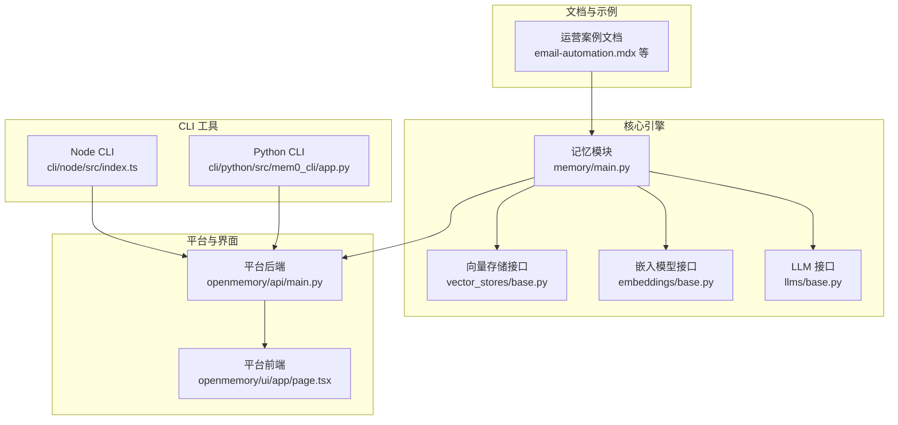
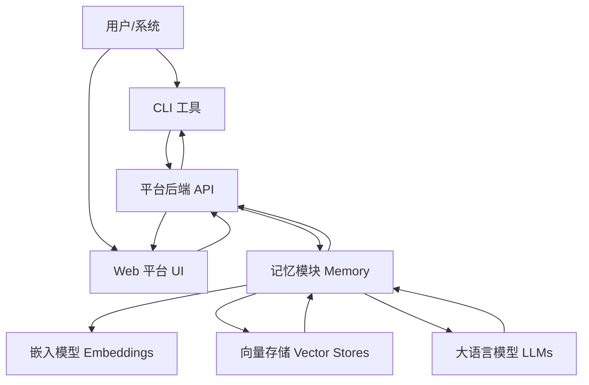
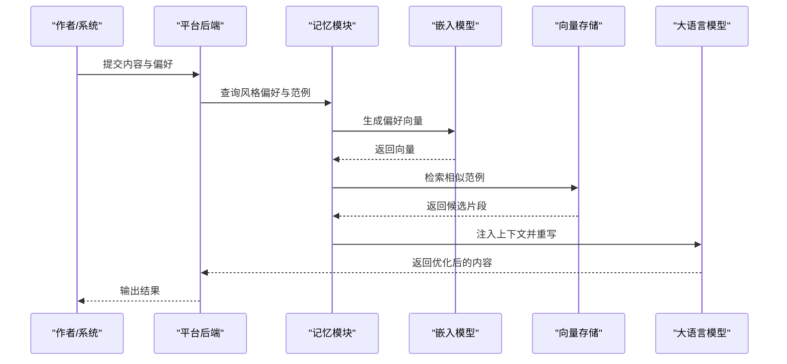
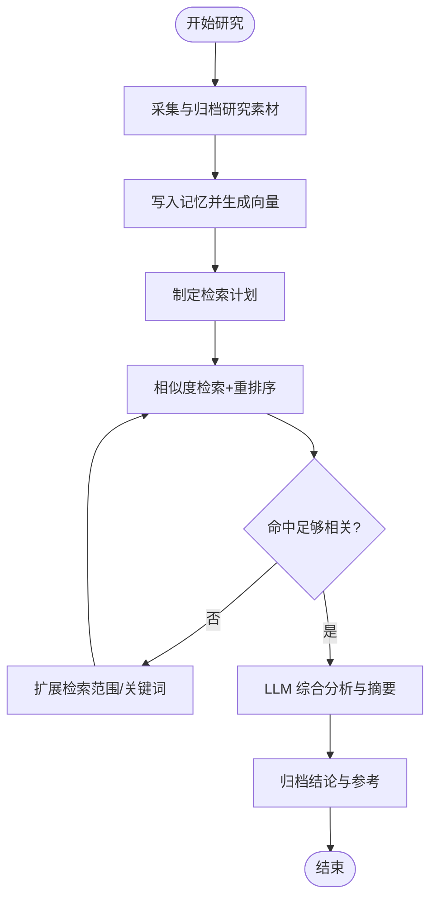
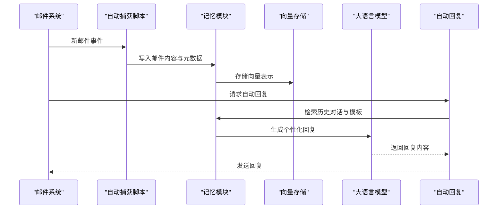
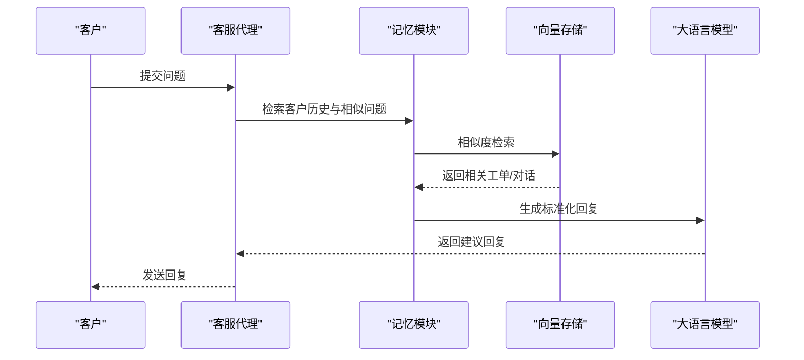
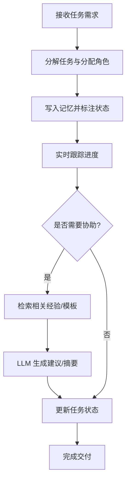
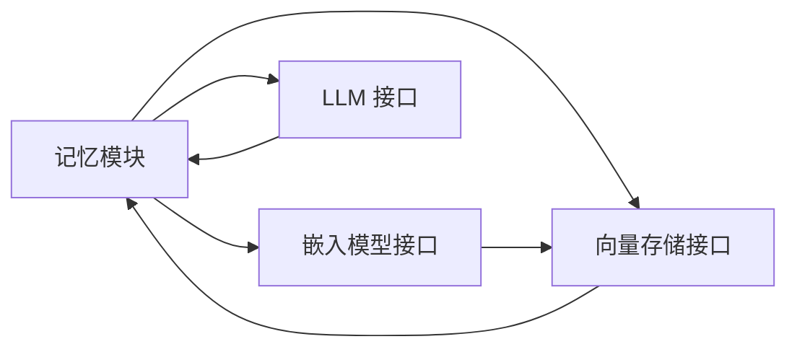

# 运营应用案例

<cite>
**本文引用的文件**
- [docs/cookbooks/operations/email-automation.mdx](file://docs/cookbooks/operations/email-automation.mdx)
- [docs/cookbooks/operations/support-inbox.mdx](file://docs/cookbooks/operations/support-inbox.mdx)
- [docs/cookbooks/operations/team-task-agent.mdx](file://docs/cookbooks/operations/team-task-agent.mdx)
- [docs/cookbooks/operations/content-writing.mdx](file://docs/cookbooks/operations/content-writing.mdx)
- [docs/cookbooks/operations/deep-research.mdx](file://docs/cookbooks/operations/deep-research.mdx)
- [docs/cookbooks/overview.mdx](file://docs/cookbooks/overview.mdx)
- [mem0/memory/main.py](file://mem0/memory/main.py)
- [mem0/vector_stores/base.py](file://mem0/vector_stores/base.py)
- [mem0/embeddings/base.py](file://mem0/embeddings/base.py)
- [mem0/llms/base.py](file://mem0/llms/base.py)
- [openmemory/api/main.py](file://openmemory/api/main.py)
- [openmemory/ui/app/page.tsx](file://openmemory/ui/app/page.tsx)
- [cli/node/src/index.ts](file://cli/node/src/index.ts)
- [cli/python/src/mem0_cli/app.py](file://cli/python/src/mem0_cli/app.py)
</cite>

## 目录
1. [引言](#引言)
2. [项目结构](#项目结构)
3. [核心组件](#核心组件)
4. [架构总览](#架构总览)
5. [详细组件分析](#详细组件分析)
6. [依赖关系分析](#依赖关系分析)
7. [性能考虑](#性能考虑)
8. [故障排除指南](#故障排除指南)
9. [结论](#结论)
10. [附录](#附录)

## 引言
本章节聚焦 Mem0 在企业运营场景中的实战应用，围绕内容创作、深度研究、邮件自动化、客服支持、团队任务管理五大方向，系统阐述业务需求分析、系统架构设计、功能实现与性能优化，并提供可落地的部署方案与记忆策略调整建议。读者可据此在不同业务场景中灵活选择与组合能力模块，实现“记忆驱动”的智能化运营。

## 项目结构
- 文档与示例：docs/cookbooks 下提供多类运营场景的实践指南（邮件自动化、客服支持、团队任务、内容创作、深度研究）。
- 核心引擎：mem0/ 目录下包含记忆管理、向量存储、嵌入模型、大语言模型等核心模块。
- 平台与界面：openmemory/ 提供平台后端与前端 UI；CLI 提供 Node 与 Python 双栈命令行工具。
- 集成与插件：integrations/ 与 skills/ 展示与第三方平台及技能的集成方式。

图表来源
- [docs/cookbooks/operations/email-automation.mdx](file://docs/cookbooks/operations/email-automation.mdx)
- [mem0/memory/main.py](file://mem0/memory/main.py)
- [mem0/vector_stores/base.py](file://mem0/vector_stores/base.py)
- [mem0/embeddings/base.py](file://mem0/embeddings/base.py)
- [mem0/llms/base.py](file://mem0/llms/base.py)
- [openmemory/api/main.py](file://openmemory/api/main.py)
- [openmemory/ui/app/page.tsx](file://openmemory/ui/app/page.tsx)
- [cli/node/src/index.ts](file://cli/node/src/index.ts)
- [cli/python/src/mem0_cli/app.py](file://cli/python/src/mem0_cli/app.py)

章节来源
- [docs/cookbooks/overview.mdx](file://docs/cookbooks/overview.mdx)
- [docs/cookbooks/operations/email-automation.mdx](file://docs/cookbooks/operations/email-automation.mdx)
- [docs/cookbooks/operations/support-inbox.mdx](file://docs/cookbooks/operations/support-inbox.mdx)
- [docs/cookbooks/operations/team-task-agent.mdx](file://docs/cookbooks/operations/team-task-agent.mdx)
- [docs/cookbooks/operations/content-writing.mdx](file://docs/cookbooks/operations/content-writing.mdx)
- [docs/cookbooks/operations/deep-research.mdx](file://docs/cookbooks/operations/deep-research.mdx)

## 核心组件
- 记忆管理（Memory）：负责记忆的增删改查、检索、导出与反馈机制，是所有运营场景的数据基础。
- 向量存储（Vector Stores）：抽象统一的向量数据库接口，支持多种实现（如 Qdrant、Pinecone、Weaviate 等），用于高效相似度检索。
- 嵌入模型（Embeddings）：提供文本向量化能力，支撑语义检索与记忆归档。
- 大语言模型（LLMs）：提供对话、重写、分类、总结等推理能力，贯穿各运营流程。
- 平台后端与前端：提供 Web 界面与 API，便于企业级部署与可视化管理。
- CLI 工具：为开发者与运维人员提供命令行入口，快速执行导入、导出、配置同步等操作。

章节来源
- [mem0/memory/main.py](file://mem0/memory/main.py)
- [mem0/vector_stores/base.py](file://mem0/vector_stores/base.py)
- [mem0/embeddings/base.py](file://mem0/embeddings/base.py)
- [mem0/llms/base.py](file://mem0/llms/base.py)
- [openmemory/api/main.py](file://openmemory/api/main.py)
- [openmemory/ui/app/page.tsx](file://openmemory/ui/app/page.tsx)
- [cli/node/src/index.ts](file://cli/node/src/index.ts)
- [cli/python/src/mem0_cli/app.py](file://cli/python/src/mem0_cli/app.py)

## 架构总览
下图展示了从“业务场景”到“数据与推理”的整体流转：用户通过 CLI 或平台 UI 触发操作，平台后端调用记忆模块，记忆模块基于嵌入模型生成向量并存入向量存储，检索时进行相似度匹配并结合 LLM 完成最终输出。

图表来源
- [openmemory/api/main.py](file://openmemory/api/main.py)
- [openmemory/ui/app/page.tsx](file://openmemory/ui/app/page.tsx)
- [cli/node/src/index.ts](file://cli/node/src/index.ts)
- [cli/python/src/mem0_cli/app.py](file://cli/python/src/mem0_cli/app.py)
- [mem0/memory/main.py](file://mem0/memory/main.py)
- [mem0/embeddings/base.py](file://mem0/embeddings/base.py)
- [mem0/vector_stores/base.py](file://mem0/vector_stores/base.py)
- [mem0/llms/base.py](file://mem0/llms/base.py)

## 详细组件分析

### 内容创作工作流（Content Writing）
- 业务需求：需要在多篇内容中保持一致的风格与偏好，减少重复校对成本，提升规模化产出质量。
- 关键实现点：
  - 使用记忆模块存储风格偏好与范例，作为上下文注入到重写/润色流程。
  - 通过嵌入模型生成向量，向量存储提供相似度检索，辅助挑选合适的风格示例。
  - 利用 LLM 对内容进行重写与优化，形成闭环反馈。
- 性能优化建议：
  - 对风格偏好进行分组与标签化，缩小检索空间。
  - 使用缓存与批量处理降低重复计算开销。
  - 控制提示词长度与上下文窗口，避免超限与延迟增加。

图表来源
- [docs/cookbooks/operations/content-writing.mdx](file://docs/cookbooks/operations/content-writing.mdx)
- [mem0/memory/main.py](file://mem0/memory/main.py)
- [mem0/embeddings/base.py](file://mem0/embeddings/base.py)
- [mem0/vector_stores/base.py](file://mem0/vector_stores/base.py)
- [mem0/llms/base.py](file://mem0/llms/base.py)

章节来源
- [docs/cookbooks/operations/content-writing.mdx](file://docs/cookbooks/operations/content-writing.mdx)

### 深度研究工作流（Deep Research）
- 业务需求：跨会话、跨主题的持续研究，避免重复劳动，确保信息一致性与可追溯性。
- 关键实现点：
  - 将每次研究会话的记忆持久化，利用时间戳与实体分区策略组织知识。
  - 检索阶段使用重排序器与阈值过滤，提高相关性与准确性。
  - 结合 LLM 进行综合分析与摘要生成。
- 性能优化建议：
  - 对研究主题建立分类与标签，检索前先做粗排筛选。
  - 合理设置记忆衰减与过期策略，控制向量库规模。
  - 批量写入与增量更新，减少频繁写操作带来的延迟。

图表来源
- [docs/cookbooks/operations/deep-research.mdx](file://docs/cookbooks/operations/deep-research.mdx)
- [mem0/memory/main.py](file://mem0/memory/main.py)
- [mem0/reranker/base.py](file://mem0/reranker/base.py)

章节来源
- [docs/cookbooks/operations/deep-research.mdx](file://docs/cookbooks/operations/deep-research.mdx)

### 邮件自动化（Email Automation）
- 业务需求：自动捕获、分类、归档与回复邮件，提升响应效率与一致性。
- 关键实现点：
  - 通过插件或脚本自动捕获邮件线程，提取关键信息并写入记忆。
  - 使用标签与优先级策略组织邮件，便于后续检索与批量处理。
  - 结合 LLM 自动生成模板化回复，减少人工干预。
- 性能优化建议：
  - 对收件人、主题、关键词建立索引，加速检索。
  - 分批导入与增量同步，避免一次性写入过大导致延迟。
  - 设置规则引擎与白名单/黑名单，降低误判与噪音。

图表来源
- [docs/cookbooks/operations/email-automation.mdx](file://docs/cookbooks/operations/email-automation.mdx)
- [mem0/memory/main.py](file://mem0/memory/main.py)
- [mem0/vector_stores/base.py](file://mem0/vector_stores/base.py)
- [mem0/llms/base.py](file://mem0/llms/base.py)

章节来源
- [docs/cookbooks/operations/email-automation.mdx](file://docs/cookbooks/operations/email-automation.mdx)

### 客服支持（Support Inbox）
- 业务需求：在多轮工单中保留上下文，实现“见过即知”的智能客服体验。
- 关键实现点：
  - 将历史工单与对话写入记忆，按客户/主题/状态分类。
  - 检索时结合实体识别与时间线索，定位最相关的历史记录。
  - 使用 LLM 生成标准化回复模板，提升一致性与效率。
- 性能优化建议：
  - 对高优先级与紧急工单启用更快的检索路径。
  - 使用反馈机制持续优化检索与回复质量。
  - 对敏感信息进行脱敏与权限控制，保障合规。

图表来源
- [docs/cookbooks/operations/support-inbox.mdx](file://docs/cookbooks/operations/support-inbox.mdx)
- [mem0/memory/main.py](file://mem0/memory/main.py)
- [mem0/vector_stores/base.py](file://mem0/vector_stores/base.py)
- [mem0/llms/base.py](file://mem0/llms/base.py)

章节来源
- [docs/cookbooks/operations/support-inbox.mdx](file://docs/cookbooks/operations/support-inbox.mdx)

### 团队任务管理（Team Task Agent）
- 业务需求：跨成员协作、角色分工与进度追踪，减少沟通成本与重复劳动。
- 关键实现点：
  - 将任务、需求、评审意见等写入记忆，按项目/成员/状态组织。
  - 检索时结合角色权限与最近活跃度，推荐合适负责人。
  - 使用 LLM 协助生成任务摘要、风险提醒与复盘报告。
- 性能优化建议：
  - 对任务进行分级与优先级标记，检索时先粗后精。
  - 增加任务到期提醒与自动转交机制，避免停滞。
  - 与项目管理工具打通，实现双向同步。

图表来源
- [docs/cookbooks/operations/team-task-agent.mdx](file://docs/cookbooks/operations/team-task-agent.mdx)
- [mem0/memory/main.py](file://mem0/memory/main.py)
- [mem0/llms/base.py](file://mem0/llms/base.py)

章节来源
- [docs/cookbooks/operations/team-task-agent.mdx](file://docs/cookbooks/operations/team-task-agent.mdx)

## 依赖关系分析
- 耦合与内聚：记忆模块对嵌入、向量存储与 LLM 的依赖清晰，接口抽象良好，便于替换与扩展。
- 外部依赖：向量存储与嵌入模型支持多实现，LLM 支持多家供应商与本地兼容端点，利于混合部署。
- 部署耦合：平台后端与前端通过 API 解耦，CLI 工具独立运行，便于在不同环境中组合使用。

图表来源
- [mem0/memory/main.py](file://mem0/memory/main.py)
- [mem0/embeddings/base.py](file://mem0/embeddings/base.py)
- [mem0/vector_stores/base.py](file://mem0/vector_stores/base.py)
- [mem0/llms/base.py](file://mem0/llms/base.py)

章节来源
- [mem0/memory/main.py](file://mem0/memory/main.py)
- [mem0/vector_stores/base.py](file://mem0/vector_stores/base.py)
- [mem0/embeddings/base.py](file://mem0/embeddings/base.py)
- [mem0/llms/base.py](file://mem0/llms/base.py)

## 性能考虑
- 检索性能：通过向量存储的索引与分片策略、重排序器与阈值过滤，减少无关命中；对高频查询引入缓存。
- 写入性能：批量写入、增量更新与压缩存储，降低写放大；对长文本进行分块与摘要化处理。
- 推理性能：控制上下文长度、采用流式输出与异步处理；对重复指令进行去重与合并。
- 成本控制：按需选择嵌入与 LLM 服务，合理设置记忆保留周期与清理策略。

## 故障排除指南
- 记忆检索不准确：检查嵌入模型质量与向量存储配置，确认检索参数与阈值设置；必要时重新训练或微调。
- 写入失败或延迟：排查向量存储连接与容量限制，检查批量大小与并发度；开启重试与降级策略。
- LLM 输出异常：核对提示词与上下文长度，调整温度与最大令牌数；对敏感内容进行过滤与脱敏。
- CLI 无法连接后端：确认 API 地址、认证与网络连通性；查看日志与错误码，定位具体模块。

章节来源
- [cli/node/src/index.ts](file://cli/node/src/index.ts)
- [cli/python/src/mem0_cli/app.py](file://cli/python/src/mem0_cli/app.py)
- [openmemory/api/main.py](file://openmemory/api/main.py)

## 结论
通过将记忆模块与向量存储、嵌入模型、LLM 有机结合，Mem0 能够在内容创作、深度研究、邮件自动化、客服支持与团队任务管理等企业运营场景中实现“记忆驱动”的智能化升级。建议在不同场景中按需选择与组合能力模块，并根据业务特点调整记忆策略（如分类、标签、优先级、衰减与清理），以获得最佳的成本与效果平衡。

## 附录
- 快速开始：参考平台与 CLI 的安装与配置说明，完成本地或云端部署。
- 最佳实践：在生产环境启用监控与告警，定期评估检索质量与成本表现，持续迭代记忆策略与处理逻辑。