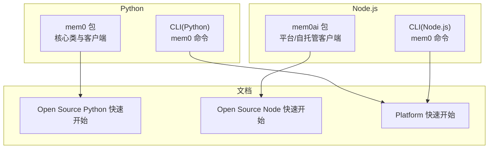
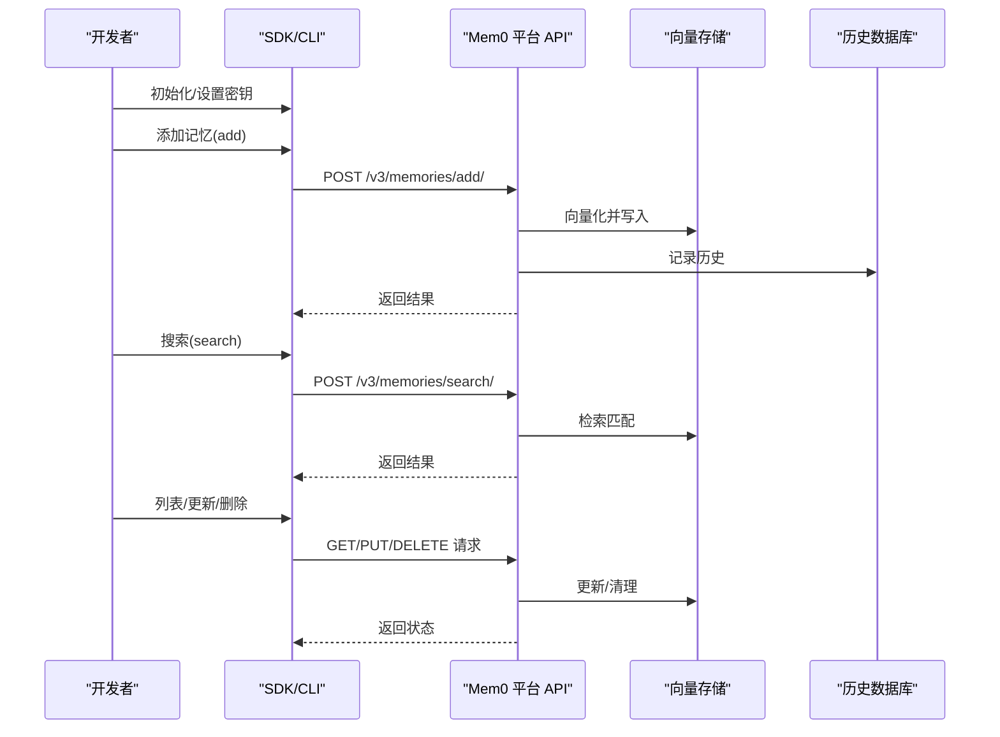
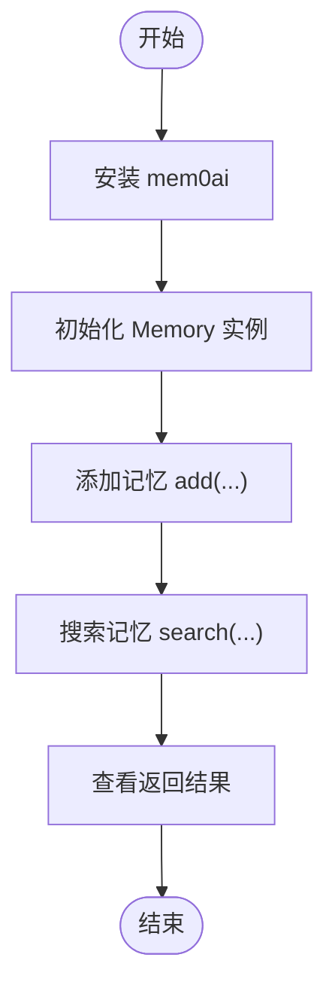
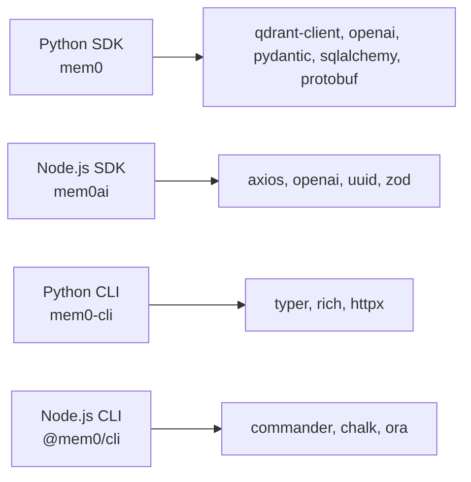

# 快速开始

<cite>
**本文引用的文件**
- [README.md](file://README.md)
- [pyproject.toml](file://pyproject.toml)
- [mem0/__init__.py](file://mem0/__init__.py)
- [mem0/memory/main.py](file://mem0/memory/main.py)
- [mem0/client/main.py](file://mem0/client/main.py)
- [mem0-ts/README.md](file://mem0-ts/README.md)
- [mem0-ts/package.json](file://mem0-ts/package.json)
- [cli/python/README.md](file://cli/python/README.md)
- [cli/node/README.md](file://cli/node/README.md)
- [cli/python/pyproject.toml](file://cli/python/pyproject.toml)
- [cli/node/package.json](file://cli/node/package.json)
- [docs/open-source/python-quickstart.mdx](file://docs/open-source/python-quickstart.mdx)
- [docs/open-source/node-quickstart.mdx](file://docs/open-source/node-quickstart.mdx)
- [docs/platform/quickstart.mdx](file://docs/platform/quickstart.mdx)
- [examples/misc/test.py](file://examples/misc/test.py)
- [examples/notebooks/customer-support-chatbot.ipynb](file://examples/notebooks/customer-support-chatbot.ipynb)
</cite>

## 目录
1. [简介](#简介)
2. [项目结构](#项目结构)
3. [核心组件](#核心组件)
4. [架构总览](#架构总览)
5. [详细组件分析](#详细组件分析)
6. [依赖关系分析](#依赖关系分析)
7. [性能考虑](#性能考虑)
8. [故障排查指南](#故障排查指南)
9. [结论](#结论)
10. [附录](#附录)

## 简介
本指南面向首次接触 Mem0 的开发者，提供从零到运行的完整路径。你将学会：
- 环境准备与安装（Python、Node.js）
- 三种使用方式：Python 库、Node.js SDK、CLI 工具
- 初始化、添加记忆、搜索记忆、管理用户会话
- 代理注册流程、API 密钥获取与基本错误处理
- 端到端示例，确保每一步都有明确的预期输出

Mem0 提供三类入口：
- 开源库（OSS）：适合测试与本地开发，支持嵌入式向量库与 SQLite 历史存储
- 平台（Cloud）：提供托管服务与更丰富的高级特性
- CLI：通过命令行进行记忆管理与调试

## 项目结构
仓库包含以下与“快速开始”直接相关的模块：
- Python SDK：mem0 包含核心内存操作类与客户端
- Node.js SDK：mem0ai 包含平台客户端与 OSS 客户端
- CLI：Python 与 Node.js 双版本命令行工具
- 文档：Open Source 与 Platform 的快速入门文档
- 示例：多语言与多场景的演示脚本

图表来源
- [mem0/__init__.py:1-7](file://mem0/__init__.py#L1-L7)
- [mem0/client/main.py:71-148](file://mem0/client/main.py#L71-L148)
- [mem0-ts/README.md:1-65](file://mem0-ts/README.md#L1-L65)
- [cli/python/README.md:1-350](file://cli/python/README.md#L1-L350)
- [cli/node/README.md:1-338](file://cli/node/README.md#L1-L338)
- [docs/open-source/python-quickstart.mdx:1-110](file://docs/open-source/python-quickstart.mdx#L1-L110)
- [docs/open-source/node-quickstart.mdx:1-288](file://docs/open-source/node-quickstart.mdx#L1-L288)
- [docs/platform/quickstart.mdx:1-171](file://docs/platform/quickstart.mdx#L1-L171)

章节来源
- [README.md:87-171](file://README.md#L87-L171)
- [docs/open-source/python-quickstart.mdx:1-110](file://docs/open-source/python-quickstart.mdx#L1-L110)
- [docs/open-source/node-quickstart.mdx:1-288](file://docs/open-source/node-quickstart.mdx#L1-L288)
- [docs/platform/quickstart.mdx:1-171](file://docs/platform/quickstart.mdx#L1-L171)

## 核心组件
- Python SDK（OSS）：Memory 类负责本地记忆的增删改查、向量化检索与历史记录；MemoryClient 负责平台 API 的调用与认证
- Node.js SDK（OSS/Platform）：Memory 类与 MemoryClient 提供一致的异步接口
- CLI：Python 与 Node.js 版本均提供 init、add、search、list、get、update、delete、config、entity、event、status、import 等命令

章节来源
- [mem0/memory/main.py:407-760](file://mem0/memory/main.py#L407-L760)
- [mem0/client/main.py:71-148](file://mem0/client/main.py#L71-L148)
- [mem0-ts/README.md:1-65](file://mem0-ts/README.md#L1-L65)
- [cli/python/README.md:58-350](file://cli/python/README.md#L58-L350)
- [cli/node/README.md:49-338](file://cli/node/README.md#L49-L338)

## 架构总览
Mem0 的端到端工作流分为两条主线：
- 平台模式：应用通过 SDK 或 CLI 调用平台 API，平台负责向量化、检索与持久化
- 自托管模式：应用直接使用 OSS SDK，本地完成嵌入、向量存储与检索

图表来源
- [docs/platform/quickstart.mdx:59-144](file://docs/platform/quickstart.mdx#L59-L144)
- [mem0/client/main.py:172-333](file://mem0/client/main.py#L172-L333)

## 详细组件分析

### Python SDK 快速开始
- 环境要求：Python 3.10+
- 安装：pip install mem0ai
- 初始化：Memory() 或 Memory.from_config(...)
- 基本操作：add、search、getAll、update、delete、history、reset
- 预期输出：add 返回新增的记忆列表；search 返回匹配结果数组；history 返回变更历史

图表来源
- [docs/open-source/python-quickstart.mdx:24-77](file://docs/open-source/python-quickstart.mdx#L24-L77)
- [mem0/memory/main.py:653-759](file://mem0/memory/main.py#L653-L759)

章节来源
- [docs/open-source/python-quickstart.mdx:1-110](file://docs/open-source/python-quickstart.mdx#L1-L110)
- [mem0/memory/main.py:407-760](file://mem0/memory/main.py#L407-L760)

### Node.js SDK 快速开始
- 环境要求：Node.js 18+
- 安装：npm install mem0ai
- 初始化：new Memory() 或 new MemoryClient()
- 基本操作：add、search、getAll、update、delete、history、reset
- 预期输出：与 Python SDK 一致，返回 JSON 结构的结果对象

章节来源
- [docs/open-source/node-quickstart.mdx:1-288](file://docs/open-source/node-quickstart.mdx#L1-L288)
- [mem0-ts/README.md:1-65](file://mem0-ts/README.md#L1-L65)

### 平台（Cloud）快速开始
- 获取 API 密钥：在 Mem0 平台仪表板创建
- 设置密钥：环境变量或 SDK 初始化参数
- 基本操作：add、search、get、getAll、update、delete、history、batch_update、batch_delete、create_memory_export、get_memory_export、get_summary、users、delete_users、reset
- 预期输出：标准 v1.1+ 格式，包含 results 或分页字段

章节来源
- [docs/platform/quickstart.mdx:1-171](file://docs/platform/quickstart.mdx#L1-L171)
- [mem0/client/main.py:71-148](file://mem0/client/main.py#L71-L148)

### CLI 快速开始（Python 与 Node.js）
- 安装：pip install mem0-cli 或 npm install -g @mem0/cli
- 初始化：mem0 init 支持交互式向导、邮箱登录、API Key 登录、代理模式
- 常用命令：add、search、list、get、update、delete、config、entity、event、status、import
- 输出格式：text、json、table、quiet、agent（机器可读）

章节来源
- [cli/python/README.md:11-350](file://cli/python/README.md#L11-L350)
- [cli/node/README.md:12-338](file://cli/node/README.md#L12-L338)

## 依赖关系分析
- Python SDK 依赖：qdrant-client、openai、pydantic、sqlalchemy、protobuf 等
- Node.js SDK 依赖：axios、openai、uuid、zod 等
- CLI 依赖：Python CLI 使用 typer/rich/httpx；Node CLI 使用 commander/chalk 等

图表来源
- [pyproject.toml:16-84](file://pyproject.toml#L16-L84)
- [mem0-ts/package.json:102-128](file://mem0-ts/package.json#L102-L128)
- [cli/python/pyproject.toml:27-34](file://cli/python/pyproject.toml#L27-L34)
- [cli/node/package.json:32-47](file://cli/node/package.json#L32-L47)

章节来源
- [pyproject.toml:1-160](file://pyproject.toml#L1-L160)
- [mem0-ts/package.json:1-162](file://mem0-ts/package.json#L1-L162)
- [cli/python/pyproject.toml:1-78](file://cli/python/pyproject.toml#L1-L78)
- [cli/node/package.json:1-59](file://cli/node/package.json#L1-L59)

## 性能考虑
- 默认嵌入模型与向量库：OpenAI text-embedding-3-small 与 Qdrant（本地磁盘）
- 混合检索：启用 BM25 关键词匹配与实体链接可提升召回质量
- 异步支持：Node.js SDK 提供 Promise 接口；Python SDK 提供同步与通知机制
- 历史存储：SQLite 用于 OSS，默认路径位于用户目录

章节来源
- [docs/open-source/python-quickstart.mdx:79-87](file://docs/open-source/python-quickstart.mdx#L79-L87)
- [docs/open-source/node-quickstart.mdx:69-71](file://docs/open-source/node-quickstart.mdx#L69-L71)

## 故障排查指南
常见问题与建议：
- API 密钥无效：检查 MEM0_API_KEY 环境变量或 SDK 初始化参数；使用 status 命令验证连接
- 参数校验失败：确保 filters 中仅使用 user_id、agent_id、app_id、run_id 等受支持的键
- 代理模式：CLI 支持 --agent/--json 输出，便于在自动化工具中消费
- 错误处理：SDK 抛出的异常包含详细错误码与建议，按提示修正输入或配置

章节来源
- [mem0/client/main.py:149-171](file://mem0/client/main.py#L149-L171)
- [cli/python/README.md:300-323](file://cli/python/README.md#L300-L323)
- [cli/node/README.md:289-313](file://cli/node/README.md#L289-L313)

## 结论
通过本指南，你可以：
- 在 Python 或 Node.js 环境中快速安装并使用 Mem0
- 选择平台托管或自托管两种模式
- 使用 CLI 进行日常记忆管理与调试
- 完成初始化、添加记忆、搜索记忆与管理会话的端到端流程

## 附录

### 端到端示例（Python）
- 步骤
  1) 安装：pip install mem0ai
  2) 初始化：from mem0 import Memory；m = Memory()
  3) 添加记忆：messages = [{"role": "user", "content": "..."}, {"role": "assistant", "content": "..."}]; m.add(messages, user_id="alice")
  4) 搜索记忆：results = m.search("What do you know about me?", filters={"user_id": "alice"})；打印结果
- 预期输出：results 包含匹配的记忆条目数组，包含 id、memory、score、categories 等字段

章节来源
- [docs/open-source/python-quickstart.mdx:24-77](file://docs/open-source/python-quickstart.mdx#L24-L77)

### 端到端示例（Node.js）
- 步骤
  1) 安装：npm install mem0ai
  2) 初始化：import { Memory } from "mem0ai/oss"; const memory = new Memory()
  3) 添加记忆：await memory.add(messages, { userId: "alice", metadata: { category: "..." } })
  4) 搜索记忆：const results = await memory.search("What do you know about me?", { filters: { userId: "alice" } }); console.log(results)
- 预期输出：results.results 数组包含 id、memory、score、metadata、userId 等字段

章节来源
- [docs/open-source/node-quickstart.mdx:14-67](file://docs/open-source/node-quickstart.mdx#L14-L67)

### 端到端示例（平台）
- 步骤
  1) 获取 API Key：在 Mem0 平台仪表板创建
  2) 初始化：Python 使用 MemoryClient(api_key="...")；JS 使用 new MemoryClient({ apiKey: "..." })
  3) 添加记忆：client.add(messages, { userId: "user123" })
  4) 搜索记忆：client.search("What are my dietary restrictions?", { filters: { userId: "user123" } })
- 预期输出：results.results 数组包含 id、memory、user_id、categories、created_at、score 等字段

章节来源
- [docs/platform/quickstart.mdx:14-144](file://docs/platform/quickstart.mdx#L14-L144)

### 代理注册与 CLI 使用
- 代理模式：mem0 init --agent（无需邮箱与仪表板），四步完成账户与密钥获取
- CLI 常用命令：init、add、search、list、get、update、delete、config、entity、event、status、import
- 输出控制：--agent/--json 输出为机器可读 JSON 环节，无颜色与噪音

章节来源
- [README.md:89-107](file://README.md#L89-L107)
- [cli/python/README.md:252-285](file://cli/python/README.md#L252-L285)
- [cli/node/README.md:243-276](file://cli/node/README.md#L243-L276)

### 示例参考
- 多代理协作与记忆集成：examples/misc/test.py
- 客户支持聊天机器人（Jupyter Notebook）：examples/notebooks/customer-support-chatbot.ipynb

章节来源
- [examples/misc/test.py:1-86](file://examples/misc/test.py#L1-L86)
- [examples/notebooks/customer-support-chatbot.ipynb:1-226](file://examples/notebooks/customer-support-chatbot.ipynb#L1-L226)