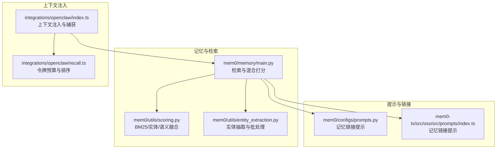
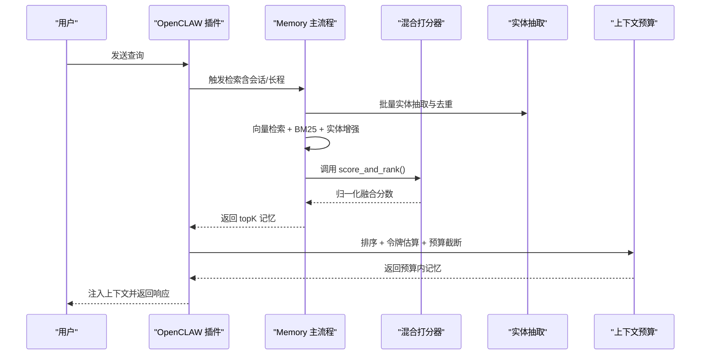
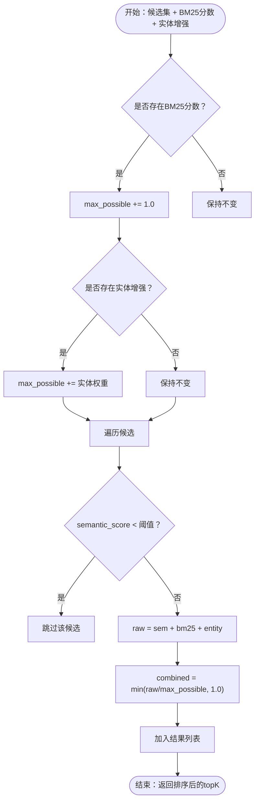
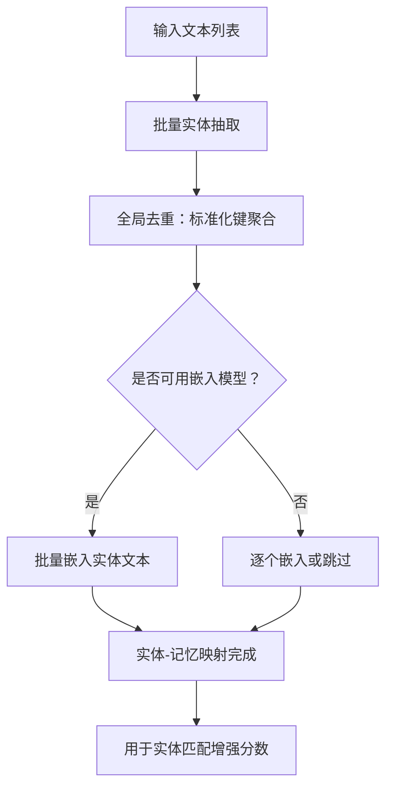
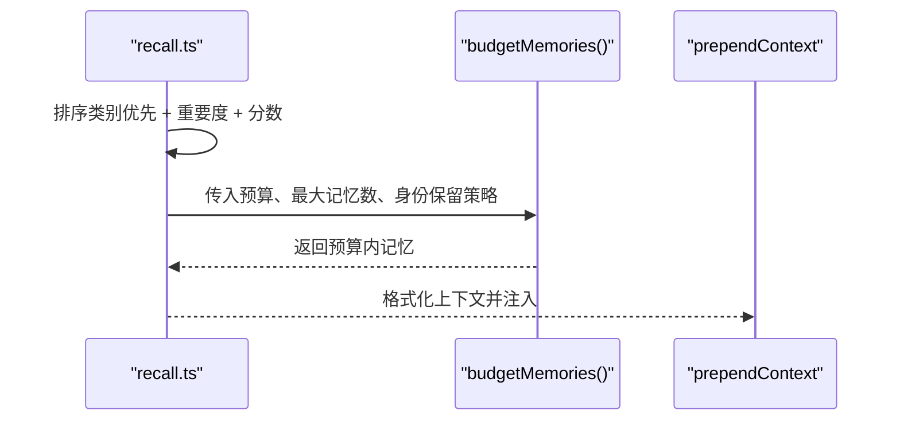
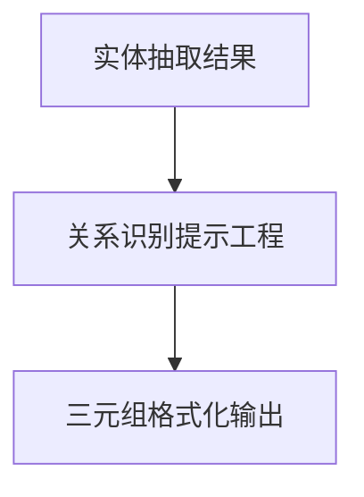
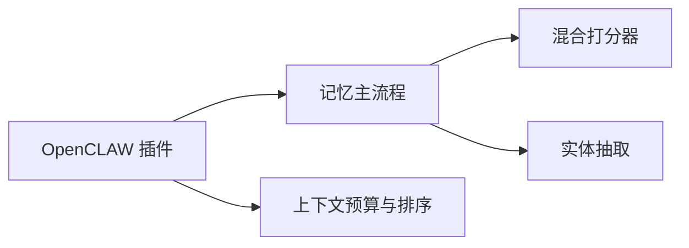

# 上下文管理与增强

<cite>
**本文引用的文件**
- [mem0/memory/main.py](file://mem0/memory/main.py)
- [mem0/utils/scoring.py](file://mem0/utils/scoring.py)
- [mem0/utils/entity_extraction.py](file://mem0/utils/entity_extraction.py)
- [mem0/configs/prompts.py](file://mem0/configs/prompts.py)
- [mem0-ts/src/oss/src/prompts/index.ts](file://mem0-ts/src/oss/src/prompts/index.ts)
- [integrations/openclaw/recall.ts](file://integrations/openclaw/recall.ts)
- [integrations/openclaw/index.ts](file://integrations/openclaw/index.ts)
- [docs/core-concepts/memory-evaluation.mdx](file://docs/core-concepts/memory-evaluation.mdx)
- [docs/platform/features/temporal-reasoning.mdx](file://docs/platform/features/temporal-reasoning.mdx)
- [docs/components/rerankers/custom-prompts.mdx](file://docs/components/rerankers/custom-prompts.mdx)
- [docs/platform/features/feedback-mechanism.mdx](file://docs/platform/features/feedback-mechanism.mdx)
- [tests/utils/test_scoring.py](file://tests/utils/test_scoring.py)
- [tests/memory/test_main.py](file://tests/memory/test_main.py)
</cite>

## 目录
1. [引言](#引言)
2. [项目结构](#项目结构)
3. [核心组件](#核心组件)
4. [架构总览](#架构总览)
5. [详细组件分析](#详细组件分析)
6. [依赖分析](#依赖分析)
7. [性能考量](#性能考量)
8. [故障排查指南](#故障排查指南)
9. [结论](#结论)
10. [附录](#附录)

## 引言
本文件系统化阐述 Mem0 的上下文管理与记忆增强机制，覆盖以下主题：
- 上下文窗口管理：基于令牌预算、分类优先级与重要度排序的动态截断策略
- 信息权重与相关性评分：语义相似度、BM25 关键词匹配与实体链接增强的混合打分
- 实体抽取与关系链接：批量实体抽取、全局去重与嵌入索引，以及基于提示的关系链接
- 知识图谱构建：实体-关系-实体三元组的抽取与格式化
- 时间感知与因果推理：平台级时间感知检索与 ADD-only 架构对时序推理的支撑
- 多模态融合：通过检索到的记忆在对话中注入上下文，形成“文本+记忆”的多模态交互
- 使用示例与最佳实践：结合 OpenCLAW 插件与反馈机制的实际应用路径

## 项目结构
围绕上下文管理与增强，核心代码分布在如下模块：
- 记忆主流程与检索：mem0/memory/main.py
- 混合打分与归一化：mem0/utils/scoring.py
- 实体抽取与批处理：mem0/utils/entity_extraction.py
- 提示工程（记忆链接）：mem0/configs/prompts.py 与 mem0-ts/src/oss/src/prompts/index.ts
- 上下文注入与令牌预算：integrations/openclaw/recall.ts 与 integrations/openclaw/index.ts
- 文档与概念参考：docs/* 下的相关章节

**图表来源**
- [mem0/memory/main.py](file://mem0/memory/main.py)
- [mem0/utils/scoring.py](file://mem0/utils/scoring.py)
- [mem0/utils/entity_extraction.py](file://mem0/utils/entity_extraction.py)
- [mem0/configs/prompts.py](file://mem0/configs/prompts.py)
- [mem0-ts/src/oss/src/prompts/index.ts](file://mem0-ts/src/oss/src/prompts/index.ts)
- [integrations/openclaw/recall.ts](file://integrations/openclaw/recall.ts)
- [integrations/openclaw/index.ts](file://integrations/openclaw/index.ts)

**章节来源**
- [mem0/memory/main.py](file://mem0/memory/main.py)
- [mem0/utils/scoring.py](file://mem0/utils/scoring.py)
- [mem0/utils/entity_extraction.py](file://mem0/utils/entity_extraction.py)
- [mem0/configs/prompts.py](file://mem0/configs/prompts.py)
- [mem0-ts/src/oss/src/prompts/index.ts](file://mem0-ts/src/oss/src/prompts/index.ts)
- [integrations/openclaw/recall.ts](file://integrations/openclaw/recall.ts)
- [integrations/openclaw/index.ts](file://integrations/openclaw/index.ts)

## 核心组件
- 检索与混合打分：从向量库检索候选集后，结合 BM25 关键词分数、实体链接增强与语义分数进行归一化融合，再按阈值与 topK 输出
- 实体抽取与链接：对批量文本执行实体抽取，进行全局去重与嵌入索引，用于实体匹配增强
- 上下文注入与预算：根据类别优先级、重要度与搜索分数排序，结合令牌估算进行预算控制，最终注入到系统提示前缀
- 提示工程：通过明确的“记忆链接”提示指导模型识别同一实体/主题、偏好变化、延续事件或矛盾信息，并建立链接
- 平台特性：时间感知检索（仅平台 v3）、反馈机制（提交正负反馈以优化相关性）

**章节来源**
- [mem0/memory/main.py](file://mem0/memory/main.py)
- [mem0/utils/scoring.py](file://mem0/utils/scoring.py)
- [mem0/utils/entity_extraction.py](file://mem0/utils/entity_extraction.py)
- [mem0/configs/prompts.py](file://mem0/configs/prompts.py)
- [mem0-ts/src/oss/src/prompts/index.ts](file://mem0-ts/src/oss/src/prompts/index.ts)
- [docs/platform/features/temporal-reasoning.mdx](file://docs/platform/features/temporal-reasoning.mdx)
- [docs/platform/features/feedback-mechanism.mdx](file://docs/platform/features/feedback-mechanism.mdx)

## 架构总览
Mem0 的上下文管理遵循“多信号检索 + 混合打分 + 预算注入”的闭环：
- 输入查询经实体抽取与关键词预处理
- 向量检索得到候选集，同时进行 BM25 关键词匹配与实体链接增强
- 融合后的分数归一化并过滤阈值，输出 topK 结果
- OpenCLAW 插件对结果进行分类优先级与重要度排序，估算令牌用量并进行预算截断
- 将精选的记忆注入到系统提示前，形成“文本+记忆”的上下文

**图表来源**
- [integrations/openclaw/recall.ts](file://integrations/openclaw/recall.ts)
- [integrations/openclaw/index.ts](file://integrations/openclaw/index.ts)
- [mem0/memory/main.py](file://mem0/memory/main.py)
- [mem0/utils/scoring.py](file://mem0/utils/scoring.py)
- [mem0/utils/entity_extraction.py](file://mem0/utils/entity_extraction.py)

## 详细组件分析

### 组件A：混合打分与相关性评估
- 多信号融合：语义分数、BM25 分数、实体增强分数三者线性组合并归一化，确保不同信号贡献可比
- 阈值过滤：低于阈值的候选直接丢弃，降低噪声
- 可解释性：支持输出分数细节，便于调试与优化
- 单元测试验证：包含 BM25 参数与归一化行为的测试用例

**图表来源**
- [mem0/utils/scoring.py](file://mem0/utils/scoring.py)

**章节来源**
- [mem0/utils/scoring.py](file://mem0/utils/scoring.py)
- [tests/utils/test_scoring.py](file://tests/utils/test_scoring.py)

### 组件B：实体抽取与关系链接
- 实体抽取：支持人名、地名、品牌、引号短语、名词复合词等类型；提供单条与批量处理接口
- 全局去重：按标准化文本去重，聚合出现的记忆 ID，减少重复实体干扰
- 嵌入索引：对实体文本批量嵌入，为实体匹配增强提供向量基础
- 关系链接：通过提示工程指导模型识别“同一实体/主题”“偏好变化”“延续事件”“矛盾信息”，并建立链接

**图表来源**
- [mem0/utils/entity_extraction.py](file://mem0/utils/entity_extraction.py)
- [mem0/memory/main.py](file://mem0/memory/main.py)

**章节来源**
- [mem0/utils/entity_extraction.py](file://mem0/utils/entity_extraction.py)
- [mem0/memory/main.py](file://mem0/memory/main.py)
- [mem0/configs/prompts.py](file://mem0/configs/prompts.py)
- [mem0-ts/src/oss/src/prompts/index.ts](file://mem0-ts/src/oss/src/prompts/index.ts)

### 组件C：上下文注入与令牌预算
- 分类优先级：按预设顺序对记忆进行主排序，确保身份、配置、规则等高优先级内容优先
- 重要度排序：同一类别内按重要度降序排列
- 搜索分数：作为第三排序维度
- 令牌估算与预算：逐条估算记忆长度，累计不超过预算上限，必要时保留身份/配置类记忆
- OpenCLAW 插件：在每次对话回合注入精选上下文，支持自动捕获与失败清理

**图表来源**
- [integrations/openclaw/recall.ts](file://integrations/openclaw/recall.ts)
- [integrations/openclaw/index.ts](file://integrations/openclaw/index.ts)

**章节来源**
- [integrations/openclaw/recall.ts](file://integrations/openclaw/recall.ts)
- [integrations/openclaw/index.ts](file://integrations/openclaw/index.ts)

### 组件D：知识图谱构建与实体-关系三元组
- 实体抽取：产出实体类型与文本
- 关系抽取：依据提示工程，识别实体之间的关系（如“关于”“影响”“延续”等）
- 三元组格式化：统一为“源实体 -- 关系 -- 目标实体”的简洁表示，便于后续可视化与检索

**图表来源**
- [mem0/utils/entity_extraction.py](file://mem0/utils/entity_extraction.py)
- [mem0/configs/prompts.py](file://mem0/configs/prompts.py)
- [mem0-ts/src/oss/src/prompts/index.ts](file://mem0-ts/src/oss/src/prompts/index.ts)

**章节来源**
- [mem0/utils/entity_extraction.py](file://mem0/utils/entity_extraction.py)
- [mem0/configs/prompts.py](file://mem0/configs/prompts.py)
- [mem0-ts/src/oss/src/prompts/index.ts](file://mem0-ts/src/oss/src/prompts/index.ts)

### 组件E：时间感知与因果推理
- 时间感知检索：平台 v3 支持对“上周”“即将到来”“现在”等时间相关查询进行精准召回
- ADD-only 架构：新增事实不覆盖旧事实，保留时序上下文，显著提升时序推理与矛盾消解能力
- 因果推理：通过保留历史与当前事实的并存，辅助模型在多步推理中做出更稳健的因果判断

**章节来源**
- [docs/platform/features/temporal-reasoning.mdx](file://docs/platform/features/temporal-reasoning.mdx)
- [docs/core-concepts/memory-evaluation.mdx](file://docs/core-concepts/memory-evaluation.mdx)

### 组件F：多模态融合（文本+记忆）
- 多模态输入：当前主要以文本为主，但通过将检索到的记忆注入系统提示前缀，形成“文本+记忆”的上下文
- 插件集成：OpenCLAW 插件负责在每轮对话中动态构建与注入上下文，提升个性化与一致性

**章节来源**
- [integrations/openclaw/index.ts](file://integrations/openclaw/index.ts)
- [integrations/openclaw/recall.ts](file://integrations/openclaw/recall.ts)

## 依赖分析
- 内聚与耦合
  - 检索主流程依赖打分器与实体抽取模块，耦合度适中，职责清晰
  - OpenCLAW 插件与记忆主流程松耦合，通过 provider 接口交互
- 外部依赖
  - 向量嵌入与检索由外部嵌入模型与向量数据库提供
  - 提示工程依赖 LLM 的结构化输出能力
- 循环依赖
  - 未发现循环导入或调用链回路

**图表来源**
- [mem0/memory/main.py](file://mem0/memory/main.py)
- [mem0/utils/scoring.py](file://mem0/utils/scoring.py)
- [mem0/utils/entity_extraction.py](file://mem0/utils/entity_extraction.py)
- [integrations/openclaw/recall.ts](file://integrations/openclaw/recall.ts)
- [integrations/openclaw/index.ts](file://integrations/openclaw/index.ts)

**章节来源**
- [mem0/memory/main.py](file://mem0/memory/main.py)
- [mem0/utils/scoring.py](file://mem0/utils/scoring.py)
- [mem0/utils/entity_extraction.py](file://mem0/utils/entity_extraction.py)
- [integrations/openclaw/recall.ts](file://integrations/openclaw/recall.ts)
- [integrations/openclaw/index.ts](file://integrations/openclaw/index.ts)

## 性能考量
- 批量实体抽取：使用 spaCy 的管道批处理，显著降低调用开销
- BM25 参数自适应：根据查询长度调整中点与陡度，提高不同规模查询的稳定性
- 归一化融合：避免单一信号主导，提升整体鲁棒性
- 令牌预算：在保证关键信息的前提下，限制上下文长度，平衡延迟与效果
- 测试验证：单元测试覆盖 BM25 参数与归一化行为，确保关键逻辑稳定

**章节来源**
- [mem0/utils/entity_extraction.py](file://mem0/utils/entity_extraction.py)
- [tests/utils/test_scoring.py](file://tests/utils/test_scoring.py)
- [tests/memory/test_main.py](file://tests/memory/test_main.py)

## 故障排查指南
- 相关性评分异常
  - 检查阈值设置与信号权重，确认语义分数、BM25 分数与实体增强是否合理
  - 查看归一化逻辑与 max_possible 是否符合预期
- 实体增强无效
  - 确认实体抽取是否成功，检查全局去重与嵌入索引是否正常
  - 核对实体-记忆映射是否正确传递至打分器
- 上下文过长
  - 调整预算参数、最大记忆数与身份保留策略
  - 优化类别优先级与重要度权重
- 反馈机制
  - 使用反馈 API 提交正负样本与原因，持续优化检索质量
  - 定期分析反馈模式，识别常见问题与改进方向

**章节来源**
- [mem0/utils/scoring.py](file://mem0/utils/scoring.py)
- [mem0/utils/entity_extraction.py](file://mem0/utils/entity_extraction.py)
- [integrations/openclaw/recall.ts](file://integrations/openclaw/recall.ts)
- [docs/platform/features/feedback-mechanism.mdx](file://docs/platform/features/feedback-mechanism.mdx)

## 结论
Mem0 的上下文管理与增强通过“多信号检索 + 混合打分 + 令牌预算 + 提示工程”的协同，实现了高相关性、强时序感知与可解释的上下文注入。实体抽取与关系链接进一步强化了知识表达与检索效果；平台级时间感知与反馈机制则提升了长期表现与用户满意度。开发者可据此在实际应用中灵活配置阈值、权重与预算策略，最大化 AI 助手的上下文利用效率。

## 附录
- 使用示例路径
  - OpenCLAW 插件上下文注入与捕获：[integrations/openclaw/index.ts](file://integrations/openclaw/index.ts)
  - 令牌预算与排序：[integrations/openclaw/recall.ts](file://integrations/openclaw/recall.ts)
  - 混合打分与阈值过滤：[mem0/utils/scoring.py](file://mem0/utils/scoring.py)
  - 实体抽取与批处理：[mem0/utils/entity_extraction.py](file://mem0/utils/entity_extraction.py)
  - 记忆链接提示（Python/TypeScript）：[mem0/configs/prompts.py](file://mem0/configs/prompts.py), [mem0-ts/src/oss/src/prompts/index.ts](file://mem0-ts/src/oss/src/prompts/index.ts)
  - 时间感知检索（平台 v3）：[docs/platform/features/temporal-reasoning.mdx](file://docs/platform/features/temporal-reasoning.mdx)
  - 自定义重排提示（reranker）：[docs/components/rerankers/custom-prompts.mdx](file://docs/components/rerankers/custom-prompts.mdx)
  - 反馈机制：[docs/platform/features/feedback-mechanism.mdx](file://docs/platform/features/feedback-mechanism.mdx)