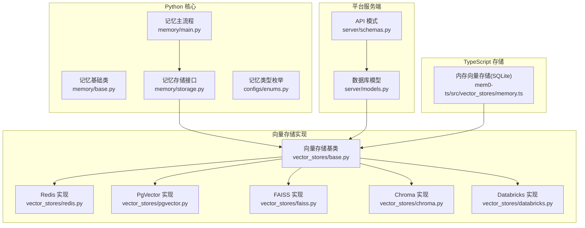
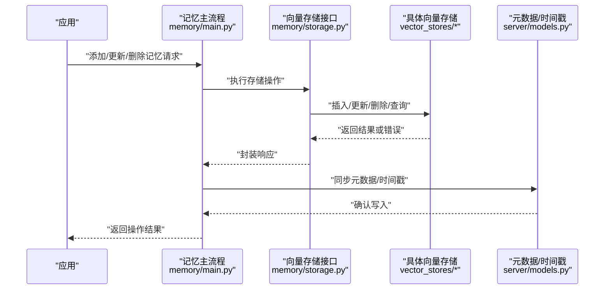
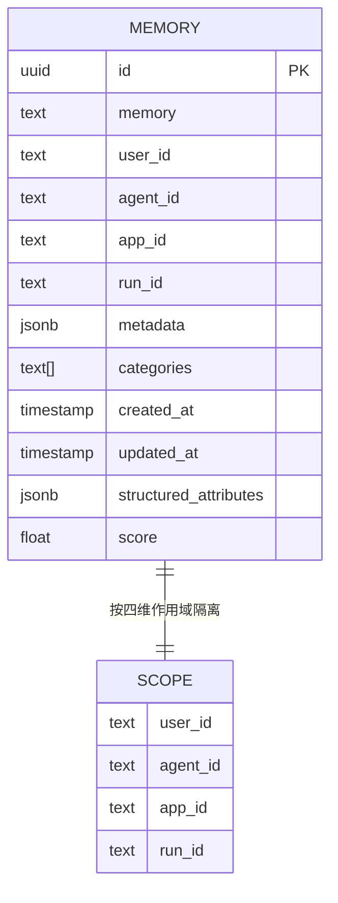
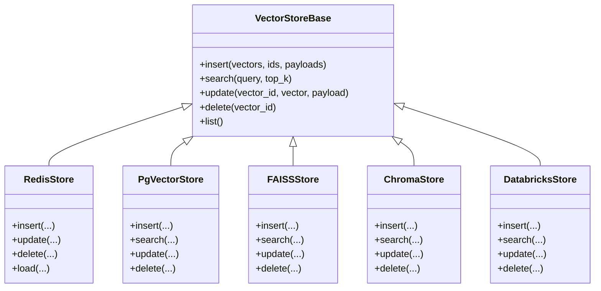
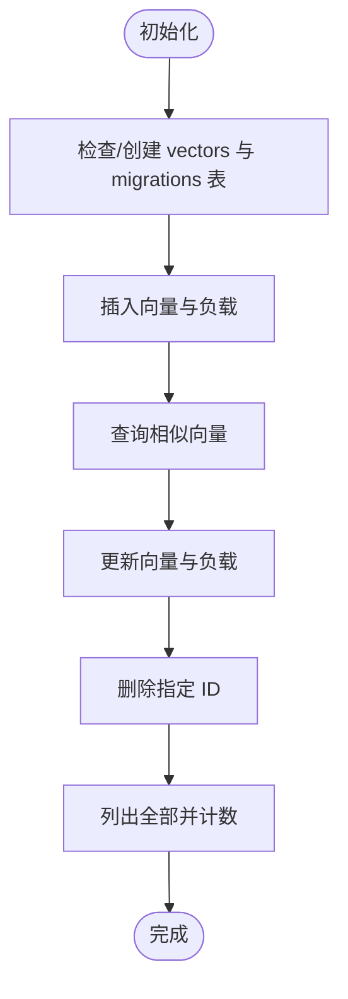
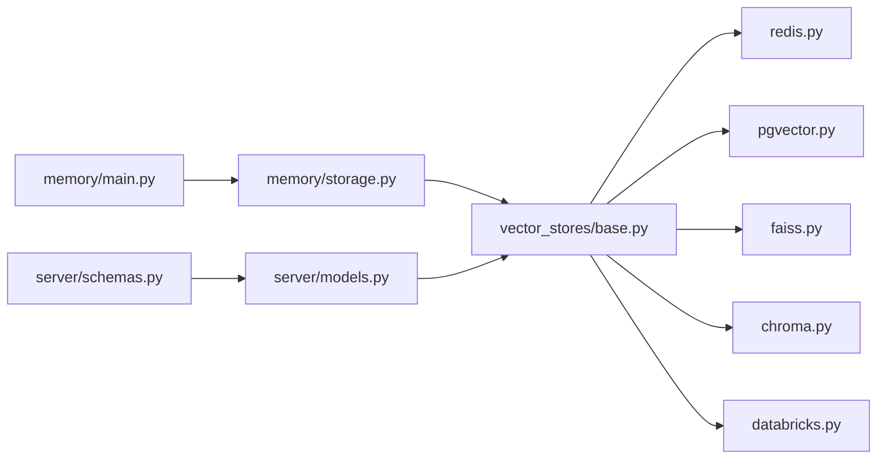

# 数据模型与存储结构

<cite>
**本文引用的文件**
- [storage.py](file://mem0/memory/storage.py)
- [main.py](file://mem0/memory/main.py)
- [base.py](file://mem0/memory/base.py)
- [enums.py](file://mem0/configs/enums.py)
- [databricks.py](file://mem0/vector_stores/databricks.py)
- [redis.py](file://mem0/vector_stores/redis.py)
- [pgvector.py](file://mem0/vector_stores/pgvector.py)
- [faiss.py](file://mem0/vector_stores/faiss.py)
- [chroma.py](file://mem0/vector_stores/chroma.py)
- [base.py](file://mem0/vector_stores/base.py)
- [models.py](file://server/models.py)
- [schemas.py](file://server/schemas.py)
- [timestamp.mdx](file://docs/platform/features/timestamp.mdx)
- [architecture.md](file://skills/mem0/references/architecture.md)
- [memory.ts](file://mem0-ts/src/oss/src/vector_stores/memory.ts)
- [sqlite-backward-compat.test.ts](file://mem0-ts/src/oss/src/tests/sqlite-backward-compat.test.ts)
- [better-sqlite3-migration.test.ts](file://mem0-ts/src/oss/src/tests/better-sqlite3-migration.test.ts)
- [storage.unit.test.ts](file://mem0-ts/src/oss/tests/storage.unit.test.ts)
</cite>

## 目录
1. [简介](#简介)
2. [项目结构](#项目结构)
3. [核心组件](#核心组件)
4. [架构总览](#架构总览)
5. [详细组件分析](#详细组件分析)
6. [依赖分析](#依赖分析)
7. [性能考虑](#性能考虑)
8. [故障排查指南](#故障排查指南)
9. [结论](#结论)
10. [附录](#附录)

## 简介
本章节系统性阐述 Mem0 的数据模型与存储结构设计，覆盖记忆对象的数据结构、字段定义与关系映射；向量存储、元数据管理、时间戳处理等核心数据组件；以及序列化、压缩、加密等存储优化技术。文档同时给出数据库 Schema 设计、索引策略与数据完整性保障的技术细节，并通过多种图示帮助开发者理解底层数据组织方式。

## 项目结构
Mem0 的数据层由“记忆模型”和“向量存储实现”两部分组成：
- 记忆模型：Python 端在 mem0/memory 下定义，包含存储接口、基础类与主流程入口。
- 向量存储：多后端实现（如 Redis、PgVector、FAISS、Chroma、Databricks 等），统一通过抽象基类进行适配。
- 服务端模型与模式：OpenMemory 平台侧在 server/models.py 与 server/schemas.py 中定义持久化实体与 API 模式。
- TypeScript 内存向量存储：mem0-ts 提供基于 SQLite 的内存向量存储实现与测试用例，用于本地开发与验证。

**图表来源**
- [base.py](file://mem0/memory/base.py)
- [main.py](file://mem0/memory/main.py)
- [storage.py](file://mem0/memory/storage.py)
- [enums.py](file://mem0/configs/enums.py)
- [base.py](file://mem0/vector_stores/base.py)
- [redis.py](file://mem0/vector_stores/redis.py)
- [pgvector.py](file://mem0/vector_stores/pgvector.py)
- [faiss.py](file://mem0/vector_stores/faiss.py)
- [chroma.py](file://mem0/vector_stores/chroma.py)
- [databricks.py](file://mem0/vector_stores/databricks.py)
- [models.py](file://server/models.py)
- [schemas.py](file://server/schemas.py)
- [memory.ts](file://mem0-ts/src/oss/src/vector_stores/memory.ts)

**章节来源**
- [base.py](file://mem0/memory/base.py)
- [main.py](file://mem0/memory/main.py)
- [storage.py](file://mem0/memory/storage.py)
- [enums.py](file://mem0/configs/enums.py)
- [base.py](file://mem0/vector_stores/base.py)
- [redis.py](file://mem0/vector_stores/redis.py)
- [pgvector.py](file://mem0/vector_stores/pgvector.py)
- [faiss.py](file://mem0/vector_stores/faiss.py)
- [chroma.py](file://mem0/vector_stores/chroma.py)
- [databricks.py](file://mem0/vector_stores/databricks.py)
- [models.py](file://server/models.py)
- [schemas.py](file://server/schemas.py)
- [memory.ts](file://mem0-ts/src/oss/src/vector_stores/memory.ts)

## 核心组件
- 记忆对象数据结构
  - 字段定义：id、memory、user_id、agent_id、app_id、run_id、metadata、categories、created_at、updated_at、structured_attributes、score。
  - 多租户隔离维度：user_id、agent_id、app_id、run_id 四维作用域，防止数据混合。
  - 时间戳：支持自定义创建与更新时间，确保历史导入与时间线一致性。
- 记忆类型枚举：语义记忆、情景记忆、程序记忆三类，用于检索与归档策略。
- 向量存储接口：统一的插入、查询、更新、删除与列表能力，屏蔽不同后端差异。
- 服务端模型：与 API 模式对接，确保入参与返回值一致。

**章节来源**
- [architecture.md](file://skills/mem0/references/architecture.md)
- [enums.py](file://mem0/configs/enums.py)
- [timestamp.mdx](file://docs/platform/features/timestamp.mdx)

## 架构总览
下图展示从应用到存储的完整数据流：应用写入记忆 → 向量化 → 写入向量存储 → 元数据落盘 → 查询时向量相似度匹配 + 元数据过滤。

**图表来源**
- [main.py](file://mem0/memory/main.py)
- [storage.py](file://mem0/memory/storage.py)
- [base.py](file://mem0/vector_stores/base.py)
- [models.py](file://server/models.py)

## 详细组件分析

### 记忆对象数据模型
- 字段与用途
  - id：唯一标识，用于更新/删除。
  - memory：记忆文本内容。
  - user_id/agent_id/app_id/run_id：四维作用域，实现多租户隔离。
  - metadata/categories：自定义键值对与分类标签，支持过滤与分组。
  - created_at/updated_at：时间戳，支持自定义创建时间。
  - structured_attributes：结构化时间属性，便于时间范围查询。
  - score：检索结果中的语义相似度（0-1）。
- 关系映射
  - 每个 user_id-agent_id-app_id-run_id 组合形成独立存储单元，避免跨会话数据混淆。
  - memory_id 作为向量存储主键，同时承载元数据与时间戳。

**图表来源**
- [architecture.md](file://skills/mem0/references/architecture.md)

**章节来源**
- [architecture.md](file://skills/mem0/references/architecture.md)
- [timestamp.mdx](file://docs/platform/features/timestamp.mdx)

### 向量存储实现与数据序列化
- Redis 实现
  - 序列化：向量以二进制形式存储，元数据以 JSON 字符串存储，时间戳转换为 Unix 秒。
  - 更新策略：仅当提供向量时才更新嵌入，否则仅更新元数据。
  - 键命名：使用前缀拼接 memory_id，便于批量清理与检索。
- PgVector 实现
  - 使用向量类型与 GIN 索引，支持高效相似度检索与全文检索。
  - 元数据字段采用 JSONB，便于复杂查询与过滤。
- FAISS/Chroma/Databricks 实现
  - 统一遵循插入/查询/更新/删除协议，字段包含 memory_id、hash、agent_id、run_id、user_id、memory、metadata、created_at、updated_at。
  - 不同后端在索引与查询性能上有所差异，需结合场景选择。

**图表来源**
- [base.py](file://mem0/vector_stores/base.py)
- [redis.py](file://mem0/vector_stores/redis.py)
- [pgvector.py](file://mem0/vector_stores/pgvector.py)
- [faiss.py](file://mem0/vector_stores/faiss.py)
- [chroma.py](file://mem0/vector_stores/chroma.py)
- [databricks.py](file://mem0/vector_stores/databricks.py)

**章节来源**
- [redis.py](file://mem0/vector_stores/redis.py)
- [pgvector.py](file://mem0/vector_stores/pgvector.py)
- [faiss.py](file://mem0/vector_stores/faiss.py)
- [chroma.py](file://mem0/vector_stores/chroma.py)
- [databricks.py](file://mem0/vector_stores/databricks.py)
- [base.py](file://mem0/vector_stores/base.py)

### TypeScript 内存向量存储（SQLite）
- 表结构
  - vectors 表：id（主键）、vector（BLOB）、payload（TEXT）。
  - memory_migrations 表：用户级迁移记录，唯一约束保证幂等。
- 能力与行为
  - 插入、查询、更新、删除、列出全部。
  - Cosine 相似度计算，支持按相似度排序。
  - 测试覆盖：兼容性、增删改查、列表与数量统计。
- 迁移与兼容
  - 默认文件位置变更提示与自动迁移策略。
  - 历史版本兼容测试，确保升级不丢失数据。

**图表来源**
- [memory.ts](file://mem0-ts/src/oss/src/vector_stores/memory.ts)

**章节来源**
- [memory.ts](file://mem0-ts/src/oss/src/vector_stores/memory.ts)
- [sqlite-backward-compat.test.ts](file://mem0-ts/src/oss/src/tests/sqlite-backward-compat.test.ts)
- [better-sqlite3-migration.test.ts](file://mem0-ts/src/oss/src/tests/better-sqlite3-migration.test.ts)

### 服务端模型与 API 模式
- 数据库模型
  - 定义与向量存储字段一致的核心实体，确保后端一致性。
- API 模式
  - 输入输出参数严格校验，支持分页、过滤与排序。
  - 与向量存储实现解耦，便于替换后端。

**章节来源**
- [models.py](file://server/models.py)
- [schemas.py](file://server/schemas.py)

## 依赖分析
- 组件耦合
  - memory/main.py 依赖 memory/storage.py 提供的统一接口。
  - storage.py 通过 vector_stores/base.py 抽象调用具体后端实现。
  - server 层通过 models/schemas 与存储层交互。
- 可能的循环依赖
  - 当前结构清晰，无明显循环依赖迹象。
- 外部依赖
  - 向量存储后端依赖各自 SDK 或驱动，注意版本兼容性与性能差异。

**图表来源**
- [main.py](file://mem0/memory/main.py)
- [storage.py](file://mem0/memory/storage.py)
- [base.py](file://mem0/vector_stores/base.py)
- [redis.py](file://mem0/vector_stores/redis.py)
- [pgvector.py](file://mem0/vector_stores/pgvector.py)
- [faiss.py](file://mem0/vector_stores/faiss.py)
- [chroma.py](file://mem0/vector_stores/chroma.py)
- [databricks.py](file://mem0/vector_stores/databricks.py)
- [models.py](file://server/models.py)
- [schemas.py](file://server/schemas.py)

**章节来源**
- [main.py](file://mem0/memory/main.py)
- [storage.py](file://mem0/memory/storage.py)
- [base.py](file://mem0/vector_stores/base.py)
- [redis.py](file://mem0/vector_stores/redis.py)
- [pgvector.py](file://mem0/vector_stores/pgvector.py)
- [faiss.py](file://mem0/vector_stores/faiss.py)
- [chroma.py](file://mem0/vector_stores/chroma.py)
- [databricks.py](file://mem0/vector_stores/databricks.py)
- [models.py](file://server/models.py)
- [schemas.py](file://server/schemas.py)

## 性能考虑
- 向量索引与查询
  - Redis：适合低延迟、小规模数据；注意键空间与内存占用。
  - PgVector：支持高维向量与复杂查询；建议合理设置索引参数。
  - FAISS/Chroma/Databricks：根据数据规模与查询模式选择最优实现。
- 元数据与时间戳
  - 将常用过滤字段（如 user_id、agent_id、run_id）建立索引，减少扫描成本。
  - 时间戳字段用于排序与范围查询，建议单独索引。
- 序列化与压缩
  - 向量采用二进制存储，减少序列化开销；可结合后端压缩能力进一步优化。
  - 元数据 JSON 建议控制层级与大小，避免超长字符串影响性能。
- 缓存与批处理
  - 批量插入/更新可显著提升吞吐；注意内存与事务边界。
  - 对热点查询结果进行缓存，降低重复计算。

## 故障排查指南
- 插入失败
  - 检查向量维度与后端要求是否一致。
  - 确认 memory_id 是否重复，必要时启用幂等策略。
- 查询结果异常
  - 验证向量归一化与相似度计算逻辑。
  - 排查元数据过滤条件与索引状态。
- 时间戳问题
  - 自定义时间戳需符合 ISO8601 格式；确保时区正确。
  - 导入历史数据时核对 created_at/updated_at 与业务时间线。
- TypeScript 存储
  - 若默认文件路径变更，留意迁移提示；确保权限与磁盘空间充足。
  - 单测覆盖了基本 CRUD 与兼容性，可参考用例定位问题。

**章节来源**
- [redis.py](file://mem0/vector_stores/redis.py)
- [timestamp.mdx](file://docs/platform/features/timestamp.mdx)
- [sqlite-backward-compat.test.ts](file://mem0-ts/src/oss/src/tests/sqlite-backward-compat.test.ts)
- [better-sqlite3-migration.test.ts](file://mem0-ts/src/oss/src/tests/better-sqlite3-migration.test.ts)
- [storage.unit.test.ts](file://mem0-ts/src/oss/tests/storage.unit.test.ts)

## 结论
Mem0 的数据模型围绕“记忆对象 + 四维作用域 + 时间戳 + 元数据”构建，通过统一的向量存储接口适配多种后端，兼顾易用性与扩展性。服务端模型与 API 模式确保了数据一致性与可维护性。在实际部署中，应依据数据规模、查询模式与合规要求选择合适的后端与索引策略，并配合序列化与缓存优化以获得最佳性能。

## 附录
- 数据模型图与存储示例
  - 参考“记忆对象数据模型”与“向量存储实现与数据序列化”两节中的图示与字段说明。
- 开发者建议
  - 在生产环境优先选择具备稳定索引与查询优化的后端（如 PgVector）。
  - 对高频查询建立复合索引，对大字段采用外部化存储策略。
  - 定期评估向量维度与相似度阈值，平衡召回率与性能。