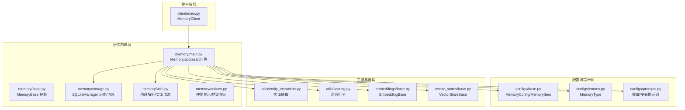
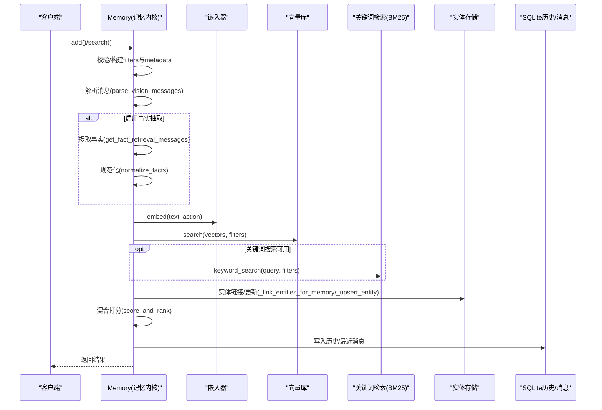
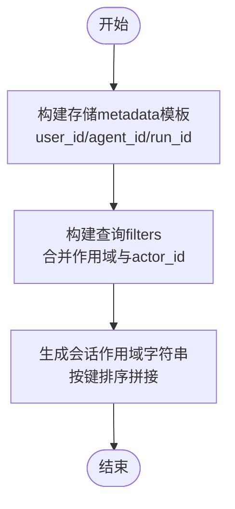
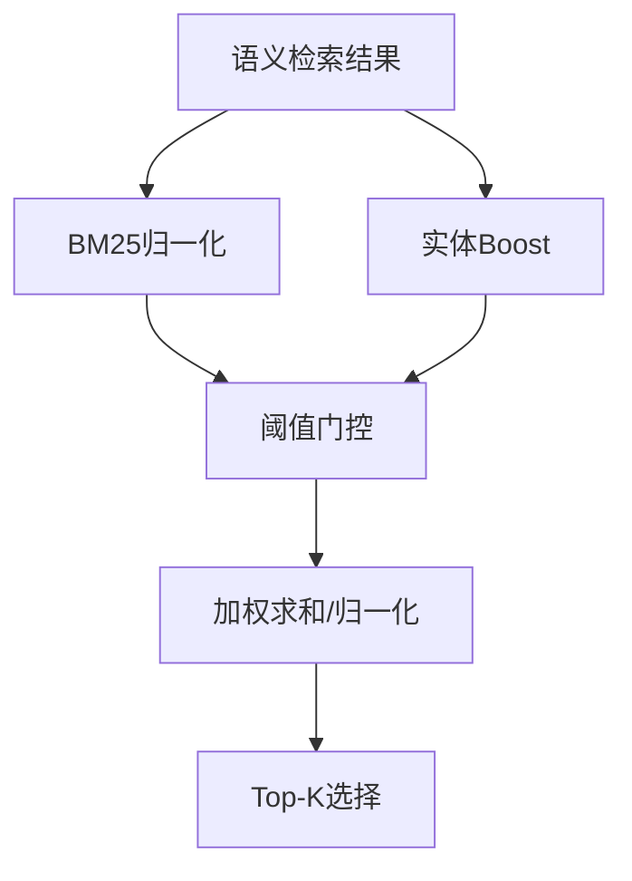
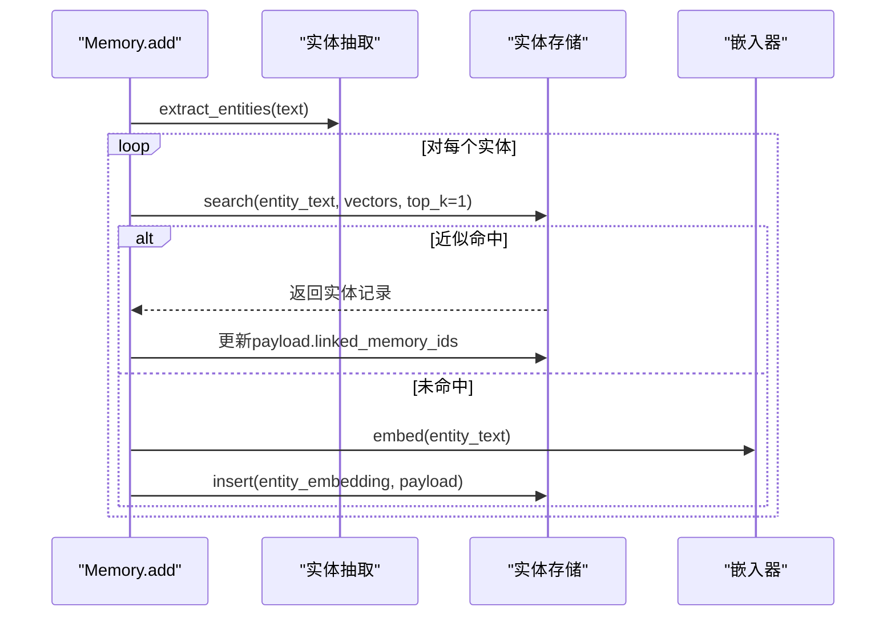
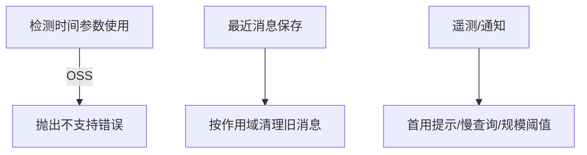
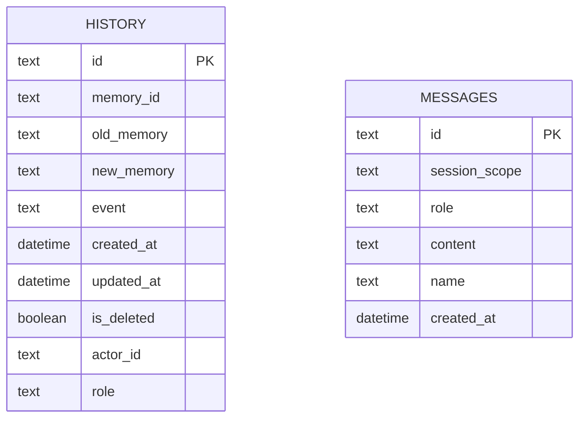
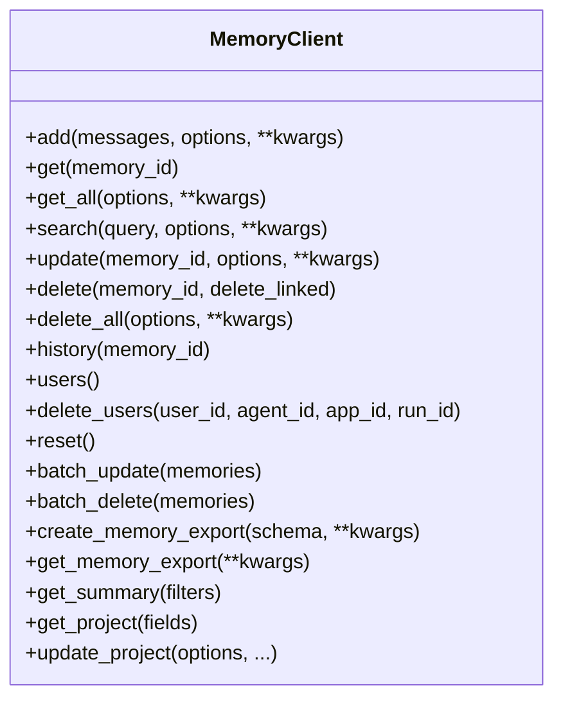
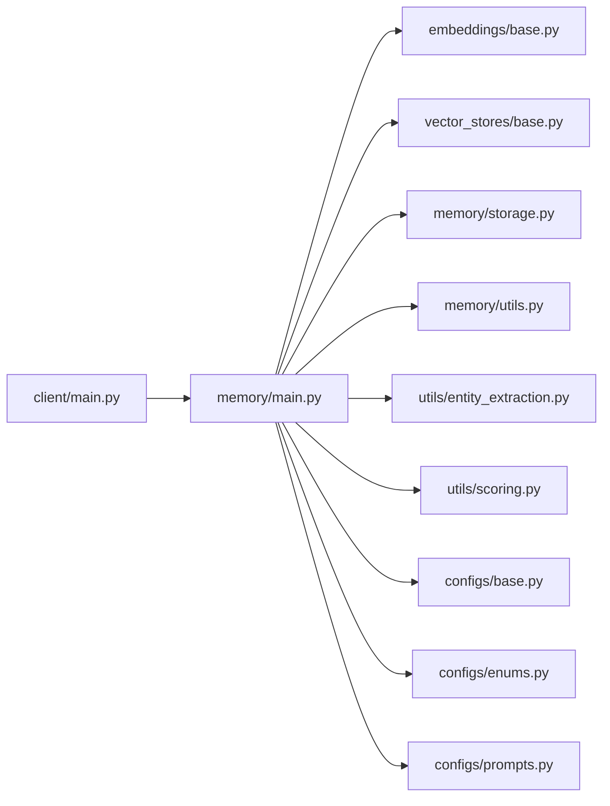

# 核心概念

<cite>
**本文引用的文件**
- [mem0/__init__.py](file://mem0/__init__.py)
- [mem0/memory/main.py](file://mem0/memory/main.py)
- [mem0/memory/base.py](file://mem0/memory/base.py)
- [mem0/memory/storage.py](file://mem0/memory/storage.py)
- [mem0/configs/base.py](file://mem0/configs/base.py)
- [mem0/configs/enums.py](file://mem0/configs/enums.py)
- [mem0/utils/entity_extraction.py](file://mem0/utils/entity_extraction.py)
- [mem0/utils/scoring.py](file://mem0/utils/scoring.py)
- [mem0/memory/utils.py](file://mem0/memory/utils.py)
- [mem0/client/main.py](file://mem0/client/main.py)
- [mem0/vector_stores/base.py](file://mem0/vector_stores/base.py)
- [mem0/embeddings/base.py](file://mem0/embeddings/base.py)
- [mem0/configs/prompts.py](file://mem0/configs/prompts.py)
- [mem0/memory/notices.py](file://mem0/memory/notices.py)
</cite>

## 目录
1. [引言](#引言)
2. [项目结构](#项目结构)
3. [核心组件](#核心组件)
4. [架构总览](#架构总览)
5. [详细组件分析](#详细组件分析)
6. [依赖关系分析](#依赖关系分析)
7. [性能考量](#性能考量)
8. [故障排查指南](#故障排查指南)
9. [结论](#结论)
10. [附录](#附录)

## 引言
本篇“核心概念”旨在系统阐释 Mem0 的理论与实现基础，围绕以下主题展开：长时记忆的工作原理、多层级记忆架构（用户级、会话级、代理级）、向量检索与关键词检索融合的混合检索策略、实体链接与增强、时间感知与上下文管理、记忆生命周期与存储结构、以及通知与遥测机制。文档通过代码级图示与路径引用，帮助开发者从零开始理解 Mem0 的内部工作机制。

## 项目结构
Mem0 采用模块化分层设计：
- 客户端层：对外暴露同步/异步客户端接口，封装 API 调用与参数准备。
- 记忆内核层：负责消息解析、事实抽取、向量嵌入、向量检索、实体链接、历史记录与消息缓存。
- 配置与提示词层：集中管理嵌入、LLM、向量库、重排序器等配置及提示词模板。
- 工具与通用能力：实体抽取、评分与归一化、视觉消息处理、过滤与安全脱敏等。
- 存储层：SQLite 历史表与最近消息表，支持回滚与迁移。

**图示来源**
- [mem0/client/main.py:71-800](file://mem0/client/main.py#L71-L800)
- [mem0/memory/main.py:407-800](file://mem0/memory/main.py#L407-L800)
- [mem0/memory/base.py:4-64](file://mem0/memory/base.py#L4-L64)
- [mem0/memory/storage.py:11-348](file://mem0/memory/storage.py#L11-L348)
- [mem0/memory/utils.py:15-305](file://mem0/memory/utils.py#L15-L305)
- [mem0/memory/notices.py:1-200](file://mem0/memory/notices.py#L1-L200)
- [mem0/configs/base.py:29-82](file://mem0/configs/base.py#L29-L82)
- [mem0/configs/enums.py:4-8](file://mem0/configs/enums.py#L4-L8)
- [mem0/configs/prompts.py:1-200](file://mem0/configs/prompts.py#L1-L200)
- [mem0/utils/entity_extraction.py:123-358](file://mem0/utils/entity_extraction.py#L123-L358)
- [mem0/utils/scoring.py:16-140](file://mem0/utils/scoring.py#L16-L140)
- [mem0/embeddings/base.py:7-48](file://mem0/embeddings/base.py#L7-L48)
- [mem0/vector_stores/base.py:4-101](file://mem0/vector_stores/base.py#L4-L101)

**章节来源**
- [mem0/__init__.py:1-7](file://mem0/__init__.py#L1-L7)
- [mem0/client/main.py:71-800](file://mem0/client/main.py#L71-L800)
- [mem0/memory/main.py:407-800](file://mem0/memory/main.py#L407-L800)
- [mem0/memory/storage.py:11-348](file://mem0/memory/storage.py#L11-L348)
- [mem0/configs/base.py:29-82](file://mem0/configs/base.py#L29-L82)
- [mem0/configs/enums.py:4-8](file://mem0/configs/enums.py#L4-L8)
- [mem0/configs/prompts.py:1-200](file://mem0/configs/prompts.py#L1-L200)
- [mem0/utils/entity_extraction.py:123-358](file://mem0/utils/entity_extraction.py#L123-L358)
- [mem0/utils/scoring.py:16-140](file://mem0/utils/scoring.py#L16-L140)
- [mem0/embeddings/base.py:7-48](file://mem0/embeddings/base.py#L7-L48)
- [mem0/vector_stores/base.py:4-101](file://mem0/vector_stores/base.py#L4-L101)

## 核心组件
- Memory 与 MemoryBase：定义记忆增删改查与历史接口，实现消息到事实的抽取、向量检索、实体链接与历史写入。
- MemoryConfig 与 MemoryItem：统一配置与返回模型，包含向量库、LLM、嵌入器、重排序器、自定义指令与历史数据库路径。
- MemoryType：枚举语义/情节/程序性记忆类型，用于区分记忆性质。
- SQLiteManager：维护历史变更记录与最近消息缓存，支持迁移、批量写入与按会话作用域清理。
- 提示词与消息处理：基于角色的消息解析、JSON 规范化、视觉内容描述、实体关系清洗与 Cypher 字符转义。
- 实体抽取与混合打分：spaCy 实体抽取、BM25 参数自适应归一化、语义+BM25+实体增强的加法式打分。
- 向量存储与嵌入抽象：统一的向量存储接口与嵌入接口，支持多种提供商与批查询。

**章节来源**
- [mem0/memory/base.py:4-64](file://mem0/memory/base.py#L4-L64)
- [mem0/memory/main.py:407-800](file://mem0/memory/main.py#L407-L800)
- [mem0/configs/base.py:29-82](file://mem0/configs/base.py#L29-L82)
- [mem0/configs/enums.py:4-8](file://mem0/configs/enums.py#L4-L8)
- [mem0/memory/storage.py:11-348](file://mem0/memory/storage.py#L11-L348)
- [mem0/memory/utils.py:15-305](file://mem0/memory/utils.py#L15-L305)
- [mem0/utils/entity_extraction.py:123-358](file://mem0/utils/entity_extraction.py#L123-L358)
- [mem0/utils/scoring.py:16-140](file://mem0/utils/scoring.py#L16-L140)
- [mem0/vector_stores/base.py:4-101](file://mem0/vector_stores/base.py#L4-L101)
- [mem0/embeddings/base.py:7-48](file://mem0/embeddings/base.py#L7-L48)

## 架构总览
Mem0 的核心是“记忆内核”，它在客户端调用后执行以下流程：校验输入、构建会话作用域、解析消息、可选的事实抽取、向量嵌入、向量检索、关键词检索（若支持）、实体链接、混合打分、结果返回与历史记录写入。配置层贯穿始终，决定嵌入器、向量库、LLM 与重排序器的行为。

**图示来源**
- [mem0/memory/main.py:653-800](file://mem0/memory/main.py#L653-L800)
- [mem0/memory/utils.py:61-206](file://mem0/memory/utils.py#L61-L206)
- [mem0/utils/entity_extraction.py:123-358](file://mem0/utils/entity_extraction.py#L123-L358)
- [mem0/utils/scoring.py:60-140](file://mem0/utils/scoring.py#L60-L140)
- [mem0/memory/storage.py:150-324](file://mem0/memory/storage.py#L150-L324)
- [mem0/vector_stores/base.py:68-83](file://mem0/vector_stores/base.py#L68-L83)
- [mem0/embeddings/base.py:20-48](file://mem0/embeddings/base.py#L20-L48)

## 详细组件分析

### 多层级记忆架构与会话作用域
- 用户级/代理级/会话级由三个实体标识共同决定：user_id、agent_id、run_id。任一或组合均可作为会话作用域，确保检索与操作限定在该作用域内。
- 过滤模板与查询过滤分离：存储时以 metadata 模板包含所有提供的作用域 ID；查询时在 filters 中合并作用域与可选 actor_id，避免顶层直接传入实体参数。
- 会话作用域字符串由已提供的作用域键值对拼接而成，保证确定性与可复现。

**图示来源**
- [mem0/memory/main.py:272-355](file://mem0/memory/main.py#L272-L355)

**章节来源**
- [mem0/memory/main.py:272-355](file://mem0/memory/main.py#L272-L355)

### 向量检索与关键词检索（混合检索）
- 向量检索：统一接口返回相似度分数（范围建议为 [0,1]），兼容余弦距离、L2 距离与内积。
- 关键词检索：仅当具体向量库实现支持时启用；否则警告降级为纯语义检索。
- 混合打分：语义分数 + BM25 归一化分数 + 实体增强权重，阈值门控先筛语义分数，再加权求和并归一化至 [0,1]。

**图示来源**
- [mem0/vector_stores/base.py:6-26](file://mem0/vector_stores/base.py#L6-L26)
- [mem0/utils/scoring.py:16-140](file://mem0/utils/scoring.py#L16-L140)

**章节来源**
- [mem0/vector_stores/base.py:6-26](file://mem0/vector_stores/base.py#L6-L26)
- [mem0/utils/scoring.py:16-140](file://mem0/utils/scoring.py#L16-L140)

### 实体链接与增强
- 实体抽取：基于 spaCy 的命名实体、引号文本、名词复合词与退化名词抽取，去重与清洗后输出。
- 实体存储：独立集合，记录实体文本、类型与关联的记忆 ID 列表；更新时重嵌入并同步 payload。
- 记忆增强：在新增记忆时，将抽取到的实体与现有实体近邻比较，命中则追加记忆 ID，未命中则创建新实体并插入。

**图示来源**
- [mem0/memory/main.py:502-622](file://mem0/memory/main.py#L502-L622)
- [mem0/utils/entity_extraction.py:123-358](file://mem0/utils/entity_extraction.py#L123-L358)

**章节来源**
- [mem0/memory/main.py:502-622](file://mem0/memory/main.py#L502-L622)
- [mem0/utils/entity_extraction.py:123-358](file://mem0/utils/entity_extraction.py#L123-L358)

### 时间感知与上下文管理
- 时间感知：OSS 版本不支持 timestamp/reference_date 等时间相关参数，调用时抛出错误提示；平台版本提供时间锚点与相对时间解析。
- 上下文管理：最近消息表保存最近若干条消息，按会话作用域清理，便于后续对话保持上下文一致性。
- 通知与遥测：首次运行、高 top_k、慢查询、衰减使用等场景通过遥测与通知系统提示，避免误用与性能问题。

**图示来源**
- [mem0/memory/main.py:702-704](file://mem0/memory/main.py#L702-L704)
- [mem0/memory/storage.py:257-324](file://mem0/memory/storage.py#L257-L324)
- [mem0/memory/notices.py:155-254](file://mem0/memory/notices.py#L155-L254)

**章节来源**
- [mem0/memory/main.py:702-704](file://mem0/memory/main.py#L702-L704)
- [mem0/memory/storage.py:257-324](file://mem0/memory/storage.py#L257-L324)
- [mem0/memory/notices.py:155-254](file://mem0/memory/notices.py#L155-L254)

### 记忆生命周期与存储结构
- 生命周期：add → 向量入库/更新 → 可选事实抽取 → 实体链接 → 混合打分 → 历史写入 → 返回结果。
- 存储结构：
  - 历史表：记录每次变更（旧/新内容、事件、时间戳、删除标记、参与者角色）。
  - 最近消息表：按会话作用域保存最近消息，自动清理超出窗口的消息。
- 删除联动：删除记忆时，从实体存储中移除该记忆 ID，并在必要时重嵌入与更新 payload。

**图示来源**
- [mem0/memory/storage.py:102-148](file://mem0/memory/storage.py#L102-L148)
- [mem0/memory/storage.py:150-324](file://mem0/memory/storage.py#L150-L324)

**章节来源**
- [mem0/memory/storage.py:102-324](file://mem0/memory/storage.py#L102-L324)

### 客户端与 API 行为
- MemoryClient：封装认证头、主机地址、项目信息与用户标识；提供 add/get/get_all/search/update/delete/history/users/delete_users/reset/batch_* 等方法。
- 参数校验与错误处理：统一的异常处理器与参数校验，支持 top_k、阈值、实体参数位置约束等。
- 项目管理：Project 属性提供项目维度的指令与分类设置（平台版）。

**图示来源**
- [mem0/client/main.py:71-800](file://mem0/client/main.py#L71-L800)

**章节来源**
- [mem0/client/main.py:71-800](file://mem0/client/main.py#L71-L800)

### 配置与提示词
- MemoryConfig：统一管理向量库、LLM、嵌入器、重排序器、历史数据库路径、版本与自定义指令。
- MemoryItem：标准化返回结构，包含 id、memory、hash、metadata、score、时间戳等字段。
- 提示词：用户/代理记忆抽取、更新记忆、程序性记忆摘要等提示词模板，支撑事实抽取与记忆更新。

**章节来源**
- [mem0/configs/base.py:29-82](file://mem0/configs/base.py#L29-L82)
- [mem0/configs/enums.py:4-8](file://mem0/configs/enums.py#L4-L8)
- [mem0/configs/prompts.py:1-200](file://mem0/configs/prompts.py#L1-L200)

## 依赖关系分析
- 组件耦合：Memory 对嵌入器、向量库、实体存储、SQLite、提示词与工具模块存在强依赖；通过工厂与抽象基类降低耦合。
- 外部依赖：向量库与嵌入器需适配不同提供商；关键词检索能力取决于具体实现是否支持。
- 循环依赖：当前结构未见循环导入；各模块职责清晰，通过配置对象传递能力。

**图示来源**
- [mem0/memory/main.py:407-800](file://mem0/memory/main.py#L407-L800)
- [mem0/client/main.py:71-800](file://mem0/client/main.py#L71-L800)
- [mem0/embeddings/base.py:7-48](file://mem0/embeddings/base.py#L7-L48)
- [mem0/vector_stores/base.py:4-101](file://mem0/vector_stores/base.py#L4-L101)
- [mem0/memory/storage.py:11-348](file://mem0/memory/storage.py#L11-L348)
- [mem0/memory/utils.py:15-305](file://mem0/memory/utils.py#L15-L305)
- [mem0/utils/entity_extraction.py:123-358](file://mem0/utils/entity_extraction.py#L123-L358)
- [mem0/utils/scoring.py:16-140](file://mem0/utils/scoring.py#L16-L140)
- [mem0/configs/base.py:29-82](file://mem0/configs/base.py#L29-L82)
- [mem0/configs/enums.py:4-8](file://mem0/configs/enums.py#L4-L8)
- [mem0/configs/prompts.py:1-200](file://mem0/configs/prompts.py#L1-L200)

**章节来源**
- [mem0/memory/main.py:407-800](file://mem0/memory/main.py#L407-L800)
- [mem0/client/main.py:71-800](file://mem0/client/main.py#L71-L800)

## 性能考量
- 批量与并发：向量库与嵌入器支持批量接口；内存管理使用线程锁与事务，保障 SQLite 写入一致性。
- 检索效率：关键词检索仅在支持的向量库上启用；混合打分前先进行语义阈值门控，减少无效计算。
- 缓存与清理：最近消息表限制数量并按时间窗口清理，避免无限增长。
- 通知与告警：慢查询、高 top_k、大规模记忆计数等阈值触发提示，帮助识别潜在性能问题。

[本节为通用指导，无需特定文件引用]

## 故障排查指南
- 参数校验错误：检查 messages 类型、阈值与 top_k 合法性、实体参数必须通过 filters 传入。
- 时间感知错误：OSS 不支持 timestamp/reference_date，如使用会触发错误提示。
- 关键词检索不可用：部分向量库不支持 keyword_search，将降级为纯语义检索并给出警告。
- 删除联动：删除记忆后，实体存储中的关联 ID 将被移除；如出现残留，检查实体清理逻辑与异常吞没日志。
- 遥测与通知：关注首次运行、慢查询、规模阈值等提示，结合日志定位问题。

**章节来源**
- [mem0/memory/main.py:170-210](file://mem0/memory/main.py#L170-L210)
- [mem0/memory/main.py:463-471](file://mem0/memory/main.py#L463-L471)
- [mem0/memory/main.py:545-599](file://mem0/memory/main.py#L545-L599)
- [mem0/memory/notices.py:155-254](file://mem0/memory/notices.py#L155-L254)

## 结论
Mem0 通过“多层级作用域 + 混合检索 + 实体链接 + 提示词驱动的事实抽取”的组合，实现了可扩展、可解释且具备上下文感知的长时记忆系统。其模块化架构与统一抽象使嵌入器、向量库与提示词易于替换与扩展；SQLite 历史与最近消息表提供了完备的记忆生命周期管理。借助通知与遥测机制，开发者可以及时发现并优化性能瓶颈与误用场景。

## 附录
- 代码示例路径（不含具体代码内容）：
  - 添加记忆：[mem0/memory/main.py:653-760](file://mem0/memory/main.py#L653-L760)
  - 搜索记忆：[mem0/memory/main.py:761-800](file://mem0/memory/main.py#L761-L800)
  - 实体链接：[mem0/memory/main.py:502-622](file://mem0/memory/main.py#L502-L622)
  - 混合打分：[mem0/utils/scoring.py:60-140](file://mem0/utils/scoring.py#L60-L140)
  - 客户端调用：[mem0/client/main.py:173-333](file://mem0/client/main.py#L173-L333)
  - 配置模型：[mem0/configs/base.py:29-82](file://mem0/configs/base.py#L29-L82)
  - 提示词模板：[mem0/configs/prompts.py:406-461](file://mem0/configs/prompts.py#L406-L461)