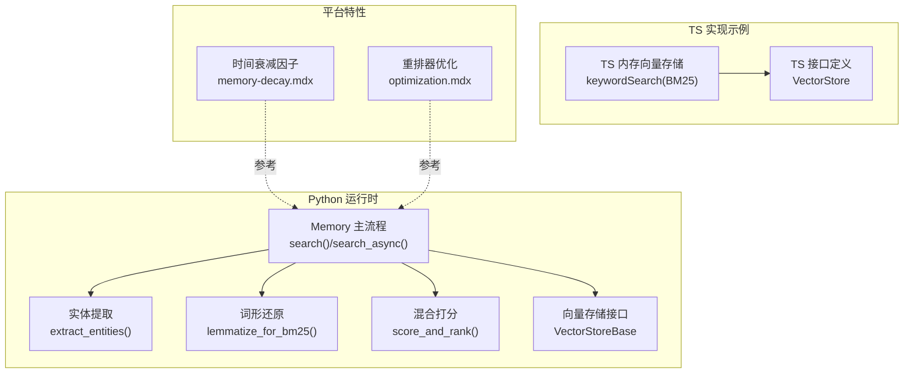
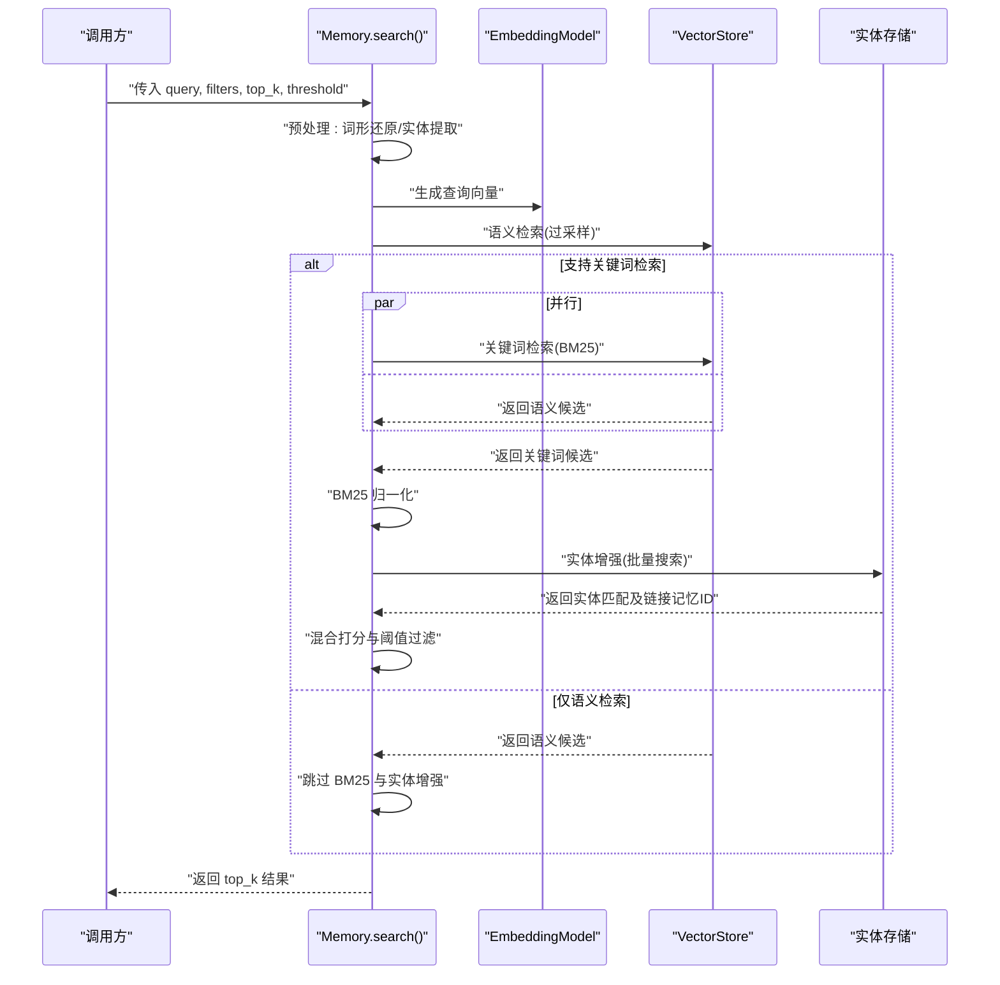
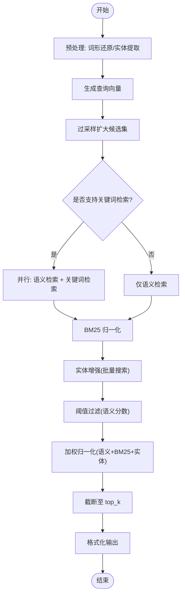
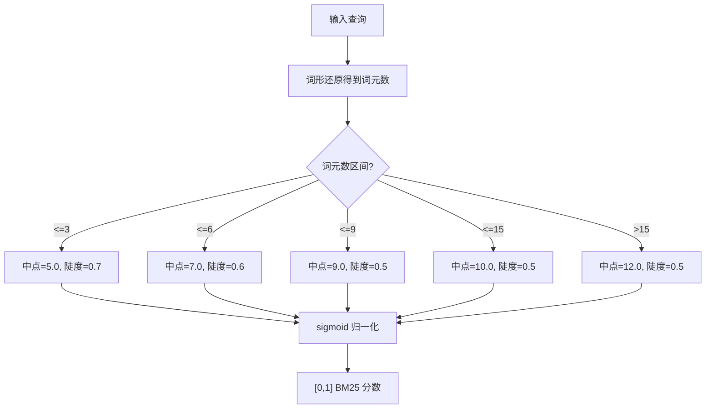
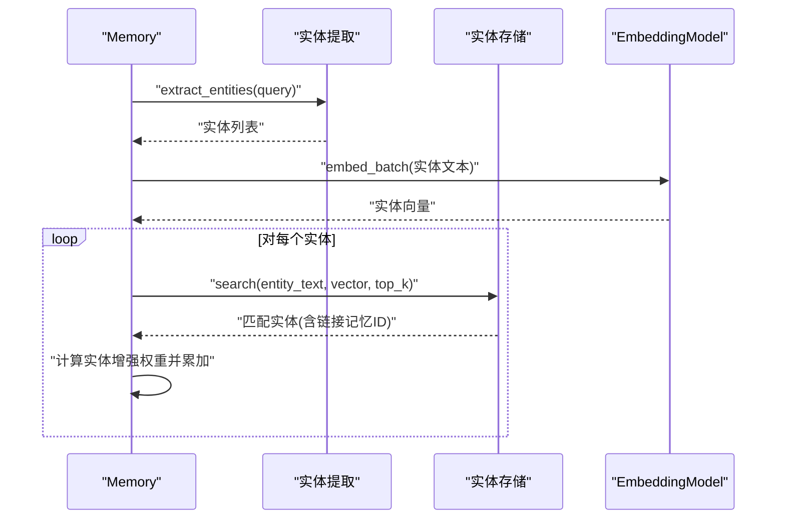
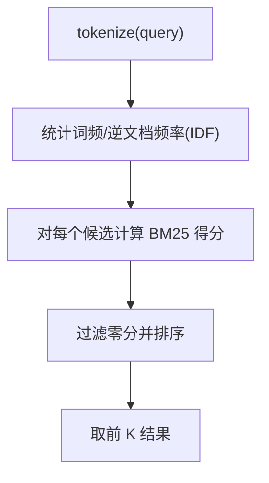
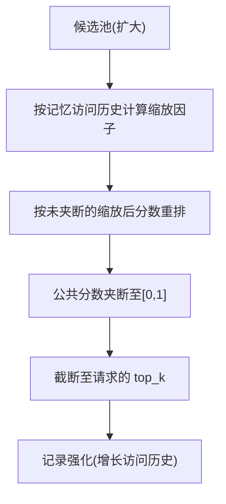
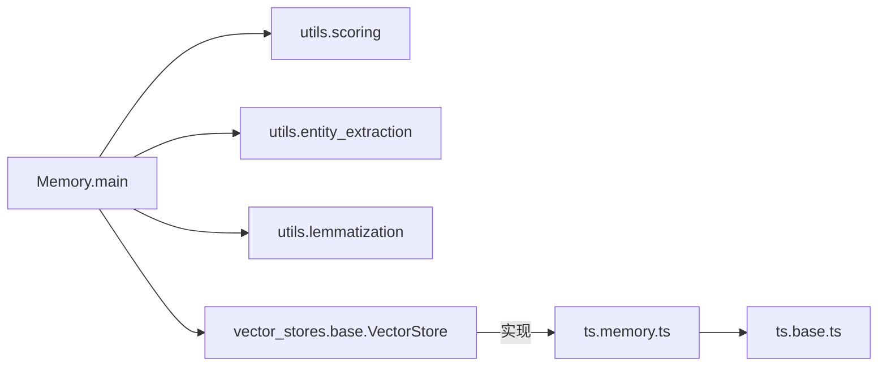

# 检索机制与算法

<cite>
**本文引用的文件**
- [mem0/memory/main.py](file://mem0/memory/main.py)
- [mem0/utils/scoring.py](file://mem0/utils/scoring.py)
- [mem0/utils/entity_extraction.py](file://mem0/utils/entity_extraction.py)
- [mem0/utils/lemmatization.py](file://mem0/utils/lemmatization.py)
- [mem0-ts/src/oss/src/vector_stores/memory.ts](file://mem0-ts/src/oss/src/vector_stores/memory.ts)
- [mem0-ts/src/oss/src/vector_stores/base.ts](file://mem0-ts/src/oss/src/vector_stores/base.ts)
- [docs/platform/features/memory-decay.mdx](file://docs/platform/features/memory-decay.mdx)
- [docs/components/rerankers/optimization.mdx](file://docs/components/rerankers/optimization.mdx)
- [tests/utils/test_scoring.py](file://tests/utils/test_scoring.py)
</cite>

## 目录
1. [简介](#简介)
2. [项目结构](#项目结构)
3. [核心组件](#核心组件)
4. [架构总览](#架构总览)
5. [详细组件分析](#详细组件分析)
6. [依赖关系分析](#依赖关系分析)
7. [性能考量](#性能考量)
8. [故障排查指南](#故障排查指南)
9. [结论](#结论)
10. [附录](#附录)

## 简介
本文件系统性解析 Mem0 的检索机制与算法实现，重点覆盖以下方面：
- 混合检索策略：向量检索（语义相似度）、关键词匹配（BM25）、实体链接增强（Entity Boost）三者融合。
- 核心技术细节：语义相似度计算、BM25 算法参数自适应、sigmoid 归一化、实体提取与链接、时间衰减因子。
- 检索优化：并行处理、过采样、阈值过滤、归一化评分、结果缓存与模型缓存建议。
- 性能对比与实践建议：通过测试用例与文档说明，帮助开发者在不同场景下选择与优化检索方案。

## 项目结构
围绕检索与打分的关键模块分布如下：
- Python 同步/异步检索主流程位于内存模块；BM25 参数与归一化、混合打分逻辑位于工具模块；实体提取与词形还原位于工具模块；TS 内存向量存储实现包含关键词检索（BM25）示例。
- 平台特性文档对时间衰减因子进行行为说明；重排器优化文档给出缓存与并发建议。

**图表来源**
- [mem0/memory/main.py:1500-1599](file://mem0/memory/main.py#L1500-L1599)
- [mem0/utils/entity_extraction.py:123-144](file://mem0/utils/entity_extraction.py#L123-L144)
- [mem0/utils/lemmatization.py:22-50](file://mem0/utils/lemmatization.py#L22-L50)
- [mem0/utils/scoring.py:60-139](file://mem0/utils/scoring.py#L60-L139)
- [mem0-ts/src/oss/src/vector_stores/memory.ts:251-350](file://mem0-ts/src/oss/src/vector_stores/memory.ts#L251-L350)
- [mem0-ts/src/oss/src/vector_stores/base.ts:3-34](file://mem0-ts/src/oss/src/vector_stores/base.ts#L3-L34)
- [docs/platform/features/memory-decay.mdx:23-164](file://docs/platform/features/memory-decay.mdx#L23-L164)
- [docs/components/rerankers/optimization.mdx:180-221](file://docs/components/rerankers/optimization.mdx#L180-L221)

**章节来源**
- [mem0/memory/main.py:1500-1599](file://mem0/memory/main.py#L1500-L1599)
- [mem0-ts/src/oss/src/vector_stores/memory.ts:251-350](file://mem0-ts/src/oss/src/vector_stores/memory.ts#L251-L350)

## 核心组件
- 检索主流程（同步/异步）
  - 预处理：查询词形还原、实体抽取、嵌入生成。
  - 向量检索：按过采样大小执行语义检索。
  - 关键词检索：若向量存储支持，则并行执行 BM25 关键词检索。
  - 打分与排序：基于语义分数、BM25 归一化分数、实体链接增强分数进行加权归一化，再按阈值与 top_k 返回。
- BM25 参数与归一化
  - 基于查询词元数量自适应选择 sigmoid 中点与陡度，再用逻辑斯蒂函数将原始 BM25 分数映射到 [0,1]。
- 实体链接增强
  - 从查询中提取实体，嵌入后在实体存储中检索匹配实体，按相似度与“被链接记忆数”计算每条记忆的增强权重上限，并加到混合分数中。
- 时间衰减因子
  - 搜索时根据记忆最近一次被检索的时间与次数，乘以一个缩放因子（0.3~1.5），用于软重排而非硬过滤。

**章节来源**
- [mem0/memory/main.py:1500-1599](file://mem0/memory/main.py#L1500-L1599)
- [mem0/utils/scoring.py:16-54](file://mem0/utils/scoring.py#L16-L54)
- [mem0/utils/scoring.py:60-139](file://mem0/utils/scoring.py#L60-L139)
- [mem0/utils/entity_extraction.py:123-174](file://mem0/utils/entity_extraction.py#L123-L174)
- [docs/platform/features/memory-decay.mdx:23-164](file://docs/platform/features/memory-decay.mdx#L23-L164)

## 架构总览
下面的序列图展示同步检索的端到端流程，涵盖并行关键词检索、BM25 归一化、实体增强与混合打分。

**图表来源**
- [mem0/memory/main.py:1500-1599](file://mem0/memory/main.py#L1500-L1599)
- [mem0/utils/scoring.py:60-139](file://mem0/utils/scoring.py#L60-L139)
- [mem0/utils/entity_extraction.py:123-174](file://mem0/utils/entity_extraction.py#L123-L174)

## 详细组件分析

### 组件 A：混合检索与打分管线
- 流程要点
  - 过采样：为避免阈值过滤导致最终不足，内部扩大候选规模（如至少为 top_k×4 且不小于 60）。
  - 并行：当向量存储支持关键词检索时，语义与关键词检索并行执行，提升吞吐。
  - BM25：对关键词检索结果计算原始 BM25 分数，再按查询长度自适应 sigmoid 参数归一化。
  - 实体增强：对查询实体进行嵌入，检索实体存储，按相似度与“链接记忆数量”计算每条记忆的增强权重上限，叠加到混合分数。
  - 阈值过滤：先以语义分数阈值筛除低质量候选，再进行加权归一化与排序。
  - 结果格式化：将 payload 中关键字段提升到顶层，保留额外元数据。
- 复杂度与性能
  - 语义检索复杂度近似 O(N·D)（N 为候选数，D 为向量维度）。
  - BM25 计算复杂度近似 O(N·T)（T 为查询词元数）。
  - 实体增强涉及多路并行搜索，受实体数量与最大返回数限制。
- 错误处理
  - 关键词检索失败或返回空时，回退到仅语义检索。
  - 异常捕获与日志记录，保证主流程不中断。

**图表来源**
- [mem0/memory/main.py:1500-1599](file://mem0/memory/main.py#L1500-L1599)
- [mem0/utils/scoring.py:60-139](file://mem0/utils/scoring.py#L60-L139)

**章节来源**
- [mem0/memory/main.py:1500-1599](file://mem0/memory/main.py#L1500-L1599)
- [mem0/utils/scoring.py:60-139](file://mem0/utils/scoring.py#L60-L139)

### 组件 B：BM25 参数与归一化
- 查询长度自适应参数
  - 根据词形还原后的词元数量选择不同的 sigmoid 中点与陡度，缓解长查询天然高分的问题。
- sigmoid 归一化
  - 将无界原始 BM25 分数映射到 [0,1] 区间，便于与语义分数与实体增强分数相加。
- 单元测试验证
  - 覆盖短/中/长查询的参数选择与归一化边界行为。

**图表来源**
- [mem0/utils/scoring.py:16-54](file://mem0/utils/scoring.py#L16-L54)

**章节来源**
- [mem0/utils/scoring.py:16-54](file://mem0/utils/scoring.py#L16-L54)
- [tests/utils/test_scoring.py:11-32](file://tests/utils/test_scoring.py#L11-L32)

### 组件 C：实体链接增强
- 实体提取
  - 使用 spaCy 提取专有名词、引号内文本、名词短语复合词与名词回退，去重与清洗后形成查询实体集合。
- 实体搜索与增强
  - 对每个查询实体生成嵌入，在实体存储中检索相似实体，按相似度与“链接记忆数量”计算每条记忆的最大增强权重，叠加到混合分数。
- 并发控制
  - 同步路径使用线程池并发搜索多个实体；异步路径使用信号量限制并发度。

**图表来源**
- [mem0/utils/entity_extraction.py:123-174](file://mem0/utils/entity_extraction.py#L123-L174)
- [mem0/memory/main.py:1601-1681](file://mem0/memory/main.py#L1601-L1681)

**章节来源**
- [mem0/utils/entity_extraction.py:123-174](file://mem0/utils/entity_extraction.py#L123-L174)
- [mem0/memory/main.py:1601-1681](file://mem0/memory/main.py#L1601-L1681)

### 组件 D：TS 内存向量存储中的 BM25 关键词检索
- 关键词检索实现
  - 对所有候选文档统计词频与逆文档频率（IDF），按 BM25 公式计算得分，过滤零分并按分数降序取前 K。
- 接口约定
  - VectorStore 接口定义了可选的 keywordSearch 方法，TS 内存实现提供了该方法的具体实现。

**图表来源**
- [mem0-ts/src/oss/src/vector_stores/memory.ts:251-350](file://mem0-ts/src/oss/src/vector_stores/memory.ts#L251-L350)
- [mem0-ts/src/oss/src/vector_stores/base.ts:14-18](file://mem0-ts/src/oss/src/vector_stores/base.ts#L14-L18)

**章节来源**
- [mem0-ts/src/oss/src/vector_stores/memory.ts:251-350](file://mem0-ts/src/oss/src/vector_stores/memory.ts#L251-L350)
- [mem0-ts/src/oss/src/vector_stores/base.ts:14-18](file://mem0-ts/src/oss/src/vector_stores/base.ts#L14-L18)

### 组件 E：时间衰减因子
- 工作机制
  - 每条记忆携带检索历史，按最近访问时间与累计访问次数计算缩放因子（0.3~1.5），在排序阶段乘入分数，但不改变阈值过滤顺序。
  - 搜索时扩大候选池（至少为 top_k×3 且不小于 50），允许充分重排后再截断。
- 生命周期与效果
  - 新增或刚被检索的记忆获得更强提升；长时间未被访问的记忆会受到抑制，但不会被完全排除。

**图表来源**
- [docs/platform/features/memory-decay.mdx:23-164](file://docs/platform/features/memory-decay.mdx#L23-L164)

**章节来源**
- [docs/platform/features/memory-decay.mdx:23-164](file://docs/platform/features/memory-decay.mdx#L23-L164)

## 依赖关系分析
- 模块耦合
  - Memory 主流程依赖嵌入模型、向量存储接口、实体存储、评分工具与实体提取工具。
  - TS 向量存储实现遵循统一接口，便于替换具体存储后端。
- 外部依赖
  - spaCy 用于词形还原与实体提取（在工具模块中惰性加载）。
  - 向量存储需支持可选的关键词检索方法以启用 BM25 混合。

**图表来源**
- [mem0/memory/main.py:1500-1599](file://mem0/memory/main.py#L1500-L1599)
- [mem0/utils/scoring.py:60-139](file://mem0/utils/scoring.py#L60-L139)
- [mem0/utils/entity_extraction.py:123-174](file://mem0/utils/entity_extraction.py#L123-L174)
- [mem0/utils/lemmatization.py:22-50](file://mem0/utils/lemmatization.py#L22-L50)
- [mem0-ts/src/oss/src/vector_stores/base.ts:3-34](file://mem0-ts/src/oss/src/vector_stores/base.ts#L3-L34)
- [mem0-ts/src/oss/src/vector_stores/memory.ts:251-350](file://mem0-ts/src/oss/src/vector_stores/memory.ts#L251-L350)

**章节来源**
- [mem0/memory/main.py:1500-1599](file://mem0/memory/main.py#L1500-L1599)
- [mem0-ts/src/oss/src/vector_stores/base.ts:3-34](file://mem0-ts/src/oss/src/vector_stores/base.ts#L3-L34)

## 性能考量
- 并行与过采样
  - 语义与关键词检索并行执行，减少端到端延迟；内部扩大候选规模以补偿阈值过滤带来的样本不足。
- 缓存与模型复用
  - 文档建议对重排器与模型进行缓存，避免重复初始化开销；对检索结果进行缓存可降低重复查询成本。
- 异步与并发
  - 异步版本采用 gather 并行获取语义与关键词结果；实体增强使用信号量限制并发，避免资源争用。
- 性能监控
  - 建议监控延迟与内存占用，结合阈值与 top_k 规模进行调优。

**章节来源**
- [mem0/memory/main.py:1510-1522](file://mem0/memory/main.py#L1510-L1522)
- [mem0/memory/main.py:3053-3063](file://mem0/memory/main.py#L3053-L3063)
- [docs/components/rerankers/optimization.mdx:180-221](file://docs/components/rerankers/optimization.mdx#L180-L221)

## 故障排查指南
- 关键词检索不可用
  - 若向量存储未实现 keyword_search，默认仅语义检索。可通过切换支持 BM25 的存储后端启用混合检索。
- 实体增强无效
  - 确认查询中存在可提取的实体；检查实体存储可用性与链接关系；注意相似度阈值与“链接记忆数量”对增强权重的影响。
- 结果分数异常
  - 检查阈值设置与过采样规模；确认混合打分权重与归一化是否符合预期；必要时开启 explain 输出查看各分量详情。
- 时间衰减影响排序
  - 若发现某些候选被显著抑制，确认其访问历史与时间窗口；必要时调整阈值或放宽 top_k。

**章节来源**
- [mem0/memory/main.py:463-470](file://mem0/memory/main.py#L463-L470)
- [mem0/memory/main.py:1601-1681](file://mem0/memory/main.py#L1601-L1681)
- [docs/platform/features/memory-decay.mdx:23-164](file://docs/platform/features/memory-decay.mdx#L23-L164)

## 结论
Mem0 的检索体系以“语义相似度 + BM25 关键词 + 实体链接增强”的混合策略为核心，辅以并行处理、过采样、阈值过滤与归一化打分，兼顾召回与精度。平台级的时间衰减因子进一步提升了相关性与新鲜度。通过合理配置阈值、top_k、并发与缓存策略，可在不同规模与延迟要求下取得良好平衡。

## 附录
- 算法示例与测试参考
  - BM25 参数与归一化的单元测试覆盖短/中/长查询场景与边界行为。
- 实践建议
  - 在高延迟场景优先启用并行与缓存；在长查询较多的场景适当提高阈值或增大过采样倍数；对实体增强开启时注意并发上限与相似度阈值。

**章节来源**
- [tests/utils/test_scoring.py:11-45](file://tests/utils/test_scoring.py#L11-L45)