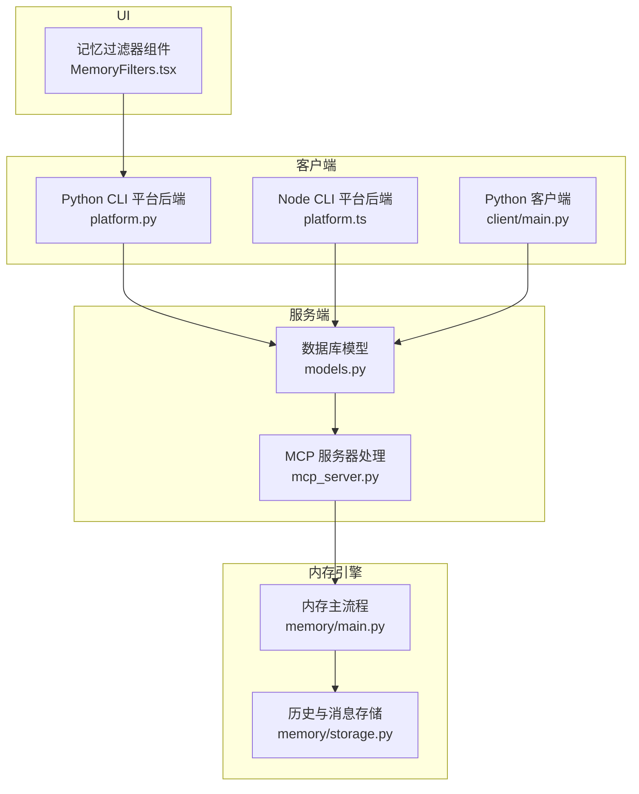
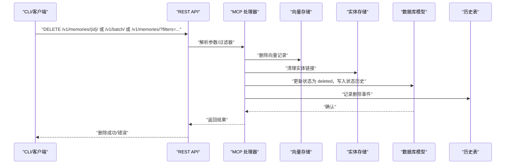
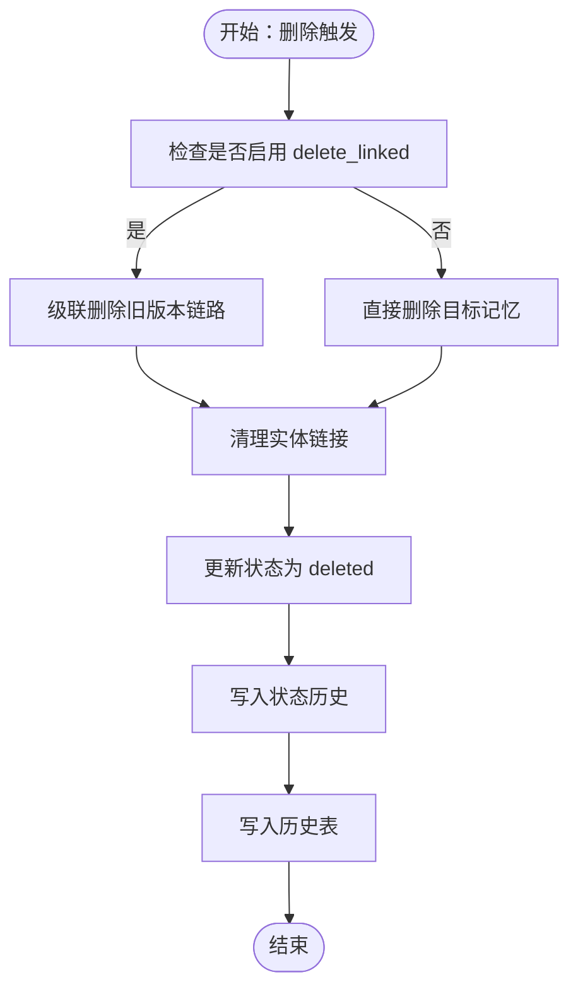
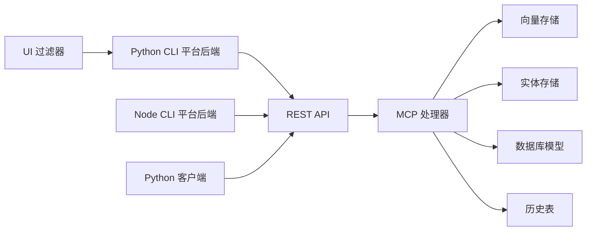

# 记忆删除与清理

<cite>
**本文档引用的文件**
- [mem0/client/main.py](file://mem0/client/main.py)
- [mem0/client/project.py](file://mem0/client/project.py)
- [cli/python/src/mem0_cli/backend/platform.py](file://cli/python/src/mem0_cli/backend/platform.py)
- [cli/node/src/backend/platform.ts](file://cli/node/src/backend/platform.ts)
- [mem0/memory/main.py](file://mem0/memory/main.py)
- [mem0/memory/storage.py](file://mem0/memory/storage.py)
- [openmemory/api/app/models.py](file://openmemory/api/app/models.py)
- [openmemory/api/app/mcp_server.py](file://openmemory/api/app/mcp_server.py)
- [openmemory/ui/app/memories/components/MemoryFilters.tsx](file://openmemory/ui/app/memories/components/MemoryFilters.tsx)
- [docs/api-reference/memory/delete-memories.mdx](file://docs/api-reference/memory/delete-memories.mdx)
- [docs/open-source/features/metadata-filtering.mdx](file://docs/open-source/features/metadata-filtering.mdx)
- [docs/platform/features/v2-memory-filters.mdx](file://docs/platform/features/v2-memory-filters.mdx)
- [CLI_SPECIFICATION.md](file://CLI_SPECIFICATION.md)
- [tests/test_client.py](file://tests/test_client.py)
- [mem0-ts/src/oss/tests/storage.unit.test.ts](file://mem0-ts/src/oss/tests/storage.unit.test.ts)
</cite>

## 目录
1. [简介](#简介)
2. [项目结构](#项目结构)
3. [核心组件](#核心组件)
4. [架构总览](#架构总览)
5. [详细组件分析](#详细组件分析)
6. [依赖关系分析](#依赖关系分析)
7. [性能考量](#性能考量)
8. [故障排查指南](#故障排查指南)
9. [结论](#结论)
10. [附录](#附录)

## 简介
本文件系统化阐述“记忆删除与清理”的完整方案，覆盖单条删除、批量删除、条件删除等不同层级的操作；解释软删除与硬删除的差异与适用场景；梳理删除对索引、实体链接、历史记录等的级联影响；给出基于时间、标签、内容等维度的智能清理策略；并总结安全、审计与恢复机制以及最佳实践与性能优化技巧。

## 项目结构
围绕删除能力的关键模块分布如下：
- 客户端层：Python 与 Node CLI 后端封装，统一调用 REST 接口执行删除（单条、批量、按范围）。
- 服务端模型与路由：定义记忆状态枚举、状态变更历史表、访问控制与归档策略等。
- 内存引擎：负责向量存储与实体存储的联动清理，确保删除后实体链接一致性。
- 历史与审计：SQLite 历史表记录删除事件，支持回溯与审计。
- UI 组件：提供过滤器与批量删除交互入口。

图表来源
- [cli/python/src/mem0_cli/backend/platform.py:255-279](file://cli/python/src/mem0_cli/backend/platform.py#L255-L279)
- [cli/node/src/backend/platform.ts:285-305](file://cli/node/src/backend/platform.ts#L285-L305)
- [mem0/client/main.py:373-401](file://mem0/client/main.py#L373-L401)
- [openmemory/api/app/models.py:30-100](file://openmemory/api/app/models.py#L30-L100)
- [openmemory/api/app/mcp_server.py:324-350](file://openmemory/api/app/mcp_server.py#L324-L350)
- [mem0/memory/main.py:545-598](file://mem0/memory/main.py#L545-L598)
- [mem0/memory/storage.py:11-126](file://mem0/memory/storage.py#L11-L126)

章节来源
- [CLI_SPECIFICATION.md:429-449](file://CLI_SPECIFICATION.md#L429-L449)
- [docs/api-reference/memory/delete-memories.mdx:1-5](file://docs/api-reference/memory/delete-memories.mdx#L1-L5)

## 核心组件
- 删除接口与参数
  - 单条删除：通过路径参数指定 memory_id，支持 delete_linked 可选参数以级联删除旧版本链路。
  - 批量删除：提交 JSON 列表，每项包含 memory_id。
  - 条件删除：通过查询参数或请求体中的 filters 进行范围删除（如用户、代理、运行、时间、标签等）。
- 软删除与硬删除
  - 软删除：更新状态为 deleted，保留历史与审计记录，便于恢复与审计。
  - 硬删除：彻底移除向量与持久化数据，通常不建议在生产环境直接使用。
- 级联清理
  - 实体链接清理：从实体存储中移除被删除记忆的引用，必要时重新嵌入并更新实体向量。
  - 状态历史：写入 MemoryStatusHistory 记录状态变更。
  - 历史审计：SQLite 历史表记录删除事件，支持回溯。
- 智能清理策略
  - 时间：基于 created_at/updated_at 或 deleted_at 的阈值清理。
  - 标签/分类：基于 categories 或 metadata 中的标签字段进行筛选。
  - 内容：基于关键词、正则或相似度阈值的二次判定。
- 安全与审计
  - 访问控制：通过 AccessControl 表限制删除权限。
  - 归档策略：ArchivePolicy 配置归档周期，避免误删。
  - 审计日志：MemoryStatusHistory 与历史表记录删除者、时间、前后状态。
- 恢复机制
  - 软删除可逆：通过状态回滚或重建向量实现恢复。
  - 历史回放：基于历史表与实体链接信息重建上下文。

章节来源
- [mem0/client/main.py:373-401](file://mem0/client/main.py#L373-L401)
- [mem0/client/main.py:1289-1317](file://mem0/client/main.py#L1289-L1317)
- [mem0/client/main.py:585-608](file://mem0/client/main.py#L585-L608)
- [mem0/client/main.py:1495-1518](file://mem0/client/main.py#L1495-L1518)
- [cli/python/src/mem0_cli/backend/platform.py:255-279](file://cli/python/src/mem0_cli/backend/platform.py#L255-L279)
- [cli/node/src/backend/platform.ts:285-305](file://cli/node/src/backend/platform.ts#L285-L305)
- [openmemory/api/app/models.py:30-100](file://openmemory/api/app/models.py#L30-L100)
- [openmemory/api/app/models.py:161-173](file://openmemory/api/app/models.py#L161-L173)
- [openmemory/api/app/models.py:148-158](file://openmemory/api/app/models.py#L148-L158)
- [openmemory/api/app/mcp_server.py:324-350](file://openmemory/api/app/mcp_server.py#L324-L350)
- [mem0/memory/main.py:545-598](file://mem0/memory/main.py#L545-L598)
- [mem0/memory/storage.py:150-191](file://mem0/memory/storage.py#L150-L191)

## 架构总览
下图展示了从 CLI 到服务端再到内存引擎与存储的历史审计的完整删除流程。

图表来源
- [cli/python/src/mem0_cli/backend/platform.py:255-279](file://cli/python/src/mem0_cli/backend/platform.py#L255-L279)
- [cli/node/src/backend/platform.ts:285-305](file://cli/node/src/backend/platform.ts#L285-L305)
- [openmemory/api/app/mcp_server.py:324-350](file://openmemory/api/app/mcp_server.py#L324-L350)
- [openmemory/api/app/models.py:85-109](file://openmemory/api/app/models.py#L85-L109)
- [mem0/memory/main.py:545-598](file://mem0/memory/main.py#L545-L598)
- [mem0/memory/storage.py:150-191](file://mem0/memory/storage.py#L150-L191)

## 详细组件分析

### 删除接口与参数
- 单条删除
  - Python 客户端：支持 delete(memory_id, delete_linked=False/True)，将 delete_linked 作为查询参数传递。
  - Node 客户端：同构行为，支持 all 与单条模式互斥。
  - CLI：支持 delete <memory_id>、delete --all [scope]、delete --entity [scope]。
- 批量删除
  - Python/Node 客户端：batch_delete 提交 JSON 数组，每项含 memory_id。
  - 服务端：/v1/batch/ 接收并逐条处理。
- 条件删除
  - 通过 filters 支持 AND/OR/NOT、字符串匹配、通配符、时间范围等复杂组合。
  - CLI 规范中明确 filters 构建算法与分页参数位置。

章节来源
- [mem0/client/main.py:373-401](file://mem0/client/main.py#L373-L401)
- [mem0/client/main.py:1289-1317](file://mem0/client/main.py#L1289-L1317)
- [mem0/client/main.py:585-608](file://mem0/client/main.py#L585-L608)
- [mem0/client/main.py:1495-1518](file://mem0/client/main.py#L1495-L1518)
- [cli/python/src/mem0_cli/backend/platform.py:255-279](file://cli/python/src/mem0_cli/backend/platform.py#L255-L279)
- [cli/node/src/backend/platform.ts:285-305](file://cli/node/src/backend/platform.ts#L285-L305)
- [CLI_SPECIFICATION.md:929-966](file://CLI_SPECIFICATION.md#L929-L966)
- [docs/open-source/features/metadata-filtering.mdx:91-143](file://docs/open-source/features/metadata-filtering.mdx#L91-L143)
- [docs/platform/features/v2-memory-filters.mdx:1-32](file://docs/platform/features/v2-memory-filters.mdx#L1-L32)

### 软删除与硬删除
- 软删除
  - 更新 Memory.state 为 deleted，记录 MemoryStatusHistory，保留向量与历史。
  - 适合需要审计与恢复的场景。
- 硬删除
  - 彻底删除向量与持久化数据，不建议在生产直接使用。
  - 若需硬删除，应先软删除并确认无依赖后再执行。

章节来源
- [openmemory/api/app/models.py:30-100](file://openmemory/api/app/models.py#L30-L100)
- [openmemory/api/app/models.py:161-173](file://openmemory/api/app/models.py#L161-L173)
- [openmemory/api/app/mcp_server.py:324-350](file://openmemory/api/app/mcp_server.py#L324-L350)

### 级联影响与清理
- 实体链接清理
  - 在实体存储中查找包含该 memory_id 的所有实体记录，移除引用；若引用列表为空则删除实体；否则重新嵌入并更新实体向量。
  - 异步版本提供相同语义的清理逻辑。
- 状态历史与审计
  - 写入 MemoryStatusHistory 记录变更人、旧状态、新状态、时间。
  - SQLite 历史表记录删除事件，支持按 memory_id 查询历史。
- UI 批量删除入口
  - UI 组件根据选择的记忆 ID 调用删除接口，删除后清空选择。

图表来源
- [mem0/client/main.py:373-401](file://mem0/client/main.py#L373-L401)
- [mem0/memory/main.py:545-598](file://mem0/memory/main.py#L545-L598)
- [openmemory/api/app/mcp_server.py:324-350](file://openmemory/api/app/mcp_server.py#L324-L350)
- [mem0/memory/storage.py:150-191](file://mem0/memory/storage.py#L150-L191)

章节来源
- [mem0/memory/main.py:545-598](file://mem0/memory/main.py#L545-L598)
- [mem0/memory/main.py:2079-2122](file://mem0/memory/main.py#L2079-L2122)
- [mem0/memory/storage.py:150-191](file://mem0/memory/storage.py#L150-L191)
- [openmemory/ui/app/memories/components/MemoryFilters.tsx:34-41](file://openmemory/ui/app/memories/components/MemoryFilters.tsx#L34-L41)

### 智能清理策略
- 基于时间
  - 使用 created_at/gte、created_at/lte 或 deleted_at 等时间范围过滤，定期清理过期记忆。
- 基于标签/分类
  - 使用 categories 或 metadata 中的标签字段进行筛选，清理特定业务域的记忆。
- 基于内容
  - 结合关键词 contains/icontains、通配符 * 等，或在应用侧二次判定相似度后执行删除。
- 组合策略
  - 使用 AND/OR/NOT 组合多条件，形成“高风险/低价值/过期”等复合清理规则。

章节来源
- [docs/open-source/features/metadata-filtering.mdx:91-143](file://docs/open-source/features/metadata-filtering.mdx#L91-L143)
- [docs/platform/features/v2-memory-filters.mdx:1-32](file://docs/platform/features/v2-memory-filters.mdx#L1-L32)
- [CLI_SPECIFICATION.md:929-966](file://CLI_SPECIFICATION.md#L929-L966)

### 安全性、审计与恢复
- 安全性
  - 访问控制：通过 AccessControl 限制删除权限，防止越权操作。
  - 归档策略：ArchivePolicy 配置归档周期，避免误删活跃数据。
- 审计
  - MemoryStatusHistory 记录每次状态变更，支持按 changed_by/changed_at 查询。
  - 历史表记录删除事件，支持回溯。
- 恢复
  - 软删除可逆：将状态回滚至 active，并重建向量。
  - 历史回放：基于历史表与实体链接信息重建上下文。

章节来源
- [openmemory/api/app/models.py:132-145](file://openmemory/api/app/models.py#L132-L145)
- [openmemory/api/app/models.py:148-158](file://openmemory/api/app/models.py#L148-L158)
- [openmemory/api/app/models.py:161-173](file://openmemory/api/app/models.py#L161-L173)
- [mem0-ts/src/oss/tests/storage.unit.test.ts:42-79](file://mem0-ts/src/oss/tests/storage.unit.test.ts#L42-L79)

## 依赖关系分析
- 客户端到服务端
  - Python/Node 客户端统一调用 /v1/memories/* 与 /v1/batch/ 接口，参数通过查询参数或请求体传递。
- 服务端到存储
  - 删除流程同时更新向量存储与实体存储，并写入数据库状态历史与历史表。
- UI 到后端
  - UI 组件通过 useMemoriesApi 调用删除接口，删除后刷新选择状态。

图表来源
- [cli/python/src/mem0_cli/backend/platform.py:255-279](file://cli/python/src/mem0_cli/backend/platform.py#L255-L279)
- [cli/node/src/backend/platform.ts:285-305](file://cli/node/src/backend/platform.ts#L285-L305)
- [mem0/client/main.py:373-401](file://mem0/client/main.py#L373-L401)
- [openmemory/api/app/mcp_server.py:324-350](file://openmemory/api/app/mcp_server.py#L324-L350)
- [mem0/memory/main.py:545-598](file://mem0/memory/main.py#L545-L598)
- [mem0/memory/storage.py:150-191](file://mem0/memory/storage.py#L150-L191)
- [openmemory/ui/app/memories/components/MemoryFilters.tsx:34-41](file://openmemory/ui/app/memories/components/MemoryFilters.tsx#L34-L41)

章节来源
- [tests/test_client.py:174-209](file://tests/test_client.py#L174-L209)

## 性能考量
- 批量删除优先
  - 将多次单条删除合并为批量删除，减少网络往返与事务开销。
- 分批处理
  - 对大规模条件删除采用分页与分批策略，避免一次性锁表或内存峰值过高。
- 实体清理异步化
  - 异步清理实体链接，避免阻塞主删除流程。
- 索引与查询优化
  - 使用合适的 filters 减少扫描范围，结合数据库索引提升删除效率。
- 历史表维护
  - 定期清理历史表冗余记录，避免历史表膨胀影响性能。

## 故障排查指南
- 删除失败
  - 检查 delete_linked 参数是否正确传递（默认不传参，显式 False 会省略参数）。
  - 确认 filters 构建符合规范（AND/OR/NOT、时间范围、通配符等）。
- 级联清理异常
  - 实体清理失败会被吞掉并在调试级别记录，不影响主流程；可在日志中定位具体实体 ID。
- 审计缺失
  - 确认 MemoryStatusHistory 与历史表创建成功，迁移脚本已执行。
- 恢复验证
  - 通过历史表与 getHistory 接口验证删除事件与状态变更。

章节来源
- [tests/test_client.py:174-209](file://tests/test_client.py#L174-L209)
- [mem0/memory/main.py:545-598](file://mem0/memory/main.py#L545-L598)
- [mem0/memory/storage.py:102-126](file://mem0/memory/storage.py#L102-L126)
- [mem0-ts/src/oss/tests/storage.unit.test.ts:42-79](file://mem0-ts/src/oss/tests/storage.unit.test.ts#L42-L79)

## 结论
本方案提供了从客户端到服务端、从向量存储到实体存储、从审计历史到恢复机制的完整删除闭环。通过软删除与级联清理，既能满足合规审计与可恢复需求，又能保证系统一致性。配合基于时间、标签、内容的智能清理策略，可实现高效、可控的数据治理。

## 附录
- 删除接口参考
  - 单条删除：DELETE /v1/memories/{memory_id}/
  - 批量删除：DELETE /v1/batch/
  - 条件删除：DELETE /v1/memories/?filters=...
- 关键配置与模型
  - MemoryState 枚举、MemoryStatusHistory、ArchivePolicy、AccessControl
- 最佳实践
  - 优先使用软删除；对敏感数据设置归档策略；定期审计删除历史；批量删除与分批处理；异步清理实体链接；清理历史表冗余记录。