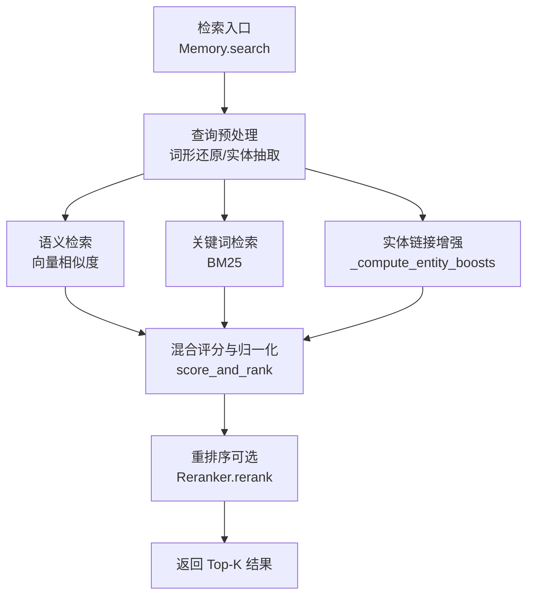
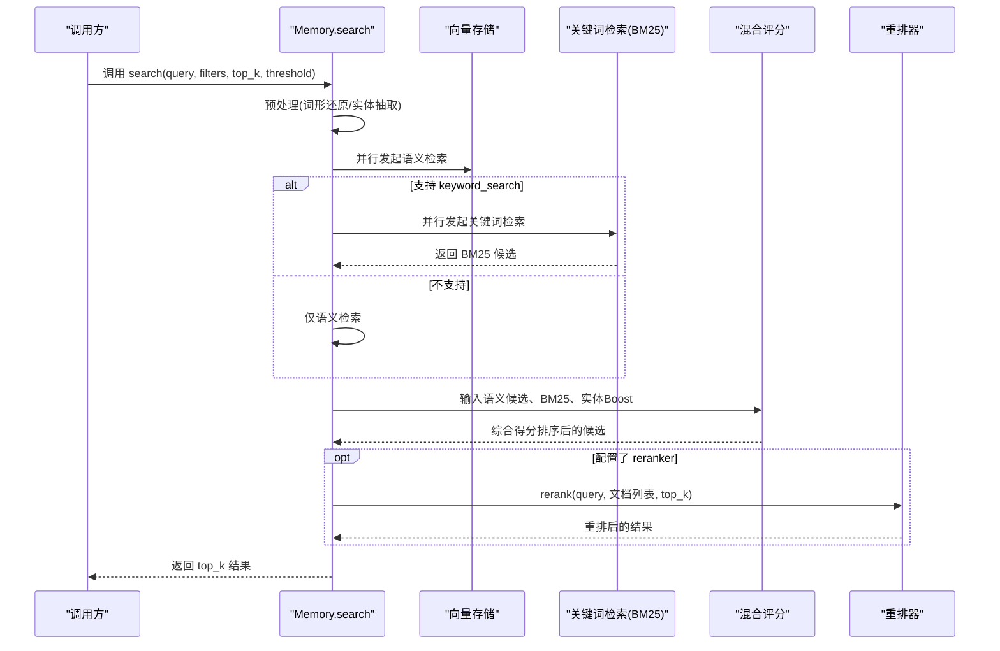
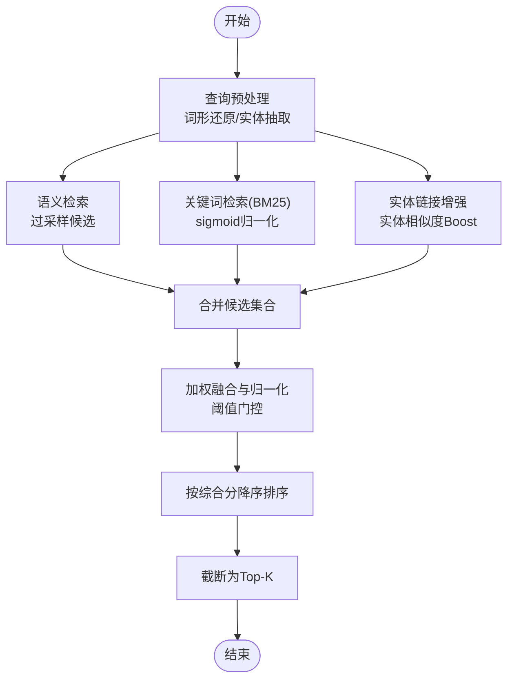
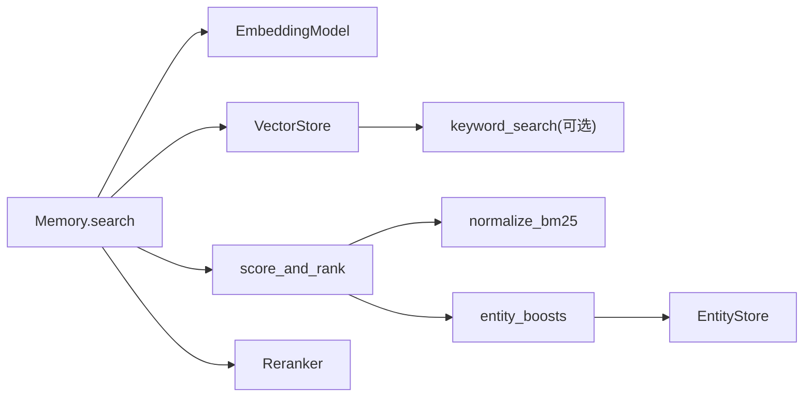

# 记忆搜索与检索

<cite>
**本文引用的文件**
- [mem0/memory/main.py](file://mem0/memory/main.py)
- [mem0/utils/scoring.py](file://mem0/utils/scoring.py)
- [mem0/utils/entity_extraction.py](file://mem0/utils/entity_extraction.py)
- [mem0/reranker/base.py](file://mem0/reranker/base.py)
- [mem0/vector_stores/pinecone.py](file://mem0/vector_stores/pinecone.py)
- [mem0/vector_stores/azure_ai_search.py](file://mem0/vector_stores/azure_ai_search.py)
- [mem0/vector_stores/baidu.py](file://mem0/vector_stores/baidu.py)
- [mem0-ts/src/oss/src/vector_stores/memory.ts](file://mem0-ts/src/oss/src/vector_stores/memory.ts)
- [mem0-ts/src/oss/src/utils/bm25.ts](file://mem0-ts/src/oss/src/utils/bm25.ts)
- [tests/utils/test_scoring.py](file://tests/utils/test_scoring.py)
- [tests/memory/test_performance_slow_query_notice.py](file://tests/memory/test_performance_slow_query_notice.py)
</cite>

## 目录
1. [简介](#简介)
2. [项目结构](#项目结构)
3. [核心组件](#核心组件)
4. [架构总览](#架构总览)
5. [详细组件分析](#详细组件分析)
6. [依赖关系分析](#依赖关系分析)
7. [性能考量](#性能考量)
8. [故障排查指南](#故障排查指南)
9. [结论](#结论)
10. [附录](#附录)

## 简介
本文件面向“记忆搜索与检索”能力，系统化阐述混合检索策略的设计与实现，涵盖语义相似度检索、关键词匹配（BM25）、实体链接增强与重排序等模块的协同工作方式；给出检索算法选择与调优方法、不同检索模式（精确/模糊/条件过滤）的使用指南、性能优化与缓存策略，以及在实际场景中的效果对比与最佳实践。

## 项目结构
围绕检索功能的关键目录与文件：
- Python 后端检索主流程：mem0/memory/main.py
- 混合评分与归一化：mem0/utils/scoring.py
- 实体抽取与链接：mem0/utils/entity_extraction.py
- 重排器抽象接口：mem0/reranker/base.py
- 向量存储与关键词检索支持：mem0/vector_stores/*.py（如 pinecone、azure_ai_search、baidu）
- TS 端内存向量存储与 BM25 实现：mem0-ts/src/oss/src/vector_stores/memory.ts、mem0-ts/src/oss/src/utils/bm25.ts
- 单元测试与性能告警：tests/utils/test_scoring.py、tests/memory/test_performance_slow_query_notice.py

图表来源
- [mem0/memory/main.py:1482-1538](file://mem0/memory/main.py#L1482-L1538)
- [mem0/utils/scoring.py:60-140](file://mem0/utils/scoring.py#L60-L140)
- [mem0/reranker/base.py:1-20](file://mem0/reranker/base.py#L1-L20)

章节来源
- [mem0/memory/main.py:1482-1538](file://mem0/memory/main.py#L1482-L1538)
- [mem0/utils/scoring.py:1-140](file://mem0/utils/scoring.py#L1-L140)
- [mem0/utils/entity_extraction.py:1-358](file://mem0/utils/entity_extraction.py#L1-L358)
- [mem0/reranker/base.py:1-20](file://mem0/reranker/base.py#L1-L20)

## 核心组件
- 检索主流程：统一的同步/异步 search 入口，负责并行执行语义与关键词检索，构建候选池，进行混合评分与重排序。
- 混合评分器：将语义相似度、BM25 关键词匹配、实体链接增强信号加权融合，输出 0~1 的归一化综合得分。
- 实体抽取与链接：从查询与文本中抽取命名实体、引号短语、复合名词等，建立实体到记忆的链接，用于 Boost。
- 向量存储适配层：各向量数据库提供 keyword_search 支持时启用 BM25；否则仅语义检索。
- 重排器：可插拔的 rerank 接口，按需对候选集进行细粒度重排。

章节来源
- [mem0/memory/main.py:1482-1538](file://mem0/memory/main.py#L1482-L1538)
- [mem0/utils/scoring.py:60-140](file://mem0/utils/scoring.py#L60-L140)
- [mem0/utils/entity_extraction.py:123-174](file://mem0/utils/entity_extraction.py#L123-L174)
- [mem0/reranker/base.py:1-20](file://mem0/reranker/base.py#L1-L20)

## 架构总览
下图展示了检索主链路：查询预处理、并行检索、混合评分、可选重排与返回。

图表来源
- [mem0/memory/main.py:1482-1538](file://mem0/memory/main.py#L1482-L1538)
- [mem0/utils/scoring.py:60-140](file://mem0/utils/scoring.py#L60-L140)
- [mem0/reranker/base.py:1-20](file://mem0/reranker/base.py#L1-L20)

## 详细组件分析

### 混合检索策略与评分
- 查询预处理：对查询进行词形还原以适配 BM25；同时抽取查询中的实体，用于后续实体 Boost。
- 语义检索：基于嵌入向量的相似度检索，采用过采样扩大候选池，提升混合评分质量。
- 关键词检索（BM25）：当向量存储支持 keyword_search 时，使用 BM25 计算关键词相关性分数，并通过 sigmoid 归一化至 [0,1]。
- 实体 Boost：基于查询实体在实体存储中的相似度，计算对记忆的 Boost 权重，缓解语义漂移。
- 混合评分：将语义、BM25、实体 Boost 加权求和，并按当前激活信号的最大可能值做归一化，得到最终综合分，再按降序取 Top-K。

图表来源
- [mem0/memory/main.py:1482-1538](file://mem0/memory/main.py#L1482-L1538)
- [mem0/utils/scoring.py:60-140](file://mem0/utils/scoring.py#L60-L140)
- [mem0/utils/entity_extraction.py:123-174](file://mem0/utils/entity_extraction.py#L123-L174)

章节来源
- [mem0/utils/scoring.py:16-140](file://mem0/utils/scoring.py#L16-L140)
- [tests/utils/test_scoring.py:43-161](file://tests/utils/test_scoring.py#L43-L161)

### 检索算法选择与调优
- 向量检索：根据向量存储能力选择合适的距离度量与索引参数；在高维空间中优先考虑内积或余弦相似度的近似最近邻索引。
- BM25 检索：针对不同长度的查询动态设置 sigmoid 归一化参数，避免长查询天然压倒短查询；对候选集进行过采样以提升混合评分的多样性。
- 实体 Boost：实体数量与相似度共同决定 Boost 强度，通过权重与数量修正项平衡强实体与弱实体的影响。
- 重排序：在候选规模较大时引入 rerank，进一步细化相关性排序，但需权衡延迟与成本。

章节来源
- [mem0/utils/scoring.py:16-54](file://mem0/utils/scoring.py#L16-L54)
- [mem0/memory/main.py:1482-1538](file://mem0/memory/main.py#L1482-L1538)
- [mem0/reranker/base.py:1-20](file://mem0/reranker/base.py#L1-L20)

### 检索模式与使用指南
- 精确检索：通过 filters 限定用户/代理/会话范围，结合较高的 threshold 与较小的 top_k，确保结果高度相关。
- 模糊检索：降低 threshold，扩大候选池，结合 BM25 与实体 Boost 提升召回；适合探索性问答或意图识别。
- 条件过滤：利用 filters 进行多维过滤（如时间戳、类别、来源），在语义与关键词信号上叠加过滤条件，提高结果针对性。

章节来源
- [mem0/memory/main.py:272-355](file://mem0/memory/main.py#L272-L355)

### 向量存储与关键词检索支持
- Pinecone：支持向量检索与稀疏向量（BM25）混合检索；可通过配置开启 hybrid 模式。
- Azure AI Search：支持向量与文本混合检索，可按需启用。
- Baidu Mochow：提供 BM25 搜索接口，作为关键词检索后端。
- TS 内存向量存储：内置 BM25 实现，便于本地演示与测试。

章节来源
- [mem0/vector_stores/pinecone.py:212-251](file://mem0/vector_stores/pinecone.py#L212-L251)
- [mem0/vector_stores/azure_ai_search.py:208-241](file://mem0/vector_stores/azure_ai_search.py#L208-L241)
- [mem0/vector_stores/baidu.py:229-271](file://mem0/vector_stores/baidu.py#L229-L271)
- [mem0-ts/src/oss/src/vector_stores/memory.ts:314-361](file://mem0-ts/src/oss/src/vector_stores/memory.ts#L314-L361)
- [mem0-ts/src/oss/src/utils/bm25.ts:1-51](file://mem0-ts/src/oss/src/utils/bm25.ts#L1-L51)

### 重排序机制
- 接口抽象：所有重排器实现需遵循 rerank 接口，输入查询与候选文档列表，输出带 rerank_score 的排序结果。
- 使用建议：在语义与关键词信号基础上，对 Top-K 候选进行二次打分，适合对准确性要求更高的场景。

章节来源
- [mem0/reranker/base.py:1-20](file://mem0/reranker/base.py#L1-L20)

### 实体抽取与链接
- 实体抽取：支持专有名词序列、引号短语、复合名词与名词回退抽取，具备批量处理能力。
- 实体链接：将实体写入独立的实体存储，记录与记忆的关联列表；在检索时按实体相似度进行 Boost。

章节来源
- [mem0/utils/entity_extraction.py:123-358](file://mem0/utils/entity_extraction.py#L123-L358)
- [mem0/memory/main.py:502-622](file://mem0/memory/main.py#L502-L622)

## 依赖关系分析
检索系统主要依赖关系如下：
- Memory.search 依赖嵌入模型、向量存储与可选的重排器。
- 向量存储若支持 keyword_search，则参与 BM25 检索；否则仅语义检索。
- 混合评分器依赖 BM25 归一化与实体 Boost；实体 Boost 依赖实体存储。

图表来源
- [mem0/memory/main.py:407-472](file://mem0/memory/main.py#L407-L472)
- [mem0/utils/scoring.py:60-140](file://mem0/utils/scoring.py#L60-L140)

章节来源
- [mem0/memory/main.py:407-472](file://mem0/memory/main.py#L407-L472)
- [mem0/utils/scoring.py:60-140](file://mem0/utils/scoring.py#L60-L140)

## 性能考量
- 并行检索：当向量存储支持 keyword_search 时，语义与关键词检索并行执行，显著降低端到端延迟。
- 过采样策略：内部 top_k 设为 limit 的若干倍，扩大候选池，提升混合评分的稳定性与准确性。
- 缓存策略：对常用查询的实体向量与 BM25 参数可做本地缓存；对热点实体与高频查询可考虑短期缓存以减少重复计算。
- 重排成本控制：在候选规模较大时谨慎启用 rerank；可先用阈值与过滤缩小候选集，再进行重排。
- 存储层优化：选择支持高效向量检索与关键词检索的存储后端；合理设置索引参数与过滤条件。

章节来源
- [mem0/memory/main.py:1482-1538](file://mem0/memory/main.py#L1482-L1538)
- [tests/memory/test_performance_slow_query_notice.py:186-222](file://tests/memory/test_performance_slow_query_notice.py#L186-L222)

## 故障排查指南
- 关键词检索不可用：若向量存储不支持 keyword_search，系统会提示仅语义检索，混合评分中的 BM25 将被禁用。
- 检索结果为空：检查 filters 是否过于严格；确认阈值是否过高；验证嵌入模型与向量维度是否匹配。
- 性能告警：系统会在慢查询时触发性能提示；可据此调整阈值、limit 或启用缓存。
- 实体 Boost 异常：检查实体存储初始化与写入流程；确认实体文本清洗与去重逻辑未误删有效实体。

章节来源
- [mem0/memory/main.py:463-471](file://mem0/memory/main.py#L463-L471)
- [tests/memory/test_performance_slow_query_notice.py:186-222](file://tests/memory/test_performance_slow_query_notice.py#L186-L222)

## 结论
该检索系统通过“语义 + 关键词 + 实体”的混合策略，在保证相关性的前提下提升了召回与鲁棒性。配合并行检索、过采样与归一化评分，以及可插拔的重排器，能够在不同业务场景中灵活调优。建议在生产环境中结合数据特征与性能目标，选择合适的向量存储与 BM25 参数，并通过缓存与阈值策略持续优化端到端体验。

## 附录
- 检测与评估：可参考单元测试对混合评分与归一化行为的覆盖，辅助定位评分异常。
- 最佳实践清单
  - 明确检索目标：精确场景提高 threshold 与限制 top_k；模糊场景降低 threshold 并启用实体 Boost。
  - 合理使用 filters：尽量在查询阶段就缩小范围，减少向量检索压力。
  - 选择合适存储：优先支持 keyword_search 的存储以启用 BM25；必要时启用 rerank。
  - 监控与调参：关注慢查询告警，定期校准阈值与权重，观察实体 Boost 对结果分布的影响。

章节来源
- [tests/utils/test_scoring.py:43-161](file://tests/utils/test_scoring.py#L43-L161)