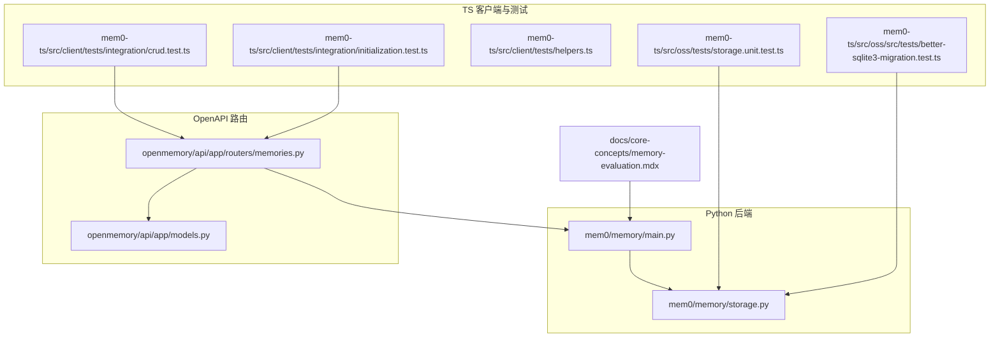
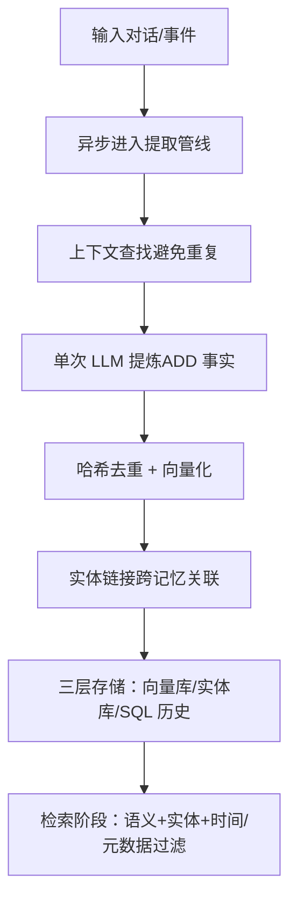
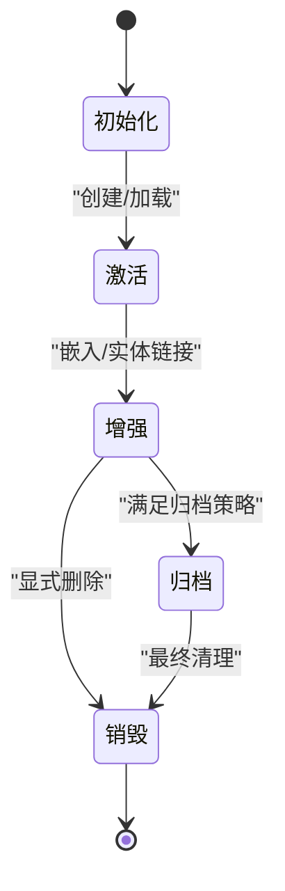
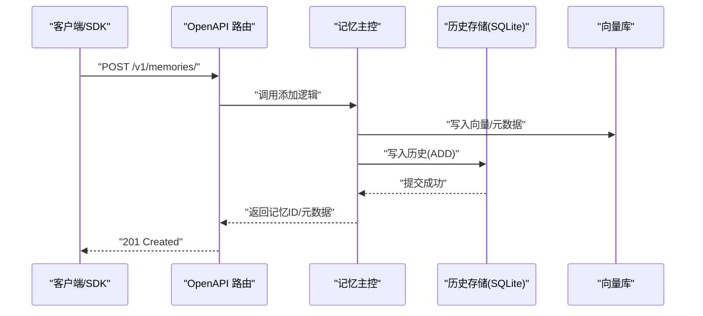
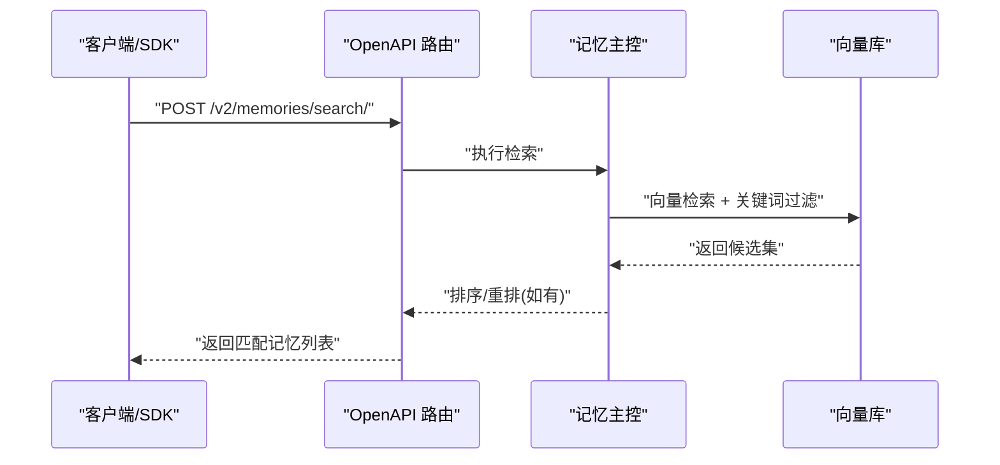
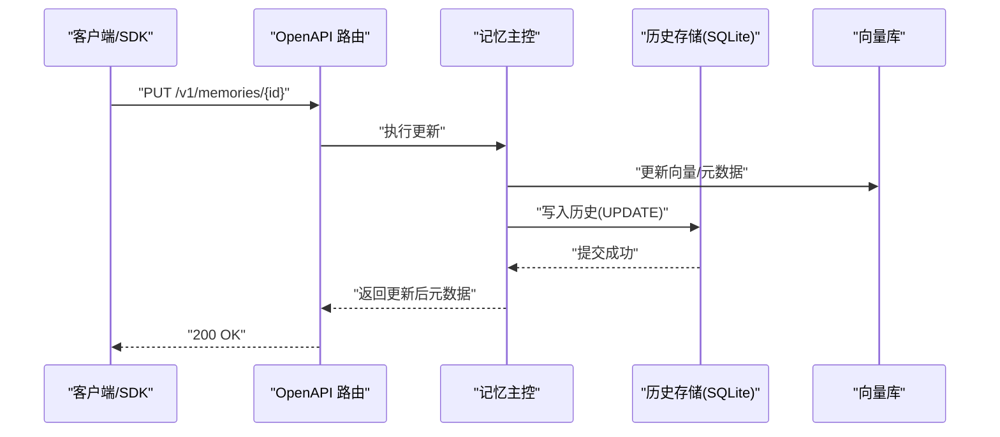
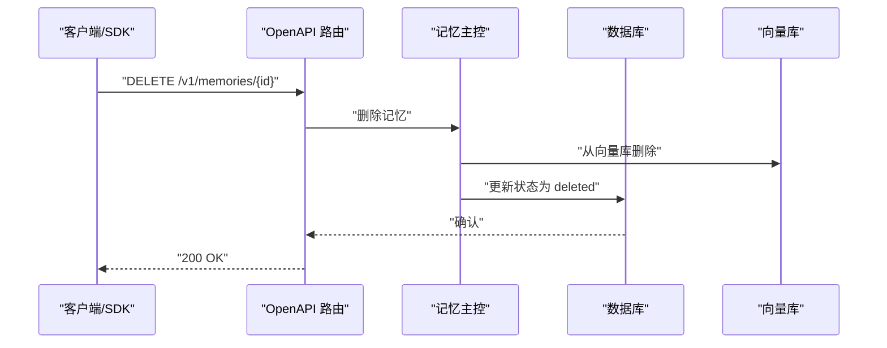
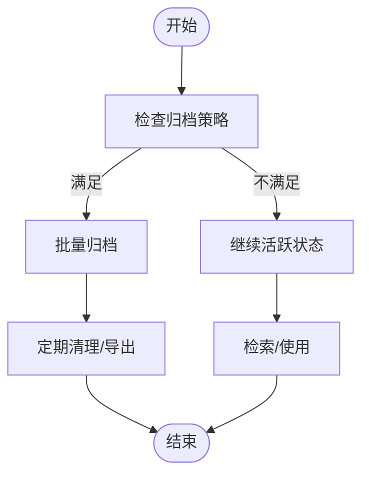
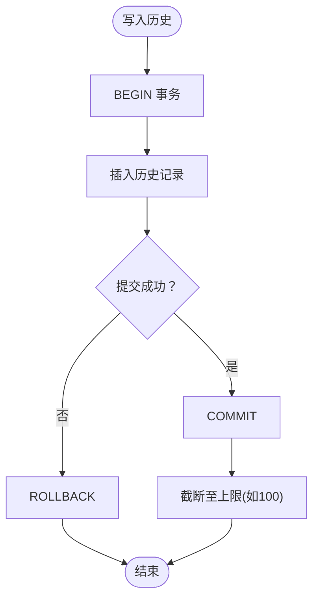
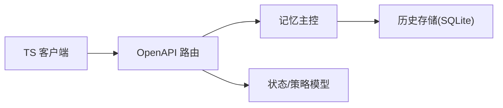

# 记忆操作与生命周期

<cite>
**本文引用的文件**
- [mem0/memory/main.py](file://mem0/memory/main.py)
- [mem0/memory/storage.py](file://mem0/memory/storage.py)
- [openmemory/api/app/routers/memories.py](file://openmemory/api/app/routers/memories.py)
- [openmemory/api/app/models.py](file://openmemory/api/app/models.py)
- [mem0-ts/src/oss/tests/storage.unit.test.ts](file://mem0-ts/src/oss/tests/storage.unit.test.ts)
- [tests/memory/test_storage.py](file://tests/memory/test_storage.py)
- [docs/core-concepts/memory-evaluation.mdx](file://docs/core-concepts/memory-evaluation.mdx)
- [cli/CLI_SPECIFICATION.md](file://cli/CLI_SPECIFICATION.md)
- [mem0-ts/src/client/tests/integration/crud.test.ts](file://mem0-ts/src/client/tests/integration/crud.test.ts)
- [mem0-ts/src/client/tests/integration/initialization.test.ts](file://mem0-ts/src/client/tests/integration/initialization.test.ts)
- [mem0-ts/src/client/tests/helpers.ts](file://mem0-ts/src/client/tests/helpers.ts)
- [mem0-ts/src/oss/src/tests/better-sqlite3-migration.test.ts](file://mem0-ts/src/oss/src/tests/better-sqlite3-migration.test.ts)
</cite>

## 目录
1. [简介](#简介)
2. [项目结构](#项目结构)
3. [核心组件](#核心组件)
4. [架构总览](#架构总览)
5. [详细组件分析](#详细组件分析)
6. [依赖关系分析](#依赖关系分析)
7. [性能考量](#性能考量)
8. [故障排查指南](#故障排查指南)
9. [结论](#结论)
10. [附录](#附录)

## 简介
本文件系统性阐述 Mem0 的“记忆”（Memory）在平台与开源版本中的操作与生命周期管理，覆盖创建、添加、搜索、更新、删除等核心操作；解释记忆从初始化到激活、增强、归档与销毁的完整生命周期；并总结批量操作、事务处理与并发控制等高级特性。文档同时提供操作流程图与最佳实践建议，帮助开发者快速上手并稳定落地。

## 项目结构
围绕记忆的核心实现主要分布在以下模块：
- Python 后端与存储：负责记忆的持久化、历史审计、状态变更与向量检索。
- OpenAPI 路由：提供记忆的增删改查与批量归档等 HTTP 接口。
- TypeScript 客户端与测试：验证 SDK 生命周期与错误处理。
- 文档与规范：定义记忆评估与提取流程、CLI 规范与 API 参考。

**图表来源**
- [mem0/memory/main.py](file://mem0/memory/main.py)
- [mem0/memory/storage.py](file://mem0/memory/storage.py)
- [openmemory/api/app/routers/memories.py](file://openmemory/api/app/routers/memories.py)
- [openmemory/api/app/models.py](file://openmemory/api/app/models.py)
- [mem0-ts/src/client/tests/integration/crud.test.ts](file://mem0-ts/src/client/tests/integration/crud.test.ts)
- [mem0-ts/src/client/tests/integration/initialization.test.ts](file://mem0-ts/src/client/tests/integration/initialization.test.ts)
- [mem0-ts/src/client/tests/helpers.ts](file://mem0-ts/src/client/tests/helpers.ts)
- [mem0-ts/src/oss/tests/storage.unit.test.ts](file://mem0-ts/src/oss/tests/storage.unit.test.ts)
- [mem0-ts/src/oss/src/tests/better-sqlite3-migration.test.ts](file://mem0-ts/src/oss/src/tests/better-sqlite3-migration.test.ts)
- [docs/core-concepts/memory-evaluation.mdx](file://docs/core-concepts/memory-evaluation.mdx)

**章节来源**
- [mem0/memory/main.py](file://mem0/memory/main.py)
- [mem0/memory/storage.py](file://mem0/memory/storage.py)
- [openmemory/api/app/routers/memories.py](file://openmemory/api/app/routers/memories.py)
- [openmemory/api/app/models.py](file://openmemory/api/app/models.py)
- [mem0-ts/src/oss/tests/storage.unit.test.ts](file://mem0-ts/src/oss/tests/storage.unit.test.ts)
- [tests/memory/test_storage.py](file://tests/memory/test_storage.py)
- [docs/core-concepts/memory-evaluation.mdx](file://docs/core-concepts/memory-evaluation.mdx)
- [cli/CLI_SPECIFICATION.md](file://cli/CLI_SPECIFICATION.md)
- [mem0-ts/src/client/tests/integration/crud.test.ts](file://mem0-ts/src/client/tests/integration/crud.test.ts)
- [mem0-ts/src/client/tests/integration/initialization.test.ts](file://mem0-ts/src/client/tests/integration/initialization.test.ts)
- [mem0-ts/src/client/tests/helpers.ts](file://mem0-ts/src/client/tests/helpers.ts)
- [mem0-ts/src/oss/src/tests/better-sqlite3-migration.test.ts](file://mem0-ts/src/oss/src/tests/better-sqlite3-migration.test.ts)

## 核心组件
- 记忆主控（Python）：封装记忆的检索、写入、去重、嵌入与实体链接等流程，协调向量库与 SQL 历史表。
- 存储层（Python）：提供 SQLite 历史表的事务化读写、迁移与容量限制（如历史记录上限）。
- OpenAPI 路由：暴露记忆的增删改查、批量删除、批量归档等接口，统一状态变更与错误处理。
- 模型与状态：定义记忆状态枚举、归档策略与状态变更历史表，支持审计追踪。
- TypeScript 客户端与测试：验证 SDK 初始化、CRUD 生命周期、异常类型与请求构造。

**章节来源**
- [mem0/memory/main.py](file://mem0/memory/main.py)
- [mem0/memory/storage.py](file://mem0/memory/storage.py)
- [openmemory/api/app/routers/memories.py](file://openmemory/api/app/routers/memories.py)
- [openmemory/api/app/models.py](file://openmemory/api/app/models.py)
- [mem0-ts/src/client/tests/integration/crud.test.ts](file://mem0-ts/src/client/tests/integration/crud.test.ts)
- [mem0-ts/src/client/tests/integration/initialization.test.ts](file://mem0-ts/src/client/tests/integration/initialization.test.ts)

## 架构总览
Mem0 的记忆系统分为“提取（写入）”与“检索（读取）”两阶段，并通过实体链接层连接二者。提取阶段包含存储新记忆、上下文查找、提炼记忆、去重与嵌入、实体链接等步骤；检索阶段则基于向量数据库、实体存储与 SQL 数据库进行混合检索与排序。

**图表来源**
- [docs/core-concepts/memory-evaluation.mdx](file://docs/core-concepts/memory-evaluation.mdx)

**章节来源**
- [docs/core-concepts/memory-evaluation.mdx](file://docs/core-concepts/memory-evaluation.mdx)

## 详细组件分析

### 记忆生命周期与状态机
- 状态枚举与历史：模型中定义了记忆状态与状态变更历史表，支持按记忆 ID 与状态索引查询，便于审计与统计。
- 归档策略：提供归档策略表，按条件（如天数）自动归档旧记忆。
- 删除与归档：路由提供删除与归档接口，删除时先从向量库删除再标记数据库为 deleted/archived。

**图表来源**
- [openmemory/api/app/models.py](file://openmemory/api/app/models.py)
- [openmemory/api/app/routers/memories.py](file://openmemory/api/app/routers/memories.py)

**章节来源**
- [openmemory/api/app/models.py](file://openmemory/api/app/models.py)
- [openmemory/api/app/routers/memories.py](file://openmemory/api/app/routers/memories.py)

### 创建与添加（Add）
- Python 主控：负责将新记忆写入向量库与历史表，执行去重与嵌入；历史表记录事件、旧值、新值与时间戳。
- 存储层：提供事务化写入与表迁移能力，确保一致性与可恢复性。
- OpenAPI：提供添加接口，参数包含用户/实体标识、内容与元数据。
- TS 客户端：集成 SDK，发起添加请求并处理响应。

**图表来源**
- [cli/CLI_SPECIFICATION.md](file://cli/CLI_SPECIFICATION.md)
- [mem0/memory/main.py](file://mem0/memory/main.py)
- [mem0/memory/storage.py](file://mem0/memory/storage.py)
- [openmemory/api/app/routers/memories.py](file://openmemory/api/app/routers/memories.py)

**章节来源**
- [cli/CLI_SPECIFICATION.md](file://cli/CLI_SPECIFICATION.md)
- [mem0/memory/main.py](file://mem0/memory/main.py)
- [mem0/memory/storage.py](file://mem0/memory/storage.py)
- [openmemory/api/app/routers/memories.py](file://openmemory/api/app/routers/memories.py)
- [mem0-ts/src/client/tests/integration/crud.test.ts](file://mem0-ts/src/client/tests/integration/crud.test.ts)

### 搜索（Search）
- Python 主控：根据查询向量与关键词检索，结合向量相似度与元数据过滤，返回带分数的结果集。
- OpenAPI：提供搜索接口，支持分页与过滤参数。
- TS 客户端：封装搜索请求，解析结果并处理异常。

**图表来源**
- [cli/CLI_SPECIFICATION.md](file://cli/CLI_SPECIFICATION.md)
- [mem0/memory/main.py](file://mem0/memory/main.py)
- [openmemory/api/app/routers/memories.py](file://openmemory/api/app/routers/memories.py)

**章节来源**
- [cli/CLI_SPECIFICATION.md](file://cli/CLI_SPECIFICATION.md)
- [mem0/memory/main.py](file://mem0/memory/main.py)
- [openmemory/api/app/routers/memories.py](file://openmemory/api/app/routers/memories.py)
- [mem0-ts/src/client/tests/integration/crud.test.ts](file://mem0-ts/src/client/tests/integration/crud.test.ts)

### 更新（Update）
- Python 主控：对现有记忆执行 UPDATE 事件，写入历史表并更新向量库。
- OpenAPI：提供按 ID 更新接口，支持增量字段更新。
- TS 客户端：封装更新请求，校验响应结构。

**图表来源**
- [cli/CLI_SPECIFICATION.md](file://cli/CLI_SPECIFICATION.md)
- [mem0/memory/main.py](file://mem0/memory/main.py)
- [mem0/memory/storage.py](file://mem0/memory/storage.py)
- [openmemory/api/app/routers/memories.py](file://openmemory/api/app/routers/memories.py)

**章节来源**
- [cli/CLI_SPECIFICATION.md](file://cli/CLI_SPECIFICATION.md)
- [mem0/memory/main.py](file://mem0/memory/main.py)
- [mem0/memory/storage.py](file://mem0/memory/storage.py)
- [openmemory/api/app/routers/memories.py](file://openmemory/api/app/routers/memories.py)
- [mem0-ts/src/client/tests/integration/crud.test.ts](file://mem0-ts/src/client/tests/integration/crud.test.ts)

### 删除（Delete）
- OpenAPI：提供按 ID 删除与批量删除接口；删除时先从向量库删除，再在数据库中标记状态。
- 平台侧：支持“归档”动作，将记忆置为归档状态，便于后续清理或导出。

**图表来源**
- [cli/CLI_SPECIFICATION.md](file://cli/CLI_SPECIFICATION.md)
- [openmemory/api/app/routers/memories.py](file://openmemory/api/app/routers/memories.py)
- [openmemory/api/app/models.py](file://openmemory/api/app/models.py)

**章节来源**
- [cli/CLI_SPECIFICATION.md](file://cli/CLI_SPECIFICATION.md)
- [openmemory/api/app/routers/memories.py](file://openmemory/api/app/routers/memories.py)
- [openmemory/api/app/models.py](file://openmemory/api/app/models.py)

### 批量操作与归档
- 批量删除：路由接收多个记忆 ID，逐个删除并向量库与数据库同步状态。
- 批量归档：将多个记忆置为归档状态，便于后续统一处理。
- 归档策略：按策略配置的天数阈值自动归档，减少活跃检索压力。

**图表来源**
- [openmemory/api/app/routers/memories.py](file://openmemory/api/app/routers/memories.py)
- [openmemory/api/app/models.py](file://openmemory/api/app/models.py)

**章节来源**
- [openmemory/api/app/routers/memories.py](file://openmemory/api/app/routers/memories.py)
- [openmemory/api/app/models.py](file://openmemory/api/app/models.py)

### 历史与审计（History）
- 历史表结构：记录 memory_id、旧值、新值、事件类型（ADD/UPDATE/DELETE）、时间戳、操作者等。
- 事务与锁：创建表与写入均在事务内执行，失败回滚，使用锁保证并发安全。
- 上限与隔离：历史记录按记忆 ID 隔离，且默认限制数量（例如 100 条），防止无限增长。

**图表来源**
- [mem0/memory/storage.py](file://mem0/memory/storage.py)
- [mem0-ts/src/oss/tests/storage.unit.test.ts](file://mem0-ts/src/oss/tests/storage.unit.test.ts)
- [tests/memory/test_storage.py](file://tests/memory/test_storage.py)
- [mem0-ts/src/oss/src/tests/better-sqlite3-migration.test.ts](file://mem0-ts/src/oss/src/tests/better-sqlite3-migration.test.ts)

**章节来源**
- [mem0/memory/storage.py](file://mem0/memory/storage.py)
- [mem0-ts/src/oss/tests/storage.unit.test.ts](file://mem0-ts/src/oss/tests/storage.unit.test.ts)
- [tests/memory/test_storage.py](file://tests/memory/test_storage.py)
- [mem0-ts/src/oss/src/tests/better-sqlite3-migration.test.ts](file://mem0-ts/src/oss/src/tests/better-sqlite3-migration.test.ts)

### 并发控制与事务处理
- Python 存储层：使用锁与事务包裹建表与写入，确保多线程或多进程下的原子性。
- TS 测试：验证历史管理器在并发场景下的隔离性与上限行为。
- OpenAPI 路由：对批量操作逐一处理，保证每个记忆的状态变更一致。

**章节来源**
- [mem0/memory/storage.py](file://mem0/memory/storage.py)
- [mem0-ts/src/oss/tests/storage.unit.test.ts](file://mem0-ts/src/oss/tests/storage.unit.test.ts)
- [openmemory/api/app/routers/memories.py](file://openmemory/api/app/routers/memories.py)

### SDK 使用与最佳实践
- 初始化与认证：SDK 在 ping 失败时抛出异常，需正确配置密钥。
- CRUD 全链路：集成测试覆盖添加→获取→列出→更新→删除的完整生命周期。
- 请求构造：测试工具提供模式匹配的 mock fetch，便于验证路由与参数。

**章节来源**
- [mem0-ts/src/client/tests/integration/initialization.test.ts](file://mem0-ts/src/client/tests/integration/initialization.test.ts)
- [mem0-ts/src/client/tests/integration/crud.test.ts](file://mem0-ts/src/client/tests/integration/crud.test.ts)
- [mem0-ts/src/client/tests/helpers.ts](file://mem0-ts/src/client/tests/helpers.ts)

## 依赖关系分析
- 路由依赖主控：所有记忆操作最终委托给记忆主控完成向量与历史处理。
- 主控依赖存储：历史表与向量库的读写由存储层抽象提供。
- 模型支撑状态：状态枚举与历史表为审计与策略提供数据基础。
- 客户端依赖路由：SDK 封装 HTTP 请求，遵循 CLI 规范与 API 参考。

**图表来源**
- [openmemory/api/app/routers/memories.py](file://openmemory/api/app/routers/memories.py)
- [mem0/memory/main.py](file://mem0/memory/main.py)
- [mem0/memory/storage.py](file://mem0/memory/storage.py)
- [openmemory/api/app/models.py](file://openmemory/api/app/models.py)
- [mem0-ts/src/client/tests/integration/crud.test.ts](file://mem0-ts/src/client/tests/integration/crud.test.ts)

**章节来源**
- [openmemory/api/app/routers/memories.py](file://openmemory/api/app/routers/memories.py)
- [mem0/memory/main.py](file://mem0/memory/main.py)
- [mem0/memory/storage.py](file://mem0/memory/storage.py)
- [openmemory/api/app/models.py](file://openmemory/api/app/models.py)
- [mem0-ts/src/client/tests/integration/crud.test.ts](file://mem0-ts/src/client/tests/integration/crud.test.ts)

## 性能考量
- 向量检索与关键词检索结合：在大规模记忆库中提升召回与速度。
- 去重与嵌入：通过哈希与向量化减少冗余，降低存储与检索成本。
- 历史表上限：限制历史条目数量，避免膨胀影响写入性能。
- 批量操作：合并多次请求，减少网络往返与事务开销。
- 归档策略：将冷数据移出活跃检索范围，优化整体延迟。

[本节为通用指导，无需特定文件引用]

## 故障排查指南
- SDK 初始化失败：检查密钥有效性，确保 ping 能正常返回。
- 写入异常：查看历史表事务是否回滚，确认锁与并发设置。
- 检索无结果：核对向量维度与嵌入模型一致性，检查关键词过滤参数。
- 批量删除未生效：确认向量库与数据库状态同步，关注异常日志。

**章节来源**
- [mem0-ts/src/client/tests/integration/initialization.test.ts](file://mem0-ts/src/client/tests/integration/initialization.test.ts)
- [mem0/memory/storage.py](file://mem0/memory/storage.py)
- [openmemory/api/app/routers/memories.py](file://openmemory/api/app/routers/memories.py)

## 结论
Mem0 的记忆系统以“提取—检索”双阶段为核心，配合三层存储与状态机管理，实现了从创建、增强到归档与销毁的全生命周期闭环。通过事务化存储、历史审计与批量/并发控制，系统在可用性与性能之间取得平衡。开发者可依据本文档的最佳实践，结合 SDK 与 OpenAPI 快速构建稳定的记忆应用。

## 附录
- CLI 规范与 API 参考：涵盖记忆增删改查、批量操作与状态变更的端点定义。
- 单测与集成测试：验证历史上限、隔离性、SDK 生命周期与异常类型。

**章节来源**
- [cli/CLI_SPECIFICATION.md](file://cli/CLI_SPECIFICATION.md)
- [mem0-ts/src/client/tests/integration/crud.test.ts](file://mem0-ts/src/client/tests/integration/crud.test.ts)
- [mem0-ts/src/client/tests/integration/initialization.test.ts](file://mem0-ts/src/client/tests/integration/initialization.test.ts)
- [mem0-ts/src/oss/tests/storage.unit.test.ts](file://mem0-ts/src/oss/tests/storage.unit.test.ts)
- [tests/memory/test_storage.py](file://tests/memory/test_storage.py)