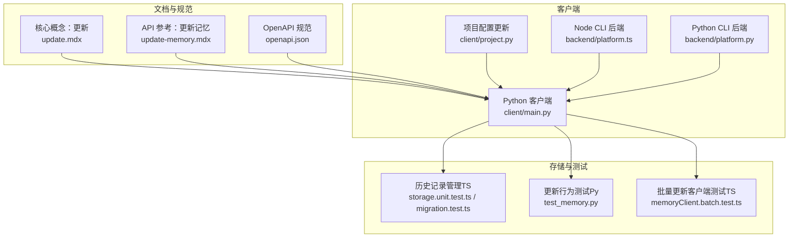
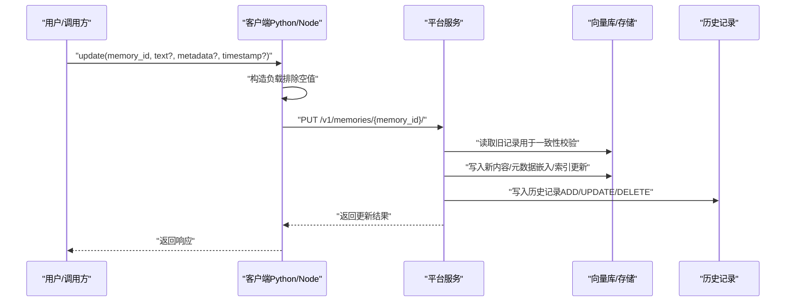
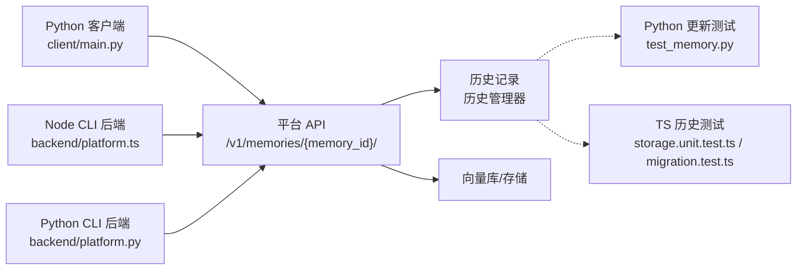

# 记忆更新与修改

<cite>
**本文引用的文件**
- [update.mdx](file://docs/core-concepts/memory-operations/update.mdx)
- [update-memory.mdx](file://docs/api-reference/memory/update-memory.mdx)
- [openapi.json](file://docs/openapi.json)
- [main.py（Python 客户端）](file://mem0/client/main.py)
- [project.py（Python 客户端项目配置）](file://mem0/client/project.py)
- [platform.ts（Node CLI 后端）](file://cli/node/src/backend/platform.ts)
- [base.ts（Node CLI 后端基类）](file://cli/node/src/backend/base.ts)
- [platform.py（Python CLI 后端）](file://cli/python/src/mem0_cli/backend/platform.py)
- [base.py（Python CLI 后端基类）](file://cli/python/src/mem0_cli/backend/base.py)
- [storage.unit.test.ts（TS 存储单元测试）](file://mem0-ts/src/oss/tests/storage.unit.test.ts)
- [better-sqlite3-migration.test.ts（TS 历史迁移测试）](file://mem0-ts/src/oss/tests/better-sqlite3-migration.test.ts)
- [test_memory.py（Python 更新行为测试）](file://tests/test_memory.py)
- [memoryClient.batch.test.ts（TS 批量更新客户端测试）](file://mem0-ts/src/client/tests/memoryClient.batch.test.ts)
</cite>

## 目录
1. [简介](#简介)
2. [项目结构](#项目结构)
3. [核心组件](#核心组件)
4. [架构总览](#架构总览)
5. [详细组件分析](#详细组件分析)
6. [依赖关系分析](#依赖关系分析)
7. [性能考量](#性能考量)
8. [故障排查指南](#故障排查指南)
9. [结论](#结论)
10. [附录](#附录)

## 简介
本文件系统化阐述“记忆更新与修改”的实现机制与使用方法，覆盖以下关键主题：
- 更新模式：完全替换、部分更新、增量更新（按字段选择性更新）
- 原子性与并发控制：请求级原子性、历史记录可追溯、冲突检测与回滚思路
- 元数据更新、内容更新、标签修改：字段语义、约束与最佳实践
- 高级能力：批量更新、条件更新（基于时间戳或版本）、幂等更新
- 数据一致性与版本管理：历史记录、版本号、回滚策略
- 实际场景策略与最佳实践：错误处理、重试、幂等键设计

## 项目结构
围绕“更新”这一核心操作，相关实现分布在以下层次：
- 文档层：概念说明、API 参考、OpenAPI 规范
- 客户端层：Python/Node 两端的同步与异步更新接口
- CLI 层：平台后端封装，统一走平台 API
- 存储层：历史记录管理（历史表/历史管理器），用于一致性校验与回滚

图表来源
- [update.mdx:1-28](file://docs/core-concepts/memory-operations/update.mdx#L1-L28)
- [update-memory.mdx:1-5](file://docs/api-reference/memory/update-memory.mdx#L1-L5)
- [openapi.json:2404-2458](file://docs/openapi.json#L2404-L2458)
- [main.py（Python 客户端）:336-370](file://mem0/client/main.py#L336-L370)
- [project.py（Python 客户端项目配置）:395-464](file://mem0/client/project.py#L395-L464)
- [platform.ts（Node CLI 后端）:271-283](file://cli/node/src/backend/platform.ts#L271-L283)
- [platform.py（Python CLI 后端）:244-253](file://cli/python/src/mem0_cli/backend/platform.py#L244-L253)
- [storage.unit.test.ts（TS 存储单元测试）:1-79](file://mem0-ts/src/oss/tests/storage.unit.test.ts#L1-L79)
- [better-sqlite3-migration.test.ts（TS 历史迁移测试）:45-84](file://mem0-ts/src/oss/tests/better-sqlite3-migration.test.ts#L45-L84)
- [test_memory.py（Python 更新行为测试）:460-484](file://tests/test_memory.py#L460-L484)

章节来源
- [update.mdx:1-28](file://docs/core-concepts/memory-operations/update.mdx#L1-L28)
- [update-memory.mdx:1-5](file://docs/api-reference/memory/update-memory.mdx#L1-L5)
- [openapi.json:2404-2458](file://docs/openapi.json#L2404-L2458)

## 核心组件
- 更新入口（Python 客户端）
  - 同步更新：支持以关键字参数或结构化选项传入 text、metadata、timestamp，最终构造 JSON 负载并调用 PUT 接口
  - 异步更新：与同步逻辑一致，仅在底层发起异步请求
  - 批量更新：将多个记忆项打包为数组，通过 /v1/batch/ 接口进行批量写入
- 更新入口（CLI 后端）
  - Node/Python CLI 将 content/metadata 映射为 text/metadata，并附加 source 字段，统一走 /v1/memories/{memory_id}/
- 平台 API
  - OpenAPI 定义了更新请求体字段（text、metadata）与响应字段（id、text、user_id 等）

章节来源
- [main.py（Python 客户端）:336-370](file://mem0/client/main.py#L336-L370)
- [main.py（Python 客户端）:1252-1286](file://mem0/client/main.py#L1252-L1286)
- [main.py（Python 客户端）:1468-1492](file://mem0/client/main.py#L1468-L1492)
- [platform.ts（Node CLI 后端）:271-283](file://cli/node/src/backend/platform.ts#L271-L283)
- [platform.py（Python CLI 后端）:244-253](file://cli/python/src/mem0_cli/backend/platform.py#L244-L253)
- [openapi.json:2422-2458](file://docs/openapi.json#L2422-L2458)

## 架构总览
从“输入到持久化”的更新流程如下：

图表来源
- [main.py（Python 客户端）:336-370](file://mem0/client/main.py#L336-L370)
- [openapi.json:2422-2458](file://docs/openapi.json#L2422-L2458)
- [storage.unit.test.ts（TS 存储单元测试）:27-40](file://mem0-ts/src/oss/tests/storage.unit.test.ts#L27-L40)
- [better-sqlite3-migration.test.ts（TS 历史迁移测试）:45-84](file://mem0-ts/src/oss/tests/better-sqlite3-migration.test.ts#L45-L84)

## 详细组件分析

### 更新模式与字段语义
- 完全替换
  - 通过传入新的 text 和/或 metadata 进行整体替换；未提供的字段保持不变（由服务端逻辑决定）
- 部分更新
  - 仅提供需要变更的字段（如仅 text 或仅 metadata），其余字段不改动
- 增量更新
  - 对 metadata 进行键级增量（新增/覆盖/删除指定键），具体行为取决于服务端对 payload 的合并策略
- 时间戳与幂等
  - 支持显式 timestamp 覆盖；结合幂等键（如外部业务 ID）可实现重复提交的安全更新

章节来源
- [update.mdx:19-27](file://docs/core-concepts/memory-operations/update.mdx#L19-L27)
- [openapi.json:2422-2458](file://docs/openapi.json#L2422-L2458)

### 原子性与并发控制
- 请求级原子性
  - 单条更新为单次 HTTP 请求，具备请求级原子性；批量更新为多条请求组合，需结合幂等键与重试策略
- 并发控制
  - 建议使用幂等键与条件更新（基于时间戳/版本）避免竞态
- 冲突解决
  - 基于历史记录（历史表/历史管理器）进行冲突检测与回滚：若发现新旧值不一致，可回退至最近一致状态或提示人工介入

章节来源
- [storage.unit.test.ts（TS 存储单元测试）:42-79](file://mem0-ts/src/oss/tests/storage.unit.test.ts#L42-L79)
- [better-sqlite3-migration.test.ts（TS 历史迁移测试）:45-84](file://mem0-ts/src/oss/tests/better-sqlite3-migration.test.ts#L45-L84)

### 元数据更新、内容更新、标签修改
- 内容更新（text/data）
  - 替换记忆的内容文本；通常触发嵌入重新计算与向量索引更新
- 元数据更新（metadata）
  - 支持键值对更新；可用于过滤、分类、排序与检索增强
- 标签修改
  - 若标签以元数据形式表示（如 category、labels 键），可通过 metadata 更新实现
- 不可变标记
  - 文档中提及“不可变”记忆需删除后重建，避免直接更新

章节来源
- [update.mdx:20-27](file://docs/core-concepts/memory-operations/update.mdx#L20-L27)
- [openapi.json:2422-2458](file://docs/openapi.json#L2422-L2458)

### 批量更新与条件更新
- 批量更新
  - Python 客户端提供批量更新方法，将多个记忆项打包发送至 /v1/batch/；测试验证了内存映射与负载转换
- 条件更新
  - 建议结合 timestamp 或版本字段进行条件更新；若服务端支持 ETag/If-Match，可进一步提升一致性保障

章节来源
- [main.py（Python 客户端）:1468-1492](file://mem0/client/main.py#L1468-L1492)
- [memoryClient.batch.test.ts（TS 批量更新客户端测试）:18-39](file://mem0-ts/src/client/tests/memoryClient.batch.test.ts#L18-L39)

### 历史记录与一致性校验
- 历史记录
  - 历史管理器记录 ADD/UPDATE/DELETE 操作，包含 memory_id、previous_value、new_value、action、is_deleted 等字段
  - 历史按时间倒序排列，便于审计与回溯
- 一致性校验
  - 更新前读取旧值，更新后对比历史记录，确保未被其他并发写入覆盖
- 回滚机制
  - 基于历史记录回放至上一个稳定状态；若检测到异常，可触发自动回滚或人工确认

章节来源
- [storage.unit.test.ts（TS 存储单元测试）:27-79](file://mem0-ts/src/oss/tests/storage.unit.test.ts#L27-L79)
- [better-sqlite3-migration.test.ts（TS 历史迁移测试）:45-84](file://mem0-ts/src/oss/tests/better-sqlite3-migration.test.ts#L45-L84)

### 版本管理与回滚策略
- 版本号
  - 建议在 metadata 中维护自定义版本号，配合历史记录实现细粒度回滚
- 回滚策略
  - 自动回滚：检测到冲突或异常时，自动恢复到上一历史节点
  - 人工回滚：提供回滚清单与预演，经确认后再执行

章节来源
- [storage.unit.test.ts（TS 存储单元测试）:170-194](file://mem0-ts/src/oss/tests/storage.unit.test.ts#L170-L194)
- [better-sqlite3-migration.test.ts（TS 历史迁移测试）:54-80](file://mem0-ts/src/oss/tests/better-sqlite3-migration.test.ts#L54-L80)

### 实际使用场景与最佳实践
- 场景一：用户更正偏好
  - 使用部分更新仅修改 metadata 中的偏好键，避免重算嵌入
- 场景二：知识纠错
  - 使用完全替换更新 text，并保留 user_id/actor_id 等关键元数据
- 场景三：批量导入
  - 使用批量更新一次性写入大量记忆，结合幂等键避免重复
- 最佳实践
  - 幂等键设计：为每条更新提供唯一标识，防止重复提交
  - 重试策略：指数退避 + 去抖，避免雪崩
  - 错误处理：区分“不存在”“权限不足”“配额超限”，分别采取不同处理策略
  - 审计日志：启用历史记录，定期归档与巡检

章节来源
- [test_memory.py（Python 更新行为测试）:1190-1222](file://tests/test_memory.py#L1190-L1222)
- [update.mdx:10-17](file://docs/core-concepts/memory-operations/update.mdx#L10-L17)

## 依赖关系分析
- 客户端到服务端
  - Python/Node 客户端均通过 PUT /v1/memories/{memory_id}/ 发起更新；CLI 后端统一走该接口
- 服务端到存储
  - 服务端读取旧记录进行一致性校验，随后更新向量库与历史记录
- 测试与验证
  - TS 侧测试覆盖历史记录的增删改查与排序；Python 侧测试覆盖不存在记忆的错误处理与元数据保留

图表来源
- [main.py（Python 客户端）:336-370](file://mem0/client/main.py#L336-L370)
- [platform.ts（Node CLI 后端）:271-283](file://cli/node/src/backend/platform.ts#L271-L283)
- [platform.py（Python CLI 后端）:244-253](file://cli/python/src/mem0_cli/backend/platform.py#L244-L253)
- [storage.unit.test.ts（TS 存储单元测试）:27-79](file://mem0-ts/src/oss/tests/storage.unit.test.ts#L27-L79)
- [better-sqlite3-migration.test.ts（TS 历史迁移测试）:45-84](file://mem0-ts/src/oss/tests/better-sqlite3-migration.test.ts#L45-L84)
- [test_memory.py（Python 更新行为测试）:460-484](file://tests/test_memory.py#L460-L484)

章节来源
- [main.py（Python 客户端）:336-370](file://mem0/client/main.py#L336-L370)
- [platform.ts（Node CLI 后端）:271-283](file://cli/node/src/backend/platform.ts#L271-L283)
- [platform.py（Python CLI 后端）:244-253](file://cli/python/src/mem0_cli/backend/platform.py#L244-L253)
- [storage.unit.test.ts（TS 存储单元测试）:27-79](file://mem0-ts/src/oss/tests/storage.unit.test.ts#L27-L79)
- [better-sqlite3-migration.test.ts（TS 历史迁移测试）:45-84](file://mem0-ts/src/oss/tests/better-sqlite3-migration.test.ts#L45-L84)
- [test_memory.py（Python 更新行为测试）:460-484](file://tests/test_memory.py#L460-L484)

## 性能考量
- 批量更新优先：减少网络往返与事务开销
- 增量更新：仅更新必要字段，降低嵌入与索引重算成本
- 幂等键：避免重复写入导致的资源浪费
- 历史记录压缩：定期清理过期历史，平衡审计与性能

## 故障排查指南
- 常见错误
  - 记忆不存在：抛出错误，需先创建再更新
  - 参数缺失：至少提供 text、metadata 或 timestamp 之一
  - 权限不足/配额超限：根据错误类型调整配额或授权
- 排查步骤
  - 检查历史记录是否正确写入
  - 对比更新前后内容与元数据
  - 使用幂等键定位重复提交问题
  - 结合重试与指数退避策略

章节来源
- [test_memory.py（Python 更新行为测试）:460-484](file://tests/test_memory.py#L460-L484)
- [main.py（Python 客户端）:336-370](file://mem0/client/main.py#L336-L370)

## 结论
- 更新操作以“请求级原子性”为基础，结合历史记录实现可追溯与可回滚
- 通过“部分更新/增量更新/批量更新/条件更新”满足多样化业务需求
- 建议在生产环境引入幂等键、重试与审计机制，确保高并发下的数据一致性

## 附录
- 关键术语
  - memory_id：唯一标识符
  - text/data：内容字段
  - metadata：元数据键值对
  - timestamp：时间戳（可选覆盖）
  - batch_update：批量更新
  - immutable：不可变记忆（需删除重建）