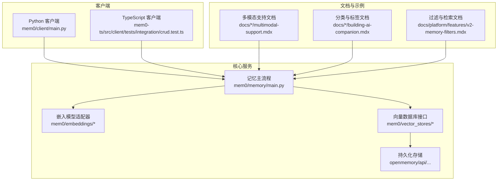
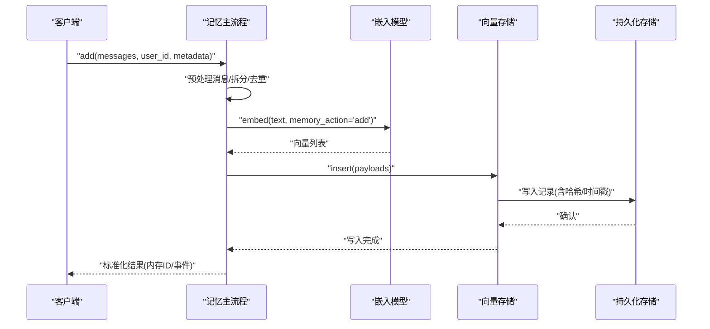
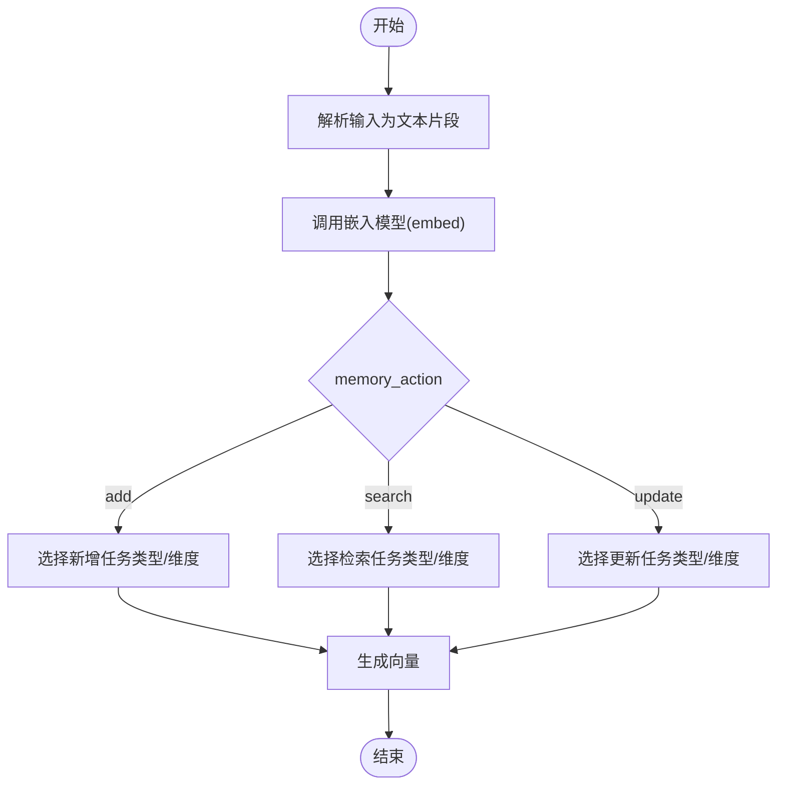
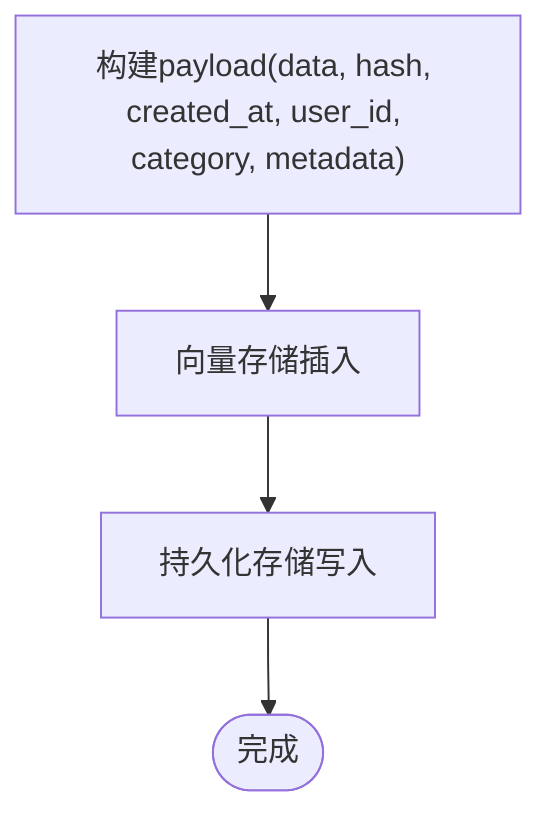
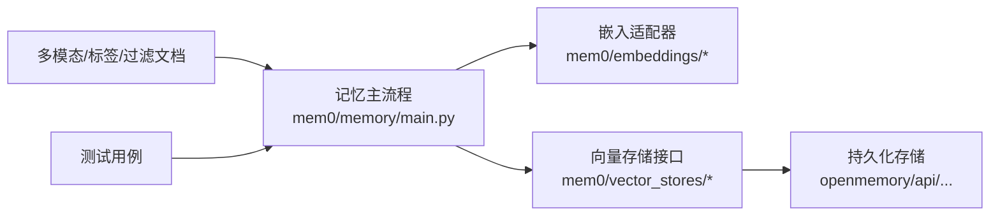

# 记忆添加与创建

<cite>
**本文引用的文件**
- [mem0/memory/main.py](file://mem0/memory/main.py)
- [mem0-ts/src/client/tests/integration/crud.test.ts](file://mem0-ts/src/client/tests/integration/crud.test.ts)
- [docs/open-source/multimodal-support.mdx](file://docs/open-source/multimodal-support.mdx)
- [docs/platform/features/multimodal-support.mdx](file://docs/platform/features/multimodal-support.mdx)
- [docs/cookbooks/essentials/building-ai-companion.mdx](file://docs/cookbooks/essentials/building-ai-companion.mdx)
- [docs/platform/features/v2-memory-filters.mdx](file://docs/platform/features/v2-memory-filters.mdx)
- [openmemory/api/app/utils/prompts.py](file://openmemory/api/app/utils/prompts.py)
- [openmemory/api/alembic/versions/0b53c747049a_initial_migration.py](file://openmemory/api/alembic/versions/0b53c747049a_initial_migration.py)
- [mem0/embeddings/vertexai.py](file://mem0/embeddings/vertexai.py)
- [mem0/embeddings/together.py](file://mem0/embeddings/together.py)
- [tests/memory/test_main.py](file://tests/memory/test_main.py)
</cite>

## 目录
1. [简介](#简介)
2. [项目结构](#项目结构)
3. [核心组件](#核心组件)
4. [架构总览](#架构总览)
5. [详细组件分析](#详细组件分析)
6. [依赖关系分析](#依赖关系分析)
7. [性能考量](#性能考量)
8. [故障排查指南](#故障排查指南)
9. [结论](#结论)
10. [附录](#附录)

## 简介
本文件系统性阐述“记忆添加与创建”的完整流程，覆盖输入预处理、向量化处理、存储写入等关键环节，并对文本、图像、多模态三类记忆的添加方法与参数进行对比说明；同时介绍批量添加、异步添加等高级能力，给出从简单文本到复杂多模态记忆的添加路径，解释元数据与标签体系、质量控制机制及最佳实践。

## 项目结构
围绕记忆添加与创建，本仓库的关键位置如下：
- 核心逻辑：Python 客户端与服务端记忆模块负责接收输入、调用嵌入模型、写入向量数据库与持久化层。
- 多模态支持：文档与示例展示了图像/文档等多模态内容的接入方式与配置要点。
- 标签与过滤：平台侧文档提供了基于分类与元数据的过滤能力；开源版本通过 metadata 字段实现自定义标签。
- 测试与验证：测试用例覆盖了向量写入、元数据合并、哈希与时间戳生成等关键行为。

图表来源
- [mem0/memory/main.py](file://mem0/memory/main.py)
- [mem0/embeddings/vertexai.py](file://mem0/embeddings/vertexai.py)
- [mem0/embeddings/together.py](file://mem0/embeddings/together.py)
- [docs/open-source/multimodal-support.mdx](file://docs/open-source/multimodal-support.mdx)
- [docs/platform/features/multimodal-support.mdx](file://docs/platform/features/multimodal-support.mdx)
- [docs/cookbooks/essentials/building-ai-companion.mdx](file://docs/cookbooks/essentials/building-ai-companion.mdx)
- [docs/platform/features/v2-memory-filters.mdx](file://docs/platform/features/v2-memory-filters.mdx)
- [openmemory/api/alembic/versions/0b53c747049a_initial_migration.py](file://openmemory/api/alembic/versions/0b53c747049a_initial_migration.py)

章节来源
- [mem0/memory/main.py](file://mem0/memory/main.py)
- [mem0-ts/src/client/tests/integration/crud.test.ts](file://mem0-ts/src/client/tests/integration/crud.test.ts)
- [docs/open-source/multimodal-support.mdx](file://docs/open-source/multimodal-support.mdx)
- [docs/platform/features/multimodal-support.mdx](file://docs/platform/features/multimodal-support.mdx)
- [docs/cookbooks/essentials/building-ai-companion.mdx](file://docs/cookbooks/essentials/building-ai-companion.mdx)
- [docs/platform/features/v2-memory-filters.mdx](file://docs/platform/features/v2-memory-filters.mdx)
- [openmemory/api/alembic/versions/0b53c747049a_initial_migration.py](file://openmemory/api/alembic/versions/0b53c747049a_initial_migration.py)

## 核心组件
- 记忆主流程：负责接收用户输入、预处理消息、调用嵌入模型生成向量、写入向量数据库与存储层，并返回标准化结果。
- 嵌入模型适配器：根据 memory_action（add/search/update）选择不同的嵌入策略或维度，确保检索与更新的一致性。
- 向量存储接口：抽象不同向量数据库的插入、查询、更新与删除操作。
- 元数据与标签：通过 metadata 字段传递自定义键值，平台侧可结合分类提示词自动标注类别；开源版本可通过稳定字段如 memory_bucket 实现可控分类。
- 异步与批量：客户端提供异步添加与批量更新/删除接口，便于高吞吐场景。

章节来源
- [mem0/memory/main.py](file://mem0/memory/main.py)
- [mem0/embeddings/vertexai.py](file://mem0/embeddings/vertexai.py)
- [mem0/embeddings/together.py](file://mem0/embeddings/together.py)
- [docs/cookbooks/essentials/building-ai-companion.mdx](file://docs/cookbooks/essentials/building-ai-companion.mdx)

## 架构总览
下图展示了从客户端发起添加请求到最终落库的整体流程，包括多模态输入的预处理、嵌入生成与向量写入。

图表来源
- [mem0/memory/main.py](file://mem0/memory/main.py)
- [mem0/embeddings/vertexai.py](file://mem0/embeddings/vertexai.py)
- [mem0/embeddings/together.py](file://mem0/embeddings/together.py)
- [openmemory/api/alembic/versions/0b53c747049a_initial_migration.py](file://openmemory/api/alembic/versions/0b53c747049a_initial_migration.py)

## 详细组件分析

### 输入预处理与消息规范化
- 预处理阶段会解析多模态消息（如图片 URL、文档 URL），提取可索引文本片段；对纯文本则执行清洗、分块与去重。
- 平台侧文档提供了多模态消息的结构示例，包括 role/content 的组织方式与媒体类型字段。
- 开源文档强调了图片大小限制与清晰度建议，有助于提升提取质量与响应速度。

章节来源
- [docs/platform/features/multimodal-support.mdx](file://docs/platform/features/multimodal-support.mdx)
- [docs/open-source/multimodal-support.mdx](file://docs/open-source/multimodal-support.mdx)

### 向量化处理与嵌入策略
- 嵌入模型根据 memory_action 选择不同的任务类型或维度，以保证新增、检索与更新的语义一致性。
- 不同提供商（如 VertexAI、Together）在初始化时设置默认模型与维度，统一对外接口。

图表来源
- [mem0/embeddings/vertexai.py](file://mem0/embeddings/vertexai.py)
- [mem0/embeddings/together.py](file://mem0/embeddings/together.py)

章节来源
- [mem0/embeddings/vertexai.py](file://mem0/embeddings/vertexai.py)
- [mem0/embeddings/together.py](file://mem0/embeddings/together.py)

### 存储写入与元数据处理
- 写入前会构造标准 payload，包含 data、哈希、时间戳、用户标识、分类与元数据等字段。
- 测试用例验证了 payload 中 data、哈希、时间戳的存在，以及 metadata 的正确合并与共享对象的安全性。

图表来源
- [tests/memory/test_main.py](file://tests/memory/test_main.py)
- [mem0/memory/main.py](file://mem0/memory/main.py)

章节来源
- [tests/memory/test_main.py](file://tests/memory/test_main.py)
- [mem0/memory/main.py](file://mem0/memory/main.py)

### 多模态记忆添加（图像/文档）
- 平台与开源文档均提供了多模态消息的示例与配置项（如 enable_vision、vision_details），用于开启视觉能力与控制细节级别。
- 添加后返回的结果包含多个记忆条目，分别对应对话轮次中提取出的不同事实。

章节来源
- [docs/platform/features/multimodal-support.mdx](file://docs/platform/features/multimodal-support.mdx)
- [docs/open-source/multimodal-support.mdx](file://docs/open-source/multimodal-support.mdx)

### 标签系统与元数据
- 分类与标签：平台侧通过提示词驱动的分类器为记忆分配类别；开源版本通过 metadata 字段（如 memory_bucket）实现可控分类。
- 过滤与检索：平台文档提供了基于关键词、分类集合、元数据键值与时间范围的过滤语法，便于后续检索与审计。

章节来源
- [openmemory/api/app/utils/prompts.py](file://openmemory/api/app/utils/prompts.py)
- [docs/cookbooks/essentials/building-ai-companion.mdx](file://docs/cookbooks/essentials/building-ai-companion.mdx)
- [docs/platform/features/v2-memory-filters.mdx](file://docs/platform/features/v2-memory-filters.mdx)
- [openmemory/api/alembic/versions/0b53c747049a_initial_migration.py](file://openmemory/api/alembic/versions/0b53c747049a_initial_migration.py)

### 批量添加与异步添加
- 异步添加：TypeScript 客户端测试验证了异步添加后，内存可在后台处理完成后被检索到。
- 批量更新/删除：Python 客户端提供批量接口，便于高吞吐场景下的统一管理。

章节来源
- [mem0-ts/src/client/tests/integration/crud.test.ts](file://mem0-ts/src/client/tests/integration/crud.test.ts)
- [mem0/client/main.py](file://mem0/client/main.py)

## 依赖关系分析
- 记忆主流程依赖嵌入模型适配器与向量存储接口，二者通过统一的 embed 接口与 insert 方法解耦。
- 向量存储与持久化层之间存在外键关联（如 memory_categories 表），支撑分类与标签的多对多关系。
- 文档与示例为实际集成提供参考，测试用例保障核心行为的稳定性。

图表来源
- [mem0/memory/main.py](file://mem0/memory/main.py)
- [mem0/embeddings/vertexai.py](file://mem0/embeddings/vertexai.py)
- [mem0/embeddings/together.py](file://mem0/embeddings/together.py)
- [openmemory/api/alembic/versions/0b53c747049a_initial_migration.py](file://openmemory/api/alembic/versions/0b53c747049a_initial_migration.py)
- [docs/platform/features/multimodal-support.mdx](file://docs/platform/features/multimodal-support.mdx)
- [docs/cookbooks/essentials/building-ai-companion.mdx](file://docs/cookbooks/essentials/building-ai-companion.mdx)
- [tests/memory/test_main.py](file://tests/memory/test_main.py)

章节来源
- [mem0/memory/main.py](file://mem0/memory/main.py)
- [mem0/embeddings/vertexai.py](file://mem0/embeddings/vertexai.py)
- [mem0/embeddings/together.py](file://mem0/embeddings/together.py)
- [openmemory/api/alembic/versions/0b53c747049a_initial_migration.py](file://openmemory/api/alembic/versions/0b53c747049a_initial_migration.py)
- [docs/platform/features/multimodal-support.mdx](file://docs/platform/features/multimodal-support.mdx)
- [docs/cookbooks/essentials/building-ai-companion.mdx](file://docs/cookbooks/essentials/building-ai-companion.mdx)
- [tests/memory/test_main.py](file://tests/memory/test_main.py)

## 性能考量
- 嵌入维度与任务类型：根据 memory_action 选择合适的维度与任务类型，可减少检索偏差并提高召回质量。
- 多模态输入优化：遵循开源文档中的图片大小与清晰度建议，避免超大文件导致的延迟与失败。
- 批量与异步：在高并发场景优先采用批量接口与异步添加，降低单次请求开销并提升吞吐。
- 存储写入：确保向量存储与数据库的写入路径具备良好的索引与分区策略，以支撑大规模检索。

## 故障排查指南
- 常见错误与定位
  - 嵌入模型异常：检查 memory_action 参数是否合法，以及提供商 API Key 与默认模型配置。
  - 写入失败：核对 payload 字段完整性（data/hash/时间戳/元数据），确认向量维度与存储引擎匹配。
  - 多模态失败：检查图片大小限制与 URL 可达性，必要时压缩或转存为本地可访问资源。
- 质量控制建议
  - 在添加前对输入进行清洗与分块，避免过长片段导致嵌入质量下降。
  - 使用元数据标记来源与类型，便于后续过滤与审计。
  - 对批量操作进行幂等校验（如基于哈希），避免重复写入。

章节来源
- [mem0/embeddings/vertexai.py](file://mem0/embeddings/vertexai.py)
- [mem0/embeddings/together.py](file://mem0/embeddings/together.py)
- [tests/memory/test_main.py](file://tests/memory/test_main.py)
- [docs/open-source/multimodal-support.mdx](file://docs/open-source/multimodal-support.mdx)

## 结论
记忆添加与创建在本项目中通过“输入预处理 → 向量化 → 存储写入”的流水线实现，既支持文本，也支持图像与文档等多模态输入。通过元数据与分类体系，系统实现了灵活的标签与检索能力；借助异步与批量接口，满足高吞吐与低延迟需求。建议在生产环境中结合维度配置、输入规范与质量控制策略，持续优化检索效果与用户体验。

## 附录
- 快速参考
  - 文本记忆：直接传入消息数组与 user_id，系统自动嵌入并写入。
  - 图像/文档记忆：按文档示例构造多模态消息，开启视觉能力后自动提取文本并入库。
  - 标签与分类：平台侧由提示词驱动分类；开源侧通过 metadata 或 memory_bucket 控制。
  - 过滤与检索：使用平台提供的过滤语法，结合关键词、分类与元数据进行精准检索。