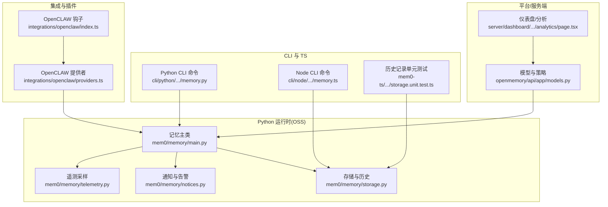
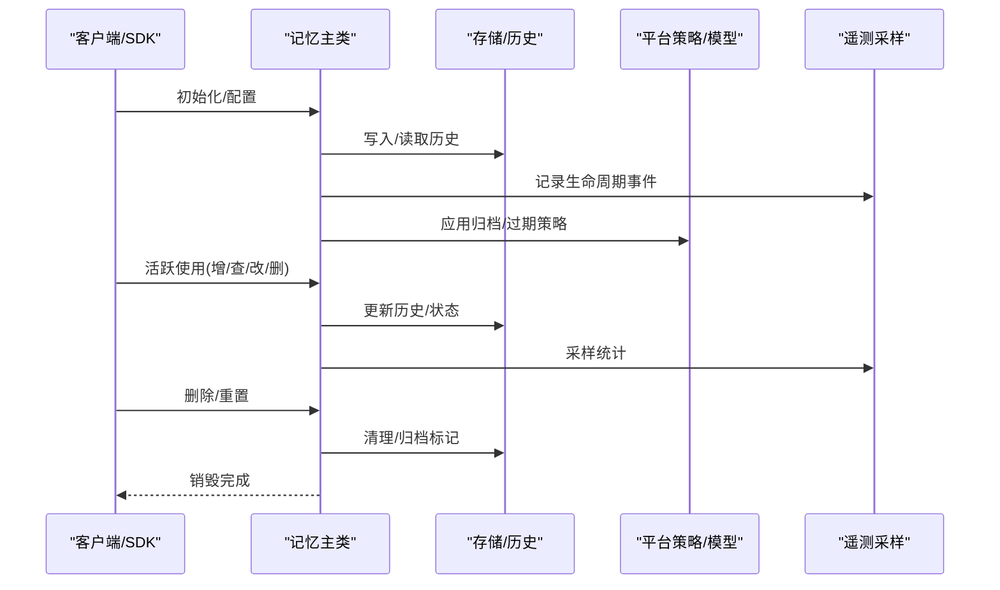
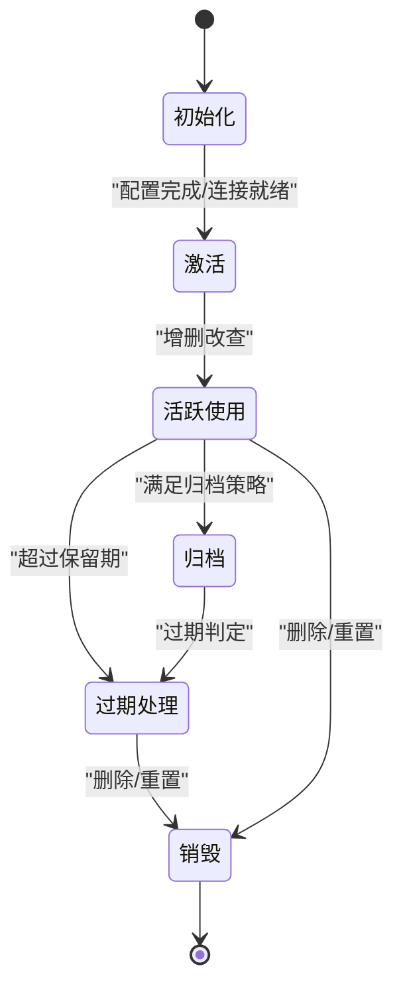
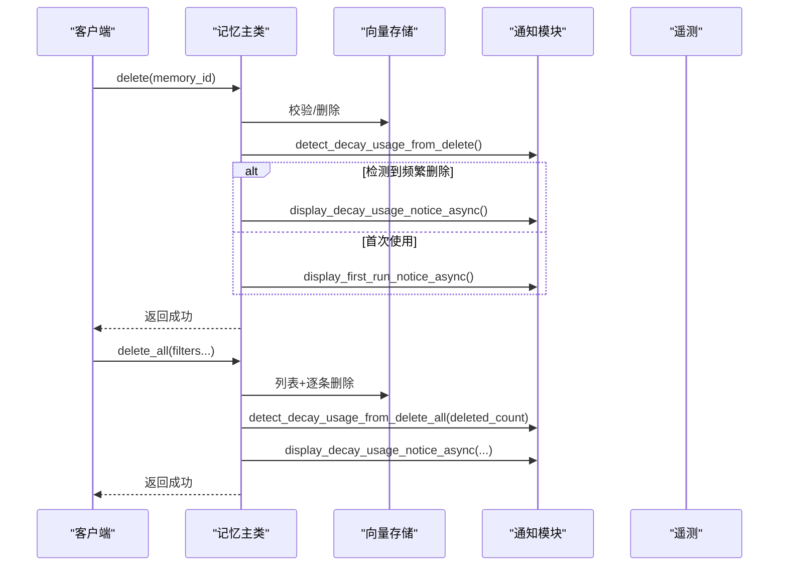
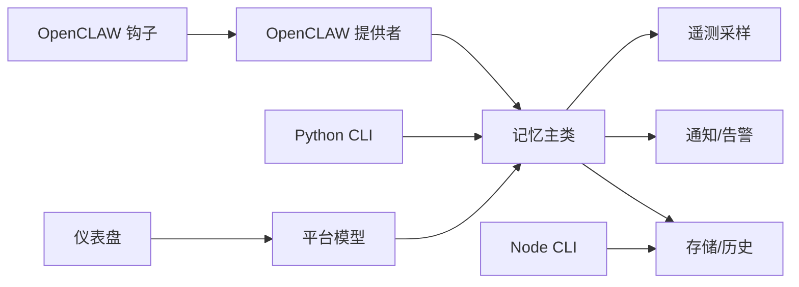

# 记忆生命周期管理

<cite>
**本文引用的文件**
- [mem0/memory/main.py](file://mem0/memory/main.py)
- [mem0/memory/notices.py](file://mem0/memory/notices.py)
- [mem0/memory/storage.py](file://mem0/memory/storage.py)
- [mem0/memory/telemetry.py](file://mem0/memory/telemetry.py)
- [openmemory/api/app/models.py](file://openmemory/api/app/models.py)
- [tests/memory/test_decay_usage_notice.py](file://tests/memory/test_decay_usage_notice.py)
- [tests/test_telemetry_sampling.py](file://tests/test_telemetry_sampling.py)
- [docs/core-concepts/memory-operations/delete.mdx](file://docs/core-concepts/memory-operations/delete.mdx)
- [docs/core-concepts/memory-operations/add.mdx](file://docs/core-concepts/memory-operations/add.mdx)
- [docs/platform/features/memory-decay.mdx](file://docs/platform/features/memory-decay.mdx)
- [docs/platform/features/platform-overview.mdx](file://docs/platform/features/platform-overview.mdx)
- [cli/python/src/mem0_cli/commands/memory.py](file://cli/python/src/mem0_cli/commands/memory.py)
- [cli/node/src/commands/memory.ts](file://cli/node/src/commands/memory.ts)
- [integrations/openclaw/providers.ts](file://integrations/openclaw/providers.ts)
- [integrations/openclaw/index.ts](file://integrations/openclaw/index.ts)
- [server/dashboard/src/app/(root)/dashboard/analytics/page.tsx](file://server/dashboard/src/app/(root)/dashboard/analytics/page.tsx)
- [mem0-ts/src/oss/tests/storage.unit.test.ts](file://mem0-ts/src/oss/tests/storage.unit.test.ts)
</cite>

## 目录
1. [简介](#简介)
2. [项目结构](#项目结构)
3. [核心组件](#核心组件)
4. [架构总览](#架构总览)
5. [详细组件分析](#详细组件分析)
6. [依赖关系分析](#依赖关系分析)
7. [性能考量](#性能考量)
8. [故障排查指南](#故障排查指南)
9. [结论](#结论)
10. [附录](#附录)

## 简介
本文件系统性阐述记忆（Memory）在mem0中的完整生命周期：从初始化、激活、活跃使用、归档、过期处理到最终销毁；解释状态转换的触发条件与管理策略；说明自动清理、内存回收与存储优化机制；提供生命周期监控、性能分析与容量规划的方法；覆盖异常场景下的处理与故障恢复；并给出多业务场景的最佳实践。

## 项目结构
围绕记忆生命周期管理的核心模块分布如下：
- Python运行时（OSS）：记忆主流程、通知与遥测、存储历史记录
- 平台/服务端：归档策略、状态变更历史、仪表盘与分析
- CLI与TS：命令行操作入口、历史记录测试
- 集成与插件：OpenCLAW钩子、自动梦醒触发与历史回退

图表来源
- [mem0/memory/main.py](file://mem0/memory/main.py)
- [mem0/memory/notices.py](file://mem0/memory/notices.py)
- [mem0/memory/storage.py](file://mem0/memory/storage.py)
- [mem0/memory/telemetry.py](file://mem0/memory/telemetry.py)
- [openmemory/api/app/models.py](file://openmemory/api/app/models.py)
- [server/dashboard/src/app/(root)/dashboard/analytics/page.tsx](file://server/dashboard/src/app/(root)/dashboard/analytics/page.tsx)
- [cli/python/src/mem0_cli/commands/memory.py](file://cli/python/src/mem0_cli/commands/memory.py)
- [cli/node/src/commands/memory.ts](file://cli/node/src/commands/memory.ts)
- [mem0-ts/src/oss/tests/storage.unit.test.ts](file://mem0-ts/src/oss/tests/storage.unit.test.ts)
- [integrations/openclaw/providers.ts](file://integrations/openclaw/providers.ts)
- [integrations/openclaw/index.ts](file://integrations/openclaw/index.ts)

章节来源
- [mem0/memory/main.py](file://mem0/memory/main.py)
- [mem0/memory/notices.py](file://mem0/memory/notices.py)
- [mem0/memory/storage.py](file://mem0/memory/storage.py)
- [mem0/memory/telemetry.py](file://mem0/memory/telemetry.py)
- [openmemory/api/app/models.py](file://openmemory/api/app/models.py)
- [server/dashboard/src/app/(root)/dashboard/analytics/page.tsx](file://server/dashboard/src/app/(root)/dashboard/analytics/page.tsx)
- [cli/python/src/mem0_cli/commands/memory.py](file://cli/python/src/mem0_cli/commands/memory.py)
- [cli/node/src/commands/memory.ts](file://cli/node/src/commands/memory.ts)
- [mem0-ts/src/oss/tests/storage.unit.test.ts](file://mem0-ts/src/oss/tests/storage.unit.test.ts)
- [integrations/openclaw/providers.ts](file://integrations/openclaw/providers.ts)
- [integrations/openclaw/index.ts](file://integrations/openclaw/index.ts)

## 核心组件
- 记忆主类：负责增删改查、批量删除、重置、生命周期事件与遥测采样
- 通知与告警：首次运行提示、时间相关特性提示、衰减使用提示、规模阈值提示、慢查询提示
- 存储与历史：持久化存储、历史记录管理（上限、排序、隔离）
- 遥测采样：生命周期事件强制通过、其他事件按采样率控制
- 平台策略与状态：归档策略、记忆状态变更历史
- CLI与TS：命令行入口、历史记录单元测试
- OpenCLAW集成：自动梦醒触发、历史回退保护

章节来源
- [mem0/memory/main.py](file://mem0/memory/main.py)
- [mem0/memory/notices.py](file://mem0/memory/notices.py)
- [mem0/memory/storage.py](file://mem0/memory/storage.py)
- [mem0/memory/telemetry.py](file://mem0/memory/telemetry.py)
- [openmemory/api/app/models.py](file://openmemory/api/app/models.py)
- [cli/python/src/mem0_cli/commands/memory.py](file://cli/python/src/mem0_cli/commands/memory.py)
- [cli/node/src/commands/memory.ts](file://cli/node/src/commands/memory.ts)
- [mem0-ts/src/oss/tests/storage.unit.test.ts](file://mem0-ts/src/oss/tests/storage.unit.test.ts)
- [integrations/openclaw/providers.ts](file://integrations/openclaw/providers.ts)
- [integrations/openclaw/index.ts](file://integrations/openclaw/index.ts)

## 架构总览
记忆生命周期贯穿“客户端/SDK”、“存储层”、“平台策略”和“监控/分析”四层。初始化后进入活跃使用，依据策略进行归档与过期处理，最终支持删除或重置完成销毁。

图表来源
- [mem0/memory/main.py](file://mem0/memory/main.py)
- [mem0/memory/storage.py](file://mem0/memory/storage.py)
- [mem0/memory/telemetry.py](file://mem0/memory/telemetry.py)
- [openmemory/api/app/models.py](file://openmemory/api/app/models.py)

## 详细组件分析

### 生命周期阶段与状态转换
- 初始化：加载配置、建立连接、预热（如OpenCLAW提供者会尝试启用历史并回退）
- 激活：可用状态，可执行增删改查
- 活跃使用：增删改查、批量删除、重置
- 归档：依据平台归档策略对满足条件的记忆进行归档
- 过期处理：结合时间维度与平台策略进行过期判定
- 销毁：删除单条/全部记忆或重置，完成资源回收

图表来源
- [openmemory/api/app/models.py](file://openmemory/api/app/models.py)
- [mem0/memory/main.py](file://mem0/memory/main.py)
- [integrations/openclaw/providers.ts](file://integrations/openclaw/providers.ts)

章节来源
- [openmemory/api/app/models.py](file://openmemory/api/app/models.py)
- [mem0/memory/main.py](file://mem0/memory/main.py)
- [integrations/openclaw/providers.ts](file://integrations/openclaw/providers.ts)

### 初始化与激活
- 初始化失败时的容错：OpenCLAW提供者在检测到SQLite绑定问题时会禁用历史并重试
- 预热调用：通过一次列表查询确保实例可用
- 生命周期事件采样：初始化事件不受采样率限制

章节来源
- [integrations/openclaw/providers.ts](file://integrations/openclaw/providers.ts)
- [tests/test_telemetry_sampling.py](file://tests/test_telemetry_sampling.py)

### 活跃使用与历史记录
- 历史记录上限：默认保留最近N条，超出则截断
- 排序规则：按时间降序排列
- 隔离策略：按memory_id隔离，互不影响
- 关闭与重置：关闭不抛出异常；重置清空所有历史

章节来源
- [mem0-ts/src/oss/tests/storage.unit.test.ts](file://mem0-ts/src/oss/tests/storage.unit.test.ts)
- [mem0/memory/storage.py](file://mem0/memory/storage.py)

### 归档与过期处理
- 归档策略模型：基于条件类型/ID与天数字段定义归档周期
- 状态变更历史：记录记忆状态变更、变更人与时间
- 平台特性：平台提供过期策略与时间维度检索能力

章节来源
- [openmemory/api/app/models.py](file://openmemory/api/app/models.py)
- [docs/platform/features/memory-decay.mdx](file://docs/platform/features/memory-decay.mdx)
- [docs/platform/features/platform-overview.mdx](file://docs/platform/features/platform-overview.mdx)

### 删除与销毁
- 单条删除：校验存在性、执行删除、触发衰减使用检测与通知
- 批量删除：根据过滤条件列出并逐条删除，成功后触发检测与通知
- 全量重置：清空所有数据（需明确意图）

图表来源
- [mem0/memory/main.py](file://mem0/memory/main.py)
- [mem0/memory/notices.py](file://mem0/memory/notices.py)
- [tests/memory/test_decay_usage_notice.py](file://tests/memory/test_decay_usage_notice.py)

章节来源
- [mem0/memory/main.py](file://mem0/memory/main.py)
- [mem0/memory/notices.py](file://mem0/memory/notices.py)
- [tests/memory/test_decay_usage_notice.py](file://tests/memory/test_decay_usage_notice.py)
- [docs/core-concepts/memory-operations/delete.mdx](file://docs/core-concepts/memory-operations/delete.mdx)

### 自动清理、内存回收与存储优化
- 历史记录上限与截断：避免无限增长
- 批量删除与重置：快速释放资源
- 归档策略：降低活跃存储压力
- 采样遥测：仅对热点事件进行采样，降低开销

章节来源
- [mem0-ts/src/oss/tests/storage.unit.test.ts](file://mem0-ts/src/oss/tests/storage.unit.test.ts)
- [mem0/memory/main.py](file://mem0/memory/main.py)
- [mem0/memory/telemetry.py](file://mem0/memory/telemetry.py)
- [tests/test_telemetry_sampling.py](file://tests/test_telemetry_sampling.py)

### 生命周期监控、性能分析与容量规划
- 仪表盘概览：展示总操作数、平均延迟、成功率等指标
- 慢查询告警：基于阈值与窗口期的提示
- 规模阈值告警：基于添加次数与top_k阈值的提示
- 事件采样：生命周期事件强制通过，其他事件按采样率控制

章节来源
- [server/dashboard/src/app/(root)/dashboard/analytics/page.tsx](file://server/dashboard/src/app/(root)/dashboard/analytics/page.tsx)
- [mem0/memory/notices.py](file://mem0/memory/notices.py)
- [tests/test_telemetry_sampling.py](file://tests/test_telemetry_sampling.py)

### 异常情况与故障恢复
- 初始化失败回退：当启用历史导致失败时，自动禁用历史并重试
- 历史记录异常：关闭不抛出异常，保证稳定性
- 批量删除失败：逐条删除策略降低整体风险

章节来源
- [integrations/openclaw/providers.ts](file://integrations/openclaw/providers.ts)
- [mem0-ts/src/oss/tests/storage.unit.test.ts](file://mem0-ts/src/oss/tests/storage.unit.test.ts)
- [mem0/memory/main.py](file://mem0/memory/main.py)

### 不同业务场景的最佳实践
- 支持型应用：合规驱动的删除流程，配合平台数据管理工具
- 时间敏感检索：利用平台的时间维度检索与过期策略
- 大规模检索：关注慢查询与规模阈值告警，合理设置top_k与阈值
- 开发/测试：使用重置功能快速清理环境

章节来源
- [docs/core-concepts/memory-operations/delete.mdx](file://docs/core-concepts/memory-operations/delete.mdx)
- [docs/platform/features/platform-overview.mdx](file://docs/platform/features/platform-overview.mdx)
- [docs/platform/features/memory-decay.mdx](file://docs/platform/features/memory-decay.mdx)
- [docs/core-concepts/memory-operations/add.mdx](file://docs/core-concepts/memory-operations/add.mdx)

## 依赖关系分析
- 记忆主类依赖存储与通知模块，并通过遥测采样记录生命周期事件
- 平台模型为归档策略与状态变更提供数据支撑
- CLI与TS分别提供命令行入口与历史记录验证
- OpenCLAW集成在初始化阶段提供容错与自动梦醒触发

图表来源
- [mem0/memory/main.py](file://mem0/memory/main.py)
- [mem0/memory/notices.py](file://mem0/memory/notices.py)
- [mem0/memory/storage.py](file://mem0/memory/storage.py)
- [mem0/memory/telemetry.py](file://mem0/memory/telemetry.py)
- [openmemory/api/app/models.py](file://openmemory/api/app/models.py)
- [server/dashboard/src/app/(root)/dashboard/analytics/page.tsx](file://server/dashboard/src/app/(root)/dashboard/analytics/page.tsx)
- [cli/python/src/mem0_cli/commands/memory.py](file://cli/python/src/mem0_cli/commands/memory.py)
- [cli/node/src/commands/memory.ts](file://cli/node/src/commands/memory.ts)
- [integrations/openclaw/providers.ts](file://integrations/openclaw/providers.ts)
- [integrations/openclaw/index.ts](file://integrations/openclaw/index.ts)

章节来源
- [mem0/memory/main.py](file://mem0/memory/main.py)
- [mem0/memory/notices.py](file://mem0/memory/notices.py)
- [mem0/memory/storage.py](file://mem0/memory/storage.py)
- [mem0/memory/telemetry.py](file://mem0/memory/telemetry.py)
- [openmemory/api/app/models.py](file://openmemory/api/app/models.py)
- [server/dashboard/src/app/(root)/dashboard/analytics/page.tsx](file://server/dashboard/src/app/(root)/dashboard/analytics/page.tsx)
- [cli/python/src/mem0_cli/commands/memory.py](file://cli/python/src/mem0_cli/commands/memory.py)
- [cli/node/src/commands/memory.ts](file://cli/node/src/commands/memory.ts)
- [integrations/openclaw/providers.ts](file://integrations/openclaw/providers.ts)
- [integrations/openclaw/index.ts](file://integrations/openclaw/index.ts)

## 性能考量
- 事件采样：除生命周期事件外，其他事件按采样率控制，降低遥测开销
- 历史记录上限：防止无界增长导致的I/O与存储压力
- 批量删除策略：逐条删除降低单次失败影响范围
- 慢查询与规模阈值告警：帮助识别瓶颈并指导参数调优

章节来源
- [tests/test_telemetry_sampling.py](file://tests/test_telemetry_sampling.py)
- [mem0-ts/src/oss/tests/storage.unit.test.ts](file://mem0-ts/src/oss/tests/storage.unit.test.ts)
- [mem0/memory/main.py](file://mem0/memory/main.py)
- [mem0/memory/notices.py](file://mem0/memory/notices.py)

## 故障排查指南
- 初始化失败：检查SQLite绑定兼容性，必要时禁用历史并重试
- 历史记录异常：确认关闭接口不抛异常，重置后验证是否清空
- 批量删除失败：检查过滤条件与返回结果，逐条排查失败项
- 告警未显示：确认遥测开关与标志位配置，检查容量阈值与窗口期

章节来源
- [integrations/openclaw/providers.ts](file://integrations/openclaw/providers.ts)
- [mem0-ts/src/oss/tests/storage.unit.test.ts](file://mem0-ts/src/oss/tests/storage.unit.test.ts)
- [mem0/memory/main.py](file://mem0/memory/main.py)
- [mem0/memory/notices.py](file://mem0/memory/notices.py)

## 结论
mem0通过清晰的生命周期阶段划分、完善的存储与历史管理、平台级归档与过期策略、以及可观测性与告警体系，实现了从创建到销毁的全链路可控管理。结合采样遥测与容量告警，可在大规模场景下保持稳定与高效。建议在生产中结合业务特性合理配置归档与过期策略，并持续关注慢查询与规模阈值告警以优化性能。

## 附录
- CLI命令入口：Python与Node CLI均提供记忆相关命令
- 文档参考：新增、删除、搜索、更新等核心操作与平台特性说明

章节来源
- [cli/python/src/mem0_cli/commands/memory.py](file://cli/python/src/mem0_cli/commands/memory.py)
- [cli/node/src/commands/memory.ts](file://cli/node/src/commands/memory.ts)
- [docs/core-concepts/memory-operations/add.mdx](file://docs/core-concepts/memory-operations/add.mdx)
- [docs/core-concepts/memory-operations/delete.mdx](file://docs/core-concepts/memory-operations/delete.mdx)
- [docs/platform/features/memory-decay.mdx](file://docs/platform/features/memory-decay.mdx)
- [docs/platform/features/platform-overview.mdx](file://docs/platform/features/platform-overview.mdx)