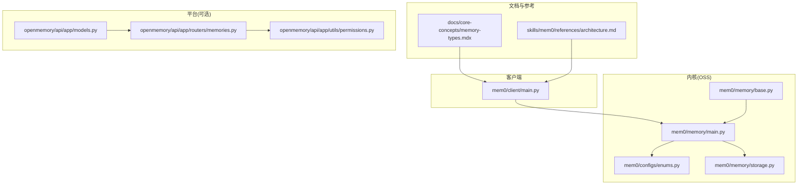
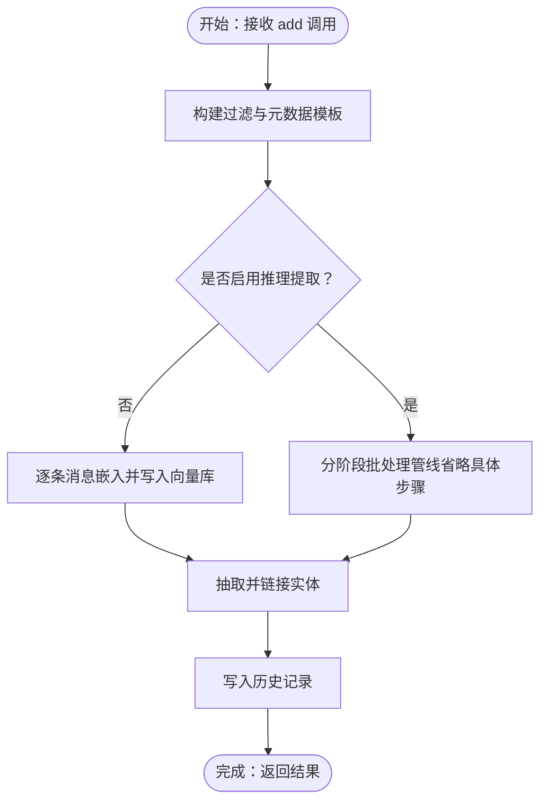
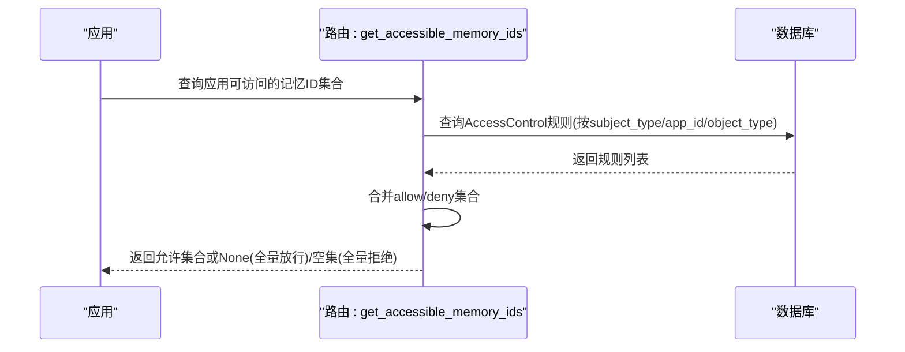
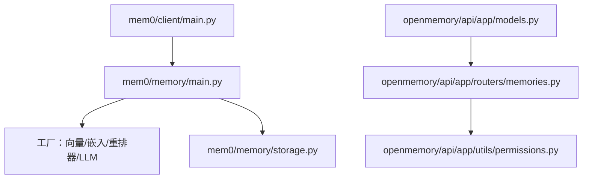

# 记忆类型与层次结构

<cite>
**本文引用的文件**
- [docs/core-concepts/memory-types.mdx](file://docs/core-concepts/memory-types.mdx)
- [skills/mem0/references/architecture.md](file://skills/mem0/references/architecture.md)
- [mem0/memory/main.py](file://mem0/memory/main.py)
- [mem0/memory/base.py](file://mem0/memory/base.py)
- [mem0/client/main.py](file://mem0/client/main.py)
- [mem0/configs/enums.py](file://mem0/configs/enums.py)
- [mem0/memory/storage.py](file://mem0/memory/storage.py)
- [openmemory/api/app/models.py](file://openmemory/api/app/models.py)
- [openmemory/api/app/routers/memories.py](file://openmemory/api/app/routers/memories.py)
- [openmemory/api/app/utils/permissions.py](file://openmemory/api/app/utils/permissions.py)
</cite>

## 目录
1. [引言](#引言)
2. [项目结构](#项目结构)
3. [核心组件](#核心组件)
4. [架构总览](#架构总览)
5. [详细组件分析](#详细组件分析)
6. [依赖分析](#依赖分析)
7. [性能考虑](#性能考虑)
8. [故障排查指南](#故障排查指南)
9. [结论](#结论)
10. [附录](#附录)

## 引言
本文件系统性阐述 Mem0 的记忆类型与层次结构设计，覆盖用户级、会话级、代理级与组织级（共享）记忆的边界、作用域与继承关系；解释全局记忆、项目级记忆、实体级记忆的概念与落地方式；并给出分类标准、存储策略与访问权限控制机制。文档同时提供面向 Python 客户端与 OSS SDK 的操作路径指引，并结合官方文档与源码说明最佳实践。

## 项目结构
围绕“记忆类型与层次结构”的关键模块分布如下：
- 文档层：核心概念与分层说明位于 docs/core-concepts/memory-types.mdx 与 skills/mem0/references/architecture.md
- 客户端层：Python 客户端封装了 add/search/update/delete 等 API 调用，见 mem0/client/main.py
- 内核层：OSS SDK 的记忆处理主流程、过滤构建、实体链接与向量存储交互，见 mem0/memory/main.py
- 抽象接口：MemoryBase 定义统一能力，见 mem0/memory/base.py
- 存储与历史：SQLite 历史记录与消息表，见 mem0/memory/storage.py
- 枚举类型：记忆类型枚举，见 mem0/configs/enums.py
- 平台侧权限与模型：平台应用访问控制、分类与状态历史模型，见 openmemory/api/app/models.py 与 openmemory/api/app/routers/memories.py、openmemory/api/app/utils/permissions.py

图表来源
- [docs/core-concepts/memory-types.mdx](file://docs/core-concepts/memory-types.mdx)
- [skills/mem0/references/architecture.md](file://skills/mem0/references/architecture.md)
- [mem0/client/main.py](file://mem0/client/main.py)
- [mem0/memory/main.py](file://mem0/memory/main.py)
- [mem0/memory/base.py](file://mem0/memory/base.py)
- [mem0/configs/enums.py](file://mem0/configs/enums.py)
- [mem0/memory/storage.py](file://mem0/memory/storage.py)
- [openmemory/api/app/models.py](file://openmemory/api/app/models.py)
- [openmemory/api/app/routers/memories.py](file://openmemory/api/app/routers/memories.py)
- [openmemory/api/app/utils/permissions.py](file://openmemory/api/app/utils/permissions.py)

章节来源
- [docs/core-concepts/memory-types.mdx](file://docs/core-concepts/memory-types.mdx)
- [skills/mem0/references/architecture.md](file://skills/mem0/references/architecture.md)
- [mem0/client/main.py](file://mem0/client/main.py)
- [mem0/memory/main.py](file://mem0/memory/main.py)
- [mem0/memory/base.py](file://mem0/memory/base.py)
- [mem0/configs/enums.py](file://mem0/configs/enums.py)
- [mem0/memory/storage.py](file://mem0/memory/storage.py)
- [openmemory/api/app/models.py](file://openmemory/api/app/models.py)
- [openmemory/api/app/routers/memories.py](file://openmemory/api/app/routers/memories.py)
- [openmemory/api/app/utils/permissions.py](file://openmemory/api/app/utils/permissions.py)

## 核心组件
- 记忆对象结构与作用域字段
  - 关键字段：id、memory、user_id、agent_id、app_id、run_id、metadata、categories、created_at、updated_at、structured_attributes、score
  - 多租户与隔离：通过 user_id、agent_id、app_id、run_id 维度进行存储与查询隔离
- 分层记忆
  - 会话层（Conversation）：单轮对话内的即时信息，生命周期短
  - 会话层（Session）：当前任务或通道的短期事实，生命周期分钟到小时
  - 用户层（User）：与个人或账户长期关联的知识，生命周期长
  - 组织层（Organization）：多代理/团队共享上下文
- 记忆类型枚举
  - 支持语义记忆、情节记忆、程序性记忆三类
- 客户端能力
  - add/search/update/delete/history/users/delete_users/reset/batch_* 等
- 内核处理
  - 过滤构建、实体提取与链接、向量存储写入、历史记录持久化

章节来源
- [skills/mem0/references/architecture.md](file://skills/mem0/references/architecture.md)
- [docs/core-concepts/memory-types.mdx](file://docs/core-concepts/memory-types.mdx)
- [mem0/configs/enums.py](file://mem0/configs/enums.py)
- [mem0/client/main.py](file://mem0/client/main.py)
- [mem0/memory/main.py](file://mem0/memory/main.py)
- [mem0/memory/storage.py](file://mem0/memory/storage.py)

## 架构总览
Mem0 将“输入-检索-增强提示-生成-存储新记忆”作为通用闭环。分层记忆在检索时按优先级合并返回，存储时按作用域维度落盘，支持实体链接与时间结构化属性辅助检索。

图表来源
- [skills/mem0/references/architecture.md](file://skills/mem0/references/architecture.md)

## 详细组件分析

### 分层记忆与作用域
- 层次与生命周期
  - 会话层（Conversation）：单轮对话内，用于工具调用与链式思考，随轮次结束而丢失
  - 会话层（Session）：当前任务或通道的短期事实，可通过 run_id 进行隔离与清理
  - 用户层（User）：与人或账户长期关联的知识，跨会话持久
  - 组织层（Organization）：共享知识，供多代理/团队使用
- 作用域字段与隔离
  - user_id：用户级作用域
  - agent_id：代理级作用域
  - app_id：应用/产品表面作用域
  - run_id：会话/运行级作用域
  - 默认隐式空值隔离：仅传 user_id 查询时，默认排除 agent_id/app_id/run_id 非空记录，避免跨作用域泄漏
  - 跨作用域查询需显式使用 OR 或通配符
- 推荐模式
  - 用户级：client.add(..., user_id="alice")
  - 会话级：client.add(..., user_id="alice", run_id="session_123")，完成后清理
  - 代理级：client.add(..., agent_id="support_bot", app_id="helpdesk")
  - 多租户：client.add(..., user_id, agent_id, app_id, run_id)

章节来源
- [docs/core-concepts/memory-types.mdx](file://docs/core-concepts/memory-types.mdx)
- [skills/mem0/references/architecture.md](file://skills/mem0/references/architecture.md)

### 记忆类型与分类
- 类型枚举
  - 语义记忆（semantic_memory）
  - 情节记忆（episodic_memory）
  - 程序性记忆（procedural_memory）
- 使用场景
  - 程序性记忆通常需要 agent_id 参与，用于代理内部的流程/技能记忆
- 实现要点
  - OSS SDK 对 procedural_memory 有显式分支处理
  - 其他类型默认为通用的事实/对话记忆

章节来源
- [mem0/configs/enums.py](file://mem0/configs/enums.py)
- [mem0/memory/main.py](file://mem0/memory/main.py)

### 客户端 API 与参数校验
- 关键方法
  - add/messages、search/query、update/memory_id、delete/memory_id、delete_all、history/memory_id、batch_*、users、delete_users、reset
- 参数校验
  - 顶层不允许直接传 user_id/agent_id/app_id/run_id，必须放入 filters
  - 查询与列举接口对顶层 entity 参数进行拒绝并抛错
- 请求准备
  - _prepare_params/_prepare_payload 统一封装请求参数与载荷
- 版本与行为
  - v3 默认异步返回事件 ID，支持轮询或 Webhook
  - 支持 rerank、top_k、阈值等检索参数

章节来源
- [mem0/client/main.py](file://mem0/client/main.py)

### 内核处理流程与过滤构建
- 过滤构建
  - _build_filters_and_metadata：根据 user_id/agent_id/run_id 构造存储元数据模板与查询过滤器
  - _build_session_scope：基于排序后的实体 ID 生成会话作用域字符串
  - _reject_top_level_entity_params：拒绝在方法顶层直接传入作用域参数
- 检索参数校验
  - _validate_search_params：校验阈值与 top_k 合法性
  - _validate_and_trim_search_query：清洗查询词
- 存储与历史
  - SQLiteManager：维护 history 与 messages 表，支持批量历史写入、最近消息保留与重置
- 实体链接
  - _link_entities_for_memory：从文本抽取实体并链接到实体存储，支持去重与更新

图表来源
- [mem0/memory/main.py](file://mem0/memory/main.py)
- [mem0/memory/storage.py](file://mem0/memory/storage.py)

章节来源
- [mem0/memory/main.py](file://mem0/memory/main.py)
- [mem0/memory/storage.py](file://mem0/memory/storage.py)

### 平台侧访问控制与权限
- 应用级访问控制
  - AccessControl：主体类型/主体 ID、对象类型/对象 ID、effect（allow/deny）
  - get_accessible_memory_ids：根据 app_id 解析允许/拒绝集合，支持全量放行/全量拒绝
- 权限检查
  - check_memory_access_permissions：检查内存状态、应用状态与 ACL 规则，决定是否可访问
- 模型与索引
  - Memory、Category、ArchivePolicy、MemoryStatusHistory 等模型及索引
  - 记忆状态变更历史表 memory_status_history

图表来源
- [openmemory/api/app/routers/memories.py](file://openmemory/api/app/routers/memories.py)
- [openmemory/api/app/utils/permissions.py](file://openmemory/api/app/utils/permissions.py)
- [openmemory/api/app/models.py](file://openmemory/api/app/models.py)

章节来源
- [openmemory/api/app/routers/memories.py](file://openmemory/api/app/routers/memories.py)
- [openmemory/api/app/utils/permissions.py](file://openmemory/api/app/utils/permissions.py)
- [openmemory/api/app/models.py](file://openmemory/api/app/models.py)

### 记忆对象结构与字段说明
- 字段清单与含义
  - id：唯一标识，用于更新/删除
  - memory：提取或存储的文本内容
  - user_id/agent_id/app_id/run_id：作用域字段
  - metadata：自定义键值对，用于过滤
  - categories：自动分配或自定义类别标签
  - created_at/updated_at：创建与最后修改时间戳
  - structured_attributes：时间分解属性，支持基于时间的查询
  - score：检索结果的语义相似度（0-1）

章节来源
- [skills/mem0/references/architecture.md](file://skills/mem0/references/architecture.md)

## 依赖分析
- 客户端依赖
  - httpx/requests：HTTP 客户端
  - 类型与错误处理：AddMemoryOptions/SearchMemoryOptions 等
- 内核依赖
  - 向量存储工厂、嵌入模型工厂、重排器工厂、LLM 工厂
  - 实体提取与链接、评分融合、BM25、词形还原
  - SQLite 历史与消息表
- 平台依赖
  - SQLAlchemy 模型与路由：AccessControl、Category、MemoryStatusHistory
  - 权限工具：基于 ACL 的访问控制

图表来源
- [mem0/client/main.py](file://mem0/client/main.py)
- [mem0/memory/main.py](file://mem0/memory/main.py)
- [mem0/memory/storage.py](file://mem0/memory/storage.py)
- [openmemory/api/app/models.py](file://openmemory/api/app/models.py)
- [openmemory/api/app/routers/memories.py](file://openmemory/api/app/routers/memories.py)
- [openmemory/api/app/utils/permissions.py](file://openmemory/api/app/utils/permissions.py)

章节来源
- [mem0/client/main.py](file://mem0/client/main.py)
- [mem0/memory/main.py](file://mem0/memory/main.py)
- [mem0/memory/storage.py](file://mem0/memory/storage.py)
- [openmemory/api/app/models.py](file://openmemory/api/app/models.py)
- [openmemory/api/app/routers/memories.py](file://openmemory/api/app/routers/memories.py)
- [openmemory/api/app/utils/permissions.py](file://openmemory/api/app/utils/permissions.py)

## 性能考虑
- 检索延迟
  - v3 默认混合检索约 100-150ms，开启重排约增加 150-200ms
  - add 异步返回，后台处理
- 批量与并发
  - 批量更新/删除上限可达 1000 条
- 作用域优化
  - 优先使用 user_id 查询；必要时加入 run_id 缩小搜索空间
  - 避免在大数据集上使用通配符 "*" 过滤
  - 使用 top_k 控制返回数量

章节来源
- [skills/mem0/references/architecture.md](file://skills/mem0/references/architecture.md)

## 故障排查指南
- 常见错误与定位
  - 顶层传入 user_id/agent_id/app_id/run_id：应放入 filters，否则抛出参数错误
  - 查询词为空或仅空白：抛出无效查询错误
  - 更新缺少 text/metadata/timestamp：抛出参数缺失错误
  - 删除链路：delete_linked 可级联删除旧记忆链，防止被替代的记忆重新出现
- 历史追踪
  - 使用 history/memory_id 获取变更历史，结合 SQLiteManager 的历史表定位问题
- 平台权限
  - 若应用无法访问某条记忆，检查 AccessControl 规则与应用状态

章节来源
- [mem0/client/main.py](file://mem0/client/main.py)
- [mem0/memory/main.py](file://mem0/memory/main.py)
- [mem0/memory/storage.py](file://mem0/memory/storage.py)
- [openmemory/api/app/routers/memories.py](file://openmemory/api/app/routers/memories.py)
- [openmemory/api/app/utils/permissions.py](file://openmemory/api/app/utils/permissions.py)

## 结论
Mem0 通过“分层记忆 + 多维作用域 + 实体链接 + 权限控制”的组合，实现了可扩展、可治理且高性能的记忆体系。在工程实践中，建议：
- 明确区分会话层与用户层，合理使用 run_id 清理短期上下文
- 在客户端严格通过 filters 传递作用域参数，避免跨域泄漏
- 利用 categories 与 metadata 提升检索精度
- 在平台侧配置 ACL，确保应用只能访问授权的记忆集合
- 结合 structured_attributes 与时间维度，提升检索的时效性与准确性

## 附录

### 记忆类型与层次结构对照
- 会话层（Conversation）：单轮对话内工具执行细节，随轮次结束丢失
- 会话层（Session）：多步任务或通道的短期事实，生命周期分钟到小时
- 用户层（User）：个人偏好、账户状态、合规信息等长期知识
- 组织层（Organization）：共享 FAQ、产品目录、政策等

章节来源
- [docs/core-concepts/memory-types.mdx](file://docs/core-concepts/memory-types.mdx)

### 存储策略与访问权限
- 存储策略
  - 向量存储：语义相似度检索
  - 实体存储：实体链接，支持关系感知检索
  - 历史与消息：SQLite 记录变更与会话内最近消息
- 访问权限
  - 平台侧：基于 AccessControl 的 allow/deny 规则
  - 应用侧：check_memory_access_permissions 统一校验

章节来源
- [mem0/memory/main.py](file://mem0/memory/main.py)
- [mem0/memory/storage.py](file://mem0/memory/storage.py)
- [openmemory/api/app/models.py](file://openmemory/api/app/models.py)
- [openmemory/api/app/routers/memories.py](file://openmemory/api/app/routers/memories.py)
- [openmemory/api/app/utils/permissions.py](file://openmemory/api/app/utils/permissions.py)

### 最佳实践与示例路径
- 创建与管理不同层级的记忆
  - 会话级：client.add(..., user_id, run_id)，结束后 client.delete_all(run_id=...)
  - 用户级：client.add(..., user_id)，跨会话持久
  - 代理级：client.add(..., agent_id, app_id)
  - 多租户：client.add(..., user_id, agent_id, app_id, run_id)
- 检索与合并
  - 先查用户层，再查会话层，再查会话内历史，按优先级合并
- 权限与安全
  - 不在用户/组织层存储敏感信息；如需存储，先加密或哈希
  - 平台侧配置 ACL，限制应用可见范围

章节来源
- [docs/core-concepts/memory-types.mdx](file://docs/core-concepts/memory-types.mdx)
- [skills/mem0/references/architecture.md](file://skills/mem0/references/architecture.md)
- [mem0/client/main.py](file://mem0/client/main.py)