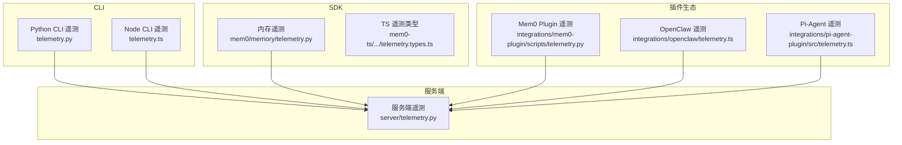
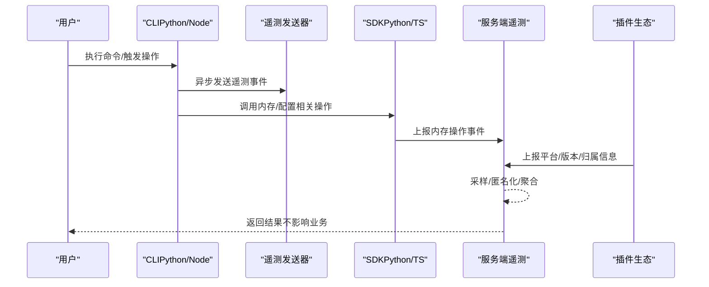
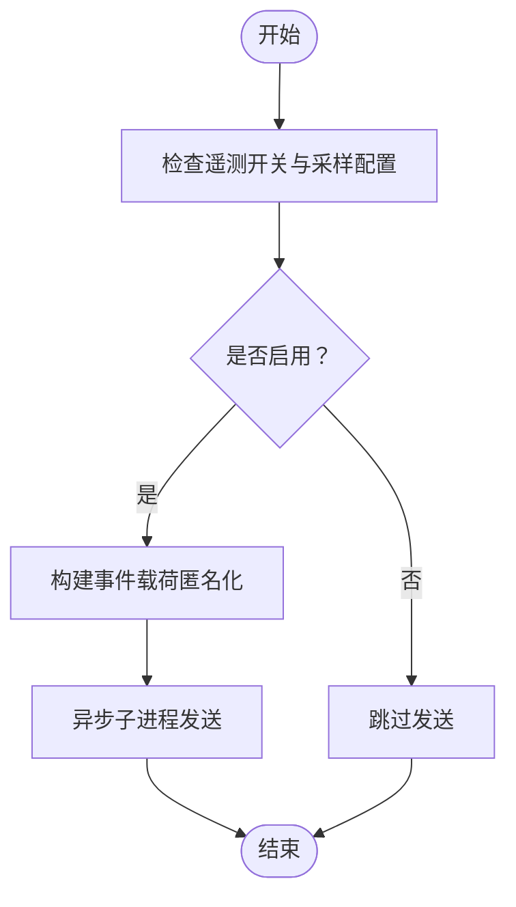
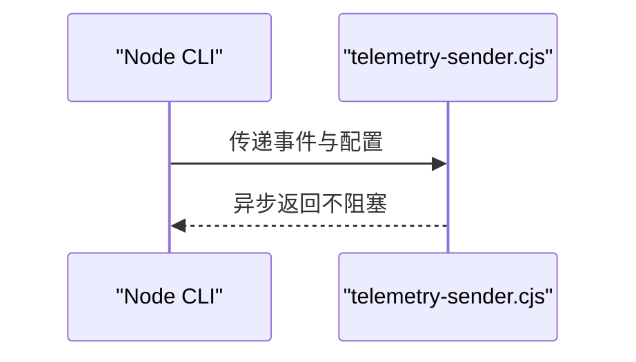
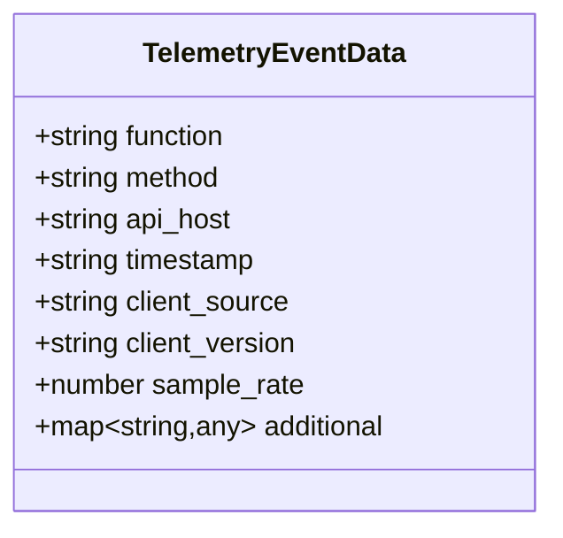
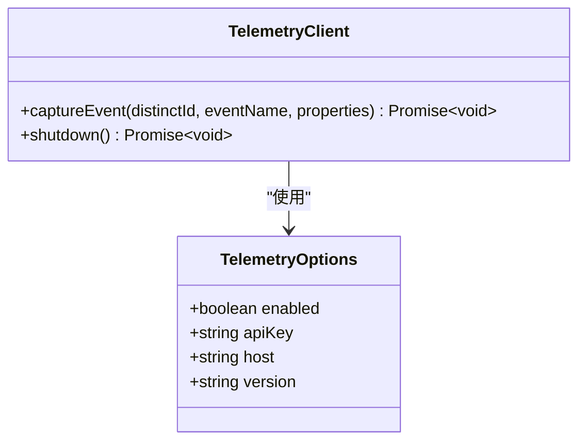
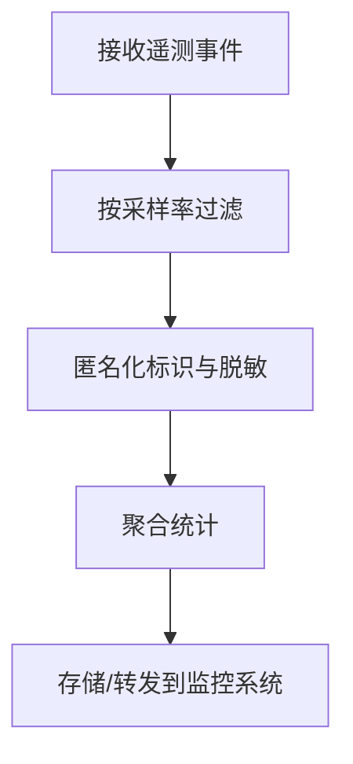
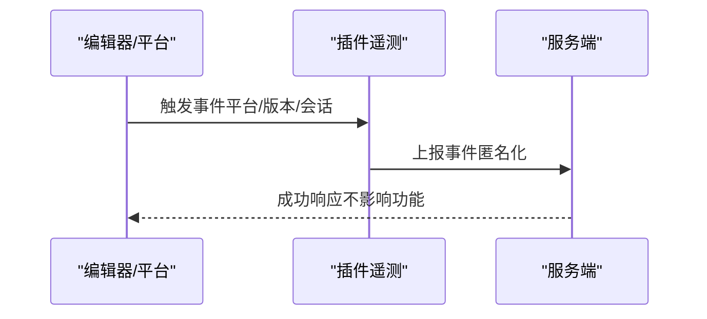
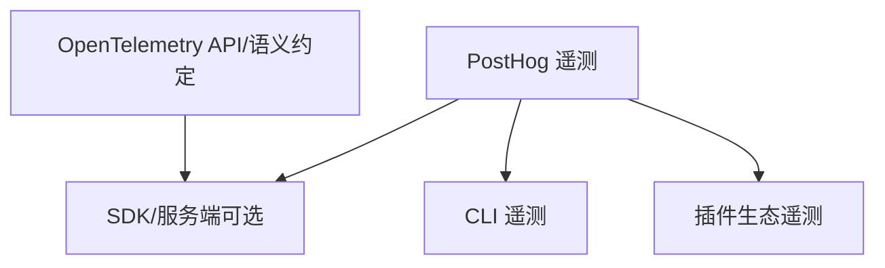

# 可观测性工具

<cite>
**本文引用的文件**
- [cli/python/src/mem0_cli/telemetry.py](file://cli/python/src/mem0_cli/telemetry.py)
- [cli/python/src/mem0_cli/telemetry_sender.py](file://cli/python/src/mem0_cli/telemetry_sender.py)
- [cli/node/src/telemetry.ts](file://cli/node/src/telemetry.ts)
- [cli/node/src/telemetry-sender.cjs](file://cli/node/src/telemetry-sender.cjs)
- [cli/python/src/mem0_cli/app.py](file://cli/python/src/mem0_cli/app.py)
- [cli/python/src/mem0_cli/config.py](file://cli/python/src/mem0_cli/config.py)
- [cli/node/src/config.ts](file://cli/node/src/config.ts)
- [integrations/mem0-plugin/scripts/telemetry.py](file://integrations/mem0-plugin/scripts/telemetry.py)
- [integrations/mem0-plugin/telemetry.ts](file://integrations/mem0-plugin/telemetry.ts)
- [integrations/openclaw/telemetry.ts](file://integrations/openclaw/telemetry.ts)
- [integrations/pi-agent-plugin/src/telemetry.ts](file://integrations/pi-agent-plugin/src/telemetry.ts)
- [mem0/memory/telemetry.py](file://mem0/memory/telemetry.py)
- [server/telemetry.py](file://server/telemetry.py)
- [tests/test_telemetry.py](file://tests/test_telemetry.py)
- [tests/test_telemetry_aliasing.py](file://tests/test_telemetry_aliasing.py)
- [tests/test_telemetry_sampling.py](file://tests/test_telemetry_sampling.py)
- [mem0-ts/src/oss/src/utils/telemetry.ts](file://mem0-ts/src/oss/src/utils/telemetry.ts)
- [mem0-ts/src/oss/src/utils/telemetry.types.ts](file://mem0-ts/src/oss/src/utils/telemetry.types.ts)
- [poetry.lock](file://poetry.lock)
</cite>

## 目录
1. [简介](#简介)
2. [项目结构](#项目结构)
3. [核心组件](#核心组件)
4. [架构总览](#架构总览)
5. [详细组件分析](#详细组件分析)
6. [依赖关系分析](#依赖关系分析)
7. [性能考量](#性能考量)
8. [故障排查指南](#故障排查指南)
9. [结论](#结论)
10. [附录](#附录)

## 简介
本指南面向使用 Mem0 的开发者与运维人员，系统讲解 Mem0 提供的可观测性能力与使用方法，重点覆盖：
- 内置遥测系统：采集范围、采样策略、匿名化与隐私保护、配置与禁用方式
- 第三方监控集成：Prometheus/Grafana、APM（如 OpenTelemetry 生态）等
- 自定义指标与告警：如何扩展指标体系与设置告警规则
- 分布式追踪：基于 OpenTelemetry 的链路追踪实践
- 监控仪表板设计：关键指标与可视化建议

## 项目结构
Mem0 在多语言与多组件中提供了可观测性支持：
- CLI（Python/Node）：命令行遥测事件发送与配置
- SDK（Python/TypeScript）：内存模块遥测与类型定义
- 服务端（Server）：平台级遥测入口
- 插件生态（OpenClaw、Pi-Agent、Mem0 Plugin）：遥测采集与平台归属
- 测试：遥测行为、别名与采样测试

图表来源
- [cli/python/src/mem0_cli/telemetry.py](file://cli/python/src/mem0_cli/telemetry.py)
- [cli/node/src/telemetry.ts](file://cli/node/src/telemetry.ts)
- [mem0/memory/telemetry.py](file://mem0/memory/telemetry.py)
- [server/telemetry.py](file://server/telemetry.py)
- [integrations/mem0-plugin/scripts/telemetry.py](file://integrations/mem0-plugin/scripts/telemetry.py)
- [integrations/openclaw/telemetry.ts](file://integrations/openclaw/telemetry.ts)
- [integrations/pi-agent-plugin/src/telemetry.ts](file://integrations/pi-agent-plugin/src/telemetry.ts)

章节来源
- [cli/python/src/mem0_cli/telemetry.py](file://cli/python/src/mem0_cli/telemetry.py)
- [cli/node/src/telemetry.ts](file://cli/node/src/telemetry.ts)
- [mem0/memory/telemetry.py](file://mem0/memory/telemetry.py)
- [server/telemetry.py](file://server/telemetry.py)
- [integrations/mem0-plugin/scripts/telemetry.py](file://integrations/mem0-plugin/scripts/telemetry.py)
- [integrations/openclaw/telemetry.ts](file://integrations/openclaw/telemetry.ts)
- [integrations/pi-agent-plugin/src/telemetry.ts](file://integrations/pi-agent-plugin/src/telemetry.ts)

## 核心组件
- CLI 遥测（Python/Node）
  - Python CLI 使用独立发送脚本，父进程退出后子进程继续发送，确保不阻塞主流程
  - Node CLI 通过子进程脚本发送遥测，支持匿名标识与采样
- SDK 遥测（Python/TypeScript）
  - Python SDK 内存模块提供遥测接口，便于在内存操作路径上埋点
  - TypeScript 定义遥测客户端接口、事件数据结构与选项
- 服务端遥测
  - 平台侧统一接收与处理来自各组件的遥测事件
- 插件生态遥测
  - OpenClaw、Pi-Agent、Mem0 Plugin 各自实现遥测采集与上报逻辑，支持平台归属与版本识别

章节来源
- [cli/python/src/mem0_cli/telemetry.py](file://cli/python/src/mem0_cli/telemetry.py)
- [cli/python/src/mem0_cli/telemetry_sender.py](file://cli/python/src/mem0_cli/telemetry_sender.py)
- [cli/node/src/telemetry.ts](file://cli/node/src/telemetry.ts)
- [cli/node/src/telemetry-sender.cjs](file://cli/node/src/telemetry-sender.cjs)
- [mem0/memory/telemetry.py](file://mem0/memory/telemetry.py)
- [mem0-ts/src/oss/src/utils/telemetry.types.ts](file://mem0-ts/src/oss/src/utils/telemetry.types.ts)
- [server/telemetry.py](file://server/telemetry.py)
- [integrations/mem0-plugin/scripts/telemetry.py](file://integrations/mem0-plugin/scripts/telemetry.py)
- [integrations/openclaw/telemetry.ts](file://integrations/openclaw/telemetry.ts)
- [integrations/pi-agent-plugin/src/telemetry.ts](file://integrations/pi-agent-plugin/src/telemetry.ts)

## 架构总览
下图展示了从 CLI、SDK 到服务端与插件生态的遥测数据流，以及采样与匿名化处理。

图表来源
- [cli/python/src/mem0_cli/telemetry.py](file://cli/python/src/mem0_cli/telemetry.py)
- [cli/python/src/mem0_cli/telemetry_sender.py](file://cli/python/src/mem0_cli/telemetry_sender.py)
- [cli/node/src/telemetry.ts](file://cli/node/src/telemetry.ts)
- [cli/node/src/telemetry-sender.cjs](file://cli/node/src/telemetry-sender.cjs)
- [mem0/memory/telemetry.py](file://mem0/memory/telemetry.py)
- [server/telemetry.py](file://server/telemetry.py)
- [integrations/mem0-plugin/scripts/telemetry.py](file://integrations/mem0-plugin/scripts/telemetry.py)
- [integrations/openclaw/telemetry.ts](file://integrations/openclaw/telemetry.ts)
- [integrations/pi-agent-plugin/src/telemetry.ts](file://integrations/pi-agent-plugin/src/telemetry.ts)

## 详细组件分析

### CLI 遥测（Python）
- 发送机制
  - 使用独立发送脚本，父进程退出后子进程继续发送，避免阻塞 CLI 主流程
- 匿名化与采样
  - 默认采样率与匿名标识生成逻辑见测试与实现
- 配置与禁用
  - 支持通过环境变量或配置文件控制遥测开关与匿名 ID

图表来源
- [cli/python/src/mem0_cli/telemetry.py](file://cli/python/src/mem0_cli/telemetry.py)
- [cli/python/src/mem0_cli/telemetry_sender.py](file://cli/python/src/mem0_cli/telemetry_sender.py)
- [cli/python/src/mem0_cli/config.py](file://cli/python/src/mem0_cli/config.py)

章节来源
- [cli/python/src/mem0_cli/telemetry.py](file://cli/python/src/mem0_cli/telemetry.py)
- [cli/python/src/mem0_cli/telemetry_sender.py](file://cli/python/src/mem0_cli/telemetry_sender.py)
- [cli/python/src/mem0_cli/config.py](file://cli/python/src/mem0_cli/config.py)

### CLI 遥测（Node）
- 发送机制
  - 通过子进程脚本发送遥测，支持匿名标识与采样
- 配置与持久化
  - 配置项包含匿名 ID 字段，用于跨会话稳定匿名标识

图表来源
- [cli/node/src/telemetry.ts](file://cli/node/src/telemetry.ts)
- [cli/node/src/telemetry-sender.cjs](file://cli/node/src/telemetry-sender.cjs)
- [cli/node/src/config.ts](file://cli/node/src/config.ts)

章节来源
- [cli/node/src/telemetry.ts](file://cli/node/src/telemetry.ts)
- [cli/node/src/telemetry-sender.cjs](file://cli/node/src/telemetry-sender.cjs)
- [cli/node/src/config.ts](file://cli/node/src/config.ts)

### SDK 遥测（Python）
- 内存模块遥测接口
  - 提供在内存增删改查等关键路径上埋点的能力
- 事件数据结构
  - 包含函数名、方法名、客户端来源、版本、时间戳、采样率等字段

图表来源
- [mem0/memory/telemetry.py](file://mem0/memory/telemetry.py)
- [mem0-ts/src/oss/src/utils/telemetry.types.ts](file://mem0-ts/src/oss/src/utils/telemetry.types.ts)

章节来源
- [mem0/memory/telemetry.py](file://mem0/memory/telemetry.py)
- [mem0-ts/src/oss/src/utils/telemetry.types.ts](file://mem0-ts/src/oss/src/utils/telemetry.types.ts)

### SDK 遥测（TypeScript）
- 客户端接口
  - 定义 captureEvent 与 shutdown 方法
- 事件与选项
  - 支持启用/禁用、主机、API Key、版本等配置

图表来源
- [mem0-ts/src/oss/src/utils/telemetry.types.ts](file://mem0-ts/src/oss/src/utils/telemetry.types.ts)
- [mem0-ts/src/oss/src/utils/telemetry.ts](file://mem0-ts/src/oss/src/utils/telemetry.ts)

章节来源
- [mem0-ts/src/oss/src/utils/telemetry.types.ts](file://mem0-ts/src/oss/src/utils/telemetry.types.ts)
- [mem0-ts/src/oss/src/utils/telemetry.ts](file://mem0-ts/src/oss/src/utils/telemetry.ts)

### 服务端遥测
- 统一入口
  - 平台侧集中接收来自 CLI、SDK、插件的遥测事件
- 处理流程
  - 采样、匿名化、聚合与持久化

图表来源
- [server/telemetry.py](file://server/telemetry.py)

章节来源
- [server/telemetry.py](file://server/telemetry.py)

### 插件生态遥测
- Mem0 Plugin
  - 基于 PostHog 的匿名遥测，支持平台归属与版本识别
- OpenClaw
  - 提供遥测开关覆盖、匿名标识与事件刷新定时器
- Pi-Agent
  - 遥测批处理队列与 PII 安全错误载荷

图表来源
- [integrations/mem0-plugin/scripts/telemetry.py](file://integrations/mem0-plugin/scripts/telemetry.py)
- [integrations/openclaw/telemetry.ts](file://integrations/openclaw/telemetry.ts)
- [integrations/pi-agent-plugin/src/telemetry.ts](file://integrations/pi-agent-plugin/src/telemetry.ts)

章节来源
- [integrations/mem0-plugin/scripts/telemetry.py](file://integrations/mem0-plugin/scripts/telemetry.py)
- [integrations/openclaw/telemetry.ts](file://integrations/openclaw/telemetry.ts)
- [integrations/pi-agent-plugin/src/telemetry.ts](file://integrations/pi-agent-plugin/src/telemetry.ts)

## 依赖关系分析
- OpenTelemetry 生态
  - 项目依赖 OpenTelemetry API 与语义约定，可用于分布式追踪与指标导出
- 遥测相关依赖
  - CLI 与 SDK 遥测主要基于 PostHog；OpenTelemetry 为可选的追踪与指标导出能力

图表来源
- [poetry.lock](file://poetry.lock)

章节来源
- [poetry.lock](file://poetry.lock)

## 性能考量
- 采样策略
  - 默认采样率与参数保持一致，避免高基数事件对性能与成本的影响
- 异步发送
  - CLI 使用子进程发送遥测，保证主线程不被阻塞
- 匿名化与脱敏
  - 事件载荷中不包含敏感信息，降低合规风险与传输开销

章节来源
- [tests/test_telemetry_sampling.py](file://tests/test_telemetry_sampling.py)
- [cli/python/src/mem0_cli/telemetry.py](file://cli/python/src/mem0_cli/telemetry.py)
- [cli/node/src/telemetry.ts](file://cli/node/src/telemetry.ts)

## 故障排查指南
- 遥测未上报
  - 检查遥测开关与采样配置，确认匿名标识生成与缓存
  - 查看 CLI 子进程发送日志与返回状态
- 平台归属不正确
  - 插件遥测需确保平台检测逻辑与版本读取正确
- 数据异常或缺失
  - 对照测试用例，核对事件签名、别名与采样一致性

章节来源
- [tests/test_telemetry.py](file://tests/test_telemetry.py)
- [tests/test_telemetry_aliasing.py](file://tests/test_telemetry_aliasing.py)
- [tests/test_telemetry_sampling.py](file://tests/test_telemetry_sampling.py)
- [integrations/mem0-plugin/telemetry.ts](file://integrations/mem0-plugin/telemetry.ts)
- [integrations/openclaw/telemetry.ts](file://integrations/openclaw/telemetry.ts)
- [integrations/pi-agent-plugin/src/telemetry.ts](file://integrations/pi-agent-plugin/src/telemetry.ts)

## 结论
Mem0 的可观测性以“匿名、低开销、可扩展”为核心设计原则：通过 CLI、SDK、服务端与插件生态的协同，形成覆盖全链路的遥测体系；同时提供 OpenTelemetry 生态作为可选的分布式追踪与指标导出能力。结合采样与异步发送，既能满足运营洞察需求，又不会显著影响业务性能。

## 附录

### 内置遥测系统配置与使用
- CLI（Python/Node）
  - 通过配置文件或环境变量控制遥测开关与匿名 ID
  - 使用独立发送脚本，确保不阻塞主流程
- SDK（Python/TypeScript）
  - 在内存操作路径上埋点，事件包含函数名、方法名、客户端来源、版本、时间戳、采样率等
- 服务端
  - 统一接收、采样、匿名化与聚合，支持后续接入外部监控系统

章节来源
- [cli/python/src/mem0_cli/config.py](file://cli/python/src/mem0_cli/config.py)
- [cli/node/src/config.ts](file://cli/node/src/config.ts)
- [mem0/memory/telemetry.py](file://mem0/memory/telemetry.py)
- [mem0-ts/src/oss/src/utils/telemetry.types.ts](file://mem0-ts/src/oss/src/utils/telemetry.types.ts)
- [server/telemetry.py](file://server/telemetry.py)

### 第三方监控工具集成方案
- Prometheus
  - 将服务端遥测聚合后的指标导出为 Prometheus 可抓取格式，建立基础可用性与延迟指标
- Grafana
  - 基于 Prometheus 数据源创建仪表板，展示事件速率、错误率、P95/P99 延迟等
- APM（OpenTelemetry）
  - 使用 OpenTelemetry SDK 为关键服务端与 SDK 接入分布式追踪，导出到 Jaeger/Tempo 或 OTLP 兼容系统

章节来源
- [poetry.lock](file://poetry.lock)

### 自定义指标与告警规则
- 指标建议
  - 事件总量、事件速率、错误率、P95/P99 延迟、遥测采样率、平台分布占比
- 告警规则示例
  - 事件速率骤降、错误率超阈、延迟 P95 超过阈值、采样率异常波动

章节来源
- [server/telemetry.py](file://server/telemetry.py)

### 分布式追踪与性能分析
- 追踪实现
  - 使用 OpenTelemetry API 记录关键链路（CLI -> SDK -> 服务端），标注属性如平台、版本、采样率
- 性能分析
  - 结合 Grafana Trace 视图与指标面板，定位慢调用与热点路径

章节来源
- [poetry.lock](file://poetry.lock)
- [mem0-ts/src/oss/src/utils/telemetry.ts](file://mem0-ts/src/oss/src/utils/telemetry.ts)

### 监控仪表板设计与关键指标可视化
- 仪表板建议
  - 顶部展示总体事件趋势与错误率；中部展示平台/版本分布；底部展示延迟分位数
- 关键指标
  - 事件总数、事件速率、错误率、P95/P99 延迟、遥测采样率、匿名用户数

章节来源
- [server/telemetry.py](file://server/telemetry.py)