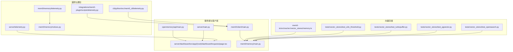
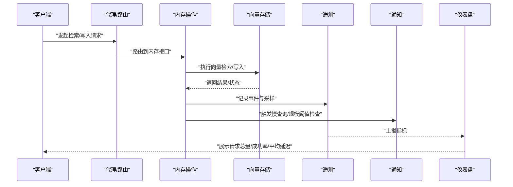
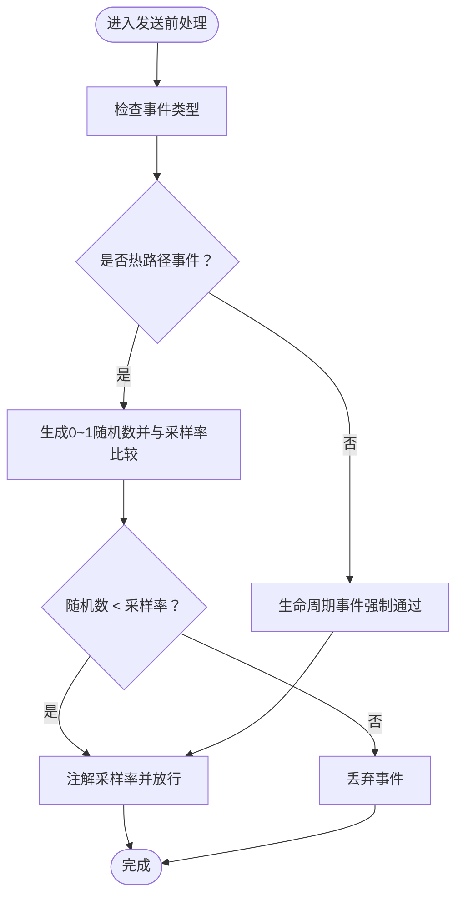
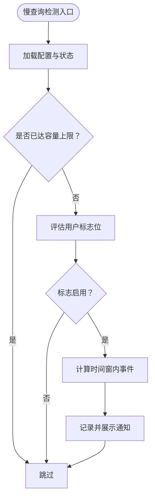
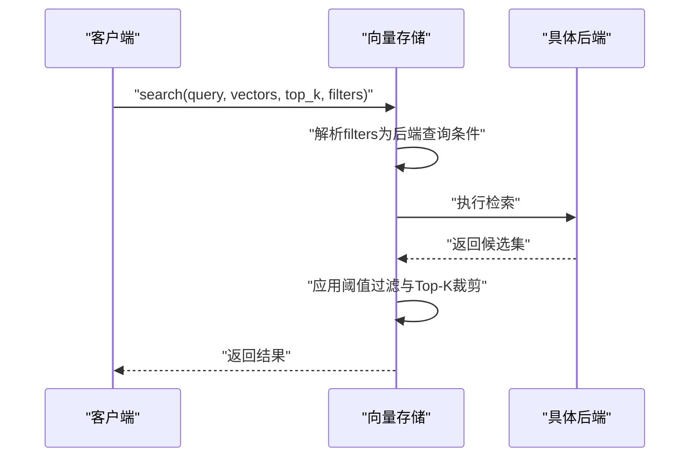
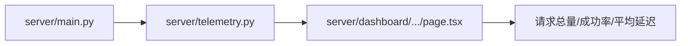
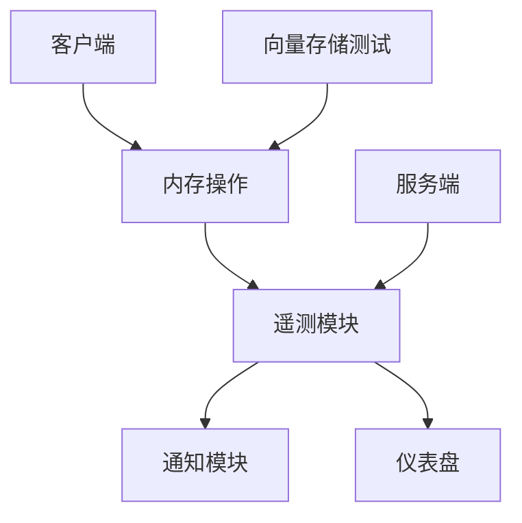

# 性能监控

<cite>
**本文引用的文件**
- [mem0/memory/telemetry.py](file://mem0/memory/telemetry.py)
- [tests/test_telemetry_sampling.py](file://tests/test_telemetry_sampling.py)
- [mem0/memory/notices.py](file://mem0/memory/notices.py)
- [server/telemetry.py](file://server/telemetry.py)
- [cli/python/src/mem0_cli/telemetry.py](file://cli/python/src/mem0_cli/telemetry.py)
- [integrations/mem0-plugin/scripts/telemetry.py](file://integrations/mem0-plugin/scripts/telemetry.py)
- [tests/vector_stores/test_e2e_threshold.py](file://tests/vector_stores/test_e2e_threshold.py)
- [tests/vector_stores/test_opensearch.py](file://tests/vector_stores/test_opensearch.py)
- [tests/vector_stores/test_pgvector.py](file://tests/vector_stores/test_pgvector.py)
- [tests/vector_stores/test_turbopuffer.py](file://tests/vector_stores/test_turbopuffer.py)
- [mem0-ts/src/oss/src/vector_stores/memory.ts](file://mem0-ts/src/oss/src/vector_stores/memory.ts)
- [server/dashboard/src/app/(root)/dashboard/requests/page.tsx](file://server/dashboard/src/app/(root)/dashboard/requests/page.tsx)
- [mem0/client/main.py](file://mem0/client/main.py)
- [mem0/memory/main.py](file://mem0/memory/main.py)
- [openmemory/api/main.py](file://openmemory/api/main.py)
- [server/main.py](file://server/main.py)
</cite>

## 目录
1. [简介](#简介)
2. [项目结构](#项目结构)
3. [核心组件](#核心组件)
4. [架构总览](#架构总览)
5. [详细组件分析](#详细组件分析)
6. [依赖关系分析](#依赖关系分析)
7. [性能考量](#性能考量)
8. [故障排查指南](#故障排查指南)
9. [结论](#结论)
10. [附录](#附录)

## 简介
本指南聚焦于 Mem0 系统的性能监控与优化，覆盖以下关键领域：
- 向量检索性能：索引与查询策略、相似度阈值、过滤器开销、Top-K 影响
- 内存使用：客户端与服务端内存占用、缓存与持久化策略
- API 调用延迟与吞吐量：请求统计、成功率、平均延迟
- 遥测数据采集与分析：采样率、生命周期事件、慢查询告警
- 基准测试与优化：可复现的测试方法、参数调优建议
- 漏洞检测与瓶颈定位：内存泄漏检测思路、查询性能分析工具

## 项目结构
围绕性能监控，涉及的核心模块包括：
- 遥测与通知：Python 客户端、服务端、CLI 与插件的遥测实现；慢查询与规模阈值通知
- 向量存储层：多种后端（OpenSearch、pgvector、TurboPuffer 等）的检索行为与过滤逻辑
- 服务端仪表盘：请求总量、成功率、平均延迟等指标展示
- 客户端与代理：内存操作入口、代理路由与状态

图表来源
- [mem0/memory/telemetry.py](file://mem0/memory/telemetry.py)
- [server/telemetry.py](file://server/telemetry.py)
- [cli/python/src/mem0_cli/telemetry.py](file://cli/python/src/mem0_cli/telemetry.py)
- [integrations/mem0-plugin/scripts/telemetry.py](file://integrations/mem0-plugin/scripts/telemetry.py)
- [mem0/memory/notices.py](file://mem0/memory/notices.py)
- [tests/vector_stores/test_opensearch.py](file://tests/vector_stores/test_opensearch.py)
- [tests/vector_stores/test_pgvector.py](file://tests/vector_stores/test_pgvector.py)
- [tests/vector_stores/test_turbopuffer.py](file://tests/vector_stores/test_turbopuffer.py)
- [tests/vector_stores/test_e2e_threshold.py](file://tests/vector_stores/test_e2e_threshold.py)
- [mem0-ts/src/oss/src/vector_stores/memory.ts](file://mem0-ts/src/oss/src/vector_stores/memory.ts)
- [server/dashboard/src/app/(root)/dashboard/requests/page.tsx](file://server/dashboard/src/app/(root)/dashboard/requests/page.tsx)
- [mem0/client/main.py](file://mem0/client/main.py)
- [mem0/memory/main.py](file://mem0/memory/main.py)
- [openmemory/api/main.py](file://openmemory/api/main.py)
- [server/main.py](file://server/main.py)

章节来源
- [mem0/memory/telemetry.py](file://mem0/memory/telemetry.py)
- [server/telemetry.py](file://server/telemetry.py)
- [cli/python/src/mem0_cli/telemetry.py](file://cli/python/src/mem0_cli/telemetry.py)
- [integrations/mem0-plugin/scripts/telemetry.py](file://integrations/mem0-plugin/scripts/telemetry.py)
- [mem0/memory/notices.py](file://mem0/memory/notices.py)
- [tests/vector_stores/test_opensearch.py](file://tests/vector_stores/test_opensearch.py)
- [tests/vector_stores/test_pgvector.py](file://tests/vector_stores/test_pgvector.py)
- [tests/vector_stores/test_turbopuffer.py](file://tests/vector_stores/test_turbopuffer.py)
- [tests/vector_stores/test_e2e_threshold.py](file://tests/vector_stores/test_e2e_threshold.py)
- [mem0-ts/src/oss/src/vector_stores/memory.ts](file://mem0-ts/src/oss/src/vector_stores/memory.ts)
- [server/dashboard/src/app/(root)/dashboard/requests/page.tsx](file://server/dashboard/src/app/(root)/dashboard/requests/page.tsx)
- [mem0/client/main.py](file://mem0/client/main.py)
- [mem0/memory/main.py](file://mem0/memory/main.py)
- [openmemory/api/main.py](file://openmemory/api/main.py)
- [server/main.py](file://server/main.py)

## 核心组件
- 遥测采样与发送：支持默认采样率、热路径事件采样、生命周期事件强制通过、属性注解与缺失保护
- 慢查询与规模阈值通知：基于时间窗口与上限的告警控制，避免噪声
- 向量检索行为：多后端一致的搜索流程、阈值过滤、Top-K 控制、过滤器解析
- 服务端仪表盘：请求总量、成功率、平均延迟等关键指标
- 客户端与代理：统一的内存操作入口与代理路由

章节来源
- [mem0/memory/telemetry.py](file://mem0/memory/telemetry.py)
- [tests/test_telemetry_sampling.py](file://tests/test_telemetry_sampling.py)
- [mem0/memory/notices.py](file://mem0/memory/notices.py)
- [tests/vector_stores/test_e2e_threshold.py](file://tests/vector_stores/test_e2e_threshold.py)
- [tests/vector_stores/test_opensearch.py](file://tests/vector_stores/test_opensearch.py)
- [tests/vector_stores/test_pgvector.py](file://tests/vector_stores/test_pgvector.py)
- [tests/vector_stores/test_turbopuffer.py](file://tests/vector_stores/test_turbopuffer.py)
- [mem0-ts/src/oss/src/vector_stores/memory.ts](file://mem0-ts/src/oss/src/vector_stores/memory.ts)
- [server/dashboard/src/app/(root)/dashboard/requests/page.tsx](file://server/dashboard/src/app/(root)/dashboard/requests/page.tsx)
- [mem0/client/main.py](file://mem0/client/main.py)
- [mem0/memory/main.py](file://mem0/memory/main.py)
- [openmemory/api/main.py](file://openmemory/api/main.py)
- [server/main.py](file://server/main.py)

## 架构总览
下图展示了从客户端到服务端再到向量存储的典型调用链路，以及遥测与通知在其中的位置。

图表来源
- [mem0/client/main.py](file://mem0/client/main.py)
- [mem0/memory/main.py](file://mem0/memory/main.py)
- [mem0/memory/telemetry.py](file://mem0/memory/telemetry.py)
- [mem0/memory/notices.py](file://mem0/memory/notices.py)
- [server/dashboard/src/app/(root)/dashboard/requests/page.tsx](file://server/dashboard/src/app/(root)/dashboard/requests/page.tsx)

## 详细组件分析

### 遥测采样与发送
- 默认采样率与热路径事件：热路径事件按默认采样率随机放行，生命周期事件强制通过
- 属性注解与缺失保护：确保消息包含 properties 字段，并正确注入采样率
- 测试覆盖：对采样门限、零采样率、一采样率、缺失字段等边界条件进行验证

图表来源
- [mem0/memory/telemetry.py](file://mem0/memory/telemetry.py)
- [tests/test_telemetry_sampling.py](file://tests/test_telemetry_sampling.py)

章节来源
- [mem0/memory/telemetry.py](file://mem0/memory/telemetry.py)
- [tests/test_telemetry_sampling.py](file://tests/test_telemetry_sampling.py)
- [cli/python/src/mem0_cli/telemetry.py](file://cli/python/src/mem0_cli/telemetry.py)
- [integrations/mem0-plugin/scripts/telemetry.py](file://integrations/mem0-plugin/scripts/telemetry.py)

### 慢查询与规模阈值通知
- 慢查询检测：以时间窗与上限控制告警频率，避免噪声
- 规模阈值检测：基于 Top-K 与内存数量阈值触发提示
- 通知展示：通过遥测平台评估标志位决定是否展示

图表来源
- [mem0/memory/notices.py](file://mem0/memory/notices.py)

章节来源
- [mem0/memory/notices.py](file://mem0/memory/notices.py)

### 向量检索性能
- 多后端一致性：OpenSearch、pgvector、TurboPuffer 等均提供 search 接口与过滤能力
- 过滤器解析：TypeScript 实现中支持等值、范围、集合、包含等多种比较运算符
- 阈值与排序：端到端测试验证相似度分数非负、降序排列、阈值过滤生效

图表来源
- [tests/vector_stores/test_opensearch.py](file://tests/vector_stores/test_opensearch.py)
- [tests/vector_stores/test_pgvector.py](file://tests/vector_stores/test_pgvector.py)
- [tests/vector_stores/test_turbopuffer.py](file://tests/vector_stores/test_turbopuffer.py)
- [tests/vector_stores/test_e2e_threshold.py](file://tests/vector_stores/test_e2e_threshold.py)
- [mem0-ts/src/oss/src/vector_stores/memory.ts](file://mem0-ts/src/oss/src/vector_stores/memory.ts)

章节来源
- [tests/vector_stores/test_opensearch.py](file://tests/vector_stores/test_opensearch.py)
- [tests/vector_stores/test_pgvector.py](file://tests/vector_stores/test_pgvector.py)
- [tests/vector_stores/test_turbopuffer.py](file://tests/vector_stores/test_turbopuffer.py)
- [tests/vector_stores/test_e2e_threshold.py](file://tests/vector_stores/test_e2e_threshold.py)
- [mem0-ts/src/oss/src/vector_stores/memory.ts](file://mem0-ts/src/oss/src/vector_stores/memory.ts)

### 服务端仪表盘与指标
- 请求总量、成功率、平均延迟：仪表盘页面直接展示关键指标
- 数据来源：服务端遥测模块汇总并上报

图表来源
- [server/main.py](file://server/main.py)
- [server/telemetry.py](file://server/telemetry.py)
- [server/dashboard/src/app/(root)/dashboard/requests/page.tsx](file://server/dashboard/src/app/(root)/dashboard/requests/page.tsx)

章节来源
- [server/dashboard/src/app/(root)/dashboard/requests/page.tsx](file://server/dashboard/src/app/(root)/dashboard/requests/page.tsx)
- [server/telemetry.py](file://server/telemetry.py)
- [server/main.py](file://server/main.py)

### 客户端与代理
- 客户端入口：统一的内存操作 API
- 代理路由：将请求转发至后端或 OpenMemory API

章节来源
- [mem0/client/main.py](file://mem0/client/main.py)
- [openmemory/api/main.py](file://openmemory/api/main.py)
- [mem0/memory/main.py](file://mem0/memory/main.py)

## 依赖关系分析
- 遥测模块被通知模块与客户端/服务端广泛依赖，形成“事件采集—告警—可视化”的闭环
- 向量存储测试覆盖多后端，保证检索行为的一致性与稳定性
- 仪表盘依赖服务端遥测输出，形成可观测性闭环

图表来源
- [mem0/memory/telemetry.py](file://mem0/memory/telemetry.py)
- [mem0/memory/notices.py](file://mem0/memory/notices.py)
- [server/telemetry.py](file://server/telemetry.py)
- [server/dashboard/src/app/(root)/dashboard/requests/page.tsx](file://server/dashboard/src/app/(root)/dashboard/requests/page.tsx)
- [mem0/client/main.py](file://mem0/client/main.py)
- [mem0/memory/main.py](file://mem0/memory/main.py)
- [tests/vector_stores/test_opensearch.py](file://tests/vector_stores/test_opensearch.py)

章节来源
- [mem0/memory/telemetry.py](file://mem0/memory/telemetry.py)
- [mem0/memory/notices.py](file://mem0/memory/notices.py)
- [server/telemetry.py](file://server/telemetry.py)
- [server/dashboard/src/app/(root)/dashboard/requests/page.tsx](file://server/dashboard/src/app/(root)/dashboard/requests/page.tsx)
- [mem0/client/main.py](file://mem0/client/main.py)
- [mem0/memory/main.py](file://mem0/memory/main.py)
- [tests/vector_stores/test_opensearch.py](file://tests/vector_stores/test_opensearch.py)

## 性能考量
- 向量检索
  - Top-K 与阈值：较大的 Top-K 会增加排序与过滤成本；合理设置阈值可减少无效结果
  - 过滤器复杂度：复合过滤器与字符串包含操作可能带来额外 CPU 开销
  - 后端选择：不同后端在高维向量与大规模数据上的表现差异较大
- 内存使用
  - 客户端与服务端：关注对象生命周期与缓存大小，避免长期内存增长
  - 向量维度：维度越高，向量存储与检索的内存与带宽压力越大
- API 延迟与吞吐
  - 采样率：在高负载场景下调低采样率可降低遥测开销
  - 并发与批处理：合理批量化检索与写入，提升吞吐
- 可观测性
  - 指标：请求总量、成功率、平均延迟、慢查询次数
  - 告警：基于时间窗与上限的慢查询与规模阈值通知

[本节为通用指导，无需列出章节来源]

## 故障排查指南
- 慢查询告警未出现
  - 检查通知标志位是否启用、是否达到容量上限、时间窗内事件数量是否足够
- 采样率异常
  - 确认默认采样率与热路径事件采样逻辑，检查缺失 properties 的注解行为
- 检索结果异常
  - 核对阈值过滤与 Top-K 设置，确认后端返回分数范围与排序
- 仪表盘无数据
  - 检查服务端遥测模块是否正常运行与数据上报

章节来源
- [mem0/memory/notices.py](file://mem0/memory/notices.py)
- [tests/test_telemetry_sampling.py](file://tests/test_telemetry_sampling.py)
- [tests/vector_stores/test_e2e_threshold.py](file://tests/vector_stores/test_e2e_threshold.py)
- [server/telemetry.py](file://server/telemetry.py)

## 结论
通过遥测采样、慢查询与规模阈值通知、多后端向量检索测试以及服务端仪表盘，Mem0 提供了完整的性能监控与优化基础。建议在生产环境中结合采样率调优、阈值与 Top-K 参数优化、过滤器简化与后端选型，持续跟踪关键指标并迭代优化。

[本节为总结性内容，无需列出章节来源]

## 附录

### 性能基准测试实施方法
- 端到端检索基准
  - 准备固定维度与数量的向量集，分别在不同后端执行检索，记录平均延迟与吞吐
  - 变更 Top-K、阈值与过滤器复杂度，对比性能变化
- 遥测采样影响
  - 在不同采样率下重复检索，观察指标上报量与系统资源占用变化
- 通知告警基线
  - 在可控负载下触发慢查询与规模阈值，记录告警频率与展示效果

章节来源
- [tests/vector_stores/test_opensearch.py](file://tests/vector_stores/test_opensearch.py)
- [tests/vector_stores/test_pgvector.py](file://tests/vector_stores/test_pgvector.py)
- [tests/vector_stores/test_turbopuffer.py](file://tests/vector_stores/test_turbopuffer.py)
- [tests/vector_stores/test_e2e_threshold.py](file://tests/vector_stores/test_e2e_threshold.py)
- [tests/test_telemetry_sampling.py](file://tests/test_telemetry_sampling.py)

### 内存泄漏检测与系统瓶颈识别
- 内存泄漏检测
  - 使用进程级内存采样工具定期采集客户端与服务端内存曲线，观察是否存在持续上升
  - 关注大对象（向量数组、缓存字典）生命周期，避免循环引用
- 查询性能分析
  - 利用后端原生分析工具（如 EXPLAIN/EXPLAIN ANALYZE）查看检索 SQL 或查询 DSL 的执行计划
  - 对比不同 Top-K、阈值与过滤器组合下的执行时间
- 瓶颈识别
  - 仪表盘观察平均延迟与错误率趋势，结合遥测事件分布定位热点路径
  - 在高负载场景下逐步放宽采样率，观察系统资源与指标变化

[本节为通用指导，无需列出章节来源]