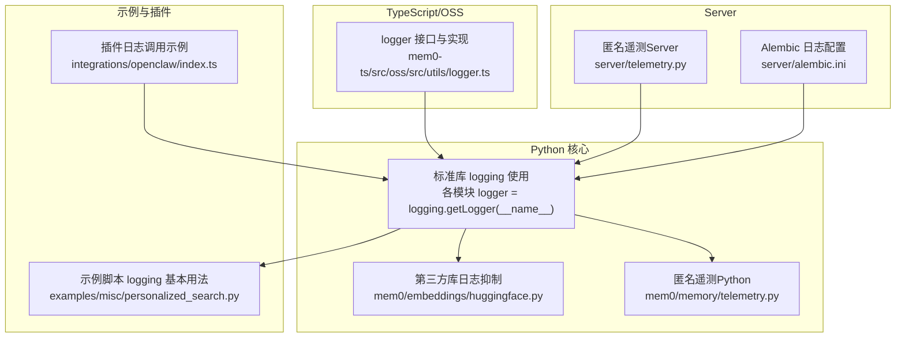
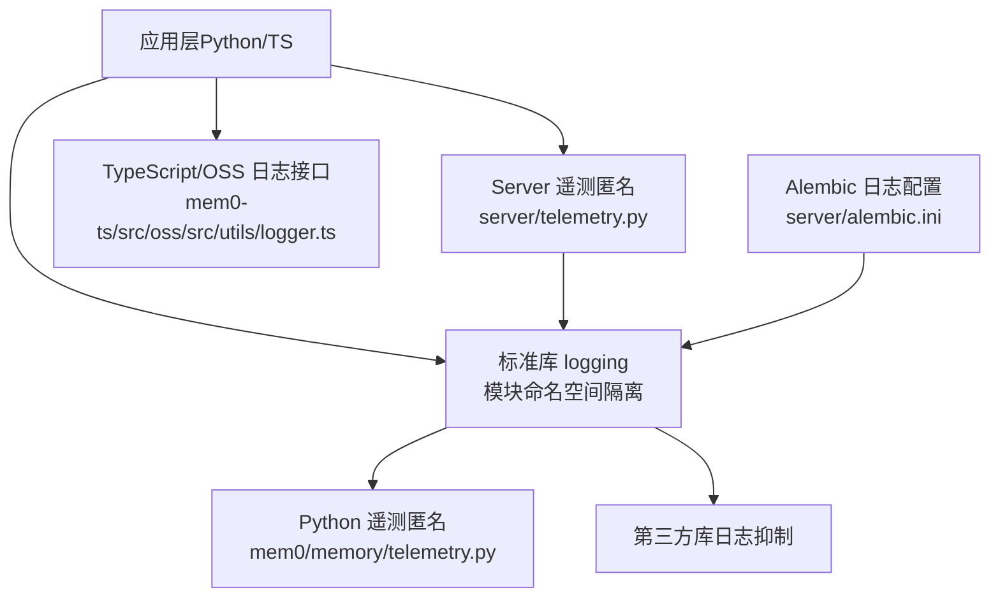
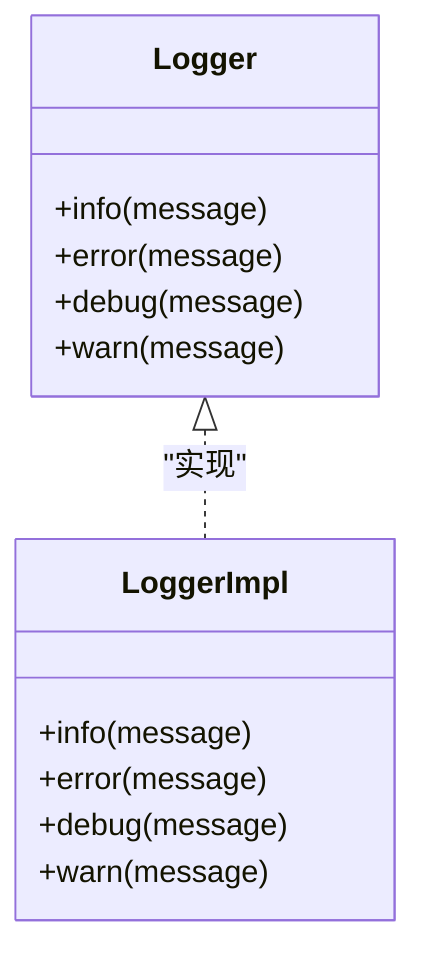
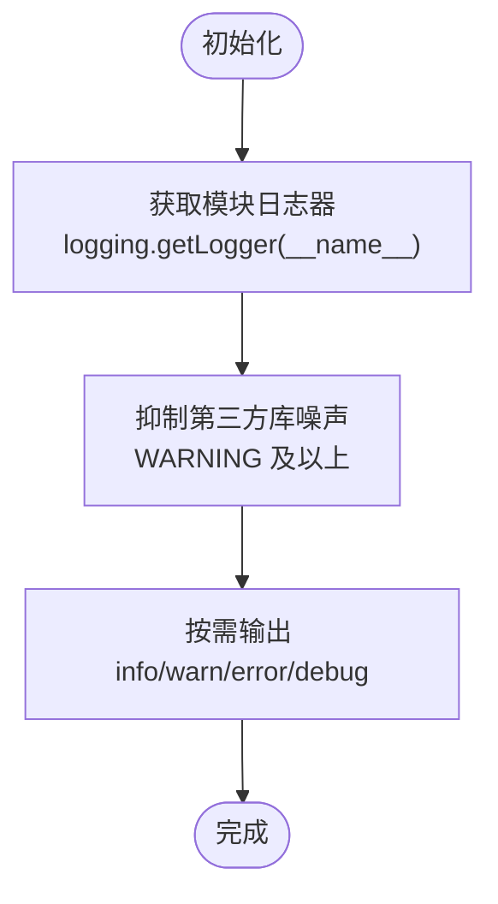
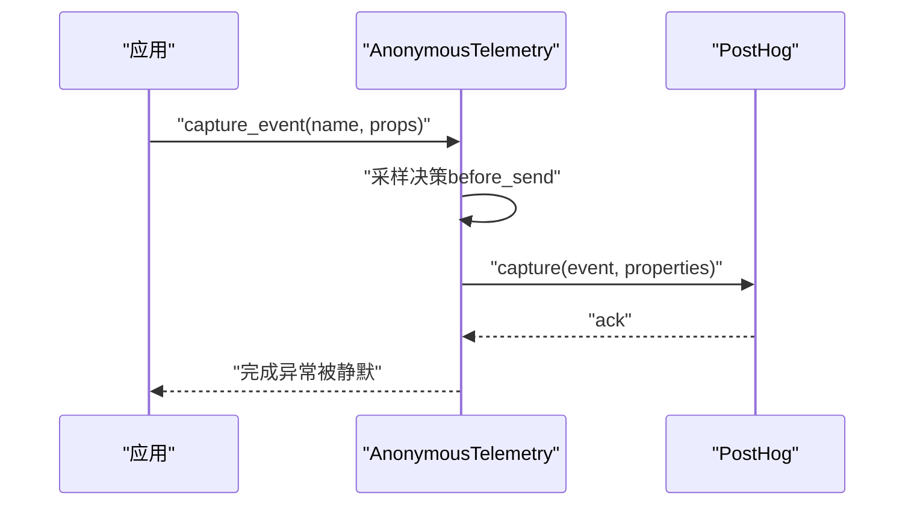
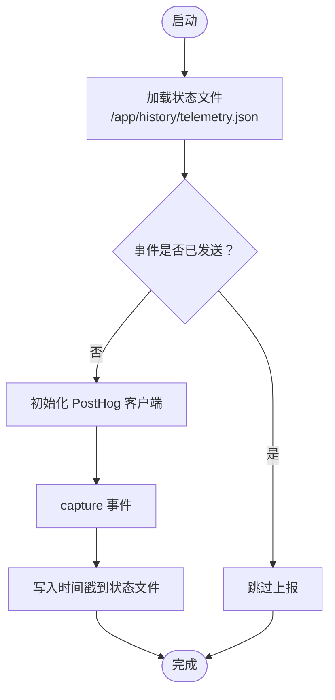
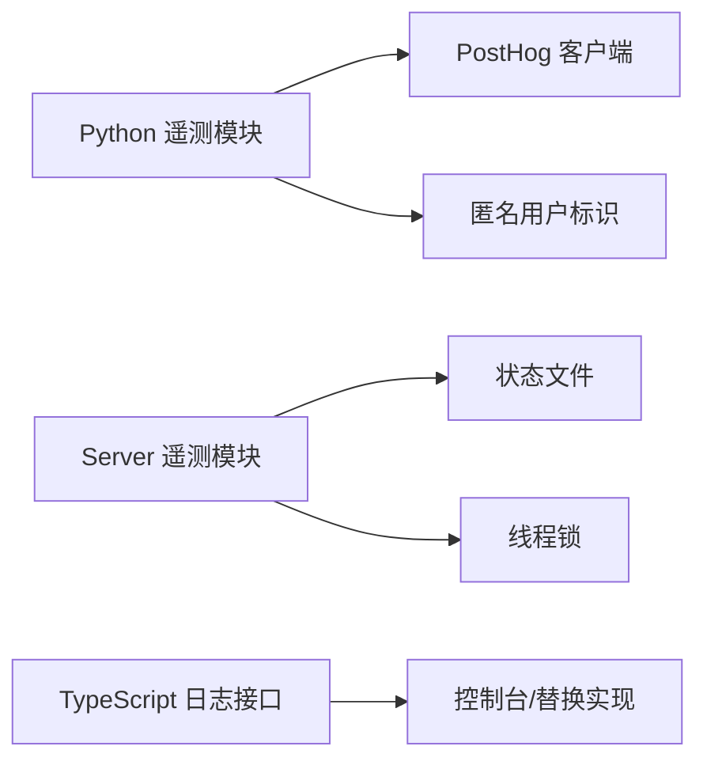

# 日志管理

<cite>
**本文引用的文件**
- [mem0-ts 源码中的日志接口与实现](file://mem0-ts/src/oss/src/utils/logger.ts)
- [Python 客户端遥测与日志（匿名遥测）](file://mem0/memory/telemetry.py)
- [服务端遥测与状态持久化](file://server/telemetry.py)
- [Alembic 日志配置示例](file://server/alembic.ini)
- [嵌入模型加载时的第三方库日志抑制](file://mem0/embeddings/huggingface.py)
- [示例脚本中标准库 logging 的使用](file://examples/misc/personalized_search.py)
- [OpenCLAW 插件中的日志调用示例](file://integrations/openclaw/index.ts)
</cite>

## 目录
1. [简介](#简介)
2. [项目结构](#项目结构)
3. [核心组件](#核心组件)
4. [架构总览](#架构总览)
5. [详细组件分析](#详细组件分析)
6. [依赖关系分析](#依赖关系分析)
7. [性能考量](#性能考量)
8. [故障排查指南](#故障排查指南)
9. [结论](#结论)
10. [附录](#附录)

## 简介
本指南面向 Mem0 系统的开发者与运维人员，系统性阐述日志记录策略、级别使用场景与配置方法，给出日志格式标准化与结构化日志的实现建议，并覆盖日志轮转、存储管理、日志分析与可视化、问题诊断与审计、监控告警等实践路径。文档同时结合仓库内现有日志与遥测实现，提供可落地的最佳实践。

## 项目结构
Mem0 在多语言与多子系统中采用“按需自定义日志”与“标准库 logging”相结合的方式：
- TypeScript/OSS 层：提供轻量级日志接口与默认实现，便于在浏览器或 Node 环境中统一输出。
- Python 层：广泛使用标准库 logging；部分第三方库噪声较大，通过抑制日志级别降低噪音。
- 遥测模块：以匿名遥测为主，既作为日志的一种“远端聚合”，也用于运行指标采集与分析。
- 示例与插件：演示了标准库 logging 的基本用法与命名空间隔离。

图表来源
- [mem0-ts 源码中的日志接口与实现:1-14](file://mem0-ts/src/oss/src/utils/logger.ts#L1-L14)
- [Python 客户端遥测与日志（匿名遥测）:1-242](file://mem0/memory/telemetry.py#L1-L242)
- [服务端遥测与状态持久化:1-130](file://server/telemetry.py#L1-L130)
- [Alembic 日志配置示例:1-37](file://server/alembic.ini#L1-L37)
- [嵌入模型加载时的第三方库日志抑制:1-11](file://mem0/embeddings/huggingface.py#L1-L11)
- [示例脚本中标准库 logging 的使用:1-220](file://examples/misc/personalized_search.py#L1-L220)
- [OpenCLAW 插件中的日志调用示例:140-700](file://integrations/openclaw/index.ts#L140-L700)

章节来源
- [mem0-ts 源码中的日志接口与实现:1-14](file://mem0-ts/src/oss/src/utils/logger.ts#L1-L14)
- [Python 客户端遥测与日志（匿名遥测）:1-242](file://mem0/memory/telemetry.py#L1-L242)
- [服务端遥测与状态持久化:1-130](file://server/telemetry.py#L1-L130)
- [Alembic 日志配置示例:1-37](file://server/alembic.ini#L1-L37)
- [嵌入模型加载时的第三方库日志抑制:1-11](file://mem0/embeddings/huggingface.py#L1-L11)
- [示例脚本中标准库 logging 的使用:1-220](file://examples/misc/personalized_search.py#L1-L220)
- [OpenCLAW 插件中的日志调用示例:140-700](file://integrations/openclaw/index.ts#L140-L700)

## 核心组件
- TypeScript/OSS 轻量日志接口：定义 info/error/debug/warn 四级方法，默认实现输出到控制台，便于在前端或 Node 环境快速接入。
- Python 标准库日志：各模块通过 logging.getLogger(__name__) 获取命名空间日志器，避免全局污染，支持按模块精细控制级别与处理器。
- 第三方库日志抑制：针对 transformers/sentence_transformers/huggingface_hub 等库设置 WARNING 及以上级别，减少无关噪声。
- 匿名遥测：通过 PostHog 发送匿名事件，包含采样与生命周期事件保护逻辑，既可用于运行指标分析，也可作为日志的远端聚合。
- Alembic 日志配置：提供 SQLAlchemy 与 Alembic 的日志级别与格式示例，便于迁移阶段的可观测性。

章节来源
- [mem0-ts 源码中的日志接口与实现:1-14](file://mem0-ts/src/oss/src/utils/logger.ts#L1-L14)
- [Python 客户端遥测与日志（匿名遥测）:1-242](file://mem0/memory/telemetry.py#L1-L242)
- [服务端遥测与状态持久化:1-130](file://server/telemetry.py#L1-L130)
- [Alembic 日志配置示例:1-37](file://server/alembic.ini#L1-L37)
- [嵌入模型加载时的第三方库日志抑制:1-11](file://mem0/embeddings/huggingface.py#L1-L11)

## 架构总览
下图展示了日志与遥测在 Mem0 中的总体流向：应用层通过标准库 logging 输出；Python 遥测模块负责匿名事件采集与采样；Server 遥测负责安装态事件与状态持久化；TypeScript/OSS 提供统一日志接口；Alembic 提供数据库迁移阶段的日志配置参考。

图表来源
- [mem0-ts 源码中的日志接口与实现:1-14](file://mem0-ts/src/oss/src/utils/logger.ts#L1-L14)
- [Python 客户端遥测与日志（匿名遥测）:1-242](file://mem0/memory/telemetry.py#L1-L242)
- [服务端遥测与状态持久化:1-130](file://server/telemetry.py#L1-L130)
- [Alembic 日志配置示例:1-37](file://server/alembic.ini#L1-L37)

## 详细组件分析

### TypeScript/OSS 日志接口与实现
- 设计要点
  - 统一接口：info/error/debug/warn 四级方法，便于替换与扩展。
  - 默认实现：直接输出到控制台，带前缀标识，便于识别来源。
  - 适用场景：浏览器端、Node 端、CLI 工具等需要一致日志风格的环境。
- 最佳实践
  - 在业务模块中引入该 logger 并按需封装上下文字段。
  - 在生产环境可替换为更丰富的实现（如结构化输出、上报到日志平台）。

图表来源
- [mem0-ts 源码中的日志接口与实现:1-14](file://mem0-ts/src/oss/src/utils/logger.ts#L1-L14)

章节来源
- [mem0-ts 源码中的日志接口与实现:1-14](file://mem0-ts/src/oss/src/utils/logger.ts#L1-L14)

### Python 标准库日志与第三方库噪声抑制
- 设计要点
  - 模块级日志器：每个模块通过 logging.getLogger(__name__) 获取独立日志器，避免全局污染。
  - 噪声抑制：对 transformers/sentence_transformers/huggingface_hub 设置 WARNING 及以上级别，降低无关输出。
  - 示例脚本：examples/misc/personalized_search.py 展示了 basicConfig 的基础用法与命名空间日志器获取。
- 最佳实践
  - 在入口处集中配置 basicConfig 或使用更细粒度的 handlers/formatters。
  - 对关键路径（如内存检索、向量化、向量存储）增加结构化字段（如用户ID、集合名、耗时）。

图表来源
- [嵌入模型加载时的第三方库日志抑制:1-11](file://mem0/embeddings/huggingface.py#L1-L11)
- [示例脚本中标准库 logging 的使用:1-220](file://examples/misc/personalized_search.py#L1-L220)

章节来源
- [嵌入模型加载时的第三方库日志抑制:1-11](file://mem0/embeddings/huggingface.py#L1-L11)
- [示例脚本中标准库 logging 的使用:1-220](file://examples/misc/personalized_search.py#L1-L220)

### 匿名遥测（Python）
- 设计要点
  - 环境开关：MEM0_TELEMETRY 控制是否启用；MEM0_TELEMETRY_SAMPLE_RATE 控制热路径事件采样率。
  - 生命周期事件保护：$identify、mem0.init、mem0.reset 等始终发送，确保用户合并与生命周期可见。
  - before_send 采样钩子：随机门限控制热路径事件丢弃，同时为幸存事件附加 sample_rate 属性，便于后处理时反推总量。
  - 异常兜底：捕获所有异常，保证遥测失败不影响主流程。
- 最佳实践
  - 在生产环境谨慎调整采样率，平衡观测成本与覆盖率。
  - 将遥测事件与业务指标关联（如检索耗时、命中率），结合 sample_rate 进行归因与反推。

图表来源
- [Python 客户端遥测与日志（匿名遥测）:58-121](file://mem0/memory/telemetry.py#L58-L121)

章节来源
- [Python 客户端遥测与日志（匿名遥测）:1-242](file://mem0/memory/telemetry.py#L1-L242)

### 匿名遥测（Server）
- 设计要点
  - 仅发送两类安装态事件：admin_registered、onboarding_completed。
  - 使用本地 JSON 文件持久化已发送事件的时间戳，避免重复上报。
  - 通过锁保证并发安全；客户端初始化失败会降级为禁用。
- 最佳实践
  - 将状态文件放置在持久化卷上，避免容器重启丢失。
  - 结合 Dashboard 首次存储提示，引导用户进入管理界面进行审计与分析。

图表来源
- [服务端遥测与状态持久化:35-105](file://server/telemetry.py#L35-L105)

章节来源
- [服务端遥测与状态持久化:1-130](file://server/telemetry.py#L1-L130)

### Alembic 日志配置
- 设计要点
  - 提供 root/sqlalchemy/alembic 三类 logger 的级别与格式示例。
  - 适合在数据库迁移阶段开启更详细的日志以便排障。
- 最佳实践
  - 在 CI/CD 迁移任务中临时提升日志级别，完成后恢复默认。

章节来源
- [Alembic 日志配置示例:1-37](file://server/alembic.ini#L1-L37)

### OpenCLAW 插件中的日志调用
- 设计要点
  - 在关键生命周期（如技能模式开始、停止、召回失败）输出 info/warn 级别日志，便于定位集成问题。
- 最佳实践
  - 将插件日志与上游调用方（Agent/SDK）串联，形成端到端链路视图。

章节来源
- [OpenCLAW 插件中的日志调用示例:140-700](file://integrations/openclaw/index.ts#L140-L700)

## 依赖关系分析
- 模块耦合
  - Python 遥测模块依赖 PostHog 客户端与匿名用户标识生成逻辑，具备幂等关闭能力。
  - Server 遥测模块依赖本地状态文件与线程锁，确保进程内唯一性与一致性。
  - TypeScript/OSS 日志接口与具体实现解耦，便于替换为结构化日志或远程上报。
- 外部依赖
  - PostHog：用于匿名事件采集与特征标志请求。
  - logging：标准库日志框架，配合第三方库日志抑制策略。
- 循环依赖
  - 当前实现未见循环导入；若后续扩展，建议保持接口抽象与延迟初始化。

图表来源
- [Python 客户端遥测与日志（匿名遥测）:76-143](file://mem0/memory/telemetry.py#L76-L143)
- [服务端遥测与状态持久化:35-105](file://server/telemetry.py#L35-L105)
- [mem0-ts 源码中的日志接口与实现:1-14](file://mem0-ts/src/oss/src/utils/logger.ts#L1-L14)

章节来源
- [Python 客户端遥测与日志（匿名遥测）:1-242](file://mem0/memory/telemetry.py#L1-L242)
- [服务端遥测与状态持久化:1-130](file://server/telemetry.py#L1-L130)
- [mem0-ts 源码中的日志接口与实现:1-14](file://mem0-ts/src/oss/src/utils/logger.ts#L1-L14)

## 性能考量
- 采样与成本控制
  - Python 遥测通过采样率控制热路径事件数量，结合生命周期事件保护，兼顾覆盖率与成本。
  - Server 遥测仅发送安装态事件，避免运行期高频上报。
- I/O 与网络
  - 遥测上报为异步/后台线程，失败静默，避免阻塞主流程。
  - 建议在高吞吐场景下进一步降低采样率或限制事件类型。
- 日志级别与过滤
  - 通过抑制第三方库噪声与合理设置模块级别，减少磁盘与网络开销。

## 故障排查指南
- 无法连接遥测
  - 检查 MEM0_TELEMETRY 是否被设为禁用；确认网络可达 us.i.posthog.com。
  - 查看 Python 遥测模块的 debug 日志，确认 before_send 是否正确注入 sample_rate。
- 事件未到达
  - 确认事件名称是否属于生命周期事件（始终发送）。
  - 检查采样率是否为 0，或随机数是否超过阈值。
- Server 事件重复上报
  - 检查状态文件是否被清理或并发写入冲突；确认锁机制是否生效。
- 第三方库噪声过大
  - 确认已设置 WARNING 及以上级别；必要时在应用入口集中配置 basicConfig。
- 数据库迁移日志
  - 临时提升 Alembic/SQLAlchemy 日志级别，定位迁移失败原因。

章节来源
- [Python 客户端遥测与日志（匿名遥测）:58-121](file://mem0/memory/telemetry.py#L58-L121)
- [服务端遥测与状态持久化:35-105](file://server/telemetry.py#L35-L105)
- [Alembic 日志配置示例:1-37](file://server/alembic.ini#L1-L37)
- [嵌入模型加载时的第三方库日志抑制:1-11](file://mem0/embeddings/huggingface.py#L1-L11)

## 结论
Mem0 的日志体系以“模块化标准库日志 + 轻量 TS/OSS 日志接口 + 匿名遥测”为核心，既满足开发调试与生产可观测性的需求，又通过采样与噪声抑制控制成本。建议在生产环境中结合结构化日志、日志轮转与集中式日志平台，完善审计与告警闭环，并持续优化采样策略与日志级别配置。

## 附录

### 日志级别使用场景与配置建议
- TRACE/DEBUG：开发调试、链路追踪、参数检查（避免在生产开启高噪声 DEBUG）。
- INFO：关键流程节点、成功状态、首次存储提示（参考 Server 的仪表盘提示）。
- WARN：可恢复异常、边界条件、潜在风险（如召回失败、采样丢弃）。
- ERROR：不可恢复错误、异常堆栈、外部依赖失败。

配置建议
- 应用入口集中配置 basicConfig，设置格式与根级别。
- 按模块设置级别：核心模块 INFO，工具模块 WARNING，第三方库 WARNING。
- 生产环境优先使用结构化日志（JSON），便于解析与检索。

### 日志格式标准化与结构化日志
- 字段建议
  - 时间戳、级别、模块名、消息、trace_id/span_id、用户ID、资源ID、耗时、采样率（遥测相关）。
- 实现方式
  - 使用标准库 JSONFormatter 输出结构化日志。
  - 在业务层封装统一的结构化日志函数，自动注入公共字段。

### 日志轮转、存储管理与日志分析
- 轮转
  - 使用 RotatingFileHandler/WatchedRotatingFileHandler 或系统级 logrotate。
  - 按大小与时间双维度轮转，保留 N 份历史。
- 存储
  - 将日志目录映射到持久化卷；Server 遥测状态文件同理。
- 分析
  - 将结构化日志导入 ELK/BigQuery/Lakehouse，建立查询与可视化。
  - 结合采样率进行总量反推与趋势分析。

### 通过日志进行问题诊断与系统审计
- 诊断
  - 关键路径打点（检索、写入、更新、删除）；串联 trace_id。
  - 对异常路径补充上下文信息（输入参数、中间结果、外部依赖状态）。
- 审计
  - 记录用户操作、管理员行为、配置变更；保留一定周期。
  - 与遥测事件联动，形成端到端审计线索。

### 日志监控告警与可视化
- 告警
  - 错误率突增、关键依赖超时、采样丢弃比例异常、遥测上报失败。
  - 使用阈值与滑动窗口检测，结合告警通道（邮件/IM/电话）。
- 可视化
  - 仪表盘：吞吐、错误率、P95/P99 延迟、采样率、遥测事件分布。
  - 交互式查询：按用户/项目/时间范围钻取。