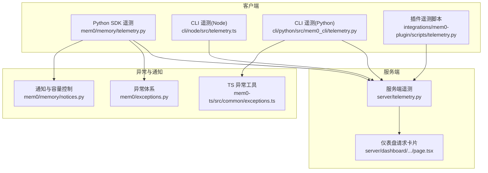
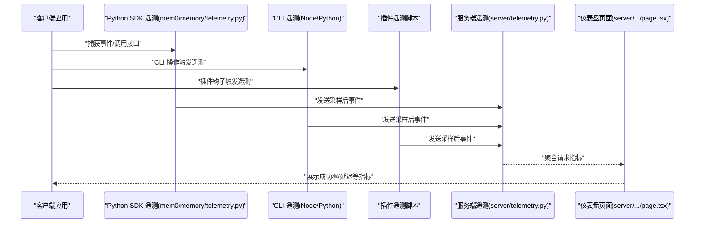
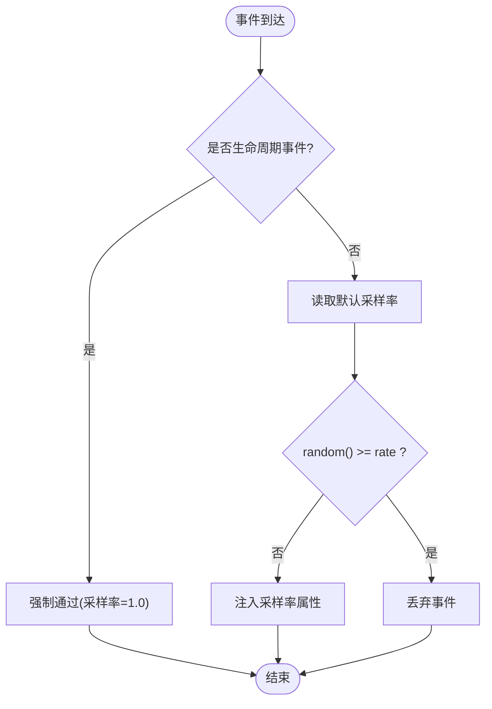
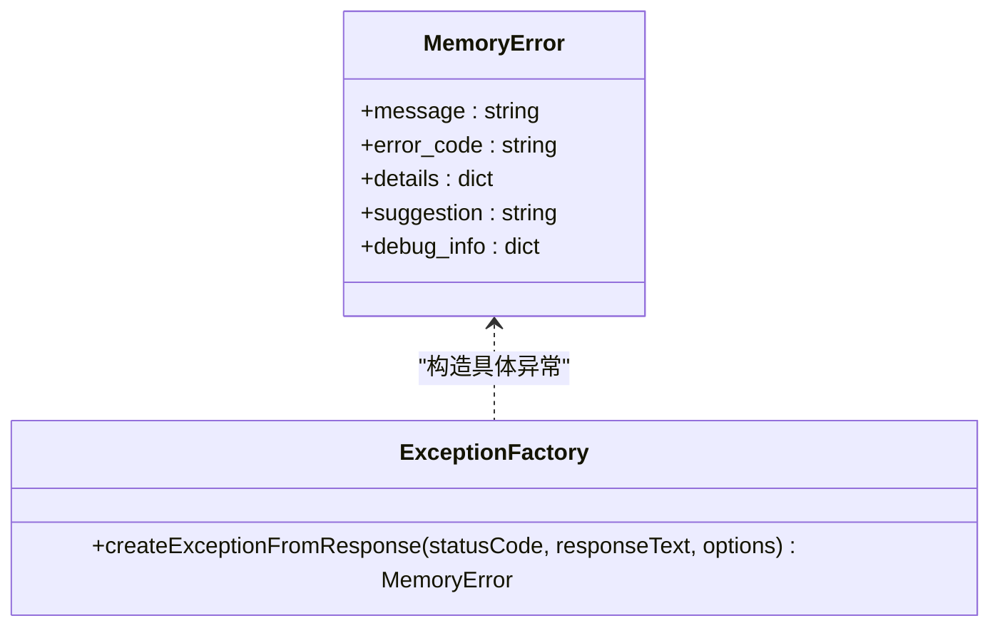
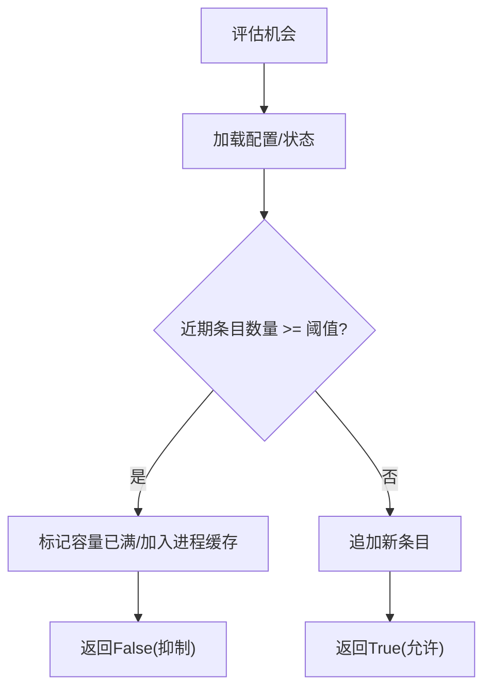
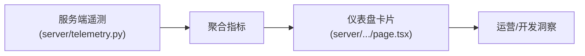
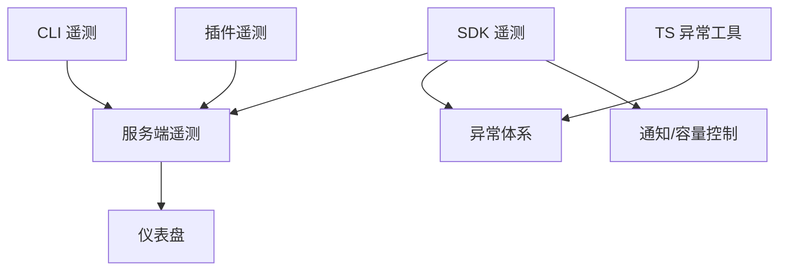

# 监控和调试

<cite>
**本文引用的文件**
- [mem0/memory/telemetry.py](file://mem0/memory/telemetry.py)
- [cli/node/src/telemetry.ts](file://cli/node/src/telemetry.ts)
- [cli/python/src/mem0_cli/telemetry.py](file://cli/python/src/mem0_cli/telemetry.py)
- [cli/python/src/mem0_cli/telemetry_sender.py](file://cli/python/src/mem0_cli/telemetry_sender.py)
- [integrations/mem0-plugin/scripts/telemetry.py](file://integrations/mem0-plugin/scripts/telemetry.py)
- [server/telemetry.py](file://server/telemetry.py)
- [mem0/exceptions.py](file://mem0/exceptions.py)
- [mem0-ts/src/common/exceptions.ts](file://mem0-ts/src/common/exceptions.ts)
- [mem0-ts/src/client/tests/setup.ts](file://mem0-ts/src/client/tests/setup.ts)
- [tests/test_telemetry.py](file://tests/test_telemetry.py)
- [tests/test_telemetry_sampling.py](file://tests/test_telemetry_sampling.py)
- [mem0/memory/notices.py](file://mem0/memory/notices.py)
- [server/dashboard/src/app/(root)/dashboard/requests/page.tsx](file://server/dashboard/src/app/(root)/dashboard/requests/page.tsx)
- [docs/templates/troubleshooting_playbook_template.mdx](file://docs/templates/troubleshooting_playbook_template.mdx)
- [docs/integrations/codex.mdx](file://docs/integrations/codex.mdx)
</cite>

## 目录
1. [简介](#简介)
2. [项目结构](#项目结构)
3. [核心组件](#核心组件)
4. [架构总览](#架构总览)
5. [详细组件分析](#详细组件分析)
6. [依赖关系分析](#依赖关系分析)
7. [性能考量](#性能考量)
8. [故障排查指南](#故障排查指南)
9. [结论](#结论)
10. [附录](#附录)

## 简介
本指南面向开发者与运维人员，系统性讲解如何在 Mem0 中进行监控与调试，覆盖遥测数据采集、采样策略、错误追踪与异常处理、性能指标解读与优化、内存与查询监控、以及调试工具与常见问题排查。文档以仓库中实际实现为依据，结合可视化图示帮助快速定位问题并持续优化系统稳定性与性能。

## 项目结构
围绕监控与调试的关键模块分布于以下位置：
- Python SDK 遥测：mem0/memory/telemetry.py
- CLI 遥测（Node）：cli/node/src/telemetry.ts
- CLI 遥测（Python）：cli/python/src/mem0_cli/telemetry.py 及发送器
- 插件遥测脚本：integrations/mem0-plugin/scripts/telemetry.py
- 服务端遥测：server/telemetry.py
- 异常体系：mem0/exceptions.py 与 mem0-ts/src/common/exceptions.ts
- 通知与容量控制：mem0/memory/notices.py
- 仪表盘请求概览：server/dashboard/src/app/(root)/dashboard/requests/page.tsx
- 故障排查模板与集成指引：docs/templates/troubleshooting_playbook_template.mdx、docs/integrations/codex.mdx

图表来源
- [mem0/memory/telemetry.py](file://mem0/memory/telemetry.py)
- [cli/node/src/telemetry.ts](file://cli/node/src/telemetry.ts)
- [cli/python/src/mem0_cli/telemetry.py](file://cli/python/src/mem0_cli/telemetry.py)
- [integrations/mem0-plugin/scripts/telemetry.py](file://integrations/mem0-plugin/scripts/telemetry.py)
- [server/telemetry.py](file://server/telemetry.py)
- [server/dashboard/src/app/(root)/dashboard/requests/page.tsx](file://server/dashboard/src/app/(root)/dashboard/requests/page.tsx)
- [mem0/exceptions.py](file://mem0/exceptions.py)
- [mem0-ts/src/common/exceptions.ts](file://mem0-ts/src/common/exceptions.ts)
- [mem0/memory/notices.py](file://mem0/memory/notices.py)

章节来源
- [mem0/memory/telemetry.py](file://mem0/memory/telemetry.py)
- [cli/node/src/telemetry.ts](file://cli/node/src/telemetry.ts)
- [cli/python/src/mem0_cli/telemetry.py](file://cli/python/src/mem0_cli/telemetry.py)
- [integrations/mem0-plugin/scripts/telemetry.py](file://integrations/mem0-plugin/scripts/telemetry.py)
- [server/telemetry.py](file://server/telemetry.py)
- [mem0/exceptions.py](file://mem0/exceptions.py)
- [mem0-ts/src/common/exceptions.ts](file://mem0-ts/src/common/exceptions.ts)
- [mem0/memory/notices.py](file://mem0/memory/notices.py)
- [server/dashboard/src/app/(root)/dashboard/requests/page.tsx](file://server/dashboard/src/app/(root)/dashboard/requests/page.tsx)

## 核心组件
- 遥测采集与采样
  - Python SDK 遥测模块提供事件捕获、采样门限与生命周期事件强制通过机制，并支持环境变量配置采样率。
  - CLI（Node/Python）与插件脚本均提供遥测能力，便于在不同运行环境中收集用户行为与调用统计。
  - 服务端遥测负责聚合与持久化请求级指标，仪表盘展示关键指标卡片。
- 异常与错误处理
  - 统一的 MemoryError 基类与按 HTTP 状态码映射的异常工厂函数，提供错误码、建议与调试信息，便于快速定位问题。
- 通知与容量控制
  - 内置“功能错误”“慢查询”等容量阈值控制，避免重复告警与噪声，提升可观测性质量。
- 测试与验证
  - 单元测试覆盖采样策略、关闭流程与签名兼容性，确保遥测在生产中的稳定性与可预期性。

章节来源
- [mem0/memory/telemetry.py](file://mem0/memory/telemetry.py)
- [cli/node/src/telemetry.ts](file://cli/node/src/telemetry.ts)
- [cli/python/src/mem0_cli/telemetry.py](file://cli/python/src/mem0_cli/telemetry.py)
- [cli/python/src/mem0_cli/telemetry_sender.py](file://cli/python/src/mem0_cli/telemetry_sender.py)
- [integrations/mem0-plugin/scripts/telemetry.py](file://integrations/mem0-plugin/scripts/telemetry.py)
- [server/telemetry.py](file://server/telemetry.py)
- [mem0/exceptions.py](file://mem0/exceptions.py)
- [mem0-ts/src/common/exceptions.ts](file://mem0-ts/src/common/exceptions.ts)
- [mem0/memory/notices.py](file://mem0/memory/notices.py)
- [tests/test_telemetry.py](file://tests/test_telemetry.py)
- [tests/test_telemetry_sampling.py](file://tests/test_telemetry_sampling.py)

## 架构总览
下图展示了从客户端到服务端的遥测数据流，以及异常与通知在系统中的作用点。

图表来源
- [mem0/memory/telemetry.py](file://mem0/memory/telemetry.py)
- [cli/node/src/telemetry.ts](file://cli/node/src/telemetry.ts)
- [cli/python/src/mem0_cli/telemetry.py](file://cli/python/src/mem0_cli/telemetry.py)
- [integrations/mem0-plugin/scripts/telemetry.py](file://integrations/mem0-plugin/scripts/telemetry.py)
- [server/telemetry.py](file://server/telemetry.py)
- [server/dashboard/src/app/(root)/dashboard/requests/page.tsx](file://server/dashboard/src/app/(root)/dashboard/requests/page.tsx)

## 详细组件分析

### 遥测数据采集与采样
- 采样策略
  - 热路径事件默认按固定采样率随机丢弃或放行；生命周期事件（如初始化）强制通过，保证关键链路可观测性。
  - 当调用方预设采样率时，模块仍以自身权威采样率为准，确保一致性。
  - 默认采样率为 0.1，可通过环境变量调整。
- 关闭与幂等
  - 提供优雅关闭逻辑，多次调用幂等且不抛出异常；当遥测被禁用时，不会初始化单例实例。
- 测试保障
  - 单元测试覆盖采样门限、生命周期强制通过、零采样率与全采样率场景、缺失字段的防御性处理、签名兼容性等。

图表来源
- [tests/test_telemetry_sampling.py](file://tests/test_telemetry_sampling.py)
- [tests/test_telemetry.py](file://tests/test_telemetry.py)
- [mem0/memory/telemetry.py](file://mem0/memory/telemetry.py)

章节来源
- [mem0/memory/telemetry.py](file://mem0/memory/telemetry.py)
- [tests/test_telemetry_sampling.py](file://tests/test_telemetry_sampling.py)
- [tests/test_telemetry.py](file://tests/test_telemetry.py)

### 异常体系与错误追踪
- 统一异常基类
  - 提供消息、错误码、详情、建议与调试信息字段，便于日志与监控系统统一解析。
- HTTP 状态码映射
  - 根据响应状态码自动选择异常类型与建议提示，减少手工分支判断。
- TS 工具函数
  - TypeScript 侧提供基于状态码的异常工厂，保持跨语言一致的错误体验。

图表来源
- [mem0/exceptions.py](file://mem0/exceptions.py)
- [mem0-ts/src/common/exceptions.ts](file://mem0-ts/src/common/exceptions.ts)

章节来源
- [mem0/exceptions.py](file://mem0/exceptions.py)
- [mem0-ts/src/common/exceptions.ts](file://mem0-ts/src/common/exceptions.ts)

### 通知与容量控制
- 功能错误容量控制
  - 对特定 notice ID 在进程内维护“已达容量”的缓存，超过阈值后抑制重复告警，降低噪声。
- 性能慢查询容量控制
  - 近期慢查询条目按时间窗口过滤，超过阈值后标记容量已满，避免重复提醒。
- 状态锁与配置加载
  - 使用锁保护状态更新，加载配置失败时采取保守策略（视为已达容量），保证稳定性。

图表来源
- [mem0/memory/notices.py](file://mem0/memory/notices.py)

章节来源
- [mem0/memory/notices.py](file://mem0/memory/notices.py)

### 服务端遥测与仪表盘
- 指标聚合
  - 服务端遥测负责接收并聚合请求总量、成功数、平均延迟等指标。
- 仪表盘展示
  - 请求页卡片实时显示总量、成功率、平均延迟，便于快速掌握系统健康度。
- 日志与告警联动
  - 建议将服务端指标接入监控面板，设置阈值告警与趋势分析。

图表来源
- [server/telemetry.py](file://server/telemetry.py)
- [server/dashboard/src/app/(root)/dashboard/requests/page.tsx](file://server/dashboard/src/app/(root)/dashboard/requests/page.tsx)

章节来源
- [server/telemetry.py](file://server/telemetry.py)
- [server/dashboard/src/app/(root)/dashboard/requests/page.tsx](file://server/dashboard/src/app/(root)/dashboard/requests/page.tsx)

### CLI 与插件遥测
- Node CLI 遥测
  - 通过独立模块采集 CLI 行为与调用统计，便于分析用户使用路径与失败场景。
- Python CLI 遥测
  - 包含遥测模块与发送器，确保网络异常时的稳健性与可配置性。
- 插件遥测脚本
  - 集成在插件安装与钩子执行阶段，用于观测外部工具链的交互与回传。

章节来源
- [cli/node/src/telemetry.ts](file://cli/node/src/telemetry.ts)
- [cli/python/src/mem0_cli/telemetry.py](file://cli/python/src/mem0_cli/telemetry.py)
- [cli/python/src/mem0_cli/telemetry_sender.py](file://cli/python/src/mem0_cli/telemetry_sender.py)
- [integrations/mem0-plugin/scripts/telemetry.py](file://integrations/mem0-plugin/scripts/telemetry.py)

## 依赖关系分析
- 组件耦合
  - 客户端各遥测模块均向服务端遥测上报，形成清晰的单向依赖；服务端对第三方监控系统开放聚合接口。
  - 异常体系作为横切关注点被 SDK、TS 工具与通知模块复用。
- 外部依赖
  - 服务端遥测依赖数据库与队列（由 server/telemetry.py 实现细节决定），需关注写入延迟与重试策略。
- 循环依赖
  - 当前结构无明显循环依赖；若后续扩展，应避免在遥测模块中引入对业务主流程的反向依赖。

图表来源
- [mem0/memory/telemetry.py](file://mem0/memory/telemetry.py)
- [cli/node/src/telemetry.ts](file://cli/node/src/telemetry.ts)
- [cli/python/src/mem0_cli/telemetry.py](file://cli/python/src/mem0_cli/telemetry.py)
- [integrations/mem0-plugin/scripts/telemetry.py](file://integrations/mem0-plugin/scripts/telemetry.py)
- [server/telemetry.py](file://server/telemetry.py)
- [mem0/exceptions.py](file://mem0/exceptions.py)
- [mem0-ts/src/common/exceptions.ts](file://mem0-ts/src/common/exceptions.ts)
- [mem0/memory/notices.py](file://mem0/memory/notices.py)
- [server/dashboard/src/app/(root)/dashboard/requests/page.tsx](file://server/dashboard/src/app/(root)/dashboard/requests/page.tsx)

章节来源
- [mem0/memory/telemetry.py](file://mem0/memory/telemetry.py)
- [cli/node/src/telemetry.ts](file://cli/node/src/telemetry.ts)
- [cli/python/src/mem0_cli/telemetry.py](file://cli/python/src/mem0_cli/telemetry.py)
- [integrations/mem0-plugin/scripts/telemetry.py](file://integrations/mem0-plugin/scripts/telemetry.py)
- [server/telemetry.py](file://server/telemetry.py)
- [mem0/exceptions.py](file://mem0/exceptions.py)
- [mem0-ts/src/common/exceptions.ts](file://mem0-ts/src/common/exceptions.ts)
- [mem0/memory/notices.py](file://mem0/memory/notices.py)
- [server/dashboard/src/app/(root)/dashboard/requests/page.tsx](file://server/dashboard/src/app/(root)/dashboard/requests/page.tsx)

## 性能考量
- 遥测开销控制
  - 启用采样率降低热路径事件的上报频率；仅在必要时开启高采样率分析。
  - 生命周期事件强制通过，确保关键链路可观测性不受影响。
- 查询性能监控
  - 利用通知模块的“慢查询”容量控制，识别并收敛高频慢查询；结合服务端指标查看平均延迟趋势。
- 内存使用观察
  - 结合通知模块的状态锁与配置加载逻辑，关注异常路径下的资源占用；必要时增加超时与重试上限。
- 指标解读建议
  - 成功率下降伴随延迟上升通常指向上游依赖或索引问题；单独延迟升高可能源于模型服务或检索瓶颈。
  - 将服务端指标接入告警系统，设置多级阈值与滑动窗口分析，避免误报与漏报。

章节来源
- [tests/test_telemetry_sampling.py](file://tests/test_telemetry_sampling.py)
- [mem0/memory/notices.py](file://mem0/memory/notices.py)
- [server/telemetry.py](file://server/telemetry.py)

## 故障排查指南
- 常见症状与修复步骤
  - “遥测初始化/捕获失败”噪声
    - 在测试中可通过抑制控制台输出来聚焦真实问题；参考测试工具对“Telemetry/Failed to initialize/capture”类日志的屏蔽方式。
  - “连接失败/工具未出现/Codex MCP 冲突”
    - 检查 API 密钥是否正确设置；确认插件安装方式与钩子启用状态；避免 MCP 与配置文件重复注册。
- 诊断命令与预期结果
  - 检查遥测开关与采样率：确认环境变量与默认值；验证生命周期事件是否强制通过。
  - 校验异常映射：构造不同 HTTP 状态码响应，验证异常类型与建议提示是否符合预期。
- 预防措施
  - 在 CI 中加入遥测采样与关闭流程的回归测试；对关键路径增加容量控制与降噪策略。
  - 将仪表盘指标纳入 SLO/SLI，设置自动化告警与自愈预案。

章节来源
- [mem0-ts/src/client/tests/setup.ts](file://mem0-ts/src/client/tests/setup.ts)
- [docs/integrations/codex.mdx](file://docs/integrations/codex.mdx)
- [tests/test_telemetry.py](file://tests/test_telemetry.py)
- [tests/test_telemetry_sampling.py](file://tests/test_telemetry_sampling.py)
- [mem0/exceptions.py](file://mem0/exceptions.py)
- [mem0-ts/src/common/exceptions.ts](file://mem0-ts/src/common/exceptions.ts)

## 结论
通过统一的遥测采样策略、完善的异常体系、容量控制与服务端指标聚合，Mem0 在保证低开销的前提下提供了全面的可观测性。建议在生产中启用采样与容量控制，结合仪表盘与告警系统持续优化查询性能与用户体验，并将故障排查流程标准化，缩短问题定位与恢复时间。

## 附录
- 调试工具与技巧
  - 控制台抑制：在测试或本地调试中屏蔽无关遥测噪声，聚焦关键日志。
  - 指标卡片：利用仪表盘卡片快速核对总体健康状况，定位异常时段与范围。
- 参考模板
  - 故障排查模板可用于沉淀团队知识，形成可执行的诊断与修复清单。

章节来源
- [mem0-ts/src/client/tests/setup.ts](file://mem0-ts/src/client/tests/setup.ts)
- [server/dashboard/src/app/(root)/dashboard/requests/page.tsx](file://server/dashboard/src/app/(root)/dashboard/requests/page.tsx)
- [docs/templates/troubleshooting_playbook_template.mdx](file://docs/templates/troubleshooting_playbook_template.mdx)