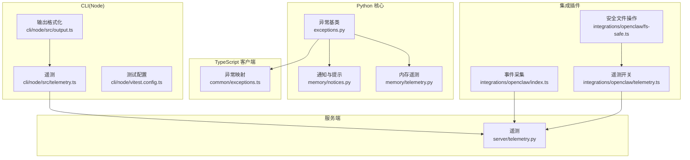
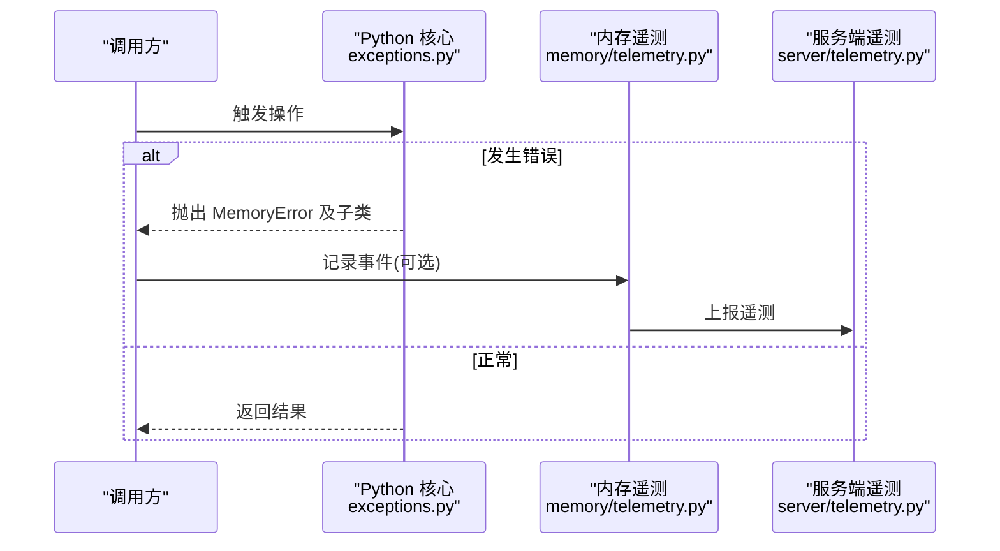
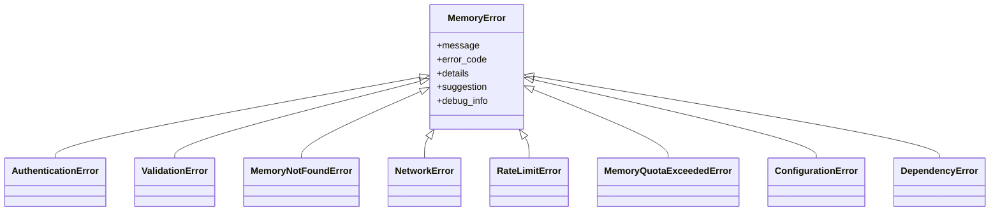
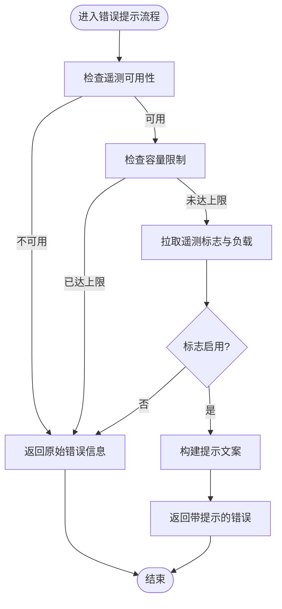
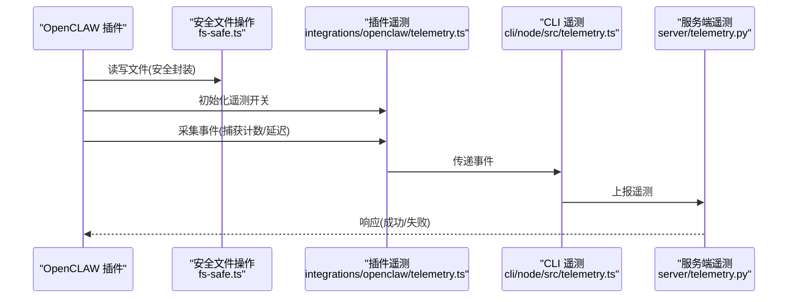
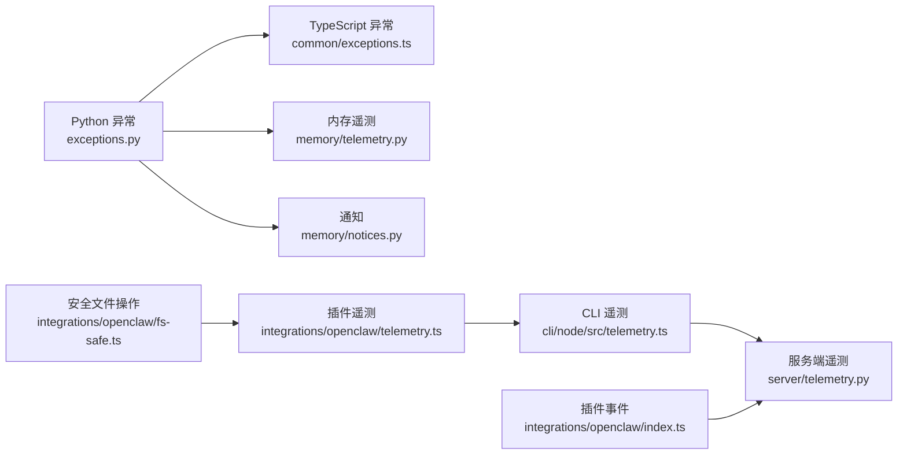

# 错误追踪和调试

<cite>
**本文引用的文件**
- [exceptions.py](file://mem0/exceptions.py)
- [exceptions.ts](file://mem0-ts/src/common/exceptions.ts)
- [notices.py](file://mem0/memory/notices.py)
- [telemetry.py](file://mem0/memory/telemetry.py)
- [telemetry.py](file://server/telemetry.py)
- [telemetry.py](file://cli/node/src/telemetry.ts)
- [telemetry.py](file://integrations/openclaw/telemetry.ts)
- [test_telemetry_sampling.py](file://tests/test_telemetry_sampling.py)
- [output.ts](file://cli/node/src/output.ts)
- [index.ts](file://integrations/openclaw/index.ts)
- [fs-safe.ts](file://integrations/openclaw/fs-safe.ts)
- [jest.config.js](file://mem0-ts/jest.config.js)
- [vitest.config.ts](file://cli/node/vitest.config.ts)
- [vitest.config.ts](file://integrations/openclaw/vitest.config.ts)
- [vitest.config.ts](file://integrations/pi-agent-plugin/vitest.config.ts)
- [jest.integration.config.js](file://mem0-ts/jest.integration.config.js)
- [setup.ts](file://cli/node/tests/setup.ts)
- [conftest.py](file://cli/python/tests/conftest.py)
- [conftest.py](file://tests/rerankers/conftest.py)
- [conftest.py](file://integrations/mem0-plugin/tests/conftest.py)
</cite>

## 目录
1. 引言
2. 项目结构
3. 核心组件
4. 架构总览
5. 组件详解
6. 依赖关系分析
7. 性能考量
8. 故障排查指南
9. 结论
10. 附录

## 引言
本指南面向 Mem0 开发者，聚焦于系统中的错误追踪与调试实践。内容涵盖异常类型与错误码语义、调试工具与断点调试技巧、遥测数据在根因分析中的应用、常见错误模式识别与修复策略，以及单元与集成测试的编写与测试覆盖率提升方法。目标是帮助你在最短时间内定位并解决 Mem0 系统中的问题。

## 项目结构
Mem0 的错误追踪与调试涉及多语言与多模块协作：
- Python 核心：异常基类与 HTTP 响应映射、通知与遥测
- TypeScript 客户端：异常体系与响应映射
- CLI（Node）：输出格式化、遥测与测试配置
- 服务端：遥测采集与事件上报
- 集成插件：遥测开关覆盖、事件采集与日志记录
- 测试：遥测采样一致性、测试配置与通用夹具

图表来源
- [exceptions.py](file://mem0/exceptions.py)
- [exceptions.ts](file://mem0-ts/src/common/exceptions.ts)
- [notices.py](file://mem0/memory/notices.py)
- [telemetry.py](file://mem0/memory/telemetry.py)
- [telemetry.py](file://server/telemetry.py)
- [output.ts](file://cli/node/src/output.ts)
- [index.ts](file://integrations/openclaw/index.ts)
- [fs-safe.ts](file://integrations/openclaw/fs-safe.ts)

章节来源
- [exceptions.py](file://mem0/exceptions.py)
- [exceptions.ts](file://mem0-ts/src/common/exceptions.ts)
- [notices.py](file://mem0/memory/notices.py)
- [telemetry.py](file://mem0/memory/telemetry.py)
- [telemetry.py](file://server/telemetry.py)
- [output.ts](file://cli/node/src/output.ts)
- [index.ts](file://integrations/openclaw/index.ts)
- [fs-safe.ts](file://integrations/openclaw/fs-safe.ts)

## 核心组件
- 异常基类与子类：统一错误表示、错误码、建议与调试信息，支持 HTTP 状态码到异常类型的映射。
- 通知与提示：基于遥测开关动态生成用户可见提示，避免容量限制场景下的重复提示。
- 遥测：跨模块采集与上报，包含默认采样率、事件签名稳定性与环境变量覆盖。
- CLI 输出：结构化结果输出，便于日志与自动化脚本解析。
- 插件事件采集：自动捕获与失败告警，结合延迟指标辅助性能诊断。

章节来源
- [exceptions.py](file://mem0/exceptions.py)
- [exceptions.ts](file://mem0-ts/src/common/exceptions.ts)
- [notices.py](file://mem0/memory/notices.py)
- [telemetry.py](file://mem0/memory/telemetry.py)
- [telemetry.py](file://server/telemetry.py)
- [output.ts](file://cli/node/src/output.ts)
- [index.ts](file://integrations/openclaw/index.ts)

## 架构总览
下图展示从调用到异常抛出、通知生成与遥测上报的关键路径。

图表来源
- [exceptions.py](file://mem0/exceptions.py)
- [telemetry.py](file://mem0/memory/telemetry.py)
- [telemetry.py](file://server/telemetry.py)

## 组件详解

### 异常体系与错误码
- Python 异常基类提供统一字段：消息、错误码、详情、建议、调试信息；支持 HTTP 状态码映射到具体异常类型。
- TypeScript 客户端提供等价的异常类与映射函数，确保前后端一致的错误体验。
- 常见异常类别：
  - 认证/授权类：401/403
  - 资源不存在：404
  - 参数/验证错误：400/409/422
  - 网络超时/不可用：408/502/503/504
  - 速率限制：429
  - 存储配额超限：413
  - 其他服务器错误：500

图表来源
- [exceptions.py](file://mem0/exceptions.py)
- [exceptions.ts](file://mem0-ts/src/common/exceptions.ts)

章节来源
- [exceptions.py](file://mem0/exceptions.py)
- [exceptions.ts](file://mem0-ts/src/common/exceptions.ts)

### 通知与提示生成
- 当遥测可用且未达到容量限制时，根据遥测返回的标志位与负载动态决定是否生成用户可见提示。
- 提示内容来自遥测下发的配置，包含启用状态、提示类型与文案拷贝。

图表来源
- [notices.py](file://mem0/memory/notices.py)

章节来源
- [notices.py](file://mem0/memory/notices.py)

### 遥测采集与上报
- 默认采样率为 10%，可通过环境变量覆盖；测试保障公共 API 签名稳定。
- 服务端与客户端分别负责事件采集与上报，插件通过安全文件操作与遥测开关协同工作。
- OpenCLAW 插件在自动捕获记忆时记录延迟与数量，并对失败进行告警。

图表来源
- [index.ts](file://integrations/openclaw/index.ts)
- [fs-safe.ts](file://integrations/openclaw/fs-safe.ts)
- [telemetry.ts](file://integrations/openclaw/telemetry.ts)
- [telemetry.py](file://cli/node/src/telemetry.ts)
- [telemetry.py](file://server/telemetry.py)

章节来源
- [test_telemetry_sampling.py](file://tests/test_telemetry_sampling.py)
- [index.ts](file://integrations/openclaw/index.ts)
- [fs-safe.ts](file://integrations/openclaw/fs-safe.ts)
- [telemetry.py](file://cli/node/src/telemetry.ts)
- [telemetry.py](file://server/telemetry.py)

### CLI 输出与日志
- CLI 输出支持结构化结果摘要，包含计数、分页、作用域 ID 与耗时，便于快速核验与自动化处理。
- 测试配置中为集成测试设置较长超时，以规避冷启动导致的误判。

章节来源
- [output.ts](file://cli/node/src/output.ts)
- [vitest.config.ts](file://cli/node/vitest.config.ts)

## 依赖关系分析
- 异常体系在 Python 与 TypeScript 两端保持一致，确保跨语言错误处理的一致性。
- 遥测模块贯穿客户端、服务端与插件，形成闭环的数据采集与上报链路。
- 测试配置分散在各子项目，但共享通用夹具与约定，保证测试稳定性。

图表来源
- [exceptions.py](file://mem0/exceptions.py)
- [exceptions.ts](file://mem0-ts/src/common/exceptions.ts)
- [notices.py](file://mem0/memory/notices.py)
- [telemetry.py](file://mem0/memory/telemetry.py)
- [telemetry.py](file://server/telemetry.py)
- [index.ts](file://integrations/openclaw/index.ts)
- [fs-safe.ts](file://integrations/openclaw/fs-safe.ts)

章节来源
- [exceptions.py](file://mem0/exceptions.py)
- [exceptions.ts](file://mem0-ts/src/common/exceptions.ts)
- [notices.py](file://mem0/memory/notices.py)
- [telemetry.py](file://mem0/memory/telemetry.py)
- [telemetry.py](file://server/telemetry.py)
- [index.ts](file://integrations/openclaw/index.ts)
- [fs-safe.ts](file://integrations/openclaw/fs-safe.ts)

## 性能考量
- 遥测采样率默认 10%，在高并发场景下降低上报开销；可通过环境变量调整。
- 插件事件采集包含延迟指标，可用于定位慢调用与资源瓶颈。
- CLI 集成测试超时延长，避免冷启动干扰测试稳定性。

章节来源
- [test_telemetry_sampling.py](file://tests/test_telemetry_sampling.py)
- [index.ts](file://integrations/openclaw/index.ts)
- [vitest.config.ts](file://cli/node/vitest.config.ts)

## 故障排查指南

### 快速定位步骤
1. 检查异常类型与错误码
   - 若为认证/授权错误，优先核查凭据与权限。
   - 若为网络错误或服务不可用，关注超时与上游服务状态。
   - 若为配额超限，评估请求大小与批量策略。
2. 查看遥测数据
   - 在服务端与 CLI 遥测中检索相关事件，确认采样率与时间窗口。
   - 关注插件事件中的延迟与捕获计数，判断性能瓶颈。
3. 审视通知与提示
   - 若提示未出现，检查遥测开关与负载配置。
4. 核对 CLI 输出
   - 使用结构化摘要快速确认结果规模与耗时。

章节来源
- [exceptions.py](file://mem0/exceptions.py)
- [exceptions.ts](file://mem0-ts/src/common/exceptions.ts)
- [notices.py](file://mem0/memory/notices.py)
- [telemetry.py](file://mem0/memory/telemetry.py)
- [telemetry.py](file://server/telemetry.py)
- [index.ts](file://integrations/openclaw/index.ts)
- [output.ts](file://cli/node/src/output.ts)

### 常见错误模式与修复策略
- HTTP 401/403：检查密钥与权限范围，必要时重新授权。
- HTTP 404：确认资源 ID 与租户上下文，避免越权访问。
- HTTP 400/422：校验请求参数与数据格式，参考建议提示修正。
- HTTP 429：实现退避重试与队列节流，合理分配请求节奏。
- HTTP 502/503/504：检查上游服务健康度与超时阈值，增加重试与熔断。
- 存储配额超限：拆分请求、清理冗余数据或升级配额。
- 插件捕获失败：查看告警日志与延迟指标，定位 I/O 或网络问题。

章节来源
- [exceptions.py](file://mem0/exceptions.py)
- [exceptions.ts](file://mem0-ts/src/common/exceptions.ts)
- [index.ts](file://integrations/openclaw/index.ts)

### 调试工具与断点调试
- 单元测试
  - 使用 Jest（TypeScript）与 Vitest（Node/插件）运行单元测试，断点置于异常构造与映射逻辑处。
  - 参考测试配置文件，确保超时与全局选项符合预期。
- 集成测试
  - CLI 集成测试采用较长超时，避免冷启动影响；可在测试入口设置断点。
  - 插件集成测试同样使用 Vitest，注意夹具初始化顺序。
- 日志与输出
  - 使用 CLI 输出的结构化摘要核验结果规模与耗时，辅助定位异常批次。

章节来源
- [jest.config.js](file://mem0-ts/jest.config.js)
- [vitest.config.ts](file://cli/node/vitest.config.ts)
- [vitest.config.ts](file://integrations/openclaw/vitest.config.ts)
- [vitest.config.ts](file://integrations/pi-agent-plugin/vitest.config.ts)
- [jest.integration.config.js](file://mem0-ts/jest.integration.config.js)
- [setup.ts](file://cli/node/tests/setup.ts)
- [conftest.py](file://cli/python/tests/conftest.py)
- [conftest.py](file://tests/rerankers/conftest.py)
- [conftest.py](file://integrations/mem0-plugin/tests/conftest.py)

### 遥测数据根因分析
- 事件筛选：按事件名称、时间窗口与实例标识过滤，定位异常时段。
- 指标关联：结合延迟、计数与错误码分布，识别热点与异常模式。
- 插件观测：关注捕获失败与延迟突增，排查外部依赖与资源限制。

章节来源
- [telemetry.py](file://server/telemetry.py)
- [telemetry.py](file://cli/node/src/telemetry.ts)
- [telemetry.py](file://integrations/openclaw/telemetry.ts)
- [index.ts](file://integrations/openclaw/index.ts)

### 单元测试与集成测试编写指南
- 单元测试
  - 针对异常映射与构造函数，覆盖典型与边界状态码。
  - 使用断言验证错误码、建议与调试信息字段。
- 集成测试
  - 模拟真实调用链路，包含异常路径与成功路径。
  - 利用夹具统一初始化，减少重复代码。
- 测试覆盖率
  - 为异常分支与边界条件补充用例，逐步提升分支与行覆盖率。
  - 对遥测相关逻辑进行隔离测试，确保采样与上报行为稳定。

章节来源
- [exceptions.ts](file://mem0-ts/src/common/exceptions.ts)
- [exceptions.py](file://mem0/exceptions.py)
- [test_telemetry_sampling.py](file://tests/test_telemetry_sampling.py)
- [conftest.py](file://cli/python/tests/conftest.py)
- [conftest.py](file://tests/rerankers/conftest.py)
- [conftest.py](file://integrations/mem0-plugin/tests/conftest.py)

## 结论
通过统一的异常体系、完善的遥测采集与可视化、以及规范化的测试与调试流程，可以显著提升 Mem0 系统的问题定位效率与稳定性。建议在日常开发中：
- 明确异常分类与错误码语义，统一前后端错误处理。
- 启用并监控遥测事件，结合延迟与计数指标进行根因分析。
- 编写覆盖异常路径的单元与集成测试，持续提升覆盖率。
- 使用 CLI 输出与测试配置优化调试体验，缩短问题定位时间。

## 附录
- 关键文件索引
  - 异常定义与映射：[exceptions.py](file://mem0/exceptions.py)、[exceptions.ts](file://mem0-ts/src/common/exceptions.ts)
  - 通知与提示：[notices.py](file://mem0/memory/notices.py)
  - 遥测采集与上报：[telemetry.py](file://mem0/memory/telemetry.py)、[telemetry.py](file://server/telemetry.py)、[telemetry.py](file://cli/node/src/telemetry.ts)、[telemetry.ts](file://integrations/openclaw/telemetry.ts)
  - 插件事件与文件安全：[index.ts](file://integrations/openclaw/index.ts)、[fs-safe.ts](file://integrations/openclaw/fs-safe.ts)
  - CLI 输出与测试配置：[output.ts](file://cli/node/src/output.ts)、[vitest.config.ts](file://cli/node/vitest.config.ts)、[vitest.config.ts](file://integrations/openclaw/vitest.config.ts)、[vitest.config.ts](file://integrations/pi-agent-plugin/vitest.config.ts)
  - 测试夹具与配置：[conftest.py](file://cli/python/tests/conftest.py)、[conftest.py](file://tests/rerankers/conftest.py)、[conftest.py](file://integrations/mem0-plugin/tests/conftest.py)