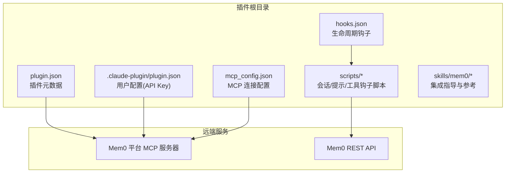
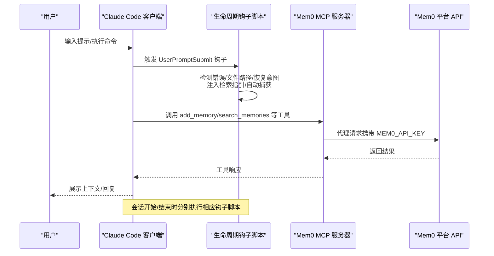
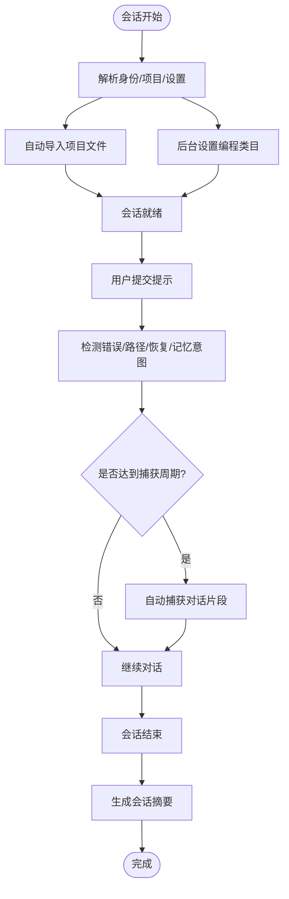
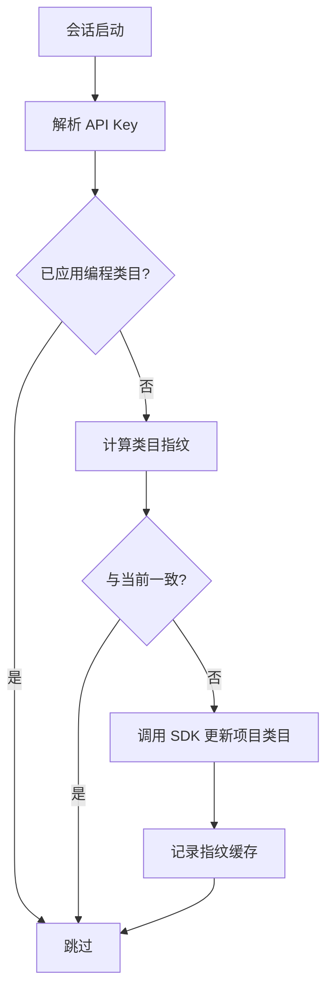
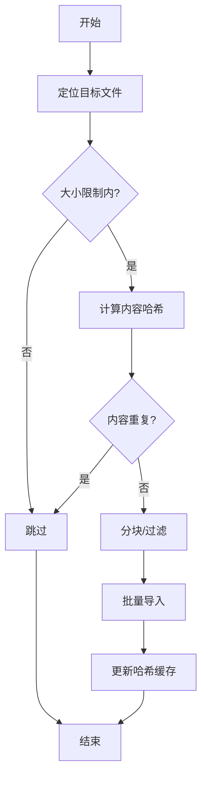

# Claude Code 插件

<cite>
**本文引用的文件**
- [plugin.json](file://integrations/mem0-plugin/plugin.json)
- [.claude-plugin/plugin.json](file://integrations/mem0-plugin/.claude-plugin/plugin.json)
- [hooks.json](file://integrations/mem0-plugin/hooks.json)
- [README.md](file://integrations/mem0-plugin/README.md)
- [mcp_config.json](file://integrations/mem0-plugin/mcp_config.json)
- [scripts/auto_setup_categories.py](file://integrations/mem0-plugin/scripts/auto_setup_categories.py)
- [scripts/on_session_start.sh](file://integrations/mem0-plugin/scripts/on_session_start.sh)
- [scripts/on_user_prompt.sh](file://integrations/mem0-plugin/scripts/on_user_prompt.sh)
- [scripts/setup_coding_categories.py](file://integrations/mem0-plugin/scripts/setup_coding_categories.py)
- [scripts/auto_import.py](file://integrations/mem0-plugin/scripts/auto_import.py)
- [scripts/_identity.sh](file://integrations/mem0-plugin/scripts/_identity.sh)
- [mem0/memory/main.py](file://mem0/memory/main.py)
- [mem0/configs/base.py](file://mem0/configs/base.py)
- [mem0/__init__.py](file://mem0/__init__.py)
</cite>

## 目录
1. [简介](#简介)
2. [项目结构](#项目结构)
3. [核心组件](#核心组件)
4. [架构总览](#架构总览)
5. [详细组件分析](#详细组件分析)
6. [依赖关系分析](#依赖关系分析)
7. [性能考量](#性能考量)
8. [故障排查指南](#故障排查指南)
9. [结论](#结论)
10. [附录](#附录)

## 简介
本文件面向使用 Claude Code 的开发者与团队，系统性介绍 Mem0 插件的安装、配置与使用方法，重点阐述其为 Claude Code 提供的“跨会话、用户级”的语义持久化记忆能力：包括自动记忆捕获、决策与模式识别、偏好学习、分类体系与检索增强等。文档同时给出配置文件结构、环境变量与用户配置项、生命周期钩子的工作流、以及在实际编码场景中的使用范式与排障建议。

## 项目结构
Mem0 插件以“MCP 服务器 + 生命周期钩子 + 技能（Skill）”为核心，覆盖 Claude Code、Cursor、Codex、OpenCode、Antigravity 等多客户端。插件目录中包含：
- 插件清单与用户配置：用于注册插件、声明用户配置项（如 API Key）
- 生命周期钩子：在会话开始、用户提交提示、工具调用前后等事件点触发脚本
- 脚本集合：自动导入项目文件、自动设置编程类目、自动捕获对话片段、身份解析与设置加载等
- MCP 配置：指向远程 MCP 服务的连接参数
- 技能：帮助用户在应用中集成 Mem0 SDK 的指导与参考材料

**图表来源**
- [plugin.json:1-14](file://integrations/mem0-plugin/plugin.json#L1-L14)
- [.claude-plugin/plugin.json:1-23](file://integrations/mem0-plugin/.claude-plugin/plugin.json#L1-L23)
- [hooks.json:1-105](file://integrations/mem0-plugin/hooks.json#L1-L105)
- [mcp_config.json:1-11](file://integrations/mem0-plugin/mcp_config.json#L1-L11)

**章节来源**
- [README.md:1-306](file://integrations/mem0-plugin/README.md#L1-L306)
- [plugin.json:1-14](file://integrations/mem0-plugin/plugin.json#L1-L14)
- [.claude-plugin/plugin.json:1-23](file://integrations/mem0-plugin/.claude-plugin/plugin.json#L1-L23)
- [hooks.json:1-105](file://integrations/mem0-plugin/hooks.json#L1-L105)
- [mcp_config.json:1-11](file://integrations/mem0-plugin/mcp_config.json#L1-L11)

## 核心组件
- 用户配置与安装
  - 在 Claude Code 中通过插件市场添加并安装 Mem0；首次安装会引导输入 API Key（支持从用户配置注入或环境变量读取）
  - 支持桌面端与 CLI 两种安装路径
- 生命周期钩子
  - 会话开始：初始化会话标识、加载设置、自动导入项目文件、后台设置编程类目、统计与健康提示
  - 用户提交提示：注入“记忆检索指引”，检测错误/文件路径/恢复意图，按策略自动捕获对话片段
  - 工具调用前后：对写入类工具进行阻断控制、对特定工具执行元数据强制、读取文件时注入上下文
  - 会话结束：生成会话摘要，推动增量存储
- MCP 与技能
  - 通过 MCP 服务器暴露 add/search/update/delete 等工具
  - 提供 Mem0 SDK 集成技能，指导在应用中嵌入记忆能力

**章节来源**
- [README.md:17-306](file://integrations/mem0-plugin/README.md#L17-L306)
- [.claude-plugin/plugin.json:13-21](file://integrations/mem0-plugin/.claude-plugin/plugin.json#L13-L21)
- [hooks.json:1-105](file://integrations/mem0-plugin/hooks.json#L1-L105)
- [mcp_config.json:1-11](file://integrations/mem0-plugin/mcp_config.json#L1-L11)

## 架构总览
下图展示了从用户在 Claude Code 中发起一次交互到平台侧检索与存储的端到端流程，以及本地钩子如何参与：

**图表来源**
- [hooks.json:21-102](file://integrations/mem0-plugin/hooks.json#L21-L102)
- [on_user_prompt.sh:1-202](file://integrations/mem0-plugin/scripts/on_user_prompt.sh#L1-L202)
- [mcp_config.json:1-11](file://integrations/mem0-plugin/mcp_config.json#L1-L11)

## 详细组件分析

### 组件一：生命周期钩子与自动记忆捕获
- 会话开始（SessionStart）
  - 解析身份与项目信息，导出会话 ID 到环境
  - 若未设置 API Key，输出引导信息
  - 自动导入项目文件（CLAUDE.md、AGENTS.md、.cursorrules 等），去重与增量更新
  - 后台设置编程类目（仅一次，基于指纹缓存）
  - 发送遥测事件
- 用户提交提示（UserPromptSubmit）
  - 注入“记忆检索指引”，避免对原始提示做预搜索
  - 检测错误、文件路径、恢复意图与显式记忆保存意图
  - 按消息计数周期性触发自动捕获（基于对话转录）
- 工具调用前后（PreToolUse/PostToolUse）
  - 对写入类工具进行阻断控制，避免重复/误写
  - 对特定 MCP 工具执行元数据默认值强制
  - 对读取类工具注入文件上下文
- 会话结束（Stop）
  - 生成会话摘要，推动增量存储

**图表来源**
- [on_session_start.sh:1-200](file://integrations/mem0-plugin/scripts/on_session_start.sh#L1-L200)
- [on_user_prompt.sh:1-202](file://integrations/mem0-plugin/scripts/on_user_prompt.sh#L1-L202)
- [hooks.json:1-105](file://integrations/mem0-plugin/hooks.json#L1-L105)

**章节来源**
- [on_session_start.sh:14-199](file://integrations/mem0-plugin/scripts/on_session_start.sh#L14-L199)
- [on_user_prompt.sh:12-201](file://integrations/mem0-plugin/scripts/on_user_prompt.sh#L12-L201)
- [hooks.json:3-102](file://integrations/mem0-plugin/hooks.json#L3-L102)

### 组件二：编程类目与自动分类
- 默认类目偏向消费场景，对代码工作无意义
- 插件在会话启动时后台替换为面向开发的 17 类分类，且幂等（基于指纹缓存）
- 可手动预览/应用变更，确保检索更贴合工程实践

**图表来源**
- [auto_setup_categories.py:186-236](file://integrations/mem0-plugin/scripts/auto_setup_categories.py#L186-L236)
- [setup_coding_categories.py:169-236](file://integrations/mem0-plugin/scripts/setup_coding_categories.py#L169-L236)

**章节来源**
- [auto_setup_categories.py:1-237](file://integrations/mem0-plugin/scripts/auto_setup_categories.py#L1-L237)
- [setup_coding_categories.py:1-237](file://integrations/mem0-plugin/scripts/setup_coding_categories.py#L1-L237)

### 组件三：项目文件自动导入
- 识别目标文件（CLAUDE.md、AGENTS.md、.cursorrules、.windsurfrules、mem0.md）
- 基于内容哈希与服务端存在性判断，去重与增量导入
- 分块上传，保留源文件与分段索引，便于后续检索

**图表来源**
- [auto_import.py:258-375](file://integrations/mem0-plugin/scripts/auto_import.py#L258-L375)

**章节来源**
- [auto_import.py:1-375](file://integrations/mem0-plugin/scripts/auto_import.py#L1-L375)

### 组件四：MCP 工具与 SDK 集成
- MCP 工具
  - add_memory、search_memories、get_memories、get_memory、update_memory、delete_memory、delete_all_memories、delete_entities、list_entities
- SDK 集成
  - 插件附带技能，提供快速集成指南与参考文档，涵盖 Python/TypeScript/REST 等多种方式

**章节来源**
- [README.md:287-306](file://integrations/mem0-plugin/README.md#L287-L306)
- [skills/mem0/README.md:1-74](file://integrations/mem0-plugin/skills/mem0/README.md#L1-L74)

## 依赖关系分析
- 插件清单与用户配置
  - 插件元数据与版本、关键词、主页、仓库、许可证等
  - 用户配置项（API Key）用于认证与授权
- 生命周期钩子
  - 通过 hooks.json 映射事件到具体脚本命令，支持超时与匹配器
- 身份解析与设置
  - _identity.sh 优先从环境变量/用户配置注入/API Key 注入，其次从 shell profile 提取
  - 加载本地设置（自动保存、自动搜索、搜索上限、保留天数、置信度阈值、全局搜索、调试开关）
- 平台交互
  - mcp_config.json 使用 ${MEM0_API_KEY} 占位符，由会话启动时解析并注入
  - on_session_start.sh 通过 HTTP 调用平台 API 获取记忆数量与健康状态

**图表来源**
- [.claude-plugin/plugin.json:13-21](file://integrations/mem0-plugin/.claude-plugin/plugin.json#L13-L21)
- [hooks.json:1-105](file://integrations/mem0-plugin/hooks.json#L1-L105)
- [_identity.sh:1-88](file://integrations/mem0-plugin/scripts/_identity.sh#L1-L88)
- [mcp_config.json:1-11](file://integrations/mem0-plugin/mcp_config.json#L1-L11)
- [on_session_start.sh:72-106](file://integrations/mem0-plugin/scripts/on_session_start.sh#L72-L106)

**章节来源**
- [.claude-plugin/plugin.json:1-23](file://integrations/mem0-plugin/.claude-plugin/plugin.json#L1-L23)
- [hooks.json:1-105](file://integrations/mem0-plugin/hooks.json#L1-L105)
- [_identity.sh:1-88](file://integrations/mem0-plugin/scripts/_identity.sh#L1-L88)
- [mcp_config.json:1-11](file://integrations/mem0-plugin/mcp_config.json#L1-L11)
- [on_session_start.sh:1-200](file://integrations/mem0-plugin/scripts/on_session_start.sh#L1-L200)

## 性能考量
- 搜索与检索
  - 通过会话范围（user_id/agent_id/run_id）限定查询，减少无关返回
  - 使用置信度阈值与 top_k 控制召回规模
  - 关键词搜索与向量混合评分取决于所选向量库能力
- 自动捕获窗口
  - 采用重叠窗口策略，确保上下文连续性
- 并发与幂等
  - 自动导入与类目设置均采用锁与指纹缓存，避免重复与竞态
- 资源占用
  - 脚本以后台异步方式运行，不影响主对话流程
  - 设置调试日志时注意磁盘与 IO 影响

[本节为通用性能建议，不直接分析具体文件]

## 故障排查指南
- API Key 未设置或无效
  - 症状：会话开始时输出“Setup Required”，无法检索/写入
  - 处理：在用户配置中填写 API Key，或在环境变量中设置 MEM0_API_KEY；确认以 m0- 开头
- 安装后 MCP 不可用
  - 症状：工具不可用或报错
  - 处理：重启客户端以重新建立连接；检查 MEM0_API_KEY 是否可被新会话读取
- 自动导入未生效
  - 症状：目标文件未被导入
  - 处理：确认文件位于项目根或 Git 根；检查文件大小与内容哈希；查看本地日志
- 编程类目未更新
  - 症状：仍使用默认类目
  - 处理：运行脚本预览差异，必要时加 --apply 应用；确认 SDK 可用
- 工具调用被阻断
  - 症状：写入类工具被拦截
  - 处理：遵循“增量存储”原则，在合适时机使用 add_memory 显式写入

**章节来源**
- [on_session_start.sh:40-64](file://integrations/mem0-plugin/scripts/on_session_start.sh#L40-L64)
- [README.md:257-270](file://integrations/mem0-plugin/README.md#L257-L270)
- [auto_import.py:124-154](file://integrations/mem0-plugin/scripts/auto_import.py#L124-L154)
- [auto_setup_categories.py:169-236](file://integrations/mem0-plugin/scripts/auto_setup_categories.py#L169-L236)

## 结论
Mem0 插件通过“MCP + 生命周期钩子 + 技能”的组合，为 Claude Code 提供了稳定、可扩展的记忆能力：自动捕获、智能检索、分类优化与工程化集成。配合编程类目与项目文件导入，能够在跨会话、跨任务中持续沉淀决策、模式与偏好，显著提升开发效率与一致性。

[本节为总结性内容，不直接分析具体文件]

## 附录

### A. 安装与配置步骤
- 步骤 1：设置 API Key
  - 在平台仪表板创建 API Key（以 m0- 开头），将其设置到 MEM0_API_KEY
  - 支持 Shell 配置或桌面端本地环境编辑器
- 步骤 2：安装插件
  - Claude Code/Claude Cowork：通过插件市场添加并安装
  - 其他客户端：根据 README 中对应章节进行配置或侧载
- 步骤 3：验证
  - 执行 /mem0:onboard 引导设置
  - 运行 /mem0:health 与 /mem0:stats 检查连通性与统计
  - 尝试 /mem0:remember 与 /mem0:tour 存储与浏览

**章节来源**
- [README.md:17-306](file://integrations/mem0-plugin/README.md#L17-L306)
- [.claude-plugin/plugin.json:13-21](file://integrations/mem0-plugin/.claude-plugin/plugin.json#L13-L21)

### B. 配置文件与用户选项
- 用户配置（API Key）
  - 类型：字符串；敏感字段；必填
  - 作用：用于 MCP 与平台 API 认证
- 本地设置（settings.json）
  - 关键项：auto_save、auto_search、search_limit、retention_session_days、confidence_threshold、global_search、debug
  - 作用：控制自动捕获、自动搜索、搜索上限、保留策略、全局搜索与调试行为

**章节来源**
- [.claude-plugin/plugin.json:13-21](file://integrations/mem0-plugin/.claude-plugin/plugin.json#L13-L21)
- [_identity.sh:65-84](file://integrations/mem0-plugin/scripts/_identity.sh#L65-L84)

### C. 生命周期钩子事件映射
- SessionStart：会话初始化、导入项目文件、设置编程类目、统计与健康提示
- UserPromptSubmit：注入检索指引、检测意图、自动捕获
- PreToolUse：写入阻断、元数据强制、文件读取上下文
- PostToolUse：工具后处理、Bash 输出处理
- Stop：会话摘要与增量存储提醒

**章节来源**
- [hooks.json:1-105](file://integrations/mem0-plugin/hooks.json#L1-L105)

### D. 使用示例（结合记忆功能提升开发效率）
- 场景 1：修复历史问题
  - 在提示中描述错误堆栈或异常，插件自动检测并建议检索 anti_patterns 与 task_learnings 类型记忆
  - 通过检索结果快速定位相似问题与解决方案
- 场景 2：恢复工作进度
  - 提问“我们上次在哪里停下的？”或“最近的决策有哪些？”，插件自动检索 session_state 与 decision 类型记忆
  - 结合检索结果继续推进
- 场景 3：新增知识入库
  - 在对话中自然产出“新的约定/最佳实践/依赖选择”等信息，使用 /mem0:remember 或显式 add_memory 写入
  - 保持每条记忆简洁明确，便于后续检索

**章节来源**
- [on_user_prompt.sh:119-156](file://integrations/mem0-plugin/scripts/on_user_prompt.sh#L119-L156)
- [README.md:224-244](file://integrations/mem0-plugin/README.md#L224-L244)

### E. 数据模型与检索要点
- 记忆对象
  - 包含唯一 id、memory 文本、可选 metadata、score、时间戳等
- 检索范围
  - 必须包含 user_id 与 app_id（项目 scope）；可选 actor_id
  - 支持按类型（metadata.type）过滤，如 decision、task_learnings、bug_fixes 等
- 存储与更新
  - 通过 add_memory 写入；update_memory 覆盖文本；delete_memory 删除单条；delete_all_memories 清空

**章节来源**
- [mem0/configs/base.py:16-58](file://mem0/configs/base.py#L16-L58)
- [mem0/memory/main.py:653-760](file://mem0/memory/main.py#L653-L760)
- [README.md:287-302](file://integrations/mem0-plugin/README.md#L287-L302)