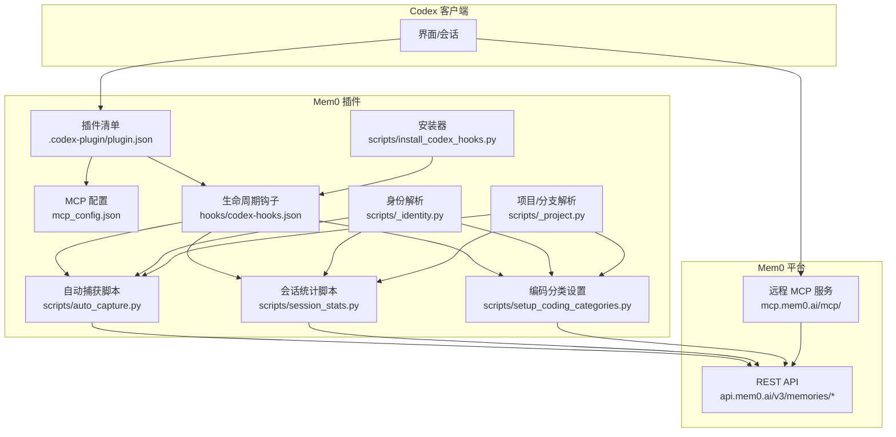
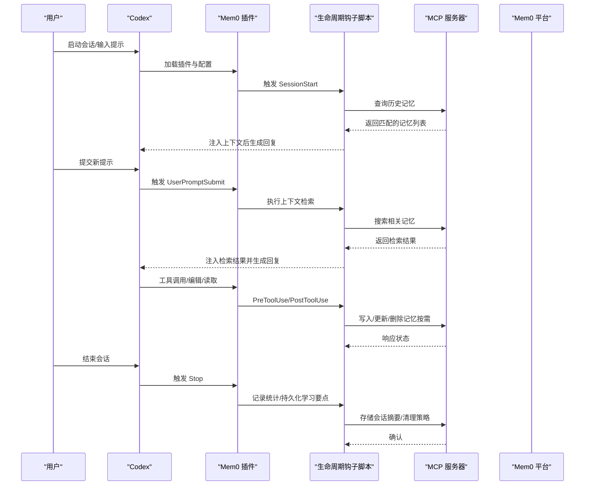
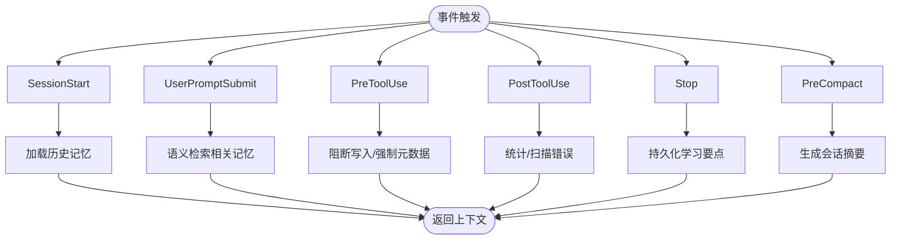
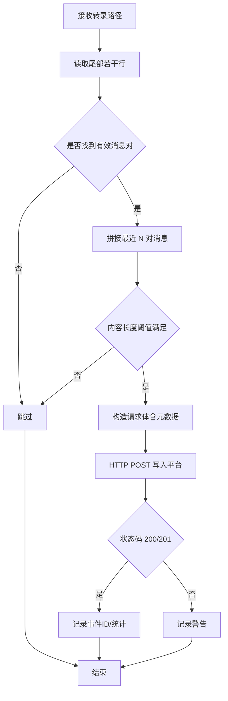
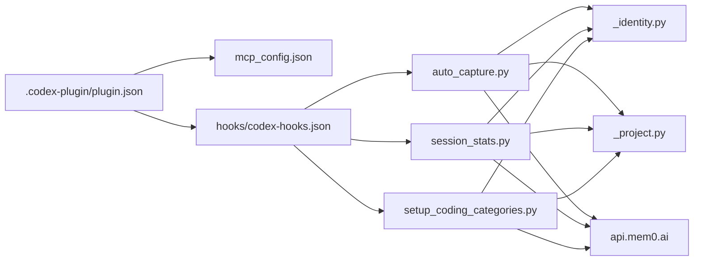

# Codex 插件

<cite>
**本文引用的文件**
- [integrations/mem0-plugin/.codex-plugin/plugin.json](file://integrations/mem0-plugin/.codex-plugin/plugin.json)
- [integrations/mem0-plugin/README.md](file://integrations/mem0-plugin/README.md)
- [integrations/mem0-plugin/hooks/codex-hooks.json](file://integrations/mem0-plugin/hooks/codex-hooks.json)
- [integrations/mem0-plugin/scripts/install_codex_hooks.py](file://integrations/mem0-plugin/scripts/install_codex_hooks.py)
- [integrations/mem0-plugin/mcp_config.json](file://integrations/mem0-plugin/mcp_config.json)
- [integrations/mem0-plugin/scripts/auto_capture.py](file://integrations/mem0-plugin/scripts/auto_capture.py)
- [integrations/mem0-plugin/scripts/session_stats.py](file://integrations/mem0-plugin/scripts/session_stats.py)
- [integrations/mem0-plugin/scripts/setup_coding_categories.py](file://integrations/mem0-plugin/scripts/setup_coding_categories.py)
- [integrations/mem0-plugin/scripts/_identity.py](file://integrations/mem0-plugin/scripts/_identity.py)
- [integrations/mem0-plugin/scripts/_project.py](file://integrations/mem0-plugin/scripts/_project.py)
- [docs/integrations/codex.mdx](file://docs/integrations/codex.mdx)
- [examples/nemoclaw/quickstart.md](file://examples/nemoclaw/quickstart.md)
</cite>

## 目录
1. [简介](#简介)
2. [项目结构](#项目结构)
3. [核心组件](#核心组件)
4. [架构总览](#架构总览)
5. [详细组件分析](#详细组件分析)
6. [依赖关系分析](#依赖关系分析)
7. [性能考虑](#性能考虑)
8. [故障排查指南](#故障排查指南)
9. [结论](#结论)
10. [附录](#附录)

## 简介
本文件是面向 Codex 的 Mem0 插件完整使用文档，目标是帮助你从零开始完成安装与配置，并理解插件如何为 Codex 提供长期记忆能力：包括会话间对话历史、代码模式与项目上下文的持久化存储；如何通过生命周期钩子自动捕获与注入记忆；以及如何进行配置管理（API 密钥、记忆策略、隐私保护）等。文档还提供典型使用场景、性能调优建议与常见问题解决方案。

## 项目结构
该插件以“插件清单 + MCP 服务器 + 生命周期钩子 + 技能工具”的方式集成到 Codex。核心文件与职责如下：
- 插件清单：定义插件元数据、品牌信息、默认提示词、MCP 服务器与钩子注册位置
- MCP 配置：声明远程 MCP 服务地址与鉴权头
- 生命周期钩子：在关键事件（会话启动、用户提交、工具使用前后、停止）触发脚本
- 脚本工具：自动捕获对话、统计会话操作、设置编码类记忆分类、解析身份与项目信息
- 文档与示例：官方集成文档与 NemoClaw 示例，便于对照理解

图表来源
- [integrations/mem0-plugin/.codex-plugin/plugin.json:1-36](file://integrations/mem0-plugin/.codex-plugin/plugin.json#L1-L36)
- [integrations/mem0-plugin/mcp_config.json:1-11](file://integrations/mem0-plugin/mcp_config.json#L1-L11)
- [integrations/mem0-plugin/hooks/codex-hooks.json:1-105](file://integrations/mem0-plugin/hooks/codex-hooks.json#L1-L105)
- [integrations/mem0-plugin/scripts/install_codex_hooks.py:1-163](file://integrations/mem0-plugin/scripts/install_codex_hooks.py#L1-L163)
- [integrations/mem0-plugin/scripts/auto_capture.py:1-211](file://integrations/mem0-plugin/scripts/auto_capture.py#L1-L211)
- [integrations/mem0-plugin/scripts/session_stats.py:1-139](file://integrations/mem0-plugin/scripts/session_stats.py#L1-L139)
- [integrations/mem0-plugin/scripts/setup_coding_categories.py:1-237](file://integrations/mem0-plugin/scripts/setup_coding_categories.py#L1-L237)
- [integrations/mem0-plugin/scripts/_identity.py:1-105](file://integrations/mem0-plugin/scripts/_identity.py#L1-L105)
- [integrations/mem0-plugin/scripts/_project.py:1-176](file://integrations/mem0-plugin/scripts/_project.py#L1-L176)

章节来源
- [integrations/mem0-plugin/.codex-plugin/plugin.json:1-36](file://integrations/mem0-plugin/.codex-plugin/plugin.json#L1-L36)
- [integrations/mem0-plugin/README.md:1-306](file://integrations/mem0-plugin/README.md#L1-L306)
- [docs/integrations/codex.mdx:1-136](file://docs/integrations/codex.mdx#L1-L136)

## 核心组件
- 插件清单与品牌信息
  - 包含插件名称、版本、描述、作者、主页、仓库、许可证、关键词、技能目录、MCP 服务器与钩子路径、界面品牌信息（显示名、简述、长描述、类别、能力、默认提示词、品牌色与 Logo）
- MCP 服务器
  - 通过 mcp_config.json 指向远程 MCP 服务地址，并在请求头中携带基于环境变量的 Token 鉴权
- 生命周期钩子
  - 在 SessionStart、UserPromptSubmit、PreToolUse、PostToolUse、Stop、PreCompact 等事件触发相应脚本，实现自动上下文注入、写入拦截、统计与预处理
- 自动捕获与会话统计
  - 自动捕获最近对话交换，提取事实并写入平台；会话统计记录写入/检索次数与类别分布
- 编码类记忆分类
  - 将默认的消费类分类替换为面向开发的 17 类别集合，提升代码相关记忆的可检索性
- 身份与项目解析
  - 解析 API Key、用户 ID、项目 ID、分支等，支持多源覆盖与自愈映射

章节来源
- [integrations/mem0-plugin/.codex-plugin/plugin.json:1-36](file://integrations/mem0-plugin/.codex-plugin/plugin.json#L1-L36)
- [integrations/mem0-plugin/mcp_config.json:1-11](file://integrations/mem0-plugin/mcp_config.json#L1-L11)
- [integrations/mem0-plugin/hooks/codex-hooks.json:1-105](file://integrations/mem0-plugin/hooks/codex-hooks.json#L1-L105)
- [integrations/mem0-plugin/scripts/auto_capture.py:1-211](file://integrations/mem0-plugin/scripts/auto_capture.py#L1-L211)
- [integrations/mem0-plugin/scripts/session_stats.py:1-139](file://integrations/mem0-plugin/scripts/session_stats.py#L1-L139)
- [integrations/mem0-plugin/scripts/setup_coding_categories.py:1-237](file://integrations/mem0-plugin/scripts/setup_coding_categories.py#L1-L237)
- [integrations/mem0-plugin/scripts/_identity.py:1-105](file://integrations/mem0-plugin/scripts/_identity.py#L1-L105)
- [integrations/mem0-plugin/scripts/_project.py:1-176](file://integrations/mem0-plugin/scripts/_project.py#L1-L176)

## 架构总览
下图展示了 Codex 使用 Mem0 插件时的整体交互流程：从安装与配置开始，到生命周期钩子在关键事件触发脚本，再到 MCP 与平台 API 的通信，最终实现“自动捕获—上下文注入—检索增强”的闭环。

图表来源
- [integrations/mem0-plugin/hooks/codex-hooks.json:1-105](file://integrations/mem0-plugin/hooks/codex-hooks.json#L1-L105)
- [integrations/mem0-plugin/mcp_config.json:1-11](file://integrations/mem0-plugin/mcp_config.json#L1-L11)
- [integrations/mem0-plugin/scripts/auto_capture.py:1-211](file://integrations/mem0-plugin/scripts/auto_capture.py#L1-L211)
- [integrations/mem0-plugin/scripts/session_stats.py:1-139](file://integrations/mem0-plugin/scripts/session_stats.py#L1-L139)

## 详细组件分析

### 组件一：插件清单与品牌信息
- 关键点
  - 插件名称、版本、描述、作者与主页
  - 技能目录、MCP 服务器与钩子路径
  - 界面品牌信息：显示名、简述、长描述、类别、能力（读/写）、默认提示词、品牌色与 Logo
- 作用
  - 作为 Codex 识别与加载插件的入口，同时定义 UI 展示与默认行为

章节来源
- [integrations/mem0-plugin/.codex-plugin/plugin.json:1-36](file://integrations/mem0-plugin/.codex-plugin/plugin.json#L1-L36)

### 组件二：MCP 服务器与认证
- 关键点
  - 远程 MCP 服务器地址与请求头 Authorization 使用 Token 方式，Token 来源于环境变量 MEM0_API_KEY
  - 插件清单中也声明了 MCP 服务器，确保 Codex 可直接读取
- 作用
  - 为 Codex 提供统一的工具接口（添加/搜索/更新/删除记忆），无需本地依赖

章节来源
- [integrations/mem0-plugin/mcp_config.json:1-11](file://integrations/mem0-plugin/mcp_config.json#L1-L11)
- [integrations/mem0-plugin/.codex-plugin/plugin.json:14-16](file://integrations/mem0-plugin/.codex-plugin/plugin.json#L14-L16)

### 组件三：生命周期钩子与事件流
- 关键点
  - SessionStart：加载先前记忆并显示状态
  - UserPromptSubmit：在每次消息前搜索相关记忆
  - PreToolUse：阻止对特定文件的写入，强制设置 user_id/app_id 等元数据
  - PostToolUse：统计写入/检索、扫描 Bash 输出中的错误线索
  - Stop：记录会话结束时的学习要点
  - PreCompact：在上下文压缩前生成摘要
- 安装与启用
  - Codex 不会自动从插件清单读取钩子，需要通过安装器将钩子合并到 ~/.codex/hooks.json，并开启 feature flag codex_hooks

图表来源
- [integrations/mem0-plugin/hooks/codex-hooks.json:1-105](file://integrations/mem0-plugin/hooks/codex-hooks.json#L1-L105)
- [integrations/mem0-plugin/scripts/install_codex_hooks.py:1-163](file://integrations/mem0-plugin/scripts/install_codex_hooks.py#L1-L163)

章节来源
- [integrations/mem0-plugin/hooks/codex-hooks.json:1-105](file://integrations/mem0-plugin/hooks/codex-hooks.json#L1-L105)
- [integrations/mem0-plugin/scripts/install_codex_hooks.py:1-163](file://integrations/mem0-plugin/scripts/install_codex_hooks.py#L1-L163)
- [docs/integrations/codex.mdx:105-136](file://docs/integrations/codex.mdx#L105-L136)

### 组件四：自动捕获与会话统计
- 自动捕获
  - 从会话转录中提取最近的用户-助手消息对，经平台推理抽取事实，批量写入记忆
  - 支持分支、会话 ID 等元数据，避免重复与噪声
- 会话统计
  - 记录每会话写入/检索次数、涉及类别及最近记忆 ID 列表，支持报告输出

图表来源
- [integrations/mem0-plugin/scripts/auto_capture.py:154-211](file://integrations/mem0-plugin/scripts/auto_capture.py#L154-L211)

章节来源
- [integrations/mem0-plugin/scripts/auto_capture.py:1-211](file://integrations/mem0-plugin/scripts/auto_capture.py#L1-L211)
- [integrations/mem0-plugin/scripts/session_stats.py:1-139](file://integrations/mem0-plugin/scripts/session_stats.py#L1-L139)

### 组件五：编码类记忆分类
- 目标
  - 将默认的消费类分类替换为面向开发的 17 类别集合，如架构决策、反模式、任务经验、工具链、Bug 修复、编码约定、用户偏好、依赖决策、性能发现、安全约束、测试模式、数据模型、API 合同、部署手册、团队规范、领域术语、实验结果
- 行为
  - 通过项目更新接口替换自定义分类列表，支持干跑对比与应用执行

章节来源
- [integrations/mem0-plugin/scripts/setup_coding_categories.py:1-237](file://integrations/mem0-plugin/scripts/setup_coding_categories.py#L1-L237)

### 组件六：身份与项目解析
- 身份解析
  - 优先级：显式环境变量、插件用户配置、旧版兼容配置、从 shell profile 中提取
  - 用户 ID：显式覆盖或基于系统用户，否则回退为默认标识
- 项目/分支解析
  - 优先级：显式环境变量、本地映射文件、Git 远端哈希键（自愈）、Git 当前分支、目录基名
  - 自动维护映射文件，支持目录移动/重命名后的自愈

章节来源
- [integrations/mem0-plugin/scripts/_identity.py:1-105](file://integrations/mem0-plugin/scripts/_identity.py#L1-L105)
- [integrations/mem0-plugin/scripts/_project.py:1-176](file://integrations/mem0-plugin/scripts/_project.py#L1-L176)

### 组件七：安装与配置流程（面向 Codex）
- 步骤概览
  - 设置 MEM0_API_KEY（推荐加入 shell profile）
  - 选择安装方式：插件市场一键安装（推荐）或直接添加 MCP 服务器
  - 可选启用生命周期钩子：运行安装器合并 hooks.json，并在 Codex 配置中开启 feature flag
  - 完成后运行 onboard/wizard 引导命令，验证健康状态与统计信息
- 更新与重启
  - 插件更新后现有会话可能持有陈旧句柄，需重启客户端以重新连接

章节来源
- [integrations/mem0-plugin/README.md:17-128](file://integrations/mem0-plugin/README.md#L17-L128)
- [integrations/mem0-plugin/README.md:257-270](file://integrations/mem0-plugin/README.md#L257-L270)
- [docs/integrations/codex.mdx:32-104](file://docs/integrations/codex.mdx#L32-L104)

### 组件八：使用案例（复杂项目开发）
- 场景一：跨任务一致性
  - 在首次任务中建立架构决策与编码约定，后续任务在相同上下文中复用，减少重复沟通成本
- 场景二：知识沉淀与传承
  - 将 Bug 修复过程、性能优化成果、安全约束等沉淀为可检索的记忆，降低新人上手成本
- 场景三：自动化上下文注入
  - 通过生命周期钩子在每次提问前自动检索相关记忆，使 Codex 总能获得正确上下文

章节来源
- [docs/integrations/codex.mdx:117-134](file://docs/integrations/codex.mdx#L117-L134)

## 依赖关系分析
- 组件耦合
  - 插件清单与 MCP 配置强关联，共同决定工具可用性
  - 生命周期钩子依赖安装器生成的 hooks.json 与 Codex feature flag
  - 自动捕获与统计脚本依赖身份与项目解析模块提供的上下文
- 外部依赖
  - 远程 MCP 服务与 REST API（用于记忆增删改查）
  - Shell 环境变量 MEM0_API_KEY（Token 鉴权）
  - Git 仓库信息（用于项目/分支解析）

图表来源
- [integrations/mem0-plugin/.codex-plugin/plugin.json:1-36](file://integrations/mem0-plugin/.codex-plugin/plugin.json#L1-L36)
- [integrations/mem0-plugin/mcp_config.json:1-11](file://integrations/mem0-plugin/mcp_config.json#L1-L11)
- [integrations/mem0-plugin/hooks/codex-hooks.json:1-105](file://integrations/mem0-plugin/hooks/codex-hooks.json#L1-L105)
- [integrations/mem0-plugin/scripts/auto_capture.py:1-211](file://integrations/mem0-plugin/scripts/auto_capture.py#L1-L211)
- [integrations/mem0-plugin/scripts/session_stats.py:1-139](file://integrations/mem0-plugin/scripts/session_stats.py#L1-L139)
- [integrations/mem0-plugin/scripts/setup_coding_categories.py:1-237](file://integrations/mem0-plugin/scripts/setup_coding_categories.py#L1-L237)
- [integrations/mem0-plugin/scripts/_identity.py:1-105](file://integrations/mem0-plugin/scripts/_identity.py#L1-L105)
- [integrations/mem0-plugin/scripts/_project.py:1-176](file://integrations/mem0-plugin/scripts/_project.py#L1-L176)

## 性能考虑
- 自动捕获频率与负载
  - 默认仅在对话中定期抽样捕获，避免高频写入造成网络与平台压力
- 检索阈值与返回数量
  - 可通过配置调整 topK 与相似度阈值，平衡召回质量与响应延迟
- 会话统计与日志
  - 开启调试日志有助于定位瓶颈，但生产环境建议关闭以减少 IO
- 网络与代理
  - 确保客户端可访问远程 MCP 与 API，必要时配置代理或防火墙放通

## 故障排查指南
- API Key 无效或未设置
  - 确认 MEM0_API_KEY 已设置且以 m0- 开头；检查 shell profile 或桌面应用本地环境编辑器
- 钩子未生效
  - 确认已运行安装器并将钩子合并至 hooks.json；并在 Codex 配置中开启 codex_hooks 特性标志
- 无法连接 MCP/平台
  - 重启客户端以刷新会话句柄；确认 MEM0_API_KEY 在新会话中可达
- 会话统计为空
  - 确认已运行 onboard 引导命令；检查会话内是否有写入/检索操作
- 分类不匹配
  - 使用编码分类设置脚本进行干跑对比与应用更新

章节来源
- [integrations/mem0-plugin/README.md:17-128](file://integrations/mem0-plugin/README.md#L17-L128)
- [integrations/mem0-plugin/README.md:257-270](file://integrations/mem0-plugin/README.md#L257-L270)
- [integrations/mem0-plugin/scripts/install_codex_hooks.py:91-111](file://integrations/mem0-plugin/scripts/install_codex_hooks.py#L91-L111)
- [integrations/mem0-plugin/scripts/setup_coding_categories.py:169-232](file://integrations/mem0-plugin/scripts/setup_coding_categories.py#L169-L232)

## 结论
Mem0 插件为 Codex 提供了开箱即用的长期记忆能力：通过 MCP 工具与生命周期钩子，实现“自动捕获—上下文注入—检索增强”的闭环。配合编码类记忆分类与身份/项目解析机制，可在复杂项目中持续沉淀知识、保持一致性并提升开发效率。建议在生产环境中合理配置检索阈值与 topK，并结合会话统计监控资源占用，确保稳定高效运行。

## 附录
- 相关参考
  - 官方集成文档（Codex）：[docs/integrations/codex.mdx](file://docs/integrations/codex.mdx)
  - NemoClaw 快速开始（对比理解）：[examples/nemoclaw/quickstart.md](file://examples/nemoclaw/quickstart.md)