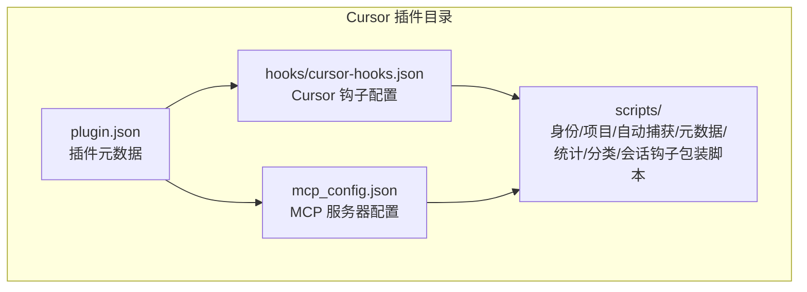
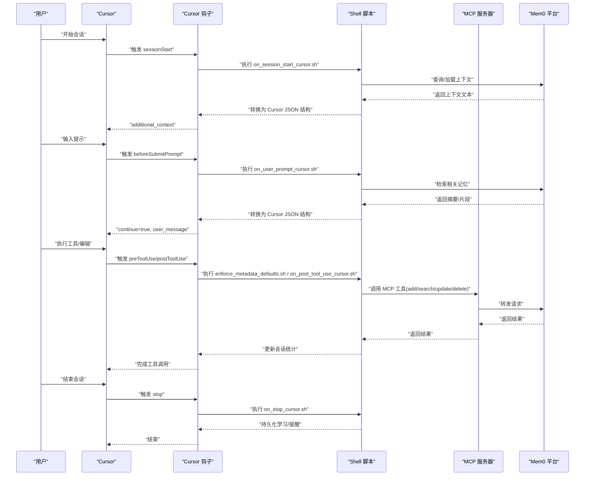
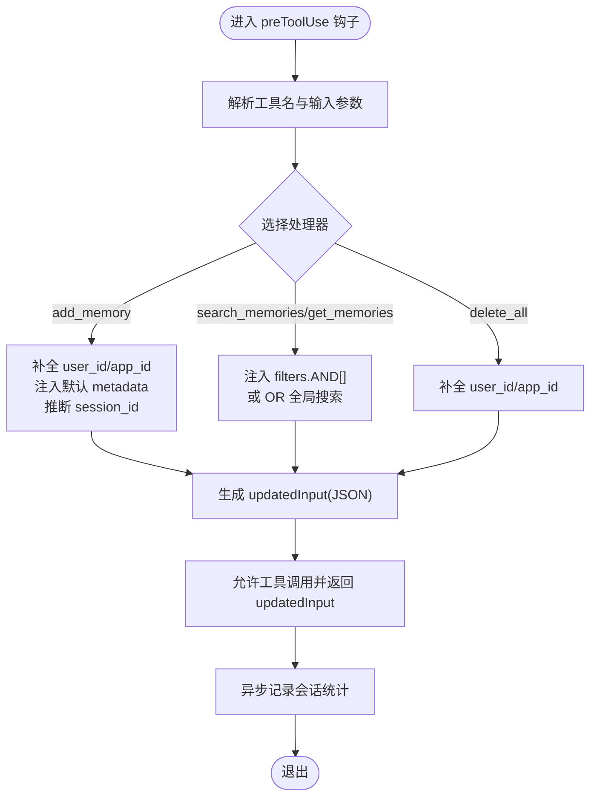
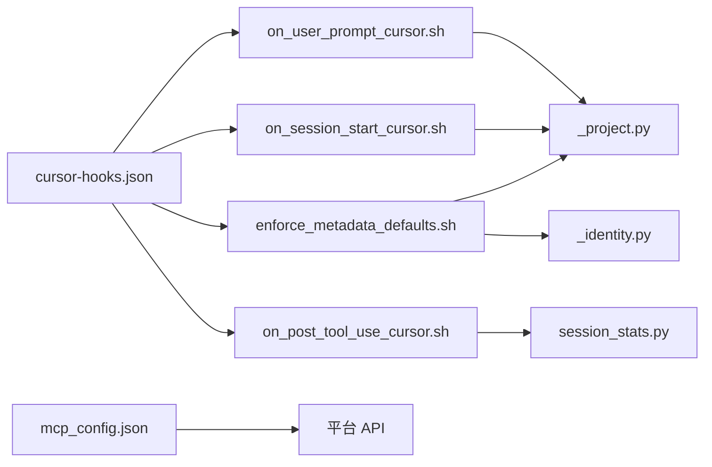

# Cursor 插件

<cite>
**本文引用的文件**
- [plugin.json](file://integrations/mem0-plugin/plugin.json)
- [README.md](file://integrations/mem0-plugin/README.md)
- [hooks/cursor-hooks.json](file://integrations/mem0-plugin/hooks/cursor-hooks.json)
- [scripts/load_settings.py](file://integrations/mem0-plugin/scripts/load_settings.py)
- [scripts/auto_capture.py](file://integrations/mem0-plugin/scripts/auto_capture.py)
- [scripts/enforce_metadata_defaults.sh](file://integrations/mem0-plugin/scripts/enforce_metadata_defaults.sh)
- [scripts/on_user_prompt_cursor.sh](file://integrations/mem0-plugin/scripts/on_user_prompt_cursor.sh)
- [scripts/on_session_start_cursor.sh](file://integrations/mem0-plugin/scripts/on_session_start_cursor.sh)
- [scripts/setup_coding_categories.py](file://integrations/mem0-plugin/scripts/setup_coding_categories.py)
- [scripts/session_stats.py](file://integrations/mem0-plugin/scripts/session_stats.py)
- [scripts/_identity.py](file://integrations/mem0-plugin/scripts/_identity.py)
- [scripts/_project.py](file://integrations/mem0-plugin/scripts/_project.py)
- [mcp_config.json](file://integrations/mem0-plugin/mcp_config.json)
</cite>

## 目录
1. [简介](#简介)
2. [项目结构](#项目结构)
3. [核心组件](#核心组件)
4. [架构总览](#架构总览)
5. [详细组件分析](#详细组件分析)
6. [依赖关系分析](#依赖关系分析)
7. [性能考量](#性能考量)
8. [故障排除指南](#故障排除指南)
9. [结论](#结论)
10. [附录](#附录)

## 简介
本指南面向 Cursor 用户与集成开发者，系统讲解 mem0 Cursor 插件的安装、初始化配置、功能激活与使用方法。该插件通过 MCP（Model Context Protocol）服务器提供“持久语义记忆”能力，结合生命周期钩子实现自动记忆捕获与上下文注入，显著提升 Cursor 在 AI 编程中的代码记忆、上下文理解与智能建议质量。

- 增强点概览
  - 持久记忆：跨会话、用户级记忆存储与检索
  - 自动捕获：在关键交互节点自动抽取对话要点并写入记忆
  - 上下文注入：在用户提交提示前自动注入相关记忆作为额外上下文
  - 分类优化：默认消费类分类替换为面向编程的分类体系
  - 统计追踪：记录会话内新增与检索次数，辅助复盘

## 项目结构
Cursor 插件由以下关键部分组成：
- 插件清单与元数据：定义插件标识、版本、关键词与上下文文件
- 生命周期钩子：定义会话开始、工具调用前后、停止等事件触发的脚本
- MCP 配置：声明远程 MCP 服务器地址与鉴权头
- 脚本集合：身份解析、项目识别、自动捕获、元数据补全、统计追踪、分类设置等
- 技能文档：帮助用户在 Cursor 中通过命令调用插件技能

图表来源
- [plugin.json:1-14](file://integrations/mem0-plugin/plugin.json#L1-L14)
- [hooks/cursor-hooks.json:1-57](file://integrations/mem0-plugin/hooks/cursor-hooks.json#L1-L57)
- [mcp_config.json:1-11](file://integrations/mem0-plugin/mcp_config.json#L1-L11)

章节来源
- [plugin.json:1-14](file://integrations/mem0-plugin/plugin.json#L1-L14)
- [README.md:1-306](file://integrations/mem0-plugin/README.md#L1-L306)
- [hooks/cursor-hooks.json:1-57](file://integrations/mem0-plugin/hooks/cursor-hooks.json#L1-L57)
- [mcp_config.json:1-11](file://integrations/mem0-plugin/mcp_config.json#L1-L11)

## 核心组件
- 插件清单与元数据
  - 提供插件标识、名称、版本、描述、关键词、上下文文件等信息
- Cursor 生命周期钩子
  - 定义会话开始、预工具调用、后工具调用、停止、预压缩、提交提示前等事件
  - 每个事件绑定到具体脚本，实现自动上下文注入、元数据补全、读取/编辑/运行输出处理等
- MCP 配置
  - 指定远程 MCP 服务器地址与 Authorization 头（基于环境变量）
- 身份与项目解析
  - 解析 API Key、用户 ID、项目 ID、分支名，并支持从 shell 配置文件回退解析
- 自动捕获
  - 从会话转录中提取最近的对话交换，调用平台 API 写入记忆
- 元数据默认值注入
  - 在工具调用前自动补全 user_id/app_id、搜索过滤器、默认 confidence/files/type 等
- 会话统计
  - 记录会话内新增与检索次数，支持报告与清理
- 编码分类设置
  - 将默认分类替换为面向编程的 17 类别，便于检索与组织

章节来源
- [plugin.json:1-14](file://integrations/mem0-plugin/plugin.json#L1-L14)
- [hooks/cursor-hooks.json:1-57](file://integrations/mem0-plugin/hooks/cursor-hooks.json#L1-L57)
- [mcp_config.json:1-11](file://integrations/mem0-plugin/mcp_config.json#L1-L11)
- [scripts/_identity.py:1-105](file://integrations/mem0-plugin/scripts/_identity.py#L1-L105)
- [scripts/_project.py:1-176](file://integrations/mem0-plugin/scripts/_project.py#L1-L176)
- [scripts/auto_capture.py:1-211](file://integrations/mem0-plugin/scripts/auto_capture.py#L1-L211)
- [scripts/enforce_metadata_defaults.sh:1-219](file://integrations/mem0-plugin/scripts/enforce_metadata_defaults.sh#L1-L219)
- [scripts/session_stats.py:1-139](file://integrations/mem0-plugin/scripts/session_stats.py#L1-L139)
- [scripts/setup_coding_categories.py:1-237](file://integrations/mem0-plugin/scripts/setup_coding_categories.py#L1-L237)

## 架构总览
Cursor 插件通过 MCP 服务器与平台交互，同时借助生命周期钩子在关键时机执行自动化动作。整体流程如下：

图表来源
- [hooks/cursor-hooks.json:1-57](file://integrations/mem0-plugin/hooks/cursor-hooks.json#L1-L57)
- [scripts/on_session_start_cursor.sh:1-23](file://integrations/mem0-plugin/scripts/on_session_start_cursor.sh#L1-L23)
- [scripts/on_user_prompt_cursor.sh:1-23](file://integrations/mem0-plugin/scripts/on_user_prompt_cursor.sh#L1-L23)
- [scripts/enforce_metadata_defaults.sh:1-219](file://integrations/mem0-plugin/scripts/enforce_metadata_defaults.sh#L1-L219)
- [mcp_config.json:1-11](file://integrations/mem0-plugin/mcp_config.json#L1-L11)

## 详细组件分析

### 安装与初始化配置
- 步骤一：设置 API Key
  - 在平台仪表板创建 API Key，确保以特定前缀开头
  - 在 Shell 配置中导出环境变量；桌面端需使用本地环境编辑器设置
  - 使用命令打印确认已生效
- 步骤二：安装插件
  - Cursor 市场安装（推荐，含钩子与技能）
  - 或通过一键链接直接安装 MCP 服务器
  - 或手动配置 .cursor/mcp.json 指向远程 MCP 服务器
- 初始化后运行 onboard 命令，完成健康检查、导入项目文件、安装编码分类等

章节来源
- [README.md:17-50](file://integrations/mem0-plugin/README.md#L17-L50)
- [README.md:129-157](file://integrations/mem0-plugin/README.md#L129-L157)
- [README.md:200-215](file://integrations/mem0-plugin/README.md#L200-L215)

### 生命周期钩子与自动捕获
- 钩子类型与作用
  - sessionStart：加载历史记忆作为初始上下文
  - beforeSubmitPrompt：在提交前注入相关记忆摘要
  - preToolUse：补全 user_id/app_id、默认 metadata、按全局/项目范围注入过滤条件
  - postToolUse：记录会话统计、处理 Bash 输出等
  - stop：提醒保存学习成果
  - preCompact：预压缩阶段的处理
- 自动捕获策略
  - 从会话转录末尾提取最近若干轮对话交换
  - 过滤无效内容，限制字符长度，调用平台 API 写入记忆
  - 自动设置 metadata（confidence、files、source、type），并尝试注入 session_id

图表来源
- [scripts/enforce_metadata_defaults.sh:1-219](file://integrations/mem0-plugin/scripts/enforce_metadata_defaults.sh#L1-L219)
- [scripts/session_stats.py:1-139](file://integrations/mem0-plugin/scripts/session_stats.py#L1-L139)

章节来源
- [hooks/cursor-hooks.json:1-57](file://integrations/mem0-plugin/hooks/cursor-hooks.json#L1-L57)
- [scripts/on_session_start_cursor.sh:1-23](file://integrations/mem0-plugin/scripts/on_session_start_cursor.sh#L1-L23)
- [scripts/on_user_prompt_cursor.sh:1-23](file://integrations/mem0-plugin/scripts/on_user_prompt_cursor.sh#L1-L23)
- [scripts/auto_capture.py:1-211](file://integrations/mem0-plugin/scripts/auto_capture.py#L1-L211)
- [scripts/enforce_metadata_defaults.sh:1-219](file://integrations/mem0-plugin/scripts/enforce_metadata_defaults.sh#L1-L219)
- [scripts/session_stats.py:1-139](file://integrations/mem0-plugin/scripts/session_stats.py#L1-L139)

### 身份解析与项目识别
- 身份解析
  - 优先级：显式环境变量 > 插件用户配置 > 历史配置文件回退解析 > 默认值
- 项目识别
  - 优先级：显式环境变量 > 本地映射表 > Git 远端 slug > 当前目录名
  - 支持远程哈希自愈：当目录移动/重命名时仍可恢复项目 ID

```mermaid
flowchart TD
A["resolve_api_key"] --> B{"MEM0_API_KEY 是否存在?"}
B --> |是| R1["返回 MEM0_API_KEY"]
B --> |否| C{"CLAUDE_PLUGIN_OPTION_* 是否存在?"}
C --> |是| R2["返回用户配置键"]
C --> |否| D{"shell 配置文件是否包含?"}
D --> |是| R3["解析并返回"]
D --> |否| R4["返回空"]
subgraph "项目识别"
E["resolve_project_id"] --> F{"MEM0_PROJECT_ID 是否存在?"}
F --> |是| R5["返回显式项目ID"]
F --> |否| G{"project_map.json 是否存在且命中?"}
G --> |是| R6["返回映射ID"]
G --> |否| H{"Git 远端 URL 是否存在?"}
H --> |是| R7["生成 slug"]
H --> |否| R8["返回目录名"]
end
```

图表来源
- [scripts/_identity.py:1-105](file://integrations/mem0-plugin/scripts/_identity.py#L1-L105)
- [scripts/_project.py:1-176](file://integrations/mem0-plugin/scripts/_project.py#L1-L176)

章节来源
- [scripts/_identity.py:1-105](file://integrations/mem0-plugin/scripts/_identity.py#L1-L105)
- [scripts/_project.py:1-176](file://integrations/mem0-plugin/scripts/_project.py#L1-L176)

### MCP 服务器与工具
- MCP 服务器
  - 远程地址与 Authorization 头（基于环境变量）已在配置中声明
- 可用工具
  - 添加、搜索、列出、获取、更新、删除记忆
  - 批量删除、实体列表、删除实体等

章节来源
- [mcp_config.json:1-11](file://integrations/mem0-plugin/mcp_config.json#L1-L11)
- [README.md:287-302](file://integrations/mem0-plugin/README.md#L287-L302)

### 配置选项详解
- 用户设置文件
  - 位置：用户主目录下的专用设置文件
  - 关键项：自动保存、自动搜索、搜索上限、保留天数、置信度阈值、全局搜索开关、调试开关
  - 默认值：内置默认集合并支持用户覆盖
- 环境变量
  - MEM0_API_KEY：平台 API Key
  - MEM0_USER_ID：显式用户 ID 覆盖
  - MEM0_PROJECT_ID：显式项目 ID 覆盖
  - MEM0_DEBUG：启用调试日志
- Cursor 特定行为
  - 全局搜索：当开启时，搜索过滤器改为 OR 全局模式
  - 会话统计：自动记录新增与检索次数，支持报告

章节来源
- [scripts/load_settings.py:1-51](file://integrations/mem0-plugin/scripts/load_settings.py#L1-L51)
- [scripts/enforce_metadata_defaults.sh:18-50](file://integrations/mem0-plugin/scripts/enforce_metadata_defaults.sh#L18-L50)

### 实际使用场景
- 代码重构
  - 使用记忆回顾历史决策、反模式与性能发现，避免重复踩坑
  - 通过上下文注入快速定位模块职责与接口契约
- 错误修复
  - 搜索同类问题的根因与修复方案，结合数据模型与测试模式进行对照
- 新功能开发
  - 利用领域术语与团队规范，确保一致性与可维护性
  - 通过会话统计与分类标签梳理知识分布，指导后续工作

章节来源
- [README.md:224-244](file://integrations/mem0-plugin/README.md#L224-L244)
- [scripts/setup_coding_categories.py:38-141](file://integrations/mem0-plugin/scripts/setup_coding_categories.py#L38-L141)

## 依赖关系分析
- 组件耦合
  - 钩子配置与脚本强耦合：每个事件绑定到具体脚本路径
  - 脚本之间存在协作：身份解析与项目解析被多个脚本复用
  - MCP 服务器为外部依赖，所有工具调用均经其转发
- 外部依赖
  - 平台 API：用于添加/搜索/管理记忆
  - Git：用于项目识别与分支解析
  - Shell 环境：用于读取 MEM0_* 环境变量

图表来源
- [hooks/cursor-hooks.json:1-57](file://integrations/mem0-plugin/hooks/cursor-hooks.json#L1-L57)
- [scripts/_identity.py:1-105](file://integrations/mem0-plugin/scripts/_identity.py#L1-L105)
- [scripts/_project.py:1-176](file://integrations/mem0-plugin/scripts/_project.py#L1-L176)
- [scripts/session_stats.py:1-139](file://integrations/mem0-plugin/scripts/session_stats.py#L1-L139)
- [mcp_config.json:1-11](file://integrations/mem0-plugin/mcp_config.json#L1-L11)

章节来源
- [hooks/cursor-hooks.json:1-57](file://integrations/mem0-plugin/hooks/cursor-hooks.json#L1-L57)
- [mcp_config.json:1-11](file://integrations/mem0-plugin/mcp_config.json#L1-L11)

## 性能考量
- 自动捕获节流
  - 仅在满足最小字符阈值与有效消息对时才写入，避免冗余
- 请求超时与重试
  - 工具调用设置合理超时，失败时记录警告而非阻塞
- 统计与日志
  - 调试日志可选开启，避免生产环境性能开销
- 搜索范围控制
  - 默认限制搜索条目数量，必要时可调整用户设置

章节来源
- [scripts/auto_capture.py:42-46](file://integrations/mem0-plugin/scripts/auto_capture.py#L42-L46)
- [scripts/auto_capture.py:140-151](file://integrations/mem0-plugin/scripts/auto_capture.py#L140-L151)
- [scripts/load_settings.py:13-21](file://integrations/mem0-plugin/scripts/load_settings.py#L13-L21)

## 故障排除指南
- API Key 未设置或无效
  - 确认环境变量已导出，且以平台提供的前缀开头
  - 检查桌面端本地环境编辑器是否正确配置
- 无法连接 MCP 服务器
  - 重启客户端以重新读取环境变量
  - 确认网络可达与授权头正确
- 钩子不生效
  - 确认 Cursor 已安装完整插件（含钩子）
  - 检查钩子匹配器与脚本路径是否正确
- 全局搜索不符合预期
  - 检查用户设置中的全局搜索开关
- 分类未更新为编码类
  - 使用脚本预览当前分类并与提议分类对比
  - 在确认无差异后再执行应用操作

章节来源
- [README.md:17-50](file://integrations/mem0-plugin/README.md#L17-L50)
- [README.md:257-270](file://integrations/mem0-plugin/README.md#L257-L270)
- [scripts/enforce_metadata_defaults.sh:18-50](file://integrations/mem0-plugin/scripts/enforce_metadata_defaults.sh#L18-L50)
- [scripts/setup_coding_categories.py:169-237](file://integrations/mem0-plugin/scripts/setup_coding_categories.py#L169-L237)

## 结论
Cursor 插件通过 MCP 与生命周期钩子，将“持久语义记忆”无缝融入日常编程工作流。它不仅增强了 Cursor 的上下文理解与智能建议能力，还提供了自动捕获、分类优化与统计追踪等实用功能。遵循本文的安装与配置步骤，即可在 Cursor 中获得更高效、更智能的 AI 编程体验。

## 附录
- 快速验证
  - 运行健康检查命令，查看连接状态与统计信息
  - 尝试记忆存储与浏览命令，确认写入与检索正常
- 常用命令参考
  - onboard：初始化与诊断
  - health：健康检查
  - stats：会话统计
  - remember/peek/tour/dream/pin/forget：记忆管理与浏览

章节来源
- [README.md:200-223](file://integrations/mem0-plugin/README.md#L200-L223)
- [README.md:224-244](file://integrations/mem0-plugin/README.md#L224-L244)