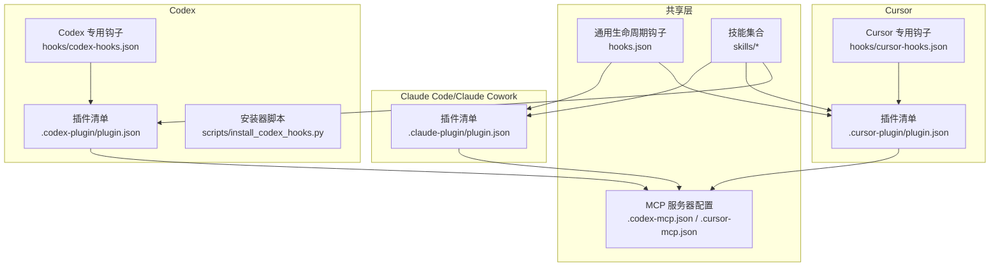
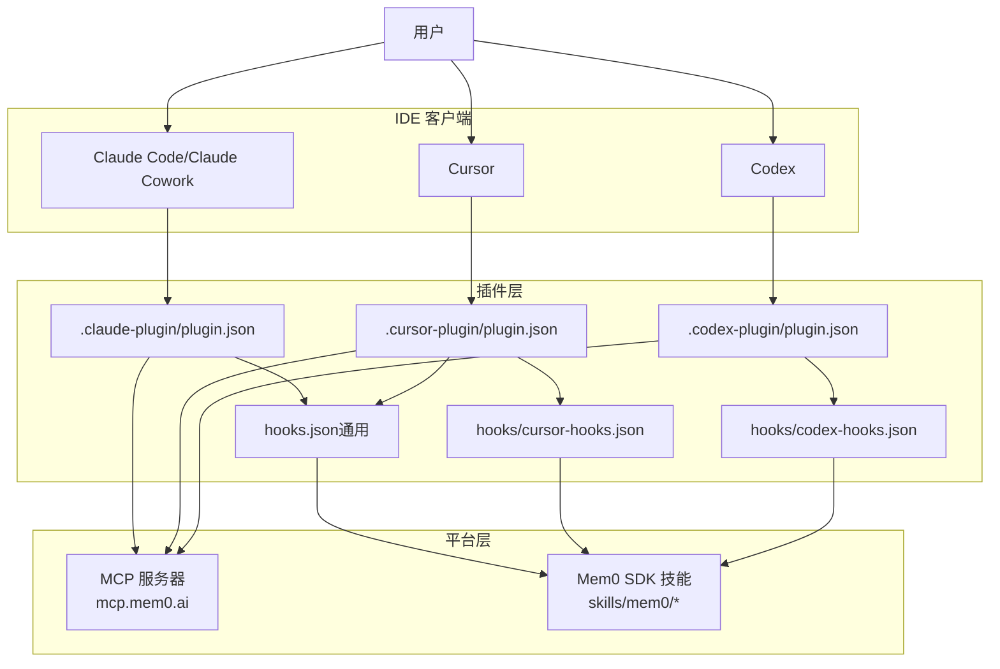
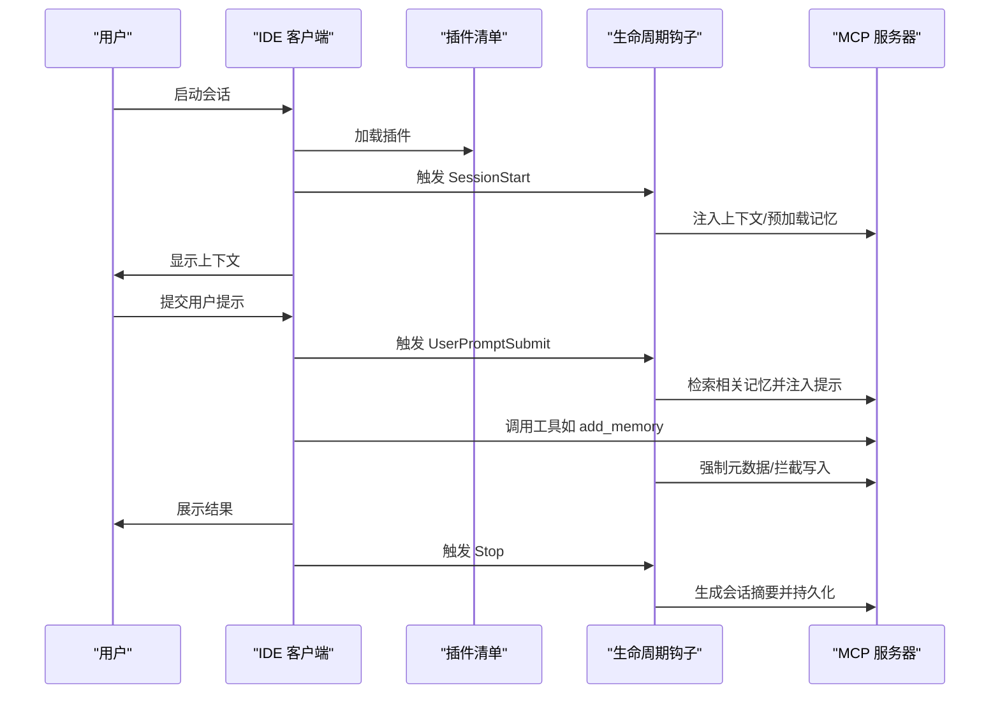
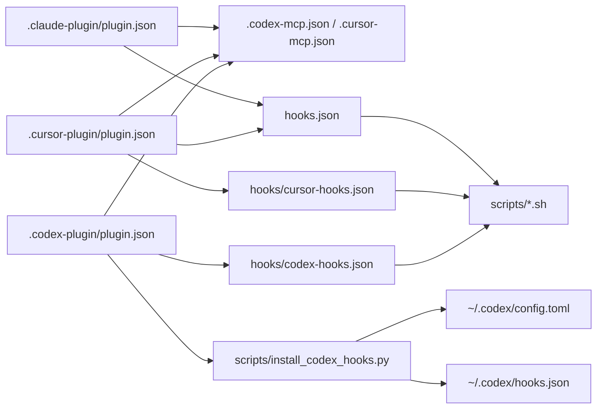

# IDE 集成插件

<cite>
**本文引用的文件**
- [integrations/mem0-plugin/plugin.json](file://integrations/mem0-plugin/plugin.json)
- [integrations/mem0-plugin/.claude-plugin/plugin.json](file://integrations/mem0-plugin/.claude-plugin/plugin.json)
- [integrations/mem0-plugin/.codex-plugin/plugin.json](file://integrations/mem0-plugin/.codex-plugin/plugin.json)
- [integrations/mem0-plugin/.cursor-plugin/plugin.json](file://integrations/mem0-plugin/.cursor-plugin/plugin.json)
- [integrations/mem0-plugin/README.md](file://integrations/mem0-plugin/README.md)
- [.codex-mcp.json](file://integrations/mem0-plugin/.codex-mcp.json)
- [.cursor-mcp.json](file://integrations/mem0-plugin/.cursor-mcp.json)
- [hooks.json](file://integrations/mem0-plugin/hooks.json)
- [hooks/cursor-hooks.json](file://integrations/mem0-plugin/hooks/cursor-hooks.json)
- [hooks/codex-hooks.json](file://integrations/mem0-plugin/hooks/codex-hooks.json)
- [scripts/install_codex_hooks.py](file://integrations/mem0-plugin/scripts/install_codex_hooks.py)
- [skills/mem0/README.md](file://integrations/mem0-plugin/skills/mem0/README.md)
- [skills/mem0/SKILL.md](file://integrations/mem0-plugin/skills/mem0/SKILL.md)
- [skills/remember/SKILL.md](file://integrations/mem0-plugin/skills/remember/SKILL.md)
- [skills/tour/SKILL.md](file://integrations/mem0-plugin/skills/tour/SKILL.md)
- [skills/onboard/SKILL.md](file://integrations/mem0-plugin/skills/onboard/SKILL.md)
</cite>

## 目录
1. [简介](#简介)
2. [项目结构](#项目结构)
3. [核心组件](#核心组件)
4. [架构总览](#架构总览)
5. [详细组件分析](#详细组件分析)
6. [依赖关系分析](#依赖关系分析)
7. [性能考量](#性能考量)
8. [故障排除指南](#故障排除指南)
9. [结论](#结论)
10. [附录](#附录)

## 简介
本文件为面向 Claude Code、Cursor、Codex 等主流 AI 开发工具的 IDE 集成插件综合文档。内容覆盖各 IDE 的插件配置文件结构、安装步骤与使用方法；解释各 IDE 特有的功能特性、快捷键绑定与工作流集成；提供插件启用、配置与故障排除的详细指南，并给出实际配置示例与最佳实践建议。

## 项目结构
该插件以“统一平台 + 多 IDE 适配”的方式组织：共享的 MCP 服务器、生命周期钩子与技能集合，以及针对不同 IDE 的独立插件清单与接口描述。

图表来源
- [integrations/mem0-plugin/.codex-mcp.json:1-9](file://integrations/mem0-plugin/.codex-mcp.json#L1-L9)
- [integrations/mem0-plugin/.cursor-mcp.json:1-11](file://integrations/mem0-plugin/.cursor-mcp.json#L1-L11)
- [integrations/mem0-plugin/hooks.json:1-105](file://integrations/mem0-plugin/hooks.json#L1-L105)
- [integrations/mem0-plugin/hooks/codex-hooks.json:1-105](file://integrations/mem0-plugin/hooks/codex-hooks.json#L1-L105)
- [integrations/mem0-plugin/hooks/cursor-hooks.json:1-57](file://integrations/mem0-plugin/hooks/cursor-hooks.json#L1-L57)
- [integrations/mem0-plugin/.claude-plugin/plugin.json:1-23](file://integrations/mem0-plugin/.claude-plugin/plugin.json#L1-L23)
- [integrations/mem0-plugin/.codex-plugin/plugin.json:1-36](file://integrations/mem0-plugin/.codex-plugin/plugin.json#L1-L36)
- [integrations/mem0-plugin/.cursor-plugin/plugin.json:1-18](file://integrations/mem0-plugin/.cursor-plugin/plugin.json#L1-L18)

章节来源
- [integrations/mem0-plugin/README.md:1-306](file://integrations/mem0-plugin/README.md#L1-L306)

## 核心组件
- 插件清单（plugin.json）：定义插件元数据、关键词、入口与能力声明，用于在各 IDE 市场中注册与识别。
- MCP 服务器配置：定义远程 MCP 服务地址与认证方式，供各 IDE 连接平台工具集。
- 生命周期钩子：在会话关键节点自动触发脚本，实现上下文注入、写入拦截、元数据强制与摘要生成等。
- 技能集合：通过命令式技能提供“记忆检索、浏览、导入导出、健康检查”等能力，支持多语言 SDK 参考与集成模式。

章节来源
- [integrations/mem0-plugin/plugin.json:1-14](file://integrations/mem0-plugin/plugin.json#L1-L14)
- [integrations/mem0-plugin/.codex-mcp.json:1-9](file://integrations/mem0-plugin/.codex-mcp.json#L1-L9)
- [integrations/mem0-plugin/.cursor-mcp.json:1-11](file://integrations/mem0-plugin/.cursor-mcp.json#L1-L11)
- [integrations/mem0-plugin/hooks.json:1-105](file://integrations/mem0-plugin/hooks.json#L1-L105)
- [integrations/mem0-plugin/skills/mem0/README.md:1-74](file://integrations/mem0-plugin/skills/mem0/README.md#L1-L74)

## 架构总览
下图展示跨 IDE 的统一架构：所有 IDE 通过各自的插件清单连接到统一的 Mem0 平台 MCP 服务器；部分 IDE（Cursor、Claude）内置生命周期钩子；Codex 通过独立安装器将钩子合并至其 hooks.json。

图表来源
- [integrations/mem0-plugin/.claude-plugin/plugin.json:1-23](file://integrations/mem0-plugin/.claude-plugin/plugin.json#L1-L23)
- [integrations/mem0-plugin/.cursor-plugin/plugin.json:1-18](file://integrations/mem0-plugin/.cursor-plugin/plugin.json#L1-L18)
- [integrations/mem0-plugin/.codex-plugin/plugin.json:1-36](file://integrations/mem0-plugin/.codex-plugin/plugin.json#L1-L36)
- [integrations/mem0-plugin/hooks.json:1-105](file://integrations/mem0-plugin/hooks.json#L1-L105)
- [integrations/mem0-plugin/hooks/cursor-hooks.json:1-57](file://integrations/mem0-plugin/hooks/cursor-hooks.json#L1-L57)
- [integrations/mem0-plugin/hooks/codex-hooks.json:1-105](file://integrations/mem0-plugin/hooks/codex-hooks.json#L1-L105)
- [integrations/mem0-plugin/.codex-mcp.json:1-9](file://integrations/mem0-plugin/.codex-mcp.json#L1-L9)
- [integrations/mem0-plugin/.cursor-mcp.json:1-11](file://integrations/mem0-plugin/.cursor-mcp.json#L1-L11)

## 详细组件分析

### 插件清单与能力声明
- 共享插件清单（根级）：定义插件标识、版本、描述、关键词与上下文文件名，作为统一入口。
- Claude 插件清单：声明用户配置项（如 API Key），强调持久化记忆与语义搜索能力。
- Cursor 插件清单：声明技能目录、MCP 服务器与界面信息，突出品牌色与默认提示词。
- Codex 插件清单：声明技能目录、MCP 服务器与钩子文件，提供接口与能力声明。

章节来源
- [integrations/mem0-plugin/plugin.json:1-14](file://integrations/mem0-plugin/plugin.json#L1-L14)
- [integrations/mem0-plugin/.claude-plugin/plugin.json:1-23](file://integrations/mem0-plugin/.claude-plugin/plugin.json#L1-L23)
- [integrations/mem0-plugin/.cursor-plugin/plugin.json:1-18](file://integrations/mem0-plugin/.cursor-plugin/plugin.json#L1-L18)
- [integrations/mem0-plugin/.codex-plugin/plugin.json:1-36](file://integrations/mem0-plugin/.codex-plugin/plugin.json#L1-L36)

### MCP 服务器配置
- Codex：通过 TOML 配置文件注册 HTTP MCP 服务器，使用环境变量作为 bearer token。
- Cursor：通过 JSON 配置文件注册 MCP 服务器，使用 Authorization 头携带 Token。
- 统一认证：均依赖 MEM0_API_KEY 环境变量进行鉴权。

章节来源
- [integrations/mem0-plugin/.codex-mcp.json:1-9](file://integrations/mem0-plugin/.codex-mcp.json#L1-L9)
- [integrations/mem0-plugin/.cursor-mcp.json:1-11](file://integrations/mem0-plugin/.cursor-mcp.json#L1-L11)
- [integrations/mem0-plugin/README.md:74-82](file://integrations/mem0-plugin/README.md#L74-L82)
- [integrations/mem0-plugin/README.md:139-152](file://integrations/mem0-plugin/README.md#L139-L152)

### 生命周期钩子与工作流集成
- 通用钩子（hooks.json）：定义 SessionStart、UserPromptSubmit、PreToolUse、PostToolUse、Stop 等事件，覆盖上下文加载、文件读取、工具调用前后、写入拦截与会话总结。
- Cursor 专用钩子（hooks/cursor-hooks.json）：映射到 sessionStart、preToolUse、postToolUse、stop、preCompact、beforeSubmitPrompt 等事件，路径使用 ${CURSOR_PLUGIN_ROOT} 占位符。
- Codex 专用钩子（hooks/codex-hooks.json）：与通用钩子类似，但通过 MEM0_PLATFORM=codex 区分平台行为，并要求在 config.toml 中开启 codex_hooks 功能标志。
- 安装器脚本（scripts/install_codex_hooks.py）：将模板中的 ${PLUGIN_ROOT} 替换为绝对路径后合并到 ~/.codex/hooks.json，支持卸载与幂等更新。

图表来源
- [integrations/mem0-plugin/hooks.json:1-105](file://integrations/mem0-plugin/hooks.json#L1-L105)
- [integrations/mem0-plugin/hooks/cursor-hooks.json:1-57](file://integrations/mem0-plugin/hooks/cursor-hooks.json#L1-L57)
- [integrations/mem0-plugin/hooks/codex-hooks.json:1-105](file://integrations/mem0-plugin/hooks/codex-hooks.json#L1-L105)
- [integrations/mem0-plugin/scripts/install_codex_hooks.py:1-163](file://integrations/mem0-plugin/scripts/install_codex_hooks.py#L1-L163)

章节来源
- [integrations/mem0-plugin/hooks.json:1-105](file://integrations/mem0-plugin/hooks.json#L1-L105)
- [integrations/mem0-plugin/hooks/cursor-hooks.json:1-57](file://integrations/mem0-plugin/hooks/cursor-hooks.json#L1-L57)
- [integrations/mem0-plugin/hooks/codex-hooks.json:1-105](file://integrations/mem0-plugin/hooks/codex-hooks.json#L1-L105)
- [integrations/mem0-plugin/scripts/install_codex_hooks.py:1-163](file://integrations/mem0-plugin/scripts/install_codex_hooks.py#L1-L163)

### 技能集合与命令式操作
- Mem0 SDK 技能：提供 Python/TypeScript SDK 参考、框架集成模式与实时文档搜索能力，帮助在应用中集成持久记忆。
- 记忆存储技能（remember）：从用户输入提取内容，按类型分类并调用 add_memory 存储，支持显式 confidence 与 source 标记。
- 项目巡览技能（tour）：按类别聚合显示全部记忆或在查询时以紧凑模式返回结果，支持跨项目模式与分组排序。
- 上线向导技能（onboard）：引导完成 API Key 设置、MCP 连接验证、项目文件导入与编码类目安装，确保插件在新项目中正确激活。

章节来源
- [integrations/mem0-plugin/skills/mem0/README.md:1-74](file://integrations/mem0-plugin/skills/mem0/README.md#L1-L74)
- [integrations/mem0-plugin/skills/mem0/SKILL.md:1-188](file://integrations/mem0-plugin/skills/mem0/SKILL.md#L1-L188)
- [integrations/mem0-plugin/skills/remember/SKILL.md:1-58](file://integrations/mem0-plugin/skills/remember/SKILL.md#L1-L58)
- [integrations/mem0-plugin/skills/tour/SKILL.md:1-124](file://integrations/mem0-plugin/skills/tour/SKILL.md#L1-L124)
- [integrations/mem0-plugin/skills/onboard/SKILL.md:1-185](file://integrations/mem0-plugin/skills/onboard/SKILL.md#L1-L185)

## 依赖关系分析
- 插件清单对 MCP 服务器与钩子的依赖：各 IDE 插件清单声明 skills、mcpServers 与 hooks 字段，指向共享或专用配置。
- 钩子对脚本的依赖：钩子通过 bash 脚本执行上下文注入、元数据强制与摘要生成，脚本位于 scripts/ 目录。
- 安装器对系统配置的依赖：Codex 需要在 config.toml 中开启 codex_hooks 功能标志，并在 hooks.json 中注册绝对路径。

图表来源
- [integrations/mem0-plugin/.claude-plugin/plugin.json:1-23](file://integrations/mem0-plugin/.claude-plugin/plugin.json#L1-L23)
- [integrations/mem0-plugin/.cursor-plugin/plugin.json:1-18](file://integrations/mem0-plugin/.cursor-plugin/plugin.json#L1-L18)
- [integrations/mem0-plugin/.codex-plugin/plugin.json:1-36](file://integrations/mem0-plugin/.codex-plugin/plugin.json#L1-L36)
- [integrations/mem0-plugin/.codex-mcp.json:1-9](file://integrations/mem0-plugin/.codex-mcp.json#L1-L9)
- [integrations/mem0-plugin/.cursor-mcp.json:1-11](file://integrations/mem0-plugin/.cursor-mcp.json#L1-L11)
- [integrations/mem0-plugin/hooks.json:1-105](file://integrations/mem0-plugin/hooks.json#L1-L105)
- [integrations/mem0-plugin/hooks/cursor-hooks.json:1-57](file://integrations/mem0-plugin/hooks/cursor-hooks.json#L1-L57)
- [integrations/mem0-plugin/hooks/codex-hooks.json:1-105](file://integrations/mem0-plugin/hooks/codex-hooks.json#L1-L105)
- [integrations/mem0-plugin/scripts/install_codex_hooks.py:1-163](file://integrations/mem0-plugin/scripts/install_codex_hooks.py#L1-L163)

章节来源
- [integrations/mem0-plugin/README.md:113-121](file://integrations/mem0-plugin/README.md#L113-L121)
- [integrations/mem0-plugin/scripts/install_codex_hooks.py:18-22](file://integrations/mem0-plugin/scripts/install_codex_hooks.py#L18-L22)

## 性能考量
- 异步写入与延迟：平台 v3 写入为异步，需等待事件处理完成后再进行检索，避免空结果。
- 检索参数优化：合理设置 top_k、阈值与重排策略，平衡召回与质量。
- 分类与去重：避免在同一数据上混用 infer=True/False，防止重复存储。
- 并行检索：在巡览技能中并行执行多项语义搜索，提升响应速度。
- 缓存与幂等：编码类目安装与项目文件导入具备幂等性，减少重复网络请求。

章节来源
- [integrations/mem0-plugin/skills/mem0/SKILL.md:123-131](file://integrations/mem0-plugin/skills/mem0/SKILL.md#L123-L131)
- [integrations/mem0-plugin/skills/tour/SKILL.md:39-71](file://integrations/mem0-plugin/skills/tour/SKILL.md#L39-L71)
- [integrations/mem0-plugin/skills/onboard/SKILL.md:144-169](file://integrations/mem0-plugin/skills/onboard/SKILL.md#L144-L169)

## 故障排除指南
- API Key 设置
  - 确认 MEM0_API_KEY 已设置且以 m0- 开头。
  - 在桌面应用中使用本地环境编辑器设置，而非依赖 shell profile。
- MCP 连接问题
  - 重启客户端以刷新 MCP 连接；确认 MEM0_API_KEY 在新会话中可被读取。
  - Codex 需在 config.toml 中开启 codex_hooks 功能标志。
- 钩子未生效
  - 使用安装器脚本将钩子合并至 ~/.codex/hooks.json，并确保 feature flag 已启用。
  - 在 Windows 环境下，Codex 直接注册 .sh 脚本可能无法执行，需在 WSL 或 Git Bash 中运行安装器。
- 技能不可用
  - 通过工具搜索验证 MCP 工具是否可用；若缺失，重新执行上线向导或重启客户端。
- 类目与导入
  - 若类目未安装，先执行依赖安装脚本，再运行自动安装脚本。
  - 项目文件导入失败时，检查 API Key 并重新运行上线向导。

章节来源
- [integrations/mem0-plugin/README.md:17-50](file://integrations/mem0-plugin/README.md#L17-L50)
- [integrations/mem0-plugin/README.md:257-270](file://integrations/mem0-plugin/README.md#L257-L270)
- [integrations/mem0-plugin/README.md:113-121](file://integrations/mem0-plugin/README.md#L113-L121)
- [integrations/mem0-plugin/scripts/install_codex_hooks.py:133-140](file://integrations/mem0-plugin/scripts/install_codex_hooks.py#L133-L140)
- [integrations/mem0-plugin/skills/onboard/SKILL.md:12-21](file://integrations/mem0-plugin/skills/onboard/SKILL.md#L12-L21)
- [integrations/mem0-plugin/skills/onboard/SKILL.md:164-168](file://integrations/mem0-plugin/skills/onboard/SKILL.md#L164-L168)

## 结论
该插件通过统一的 MCP 服务器与共享技能体系，为 Claude Code、Cursor、Codex 等 IDE 提供一致的记忆增强体验。借助生命周期钩子与自动化脚本，实现上下文注入、元数据强制与会话总结，显著提升开发效率与知识复用率。遵循本文提供的安装、配置与故障排除流程，可在各 IDE 中快速启用并稳定运行。

## 附录

### 各 IDE 安装与配置要点
- Claude Code / Claude Cowork
  - 通过插件市场添加与安装插件；安装后运行上线向导完成初始化。
- Codex
  - 选项 A：直接在 config.toml 中添加 MCP 服务器条目；选项 B：侧载插件并通过市场安装；可选启用生命周期钩子并通过安装器合并至 hooks.json。
- Cursor
  - 一键链接安装 MCP；或手动在 .cursor/mcp.json 中添加；也可通过 Cursor 市场安装完整插件（含钩子与技能）。

章节来源
- [integrations/mem0-plugin/README.md:55-68](file://integrations/mem0-plugin/README.md#L55-L68)
- [integrations/mem0-plugin/README.md:70-128](file://integrations/mem0-plugin/README.md#L70-L128)
- [integrations/mem0-plugin/README.md:129-157](file://integrations/mem0-plugin/README.md#L129-L157)

### 快捷键与常用命令
- 上线向导：/mem0:onboard
- 健康检查：/mem0:health
- 统计信息：/mem0:stats
- 记忆存储：/mem0:remember "<内容>"
- 项目巡览：/mem0:tour
- 导入导出：/mem0:import、/mem0:export

章节来源
- [integrations/mem0-plugin/README.md:200-244](file://integrations/mem0-plugin/README.md#L200-L244)