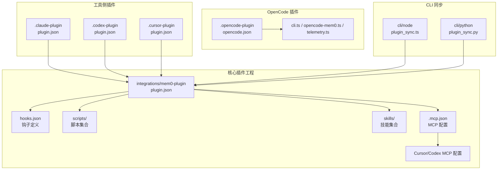
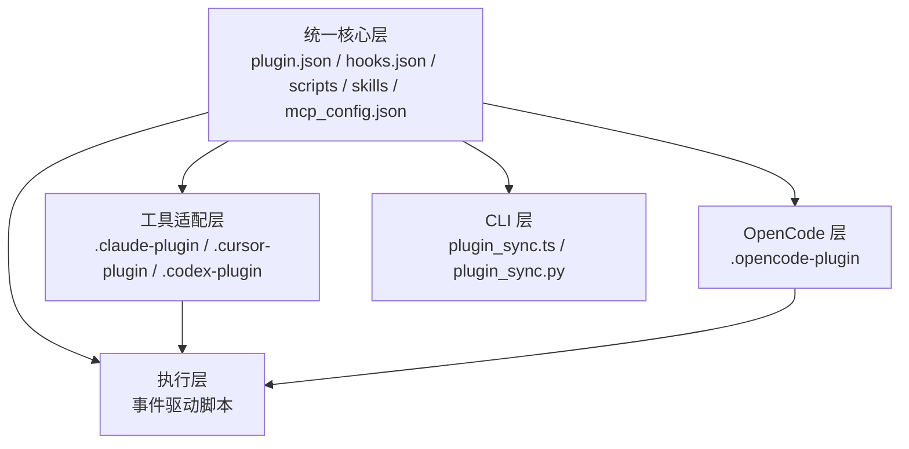
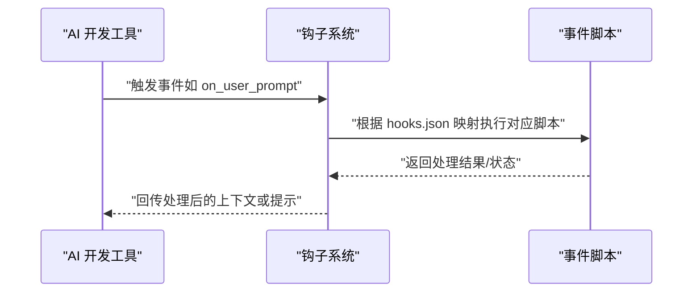
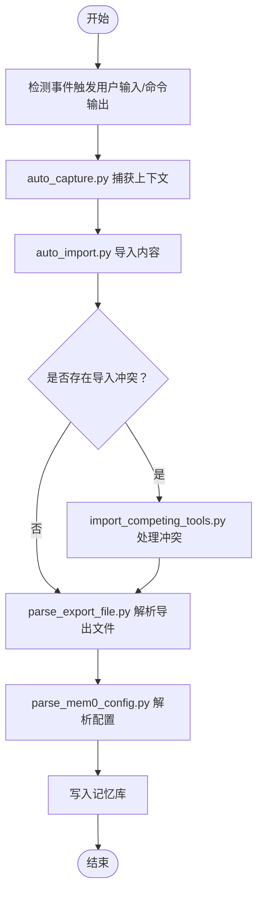
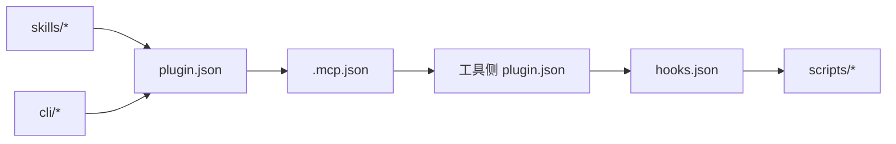

# Mem0 插件系统

<cite>
**本文档引用的文件**
- [plugin.json](file://integrations/mem0-plugin/plugin.json)
- [hooks.json](file://integrations/mem0-plugin/hooks.json)
- [mcp_config.json](file://integrations/mem0-plugin/mcp_config.json)
- [.mcp.json](file://integrations/mem0-plugin/.mcp.json)
- [.cursor-mcp.json](file://integrations/mem0-plugin/.cursor-mcp.json)
- [.codex-mcp.json](file://integrations/mem0-plugin/.codex-mcp.json)
- [plugin.json（Claude）](file://integrations/mem0-plugin/.claude-plugin/plugin.json)
- [plugin.json（Cursor）](file://integrations/mem0-plugin/.cursor-plugin/plugin.json)
- [plugin.json（Codex）](file://integrations/mem0-plugin/.codex-plugin/plugin.json)
- [hooks.json（Cursor）](file://integrations/mem0-plugin/hooks/cursor-hooks.json)
- [hooks.json（Codex）](file://integrations/mem0-plugin/hooks/codex-hooks.json)
- [install_codex_hooks.py](file://integrations/mem0-plugin/scripts/install_codex_hooks.py)
- [auto_capture.py](file://integrations/mem0-plugin/scripts/auto_capture.py)
- [auto_import.py](file://integrations/mem0-plugin/scripts/auto_import.py)
- [on_bash_output.sh](file://integrations/mem0-plugin/scripts/on_bash_output.sh)
- [on_file_read.sh](file://integrations/mem0-plugin/scripts/on_file_read.sh)
- [on_user_prompt.sh](file://integrations/mem0-plugin/scripts/on_user_prompt.sh)
- [on_post_tool_use.sh](file://integrations/mem0-plugin/scripts/on_post_tool_use.sh)
- [on_pre_compact.sh](file://integrations/mem0-plugin/scripts/on_pre_compact.sh)
- [on_stop.sh](file://integrations/mem0-plugin/scripts/on_stop.sh)
- [session_stats.py](file://integrations/mem0-plugin/scripts/session_stats.py)
- [parse_mem0_config.py](file://integrations/mem0-plugin/scripts/parse_mem0_config.py)
- [telemetry.py](file://integrations/mem0-plugin/scripts/telemetry.py)
- [README.md（插件）](file://integrations/mem0-plugin/README.md)
- [SKILL.md（mem0 技能）](file://integrations/mem0-plugin/skills/mem0/SKILL.md)
- [README.md（mem0 技能）](file://integrations/mem0-plugin/skills/mem0/README.md)
- [plugin.json（OpenCode）](file://integrations/mem0-plugin/.opencode-plugin/opencode.json)
- [cli.ts（OpenCode）](file://integrations/mem0-plugin/.opencode-plugin/cli.ts)
- [opencode-mem0.ts（OpenCode）](file://integrations/mem0-plugin/.opencode-plugin/opencode-mem0.ts)
- [telemetry.ts（OpenCode）](file://integrations/mem0-plugin/.opencode-plugin/telemetry.ts)
- [README.md（OpenCode）](file://integrations/mem0-plugin/.opencode-plugin/README.md)
- [plugin.json（CLI Node）](file://cli/node/package.json)
- [plugin_sync.ts](file://cli/node/src/plugin-sync.ts)
- [index.ts（CLI Node）](file://cli/node/src/index.ts)
- [app.py（CLI Python）](file://cli/python/src/mem0_cli/app.py)
- [plugin_sync.py](file://cli/python/src/mem0_cli/plugin_sync.py)
- [README.md（CLI）](file://cli/node/README.md)
- [README.md（CLI Python）](file://cli/python/README.md)
- [mem0-docs：平台 MCP 集成](file://docs/platform/features/mcp-integration.mdx)
- [mem0-docs：Mem0 MCP](file://docs/platform/mem0-mcp.mdx)
</cite>

## 目录
1. [简介](#简介)
2. [项目结构](#项目结构)
3. [核心组件](#核心组件)
4. [架构总览](#架构总览)
5. [详细组件分析](#详细组件分析)
6. [依赖关系分析](#依赖关系分析)
7. [性能考虑](#性能考虑)
8. [故障排除指南](#故障排除指南)
9. [结论](#结论)
10. [附录](#附录)

## 简介
本文件系统性梳理 Mem0 插件体系，覆盖与 Claude Code、Cursor、Codex 等 AI 开发工具的集成方式，详解插件架构、MCP 协议实现与钩子系统，说明插件配置文件结构、技能定义与脚本执行机制，并提供插件开发指南、安装配置步骤与故障排除方法。文档同时给出面向不同工具的集成要点与最佳实践。

## 项目结构
Mem0 插件系统主要由以下部分组成：
- 工具侧插件清单：分别在 .claude-plugin、.cursor-plugin、.codex-plugin 下提供各工具的 plugin.json 清单，声明插件元数据与能力。
- 核心插件工程：integrations/mem0-plugin，包含统一的插件配置、钩子定义、脚本与技能集合。
- MCP 配置：.mcp.json、.cursor-mcp.json、.codex-mcp.json 等，用于声明 MCP 服务端点与协议参数。
- OpenCode 插件：.opencode-plugin 提供额外的技能与 CLI 能力。
- CLI 插件同步：cli/node 与 cli/python 提供插件安装、同步与状态管理能力。
- 文档：docs/platform/features/mcp-integration.mdx 与 docs/platform/mem0-mcp.mdx 对 MCP 集成进行官方说明。

图表来源
- [plugin.json（Claude）](file://integrations/mem0-plugin/.claude-plugin/plugin.json)
- [plugin.json（Cursor）](file://integrations/mem0-plugin/.cursor-plugin/plugin.json)
- [plugin.json（Codex）](file://integrations/mem0-plugin/.codex-plugin/plugin.json)
- [plugin.json](file://integrations/mem0-plugin/plugin.json)
- [.mcp.json](file://integrations/mem0-plugin/.mcp.json)
- [.cursor-mcp.json](file://integrations/mem0-plugin/.cursor-mcp.json)
- [.codex-mcp.json](file://integrations/mem0-plugin/.codex-mcp.json)
- [plugin.json（OpenCode）](file://integrations/mem0-plugin/.opencode-plugin/opencode.json)
- [cli.ts（OpenCode）](file://integrations/mem0-plugin/.opencode-plugin/cli.ts)

章节来源
- [plugin.json](file://integrations/mem0-plugin/plugin.json)
- [hooks.json](file://integrations/mem0-plugin/hooks.json)
- [mcp_config.json](file://integrations/mem0-plugin/mcp_config.json)
- [.mcp.json](file://integrations/mem0-plugin/.mcp.json)
- [.cursor-mcp.json](file://integrations/mem0-plugin/.cursor-mcp.json)
- [.codex-mcp.json](file://integrations/mem0-plugin/.codex-mcp.json)
- [plugin.json（Claude）](file://integrations/mem0-plugin/.claude-plugin/plugin.json)
- [plugin.json（Cursor）](file://integrations/mem0-plugin/.cursor-plugin/plugin.json)
- [plugin.json（Codex）](file://integrations/mem0-plugin/.codex-plugin/plugin.json)
- [plugin.json（OpenCode）](file://integrations/mem0-plugin/.opencode-plugin/opencode.json)
- [cli.ts（OpenCode）](file://integrations/mem0-plugin/.opencode-plugin/cli.ts)

## 核心组件
- 插件清单与元数据
  - 各工具侧 plugin.json 声明插件名称、版本、描述、入口与能力范围，确保工具正确识别与加载插件。
  - 核心 plugin.json 统一定义插件能力、MCP 服务端点、钩子映射与技能清单。
- 钩子系统
  - hooks.json 定义事件钩子映射，将工具生命周期事件（如用户输入、文件读取、会话开始、工具调用后等）绑定到对应脚本。
  - Cursor 与 Codex 的专用 hooks.json 提供差异化钩子策略。
- 脚本执行机制
  - scripts/ 下包含大量事件驱动脚本，负责自动捕获、导入、分类、统计与遥测等任务。
  - 支持 Python 与 Shell 双语言脚本，满足不同平台与工具链需求。
- 技能集合
  - skills/ 下提供可复用的技能模块（如 export、import、stats、remember 等），每个技能附带 SKILL.md 说明其用途与接口。
  - mem0 技能提供 SDK 使用指南与集成模式，便于在工具中调用 Mem0 能力。
- MCP 协议实现
  - .mcp.json 与工具侧 .cursor-mcp.json、.codex-mcp.json 声明 MCP 服务端点、认证与传输参数，实现与工具的标准化通信。
- OpenCode 插件
  - .opencode-plugin 提供独立的技能与 CLI 能力，通过 cli.ts、opencode-mem0.ts 与 telemetry.ts 实现与 Mem0 的对接。
- CLI 插件同步
  - cli/node 与 cli/python 的 plugin_sync.* 负责插件安装、更新与状态同步，保障本地环境与远端插件一致。

章节来源
- [plugin.json](file://integrations/mem0-plugin/plugin.json)
- [hooks.json](file://integrations/mem0-plugin/hooks.json)
- [hooks.json（Cursor）](file://integrations/mem0-plugin/hooks/cursor-hooks.json)
- [hooks.json（Codex）](file://integrations/mem0-plugin/hooks/codex-hooks.json)
- [mcp_config.json](file://integrations/mem0-plugin/mcp_config.json)
- [.mcp.json](file://integrations/mem0-plugin/.mcp.json)
- [.cursor-mcp.json](file://integrations/mem0-plugin/.cursor-mcp.json)
- [.codex-mcp.json](file://integrations/mem0-plugin/.codex-mcp.json)
- [SKILL.md（mem0 技能）](file://integrations/mem0-plugin/skills/mem0/SKILL.md)
- [README.md（mem0 技能）](file://integrations/mem0-plugin/skills/mem0/README.md)
- [plugin.json（OpenCode）](file://integrations/mem0-plugin/.opencode-plugin/opencode.json)
- [cli.ts（OpenCode）](file://integrations/mem0-plugin/.opencode-plugin/cli.ts)
- [opencode-mem0.ts（OpenCode）](file://integrations/mem0-plugin/.opencode-plugin/opencode-mem0.ts)
- [telemetry.ts（OpenCode）](file://integrations/mem0-plugin/.opencode-plugin/telemetry.ts)
- [plugin_sync.ts](file://cli/node/src/plugin-sync.ts)
- [plugin_sync.py](file://cli/python/src/mem0_cli/plugin_sync.py)

## 架构总览
Mem0 插件系统采用“统一核心 + 工具适配”的分层架构：
- 统一核心层：插件清单、钩子定义、脚本与技能，提供跨工具的通用能力。
- 工具适配层：针对 Claude、Cursor、Codex 的 plugin.json 与 MCP 配置，实现工具特定的加载与通信。
- 执行层：事件驱动脚本在工具生命周期内触发，完成自动捕获、导入、统计与遥测。
- OpenCode 层：独立插件提供额外技能与 CLI 能力，扩展生态。
- CLI 层：负责插件安装、同步与状态管理，保证本地一致性。

图表来源
- [plugin.json](file://integrations/mem0-plugin/plugin.json)
- [hooks.json](file://integrations/mem0-plugin/hooks.json)
- [mcp_config.json](file://integrations/mem0-plugin/mcp_config.json)
- [plugin.json（Claude）](file://integrations/mem0-plugin/.claude-plugin/plugin.json)
- [plugin.json（Cursor）](file://integrations/mem0-plugin/.cursor-plugin/plugin.json)
- [plugin.json（Codex）](file://integrations/mem0-plugin/.codex-plugin/plugin.json)
- [plugin.json（OpenCode）](file://integrations/mem0-plugin/.opencode-plugin/opencode.json)
- [plugin_sync.ts](file://cli/node/src/plugin-sync.ts)
- [plugin_sync.py](file://cli/python/src/mem0_cli/plugin_sync.py)

## 详细组件分析

### 插件清单与配置
- 工具侧 plugin.json
  - 作用：声明插件元数据、入口与能力，确保工具正确加载与识别。
  - 关键字段：名称、版本、描述、入口、能力列表等。
- 核心 plugin.json
  - 作用：统一定义插件能力、MCP 端点、钩子映射与技能清单。
  - 关键字段：插件 ID、版本、入口、MCP 配置、钩子映射、技能数组等。
- MCP 配置
  - .mcp.json：通用 MCP 服务端点与参数。
  - .cursor-mcp.json、.codex-mcp.json：工具特定 MCP 参数与认证方式。
- 钩子定义
  - hooks.json：通用钩子映射。
  - cursor-hooks.json、codex-hooks.json：工具特定钩子策略。

章节来源
- [plugin.json（Claude）](file://integrations/mem0-plugin/.claude-plugin/plugin.json)
- [plugin.json（Cursor）](file://integrations/mem0-plugin/.cursor-plugin/plugin.json)
- [plugin.json（Codex）](file://integrations/mem0-plugin/.codex-plugin/plugin.json)
- [plugin.json](file://integrations/mem0-plugin/plugin.json)
- [.mcp.json](file://integrations/mem0-plugin/.mcp.json)
- [.cursor-mcp.json](file://integrations/mem0-plugin/.cursor-mcp.json)
- [.codex-mcp.json](file://integrations/mem0-plugin/.codex-mcp.json)
- [hooks.json](file://integrations/mem0-plugin/hooks.json)
- [hooks.json（Cursor）](file://integrations/mem0-plugin/hooks/cursor-hooks.json)
- [hooks.json（Codex）](file://integrations/mem0-plugin/hooks/codex-hooks.json)

### 钩子系统与事件流
- 钩子类型
  - 用户输入：on_user_prompt.* 触发，用于在用户输入时注入上下文或预处理。
  - 文件读取：on_file_read.* 触发，用于在文件被读取时记录或分析。
  - Bash 输出：on_bash_output.* 触发，用于捕获命令行输出并写入记忆。
  - 工具调用后：on_post_tool_use.* 触发，用于在工具调用后进行总结或归档。
  - 会话开始/结束：on_session_start.* / on_stop.* 触发，用于初始化与收尾工作。
  - 预压缩：on_pre_compact.* 触发，用于在压缩前进行统计与清理。
- 钩子安装
  - install_codex_hooks.py：为 Codex 安装钩子，确保事件能够正确路由到脚本。

图表来源
- [hooks.json](file://integrations/mem0-plugin/hooks.json)
- [hooks.json（Cursor）](file://integrations/mem0-plugin/hooks/cursor-hooks.json)
- [hooks.json（Codex）](file://integrations/mem0-plugin/hooks/codex-hooks.json)
- [install_codex_hooks.py](file://integrations/mem0-plugin/scripts/install_codex_hooks.py)
- [on_user_prompt.sh](file://integrations/mem0-plugin/scripts/on_user_prompt.sh)
- [on_file_read.sh](file://integrations/mem0-plugin/scripts/on_file_read.sh)
- [on_bash_output.sh](file://integrations/mem0-plugin/scripts/on_bash_output.sh)
- [on_post_tool_use.sh](file://integrations/mem0-plugin/scripts/on_post_tool_use.sh)
- [on_session_start.sh](file://integrations/mem0-plugin/scripts/on_session_start.sh)
- [on_stop.sh](file://integrations/mem0-plugin/scripts/on_stop.sh)
- [on_pre_compact.sh](file://integrations/mem0-plugin/scripts/on_pre_compact.sh)

章节来源
- [hooks.json](file://integrations/mem0-plugin/hooks.json)
- [hooks.json（Cursor）](file://integrations/mem0-plugin/hooks/cursor-hooks.json)
- [hooks.json（Codex）](file://integrations/mem0-plugin/hooks/codex-hooks.json)
- [install_codex_hooks.py](file://integrations/mem0-plugin/scripts/install_codex_hooks.py)
- [on_user_prompt.sh](file://integrations/mem0-plugin/scripts/on_user_prompt.sh)
- [on_file_read.sh](file://integrations/mem0-plugin/scripts/on_file_read.sh)
- [on_bash_output.sh](file://integrations/mem0-plugin/scripts/on_bash_output.sh)
- [on_post_tool_use.sh](file://integrations/mem0-plugin/scripts/on_post_tool_use.sh)
- [on_session_start.sh](file://integrations/mem0-plugin/scripts/on_session_start.sh)
- [on_stop.sh](file://integrations/mem0-plugin/scripts/on_stop.sh)
- [on_pre_compact.sh](file://integrations/mem0-plugin/scripts/on_pre_compact.sh)

### 自动捕获与导入机制
- 自动捕获
  - auto_capture.py：在用户交互或命令行输出时自动提取上下文并写入记忆。
- 自动导入
  - auto_import.py：从导出文件或外部源导入内容到记忆库，支持增量与去重。
- 导入竞争工具检测
  - import_competing_tools.py：检测并处理与其他工具的导入冲突，避免重复或覆盖。
- 导入解析与配置
  - parse_export_file.py：解析导出文件格式，提取结构化信息。
  - parse_mem0_config.py：解析 Mem0 配置，确保导入过程符合当前设置。

图表来源
- [auto_capture.py](file://integrations/mem0-plugin/scripts/auto_capture.py)
- [auto_import.py](file://integrations/mem0-plugin/scripts/auto_import.py)
- [import_competing_tools.py](file://integrations/mem0-plugin/scripts/import_competing_tools.py)
- [parse_export_file.py](file://integrations/mem0-plugin/scripts/parse_export_file.py)
- [parse_mem0_config.py](file://integrations/mem0-plugin/scripts/parse_mem0_config.py)

章节来源
- [auto_capture.py](file://integrations/mem0-plugin/scripts/auto_capture.py)
- [auto_import.py](file://integrations/mem0-plugin/scripts/auto_import.py)
- [import_competing_tools.py](file://integrations/mem0-plugin/scripts/import_competing_tools.py)
- [parse_export_file.py](file://integrations/mem0-plugin/scripts/parse_export_file.py)
- [parse_mem0_config.py](file://integrations/mem0-plugin/scripts/parse_mem0_config.py)

### 技能定义与调用
- 技能集合
  - skills/ 下的每个技能均附带 SKILL.md，说明用途、参数与调用方式。
  - mem0 技能提供 SDK 使用指南与集成模式，便于在工具中直接调用。
- 调用流程
  - 工具侧通过插件入口调用技能，技能内部封装对 Mem0 的访问与操作。
  - 技能之间可组合使用，形成复杂的工作流。

章节来源
- [SKILL.md（mem0 技能）](file://integrations/mem0-plugin/skills/mem0/SKILL.md)
- [README.md（mem0 技能）](file://integrations/mem0-plugin/skills/mem0/README.md)

### OpenCode 插件
- 结构
  - opencode.json：声明 OpenCode 插件元数据与能力。
  - cli.ts：CLI 入口，负责安装与同步。
  - opencode-mem0.ts：与 Mem0 的对接逻辑。
  - telemetry.ts：遥测上报。
- 作用
  - 扩展工具生态，提供额外的技能与 CLI 能力，增强自动化与可观测性。

章节来源
- [plugin.json（OpenCode）](file://integrations/mem0-plugin/.opencode-plugin/opencode.json)
- [cli.ts（OpenCode）](file://integrations/mem0-plugin/.opencode-plugin/cli.ts)
- [opencode-mem0.ts（OpenCode）](file://integrations/mem0-plugin/.opencode-plugin/opencode-mem0.ts)
- [telemetry.ts（OpenCode）](file://integrations/mem0-plugin/.opencode-plugin/telemetry.ts)

### CLI 插件同步
- Node 版本
  - plugin_sync.ts：负责插件安装、更新与状态同步。
  - index.ts：CLI 入口。
  - package.json：依赖与脚本配置。
- Python 版本
  - app.py：应用入口。
  - plugin_sync.py：插件同步逻辑。
- 作用
  - 统一管理本地插件状态，确保与远端插件一致，简化安装与升级流程。

章节来源
- [plugin_sync.ts](file://cli/node/src/plugin-sync.ts)
- [index.ts（CLI Node）](file://cli/node/src/index.ts)
- [plugin.json（CLI Node）](file://cli/node/package.json)
- [app.py（CLI Python）](file://cli/python/src/mem0_cli/app.py)
- [plugin_sync.py](file://cli/python/src/mem0_cli/plugin_sync.py)
- [README.md（CLI）](file://cli/node/README.md)
- [README.md（CLI Python）](file://cli/python/README.md)

## 依赖关系分析
- 组件耦合
  - 统一核心与工具适配层松耦合：通过 plugin.json 与 MCP 配置实现解耦。
  - 钩子系统与脚本层强关联：hooks.json 决定脚本执行路径。
  - 技能层与核心层弱耦合：通过插件入口调用，便于扩展。
- 外部依赖
  - 工具侧依赖：Claude、Cursor、Codex 的插件加载与事件模型。
  - MCP 依赖：标准化通信协议与端点配置。
  - CLI 依赖：Node 与 Python 运行时及包管理器。

图表来源
- [hooks.json](file://integrations/mem0-plugin/hooks.json)
- [plugin.json](file://integrations/mem0-plugin/plugin.json)
- [.mcp.json](file://integrations/mem0-plugin/.mcp.json)
- [plugin.json（Claude）](file://integrations/mem0-plugin/.claude-plugin/plugin.json)
- [plugin.json（Cursor）](file://integrations/mem0-plugin/.cursor-plugin/plugin.json)
- [plugin.json（Codex）](file://integrations/mem0-plugin/.codex-plugin/plugin.json)
- [plugin_sync.ts](file://cli/node/src/plugin-sync.ts)
- [plugin_sync.py](file://cli/python/src/mem0_cli/plugin_sync.py)

章节来源
- [hooks.json](file://integrations/mem0-plugin/hooks.json)
- [plugin.json](file://integrations/mem0-plugin/plugin.json)
- [.mcp.json](file://integrations/mem0-plugin/.mcp.json)
- [plugin.json（Claude）](file://integrations/mem0-plugin/.claude-plugin/plugin.json)
- [plugin.json（Cursor）](file://integrations/mem0-plugin/.cursor-plugin/plugin.json)
- [plugin.json（Codex）](file://integrations/mem0-plugin/.codex-plugin/plugin.json)
- [plugin_sync.ts](file://cli/node/src/plugin-sync.ts)
- [plugin_sync.py](file://cli/python/src/mem0_cli/plugin_sync.py)

## 性能考虑
- 脚本执行优化
  - 尽量使用轻量级脚本与缓存策略，减少重复计算与 IO。
  - 在事件密集场景下，优先选择异步或批处理方式。
- MCP 通信优化
  - 合理设置超时与重试策略，避免阻塞工具主流程。
  - 控制消息大小与频率，降低网络开销。
- 技能调用优化
  - 将耗时操作下沉至后台任务，保持 UI 流畅。
  - 对频繁调用的技能进行结果缓存与去重。

## 故障排除指南
- 钩子未生效
  - 检查 hooks.json 是否正确映射到脚本路径。
  - 确认 install_codex_hooks.py 是否成功安装钩子。
- 脚本执行失败
  - 查看脚本权限与环境变量是否正确。
  - 检查脚本依赖是否完整（Python 包、Shell 工具）。
- MCP 连接异常
  - 核对 .mcp.json 与工具侧 MCP 配置是否匹配。
  - 确认端点可达与认证参数正确。
- 导入冲突
  - 使用 import_competing_tools.py 进行冲突检测与修复。
  - 检查 parse_export_file.py 与 parse_mem0_config.py 的输出与配置一致性。
- OpenCode 插件问题
  - 确认 opencode.json 元数据与 CLI 入口正确。
  - 检查 telemetry.ts 上报是否正常。
- CLI 同步问题
  - 检查 Node/Python 运行时与包管理器版本。
  - 确认 plugin_sync.ts 与 plugin_sync.py 的日志输出。

章节来源
- [hooks.json](file://integrations/mem0-plugin/hooks.json)
- [install_codex_hooks.py](file://integrations/mem0-plugin/scripts/install_codex_hooks.py)
- [import_competing_tools.py](file://integrations/mem0-plugin/scripts/import_competing_tools.py)
- [parse_export_file.py](file://integrations/mem0-plugin/scripts/parse_export_file.py)
- [parse_mem0_config.py](file://integrations/mem0-plugin/scripts/parse_mem0_config.py)
- [.mcp.json](file://integrations/mem0-plugin/.mcp.json)
- [plugin.json（OpenCode）](file://integrations/mem0-plugin/.opencode-plugin/opencode.json)
- [telemetry.ts（OpenCode）](file://integrations/mem0-plugin/.opencode-plugin/telemetry.ts)
- [plugin_sync.ts](file://cli/node/src/plugin-sync.ts)
- [plugin_sync.py](file://cli/python/src/mem0_cli/plugin_sync.py)

## 结论
Mem0 插件系统通过统一的核心配置与灵活的钩子机制，实现了对 Claude、Cursor、Codex 等工具的深度集成。结合 MCP 协议与技能体系，系统提供了自动捕获、导入、统计与遥测等关键能力。OpenCode 插件进一步扩展了生态边界，CLI 同步保障了本地一致性。遵循本文档的开发与运维指南，可高效构建与维护高质量的插件。

## 附录
- 官方文档参考
  - 平台 MCP 集成：[mem0-docs：平台 MCP 集成](file://docs/platform/features/mcp-integration.mdx)
  - Mem0 MCP：[mem0-docs：Mem0 MCP](file://docs/platform/mem0-mcp.mdx)
- 插件开发最佳实践
  - 使用 hooks.json 明确事件映射，避免硬编码路径。
  - 将耗时逻辑放入后台任务，保持工具响应速度。
  - 对脚本进行幂等设计，确保重复执行的安全性。
  - 为技能编写清晰的 SKILL.md，便于他人复用与维护。
  - 使用 CLI 同步工具定期检查与更新插件状态。