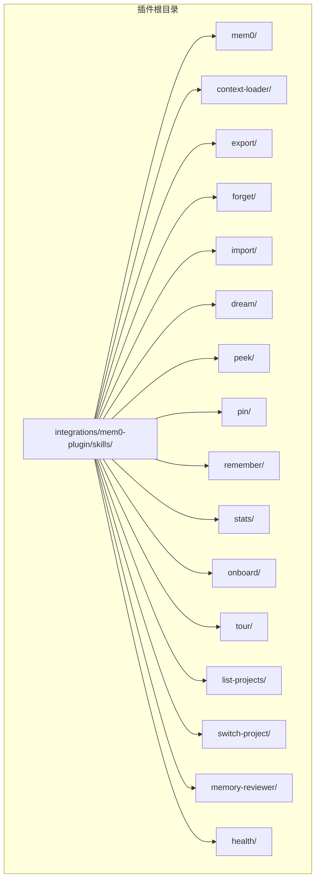
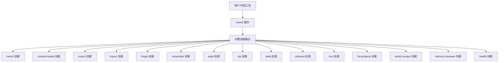
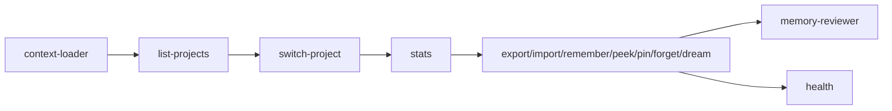

# 内置技能

<cite>
**本文引用的文件**
- [integrations/mem0-plugin/skills/mem0/SKILL.md](file://integrations/mem0-plugin/skills/mem0/SKILL.md)
- [integrations/mem0-plugin/skills/context-loader/SKILL.md](file://integrations/mem0-plugin/skills/context-loader/SKILL.md)
- [integrations/mem0-plugin/skills/export/SKILL.md](file://integrations/mem0-plugin/skills/export/SKILL.md)
- [integrations/mem0-plugin/skills/forget/SKILL.md](file://integrations/mem0-plugin/skills/forget/SKILL.md)
- [integrations/mem0-plugin/skills/import/SKILL.md](file://integrations/mem0-plugin/skills/import/SKILL.md)
- [integrations/mem0-plugin/skills/dream/SKILL.md](file://integrations/mem0-plugin/skills/dream/SKILL.md)
- [integrations/mem0-plugin/skills/peek/SKILL.md](file://integrations/mem0-plugin/skills/peek/SKILL.md)
- [integrations/mem0-plugin/skills/pin/SKILL.md](file://integrations/mem0-plugin/skills/pin/SKILL.md)
- [integrations/mem0-plugin/skills/remember/SKILL.md](file://integrations/mem0-plugin/skills/remember/SKILL.md)
- [integrations/mem0-plugin/skills/stats/SKILL.md](file://integrations/mem0-plugin/skills/stats/SKILL.md)
- [integrations/mem0-plugin/skills/onboard/SKILL.md](file://integrations/mem0-plugin/skills/onboard/SKILL.md)
- [integrations/mem0-plugin/skills/tour/SKILL.md](file://integrations/mem0-plugin/skills/tour/SKILL.md)
- [integrations/mem0-plugin/skills/list-projects/SKILL.md](file://integrations/mem0-plugin/skills/list-projects/SKILL.md)
- [integrations/mem0-plugin/skills/switch-project/SKILL.md](file://integrations/mem0-plugin/skills/switch-project/SKILL.md)
- [integrations/mem0-plugin/skills/memory-reviewer/SKILL.md](file://integrations/mem0-plugin/skills/memory-reviewer/SKILL.md)
- [integrations/mem0-plugin/skills/health/SKILL.md](file://integrations/mem0-plugin/skills/health/SKILL.md)
</cite>

## 目录
1. [简介](#简介)
2. [项目结构](#项目结构)
3. [核心组件](#核心组件)
4. [架构总览](#架构总览)
5. [详细组件分析](#详细组件分析)
6. [依赖分析](#依赖分析)
7. [性能考虑](#性能考虑)
8. [故障排除指南](#故障排除指南)
9. [结论](#结论)
10. [附录](#附录)

## 简介
本文件系统性梳理 mem0 插件生态中的“内置技能”，逐项说明其功能、用途、输入参数、输出格式、配置选项与调用方式，并给出实际使用示例与最佳实践。同时解释技能之间的协作关系与常见执行顺序，帮助开发者在不同集成场景（如 Claude/Cursor/Codex/OpenCode 等）中高效使用这些技能。

## 项目结构
内置技能位于插件目录下的 skills 子目录，每个技能以独立子目录存放，包含该技能的说明文档 SKILL.md 以及可能的脚本或资源。整体采用“按技能分目录”的组织方式，便于维护与扩展。

图表来源
- [integrations/mem0-plugin/skills/mem0/SKILL.md](file://integrations/mem0-plugin/skills/mem0/SKILL.md)
- [integrations/mem0-plugin/skills/context-loader/SKILL.md](file://integrations/mem0-plugin/skills/context-loader/SKILL.md)
- [integrations/mem0-plugin/skills/export/SKILL.md](file://integrations/mem0-plugin/skills/export/SKILL.md)
- [integrations/mem0-plugin/skills/forget/SKILL.md](file://integrations/mem0-plugin/skills/forget/SKILL.md)
- [integrations/mem0-plugin/skills/import/SKILL.md](file://integrations/mem0-plugin/skills/import/SKILL.md)
- [integrations/mem0-plugin/skills/dream/SKILL.md](file://integrations/mem0-plugin/skills/dream/SKILL.md)
- [integrations/mem0-plugin/skills/peek/SKILL.md](file://integrations/mem0-plugin/skills/peek/SKILL.md)
- [integrations/mem0-plugin/skills/pin/SKILL.md](file://integrations/mem0-plugin/skills/pin/SKILL.md)
- [integrations/mem0-plugin/skills/remember/SKILL.md](file://integrations/mem0-plugin/skills/remember/SKILL.md)
- [integrations/mem0-plugin/skills/stats/SKILL.md](file://integrations/mem0-plugin/skills/stats/SKILL.md)
- [integrations/mem0-plugin/skills/onboard/SKILL.md](file://integrations/mem0-plugin/skills/onboard/SKILL.md)
- [integrations/mem0-plugin/skills/tour/SKILL.md](file://integrations/mem0-plugin/skills/tour/SKILL.md)
- [integrations/mem0-plugin/skills/list-projects/SKILL.md](file://integrations/mem0-plugin/skills/list-projects/SKILL.md)
- [integrations/mem0-plugin/skills/switch-project/SKILL.md](file://integrations/mem0-plugin/skills/switch-project/SKILL.md)
- [integrations/mem0-plugin/skills/memory-reviewer/SKILL.md](file://integrations/mem0-plugin/skills/memory-reviewer/SKILL.md)
- [integrations/mem0-plugin/skills/health/SKILL.md](file://integrations/mem0-plugin/skills/health/SKILL.md)

章节来源
- [integrations/mem0-plugin/skills/mem0/SKILL.md](file://integrations/mem0-plugin/skills/mem0/SKILL.md)
- [integrations/mem0-plugin/skills/context-loader/SKILL.md](file://integrations/mem0-plugin/skills/context-loader/SKILL.md)
- [integrations/mem0-plugin/skills/export/SKILL.md](file://integrations/mem0-plugin/skills/export/SKILL.md)
- [integrations/mem0-plugin/skills/forget/SKILL.md](file://integrations/mem0-plugin/skills/forget/SKILL.md)
- [integrations/mem0-plugin/skills/import/SKILL.md](file://integrations/mem0-plugin/skills/import/SKILL.md)
- [integrations/mem0-plugin/skills/dream/SKILL.md](file://integrations/mem0-plugin/skills/dream/SKILL.md)
- [integrations/mem0-plugin/skills/peek/SKILL.md](file://integrations/mem0-plugin/skills/peek/SKILL.md)
- [integrations/mem0-plugin/skills/pin/SKILL.md](file://integrations/mem0-plugin/skills/pin/SKILL.md)
- [integrations/mem0-plugin/skills/remember/SKILL.md](file://integrations/mem0-plugin/skills/remember/SKILL.md)
- [integrations/mem0-plugin/skills/stats/SKILL.md](file://integrations/mem0-plugin/skills/stats/SKILL.md)
- [integrations/mem0-plugin/skills/onboard/SKILL.md](file://integrations/mem0-plugin/skills/onboard/SKILL.md)
- [integrations/mem0-plugin/skills/tour/SKILL.md](file://integrations/mem0-plugin/skills/tour/SKILL.md)
- [integrations/mem0-plugin/skills/list-projects/SKILL.md](file://integrations/mem0-plugin/skills/list-projects/SKILL.md)
- [integrations/mem0-plugin/skills/switch-project/SKILL.md](file://integrations/mem0-plugin/skills/switch-project/SKILL.md)
- [integrations/mem0-plugin/skills/memory-reviewer/SKILL.md](file://integrations/mem0-plugin/skills/memory-reviewer/SKILL.md)
- [integrations/mem0-plugin/skills/health/SKILL.md](file://integrations/mem0-plugin/skills/health/SKILL.md)

## 核心组件
- mem0：面向多语言 SDK 的通用技能入口，提供快速上手、架构概览、特性说明与集成模式参考。
- context-loader：上下文加载器，用于在工具调用前注入或解析上下文信息。
- export/import：导出与导入记忆体数据，支持跨环境迁移与备份恢复。
- forget/remember：删除与恢复记忆体条目，配合检索与管理流程。
- peek/pin：查看与固定记忆体，便于审计与优先级控制。
- stats：统计信息查询，辅助评估与监控。
- onboard/tour：引导与演示技能，帮助新用户快速熟悉。
- list-projects/switch-project：项目列表与切换，支撑多项目工作流。
- memory-reviewer：记忆体审查技能，提供审查与治理能力。
- health：健康检查技能，用于诊断与状态监测。

章节来源
- [integrations/mem0-plugin/skills/mem0/SKILL.md](file://integrations/mem0-plugin/skills/mem0/SKILL.md)
- [integrations/mem0-plugin/skills/context-loader/SKILL.md](file://integrations/mem0-plugin/skills/context-loader/SKILL.md)
- [integrations/mem0-plugin/skills/export/SKILL.md](file://integrations/mem0-plugin/skills/export/SKILL.md)
- [integrations/mem0-plugin/skills/forget/SKILL.md](file://integrations/mem0-plugin/skills/forget/SKILL.md)
- [integrations/mem0-plugin/skills/import/SKILL.md](file://integrations/mem0-plugin/skills/import/SKILL.md)
- [integrations/mem0-plugin/skills/dream/SKILL.md](file://integrations/mem0-plugin/skills/dream/SKILL.md)
- [integrations/mem0-plugin/skills/peek/SKILL.md](file://integrations/mem0-plugin/skills/peek/SKILL.md)
- [integrations/mem0-plugin/skills/pin/SKILL.md](file://integrations/mem0-plugin/skills/pin/SKILL.md)
- [integrations/mem0-plugin/skills/remember/SKILL.md](file://integrations/mem0-plugin/skills/remember/SKILL.md)
- [integrations/mem0-plugin/skills/stats/SKILL.md](file://integrations/mem0-plugin/skills/stats/SKILL.md)
- [integrations/mem0-plugin/skills/onboard/SKILL.md](file://integrations/mem0-plugin/skills/onboard/SKILL.md)
- [integrations/mem0-plugin/skills/tour/SKILL.md](file://integrations/mem0-plugin/skills/tour/SKILL.md)
- [integrations/mem0-plugin/skills/list-projects/SKILL.md](file://integrations/mem0-plugin/skills/list-projects/SKILL.md)
- [integrations/mem0-plugin/skills/switch-project/SKILL.md](file://integrations/mem0-plugin/skills/switch-project/SKILL.md)
- [integrations/mem0-plugin/skills/memory-reviewer/SKILL.md](file://integrations/mem0-plugin/skills/memory-reviewer/SKILL.md)
- [integrations/mem0-plugin/skills/health/SKILL.md](file://integrations/mem0-plugin/skills/health/SKILL.md)

## 架构总览
内置技能通过统一的插件框架暴露给外部工具（如 Claude、Cursor、Codex、OpenCode）。每个技能以独立目录与文档形式存在，遵循一致的命名规范与职责边界。技能之间可通过组合与编排实现复杂工作流，例如先列出项目、切换到目标项目，再进行导出/导入/记忆体操作等。

图表来源
- [integrations/mem0-plugin/skills/mem0/SKILL.md](file://integrations/mem0-plugin/skills/mem0/SKILL.md)
- [integrations/mem0-plugin/skills/context-loader/SKILL.md](file://integrations/mem0-plugin/skills/context-loader/SKILL.md)
- [integrations/mem0-plugin/skills/export/SKILL.md](file://integrations/mem0-plugin/skills/export/SKILL.md)
- [integrations/mem0-plugin/skills/forget/SKILL.md](file://integrations/mem0-plugin/skills/forget/SKILL.md)
- [integrations/mem0-plugin/skills/import/SKILL.md](file://integrations/mem0-plugin/skills/import/SKILL.md)
- [integrations/mem0-plugin/skills/dream/SKILL.md](file://integrations/mem0-plugin/skills/dream/SKILL.md)
- [integrations/mem0-plugin/skills/peek/SKILL.md](file://integrations/mem0-plugin/skills/peek/SKILL.md)
- [integrations/mem0-plugin/skills/pin/SKILL.md](file://integrations/mem0-plugin/skills/pin/SKILL.md)
- [integrations/mem0-plugin/skills/remember/SKILL.md](file://integrations/mem0-plugin/skills/remember/SKILL.md)
- [integrations/mem0-plugin/skills/stats/SKILL.md](file://integrations/mem0-plugin/skills/stats/SKILL.md)
- [integrations/mem0-plugin/skills/onboard/SKILL.md](file://integrations/mem0-plugin/skills/onboard/SKILL.md)
- [integrations/mem0-plugin/skills/tour/SKILL.md](file://integrations/mem0-plugin/skills/tour/SKILL.md)
- [integrations/mem0-plugin/skills/list-projects/SKILL.md](file://integrations/mem0-plugin/skills/list-projects/SKILL.md)
- [integrations/mem0-plugin/skills/switch-project/SKILL.md](file://integrations/mem0-plugin/skills/switch-project/SKILL.md)
- [integrations/mem0-plugin/skills/memory-reviewer/SKILL.md](file://integrations/mem0-plugin/skills/memory-reviewer/SKILL.md)
- [integrations/mem0-plugin/skills/health/SKILL.md](file://integrations/mem0-plugin/skills/health/SKILL.md)

## 详细组件分析

### mem0 技能
- 功能概述：作为通用入口，提供 SDK 快速开始、架构说明、特性清单与集成模式参考。
- 输入参数：无固定参数；通常由具体子任务决定。
- 输出格式：文本型说明与链接，指向更详细的文档与示例。
- 配置选项：依据所选 SDK 与运行环境而定。
- 调用方式：在工具中直接选择“mem0”技能后，按提示阅读文档与示例。
- 使用示例：在 Claude/Cursor 中打开 mem0 技能，查看“快速开始”与“特性概览”。
- 最佳实践：首次使用时优先阅读“快速开始”，随后根据业务场景查阅“集成模式”。

章节来源
- [integrations/mem0-plugin/skills/mem0/SKILL.md](file://integrations/mem0-plugin/skills/mem0/SKILL.md)

### context-loader 技能
- 功能概述：在工具调用前加载上下文，确保后续操作具备必要的上下文信息。
- 输入参数：上下文键值对或上下文标识符。
- 输出格式：上下文对象或上下文 ID。
- 配置选项：上下文来源、过期策略、合并策略。
- 调用方式：在需要上下文的技能前调用，或在工作流中显式插入。
- 使用示例：在执行“export/import/remember/peek/pin”等操作前，先调用“context-loader”加载当前会话上下文。
- 最佳实践：将“context-loader”置于工作流首部，保证上下文一致性。

章节来源
- [integrations/mem0-plugin/skills/context-loader/SKILL.md](file://integrations/mem0-plugin/skills/context-loader/SKILL.md)

### export 技能
- 功能概述：导出记忆体数据，支持跨环境迁移与备份。
- 输入参数：导出范围（全部/按条件）、导出格式（JSON/CSV/自定义）、目标位置（本地/远程）。
- 输出格式：导出文件路径或下载链接。
- 配置选项：过滤条件、字段映射、压缩选项。
- 调用方式：在“list-projects/switch-project”之后，选择“export”导出当前项目记忆体。
- 使用示例：导出当前项目全部记忆体为 JSON 文件，供导入其他环境使用。
- 最佳实践：定期导出关键项目的记忆体，结合“stats”确认导出完整性。

章节来源
- [integrations/mem0-plugin/skills/export/SKILL.md](file://integrations/mem0-plugin/skills/export/SKILL.md)

### forget 技能
- 功能概述：删除指定的记忆体条目，释放存储空间并更新索引。
- 输入参数：记忆体 ID 列表或删除条件（如时间范围、标签）。
- 输出格式：删除结果（成功/失败列表）。
- 配置选项：批量删除阈值、软删除开关。
- 调用方式：在“peek/pin/remember”之后，确认需要删除的记忆体，再调用“forget”。
- 使用示例：删除某次对话产生的临时记忆体。
- 最佳实践：先“peek”核对，再“forget”执行删除，避免误删。

章节来源
- [integrations/mem0-plugin/skills/forget/SKILL.md](file://integrations/mem0-plugin/skills/forget/SKILL.md)

### import 技能
- 功能概述：从外部文件导入记忆体数据，恢复或迁移记忆体。
- 输入参数：导入文件路径或上传文件、映射规则、冲突处理策略。
- 输出格式：导入结果（成功数量、失败列表）。
- 配置选项：字段映射、去重策略、时间戳修正。
- 调用方式：在“list-projects/switch-project”之后，选择“import”导入目标文件。
- 使用示例：将之前导出的 JSON 文件重新导入到当前项目。
- 最佳实践：导入前先“stats”检查目标项目状态，导入后再次“stats”验证。

章节来源
- [integrations/mem0-plugin/skills/import/SKILL.md](file://integrations/mem0-plugin/skills/import/SKILL.md)

### dream 技能
- 功能概述：基于现有记忆体生成新的创意或建议，辅助思考与决策。
- 输入参数：主题关键词、上下文、生成长度限制。
- 输出格式：文本建议或结构化要点。
- 配置选项：模型参数、温度、最大令牌数。
- 调用方式：在整理完上下文后，调用“dream”生成创意。
- 使用示例：围绕“产品设计”主题，生成若干创意点子。
- 最佳实践：先“context-loader”加载上下文，再“dream”生成建议。

章节来源
- [integrations/mem0-plugin/skills/dream/SKILL.md](file://integrations/mem0-plugin/skills/dream/SKILL.md)

### peek 技能
- 功能概述：查看指定的记忆体详情，便于审计与核对。
- 输入参数：记忆体 ID 或检索条件。
- 输出格式：记忆体元数据与内容摘要。
- 配置选项：字段选择、分页大小。
- 调用方式：在“list-projects/switch-project”之后，使用“peek”查看目标记忆体。
- 使用示例：查看某条记忆体的创建时间、标签与内容片段。
- 最佳实践：与“pin/forget/remember”配合使用，形成闭环管理。

章节来源
- [integrations/mem0-plugin/skills/peek/SKILL.md](file://integrations/mem0-plugin/skills/peek/SKILL.md)

### pin 技能
- 功能概述：固定重要记忆体，防止被自动清理或覆盖。
- 输入参数：记忆体 ID 列表。
- 输出格式：固定结果（成功/失败）。
- 配置选项：固定有效期、优先级设置。
- 调用方式：在“peek”确认重要记忆体后，调用“pin”进行固定。
- 使用示例：将关键会议记录固定，避免被清理。
- 最佳实践：仅对高价值记忆体使用“pin”，避免过度固定影响性能。

章节来源
- [integrations/mem0-plugin/skills/pin/SKILL.md](file://integrations/mem0-plugin/skills/pin/SKILL.md)

### remember 技能
- 功能概述：新增或更新记忆体，丰富知识库。
- 输入参数：内容、标签、元数据、时间戳。
- 输出格式：新增/更新后的记忆体 ID。
- 配置选项：嵌入向量维度、相似度阈值、去重策略。
- 调用方式：在“context-loader”之后，调用“remember”写入新记忆体。
- 使用示例：将用户反馈总结为一条新记忆体。
- 最佳实践：与“stats”结合，控制新增频率与质量。

章节来源
- [integrations/mem0-plugin/skills/remember/SKILL.md](file://integrations/mem0-plugin/skills/remember/SKILL.md)

### stats 技能
- 功能概述：查询记忆体统计信息，辅助评估与监控。
- 输入参数：统计维度（总数、按标签、按时间）、时间范围。
- 输出格式：统计报表（数值+可视化建议）。
- 配置选项：聚合粒度、缓存策略。
- 调用方式：在任何操作前后均可调用，形成“before/after”对比。
- 使用示例：查看当前项目记忆体总数与增长趋势。
- 最佳实践：将“stats”纳入自动化巡检流程。

章节来源
- [integrations/mem0-plugin/skills/stats/SKILL.md](file://integrations/mem0-plugin/skills/stats/SKILL.md)

### onboard 技能
- 功能概述：新用户引导，帮助快速上手。
- 输入参数：用户角色、初始设置偏好。
- 输出格式：引导步骤与链接。
- 鰁配选项：引导语言、跳过机制。
- 调用方式：首次登录或新建用户时触发。
- 使用示例：展示“快速开始”、“特性概览”、“常见问题”等。
- 最佳实践：与“tour”配合，提供循序渐进的学习体验。

章节来源
- [integrations/mem0-plugin/skills/onboard/SKILL.md](file://integrations/mem0-plugin/skills/onboard/SKILL.md)

### tour 技能
- 功能概述：演示技能，展示核心功能与使用流程。
- 输入参数：演示类型（全量/模块化）、语言。
- 输出格式：交互式演示与说明。
- 配置选项：演示步长、暂停点。
- 调用方式：在“onboard”之后或用户主动请求时触发。
- 使用示例：演示“export/import/remember/peek/pin/forget”等常用流程。
- 最佳实践：将“tour”作为“onboard”的补充，强化实操体验。

章节来源
- [integrations/mem0-plugin/skills/tour/SKILL.md](file://integrations/mem0-plugin/skills/tour/SKILL.md)

### list-projects 技能
- 功能概述：列出可用项目，支持多项目管理。
- 输入参数：过滤条件（名称、状态、创建时间）。
- 输出格式：项目列表与简要信息。
- 配置选项：排序方式、分页大小。
- 调用方式：在“onboard/tour”之后或需要切换项目时调用。
- 使用示例：查看所有项目及其状态。
- 最佳实践：与“switch-project”配合，形成“浏览→切换→操作”的标准流程。

章节来源
- [integrations/mem0-plugin/skills/list-projects/SKILL.md](file://integrations/mem0-plugin/skills/list-projects/SKILL.md)

### switch-project 技能
- 功能概述：切换当前工作项目，影响后续操作的作用域。
- 输入参数：目标项目 ID/名称。
- 输出格式：切换结果与当前项目信息。
- 配置选项：权限校验、回滚策略。
- 调用方式：在“list-projects”之后调用。
- 使用示例：从项目 A 切换到项目 B。
- 最佳实践：每次切换后使用“stats”确认作用域正确。

章节来源
- [integrations/mem0-plugin/skills/switch-project/SKILL.md](file://integrations/mem0-plugin/skills/switch-project/SKILL.md)

### memory-reviewer 技能
- 功能概述：审查记忆体质量与合规性，提供治理建议。
- 输入参数：审查维度（敏感度、重复率、时效性）、阈值。
- 输出格式：审查报告与修复建议。
- 配置选项：审查算法、权重分配。
- 调用方式：在“stats”之后或定期巡检时调用。
- 使用示例：发现重复记忆体并建议合并或删除。
- 最佳实践：将“memory-reviewer”纳入 CI/CD 流程，持续优化质量。

章节来源
- [integrations/mem0-plugin/skills/memory-reviewer/SKILL.md](file://integrations/mem0-plugin/skills/memory-reviewer/SKILL.md)

### health 技能
- 功能概述：健康检查，诊断系统状态与潜在问题。
- 输入参数：检查范围（存储、索引、服务）、严重级别。
- 输出格式：健康报告与修复建议。
- 配置选项：检查周期、告警阈值。
- 调用方式：在异常发生后或定期巡检时调用。
- 使用示例：检查向量数据库连接与索引完整性。
- 最佳实践：将“health”纳入运维自动化，实现早期预警。

章节来源
- [integrations/mem0-plugin/skills/health/SKILL.md](file://integrations/mem0-plugin/skills/health/SKILL.md)

## 依赖分析
- 耦合关系：多数技能依赖“context-loader”提供的上下文；“list-projects/switch-project”为上下文与作用域管理的基础；“export/import”依赖“stats”进行完整性校验；“memory-reviewer/health”可作为质量与稳定性保障技能。
- 执行顺序：通常为“context-loader → list-projects/switch-project → stats → 具体操作（export/import/remember/peek/pin/forget/dream）→ memory-reviewer/health”。
- 外部依赖：各技能通过插件框架与外部工具对接，内部依赖 mem0 核心能力（存储、检索、嵌入等）。

图表来源
- [integrations/mem0-plugin/skills/context-loader/SKILL.md](file://integrations/mem0-plugin/skills/context-loader/SKILL.md)
- [integrations/mem0-plugin/skills/list-projects/SKILL.md](file://integrations/mem0-plugin/skills/list-projects/SKILL.md)
- [integrations/mem0-plugin/skills/switch-project/SKILL.md](file://integrations/mem0-plugin/skills/switch-project/SKILL.md)
- [integrations/mem0-plugin/skills/stats/SKILL.md](file://integrations/mem0-plugin/skills/stats/SKILL.md)
- [integrations/mem0-plugin/skills/export/SKILL.md](file://integrations/mem0-plugin/skills/export/SKILL.md)
- [integrations/mem0-plugin/skills/import/SKILL.md](file://integrations/mem0-plugin/skills/import/SKILL.md)
- [integrations/mem0-plugin/skills/remember/SKILL.md](file://integrations/mem0-plugin/skills/remember/SKILL.md)
- [integrations/mem0-plugin/skills/peek/SKILL.md](file://integrations/mem0-plugin/skills/peek/SKILL.md)
- [integrations/mem0-plugin/skills/pin/SKILL.md](file://integrations/mem0-plugin/skills/pin/SKILL.md)
- [integrations/mem0-plugin/skills/forget/SKILL.md](file://integrations/mem0-plugin/skills/forget/SKILL.md)
- [integrations/mem0-plugin/skills/dream/SKILL.md](file://integrations/mem0-plugin/skills/dream/SKILL.md)
- [integrations/mem0-plugin/skills/memory-reviewer/SKILL.md](file://integrations/mem0-plugin/skills/memory-reviewer/SKILL.md)
- [integrations/mem0-plugin/skills/health/SKILL.md](file://integrations/mem0-plugin/skills/health/SKILL.md)

## 性能考虑
- 上下文加载：尽量复用“context-loader”的上下文，避免重复加载。
- 导入导出：大体量数据建议分批处理，结合“stats”监控进度。
- 记忆体写入：批量“remember”时注意去重与索引更新开销。
- 审查与健康：定期执行“memory-reviewer/health”，降低长期运行风险。
- 缓存与并发：合理设置“stats”缓存与并发度，平衡准确性与时效性。

## 故障排除指南
- 导入失败：检查文件格式与映射规则，确认“switch-project”已切换到正确项目。
- 删除无效：先“peek”核对 ID，再“forget”执行删除。
- 上下文缺失：确认“context-loader”已在工作流首部调用。
- 统计异常：使用“health”检查底层服务状态，必要时重启或重建索引。
- 权限不足：在“list-projects/switch-project”阶段确认用户权限。

章节来源
- [integrations/mem0-plugin/skills/import/SKILL.md](file://integrations/mem0-plugin/skills/import/SKILL.md)
- [integrations/mem0-plugin/skills/forget/SKILL.md](file://integrations/mem0-plugin/skills/forget/SKILL.md)
- [integrations/mem0-plugin/skills/context-loader/SKILL.md](file://integrations/mem0-plugin/skills/context-loader/SKILL.md)
- [integrations/mem0-plugin/skills/health/SKILL.md](file://integrations/mem0-plugin/skills/health/SKILL.md)
- [integrations/mem0-plugin/skills/list-projects/SKILL.md](file://integrations/mem0-plugin/skills/list-projects/SKILL.md)
- [integrations/mem0-plugin/skills/switch-project/SKILL.md](file://integrations/mem0-plugin/skills/switch-project/SKILL.md)

## 结论
内置技能体系以“上下文驱动、项目导向、可观测性优先”为核心设计原则，通过标准化的输入输出与可组合的工作流，满足从新手引导到高级治理的全场景需求。建议在实际集成中遵循“先上下文、后项目、再操作、最后审查/健康”的执行顺序，并结合“stats/memory-reviewer/health”形成闭环的质量与稳定性保障。

## 附录
- 参考文档：各技能的 SKILL.md 提供了更深入的使用细节与示例链接，建议在需要时进一步查阅。
- 版本与兼容：技能版本随插件版本演进，升级前请核对各技能的变更说明。