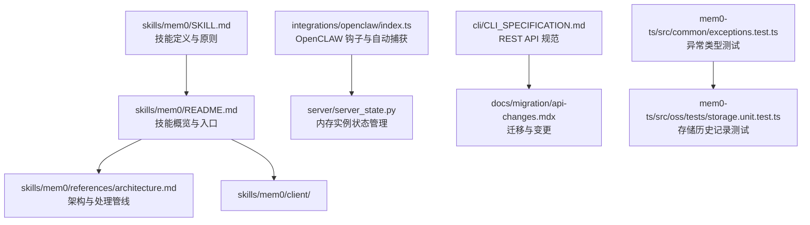
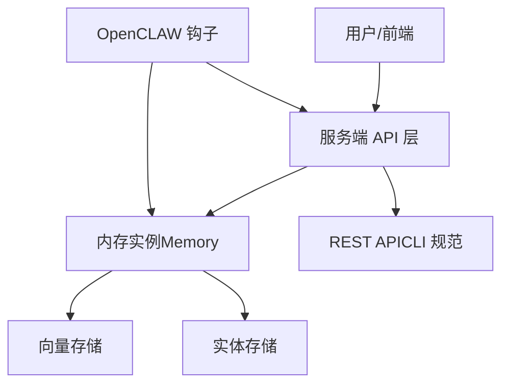
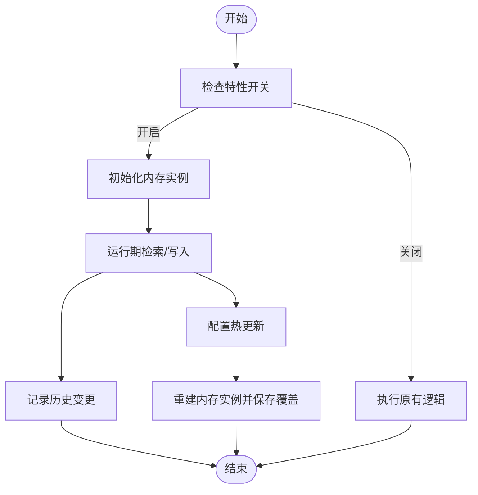
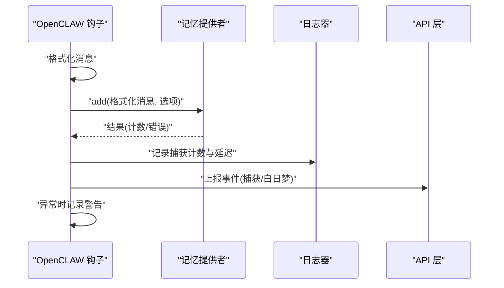

# 技能参考文档

<cite>
**本文档引用的文件**
- [SKILL.md](file://skills/mem0/SKILL.md)
- [README.md](file://skills/mem0/README.md)
- [architecture.md](file://skills/mem0/references/architecture.md)
- [server_state.py](file://server/server_state.py)
- [CLI_SPECIFICATION.md](file://cli/CLI_SPECIFICATION.md)
- [index.ts](file://integrations/openclaw/index.ts)
- [exceptions.test.ts](file://mem0-ts/src/common/exceptions.test.ts)
- [storage.unit.test.ts](file://mem0-ts/src/oss/tests/storage.unit.test.ts)
- [api-changes.mdx](file://docs/migration/api-changes.mdx)
</cite>

## 目录
1. [简介](#简介)
2. [项目结构](#项目结构)
3. [核心组件](#核心组件)
4. [架构总览](#架构总览)
5. [详细组件分析](#详细组件分析)
6. [依赖关系分析](#依赖关系分析)
7. [性能考量](#性能考量)
8. [故障排除指南](#故障排除指南)
9. [结论](#结论)
10. [附录](#附录)

## 简介
本技能参考文档面向希望在现有应用中集成 Mem0 的开发者与平台集成工程师，系统性阐述 Mem0 技能的架构设计、核心能力、生命周期管理、状态跟踪与错误处理机制，并提供 API 参考、参数说明、返回值格式、异常处理指南、集成示例与故障排除方法。文档同时覆盖性能优化建议与安全注意事项，帮助团队以最小侵入的方式实现“可选、可回滚、可观察”的增量集成。

## 项目结构
Mem0 技能位于仓库的 skills/mem0 目录，包含技能定义、语言 SDK 引用、脚本与按需加载的参考文档。OpenCLAW 集成展示了如何在外部平台中以钩子方式自动捕获与写入记忆，Server 层通过全局状态管理内存实例，CLI 提供 REST API 规范，TypeScript 测试验证异常体系与存储历史记录行为。

**图表来源**
- [SKILL.md](file://skills/mem0/SKILL.md)
- [README.md](file://skills/mem0/README.md)
- [architecture.md](file://skills/mem0/references/architecture.md)
- [index.ts](file://integrations/openclaw/index.ts)
- [server_state.py](file://server/server_state.py)
- [CLI_SPECIFICATION.md](file://cli/CLI_SPECIFICATION.md)
- [api-changes.mdx](file://docs/migration/api-changes.mdx)
- [exceptions.test.ts](file://mem0-ts/src/common/exceptions.test.ts)
- [storage.unit.test.ts](file://mem0-ts/src/oss/tests/storage.unit.test.ts)

**章节来源**
- [README.md:49-80](file://skills/mem0/README.md#L49-L80)
- [SKILL.md:70-93](file://skills/mem0/SKILL.md#L70-L93)

## 核心组件
- 技能定义与集成原则：强调“附加而非替换”、“默认可选”、“不破坏既有行为”、“最小依赖面”、“可分离提交”、“后端优先”等七项原则，确保集成过程可控、可审计、可回滚。
- 架构参考：描述 Mem0 在平台中的处理管线、检索管线、生命周期、对象结构、作用域与多租户、内存分层以及性能特征。
- Server 状态管理：提供内存实例的全局状态更新与获取接口，支持配置热更新与实例重建。
- OpenCLAW 集成：展示如何在会话钩子中自动触发记忆捕获与“白日梦”（dream）策略，包含事件上报与延迟统计。
- CLI API 规范：列出核心 REST 端点、请求体与查询参数，便于前后端对接与自动化工具集成。
- 异常与存储测试：TS 异常体系覆盖通用错误与特定领域错误；存储历史记录测试验证增删改查与排序一致性。

**章节来源**
- [SKILL.md:70-93](file://skills/mem0/SKILL.md#L70-L93)
- [architecture.md:1-33](file://skills/mem0/references/architecture.md#L1-L33)
- [server_state.py:86-107](file://server/server_state.py#L86-L107)
- [index.ts:565-1059](file://integrations/openclaw/index.ts#L565-L1059)
- [CLI_SPECIFICATION.md:912-927](file://cli/CLI_SPECIFICATION.md#L912-L927)
- [exceptions.test.ts:55-91](file://mem0-ts/src/common/exceptions.test.ts#L55-L91)
- [storage.unit.test.ts:151-194](file://mem0-ts/src/oss/tests/storage.unit.test.ts#L151-L194)

## 架构总览
Mem0 的核心理念是“用户输入 → 检索相关记忆 → 增强提示 → 生成响应 → 存储新记忆”。平台侧由向量存储与实体存储构成，负责语义相似度检索与关系感知检索；服务层通过全局状态管理内存实例，支持配置热更新；客户端通过 SDK 或 REST API 调用；OpenCLAW 等外部平台以钩子方式自动捕获上下文并写入记忆。

**图表来源**
- [architecture.md:18-33](file://skills/mem0/references/architecture.md#L18-L33)
- [server_state.py:86-107](file://server/server_state.py#L86-L107)
- [CLI_SPECIFICATION.md:912-927](file://cli/CLI_SPECIFICATION.md#L912-L927)
- [index.ts:565-1059](file://integrations/openclaw/index.ts#L565-L1059)

## 详细组件分析

### 组件一：技能集成原则与生命周期
- 集成原则
  - 附加性：与现有记忆/会话/状态系统共存，不替代。
  - 默认可选：通过特性开关控制，未开启时行为不变。
  - 不破坏：保持公开接口签名与测试稳定。
  - 最小依赖：仅引入必要依赖，避免新增外部组件。
  - 可分离提交：代码、测试、配置与文档分步上线。
  - 后端优先：密钥、作用域与身份解析在后端完成。
- 生命周期管理
  - 初始化：根据配置构建内存实例。
  - 运行期：按需检索与写入，支持历史记录追踪。
  - 更新：配置热更新触发实例重建与持久化覆盖。
  - 关闭：释放资源，确保幂等。

**图表来源**
- [SKILL.md:70-93](file://skills/mem0/SKILL.md#L70-L93)
- [server_state.py:86-107](file://server/server_state.py#L86-L107)
- [storage.unit.test.ts:151-194](file://mem0-ts/src/oss/tests/storage.unit.test.ts#L151-L194)

**章节来源**
- [SKILL.md:70-93](file://skills/mem0/SKILL.md#L70-L93)
- [server_state.py:86-107](file://server/server_state.py#L86-L107)
- [storage.unit.test.ts:151-194](file://mem0-ts/src/oss/tests/storage.unit.test.ts#L151-L194)

### 组件二：OpenCLAW 钩子与自动捕获流程
- 自动捕获：在会话钩子中对消息进行格式化并调用添加接口，统计延迟与捕获数量。
- “白日梦”策略：基于阈值与会话键触发，记录事件并输出日志。
- 错误处理：捕获异常并记录警告，不影响主流程。

**图表来源**
- [index.ts:565-1059](file://integrations/openclaw/index.ts#L565-L1059)

**章节来源**
- [index.ts:565-1059](file://integrations/openclaw/index.ts#L565-L1059)

### 组件三：API 参考与参数说明
- 端点清单（节选）
  - 新增记忆：POST /v1/memories/
  - 搜索：POST /v2/memories/search/
  - 获取单条：GET /v1/memories/{memory_id}/
  - 列表：POST /v2/memories/
  - 更新：PUT /v1/memories/{memory_id}/
  - 删除：DELETE /v1/memories/{memory_id}/
  - 批量删除：DELETE /v1/memories/
  - 实体列表：GET /v1/entities/
  - 实体删除：DELETE /v1/entities/
  - 事件列表：GET /v1/events/
  - 获取事件：GET /v1/events/{event_id}/
  - 健康检查：GET /v1/ping/
- 请求体与查询参数
  - 新增/搜索/列表/更新：JSON 负载
  - 列表：支持 page、page_size 查询参数
  - 其他端点：无请求体或无查询参数

**章节来源**
- [CLI_SPECIFICATION.md:912-927](file://cli/CLI_SPECIFICATION.md#L912-L927)

### 组件四：异常处理与返回值规范
- 异常体系
  - 基类：MemoryError
  - 子类：AuthenticationError、RateLimitError、ValidationError、MemoryNotFoundError、NetworkError、ConfigurationError、MemoryQuotaExceededError
  - 行为：可抛出、可捕获、名称正确继承链
- 返回值与迁移变更
  - v1.0.0 对参数校验更严格，未知参数将引发类型错误
  - 错误处理示例：区分版本兼容性、过滤器语法、参数错误与意外错误
  - 记忆对象字段：包含 id、memory、user_id、metadata、created_at、updated_at、score 等

**章节来源**
- [exceptions.test.ts:55-91](file://mem0-ts/src/common/exceptions.test.ts#L55-L91)
- [api-changes.mdx:404-458](file://docs/migration/api-changes.mdx#L404-L458)

## 依赖关系分析
- 技能与平台集成
  - 技能定义约束集成边界（附加性、可选性、最小依赖、后端优先）
  - OpenCLAW 集成作为外部平台的钩子扩展，与服务端 API 交互
- 服务端状态耦合
  - server_state.py 通过全局锁保护内存实例与配置更新，避免并发冲突
- 客户端与服务端契约
  - CLI 规范定义了稳定的端点与参数约定，便于 SDK 与第三方工具对接

**图表来源**
- [SKILL.md:70-93](file://skills/mem0/SKILL.md#L70-L93)
- [index.ts:565-1059](file://integrations/openclaw/index.ts#L565-L1059)
- [CLI_SPECIFICATION.md:912-927](file://cli/CLI_SPECIFICATION.md#L912-L927)
- [server_state.py:86-107](file://server/server_state.py#L86-L107)

**章节来源**
- [SKILL.md:70-93](file://skills/mem0/SKILL.md#L70-L93)
- [index.ts:565-1059](file://integrations/openclaw/index.ts#L565-L1059)
- [CLI_SPECIFICATION.md:912-927](file://cli/CLI_SPECIFICATION.md#L912-L927)
- [server_state.py:86-107](file://server/server_state.py#L86-L107)

## 性能考量
- 检索与写入延迟监控：OpenCLAW 集成记录捕获延迟与命中数量，便于定位瓶颈。
- 配置热更新：通过 server_state.py 的更新函数重建内存实例，减少重启成本。
- 参数校验与错误早发现：v1.0.0 更严格的参数校验可降低无效请求带来的开销。
- 最小依赖面：遵循“最小依赖面”原则，避免引入额外外部组件导致的性能与维护负担。

**章节来源**
- [index.ts:565-1059](file://integrations/openclaw/index.ts#L565-L1059)
- [server_state.py:86-107](file://server/server_state.py#L86-L107)
- [api-changes.mdx:424-442](file://docs/migration/api-changes.mdx#L424-L442)

## 故障排除指南
- 集成破坏风险
  - 若开启特性开关后既有测试失败，应视为非侵入性违规，优先修复测试或回退开关。
- 异常排查
  - 使用异常类型区分认证、配额、网络、配置等问题，结合调试信息定位根因。
- 存储历史一致性
  - 通过历史记录单元测试验证增删改查与时间排序，确保数据一致性。
- 日志与事件
  - OpenCLAW 集成记录捕获计数与延迟，事件上报用于观测触发频率与成功率。

**章节来源**
- [SKILL.md:604-620](file://skills/mem0/SKILL.md#L604-L620)
- [exceptions.test.ts:55-91](file://mem0-ts/src/common/exceptions.test.ts#L55-L91)
- [storage.unit.test.ts:151-194](file://mem0-ts/src/oss/tests/storage.unit.test.ts#L151-L194)
- [index.ts:565-1059](file://integrations/openclaw/index.ts#L565-L1059)

## 结论
Mem0 技能以“可选、可回滚、可观测”为核心，通过清晰的集成原则、稳健的服务端状态管理、完善的异常体系与 API 规范，帮助团队在不改变既有系统行为的前提下，平滑引入记忆增强能力。配合 OpenCLAW 等外部平台的钩子机制，可实现自动化的上下文捕获与记忆沉淀，最终提升应用的智能水平与用户体验。

## 附录
- 快速开始与参考材料
  - 技能概览与入口：README 中列出的 Python/TypeScript SDK、差异对比、架构、特性、集成模式与用例等。
  - 平台架构参考：处理管线、检索管线、生命周期、对象结构、作用域与多租户、内存分层与性能特征。
- 集成最佳实践
  - 使用特性开关进行渐进式上线，先在后端实现调用，再逐步扩展到前端。
  - 通过事件与日志持续观测，建立基线指标（延迟、命中率、错误率）。
  - 严格遵守最小依赖面，避免引入不必要的外部组件。

**章节来源**
- [README.md:49-80](file://skills/mem0/README.md#L49-L80)
- [architecture.md:1-33](file://skills/mem0/references/architecture.md#L1-L33)