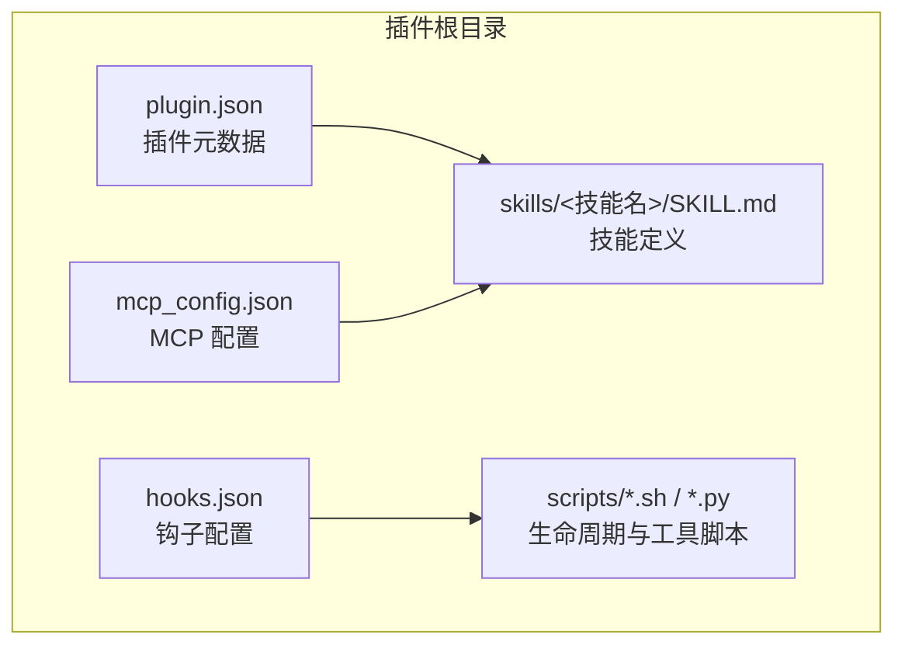
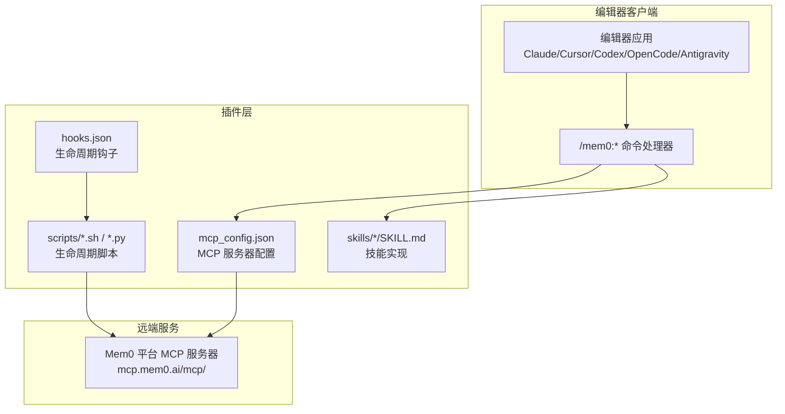
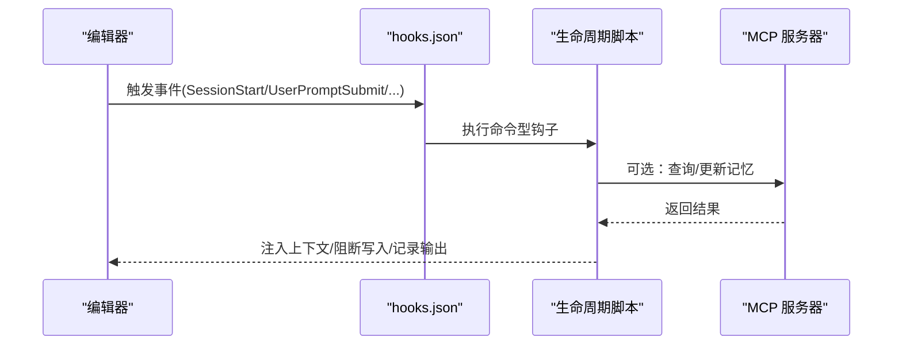
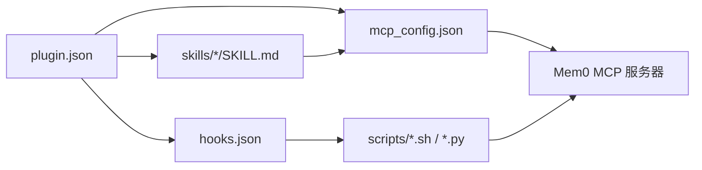

# 技能开发指南

<cite>
**本文档引用的文件**
- [README.md](file://integrations/mem0-plugin/README.md)
- [plugin.json](file://integrations/mem0-plugin/plugin.json)
- [hooks.json](file://integrations/mem0-plugin/hooks.json)
- [mcp_config.json](file://integrations/mem0-plugin/mcp_config.json)
- [SKILL.md（记忆回忆）](file://integrations/mem0-plugin/skills/remember/SKILL.md)
- [SKILL.md（浏览记忆）](file://integrations/mem0-plugin/skills/tour/SKILL.md)
- [SKILL.md（快速搜索）](file://integrations/mem0-plugin/skills/peek/SKILL.md)
- [SKILL.md（统计信息）](file://integrations/mem0-plugin/skills/stats/SKILL.md)
- [SKILL.md（梦境整合）](file://integrations/mem0-plugin/skills/dream/SKILL.md)
- [SKILL.md（置顶保护）](file://integrations/mem0-plugin/skills/pin/SKILL.md)
- [SKILL.md（忘记删除）](file://integrations/mem0-plugin/skills/forget/SKILL.md)
- [SKILL.md（健康检查）](file://integrations/mem0-plugin/skills/health/SKILL.md)
- [SKILL.md（导出导入）](file://integrations/mem0-plugin/skills/export/SKILL.md)
- [SKILL.md（项目切换）](file://integrations/mem0-plugin/skills/switch-project/SKILL.md)
- [SKILL.md（上下文加载器）](file://integrations/mem0-plugin/skills/context-loader/SKILL.md)
- [SKILL.md（内存审核员）](file://integrations/mem0-plugin/skills/memory-reviewer/SKILL.md)
- [SKILL.md（开机向导）](file://integrations/mem0-plugin/skills/onboard/SKILL.md)
- [SKILL.md（Mem0 SDK 指南）](file://integrations/mem0-plugin/skills/mem0/SKILL.md)
- [install_codex_hooks.py](file://integrations/mem0-plugin/scripts/install_codex_hooks.py)
- [on_session_start.sh](file://integrations/mem0-plugin/scripts/on_session_start.sh)
- [on_user_prompt.sh](file://integrations/mem0-plugin/scripts/on_user_prompt.sh)
- [on_post_tool_use.sh](file://integrations/mem0-plugin/scripts/on_post_tool_use.sh)
- [block_memory_write.sh](file://integrations/mem0-plugin/scripts/block_memory_write.sh)
- [enforce_metadata_defaults.sh](file://integrations/mem0-plugin/scripts/enforce_metadata_defaults.sh)
- [setup_coding_categories.py](file://integrations/mem0-plugin/scripts/setup_coding_categories.py)
- [mem0_doc_search.py](file://integrations/mem0-plugin/skills/mem0/scripts/mem0_doc_search.py)
</cite>

## 目录
1. [简介](#简介)
2. [项目结构](#项目结构)
3. [核心组件](#核心组件)
4. [架构总览](#架构总览)
5. [详细组件分析](#详细组件分析)
6. [依赖关系分析](#依赖关系分析)
7. [性能考虑](#性能考虑)
8. [故障排除指南](#故障排除指南)
9. [结论](#结论)
10. [附录](#附录)

## 简介
本指南面向希望为 Mem0 插件系统开发自定义技能的开发者。内容涵盖技能开发基础概念、文件结构与编写规范，技能配置文件格式、钩子系统与事件处理机制，以及从需求分析到测试验证再到部署发布的完整流程。文档还解释了技能与 Mem0 插件系统的集成方式与通信协议，并提供可复用的开发模板与示例路径。

## 项目结构
Mem0 插件系统由以下关键部分组成：
- 插件清单与元数据：用于声明插件标识、版本、描述、作者、关键词等信息。
- 钩子系统：在编辑器生命周期的关键节点触发脚本或命令，实现自动记忆捕获、元数据强制、上下文注入等能力。
- MCP 配置：定义远程 MCP 服务器地址与认证头，使插件通过标准工具接口访问 Mem0 平台。
- 技能集合：以“/mem0:”命令形式暴露的一系列功能模块，覆盖记忆的增删改查、统计、导出导入、项目切换、上下文加载等。
- 脚本与工具：安装器、生命周期脚本、分类设置脚本、文档检索脚本等辅助组件。

图表来源
- [plugin.json:1-14](file://integrations/mem0-plugin/plugin.json#L1-L14)
- [hooks.json:1-105](file://integrations/mem0-plugin/hooks.json#L1-L105)
- [mcp_config.json:1-11](file://integrations/mem0-plugin/mcp_config.json#L1-L11)

章节来源
- [README.md:1-306](file://integrations/mem0-plugin/README.md#L1-L306)
- [plugin.json:1-14](file://integrations/mem0-plugin/plugin.json#L1-L14)

## 核心组件
- 插件清单（plugin.json）
  - 定义插件标识、名称、版本、描述、作者、发布者、主页、仓库、许可证、关键词等。
  - 关键字段：id、name、version、description、author、publisher、homepage、repository、license、keywords、contextFileName。
- 钩子系统（hooks.json）
  - 在 SessionStart、UserPromptSubmit、PreToolUse、Stop、PostToolUse 等事件触发命令型钩子。
  - 支持按工具类型匹配（如 Write、Edit、Read、mcp__mem0__* 等），并可设置超时。
- MCP 配置（mcp_config.json）
  - 声明 MCP 服务器地址与认证头，使用环境变量进行令牌注入。
- 技能（skills/*/SKILL.md）
  - 每个技能以独立目录存放，包含技能说明与使用方式。
  - 命令前缀统一为 /mem0:，例如 /mem0:remember、/mem0:tour、/mem0:peek 等。

章节来源
- [plugin.json:1-14](file://integrations/mem0-plugin/plugin.json#L1-L14)
- [hooks.json:1-105](file://integrations/mem0-plugin/hooks.json#L1-L105)
- [mcp_config.json:1-11](file://integrations/mem0-plugin/mcp_config.json#L1-L11)
- [README.md:224-244](file://integrations/mem0-plugin/README.md#L224-L244)

## 架构总览
Mem0 插件系统通过“技能 + 钩子 + MCP”的组合实现跨会话、用户级的记忆持久化与检索。编辑器在生命周期关键点触发钩子脚本，自动注入上下文、执行元数据校验、阻断不安全写入等；同时通过 MCP 工具访问远端 Mem0 平台，完成记忆的增删改查与批量操作。

图表来源
- [hooks.json:1-105](file://integrations/mem0-plugin/hooks.json#L1-L105)
- [mcp_config.json:1-11](file://integrations/mem0-plugin/mcp_config.json#L1-L11)
- [README.md:287-302](file://integrations/mem0-plugin/README.md#L287-L302)

## 详细组件分析

### 插件清单（plugin.json）
- 作用：声明插件元数据，供各编辑器识别与展示。
- 关键点：
  - id/name/version：唯一标识与版本管理。
  - description/keywords：帮助索引与搜索。
  - contextFileName：上下文文件名（如 AGENTS.md），用于上下文加载。
- 开发建议：
  - 版本号遵循语义化版本控制。
  - keywords 与 description 应准确反映插件能力，便于用户发现。

章节来源
- [plugin.json:1-14](file://integrations/mem0-plugin/plugin.json#L1-L14)

### 钩子系统（hooks.json）
- 事件类型与触发时机：
  - SessionStart：会话开始时执行，常用于初始化依赖与加载历史记忆。
  - UserPromptSubmit：用户提交提示前，注入相关记忆作为上下文。
  - PreToolUse：工具调用前，可阻断特定写入或强制元数据默认值。
  - Stop：会话结束时，生成学习摘要或提醒持久化。
  - PostToolUse：工具调用后，记录输出或后续处理。
- 匹配规则：
  - matcher 支持通配符与正则表达式，按工具类型过滤。
- 超时与容错：
  - 每个钩子可设置 timeout，失败时静默忽略（|| true）保证稳定性。
- 典型用途：
  - 自动记忆捕获、上下文注入、元数据强制、文件读取上下文注入、Bash 输出记录等。

图表来源
- [hooks.json:1-105](file://integrations/mem0-plugin/hooks.json#L1-L105)

章节来源
- [hooks.json:1-105](file://integrations/mem0-plugin/hooks.json#L1-L105)

### MCP 配置（mcp_config.json）
- 作用：声明 MCP 服务器地址与认证头，使用环境变量 MEM0_API_KEY 进行鉴权。
- 通信协议：
  - 使用标准 MCP 协议，通过工具名（如 add_memory、search_memories 等）访问远端能力。
- 集成要点：
  - Authorization 头中使用 Token ${MEM0_API_KEY}，确保每次会话重新读取最新环境变量。
  - 服务器地址固定为 https://mcp.mem0.ai/mcp/。

章节来源
- [mcp_config.json:1-11](file://integrations/mem0-plugin/mcp_config.json#L1-L11)
- [README.md:287-302](file://integrations/mem0-plugin/README.md#L287-L302)

### 技能（skills/*/SKILL.md）
- 统一命令前缀：/mem0:，覆盖记忆的增删改查、统计、导出导入、项目切换、上下文加载等。
- 示例技能概览：
  - 记忆回忆（remember）：存储决策、偏好、约定等。
  - 浏览记忆（tour）：按类别分组查看所有记忆。
  - 快速搜索（peek）：紧凑一行结果的快速检索。
  - 统计信息（stats）：会话与项目记忆统计。
  - 梦境整合（dream）：合并重复、解决矛盾。
  - 置顶保护（pin）：保护关键记忆免于修剪。
  - 忘记删除（forget）：按搜索或 ID 删除记忆。
  - 健康检查（health）：诊断连接、密钥与读写状态。
  - 导出导入（export/import）：导出为 Markdown 或从文件导入。
  - 项目切换（switch-project）：覆盖自动检测的项目范围。
  - 上下文加载器（context-loader）：为当前任务预加载相关记忆。
  - 内存审核员（memory-reviewer）：审计重复、矛盾、陈旧记忆。
  - 开机向导（onboard）：运行设置向导，验证 API 与 MCP 连接、导入项目文件、安装编码优化分类。
  - Mem0 SDK 指南（mem0）：指导如何在应用中集成 Mem0 SDK（Python/TypeScript）。

章节来源
- [README.md:224-244](file://integrations/mem0-plugin/README.md#L224-L244)
- [SKILL.md（记忆回忆）](file://integrations/mem0-plugin/skills/remember/SKILL.md)
- [SKILL.md（浏览记忆）](file://integrations/mem0-plugin/skills/tour/SKILL.md)
- [SKILL.md（快速搜索）](file://integrations/mem0-plugin/skills/peek/SKILL.md)
- [SKILL.md（统计信息）](file://integrations/mem0-plugin/skills/stats/SKILL.md)
- [SKILL.md（梦境整合）](file://integrations/mem0-plugin/skills/dream/SKILL.md)
- [SKILL.md（置顶保护）](file://integrations/mem0-plugin/skills/pin/SKILL.md)
- [SKILL.md（忘记删除）](file://integrations/mem0-plugin/skills/forget/SKILL.md)
- [SKILL.md（健康检查）](file://integrations/mem0-plugin/skills/health/SKILL.md)
- [SKILL.md（导出导入）](file://integrations/mem0-plugin/skills/export/SKILL.md)
- [SKILL.md（项目切换）](file://integrations/mem0-plugin/skills/switch-project/SKILL.md)
- [SKILL.md（上下文加载器）](file://integrations/mem0-plugin/skills/context-loader/SKILL.md)
- [SKILL.md（内存审核员）](file://integrations/mem0-plugin/skills/memory-reviewer/SKILL.md)
- [SKILL.md（开机向导）](file://integrations/mem0-plugin/skills/onboard/SKILL.md)
- [SKILL.md（Mem0 SDK 指南）](file://integrations/mem0-plugin/skills/mem0/SKILL.md)

### 生命周期脚本与工具
- 安装 Codex 钩子（install_codex_hooks.py）
  - 将 Mem0 的钩子条目合并至 ~/.codex/hooks.json，支持卸载与幂等重装。
- 会话开始（on_session_start.sh）
  - 加载历史记忆作为引导上下文，准备编码优化分类。
- 用户提示提交（on_user_prompt.sh）
  - 在用户提交提示前注入相关记忆，提升上下文质量。
- 工具使用后（on_post_tool_use.sh）
  - 记录工具调用后的输出或行为，便于后续记忆捕获。
- 阻断写入（block_memory_write.sh）
  - 对特定工具（如 Write/Edit）阻断写入，避免破坏性操作被直接记忆。
- 强制元数据默认值（enforce_metadata_defaults.sh）
  - 对 MCP 工具调用强制设置默认元数据，确保一致性。
- 编码优化分类（setup_coding_categories.py）
  - 自动安装面向编程的分类体系，支持预览与应用。
- 文档检索（mem0_doc_search.py）
  - 在技能内嵌脚本中提供文档搜索能力，辅助知识检索。

章节来源
- [install_codex_hooks.py](file://integrations/mem0-plugin/scripts/install_codex_hooks.py)
- [on_session_start.sh](file://integrations/mem0-plugin/scripts/on_session_start.sh)
- [on_user_prompt.sh](file://integrations/mem0-plugin/scripts/on_user_prompt.sh)
- [on_post_tool_use.sh](file://integrations/mem0-plugin/scripts/on_post_tool_use.sh)
- [block_memory_write.sh](file://integrations/mem0-plugin/scripts/block_memory_write.sh)
- [enforce_metadata_defaults.sh](file://integrations/mem0-plugin/scripts/enforce_metadata_defaults.sh)
- [setup_coding_categories.py](file://integrations/mem0-plugin/scripts/setup_coding_categories.py)
- [mem0_doc_search.py](file://integrations/mem0-plugin/skills/mem0/scripts/mem0_doc_search.py)

## 依赖关系分析
- 插件清单依赖技能目录结构与钩子配置。
- 钩子系统依赖脚本文件与 MCP 服务器。
- MCP 配置依赖环境变量 MEM0_API_KEY。
- 技能依赖 MCP 工具与钩子提供的上下文。

图表来源
- [plugin.json:1-14](file://integrations/mem0-plugin/plugin.json#L1-L14)
- [hooks.json:1-105](file://integrations/mem0-plugin/hooks.json#L1-L105)
- [mcp_config.json:1-11](file://integrations/mem0-plugin/mcp_config.json#L1-L11)

章节来源
- [plugin.json:1-14](file://integrations/mem0-plugin/plugin.json#L1-L14)
- [hooks.json:1-105](file://integrations/mem0-plugin/hooks.json#L1-L105)
- [mcp_config.json:1-11](file://integrations/mem0-plugin/mcp_config.json#L1-L11)

## 性能考虑
- 钩子超时控制：为每个钩子设置合理超时，避免阻塞编辑器交互。
- 批量操作：优先使用 MCP 提供的批量删除、列表查询等工具，减少往返次数。
- 分类与标签：使用编码优化分类减少无关记忆干扰，提高检索效率。
- 缓存与幂等：生命周期脚本应幂等，避免重复初始化带来的开销。

## 故障排除指南
- API 密钥问题
  - 确认 MEM0_API_KEY 设置正确且以 m0- 开头。
  - 重启编辑器会话以重新读取环境变量。
- MCP 连接失败
  - 使用 /mem0:health 检查连接状态。
  - 确认 mcp_config.json 中的服务器地址与认证头配置。
- 钩子未生效（Codex）
  - 使用 install_codex_hooks.py 安装钩子，并启用 features.codex_hooks。
  - 确认 ~/.codex/hooks.json 中存在 Mem0 条目。
- 更新插件后无响应
  - 按平台要求重启会话以刷新 MCP 连接。
- 分类未更新
  - 使用 setup_coding_categories.py 预览或应用分类变更。

章节来源
- [README.md:257-270](file://integrations/mem0-plugin/README.md#L257-L270)
- [hooks.json:113-121](file://integrations/mem0-plugin/hooks.json#L113-L121)
- [mcp_config.json:1-11](file://integrations/mem0-plugin/mcp_config.json#L1-L11)

## 结论
通过统一的插件清单、标准化的钩子系统与 MCP 工具接口，Mem0 插件系统实现了跨编辑器的记忆增强能力。开发者可基于现有技能与脚本模板快速扩展新功能，结合生命周期钩子与 MCP 工具，构建稳定、可维护的自定义技能。

## 附录

### 技能开发流程（从需求到发布）
- 需求分析
  - 明确技能目标与用户场景（如快速检索、上下文注入、项目切换等）。
  - 确定是否需要 MCP 工具支持与钩子参与。
- 文件结构
  - 在 skills/<技能名>/ 下创建 SKILL.md，描述功能、参数与使用方式。
  - 如需脚本，放置于 scripts/ 并在 hooks.json 中注册相应事件钩子。
- 编写规范
  - 命令前缀统一为 /mem0:，保持一致的用户体验。
  - 在 SKILL.md 中提供最小可用示例与常见用法。
  - 对外部依赖（如 MCP 工具）进行健壮性处理与错误提示。
- 测试验证
  - 在本地编辑器中验证命令可用性与返回结果。
  - 使用 /mem0:health、/mem0:stats 等内置技能进行连通性与数据验证。
  - 对钩子脚本进行幂等性与超时测试。
- 部署发布
  - 更新 plugin.json 与 hooks.json，确保版本号与事件匹配。
  - 通过编辑器市场或手动安装方式进行分发。
  - 发布后提供变更日志与迁移指引。

### 技能配置文件格式（SKILL.md）
- 结构建议
  - 标题：技能名称（如“记忆回忆”）
  - 概述：简要说明功能与适用场景
  - 命令：列出 /mem0:* 命令及其参数
  - 示例：提供典型使用场景与预期结果
  - 注意事项：权限、性能、兼容性等提示
- 参考模板路径
  - [SKILL.md（记忆回忆）](file://integrations/mem0-plugin/skills/remember/SKILL.md)
  - [SKILL.md（浏览记忆）](file://integrations/mem0-plugin/skills/tour/SKILL.md)
  - [SKILL.md（快速搜索）](file://integrations/mem0-plugin/skills/peek/SKILL.md)
  - [SKILL.md（统计信息）](file://integrations/mem0-plugin/skills/stats/SKILL.md)
  - [SKILL.md（梦境整合）](file://integrations/mem0-plugin/skills/dream/SKILL.md)
  - [SKILL.md（置顶保护）](file://integrations/mem0-plugin/skills/pin/SKILL.md)
  - [SKILL.md（忘记删除）](file://integrations/mem0-plugin/skills/forget/SKILL.md)
  - [SKILL.md（健康检查）](file://integrations/mem0-plugin/skills/health/SKILL.md)
  - [SKILL.md（导出导入）](file://integrations/mem0-plugin/skills/export/SKILL.md)
  - [SKILL.md（项目切换）](file://integrations/mem0-plugin/skills/switch-project/SKILL.md)
  - [SKILL.md（上下文加载器）](file://integrations/mem0-plugin/skills/context-loader/SKILL.md)
  - [SKILL.md（内存审核员）](file://integrations/mem0-plugin/skills/memory-reviewer/SKILL.md)
  - [SKILL.md（开机向导）](file://integrations/mem0-plugin/skills/onboard/SKILL.md)
  - [SKILL.md（Mem0 SDK 指南）](file://integrations/mem0-plugin/skills/mem0/SKILL.md)

### 钩子系统与事件处理机制
- 事件类型
  - SessionStart：初始化与上下文加载
  - UserPromptSubmit：提示注入
  - PreToolUse：写入阻断与元数据强制
  - Stop：会话总结
  - PostToolUse：工具后处理
- 匹配策略
  - 工具类型匹配（如 Write、Edit、Read、mcp__mem0__*）
  - 正则表达式与通配符支持
- 超时与容错
  - 为每个钩子设置超时，失败静默处理，保证编辑器流畅度

章节来源
- [hooks.json:1-105](file://integrations/mem0-plugin/hooks.json#L1-L105)

### 与 Mem0 插件系统的集成与通信协议
- 集成方式
  - 通过 mcp_config.json 注册 MCP 服务器，使用 MEM0_API_KEY 进行鉴权。
  - 在 SKILL.md 中声明命令与参数，供编辑器命令处理器解析。
  - 在 hooks.json 中注册生命周期钩子，实现自动上下文注入与元数据强制。
- 通信协议
  - 标准 MCP 协议，工具名对应 Mem0 平台提供的工具（如 add_memory、search_memories、get_memories、update_memory、delete_memory、delete_all_memories、list_entities 等）。
- 依赖与环境
  - 环境变量 MEM0_API_KEY 必须正确设置，MCP 服务器地址固定为 https://mcp.mem0.ai/mcp/。

章节来源
- [mcp_config.json:1-11](file://integrations/mem0-plugin/mcp_config.json#L1-L11)
- [README.md:287-302](file://integrations/mem0-plugin/README.md#L287-L302)