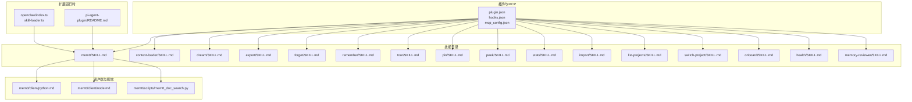
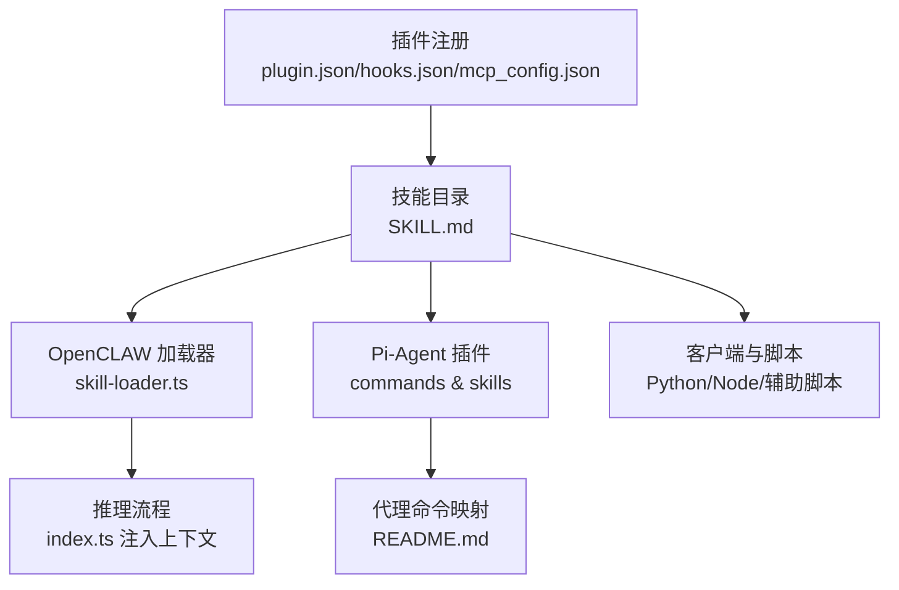
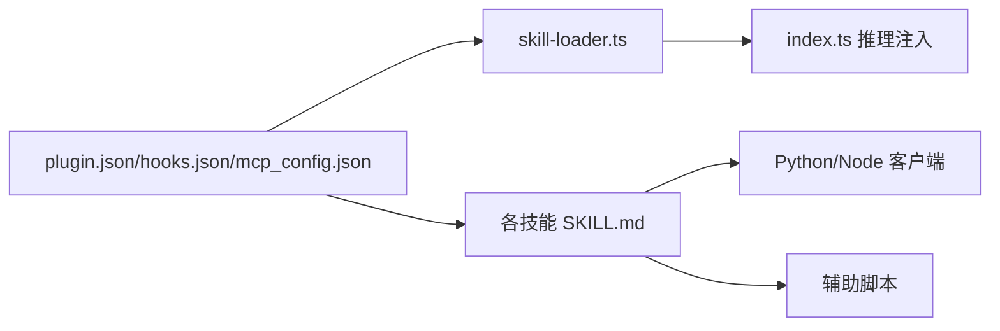

# 技能系统

<cite>
**本文引用的文件**
- [integrations/mem0-plugin/skills/mem0/SKILL.md](file://integrations/mem0-plugin/skills/mem0/SKILL.md)
- [integrations/mem0-plugin/skills/context-loader/SKILL.md](file://integrations/mem0-plugin/skills/context-loader/SKILL.md)
- [integrations/mem0-plugin/skills/dream/SKILL.md](file://integrations/mem0-plugin/skills/dream/SKILL.md)
- [integrations/mem0-plugin/skills/export/SKILL.md](file://integrations/mem0-plugin/skills/export/SKILL.md)
- [integrations/mem0-plugin/skills/forget/SKILL.md](file://integrations/mem0-plugin/skills/forget/SKILL.md)
- [integrations/mem0-plugin/skills/remember/SKILL.md](file://integrations/mem0-plugin/skills/remember/SKILL.md)
- [integrations/mem0-plugin/skills/tour/SKILL.md](file://integrations/mem0-plugin/skills/tour/SKILL.md)
- [integrations/mem0-plugin/skills/pin/SKILL.md](file://integrations/mem0-plugin/skills/pin/SKILL.md)
- [integrations/mem0-plugin/skills/peek/SKILL.md](file://integrations/mem0-plugin/skills/peek/SKILL.md)
- [integrations/mem0-plugin/skills/stats/SKILL.md](file://integrations/mem0-plugin/skills/stats/SKILL.md)
- [integrations/mem0-plugin/skills/import/SKILL.md](file://integrations/mem0-plugin/skills/import/SKILL.md)
- [integrations/mem0-plugin/skills/list-projects/SKILL.md](file://integrations/mem0-plugin/skills/list-projects/SKILL.md)
- [integrations/mem0-plugin/skills/switch-project/SKILL.md](file://integrations/mem0-plugin/skills/switch-project/SKILL.md)
- [integrations/mem0-plugin/skills/onboard/SKILL.md](file://integrations/mem0-plugin/skills/onboard/SKILL.md)
- [integrations/mem0-plugin/skills/health/SKILL.md](file://integrations/mem0-plugin/skills/health/SKILL.md)
- [integrations/mem0-plugin/skills/memory-reviewer/SKILL.md](file://integrations/mem0-plugin/skills/memory-reviewer/SKILL.md)
- [integrations/mem0-plugin/README.md](file://integrations/mem0-plugin/README.md)
- [integrations/mem0-plugin/plugin.json](file://integrations/mem0-plugin/plugin.json)
- [integrations/mem0-plugin/hooks.json](file://integrations/mem0-plugin/hooks.json)
- [integrations/mem0-plugin/mcp_config.json](file://integrations/mem0-plugin/mcp_config.json)
- [integrations/mem0-plugin/skills/mem0/README.md](file://integrations/mem0-plugin/skills/mem0/README.md)
- [integrations/mem0-plugin/skills/mem0/SKILL.md](file://integrations/mem0-plugin/skills/mem0/SKILL.md)
- [integrations/mem0-plugin/skills/mem0/client/python.md](file://integrations/mem0-plugin/skills/mem0/client/python.md)
- [integrations/mem0-plugin/skills/mem0/client/node.md](file://integrations/mem0-plugin/skills/mem0/client/node.md)
- [integrations/mem0-plugin/skills/mem0/client/differences.md](file://integrations/mem0-plugin/skills/mem0/client/differences.md)
- [integrations/mem0-plugin/skills/mem0/scripts/mem0_doc_search.py](file://integrations/mem0-plugin/skills/mem0/scripts/mem0_doc_search.py)
- [integrations/openclaw/skill-loader.ts](file://integrations/openclaw/skill-loader.ts)
- [integrations/openclaw/index.ts](file://integrations/openclaw/index.ts)
- [integrations/pi-agent-plugin/README.md](file://integrations/pi-agent-plugin/README.md)
- [skills/mem0/README.md](file://skills/mem0/README.md)
- [skills/mem0/SKILL.md](file://skills/mem0/SKILL.md)
- [skills/mem0-cli/README.md](file://skills/mem0-cli/README.md)
- [skills/mem0-cli/SKILL.md](file://skills/mem0-cli/SKILL.md)
- [skills/mem0-integrate/README.md](file://skills/mem0-integrate/README.md)
- [skills/mem0-integrate/SKILL.md](file://skills/mem0-integrate/SKILL.md)
- [skills/mem0-oss-to-platform/README.md](file://skills/mem0-oss-to-platform/README.md)
- [skills/mem0-oss-to-platform/SKILL.md](file://skills/mem0-oss-to-platform/SKILL.md)
- [skills/mem0-vercel-ai-sdk/README.md](file://skills/mem0-vercel-ai-sdk/README.md)
- [skills/mem0-vercel-ai-sdk/SKILL.md](file://skills/mem0-vercel-ai-sdk/SKILL.md)
</cite>

## 目录
1. [简介](#简介)
2. [项目结构](#项目结构)
3. [核心组件](#核心组件)
4. [架构总览](#架构总览)
5. [详细组件分析](#详细组件分析)
6. [依赖关系分析](#依赖关系分析)
7. [性能考量](#性能考量)
8. [故障排查指南](#故障排查指南)
9. [结论](#结论)
10. [附录](#附录)

## 简介
本文件系统性梳理 Mem0 技能系统：定义与分类、执行机制、内置技能（mem0、context-loader、dream、export、forget 等）的功能与使用方式、配置参数、输入输出格式与调用方式，并提供自定义技能开发规范、测试与部署流程，以及实际示例与集成案例。

## 项目结构
Mem0 技能系统主要由以下部分组成：
- 插件层：面向不同平台（Claude/Cursor/Codex/OpenCode 等）的插件与 MCP 配置，统一暴露技能清单与钩子。
- 技能目录：每个技能以独立目录呈现，包含技能说明、调用方式与最佳实践。
- 客户端与脚本：为技能提供 Python/Node 客户端能力与辅助脚本。
- OpenCLAW 与 Pi-Agent 扩展：在特定运行时中加载与调度技能，实现上下文注入与记忆操作。

**图表来源**
- [integrations/mem0-plugin/plugin.json](file://integrations/mem0-plugin/plugin.json)
- [integrations/mem0-plugin/hooks.json](file://integrations/mem0-plugin/hooks.json)
- [integrations/mem0-plugin/mcp_config.json](file://integrations/mem0-plugin/mcp_config.json)
- [integrations/mem0-plugin/skills/mem0/SKILL.md](file://integrations/mem0-plugin/skills/mem0/SKILL.md)
- [integrations/mem0-plugin/skills/context-loader/SKILL.md](file://integrations/mem0-plugin/skills/context-loader/SKILL.md)
- [integrations/mem0-plugin/skills/dream/SKILL.md](file://integrations/mem0-plugin/skills/dream/SKILL.md)
- [integrations/mem0-plugin/skills/export/SKILL.md](file://integrations/mem0-plugin/skills/export/SKILL.md)
- [integrations/mem0-plugin/skills/forget/SKILL.md](file://integrations/mem0-plugin/skills/forget/SKILL.md)
- [integrations/mem0-plugin/skills/remember/SKILL.md](file://integrations/mem0-plugin/skills/remember/SKILL.md)
- [integrations/mem0-plugin/skills/tour/SKILL.md](file://integrations/mem0-plugin/skills/tour/SKILL.md)
- [integrations/mem0-plugin/skills/pin/SKILL.md](file://integrations/mem0-plugin/skills/pin/SKILL.md)
- [integrations/mem0-plugin/skills/peek/SKILL.md](file://integrations/mem0-plugin/skills/peek/SKILL.md)
- [integrations/mem0-plugin/skills/stats/SKILL.md](file://integrations/mem0-plugin/skills/stats/SKILL.md)
- [integrations/mem0-plugin/skills/import/SKILL.md](file://integrations/mem0-plugin/skills/import/SKILL.md)
- [integrations/mem0-plugin/skills/list-projects/SKILL.md](file://integrations/mem0-plugin/skills/list-projects/SKILL.md)
- [integrations/mem0-plugin/skills/switch-project/SKILL.md](file://integrations/mem0-plugin/skills/switch-project/SKILL.md)
- [integrations/mem0-plugin/skills/onboard/SKILL.md](file://integrations/mem0-plugin/skills/onboard/SKILL.md)
- [integrations/mem0-plugin/skills/health/SKILL.md](file://integrations/mem0-plugin/skills/health/SKILL.md)
- [integrations/mem0-plugin/skills/memory-reviewer/SKILL.md](file://integrations/mem0-plugin/skills/memory-reviewer/SKILL.md)
- [integrations/mem0-plugin/skills/mem0/client/python.md](file://integrations/mem0-plugin/skills/mem0/client/python.md)
- [integrations/mem0-plugin/skills/mem0/client/node.md](file://integrations/mem0-plugin/skills/mem0/client/node.md)
- [integrations/mem0-plugin/skills/mem0/scripts/mem0_doc_search.py](file://integrations/mem0-plugin/skills/mem0/scripts/mem0_doc_search.py)
- [integrations/openclaw/index.ts](file://integrations/openclaw/index.ts)
- [integrations/openclaw/skill-loader.ts](file://integrations/openclaw/skill-loader.ts)
- [integrations/pi-agent-plugin/README.md](file://integrations/pi-agent-plugin/README.md)

**章节来源**
- [integrations/mem0-plugin/README.md](file://integrations/mem0-plugin/README.md)
- [integrations/mem0-plugin/plugin.json](file://integrations/mem0-plugin/plugin.json)
- [integrations/mem0-plugin/hooks.json](file://integrations/mem0-plugin/hooks.json)
- [integrations/mem0-plugin/mcp_config.json](file://integrations/mem0-plugin/mcp_config.json)

## 核心组件
- 技能定义与清单
  - 每个技能以独立目录与 SKILL.md 文档呈现，明确用途、调用方式、输入输出与最佳实践。
  - 插件通过 plugin.json、hooks.json、mcp_config.json 统一注册与暴露技能。
- 运行时加载与调度
  - OpenCLAW 在推理流程中按策略加载技能上下文，注入到提示词或工具调用中。
  - Pi-Agent 插件提供命令与技能映射，指导代理如何使用记忆能力。
- 客户端与脚本
  - 提供 Python/Node 客户端能力与辅助脚本，支撑技能的外部调用与文档检索。

**章节来源**
- [integrations/mem0-plugin/skills/mem0/SKILL.md](file://integrations/mem0-plugin/skills/mem0/SKILL.md)
- [integrations/mem0-plugin/skills/context-loader/SKILL.md](file://integrations/mem0-plugin/skills/context-loader/SKILL.md)
- [integrations/mem0-plugin/skills/dream/SKILL.md](file://integrations/mem0-plugin/skills/dream/SKILL.md)
- [integrations/mem0-plugin/skills/export/SKILL.md](file://integrations/mem0-plugin/skills/export/SKILL.md)
- [integrations/mem0-plugin/skills/forget/SKILL.md](file://integrations/mem0-plugin/skills/forget/SKILL.md)
- [integrations/mem0-plugin/skills/remember/SKILL.md](file://integrations/mem0-plugin/skills/remember/SKILL.md)
- [integrations/mem0-plugin/skills/tour/SKILL.md](file://integrations/mem0-plugin/skills/tour/SKILL.md)
- [integrations/mem0-plugin/skills/pin/SKILL.md](file://integrations/mem0-plugin/skills/pin/SKILL.md)
- [integrations/mem0-plugin/skills/peek/SKILL.md](file://integrations/mem0-plugin/skills/peek/SKILL.md)
- [integrations/mem0-plugin/skills/stats/SKILL.md](file://integrations/mem0-plugin/skills/stats/SKILL.md)
- [integrations/mem0-plugin/skills/import/SKILL.md](file://integrations/mem0-plugin/skills/import/SKILL.md)
- [integrations/mem0-plugin/skills/list-projects/SKILL.md](file://integrations/mem0-plugin/skills/list-projects/SKILL.md)
- [integrations/mem0-plugin/skills/switch-project/SKILL.md](file://integrations/mem0-plugin/skills/switch-project/SKILL.md)
- [integrations/mem0-plugin/skills/onboard/SKILL.md](file://integrations/mem0-plugin/skills/onboard/SKILL.md)
- [integrations/mem0-plugin/skills/health/SKILL.md](file://integrations/mem0-plugin/skills/health/SKILL.md)
- [integrations/mem0-plugin/skills/memory-reviewer/SKILL.md](file://integrations/mem0-plugin/skills/memory-reviewer/SKILL.md)
- [integrations/mem0-plugin/skills/mem0/client/python.md](file://integrations/mem0-plugin/skills/mem0/client/python.md)
- [integrations/mem0-plugin/skills/mem0/client/node.md](file://integrations/mem0-plugin/skills/mem0/client/node.md)
- [integrations/mem0-plugin/skills/mem0/scripts/mem0_doc_search.py](file://integrations/mem0-plugin/skills/mem0/scripts/mem0_doc_search.py)
- [integrations/openclaw/skill-loader.ts](file://integrations/openclaw/skill-loader.ts)
- [integrations/openclaw/index.ts](file://integrations/openclaw/index.ts)
- [integrations/pi-agent-plugin/README.md](file://integrations/pi-agent-plugin/README.md)

## 架构总览
Mem0 技能系统采用“插件 + 技能 + 运行时”的分层架构：
- 插件层负责技能注册与钩子管理；
- 技能层提供具体功能与调用规范；
- 运行时根据策略加载技能上下文，注入到对话或工具调用中；
- 客户端与脚本为外部系统提供统一访问入口。

**图表来源**
- [integrations/mem0-plugin/plugin.json](file://integrations/mem0-plugin/plugin.json)
- [integrations/mem0-plugin/hooks.json](file://integrations/mem0-plugin/hooks.json)
- [integrations/mem0-plugin/mcp_config.json](file://integrations/mem0-plugin/mcp_config.json)
- [integrations/mem0-plugin/skills/mem0/SKILL.md](file://integrations/mem0-plugin/skills/mem0/SKILL.md)
- [integrations/openclaw/skill-loader.ts](file://integrations/openclaw/skill-loader.ts)
- [integrations/openclaw/index.ts](file://integrations/openclaw/index.ts)
- [integrations/pi-agent-plugin/README.md](file://integrations/pi-agent-plugin/README.md)
- [integrations/mem0-plugin/skills/mem0/client/python.md](file://integrations/mem0-plugin/skills/mem0/client/python.md)
- [integrations/mem0-plugin/skills/mem0/client/node.md](file://integrations/mem0-plugin/skills/mem0/client/node.md)
- [integrations/mem0-plugin/skills/mem0/scripts/mem0_doc_search.py](file://integrations/mem0-plugin/skills/mem0/scripts/mem0_doc_search.py)

## 详细组件分析

### 内置技能总览与分类
- 记忆写入类：remember（存储事实并分类）
- 记忆检索类：context-loader（会话开始预取相关记忆）、peek（快速查看）
- 记忆治理类：forget（删除记忆，带确认）、dream（记忆整合与去重/修剪/矛盾解决）、pin（保护记忆不被修剪）、tour（按类别浏览全部记忆）、stats（统计信息）
- 导入导出类：export（导出记忆）、import（导入记忆）
- 项目与状态类：list-projects（列出项目）、switch-project（切换项目）、onboard（引导）、health（健康检查）、memory-reviewer（记忆审查）
- 核心能力封装：mem0（统一入口与 SDK 使用指南）

**章节来源**
- [integrations/mem0-plugin/skills/remember/SKILL.md](file://integrations/mem0-plugin/skills/remember/SKILL.md)
- [integrations/mem0-plugin/skills/context-loader/SKILL.md](file://integrations/mem0-plugin/skills/context-loader/SKILL.md)
- [integrations/mem0-plugin/skills/peek/SKILL.md](file://integrations/mem0-plugin/skills/peek/SKILL.md)
- [integrations/mem0-plugin/skills/forget/SKILL.md](file://integrations/mem0-plugin/skills/forget/SKILL.md)
- [integrations/mem0-plugin/skills/dream/SKILL.md](file://integrations/mem0-plugin/skills/dream/SKILL.md)
- [integrations/mem0-plugin/skills/pin/SKILL.md](file://integrations/mem0-plugin/skills/pin/SKILL.md)
- [integrations/mem0-plugin/skills/tour/SKILL.md](file://integrations/mem0-plugin/skills/tour/SKILL.md)
- [integrations/mem0-plugin/skills/stats/SKILL.md](file://integrations/mem0-plugin/skills/stats/SKILL.md)
- [integrations/mem0-plugin/skills/export/SKILL.md](file://integrations/mem0-plugin/skills/export/SKILL.md)
- [integrations/mem0-plugin/skills/import/SKILL.md](file://integrations/mem0-plugin/skills/import/SKILL.md)
- [integrations/mem0-plugin/skills/list-projects/SKILL.md](file://integrations/mem0-plugin/skills/list-projects/SKILL.md)
- [integrations/mem0-plugin/skills/switch-project/SKILL.md](file://integrations/mem0-plugin/skills/switch-project/SKILL.md)
- [integrations/mem0-plugin/skills/onboard/SKILL.md](file://integrations/mem0-plugin/skills/onboard/SKILL.md)
- [integrations/mem0-plugin/skills/health/SKILL.md](file://integrations/mem0-plugin/skills/health/SKILL.md)
- [integrations/mem0-plugin/skills/memory-reviewer/SKILL.md](file://integrations/mem0-plugin/skills/memory-reviewer/SKILL.md)
- [integrations/mem0-plugin/skills/mem0/SKILL.md](file://integrations/mem0-plugin/skills/mem0/SKILL.md)

### mem0 技能
- 功能概述：作为统一入口与 SDK 使用指南，提供跨语言客户端能力与集成模式。
- 输入输出：依据具体调用场景（写入、查询、导出等），遵循对应 API 的输入输出约定；输出通常为结构化结果或操作反馈。
- 调用方式：通过插件注册后，在运行时由 OpenCLAW 或 Pi-Agent 触发；也可通过 Python/Node 客户端直接调用。
- 配置参数：参考客户端文档与插件配置项，涵盖认证、项目、阈值、范围等。

**章节来源**
- [integrations/mem0-plugin/skills/mem0/SKILL.md](file://integrations/mem0-plugin/skills/mem0/SKILL.md)
- [integrations/mem0-plugin/skills/mem0/README.md](file://integrations/mem0-plugin/skills/mem0/README.md)
- [integrations/mem0-plugin/skills/mem0/client/python.md](file://integrations/mem0-plugin/skills/mem0/client/python.md)
- [integrations/mem0-plugin/skills/mem0/client/node.md](file://integrations/mem0-plugin/skills/mem0/client/node.md)
- [integrations/mem0-plugin/skills/mem0/client/differences.md](file://integrations/mem0-plugin/skills/mem0/client/differences.md)
- [integrations/mem0-plugin/skills/mem0/scripts/mem0_doc_search.py](file://integrations/mem0-plugin/skills/mem0/scripts/mem0_doc_search.py)

### context-loader 技能
- 功能概述：在会话开始时预取与当前上下文相关的记忆，减少后续检索成本。
- 输入输出：输入为用户标识、会话标识、范围等；输出为可注入到提示词中的上下文片段。
- 调用方式：OpenCLAW 在推理前自动触发；Pi-Agent 可通过命令触发。
- 配置参数：范围（长期/会话/全部）、阈值、过滤条件等。

**章节来源**
- [integrations/mem0-plugin/skills/context-loader/SKILL.md](file://integrations/mem0-plugin/skills/context-loader/SKILL.md)
- [integrations/openclaw/skill-loader.ts](file://integrations/openclaw/skill-loader.ts)
- [integrations/openclaw/index.ts](file://integrations/openclaw/index.ts)
- [integrations/pi-agent-plugin/README.md](file://integrations/pi-agent-plugin/README.md)

### dream 技能
- 功能概述：记忆整合流程，合并重复、修剪陈旧、解决矛盾，提升记忆质量。
- 输入输出：输入为整合策略与范围；输出为整合后的记忆集合与变更摘要。
- 调用方式：OpenCLAW 支持在合并会话阶段加载提示词；Pi-Agent 提供命令触发。
- 配置参数：范围、阈值、一致性规则等。

**章节来源**
- [integrations/mem0-plugin/skills/dream/SKILL.md](file://integrations/mem0-plugin/skills/dream/SKILL.md)
- [integrations/openclaw/skill-loader.ts](file://integrations/openclaw/skill-loader.ts)

### export 技能
- 功能概述：导出指定范围内的记忆数据，便于备份或迁移。
- 输入输出：输入为范围、过滤条件；输出为导出文件或数据流。
- 调用方式：通过插件命令或直接调用客户端接口。
- 配置参数：范围、格式、过滤器等。

**章节来源**
- [integrations/mem0-plugin/skills/export/SKILL.md](file://integrations/mem0-plugin/skills/export/SKILL.md)

### forget 技能
- 功能概述：基于语义搜索定位并删除记忆，支持确认流程。
- 输入输出：输入为查询与确认标志；输出为删除结果与受影响的记忆列表。
- 调用方式：OpenCLAW 在需要时自动触发；Pi-Agent 提供命令。
- 配置参数：阈值、范围、确认策略等。

**章节来源**
- [integrations/mem0-plugin/skills/forget/SKILL.md](file://integrations/mem0-plugin/skills/forget/SKILL.md)
- [integrations/pi-agent-plugin/README.md](file://integrations/pi-agent-plugin/README.md)

### 其他常用技能
- remember：存储事实并进行分类，适合在对话中即时固化关键信息。
- tour：按类别浏览全部记忆，用于审计与回顾。
- pin：保护关键记忆不被修剪。
- peek：快速查看匹配的记忆片段。
- stats：返回记忆统计信息。
- import：从外部源导入记忆。
- list-projects/switch-project：项目维度的记忆隔离与切换。
- onboard/health/memory-reviewer：引导、健康检查与记忆审查。

**章节来源**
- [integrations/mem0-plugin/skills/remember/SKILL.md](file://integrations/mem0-plugin/skills/remember/SKILL.md)
- [integrations/mem0-plugin/skills/tour/SKILL.md](file://integrations/mem0-plugin/skills/tour/SKILL.md)
- [integrations/mem0-plugin/skills/pin/SKILL.md](file://integrations/mem0-plugin/skills/pin/SKILL.md)
- [integrations/mem0-plugin/skills/peek/SKILL.md](file://integrations/mem0-plugin/skills/peek/SKILL.md)
- [integrations/mem0-plugin/skills/stats/SKILL.md](file://integrations/mem0-plugin/skills/stats/SKILL.md)
- [integrations/mem0-plugin/skills/import/SKILL.md](file://integrations/mem0-plugin/skills/import/SKILL.md)
- [integrations/mem0-plugin/skills/list-projects/SKILL.md](file://integrations/mem0-plugin/skills/list-projects/SKILL.md)
- [integrations/mem0-plugin/skills/switch-project/SKILL.md](file://integrations/mem0-plugin/skills/switch-project/SKILL.md)
- [integrations/mem0-plugin/skills/onboard/SKILL.md](file://integrations/mem0-plugin/skills/onboard/SKILL.md)
- [integrations/mem0-plugin/skills/health/SKILL.md](file://integrations/mem0-plugin/skills/health/SKILL.md)
- [integrations/mem0-plugin/skills/memory-reviewer/SKILL.md](file://integrations/mem0-plugin/skills/memory-reviewer/SKILL.md)

## 依赖关系分析
- 插件注册与技能暴露
  - plugin.json、hooks.json、mcp_config.json 统一声明技能清单与钩子，确保各平台一致可用。
- 运行时加载链路
  - OpenCLAW 通过 skill-loader.ts 生成提示词与策略，再由 index.ts 将上下文注入推理流程。
- 客户端与脚本
  - mem0 客户端文档与脚本为技能提供跨语言访问能力，降低集成门槛。

**图表来源**
- [integrations/mem0-plugin/plugin.json](file://integrations/mem0-plugin/plugin.json)
- [integrations/mem0-plugin/hooks.json](file://integrations/mem0-plugin/hooks.json)
- [integrations/mem0-plugin/mcp_config.json](file://integrations/mem0-plugin/mcp_config.json)
- [integrations/openclaw/skill-loader.ts](file://integrations/openclaw/skill-loader.ts)
- [integrations/openclaw/index.ts](file://integrations/openclaw/index.ts)
- [integrations/mem0-plugin/skills/mem0/client/python.md](file://integrations/mem0-plugin/skills/mem0/client/python.md)
- [integrations/mem0-plugin/skills/mem0/client/node.md](file://integrations/mem0-plugin/skills/mem0/client/node.md)
- [integrations/mem0-plugin/skills/mem0/scripts/mem0_doc_search.py](file://integrations/mem0-plugin/skills/mem0/scripts/mem0_doc_search.py)

**章节来源**
- [integrations/mem0-plugin/plugin.json](file://integrations/mem0-plugin/plugin.json)
- [integrations/mem0-plugin/hooks.json](file://integrations/mem0-plugin/hooks.json)
- [integrations/mem0-plugin/mcp_config.json](file://integrations/mem0-plugin/mcp_config.json)
- [integrations/openclaw/skill-loader.ts](file://integrations/openclaw/skill-loader.ts)
- [integrations/openclaw/index.ts](file://integrations/openclaw/index.ts)

## 性能考量
- 上下文注入策略
  - OpenCLAW 支持智能模式跳过会话级检索以节省 API 调用；可根据会话长度与复杂度调整召回策略。
- 查询优化
  - 建议在调用记忆搜索前对用户请求进行改写，提取 3–6 个与存储语言一致的事实关键词，避免宽泛查询导致的高开销。
- 范围控制
  - 默认优先使用长期记忆，仅在必要时扩大到会话或全量范围，减少无关上下文带来的 token 开销。
- 阈值与排序
  - 合理设置相似度阈值与重排策略，平衡召回精度与性能。

**章节来源**
- [integrations/openclaw/skill-loader.ts](file://integrations/openclaw/skill-loader.ts)
- [integrations/openclaw/index.ts](file://integrations/openclaw/index.ts)

## 故障排查指南
- OpenCLAW 回忆失败
  - 当回忆失败时，日志会记录警告信息；建议检查网络连通性、认证配置与服务可用性。
- 记忆搜索无结果
  - 检查查询改写是否合理、阈值是否过严、范围是否正确；必要时放宽阈值或扩大范围。
- Pi-Agent 命令不可用
  - 确认插件已正确安装与启用，命令列表与技能映射是否完整。

**章节来源**
- [integrations/openclaw/index.ts](file://integrations/openclaw/index.ts)
- [integrations/pi-agent-plugin/README.md](file://integrations/pi-agent-plugin/README.md)

## 结论
Mem0 技能系统通过标准化的技能定义、统一的插件注册与运行时加载机制，实现了跨平台、可扩展的记忆能力。内置技能覆盖了记忆写入、检索、治理与项目管理等关键场景；结合客户端与脚本，能够满足从简单集成到复杂工作流的多样化需求。建议在生产环境中结合性能策略与阈值调优，确保稳定性与效率。

## 附录

### 自定义技能开发指南
- 编写规范
  - 每个技能应包含 SKILL.md，明确用途、输入输出、调用方式与最佳实践。
  - 保持与现有技能一致的命名与目录结构。
- 测试方法
  - 在插件测试套件中新增用例，覆盖正常路径与边界条件。
  - 使用真实或模拟的运行时环境验证技能加载与执行。
- 部署流程
  - 更新 plugin.json、hooks.json、mcp_config.json，确保技能清单与钩子正确注册。
  - 在目标平台（Claude/Cursor/Codex/OpenCode 等）重新同步插件。

**章节来源**
- [integrations/mem0-plugin/README.md](file://integrations/mem0-plugin/README.md)
- [integrations/mem0-plugin/plugin.json](file://integrations/mem0-plugin/plugin.json)
- [integrations/mem0-plugin/hooks.json](file://integrations/mem0-plugin/hooks.json)
- [integrations/mem0-plugin/mcp_config.json](file://integrations/mem0-plugin/mcp_config.json)

### 实际示例与集成案例
- OpenCLAW 集成
  - 在推理前通过 context-loader 预取上下文，使用 mem0 技能进行写入与查询，借助 dream 进行周期性整合。
- Pi-Agent 集成
  - 使用命令式接口完成记忆写入、检索、删除与导出；通过 onboard 引导新用户。
- 客户端集成
  - 通过 Python/Node 客户端直接调用 mem0 能力，结合辅助脚本实现文档检索与批量处理。

**章节来源**
- [integrations/openclaw/index.ts](file://integrations/openclaw/index.ts)
- [integrations/openclaw/skill-loader.ts](file://integrations/openclaw/skill-loader.ts)
- [integrations/pi-agent-plugin/README.md](file://integrations/pi-agent-plugin/README.md)
- [integrations/mem0-plugin/skills/mem0/client/python.md](file://integrations/mem0-plugin/skills/mem0/client/python.md)
- [integrations/mem0-plugin/skills/mem0/client/node.md](file://integrations/mem0-plugin/skills/mem0/client/node.md)
- [integrations/mem0-plugin/skills/mem0/scripts/mem0_doc_search.py](file://integrations/mem0-plugin/skills/mem0/scripts/mem0_doc_search.py)