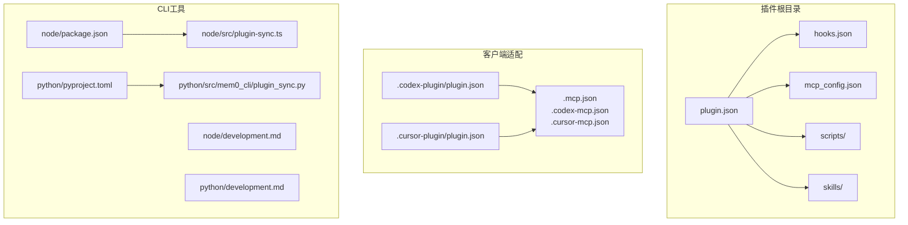
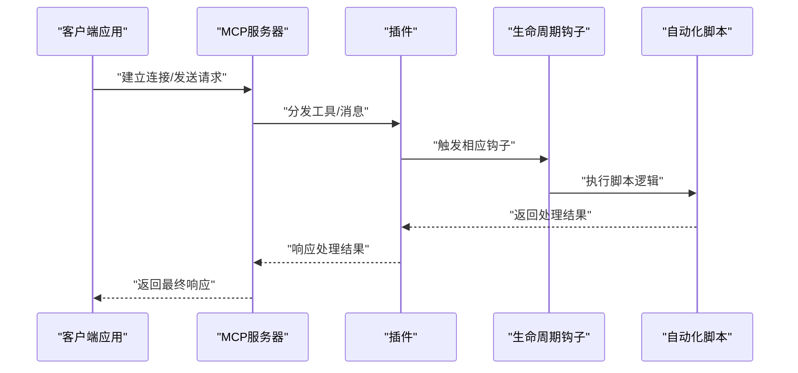
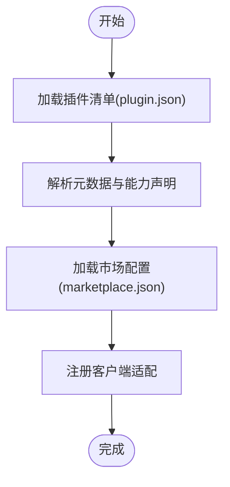
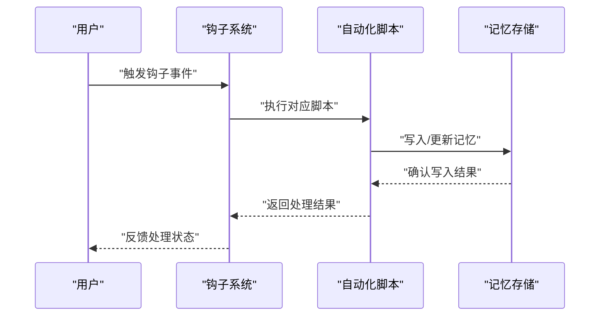
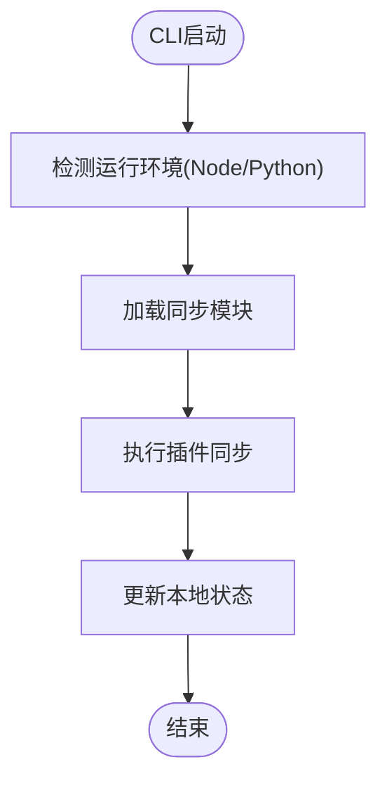
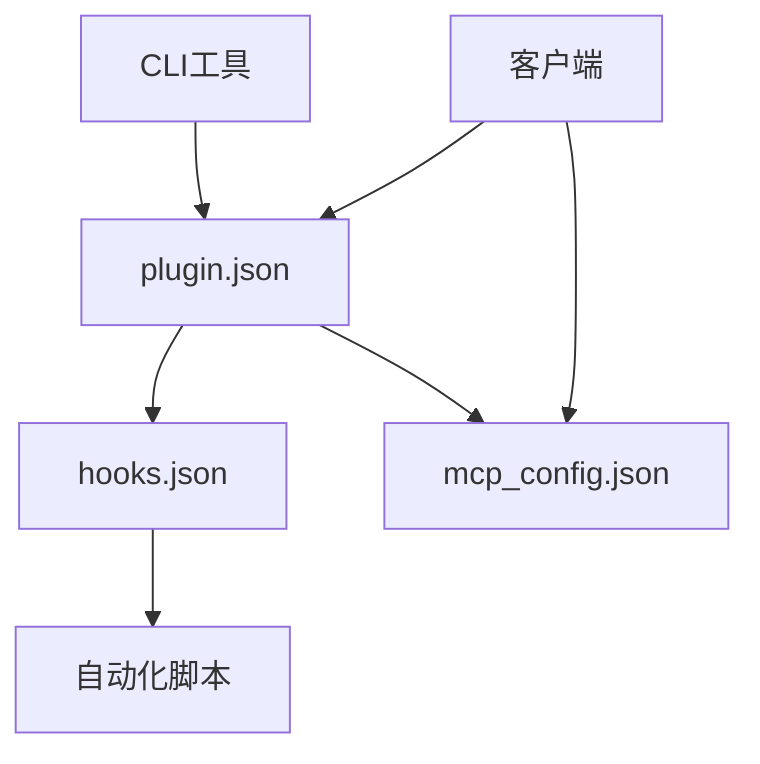

# 插件开发指南

<cite>
**本文档引用的文件**
- [plugin.json](file://integrations/mem0-plugin/plugin.json)
- [hooks.json](file://integrations/mem0-plugin/hooks.json)
- [mcp_config.json](file://integrations/mem0-plugin/mcp_config.json)
- [plugin.json](file://integrations/mem0-plugin/.codex-plugin/plugin.json)
- [plugin.json](file://integrations/mem0-plugin/.cursor-plugin/plugin.json)
- [marketplace.json](file://integrations/mem0-plugin/.codex-mcp.json)
- [marketplace.json](file://integrations/mem0-plugin/.cursor-mcp.json)
- [marketplace.json](file://integrations/mem0-plugin/.mcp.json)
- [mem0-mcp.mdx](file://docs/platform/mem0-mcp.mdx)
- [codex.mdx](file://docs/integrations/codex.mdx)
- [README.md](file://integrations/mem0-plugin/README.md)
- [cli-spec.json](file://cli/cli-spec.json)
- [package.json](file://cli/node/package.json)
- [pyproject.toml](file://cli/python/pyproject.toml)
- [development.md](file://cli/node/development.md)
- [development.md](file://cli/python/development.md)
- [plugin_sync.py](file://cli/python/src/mem0_cli/plugin_sync.py)
- [plugin-sync.ts](file://cli/node/src/plugin-sync.ts)
- [index.ts](file://cli/node/src/index.ts)
- [app.py](file://cli/python/src/mem0_cli/app.py)
- [commands.test.ts](file://cli/node/tests/commands.test.ts)
- [test_commands.py](file://cli/python/tests/test_commands.py)
- [install_codex_hooks.py](file://integrations/mem0-plugin/scripts/install_codex_hooks.py)
- [on_user_prompt.sh](file://integrations/mem0-plugin/scripts/on_user_prompt.sh)
- [on_post_tool_use.sh](file://integrations/mem0-plugin/scripts/on_post_tool_use.sh)
- [auto_capture.py](file://integrations/mem0-plugin/scripts/auto_capture.py)
- [auto_import.py](file://integrations/mem0-plugin/scripts/auto_import.py)
- [setup_coding_categories.py](file://integrations/mem0-plugin/scripts/setup_coding_categories.py)
</cite>

## 目录
1. [简介](#简介)
2. [项目结构](#项目结构)
3. [核心组件](#核心组件)
4. [架构概览](#架构概览)
5. [详细组件分析](#详细组件分析)
6. [依赖关系分析](#依赖关系分析)
7. [性能考虑](#性能考虑)
8. [故障排除指南](#故障排除指南)
9. [结论](#结论)
10. [附录](#附录)

## 简介
本指南面向希望为 Mem0 平台开发插件的开发者，涵盖插件项目的结构组织、配置文件编写、开发环境搭建、MCP 协议实现要求、接口规范与兼容性考虑、测试方法与调试技巧、发布流程以及版本管理与部署策略。通过分析仓库中的插件实现与相关文档，帮助开发者快速上手并构建高质量的插件。

## 项目结构
Mem0 的插件体系主要由以下部分组成：
- 插件清单与配置：位于 `integrations/mem0-plugin/` 目录，包含插件元数据、生命周期钩子、MCP 配置等
- 多客户端适配：针对不同 IDE/编辑器（如 Codex、Cursor）的特定配置文件
- CLI 工具：提供插件同步、命令行操作等功能
- 示例与脚本：自动捕获、导入、分类等自动化功能脚本
- 文档：平台集成与客户端集成指南

**图表来源**
- [plugin.json](file://integrations/mem0-plugin/plugin.json)
- [hooks.json](file://integrations/mem0-plugin/hooks.json)
- [mcp_config.json](file://integrations/mem0-plugin/mcp_config.json)
- [plugin.json](file://integrations/mem0-plugin/.codex-plugin/plugin.json)
- [plugin.json](file://integrations/mem0-plugin/.cursor-plugin/plugin.json)
- [marketplace.json](file://integrations/mem0-plugin/.mcp.json)

**章节来源**
- [plugin.json](file://integrations/mem0-plugin/plugin.json)
- [hooks.json](file://integrations/mem0-plugin/hooks.json)
- [mcp_config.json](file://integrations/mem0-plugin/mcp_config.json)
- [plugin.json](file://integrations/mem0-plugin/.codex-plugin/plugin.json)
- [plugin.json](file://integrations/mem0-plugin/.cursor-plugin/plugin.json)
- [marketplace.json](file://integrations/mem0-plugin/.mcp.json)

## 核心组件
本节深入分析插件开发的核心组件，包括插件清单、生命周期钩子、MCP 配置以及 CLI 同步机制。

### 插件清单（plugin.json）
插件清单是插件的元数据中心，定义了插件的基本信息、能力声明、市场信息以及与客户端的集成方式。在 Mem0 插件中，该文件通常包含：
- 基本信息：名称、版本、描述、作者
- 能力声明：支持的技能、工具、MCP 服务器
- 市场信息：市场标识、安装入口
- 客户端适配：针对不同 IDE 的配置差异

参考路径：
- [plugin.json](file://integrations/mem0-plugin/plugin.json)
- [plugin.json](file://integrations/mem0-plugin/.codex-plugin/plugin.json)
- [plugin.json](file://integrations/mem0-plugin/.cursor-plugin/plugin.json)

**章节来源**
- [plugin.json](file://integrations/mem0-plugin/plugin.json)
- [plugin.json](file://integrations/mem0-plugin/.codex-plugin/plugin.json)
- [plugin.json](file://integrations/mem0-plugin/.cursor-plugin/plugin.json)

### 生命周期钩子（hooks.json）
生命周期钩子用于在用户操作的关键节点触发插件逻辑，例如用户输入、工具使用后、会话开始等。这些钩子通过脚本或函数实现，允许插件自动执行记忆捕获、导入、分类等任务。

典型钩子场景：
- 用户提示钩子：在用户输入时触发，可进行上下文加载或预处理
- 工具使用后钩子：在工具调用完成后触发，可进行结果记录或清理
- 会话开始钩子：在新会话启动时触发，可进行初始化设置

参考路径：
- [hooks.json](file://integrations/mem0-plugin/hooks.json)
- [on_user_prompt.sh](file://integrations/mem0-plugin/scripts/on_user_prompt.sh)
- [on_post_tool_use.sh](file://integrations/mem0-plugin/scripts/on_post_tool_use.sh)
- [install_codex_hooks.py](file://integrations/mem0-plugin/scripts/install_codex_hooks.py)

**章节来源**
- [hooks.json](file://integrations/mem0-plugin/hooks.json)
- [on_user_prompt.sh](file://integrations/mem0-plugin/scripts/on_user_prompt.sh)
- [on_post_tool_use.sh](file://integrations/mem0-plugin/scripts/on_post_tool_use.sh)
- [install_codex_hooks.py](file://integrations/mem0-plugin/scripts/install_codex_hooks.py)

### MCP 配置（mcp_config.json）
MCP（Model Context Protocol）配置定义了插件如何与客户端的 MCP 服务器通信。配置内容包括：
- MCP 服务器地址与认证方式
- 支持的工具与消息类型
- 客户端兼容性设置

参考路径：
- [mcp_config.json](file://integrations/mem0-plugin/mcp_config.json)
- [mem0-mcp.mdx](file://docs/platform/mem0-mcp.mdx)
- [codex.mdx](file://docs/integrations/codex.mdx)

**章节来源**
- [mcp_config.json](file://integrations/mem0-plugin/mcp_config.json)
- [mem0-mcp.mdx](file://docs/platform/mem0-mcp.mdx)
- [codex.mdx](file://docs/integrations/codex.mdx)

### CLI 同步机制
CLI 提供了插件同步与命令行操作的能力，支持 Node.js 与 Python 双栈实现：
- Node 版本：通过 TypeScript 实现，包含插件同步、状态管理、遥测等功能
- Python 版本：通过标准 Python 包管理，提供相似的同步与命令行能力

参考路径：
- [plugin-sync.ts](file://cli/node/src/plugin-sync.ts)
- [plugin_sync.py](file://cli/python/src/mem0_cli/plugin_sync.py)
- [package.json](file://cli/node/package.json)
- [pyproject.toml](file://cli/python/pyproject.toml)

**章节来源**
- [plugin-sync.ts](file://cli/node/src/plugin-sync.ts)
- [plugin_sync.py](file://cli/python/src/mem0_cli/plugin_sync.py)
- [package.json](file://cli/node/package.json)
- [pyproject.toml](file://cli/python/pyproject.toml)

## 架构概览
下图展示了插件系统的主要交互流程，从客户端到 MCP 服务器再到插件内部钩子与脚本的执行链路。

**图表来源**
- [plugin.json](file://integrations/mem0-plugin/plugin.json)
- [hooks.json](file://integrations/mem0-plugin/hooks.json)
- [mcp_config.json](file://integrations/mem0-plugin/mcp_config.json)
- [mem0-mcp.mdx](file://docs/platform/mem0-mcp.mdx)

## 详细组件分析

### 组件A：插件清单与市场配置
该组件负责定义插件的元数据、能力声明与市场接入点。通过统一的清单文件，插件可以向不同客户端展示一致的能力，并通过市场配置实现一键安装与更新。

**图表来源**
- [plugin.json](file://integrations/mem0-plugin/plugin.json)
- [marketplace.json](file://integrations/mem0-plugin/.mcp.json)
- [marketplace.json](file://integrations/mem0-plugin/.codex-mcp.json)
- [marketplace.json](file://integrations/mem0-plugin/.cursor-mcp.json)

**章节来源**
- [plugin.json](file://integrations/mem0-plugin/plugin.json)
- [marketplace.json](file://integrations/mem0-plugin/.mcp.json)
- [marketplace.json](file://integrations/mem0-plugin/.codex-mcp.json)
- [marketplace.json](file://integrations/mem0-plugin/.cursor-mcp.json)

### 组件B：生命周期钩子与自动化脚本
生命周期钩子是插件自动化的关键，通过在用户操作的关键节点触发脚本，实现记忆捕获、导入、分类等自动化功能。

**图表来源**
- [hooks.json](file://integrations/mem0-plugin/hooks.json)
- [on_user_prompt.sh](file://integrations/mem0-plugin/scripts/on_user_prompt.sh)
- [on_post_tool_use.sh](file://integrations/mem0-plugin/scripts/on_post_tool_use.sh)
- [auto_capture.py](file://integrations/mem0-plugin/scripts/auto_capture.py)
- [auto_import.py](file://integrations/mem0-plugin/scripts/auto_import.py)

**章节来源**
- [hooks.json](file://integrations/mem0-plugin/hooks.json)
- [on_user_prompt.sh](file://integrations/mem0-plugin/scripts/on_user_prompt.sh)
- [on_post_tool_use.sh](file://integrations/mem0-plugin/scripts/on_post_tool_use.sh)
- [auto_capture.py](file://integrations/mem0-plugin/scripts/auto_capture.py)
- [auto_import.py](file://integrations/mem0-plugin/scripts/auto_import.py)

### 组件C：CLI 同步与命令行工具
CLI 提供了插件同步与命令行操作能力，支持 Node.js 与 Python 双栈实现，便于开发者在本地快速验证插件功能。

**图表来源**
- [plugin-sync.ts](file://cli/node/src/plugin-sync.ts)
- [plugin_sync.py](file://cli/python/src/mem0_cli/plugin_sync.py)
- [index.ts](file://cli/node/src/index.ts)
- [app.py](file://cli/python/src/mem0_cli/app.py)

**章节来源**
- [plugin-sync.ts](file://cli/node/src/plugin-sync.ts)
- [plugin_sync.py](file://cli/python/src/mem0_cli/plugin_sync.py)
- [index.ts](file://cli/node/src/index.ts)
- [app.py](file://cli/python/src/mem0_cli/app.py)

## 依赖关系分析
插件系统的依赖关系主要体现在以下几个方面：
- 插件清单对生命周期钩子与 MCP 配置的依赖
- 自动化脚本对钩子系统的依赖
- CLI 对插件同步模块的依赖
- 不同客户端对市场配置的依赖

**图表来源**
- [plugin.json](file://integrations/mem0-plugin/plugin.json)
- [hooks.json](file://integrations/mem0-plugin/hooks.json)
- [mcp_config.json](file://integrations/mem0-plugin/mcp_config.json)
- [plugin-sync.ts](file://cli/node/src/plugin-sync.ts)
- [plugin_sync.py](file://cli/python/src/mem0_cli/plugin_sync.py)

**章节来源**
- [plugin.json](file://integrations/mem0-plugin/plugin.json)
- [hooks.json](file://integrations/mem0-plugin/hooks.json)
- [mcp_config.json](file://integrations/mem0-plugin/mcp_config.json)
- [plugin-sync.ts](file://cli/node/src/plugin-sync.ts)
- [plugin_sync.py](file://cli/python/src/mem0_cli/plugin_sync.py)

## 性能考虑
- 钩子执行的异步化：生命周期钩子应尽量采用异步执行，避免阻塞用户交互
- 脚本优化：自动化脚本应进行资源管理与错误处理，减少不必要的 IO 操作
- CLI 同步批量化：插件同步过程可批量处理多个变更，提升效率
- 缓存策略：对于频繁访问的数据，可引入缓存以降低重复计算成本

## 故障排除指南
常见问题与解决方法：
- 插件未正确注册：检查插件清单与市场配置是否匹配，确保客户端已正确加载
- 钩子未触发：验证钩子事件监听与脚本执行权限，确认脚本路径与参数正确
- MCP 连接失败：检查 MCP 服务器地址与认证配置，确认网络连通性
- CLI 同步异常：查看 CLI 日志输出，确认 Node/Python 环境与依赖版本兼容

**章节来源**
- [commands.test.ts](file://cli/node/tests/commands.test.ts)
- [test_commands.py](file://cli/python/tests/test_commands.py)
- [development.md](file://cli/node/development.md)
- [development.md](file://cli/python/development.md)

## 结论
通过本指南，开发者可以全面了解 Mem0 插件的结构组织、配置编写、开发环境搭建与 MCP 协议实现要求。结合生命周期钩子与自动化脚本，插件能够实现强大的自动化能力；借助 CLI 工具与测试框架，开发者可以高效地进行开发、调试与发布。遵循本文的最佳实践与故障排除建议，将有助于构建稳定、可靠的插件产品。

## 附录
- 开发环境搭建：参考各语言的开发文档与包管理配置
- 测试方法：利用现有测试套件与单元测试框架进行功能验证
- 发布流程：通过市场配置与清单文件完成插件发布与更新
- 版本管理：遵循语义化版本控制，确保向后兼容性
- 部署策略：根据目标客户端选择合适的部署方式（市场安装或直接 MCP）

**章节来源**
- [README.md](file://integrations/mem0-plugin/README.md)
- [cli-spec.json](file://cli/cli-spec.json)
- [package.json](file://cli/node/package.json)
- [pyproject.toml](file://cli/python/pyproject.toml)
- [development.md](file://cli/node/development.md)
- [development.md](file://cli/python/development.md)