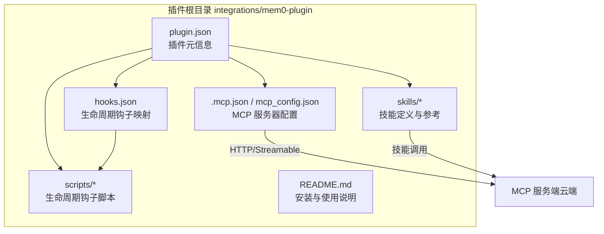
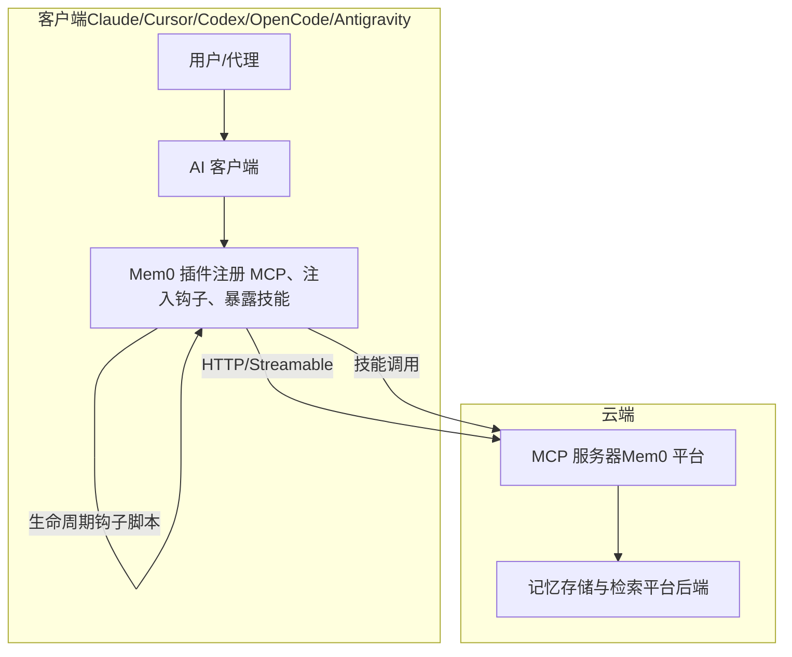
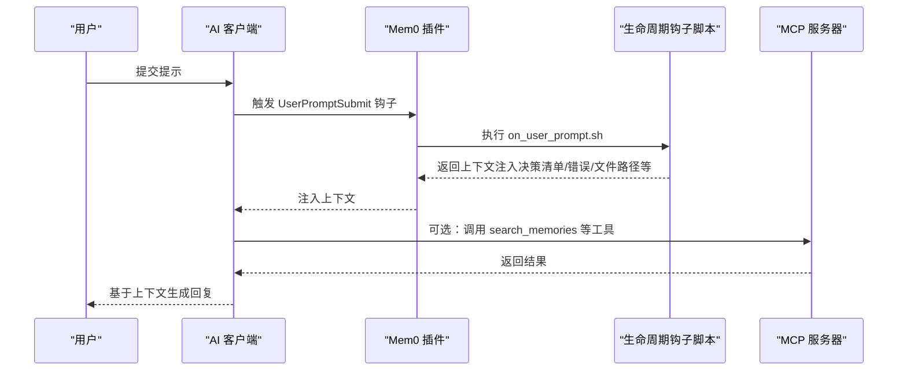
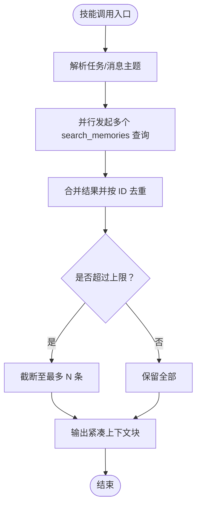
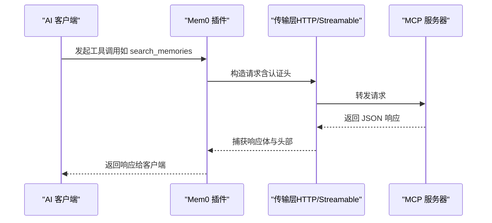
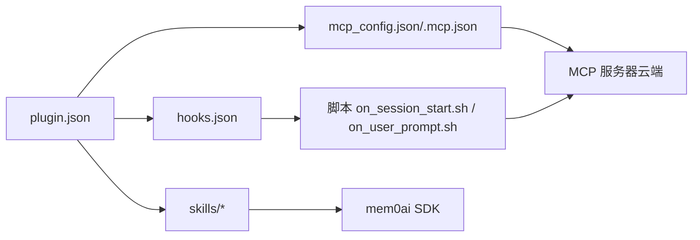

# 插件架构设计

<cite>
**本文引用的文件**
- [plugin.json](file://integrations/mem0-plugin/plugin.json)
- [.mcp.json](file://integrations/mem0-plugin/.mcp.json)
- [hooks.json](file://integrations/mem0-plugin/hooks.json)
- [mcp_config.json](file://integrations/mem0-plugin/mcp_config.json)
- [README.md](file://integrations/mem0-plugin/README.md)
- [SKILL.md（mem0 技能）](file://integrations/mem0-plugin/skills/mem0/SKILL.md)
- [SKILL.md（context-loader 技能）](file://integrations/mem0-plugin/skills/context-loader/SKILL.md)
- [on_session_start.sh](file://integrations/mem0-plugin/scripts/on_session_start.sh)
- [on_user_prompt.sh](file://integrations/mem0-plugin/scripts/on_user_prompt.sh)
- [mcp-integration.mdx](file://docs/platform/features/mcp-integration.mdx)
- [mem0-mcp.mdx](file://docs/platform/mem0-mcp.mdx)
- [mcp_server.py](file://openmemory/api/app/mcp_server.py)
</cite>

## 目录
1. [引言](#引言)
2. [项目结构](#项目结构)
3. [核心组件](#核心组件)
4. [架构总览](#架构总览)
5. [组件详解](#组件详解)
6. [依赖关系分析](#依赖关系分析)
7. [性能与可靠性](#性能与可靠性)
8. [故障排查指南](#故障排查指南)
9. [结论](#结论)
10. [附录](#附录)

## 引言
本文件面向希望在各类 AI 客户端中集成 Mem0 的开发者，系统性阐述 Mem0 插件的架构设计与实现要点，重点覆盖以下方面：
- MCP（Model Context Protocol）协议的接入方式与工具集
- 插件配置文件结构与环境变量注入
- 生命周期钩子系统的工作机制与触发时机
- 技能定义规范与使用场景
- 插件生命周期管理、事件处理与通信协议
- 架构图与组件交互流程图，帮助快速理解整体设计

## 项目结构
Mem0 插件以“插件清单 + MCP 配置 + 生命周期钩子 + 技能集合 + 脚本工具”为核心组织形式，分别位于 integrations/mem0-plugin 目录下，并通过文档目录提供使用说明与最佳实践。

**图表来源**
- [plugin.json:1-14](file://integrations/mem0-plugin/plugin.json#L1-L14)
- [.mcp.json:1-12](file://integrations/mem0-plugin/.mcp.json#L1-L12)
- [mcp_config.json:1-11](file://integrations/mem0-plugin/mcp_config.json#L1-L11)
- [hooks.json:1-105](file://integrations/mem0-plugin/hooks.json#L1-L105)
- [README.md:1-306](file://integrations/mem0-plugin/README.md#L1-L306)

**章节来源**
- [plugin.json:1-14](file://integrations/mem0-plugin/plugin.json#L1-L14)
- [.mcp.json:1-12](file://integrations/mem0-plugin/.mcp.json#L1-L12)
- [mcp_config.json:1-11](file://integrations/mem0-plugin/mcp_config.json#L1-L11)
- [hooks.json:1-105](file://integrations/mem0-plugin/hooks.json#L1-L105)
- [README.md:1-306](file://integrations/mem0-plugin/README.md#L1-L306)

## 核心组件
- 插件清单与元信息：定义插件标识、名称、版本、描述、作者、主页、仓库、许可证、关键词以及上下文文档文件名等。
- MCP 服务器配置：声明远程 MCP 服务器类型、URL 与认证头（如 Authorization Token），支持客户端按需读取。
- 生命周期钩子：定义不同事件（会话开始、用户提交提示、工具调用前后、停止）下的执行动作（命令或脚本），并可按匹配器过滤特定工具或场景。
- 技能集合：提供可被 AI 客户端调用的自然语言指令（如 /mem0:remember、/mem0:tour 等），并附带技能元数据与参考文档。
- 脚本工具：以 Bash/Python 脚本实现自动导入、分类设置、上下文注入、自动捕获与统计等能力。

**章节来源**
- [plugin.json:1-14](file://integrations/mem0-plugin/plugin.json#L1-L14)
- [.mcp.json:1-12](file://integrations/mem0-plugin/.mcp.json#L1-L12)
- [mcp_config.json:1-11](file://integrations/mem0-plugin/mcp_config.json#L1-L11)
- [hooks.json:1-105](file://integrations/mem0-plugin/hooks.json#L1-L105)
- [README.md:224-306](file://integrations/mem0-plugin/README.md#L224-L306)

## 架构总览
Mem0 插件采用“轻插件 + 远程 MCP 服务”的架构：插件负责在客户端侧注册 MCP 服务器、注入生命周期钩子、暴露技能指令；实际的记忆增删改查由云端 MCP 服务器统一提供。插件内部脚本通过环境变量与工具链完成自动化的上下文加载、分类设置与增量记忆捕获。

**图表来源**
- [mcp-integration.mdx:72-78](file://docs/platform/features/mcp-integration.mdx#L72-L78)
- [mem0-mcp.mdx:16-18](file://docs/platform/mem0-mcp.mdx#L16-L18)
- [mcp_server.py:569-574](file://openmemory/api/app/mcp_server.py#L569-L574)

**章节来源**
- [mcp-integration.mdx:72-78](file://docs/platform/features/mcp-integration.mdx#L72-L78)
- [mem0-mcp.mdx:16-18](file://docs/platform/mem0-mcp.mdx#L16-L18)
- [mcp_server.py:569-574](file://openmemory/api/app/mcp_server.py#L569-L574)

## 组件详解

### 插件配置文件结构
- 插件清单（plugin.json）
  - 关键字段：id、name、version、description、author、publisher、homepage、repository、license、keywords、contextFileName
  - 作用：向客户端声明插件身份与能力，提供上下文文档入口
- MCP 配置（.mcp.json 或 mcp_config.json）
  - 关键字段：mcpServers.<name>.type/url/headers（含 Authorization Token 注入）
  - 作用：为客户端提供统一的 MCP 服务器连接参数
- 钩子配置（hooks.json）
  - 结构：hooks.<Event> 数组，每项包含 matcher 与 hooks 列表
  - 作用：在指定事件触发时执行命令或脚本，支持超时控制与条件匹配

**章节来源**
- [plugin.json:1-14](file://integrations/mem0-plugin/plugin.json#L1-L14)
- [.mcp.json:1-12](file://integrations/mem0-plugin/.mcp.json#L1-L12)
- [mcp_config.json:1-11](file://integrations/mem0-plugin/mcp_config.json#L1-L11)
- [hooks.json:1-105](file://integrations/mem0-plugin/hooks.json#L1-L105)

### 生命周期钩子系统
- 触发事件与典型行为
  - SessionStart：初始化会话 ID、持久化身份信息、打印状态行、触发自动导入与分类设置、记录遥测
  - UserPromptSubmit：根据提示内容注入决策清单、错误检测、文件路径识别、周期性提醒保存、必要时进行上下文恢复搜索
  - PreToolUse/PostToolUse：对特定工具（写入、编辑、读取、Bash 输出等）执行阻断、元数据强制、上下文注入
  - Stop：生成会话摘要并持久化学习成果
- 匹配器与超时
  - 使用正则匹配工具名或工具前缀，确保只在目标场景生效
  - 每个钩子可配置超时，避免阻塞主流程
- 脚本实现要点
  - on_session_start.sh：解析输入、设置会话 ID、注入环境变量、查询记忆数量、自动导入与分类设置、后台任务
  - on_user_prompt.sh：检测错误/文件路径/恢复意图/显式记忆保存意图，注入上下文，周期性自动捕获

**图表来源**
- [hooks.json:21-31](file://integrations/mem0-plugin/hooks.json#L21-L31)
- [on_user_prompt.sh:1-202](file://integrations/mem0-plugin/scripts/on_user_prompt.sh#L1-L202)

**章节来源**
- [hooks.json:1-105](file://integrations/mem0-plugin/hooks.json#L1-L105)
- [on_session_start.sh:1-200](file://integrations/mem0-plugin/scripts/on_session_start.sh#L1-L200)
- [on_user_prompt.sh:1-202](file://integrations/mem0-plugin/scripts/on_user_prompt.sh#L1-L202)

### 技能定义规范
- 技能元数据
  - 名称、描述、许可证、作者、版本、类别、标签、兼容性要求（语言版本、SDK、环境变量、网络访问）
- 技能内容
  - 安装与认证步骤（Python/Node 安装 mem0ai，导出 MEM0_API_KEY）
  - 初始化客户端（同步/异步）
  - 常见操作：新增、搜索、列出、更新、删除、批量删除、实体枚举
  - 集成模式示例：检索→生成→存储
  - 边界情况与注意事项（v3 默认值、过滤器语义、平台/OSS 差异）
- 上下文加载技能（context-loader）
  - 在任务开始前并行搜索多角度上下文（决策、约定、反模式、广域），去重并输出紧凑上下文块
  - 约束：只读、最多返回 10 条、零结果时不输出

**图表来源**
- [SKILL.md（context-loader）:17-49](file://integrations/mem0-plugin/skills/context-loader/SKILL.md#L17-L49)

**章节来源**
- [SKILL.md（mem0 技能）:1-188](file://integrations/mem0-plugin/skills/mem0/SKILL.md#L1-L188)
- [SKILL.md（context-loader）:1-49](file://integrations/mem0-plugin/skills/context-loader/SKILL.md#L1-L49)

### MCP 工具与通信协议
- 工具清单（来自文档）
  - add_memory、search_memories、get_memories、get_memory、update_memory、delete_memory、delete_all_memories、delete_entities、list_entities、list_events、get_event_status
- 通信方式
  - 插件通过 HTTP/Streamable 将客户端请求转发到云端 MCP 服务器，服务器以 JSON 响应返回
- 认证与授权
  - 通过 Authorization 头携带 Token（从环境变量 MEM0_API_KEY 注入）

**图表来源**
- [mcp_server.py:514-566](file://openmemory/api/app/mcp_server.py#L514-L566)
- [mcp-integration.mdx:39-50](file://docs/platform/features/mcp-integration.mdx#L39-L50)

**章节来源**
- [mcp-integration.mdx:54-71](file://docs/platform/features/mcp-integration.mdx#L54-L71)
- [mcp_server.py:514-566](file://openmemory/api/app/mcp_server.py#L514-L566)

## 依赖关系分析
- 插件清单依赖 MCP 配置与钩子配置，共同决定插件在客户端中的行为
- 钩子脚本依赖环境变量（MEM0_API_KEY、MEM0_PROJECT_ID 等）与工具链（jq、python3、perl 等）
- 技能依赖 SDK（mem0ai）与网络访问（api.mem0.ai）
- MCP 服务器作为外部依赖，插件仅负责注册与转发

**图表来源**
- [plugin.json:1-14](file://integrations/mem0-plugin/plugin.json#L1-L14)
- [.mcp.json:1-12](file://integrations/mem0-plugin/.mcp.json#L1-L12)
- [mcp_config.json:1-11](file://integrations/mem0-plugin/mcp_config.json#L1-L11)
- [hooks.json:1-105](file://integrations/mem0-plugin/hooks.json#L1-L105)
- [on_session_start.sh:1-200](file://integrations/mem0-plugin/scripts/on_session_start.sh#L1-L200)
- [on_user_prompt.sh:1-202](file://integrations/mem0-plugin/scripts/on_user_prompt.sh#L1-L202)
- [SKILL.md（mem0 技能）:21-53](file://integrations/mem0-plugin/skills/mem0/SKILL.md#L21-L53)

**章节来源**
- [plugin.json:1-14](file://integrations/mem0-plugin/plugin.json#L1-L14)
- [hooks.json:1-105](file://integrations/mem0-plugin/hooks.json#L1-L105)
- [on_session_start.sh:1-200](file://integrations/mem0-plugin/scripts/on_session_start.sh#L1-L200)
- [on_user_prompt.sh:1-202](file://integrations/mem0-plugin/scripts/on_user_prompt.sh#L1-L202)
- [SKILL.md（mem0 技能）:21-53](file://integrations/mem0-plugin/skills/mem0/SKILL.md#L21-L53)

## 性能与可靠性
- 钩子超时与非阻塞
  - 各钩子配置了合理超时，避免阻塞用户输入
  - 脚本采用后台任务（&）执行耗时操作（如自动导入、分类设置）
- 并行搜索与去重
  - 上下文加载技能并行发起多个搜索，随后统一去重，减少冗余
- 状态缓存与幂等
  - 会话 ID、鲁布里克标志、消息计数等通过临时文件持久化，保证跨钩子一致
- 网络与认证
  - 通过环境变量注入认证头，避免明文存储
  - 对云端 MCP 服务器的请求具备超时与异常兜底

**章节来源**
- [hooks.json:11-16](file://integrations/mem0-plugin/hooks.json#L11-L16)
- [on_session_start.sh:176-185](file://integrations/mem0-plugin/scripts/on_session_start.sh#L176-L185)
- [on_user_prompt.sh:171-179](file://integrations/mem0-plugin/scripts/on_user_prompt.sh#L171-L179)
- [SKILL.md（context-loader）:21-30](file://integrations/mem0-plugin/skills/context-loader/SKILL.md#L21-L30)

## 故障排查指南
- “连接失败”
  - 检查 MEM0_API_KEY 是否有效且以 m0- 开头
  - 确认 MCP 服务器 URL 正确，网络可达
- “无效 API 密钥”
  - 登录仪表板重新生成密钥并更新环境变量
- “npx 命令未找到”
  - 安装 Node.js（满足版本要求）
- “插件更新后无响应”
  - 重启客户端以重新建立 MCP 会话句柄
- “钩子未生效”
  - 确认客户端已启用对应钩子功能（如 Codex 需 feature 标志）
  - 检查 hooks.json 中的匹配器与命令路径是否正确

**章节来源**
- [mem0-mcp.mdx:200-206](file://docs/platform/mem0-mcp.mdx#L200-L206)
- [README.md:257-270](file://integrations/mem0-plugin/README.md#L257-L270)
- [hooks.json:103-105](file://integrations/mem0-plugin/hooks.json#L103-L105)

## 结论
Mem0 插件通过标准化的插件清单、清晰的 MCP 配置、可扩展的生命周期钩子与完善的技能体系，实现了在多客户端中的一致记忆能力接入。其“轻插件 + 远程 MCP 服务”的设计降低了本地部署成本，同时借助钩子与脚本实现了自动化上下文加载、增量捕获与分类优化，显著提升了 Agent 的自主记忆能力与开发体验。

## 附录
- 快速验证
  - 运行健康检查与统计命令，确认连接与用量
  - 执行一次记忆新增与检索，验证工具可用性
- 最佳实践
  - 使用通配符与精确过滤组合，提升检索效率
  - 在会话中持续增量保存，避免一次性集中写入
  - 合理设置项目级分类，提高检索质量