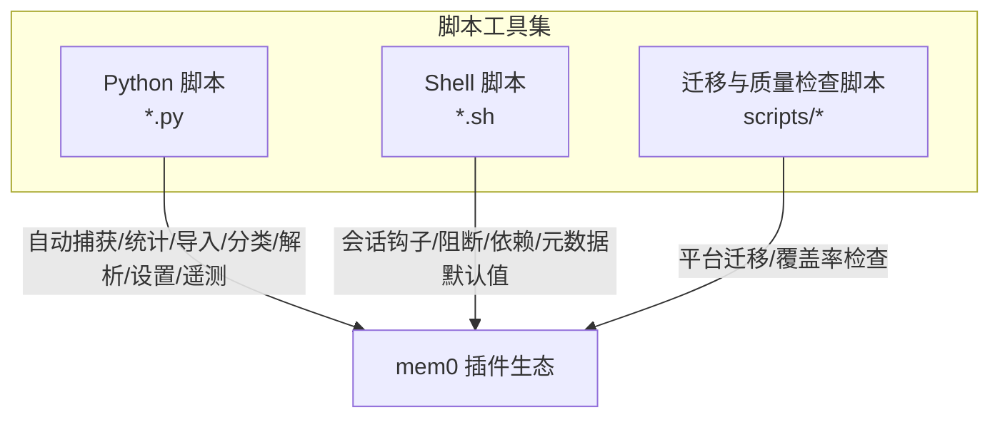
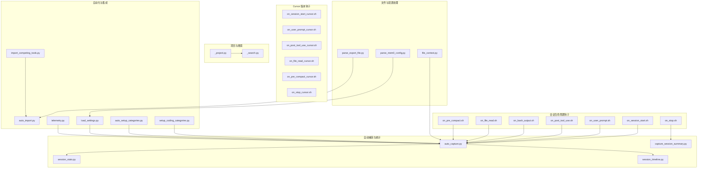
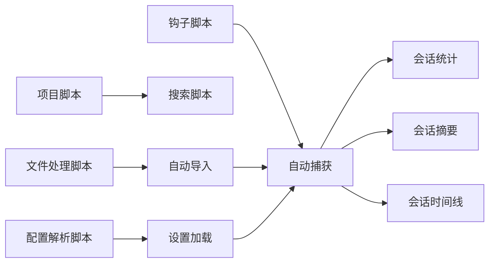

# 脚本工具集

<cite>
**本文档引用的文件**
- [auto_capture.py](file://integrations/mem0-plugin/scripts/auto_capture.py)
- [capture_session_summary.py](file://integrations/mem0-plugin/scripts/capture_session_summary.py)
- [session_stats.py](file://integrations/mem0-plugin/scripts/session_stats.py)
- [session_timeline.py](file://integrations/mem0-plugin/scripts/session_timeline.py)
- [auto_import.py](file://integrations/mem0-plugin/scripts/auto_import.py)
- [import_competing_tools.py](file://integrations/mem0-plugin/scripts/import_competing_tools.py)
- [setup_coding_categories.py](file://integrations/mem0-plugin/scripts/setup_coding_categories.py)
- [auto_setup_categories.py](file://integrations/mem0-plugin/scripts/auto_setup_categories.py)
- [file_context.py](file://integrations/mem0-plugin/scripts/file_context.py)
- [parse_export_file.py](file://integrations/mem0-plugin/scripts/parse_export_file.py)
- [parse_mem0_config.py](file://integrations/mem0-plugin/scripts/parse_mem0_config.py)
- [_project.py](file://integrations/mem0-plugin/scripts/_project.py)
- [_search.py](file://integrations/mem0-plugin/scripts/_search.py)
- [_chunking.py](file://integrations/mem0-plugin/scripts/_chunking.py)
- [_formatting.py](file://integrations/mem0-plugin/scripts/_formatting.py)
- [_identity.py](file://integrations/mem0-plugin/scripts/_identity.py)
- [_identity.sh](file://integrations/mem0-plugin/scripts/_identity.sh)
- [_project.sh](file://integrations/mem0-plugin/scripts/_project.sh)
- [on_session_start.sh](file://integrations/mem0-plugin/scripts/on_session_start.sh)
- [on_session_start_cursor.sh](file://integrations/mem0-plugin/scripts/on_session_start_cursor.sh)
- [on_bash_output.sh](file://integrations/mem0-plugin/scripts/on_bash_output.sh)
- [on_file_read.sh](file://integrations/mem0-plugin/scripts/on_file_read.sh)
- [on_file_read_cursor.sh](file://integrations/mem0-plugin/scripts/on_file_read_cursor.sh)
- [on_post_tool_use.sh](file://integrations/mem0-plugin/scripts/on_post_tool_use.sh)
- [on_post_tool_use_cursor.sh](file://integrations/mem0-plugin/scripts/on_post_tool_use_cursor.sh)
- [on_pre_compact.sh](file://integrations/mem0-plugin/scripts/on_pre_compact.sh)
- [on_pre_compact_cursor.sh](file://integrations/mem0-plugin/scripts/on_pre_compact_cursor.sh)
- [on_stop.sh](file://integrations/mem0-plugin/scripts/on_stop.sh)
- [on_stop_cursor.sh](file://integrations/mem0-plugin/scripts/on_stop_cursor.sh)
- [on_user_prompt.sh](file://integrations/mem0-plugin/scripts/on_user_prompt.sh)
- [on_user_prompt_cursor.sh](file://integrations/mem0-plugin/scripts/on_user_prompt_cursor.sh)
- [block_memory_write.sh](file://integrations/mem0-plugin/scripts/block_memory_write.sh)
- [block_memory_write_cursor.sh](file://integrations/mem0-plugin/scripts/block_memory_write_cursor.sh)
- [enforce_metadata_defaults.sh](file://integrations/mem0-plugin/scripts/enforce_metadata_defaults.sh)
- [ensure_deps.sh](file://integrations/mem0-plugin/scripts/ensure_deps.sh)
- [install_codex_hooks.py](file://integrations/mem0-plugin/scripts/install_codex_hooks.py)
- [load_settings.py](file://integrations/mem0-plugin/scripts/load_settings.py)
- [telemetry.py](file://integrations/mem0-plugin/scripts/telemetry.py)
- [oss-to-platform-migrate.sh](file://scripts/oss-to-platform-migrate.sh)
- [check-llms-txt-coverage.py](file://scripts/check-llms-txt-coverage.py)
- [llms-txt-ignore.txt](file://scripts/llms-txt-ignore.txt)
</cite>

## 目录
1. [简介](#简介)
2. [项目结构](#项目结构)
3. [核心组件](#核心组件)
4. [架构总览](#架构总览)
5. [详细组件分析](#详细组件分析)
6. [依赖关系分析](#依赖关系分析)
7. [性能考虑](#性能考虑)
8. [故障排除指南](#故障排除指南)
9. [结论](#结论)
10. [附录](#附录)

## 简介
本文件系统性梳理 mem0 项目中的脚本工具集，覆盖自动捕获、会话统计与时间线、项目管理、文件处理、集成钩子、配置解析、迁移脚本等模块。文档从功能定位、输入参数、执行逻辑、输出格式、安装配置、权限设置、运行环境到最佳实践与常见问题进行全链路说明，帮助使用者快速上手并稳定运维。

## 项目结构
脚本工具集主要位于以下位置：
- Python 脚本：integrations/mem0-plugin/scripts/*.py
- Shell 脚本：integrations/mem0-plugin/scripts/*.sh
- 迁移与质量检查脚本：scripts/*.sh, scripts/*.py

**图表来源**
- [auto_capture.py](file://integrations/mem0-plugin/scripts/auto_capture.py)
- [session_stats.py](file://integrations/mem0-plugin/scripts/session_stats.py)
- [on_session_start.sh](file://integrations/mem0-plugin/scripts/on_session_start.sh)
- [oss-to-platform-migrate.sh](file://scripts/oss-to-platform-migrate.sh)

**章节来源**
- [auto_capture.py](file://integrations/mem0-plugin/scripts/auto_capture.py)
- [session_stats.py](file://integrations/mem0-plugin/scripts/session_stats.py)
- [on_session_start.sh](file://integrations/mem0-plugin/scripts/on_session_start.sh)
- [oss-to-platform-migrate.sh](file://scripts/oss-to-platform-migrate.sh)

## 核心组件
- 自动捕获与会话摘要
  - 自动捕获：在用户交互或工具调用后，自动提取上下文并写入记忆存储。
  - 会话摘要：生成单次会话的总结，便于检索与回顾。
  - 会话统计：统计会话维度指标（如提示数、工具使用次数、耗时等）。
  - 会话时间线：按时间顺序整理会话事件，形成可读的时间线。
- 项目管理与搜索
  - 项目信息与搜索：封装项目维度的数据访问与查询。
- 文件处理与内容解析
  - 文件上下文：为文件读取场景注入上下文信息。
  - 导出文件解析：解析导出数据并转换为内部格式。
  - 配置解析：解析 mem0 配置文件，提取关键参数。
- 自动化与集成
  - 自动导入：在特定触发条件下自动导入外部数据。
  - 竞品工具导入：支持导入其他工具的兼容数据。
  - 编码分类初始化：为代码类工作流预设分类标签。
  - 分类自动设置：根据内容类型自动分配分类。
- 钩子与阻断
  - 会话生命周期钩子：开始、结束、用户提示、工具使用前后、Bash 输出、文件读取等。
  - 写入阻断：在 Cursor/Claude 等编辑器中临时阻止内存写入。
  - 元数据默认值强制：确保关键元数据字段存在且符合规范。
  - 依赖检查：确保运行所需依赖已安装。
- 设置加载与遥测
  - 设置加载：加载插件运行所需的全局设置。
  - 遥测：收集匿名使用数据以改进产品体验。
- 迁移与质量检查
  - OSS 到平台迁移：一键迁移旧版本配置与数据。
  - LLMs 文本覆盖率检查：验证 LLMs 列表是否被完整覆盖。

**章节来源**
- [auto_capture.py](file://integrations/mem0-plugin/scripts/auto_capture.py)
- [capture_session_summary.py](file://integrations/mem0-plugin/scripts/capture_session_summary.py)
- [session_stats.py](file://integrations/mem0-plugin/scripts/session_stats.py)
- [session_timeline.py](file://integrations/mem0-plugin/scripts/session_timeline.py)
- [_project.py](file://integrations/mem0-plugin/scripts/_project.py)
- [_search.py](file://integrations/mem0-plugin/scripts/_search.py)
- [file_context.py](file://integrations/mem0-plugin/scripts/file_context.py)
- [parse_export_file.py](file://integrations/mem0-plugin/scripts/parse_export_file.py)
- [parse_mem0_config.py](file://integrations/mem0-plugin/scripts/parse_mem0_config.py)
- [auto_import.py](file://integrations/mem0-plugin/scripts/auto_import.py)
- [import_competing_tools.py](file://integrations/mem0-plugin/scripts/import_competing_tools.py)
- [setup_coding_categories.py](file://integrations/mem0-plugin/scripts/setup_coding_categories.py)
- [auto_setup_categories.py](file://integrations/mem0-plugin/scripts/auto_setup_categories.py)
- [on_session_start.sh](file://integrations/mem0-plugin/scripts/on_session_start.sh)
- [on_bash_output.sh](file://integrations/mem0-plugin/scripts/on_bash_output.sh)
- [on_file_read.sh](file://integrations/mem0-plugin/scripts/on_file_read.sh)
- [on_post_tool_use.sh](file://integrations/mem0-plugin/scripts/on_post_tool_use.sh)
- [on_pre_compact.sh](file://integrations/mem0-plugin/scripts/on_pre_compact.sh)
- [on_stop.sh](file://integrations/mem0-plugin/scripts/on_stop.sh)
- [on_user_prompt.sh](file://integrations/mem0-plugin/scripts/on_user_prompt.sh)
- [block_memory_write.sh](file://integrations/mem0-plugin/scripts/block_memory_write.sh)
- [block_memory_write_cursor.sh](file://integrations/mem0-plugin/scripts/block_memory_write_cursor.sh)
- [enforce_metadata_defaults.sh](file://integrations/mem0-plugin/scripts/enforce_metadata_defaults.sh)
- [ensure_deps.sh](file://integrations/mem0-plugin/scripts/ensure_deps.sh)
- [load_settings.py](file://integrations/mem0-plugin/scripts/load_settings.py)
- [telemetry.py](file://integrations/mem0-plugin/scripts/telemetry.py)
- [oss-to-platform-migrate.sh](file://scripts/oss-to-platform-migrate.sh)
- [check-llms-txt-coverage.py](file://scripts/check-llms-txt-coverage.py)

## 架构总览
脚本工具集通过 Python 与 Shell 脚本协同工作，围绕“会话生命周期”和“项目维度”两大主线展开。Python 脚本负责复杂逻辑（解析、统计、导入、分类），Shell 脚本负责与编辑器/终端集成与钩子触发。

**图表来源**
- [on_session_start.sh](file://integrations/mem0-plugin/scripts/on_session_start.sh)
- [on_user_prompt.sh](file://integrations/mem0-plugin/scripts/on_user_prompt.sh)
- [on_post_tool_use.sh](file://integrations/mem0-plugin/scripts/on_post_tool_use.sh)
- [on_bash_output.sh](file://integrations/mem0-plugin/scripts/on_bash_output.sh)
- [on_file_read.sh](file://integrations/mem0-plugin/scripts/on_file_read.sh)
- [on_pre_compact.sh](file://integrations/mem0-plugin/scripts/on_pre_compact.sh)
- [on_stop.sh](file://integrations/mem0-plugin/scripts/on_stop.sh)
- [on_session_start_cursor.sh](file://integrations/mem0-plugin/scripts/on_session_start_cursor.sh)
- [on_user_prompt_cursor.sh](file://integrations/mem0-plugin/scripts/on_user_prompt_cursor.sh)
- [on_post_tool_use_cursor.sh](file://integrations/mem0-plugin/scripts/on_post_tool_use_cursor.sh)
- [on_file_read_cursor.sh](file://integrations/mem0-plugin/scripts/on_file_read_cursor.sh)
- [on_pre_compact_cursor.sh](file://integrations/mem0-plugin/scripts/on_pre_compact_cursor.sh)
- [on_stop_cursor.sh](file://integrations/mem0-plugin/scripts/on_stop_cursor.sh)
- [auto_capture.py](file://integrations/mem0-plugin/scripts/auto_capture.py)
- [capture_session_summary.py](file://integrations/mem0-plugin/scripts/capture_session_summary.py)
- [session_stats.py](file://integrations/mem0-plugin/scripts/session_stats.py)
- [session_timeline.py](file://integrations/mem0-plugin/scripts/session_timeline.py)
- [_project.py](file://integrations/mem0-plugin/scripts/_project.py)
- [_search.py](file://integrations/mem0-plugin/scripts/_search.py)
- [file_context.py](file://integrations/mem0-plugin/scripts/file_context.py)
- [parse_export_file.py](file://integrations/mem0-plugin/scripts/parse_export_file.py)
- [parse_mem0_config.py](file://integrations/mem0-plugin/scripts/parse_mem0_config.py)
- [auto_import.py](file://integrations/mem0-plugin/scripts/auto_import.py)
- [import_competing_tools.py](file://integrations/mem0-plugin/scripts/import_competing_tools.py)
- [setup_coding_categories.py](file://integrations/mem0-plugin/scripts/setup_coding_categories.py)
- [auto_setup_categories.py](file://integrations/mem0-plugin/scripts/auto_setup_categories.py)
- [load_settings.py](file://integrations/mem0-plugin/scripts/load_settings.py)
- [telemetry.py](file://integrations/mem0-plugin/scripts/telemetry.py)

## 详细组件分析

### 自动捕获（auto_capture.py）
- 功能概述：在用户提示、工具使用、Bash 输出、文件读取等事件发生后，自动抽取上下文并写入记忆存储。
- 输入参数：通常通过环境变量或标准输入传递事件上下文（如用户提示、工具名称、输出内容、文件路径等）。
- 执行逻辑：解析事件类型 → 提取上下文片段 → 应用分块策略 → 写入记忆存储。
- 输出格式：返回写入结果状态与记录标识。
- 最佳实践：确保事件上下文完整性；对敏感信息进行脱敏；合理设置分块大小与重叠率。
- 常见问题：上下文缺失导致记忆不完整；写入失败需重试与日志追踪。

**章节来源**
- [auto_capture.py](file://integrations/mem0-plugin/scripts/auto_capture.py)

### 会话摘要（capture_session_summary.py）
- 功能概述：基于一次会话的多轮对话与工具使用，生成简洁摘要，便于检索与回顾。
- 输入参数：会话 ID 或事件列表。
- 执行逻辑：聚合事件 → 选择关键片段 → 生成摘要 → 存储摘要记录。
- 输出格式：摘要文本与关联的记忆标识。
- 最佳实践：定期归档摘要；为摘要添加元数据（时间戳、项目、标签）。

**章节来源**
- [capture_session_summary.py](file://integrations/mem0-plugin/scripts/capture_session_summary.py)

### 会话统计（session_stats.py）
- 功能概述：统计会话内的关键指标，如提示条数、工具调用次数、平均响应时间等。
- 输入参数：会话事件集合。
- 执行逻辑：遍历事件 → 计算指标 → 生成统计报告。
- 输出格式：JSON/CSV 报告，包含各项指标与汇总。
- 最佳实践：按天/周/月聚合统计；结合时间线进行趋势分析。

**章节来源**
- [session_stats.py](file://integrations/mem0-plugin/scripts/session_stats.py)

### 会话时间线（session_timeline.py）
- 功能概述：将会话事件按时间顺序排列，形成可读的时间线视图。
- 输入参数：事件列表（含时间戳、类型、描述）。
- 执行逻辑：排序事件 → 格式化展示 → 生成时间线。
- 输出格式：文本/HTML 时间线。
- 最佳实践：保留原始事件元数据以便回溯。

**章节来源**
- [session_timeline.py](file://integrations/mem0-plugin/scripts/session_timeline.py)

### 项目管理与搜索（_project.py, _search.py）
- 功能概述：封装项目维度的数据访问与查询，支持按项目筛选与检索。
- 输入参数：项目标识、查询条件、过滤参数。
- 执行逻辑：构建查询 → 执行检索 → 返回结果。
- 输出格式：项目信息、匹配项列表。
- 最佳实践：为高频查询建立索引；限制返回数量防止超时。

**章节来源**
- [_project.py](file://integrations/mem0-plugin/scripts/_project.py)
- [_search.py](file://integrations/mem0-plugin/scripts/_search.py)

### 文件处理（file_context.py, parse_export_file.py, parse_mem0_config.py）
- 文件上下文（file_context.py）：在文件读取时注入上下文信息，提升记忆相关性。
- 导出文件解析（parse_export_file.py）：解析导出数据并转换为内部格式，供导入流程使用。
- 配置解析（parse_mem0_config.py）：解析 mem0 配置文件，提取嵌入、向量库、LLM 等关键参数。
- 输入参数：文件路径、配置路径、导出数据。
- 执行逻辑：读取文件 → 解析内容 → 标准化格式 → 输出中间结构。
- 输出格式：结构化数据对象或字典。
- 最佳实践：校验文件完整性；对异常格式进行容错处理。

**章节来源**
- [file_context.py](file://integrations/mem0-plugin/scripts/file_context.py)
- [parse_export_file.py](file://integrations/mem0-plugin/scripts/parse_export_file.py)
- [parse_mem0_config.py](file://integrations/mem0-plugin/scripts/parse_mem0_config.py)

### 自动化与集成（auto_import.py, import_competing_tools.py, setup_coding_categories.py, auto_setup_categories.py）
- 自动导入（auto_import.py）：在满足条件时自动导入外部数据。
- 竞品工具导入（import_competing_tools.py）：导入其他工具的兼容数据格式。
- 编码分类初始化（setup_coding_categories.py）：为代码类工作流预设分类标签。
- 分类自动设置（auto_setup_categories.py）：根据内容类型自动分配分类。
- 输入参数：触发条件、数据源、目标项目。
- 执行逻辑：检测触发条件 → 读取数据 → 归一化 → 写入记忆。
- 输出格式：导入结果与错误日志。
- 最佳实践：幂等性设计；批量导入时控制并发与速率。

**章节来源**
- [auto_import.py](file://integrations/mem0-plugin/scripts/auto_import.py)
- [import_competing_tools.py](file://integrations/mem0-plugin/scripts/import_competing_tools.py)
- [setup_coding_categories.py](file://integrations/mem0-plugin/scripts/setup_coding_categories.py)
- [auto_setup_categories.py](file://integrations/mem0-plugin/scripts/auto_setup_categories.py)

### 会话生命周期钩子（on_session_start.sh, on_user_prompt.sh, on_post_tool_use.sh, on_bash_output.sh, on_file_read.sh, on_pre_compact.sh, on_stop.sh）
- 功能概述：在会话关键节点触发，驱动自动捕获、统计与摘要生成。
- 输入参数：由宿主环境注入（如用户提示、工具输出、文件路径等）。
- 执行逻辑：读取环境变量 → 触发对应 Python 脚本 → 记录结果。
- 输出格式：标准输出/错误输出，以及日志文件。
- 最佳实践：确保钩子脚本可执行权限；在 CI/CD 中统一部署。

**章节来源**
- [on_session_start.sh](file://integrations/mem0-plugin/scripts/on_session_start.sh)
- [on_user_prompt.sh](file://integrations/mem0-plugin/scripts/on_user_prompt.sh)
- [on_post_tool_use.sh](file://integrations/mem0-plugin/scripts/on_post_tool_use.sh)
- [on_bash_output.sh](file://integrations/mem0-plugin/scripts/on_bash_output.sh)
- [on_file_read.sh](file://integrations/mem0-plugin/scripts/on_file_read.sh)
- [on_pre_compact.sh](file://integrations/mem0-plugin/scripts/on_pre_compact.sh)
- [on_stop.sh](file://integrations/mem0-plugin/scripts/on_stop.sh)

### Cursor 版本钩子（on_session_start_cursor.sh, on_user_prompt_cursor.sh, on_post_tool_use_cursor.sh, on_file_read_cursor.sh, on_pre_compact_cursor.sh, on_stop_cursor.sh）
- 功能概述：与 Cursor 编辑器集成的钩子版本，适配 Cursor 的事件模型。
- 输入参数：Cursor 注入的上下文。
- 执行逻辑：与通用钩子一致，但参数映射与事件触发时机略有差异。
- 输出格式：同上。
- 最佳实践：分别维护 Cursor 与通用版本，避免冲突。

**章节来源**
- [on_session_start_cursor.sh](file://integrations/mem0-plugin/scripts/on_session_start_cursor.sh)
- [on_user_prompt_cursor.sh](file://integrations/mem0-plugin/scripts/on_user_prompt_cursor.sh)
- [on_post_tool_use_cursor.sh](file://integrations/mem0-plugin/scripts/on_post_tool_use_cursor.sh)
- [on_file_read_cursor.sh](file://integrations/mem0-plugin/scripts/on_file_read_cursor.sh)
- [on_pre_compact_cursor.sh](file://integrations/mem0-plugin/scripts/on_pre_compact_cursor.sh)
- [on_stop_cursor.sh](file://integrations/mem0-plugin/scripts/on_stop_cursor.sh)

### 阻断与默认值（block_memory_write.sh, block_memory_write_cursor.sh, enforce_metadata_defaults.sh）
- 写入阻断：在特定场景下临时阻止内存写入，保障安全与一致性。
- 元数据默认值强制：确保关键元数据字段存在且符合规范。
- 输入参数：触发条件、项目标识、元数据模板。
- 执行逻辑：检查条件 → 应用阻断或补全默认值 → 记录操作日志。
- 输出格式：布尔结果与日志。
- 最佳实践：谨慎启用阻断；默认值应具备可审计性。

**章节来源**
- [block_memory_write.sh](file://integrations/mem0-plugin/scripts/block_memory_write.sh)
- [block_memory_write_cursor.sh](file://integrations/mem0-plugin/scripts/block_memory_write_cursor.sh)
- [enforce_metadata_defaults.sh](file://integrations/mem0-plugin/scripts/enforce_metadata_defaults.sh)

### 依赖与设置（ensure_deps.sh, load_settings.py, telemetry.py）
- 依赖检查：确保运行所需依赖已安装。
- 设置加载：加载插件运行所需的全局设置。
- 遥测：收集匿名使用数据以改进产品体验。
- 输入参数：依赖清单、配置路径、遥测开关。
- 执行逻辑：检测依赖 → 安装缺失依赖 → 加载设置 → 发送遥测。
- 输出格式：安装结果、设置对象、遥测发送状态。
- 最佳实践：在启动阶段集中执行依赖检查与设置加载。

**章节来源**
- [ensure_deps.sh](file://integrations/mem0-plugin/scripts/ensure_deps.sh)
- [load_settings.py](file://integrations/mem0-plugin/scripts/load_settings.py)
- [telemetry.py](file://integrations/mem0-plugin/scripts/telemetry.py)

### 迁移与质量检查（oss-to-platform-migrate.sh, check-llms-txt-coverage.py, llms-txt-ignore.txt）
- OSS 到平台迁移：一键迁移旧版本配置与数据。
- LLMs 文本覆盖率检查：验证 LLMs 列表是否被完整覆盖。
- 忽略列表：llms-txt-ignore.txt 指定忽略的条目。
- 输入参数：源目录、目标目录、配置文件路径、忽略列表路径。
- 执行逻辑：扫描源 → 过滤忽略项 → 转换格式 → 写入目标。
- 输出格式：迁移报告与覆盖率统计。
- 最佳实践：先备份再迁移；逐版本验证兼容性。

**章节来源**
- [oss-to-platform-migrate.sh](file://scripts/oss-to-platform-migrate.sh)
- [check-llms-txt-coverage.py](file://scripts/check-llms-txt-coverage.py)
- [llms-txt-ignore.txt](file://scripts/llms-txt-ignore.txt)

## 依赖关系分析
- 组件耦合：自动捕获是核心枢纽，被多个钩子脚本与统计脚本依赖；项目与搜索脚本为上层查询提供支撑；文件与配置解析为导入与初始化提供数据基础。
- 外部依赖：Shell 脚本依赖 Bash 环境与系统工具；Python 脚本依赖 Python 运行时与第三方库（通过 ensure_deps.sh 管理）。
- 潜在环路：当前设计为单向依赖（钩子→捕获→统计），未发现循环依赖。

**图表来源**
- [on_session_start.sh](file://integrations/mem0-plugin/scripts/on_session_start.sh)
- [auto_capture.py](file://integrations/mem0-plugin/scripts/auto_capture.py)
- [session_stats.py](file://integrations/mem0-plugin/scripts/session_stats.py)
- [capture_session_summary.py](file://integrations/mem0-plugin/scripts/capture_session_summary.py)
- [session_timeline.py](file://integrations/mem0-plugin/scripts/session_timeline.py)
- [_project.py](file://integrations/mem0-plugin/scripts/_project.py)
- [_search.py](file://integrations/mem0-plugin/scripts/_search.py)
- [file_context.py](file://integrations/mem0-plugin/scripts/file_context.py)
- [parse_export_file.py](file://integrations/mem0-plugin/scripts/parse_export_file.py)
- [parse_mem0_config.py](file://integrations/mem0-plugin/scripts/parse_mem0_config.py)
- [auto_import.py](file://integrations/mem0-plugin/scripts/auto_import.py)
- [load_settings.py](file://integrations/mem0-plugin/scripts/load_settings.py)

**章节来源**
- [on_session_start.sh](file://integrations/mem0-plugin/scripts/on_session_start.sh)
- [auto_capture.py](file://integrations/mem0-plugin/scripts/auto_capture.py)
- [session_stats.py](file://integrations/mem0-plugin/scripts/session_stats.py)
- [capture_session_summary.py](file://integrations/mem0-plugin/scripts/capture_session_summary.py)
- [session_timeline.py](file://integrations/mem0-plugin/scripts/session_timeline.py)
- [_project.py](file://integrations/mem0-plugin/scripts/_project.py)
- [_search.py](file://integrations/mem0-plugin/scripts/_search.py)
- [file_context.py](file://integrations/mem0-plugin/scripts/file_context.py)
- [parse_export_file.py](file://integrations/mem0-plugin/scripts/parse_export_file.py)
- [parse_mem0_config.py](file://integrations/mem0-plugin/scripts/parse_mem0_config.py)
- [auto_import.py](file://integrations/mem0-plugin/scripts/auto_import.py)
- [load_settings.py](file://integrations/mem0-plugin/scripts/load_settings.py)

## 性能考虑
- 批处理与限流：导入与统计建议采用批处理与速率限制，避免瞬时高负载。
- 分块策略：自动捕获的分块大小与重叠率直接影响检索质量与写入性能，需根据数据特征调优。
- 缓存与索引：对高频查询与项目维度数据建立缓存与索引，减少重复计算。
- 日志与监控：为关键脚本添加日志与指标上报，便于性能观测与问题定位。

## 故障排除指南
- 权限问题：确保 Shell 脚本具有可执行权限；在容器环境中以非 root 用户运行需赋予相应权限。
- 依赖缺失：使用 ensure_deps.sh 统一安装依赖；在 CI/CD 中预热镜像以减少首次安装开销。
- 上下文丢失：检查钩子脚本是否正确传递环境变量；必要时在上游增加日志打印。
- 导入失败：核对导出文件格式与 parse_export_file.py 的解析规则；查看错误日志定位具体行号。
- 遥测异常：确认网络连通性与遥测开关；必要时关闭遥测以排除干扰。
- 迁移中断：检查源与目标路径权限；使用增量迁移策略逐步推进。

**章节来源**
- [ensure_deps.sh](file://integrations/mem0-plugin/scripts/ensure_deps.sh)
- [parse_export_file.py](file://integrations/mem0-plugin/scripts/parse_export_file.py)
- [telemetry.py](file://integrations/mem0-plugin/scripts/telemetry.py)
- [oss-to-platform-migrate.sh](file://scripts/oss-to-platform-migrate.sh)

## 结论
脚本工具集围绕“会话生命周期”与“项目维度”构建，通过 Python 与 Shell 协同实现了从自动捕获、统计、摘要到导入、分类与钩子集成的完整闭环。遵循本文的最佳实践与排障指南，可在保证稳定性的同时最大化发挥工具集的效率与价值。

## 附录
- 安装与配置要点
  - Shell 脚本：确保可执行权限；在编辑器中正确注册钩子；在 CI/CD 中统一部署。
  - Python 脚本：通过 ensure_deps.sh 安装依赖；在虚拟环境中隔离运行。
  - 配置文件：使用 parse_mem0_config.py 解析配置；确保路径与权限正确。
- 运行环境要求
  - Bash 4+、Python 3.8+、必要的第三方库（通过 ensure_deps.sh 管理）。
- 常用命令参考
  - 启动会话：触发 on_session_start.sh → 自动捕获 → 统计与摘要。
  - 导入数据：触发 auto_import.py → parse_export_file.py → 写入记忆。
  - 迁移配置：执行 oss-to-platform-migrate.sh → 校验覆盖率。