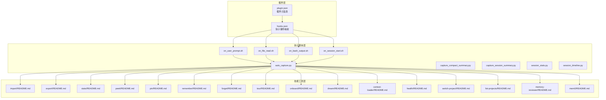
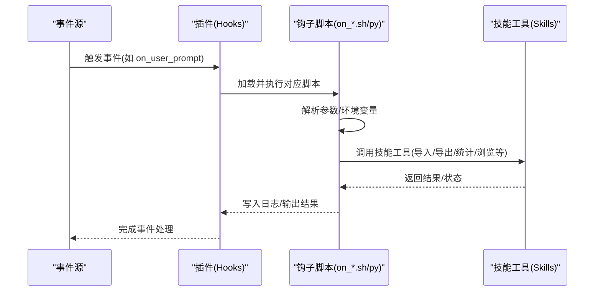
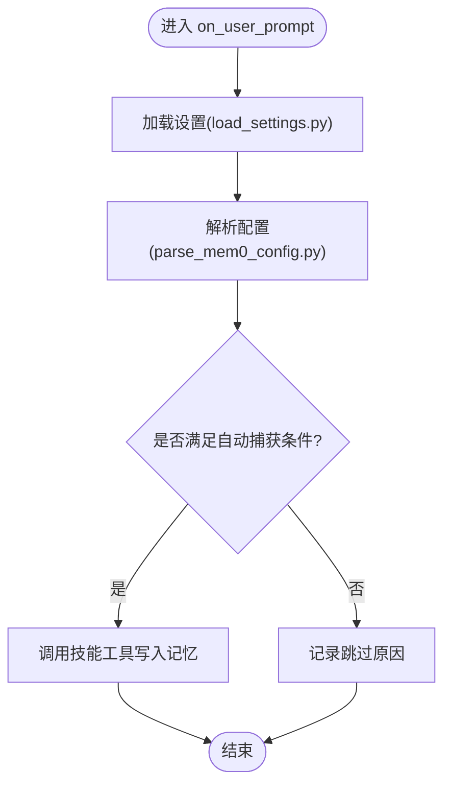
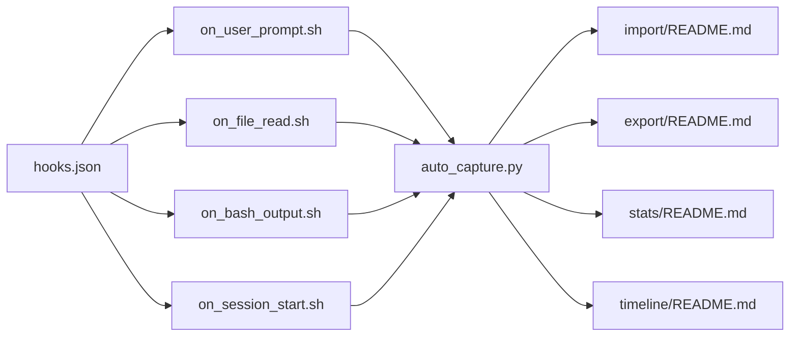

# 钩子系统

<cite>
**本文引用的文件**
- [integrations/mem0-plugin/scripts/on_user_prompt.sh](file://integrations/mem0-plugin/scripts/on_user_prompt.sh)
- [integrations/mem0-plugin/scripts/on_file_read.sh](file://integrations/mem0-plugin/scripts/on_file_read.sh)
- [integrations/mem0-plugin/scripts/on_bash_output.sh](file://integrations/mem0-plugin/scripts/on_bash_output.sh)
- [integrations/mem0-plugin/scripts/on_session_start.sh](file://integrations/mem0-plugin/scripts/on_session_start.sh)
- [integrations/mem0-plugin/scripts/auto_capture.py](file://integrations/mem0-plugin/scripts/auto_capture.py)
- [integrations/mem0-plugin/scripts/capture_compact_summary.py](file://integrations/mem0-plugin/scripts/capture_compact_summary.py)
- [integrations/mem0-plugin/scripts/capture_session_summary.py](file://integrations/mem0-plugin/scripts/capture_session_summary.py)
- [integrations/mem0-plugin/scripts/session_stats.py](file://integrations/mem0-plugin/scripts/session_stats.py)
- [integrations/mem0-plugin/scripts/session_timeline.py](file://integrations/mem0-plugin/scripts/session_timeline.py)
- [integrations/mem0-plugin/scripts/load_settings.py](file://integrations/mem0-plugin/scripts/load_settings.py)
- [integrations/mem0-plugin/scripts/parse_mem0_config.py](file://integrations/mem0-plugin/scripts/parse_mem0_config.py)
- [integrations/mem0-plugin/hooks.json](file://integrations/mem0-plugin/hooks.json)
- [integrations/mem0-plugin/plugin.json](file://integrations/mem0-plugin/plugin.json)
- [integrations/mem0-plugin/skills/mem0/memory-reviewer/README.md](file://integrations/mem0-plugin/skills/mem0/memory-reviewer/README.md)
- [integrations/mem0-plugin/skills/mem0/import/README.md](file://integrations/mem0-plugin/skills/mem0/import/README.md)
- [integrations/mem0-plugin/skills/mem0/export/README.md](file://integrations/mem0-plugin/skills/mem0/export/README.md)
- [integrations/mem0-plugin/skills/mem0/stats/README.md](file://integrations/mem0-plugin/skills/mem0/stats/README.md)
- [integrations/mem0-plugin/skills/mem0/list-projects/README.md](file://integrations/mem0-plugin/skills/mem0/list-projects/README.md)
- [integrations/mem0-plugin/skills/mem0/peek/README.md](file://integrations/mem0-plugin/skills/mem0/peek/README.md)
- [integrations/mem0-plugin/skills/mem0/pin/README.md](file://integrations/mem0-plugin/skills/mem0/pin/README.md)
- [integrations/mem0-plugin/skills/mem0/remember/README.md](file://integrations/mem0-plugin/skills/mem0/remember/README.md)
- [integrations/mem0-plugin/skills/mem0/forget/README.md](file://integrations/mem0-plugin/skills/mem0/forget/README.md)
- [integrations/mem0-plugin/skills/mem0/tour/README.md](file://integrations/mem0-plugin/skills/mem0/tour/README.md)
- [integrations/mem0-plugin/skills/mem0/onboard/README.md](file://integrations/mem0-plugin/skills/mem0/onboard/README.md)
- [integrations/mem0-plugin/skills/mem0/dream/README.md](file://integrations/mem0-plugin/skills/mem0/dream/README.md)
- [integrations/mem0-plugin/skills/mem0/context-loader/README.md](file://integrations/mem0-plugin/skills/mem0/context-loader/README.md)
- [integrations/mem0-plugin/skills/mem0/health/README.md](file://integrations/mem0-plugin/skills/mem0/health/README.md)
- [integrations/mem0-plugin/skills/mem0/switch-project/README.md](file://integrations/mem0-plugin/skills/mem0/switch-project/README.md)
- [integrations/mem0-plugin/skills/mem0/mem0/README.md](file://integrations/mem0-plugin/skills/mem0/mem0/README.md)
- [integrations/mem0-plugin/README.md](file://integrations/mem0-plugin/README.md)
- [integrations/openclaw/index.ts](file://integrations/openclaw/index.ts)
- [integrations/openclaw/isolation.ts](file://integrations/openclaw/isolation.ts)
- [examples/mem0-demo/app/api/chat/route.ts](file://examples/mem0-demo/app/api/chat/route.ts)
</cite>

## 目录
1. 引言
2. 项目结构
3. 核心组件
4. 架构总览
5. 详细组件分析
6. 依赖关系分析
7. 性能考虑
8. 故障排查指南
9. 结论
10. 附录

## 引言
本文件系统性阐述钩子（Hook）机制在项目中的工作原理与触发时机，覆盖用户提示、文件读取、Bash 输出、会话启动等钩子类型，并给出钩子脚本的编写规范、参数传递与返回值处理方式。同时提供配置方法、调试技巧与性能优化建议，并附上可直接参考的钩子脚本与使用场景。

## 项目结构
钩子系统主要由“插件定义”“钩子脚本集合”“技能（Skill）工具集”三部分组成：
- 插件定义：通过 JSON 声明钩子事件与脚本映射，以及插件元信息。
- 钩子脚本：以 Bash/Python 脚本形式实现具体行为，按事件类型分发执行。
- 技能工具：围绕记忆管理的常用操作（导入、导出、统计、浏览等），作为钩子触发后的动作载体。

图表来源
- [integrations/mem0-plugin/plugin.json](file://integrations/mem0-plugin/plugin.json)
- [integrations/mem0-plugin/hooks.json](file://integrations/mem0-plugin/hooks.json)
- [integrations/mem0-plugin/scripts/on_user_prompt.sh](file://integrations/mem0-plugin/scripts/on_user_prompt.sh)
- [integrations/mem0-plugin/scripts/on_file_read.sh](file://integrations/mem0-plugin/scripts/on_file_read.sh)
- [integrations/mem0-plugin/scripts/on_bash_output.sh](file://integrations/mem0-plugin/scripts/on_bash_output.sh)
- [integrations/mem0-plugin/scripts/on_session_start.sh](file://integrations/mem0-plugin/scripts/on_session_start.sh)
- [integrations/mem0-plugin/scripts/auto_capture.py](file://integrations/mem0-plugin/scripts/auto_capture.py)
- [integrations/mem0-plugin/skills/mem0/import/README.md](file://integrations/mem0-plugin/skills/mem0/import/README.md)
- [integrations/mem0-plugin/skills/mem0/export/README.md](file://integrations/mem0-plugin/skills/mem0/export/README.md)
- [integrations/mem0-plugin/skills/mem0/stats/README.md](file://integrations/mem0-plugin/skills/mem0/stats/README.md)
- [integrations/mem0-plugin/skills/mem0/peek/README.md](file://integrations/mem0-plugin/skills/mem0/peek/README.md)
- [integrations/mem0-plugin/skills/mem0/pin/README.md](file://integrations/mem0-plugin/skills/mem0/pin/README.md)
- [integrations/mem0-plugin/skills/mem0/remember/README.md](file://integrations/mem0-plugin/skills/mem0/remember/README.md)
- [integrations/mem0-plugin/skills/mem0/forget/README.md](file://integrations/mem0-plugin/skills/mem0/forget/README.md)
- [integrations/mem0-plugin/skills/mem0/tour/README.md](file://integrations/mem0-plugin/skills/mem0/tour/README.md)
- [integrations/mem0-plugin/skills/mem0/onboard/README.md](file://integrations/mem0-plugin/skills/mem0/onboard/README.md)
- [integrations/mem0-plugin/skills/mem0/dream/README.md](file://integrations/mem0-plugin/skills/mem0/dream/README.md)
- [integrations/mem0-plugin/skills/mem0/context-loader/README.md](file://integrations/mem0-plugin/skills/mem0/context-loader/README.md)
- [integrations/mem0-plugin/skills/mem0/health/README.md](file://integrations/mem0-plugin/skills/mem0/health/README.md)
- [integrations/mem0-plugin/skills/mem0/switch-project/README.md](file://integrations/mem0-plugin/skills/mem0/switch-project/README.md)
- [integrations/mem0-plugin/skills/mem0/list-projects/README.md](file://integrations/mem0-plugin/skills/mem0/list-projects/README.md)
- [integrations/mem0-plugin/skills/mem0/memory-reviewer/README.md](file://integrations/mem0-plugin/skills/mem0/memory-reviewer/README.md)
- [integrations/mem0-plugin/skills/mem0/mem0/README.md](file://integrations/mem0-plugin/skills/mem0/mem0/README.md)

章节来源
- [integrations/mem0-plugin/plugin.json](file://integrations/mem0-plugin/plugin.json)
- [integrations/mem0-plugin/hooks.json](file://integrations/mem0-plugin/hooks.json)

## 核心组件
- 钩子事件声明：通过 hooks.json 将“事件名”与“脚本路径”绑定，形成事件到处理器的映射。
- 钩子脚本：以 on_* 命名的脚本负责在特定生命周期节点执行业务逻辑，如 on_user_prompt、on_file_read、on_bash_output、on_session_start。
- 自动捕获与摘要：auto_capture.py 在合适时机自动写入记忆；capture_compact_summary.py 与 capture_session_summary.py 生成会话摘要；session_stats.py 与 session_timeline.py 提供统计与时间线能力。
- 设置加载与解析：load_settings.py 与 parse_mem0_config.py 负责从环境或配置中读取钩子运行所需的参数。
- 技能工具：import/export/stats/peek/pin/remember/forget/tour/onboard/dream/context-loader/health/switch-project/list-projects/memory-reviewer/mem0 等 README.md 定义了各技能的用途与调用方式，常作为钩子触发后的动作。

章节来源
- [integrations/mem0-plugin/scripts/on_user_prompt.sh](file://integrations/mem0-plugin/scripts/on_user_prompt.sh)
- [integrations/mem0-plugin/scripts/on_file_read.sh](file://integrations/mem0-plugin/scripts/on_file_read.sh)
- [integrations/mem0-plugin/scripts/on_bash_output.sh](file://integrations/mem0-plugin/scripts/on_bash_output.sh)
- [integrations/mem0-plugin/scripts/on_session_start.sh](file://integrations/mem0-plugin/scripts/on_session_start.sh)
- [integrations/mem0-plugin/scripts/auto_capture.py](file://integrations/mem0-plugin/scripts/auto_capture.py)
- [integrations/mem0-plugin/scripts/capture_compact_summary.py](file://integrations/mem0-plugin/scripts/capture_compact_summary.py)
- [integrations/mem0-plugin/scripts/capture_session_summary.py](file://integrations/mem0-plugin/scripts/capture_session_summary.py)
- [integrations/mem0-plugin/scripts/session_stats.py](file://integrations/mem0-plugin/scripts/session_stats.py)
- [integrations/mem0-plugin/scripts/session_timeline.py](file://integrations/mem0-plugin/scripts/session_timeline.py)
- [integrations/mem0-plugin/scripts/load_settings.py](file://integrations/mem0-plugin/scripts/load_settings.py)
- [integrations/mem0-plugin/scripts/parse_mem0_config.py](file://integrations/mem0-plugin/scripts/parse_mem0_config.py)
- [integrations/mem0-plugin/hooks.json](file://integrations/mem0-plugin/hooks.json)

## 架构总览
钩子系统采用“事件驱动 + 脚本执行”的架构。插件通过 hooks.json 声明事件与脚本映射；运行时根据事件类型定位对应脚本并传入上下文参数；脚本内部可调用技能工具完成记忆写入、检索、统计等操作。

图表来源
- [integrations/mem0-plugin/hooks.json](file://integrations/mem0-plugin/hooks.json)
- [integrations/mem0-plugin/scripts/on_user_prompt.sh](file://integrations/mem0-plugin/scripts/on_user_prompt.sh)
- [integrations/mem0-plugin/skills/mem0/import/README.md](file://integrations/mem0-plugin/skills/mem0/import/README.md)

## 详细组件分析

### 事件与脚本映射
- hooks.json 中定义了事件名与脚本路径的映射关系，确保事件发生时能准确找到并执行相应脚本。
- plugin.json 提供插件元信息，包括名称、版本、入口等，用于插件注册与发现。

章节来源
- [integrations/mem0-plugin/hooks.json](file://integrations/mem0-plugin/hooks.json)
- [integrations/mem0-plugin/plugin.json](file://integrations/mem0-plugin/plugin.json)

### on_user_prompt 钩子
- 触发时机：当用户输入提示即将进入推理流程前。
- 功能要点：可在此阶段进行预处理（如清洗、过滤）、注入上下文、触发自动捕获等。
- 典型流程：读取设置 → 解析配置 → 判断是否需要自动捕获 → 调用技能工具写入记忆 → 记录日志。

图表来源
- [integrations/mem0-plugin/scripts/on_user_prompt.sh](file://integrations/mem0-plugin/scripts/on_user_prompt.sh)
- [integrations/mem0-plugin/scripts/load_settings.py](file://integrations/mem0-plugin/scripts/load_settings.py)
- [integrations/mem0-plugin/scripts/parse_mem0_config.py](file://integrations/mem0-plugin/scripts/parse_mem0_config.py)
- [integrations/mem0-plugin/scripts/auto_capture.py](file://integrations/mem0-plugin/scripts/auto_capture.py)

章节来源
- [integrations/mem0-plugin/scripts/on_user_prompt.sh](file://integrations/mem0-plugin/scripts/on_user_prompt.sh)
- [integrations/mem0-plugin/scripts/load_settings.py](file://integrations/mem0-plugin/scripts/load_settings.py)
- [integrations/mem0-plugin/scripts/parse_mem0_config.py](file://integrations/mem0-plugin/scripts/parse_mem0_config.py)
- [integrations/mem0-plugin/scripts/auto_capture.py](file://integrations/mem0-plugin/scripts/auto_capture.py)

### on_file_read 钩子
- 触发时机：当系统读取文件内容时。
- 功能要点：可用于记录文件访问、提取上下文、触发自动导入等。
- 典型流程：读取文件 → 提取上下文 → 自动导入到记忆 → 统计与时间线更新。

章节来源
- [integrations/mem0-plugin/scripts/on_file_read.sh](file://integrations/mem0-plugin/scripts/on_file_read.sh)
- [integrations/mem0-plugin/scripts/auto_capture.py](file://integrations/mem0-plugin/scripts/auto_capture.py)
- [integrations/mem0-plugin/scripts/session_stats.py](file://integrations/mem0-plugin/scripts/session_stats.py)
- [integrations/mem0-plugin/scripts/session_timeline.py](file://integrations/mem0-plugin/scripts/session_timeline.py)

### on_bash_output 钩子
- 触发时机：当 Bash 执行产生输出时。
- 功能要点：可用于记录命令行交互、提取关键信息、触发自动捕获。
- 典型流程：接收输出 → 过滤/解析 → 写入记忆 → 汇总统计。

章节来源
- [integrations/mem0-plugin/scripts/on_bash_output.sh](file://integrations/mem0-plugin/scripts/on_bash_output.sh)
- [integrations/mem0-plugin/scripts/auto_capture.py](file://integrations/mem0-plugin/scripts/auto_capture.py)
- [integrations/mem0-plugin/scripts/session_stats.py](file://integrations/mem0-plugin/scripts/session_stats.py)

### on_session_start 钩子
- 触发时机：新会话开始时。
- 功能要点：初始化会话上下文、加载默认设置、生成会话摘要。
- 典型流程：初始化 → 加载设置 → 生成摘要 → 记录时间线。

章节来源
- [integrations/mem0-plugin/scripts/on_session_start.sh](file://integrations/mem0-plugin/scripts/on_session_start.sh)
- [integrations/mem0-plugin/scripts/capture_session_summary.py](file://integrations/mem0-plugin/scripts/capture_session_summary.py)
- [integrations/mem0-plugin/scripts/session_timeline.py](file://integrations/mem0-plugin/scripts/session_timeline.py)

### 自动捕获与摘要
- auto_capture.py：在合适的时机自动将上下文写入记忆，避免重复捕获与非交互式会话污染。
- capture_compact_summary.py：生成紧凑型会话摘要，便于快速回顾。
- capture_session_summary.py：生成完整会话摘要，包含更丰富的上下文。
- session_stats.py：计算会话统计指标（如记忆条数、工具使用次数等）。
- session_timeline.py：生成会话时间线，帮助回溯事件顺序。

章节来源
- [integrations/mem0-plugin/scripts/auto_capture.py](file://integrations/mem0-plugin/scripts/auto_capture.py)
- [integrations/mem0-plugin/scripts/capture_compact_summary.py](file://integrations/mem0-plugin/scripts/capture_compact_summary.py)
- [integrations/mem0-plugin/scripts/capture_session_summary.py](file://integrations/mem0-plugin/scripts/capture_session_summary.py)
- [integrations/mem0-plugin/scripts/session_stats.py](file://integrations/mem0-plugin/scripts/session_stats.py)
- [integrations/mem0-plugin/scripts/session_timeline.py](file://integrations/mem0-plugin/scripts/session_timeline.py)

### 技能工具概览
- 导入/导出/统计/浏览/置顶/记住/忘记/导览/入门/梦境/上下文加载/健康/切换项目/列出项目/记忆审核/核心记忆：每个技能由独立 README 描述其功能与调用方式，常作为钩子触发后的动作载体。

章节来源
- [integrations/mem0-plugin/skills/mem0/import/README.md](file://integrations/mem0-plugin/skills/mem0/import/README.md)
- [integrations/mem0-plugin/skills/mem0/export/README.md](file://integrations/mem0-plugin/skills/mem0/export/README.md)
- [integrations/mem0-plugin/skills/mem0/stats/README.md](file://integrations/mem0-plugin/skills/mem0/stats/README.md)
- [integrations/mem0-plugin/skills/mem0/peek/README.md](file://integrations/mem0-plugin/skills/mem0/peek/README.md)
- [integrations/mem0-plugin/skills/mem0/pin/README.md](file://integrations/mem0-plugin/skills/mem0/pin/README.md)
- [integrations/mem0-plugin/skills/mem0/remember/README.md](file://integrations/mem0-plugin/skills/mem0/remember/README.md)
- [integrations/mem0-plugin/skills/mem0/forget/README.md](file://integrations/mem0-plugin/skills/mem0/forget/README.md)
- [integrations/mem0-plugin/skills/mem0/tour/README.md](file://integrations/mem0-plugin/skills/mem0/tour/README.md)
- [integrations/mem0-plugin/skills/mem0/onboard/README.md](file://integrations/mem0-plugin/skills/mem0/onboard/README.md)
- [integrations/mem0-plugin/skills/mem0/dream/README.md](file://integrations/mem0-plugin/skills/mem0/dream/README.md)
- [integrations/mem0-plugin/skills/mem0/context-loader/README.md](file://integrations/mem0-plugin/skills/mem0/context-loader/README.md)
- [integrations/mem0-plugin/skills/mem0/health/README.md](file://integrations/mem0-plugin/skills/mem0/health/README.md)
- [integrations/mem0-plugin/skills/mem0/switch-project/README.md](file://integrations/mem0-plugin/skills/mem0/switch-project/README.md)
- [integrations/mem0-plugin/skills/mem0/list-projects/README.md](file://integrations/mem0-plugin/skills/mem0/list-projects/README.md)
- [integrations/mem0-plugin/skills/mem0/memory-reviewer/README.md](file://integrations/mem0-plugin/skills/mem0/memory-reviewer/README.md)
- [integrations/mem0-plugin/skills/mem0/mem0/README.md](file://integrations/mem0-plugin/skills/mem0/mem0/README.md)

## 依赖关系分析
- 事件到脚本：hooks.json 明确事件与脚本的依赖关系。
- 脚本到工具：钩子脚本通过调用技能工具实现具体功能。
- 工具到数据：技能工具依赖底层存储与检索接口，最终落盘到向量库或数据库。

图表来源
- [integrations/mem0-plugin/hooks.json](file://integrations/mem0-plugin/hooks.json)
- [integrations/mem0-plugin/scripts/on_user_prompt.sh](file://integrations/mem0-plugin/scripts/on_user_prompt.sh)
- [integrations/mem0-plugin/scripts/on_file_read.sh](file://integrations/mem0-plugin/scripts/on_file_read.sh)
- [integrations/mem0-plugin/scripts/on_bash_output.sh](file://integrations/mem0-plugin/scripts/on_bash_output.sh)
- [integrations/mem0-plugin/scripts/on_session_start.sh](file://integrations/mem0-plugin/scripts/on_session_start.sh)
- [integrations/mem0-plugin/scripts/auto_capture.py](file://integrations/mem0-plugin/scripts/auto_capture.py)
- [integrations/mem0-plugin/skills/mem0/import/README.md](file://integrations/mem0-plugin/skills/mem0/import/README.md)
- [integrations/mem0-plugin/skills/mem0/export/README.md](file://integrations/mem0-plugin/skills/mem0/export/README.md)
- [integrations/mem0-plugin/skills/mem0/stats/README.md](file://integrations/mem0-plugin/skills/mem0/stats/README.md)
- [integrations/mem0-plugin/skills/mem0/peek/README.md](file://integrations/mem0-plugin/skills/mem0/peek/README.md)

## 性能考虑
- 避免非交互式会话的钩子执行：对 cron/heartbeat/automation 等触发器进行过滤，减少无效 IO。
- 减少重复捕获：在单次会话内避免多次写入相同内容，优先增量更新。
- 异步与批处理：将耗时操作（如统计、时间线生成）设计为异步或批处理，降低主流程阻塞。
- 缓存与索引：对频繁查询的上下文进行缓存，减少重复解析与检索成本。
- 资源隔离：多代理或多会话场景下，按会话键隔离用户命名空间，避免跨会话干扰。

章节来源
- [integrations/openclaw/isolation.ts](file://integrations/openclaw/isolation.ts)
- [integrations/mem0-plugin/scripts/auto_capture.py](file://integrations/mem0-plugin/scripts/auto_capture.py)

## 故障排查指南
- 参数校验失败：检查 load_settings.py 与 parse_mem0_config.py 的输入参数是否正确。
- 事件未触发：确认 hooks.json 中事件名与脚本路径匹配，且插件已正确注册。
- 自动捕获异常：查看 auto_capture.py 的日志与返回值，确认是否被过滤（如非交互式会话）。
- 技能工具报错：逐项核对技能 README 中的前置条件与参数格式。
- 性能问题：关注 session_stats.py 与 session_timeline.py 的输出频率，必要时开启采样或降频。

章节来源
- [integrations/mem0-plugin/scripts/load_settings.py](file://integrations/mem0-plugin/scripts/load_settings.py)
- [integrations/mem0-plugin/scripts/parse_mem0_config.py](file://integrations/mem0-plugin/scripts/parse_mem0_config.py)
- [integrations/mem0-plugin/scripts/auto_capture.py](file://integrations/mem0-plugin/scripts/auto_capture.py)
- [integrations/mem0-plugin/skills/mem0/import/README.md](file://integrations/mem0-plugin/skills/mem0/import/README.md)
- [integrations/mem0-plugin/skills/mem0/export/README.md](file://integrations/mem0-plugin/skills/mem0/export/README.md)
- [integrations/mem0-plugin/skills/mem0/stats/README.md](file://integrations/mem0-plugin/skills/mem0/stats/README.md)
- [integrations/mem0-plugin/skills/mem0/peek/README.md](file://integrations/mem0-plugin/skills/mem0/peek/README.md)

## 结论
钩子系统通过清晰的事件-脚本映射与可复用的技能工具，实现了对用户提示、文件读取、Bash 输出、会话启动等关键节点的灵活扩展。配合自动捕获、摘要生成与统计分析，能够有效提升记忆系统的自动化水平与可观测性。建议在生产环境中结合过滤策略与性能优化手段，确保钩子执行的稳定性与高效性。

## 附录

### 钩子脚本编写规范
- 文件命名：统一使用 on_* 命名，便于 hooks.json 映射与识别。
- 参数传递：遵循 hooks.json 中的约定，确保事件上下文与环境变量可用。
- 返回值处理：脚本应明确返回码与日志输出，便于上层监控与告警。
- 错误处理：对异常情况记录详细日志，避免中断主流程。
- 幂等性：尽量保证重复执行不会产生副作用，支持重试与回放。

章节来源
- [integrations/mem0-plugin/hooks.json](file://integrations/mem0-plugin/hooks.json)
- [integrations/mem0-plugin/scripts/on_user_prompt.sh](file://integrations/mem0-plugin/scripts/on_user_prompt.sh)
- [integrations/mem0-plugin/scripts/on_file_read.sh](file://integrations/mem0-plugin/scripts/on_file_read.sh)
- [integrations/mem0-plugin/scripts/on_bash_output.sh](file://integrations/mem0-plugin/scripts/on_bash_output.sh)
- [integrations/mem0-plugin/scripts/on_session_start.sh](file://integrations/mem0-plugin/scripts/on_session_start.sh)

### 配置方法
- 插件注册：确保 plugin.json 正确声明插件元信息，以便被平台识别。
- 事件映射：在 hooks.json 中将事件名与脚本路径一一对应。
- 环境变量：通过 load_settings.py 与 parse_mem0_config.py 读取运行时配置。
- 技能启用：在需要的场景下启用相应技能 README 中描述的动作。

章节来源
- [integrations/mem0-plugin/plugin.json](file://integrations/mem0-plugin/plugin.json)
- [integrations/mem0-plugin/hooks.json](file://integrations/mem0-plugin/hooks.json)
- [integrations/mem0-plugin/scripts/load_settings.py](file://integrations/mem0-plugin/scripts/load_settings.py)
- [integrations/mem0-plugin/scripts/parse_mem0_config.py](file://integrations/mem0-plugin/scripts/parse_mem0_config.py)

### 调试技巧
- 日志分级：区分 info/warn/error，便于快速定位问题。
- 关键点断点：在自动捕获前后插入日志，观察数据变化。
- 回放测试：对非交互式会话进行模拟回放，验证过滤逻辑。
- 性能剖析：对耗时函数（如统计、时间线生成）进行采样分析。

章节来源
- [integrations/mem0-plugin/scripts/auto_capture.py](file://integrations/mem0-plugin/scripts/auto_capture.py)
- [integrations/mem0-plugin/scripts/session_stats.py](file://integrations/mem0-plugin/scripts/session_stats.py)
- [integrations/mem0-plugin/scripts/session_timeline.py](file://integrations/mem0-plugin/scripts/session_timeline.py)

### 实际使用场景
- 用户提示增强：在 on_user_prompt 中注入上下文或触发自动捕获，提升回答质量。
- 文件读取审计：在 on_file_read 中记录访问轨迹并自动导入相关记忆。
- 命令行交互追踪：在 on_bash_output 中提取关键信息并写入记忆，便于后续检索。
- 会话生命周期管理：在 on_session_start 中初始化上下文与摘要，建立完整的会话档案。

章节来源
- [integrations/mem0-plugin/scripts/on_user_prompt.sh](file://integrations/mem0-plugin/scripts/on_user_prompt.sh)
- [integrations/mem0-plugin/scripts/on_file_read.sh](file://integrations/mem0-plugin/scripts/on_file_read.sh)
- [integrations/mem0-plugin/scripts/on_bash_output.sh](file://integrations/mem0-plugin/scripts/on_bash_output.sh)
- [integrations/mem0-plugin/scripts/on_session_start.sh](file://integrations/mem0-plugin/scripts/on_session_start.sh)
- [examples/mem0-demo/app/api/chat/route.ts](file://examples/mem0-demo/app/api/chat/route.ts)