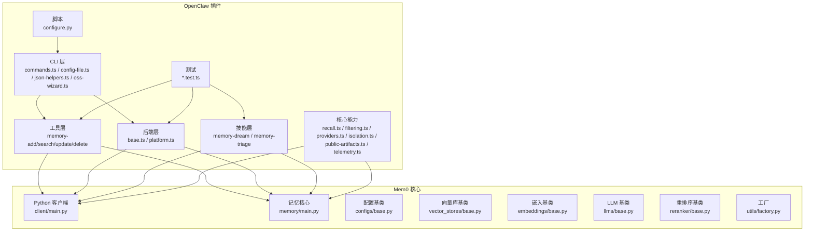
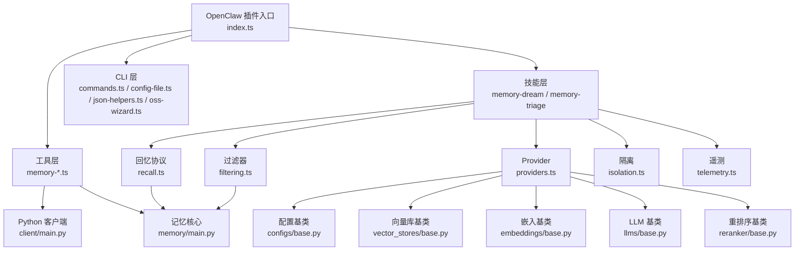
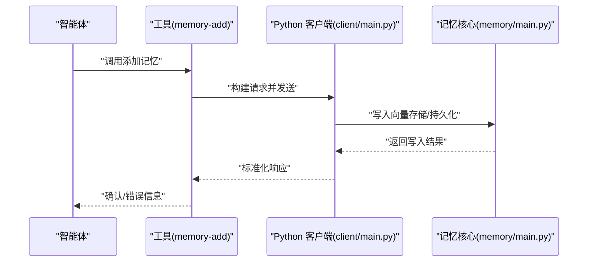
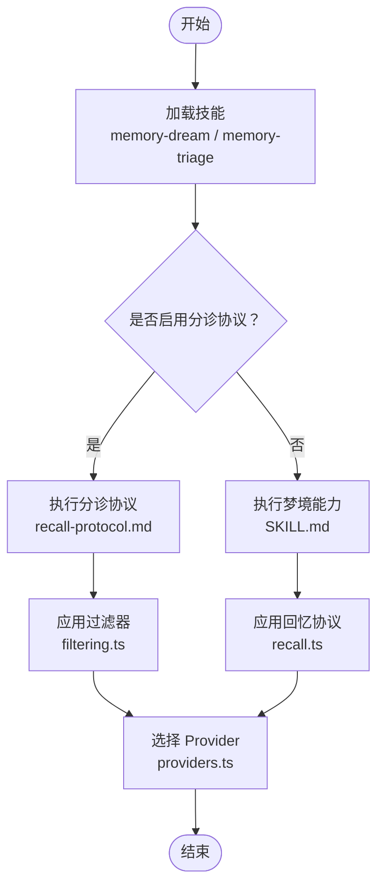
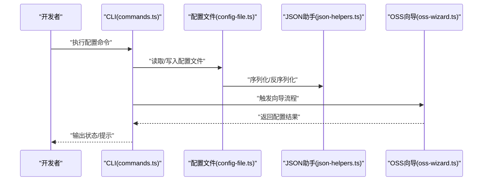
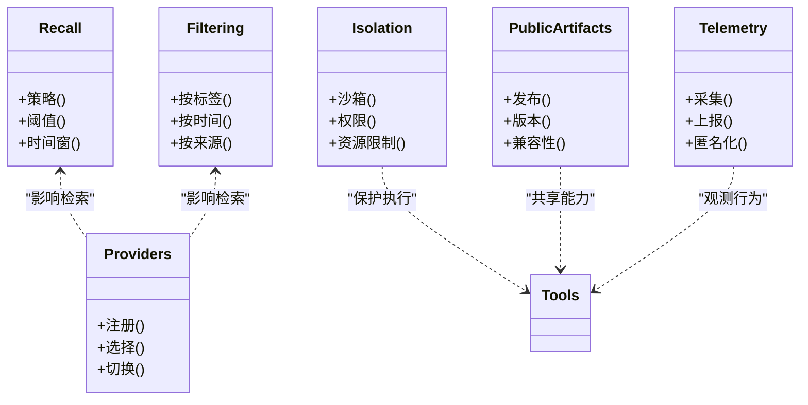
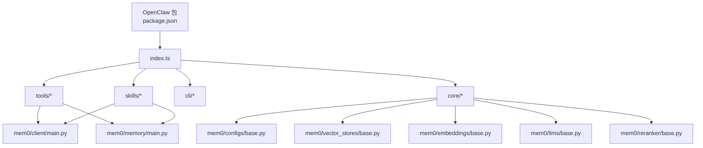

# OpenClaw 集成

<cite>
**本文档引用的文件**
- [integrations/openclaw/README.md](file://integrations/openclaw/README.md)
- [integrations/openclaw/package.json](file://integrations/openclaw/package.json)
- [integrations/openclaw/index.ts](file://integrations/openclaw/index.ts)
- [integrations/openclaw/config.ts](file://integrations/openclaw/config.ts)
- [integrations/openclaw/tools/memory-add.ts](file://integrations/openclaw/tools/memory-add.ts)
- [integrations/openclaw/tools/memory-search.ts](file://integrations/openclaw/tools/memory-search.ts)
- [integrations/openclaw/tools/memory-update.ts](file://integrations/openclaw/tools/memory-update.ts)
- [integrations/openclaw/tools/memory-delete.ts](file://integrations/openclaw/tools/memory-delete.ts)
- [integrations/openclaw/backend/base.ts](file://integrations/openclaw/backend/base.ts)
- [integrations/openclaw/backend/platform.ts](file://integrations/openclaw/backend/platform.ts)
- [integrations/openclaw/skills/memory-dream/SKILL.md](file://integrations/openclaw/skills/memory-dream/SKILL.md)
- [integrations/openclaw/skills/memory-triage/SKILL.md](file://integrations/openclaw/skills/memory-triage/SKILL.md)
- [integrations/openclaw/skills/memory-triage/recall-protocol.md](file://integrations/openclaw/skills/memory-triage/recall-protocol.md)
- [integrations/openclaw/cli/commands.ts](file://integrations/openclaw/cli/commands.ts)
- [integrations/openclaw/cli/config-file.ts](file://integrations/openclaw/cli/config-file.ts)
- [integrations/openclaw/cli/json-helpers.ts](file://integrations/openclaw/cli/json-helpers.ts)
- [integrations/openclaw/cli/oss-wizard.ts](file://integrations/openclaw/cli/oss-wizard.ts)
- [integrations/openclaw/dream-gate.ts](file://integrations/openclaw/dream-gate.ts)
- [integrations/openclaw/recall.ts](file://integrations/openclaw/recall.ts)
- [integrations/openclaw/filtering.ts](file://integrations/openclaw/filtering.ts)
- [integrations/openclaw/providers.ts](file://integrations/openclaw/providers.ts)
- [integrations/openclaw/isolation.ts](file://integrations/openclaw/isolation.ts)
- [integrations/openclaw/public-artifacts.ts](file://integrations/openclaw/public-artifacts.ts)
- [integrations/openclaw/telemetry.ts](file://integrations/openclaw/telemetry.ts)
- [integrations/openclaw/tsconfig.json](file://integrations/openclaw/tsconfig.json)
- [integrations/openclaw/tsup.config.ts](file://integrations/openclaw/tsup.config.ts)
- [integrations/openclaw/types.ts](file://integrations/openclaw/types.ts)
- [integrations/openclaw/vitest.config.ts](file://integrations/openclaw/vitest.config.ts)
- [integrations/openclaw/scripts/configure.py](file://integrations/openclaw/scripts/configure.py)
- [integrations/openclaw/test-shims/plugin-entry.ts](file://integrations/openclaw/test-shims/plugin-entry.ts)
- [integrations/openclaw/test-shims/plugin-sdk.ts](file://integrations/openclaw/test-shims/plugin-sdk.ts)
- [integrations/openclaw/tests/backend-platform.test.ts](file://integrations/openclaw/tests/backend-platform.test.ts)
- [integrations/openclaw/tests/cli-commands.test.ts](file://integrations/openclaw/tests/cli-commands.test.ts)
- [integrations/openclaw/tests/config-file.test.ts](file://integrations/openclaw/tests/config-file.test.ts)
- [integrations/openclaw/tests/config.test.ts](file://integrations/openclaw/tests/config.test.ts)
- [integrations/openclaw/tests/dream-gate.test.ts](file://integrations/openclaw/tests/dream-gate.test.ts)
- [integrations/openclaw/tests/filtering.test.ts](file://integrations/openclaw/tests/filtering.test.ts)
- [integrations/openclaw/tests/fs-safe.test.ts](file://integrations/openclaw/tests/fs-safe.test.ts)
- [integrations/openclaw/tests/json-helpers.test.ts](file://integrations/openclaw/tests/json-helpers.test.ts)
- [integrations/openclaw/tests/oss-wizard.test.ts](file://integrations/openclaw/tests/oss-wizard.test.ts)
- [integrations/openclaw/tests/providers.test.ts](file://integrations/openclaw/tests/providers.test.ts)
- [integrations/openclaw/tests/telemetry.test.ts](file://integrations/openclaw/tests/telemetry.test.ts)
- [integrations/openclaw/tests/tools.test.ts](file://integrations/openclaw/tests/tools.test.ts)
- [mem0/memory/main.py](file://mem0/memory/main.py)
- [mem0/client/main.py](file://mem0/client/main.py)
- [mem0/configs/base.py](file://mem0/configs/base.py)
- [mem0/vector_stores/base.py](file://mem0/vector_stores/base.py)
- [mem0/embeddings/base.py](file://mem0/embeddings/base.py)
- [mem0/llms/base.py](file://mem0/llms/base.py)
- [mem0/reranker/base.py](file://mem0/reranker/base.py)
- [mem0/utils/factory.py](file://mem0/utils/factory.py)
- [docs/integrations/openclaw.mdx](file://docs/integrations/openclaw.mdx)
- [docs/cookbooks/frameworks/llamaindex-multiagent.mdx](file://docs/cookbooks/frameworks/llamaindex-multiagent.mdx)
- [examples/nemoclaw/quickstart.md](file://examples/nemoclaw/quickstart.md)
- [examples/nemoclaw/install-mem0-plugin.sh](file://examples/nemoclaw/install-mem0-plugin.sh)
- [examples/nemoclaw/setup-mem0-nemoclaw.sh](file://examples/nemoclaw/setup-mem0-nemoclaw.sh)
</cite>

## 目录
1. [简介](#简介)
2. [项目结构](#项目结构)
3. [核心组件](#核心组件)
4. [架构总览](#架构总览)
5. [详细组件分析](#详细组件分析)
6. [依赖关系分析](#依赖关系分析)
7. [性能考虑](#性能考虑)
8. [故障排除指南](#故障排除指南)
9. [结论](#结论)
10. [附录](#附录)

## 简介
本指南面向希望在 OpenClaw 智能体框架中集成 Mem0 记忆能力的开发者。OpenClaw 插件通过工具（Tools）和技能（Skills）两种方式与 Mem0 对接，实现记忆的添加、搜索、更新与删除，并提供回忆协议（Recall Protocol）、过滤器（Filtering）与遥测（Telemetry）等增强能力。文档同时涵盖配置、CLI 使用、测试方法以及常见问题排查。

## 项目结构
OpenClaw 集成位于 integrations/openclaw 目录，主要由以下模块组成：
- 工具层：memory-add、memory-search、memory-update、memory-delete 等具体工具
- 后端层：基础平台与平台适配
- 技能层：记忆梦境（Dream）与记忆分诊（Triage）两类技能
- CLI 层：命令定义、配置文件处理、JSON 辅助与 OSS 向导
- 核心能力：回忆协议、过滤器、Provider、隔离与公共制品
- 测试与脚手架：单元测试、测试桩与配置脚本

**图表来源**
- [integrations/openclaw/index.ts](file://integrations/openclaw/index.ts)
- [integrations/openclaw/tools/memory-add.ts](file://integrations/openclaw/tools/memory-add.ts)
- [integrations/openclaw/backend/base.ts](file://integrations/openclaw/backend/base.ts)
- [integrations/openclaw/backend/platform.ts](file://integrations/openclaw/backend/platform.ts)
- [integrations/openclaw/skills/memory-dream/SKILL.md](file://integrations/openclaw/skills/memory-dream/SKILL.md)
- [integrations/openclaw/skills/memory-triage/SKILL.md](file://integrations/openclaw/skills/memory-triage/SKILL.md)
- [integrations/openclaw/cli/commands.ts](file://integrations/openclaw/cli/commands.ts)
- [integrations/openclaw/recall.ts](file://integrations/openclaw/recall.ts)
- [integrations/openclaw/filtering.ts](file://integrations/openclaw/filtering.ts)
- [integrations/openclaw/providers.ts](file://integrations/openclaw/providers.ts)
- [integrations/openclaw/isolation.ts](file://integrations/openclaw/isolation.ts)
- [integrations/openclaw/public-artifacts.ts](file://integrations/openclaw/public-artifacts.ts)
- [integrations/openclaw/telemetry.ts](file://integrations/openclaw/telemetry.ts)
- [mem0/client/main.py](file://mem0/client/main.py)
- [mem0/memory/main.py](file://mem0/memory/main.py)
- [mem0/configs/base.py](file://mem0/configs/base.py)
- [mem0/vector_stores/base.py](file://mem0/vector_stores/base.py)
- [mem0/embeddings/base.py](file://mem0/embeddings/base.py)
- [mem0/llms/base.py](file://mem0/llms/base.py)
- [mem0/reranker/base.py](file://mem0/reranker/base.py)
- [mem0/utils/factory.py](file://mem0/utils/factory.py)

**章节来源**
- [integrations/openclaw/README.md](file://integrations/openclaw/README.md)
- [integrations/openclaw/package.json](file://integrations/openclaw/package.json)
- [integrations/openclaw/index.ts](file://integrations/openclaw/index.ts)

## 核心组件
- 工具（Tools）
  - memory-add：用于向 Mem0 添加记忆
  - memory-search：用于检索匹配的记忆
  - memory-update：用于更新现有记忆
  - memory-delete：用于删除记忆
- 后端（Backend）
  - base.ts：插件后端的基础抽象
  - platform.ts：平台适配与运行时支持
- 技能（Skills）
  - memory-dream：提供“梦境”式记忆生成或扩展能力
  - memory-triage：基于领域与召回协议的记忆分诊与管理
- CLI
  - commands.ts：命令行入口与子命令定义
  - config-file.ts：配置文件解析与写入
  - json-helpers.ts：JSON 处理辅助
  - oss-wizard.ts：OSS 快速配置向导
- 核心能力
  - recall.ts：回忆协议，控制记忆检索策略
  - filtering.ts：过滤器，支持按条件筛选记忆
  - providers.ts：Provider 注册与选择
  - isolation.ts：隔离策略，确保安全执行
  - public-artifacts.ts：公共制品发布
  - telemetry.ts：遥测数据采集与上报

**章节来源**
- [integrations/openclaw/tools/memory-add.ts](file://integrations/openclaw/tools/memory-add.ts)
- [integrations/openclaw/tools/memory-search.ts](file://integrations/openclaw/tools/memory-search.ts)
- [integrations/openclaw/tools/memory-update.ts](file://integrations/openclaw/tools/memory-update.ts)
- [integrations/openclaw/tools/memory-delete.ts](file://integrations/openclaw/tools/memory-delete.ts)
- [integrations/openclaw/backend/base.ts](file://integrations/openclaw/backend/base.ts)
- [integrations/openclaw/backend/platform.ts](file://integrations/openclaw/backend/platform.ts)
- [integrations/openclaw/skills/memory-dream/SKILL.md](file://integrations/openclaw/skills/memory-dream/SKILL.md)
- [integrations/openclaw/skills/memory-triage/SKILL.md](file://integrations/openclaw/skills/memory-triage/SKILL.md)
- [integrations/openclaw/cli/commands.ts](file://integrations/openclaw/cli/commands.ts)
- [integrations/openclaw/cli/config-file.ts](file://integrations/openclaw/cli/config-file.ts)
- [integrations/openclaw/cli/json-helpers.ts](file://integrations/openclaw/cli/json-helpers.ts)
- [integrations/openclaw/cli/oss-wizard.ts](file://integrations/openclaw/cli/oss-wizard.ts)
- [integrations/openclaw/recall.ts](file://integrations/openclaw/recall.ts)
- [integrations/openclaw/filtering.ts](file://integrations/openclaw/filtering.ts)
- [integrations/openclaw/providers.ts](file://integrations/openclaw/providers.ts)
- [integrations/openclaw/isolation.ts](file://integrations/openclaw/isolation.ts)
- [integrations/openclaw/public-artifacts.ts](file://integrations/openclaw/public-artifacts.ts)
- [integrations/openclaw/telemetry.ts](file://integrations/openclaw/telemetry.ts)

## 架构总览
OpenClaw 插件通过工具与技能两种方式与 Mem0 交互：
- 工具层直接对接 Python 客户端与记忆核心，负责 CRUD 操作
- 技能层提供更高阶的记忆编排与协议化处理
- CLI 提供安装、配置与快速设置能力
- 核心能力模块贯穿工具与技能，保障检索策略、过滤、Provider 选择、隔离与遥测

**图表来源**
- [integrations/openclaw/index.ts](file://integrations/openclaw/index.ts)
- [integrations/openclaw/tools/memory-add.ts](file://integrations/openclaw/tools/memory-add.ts)
- [integrations/openclaw/tools/memory-search.ts](file://integrations/openclaw/tools/memory-search.ts)
- [integrations/openclaw/tools/memory-update.ts](file://integrations/openclaw/tools/memory-update.ts)
- [integrations/openclaw/tools/memory-delete.ts](file://integrations/openclaw/tools/memory-delete.ts)
- [integrations/openclaw/skills/memory-dream/SKILL.md](file://integrations/openclaw/skills/memory-dream/SKILL.md)
- [integrations/openclaw/skills/memory-triage/SKILL.md](file://integrations/openclaw/skills/memory-triage/SKILL.md)
- [integrations/openclaw/cli/commands.ts](file://integrations/openclaw/cli/commands.ts)
- [integrations/openclaw/recall.ts](file://integrations/openclaw/recall.ts)
- [integrations/openclaw/filtering.ts](file://integrations/openclaw/filtering.ts)
- [integrations/openclaw/providers.ts](file://integrations/openclaw/providers.ts)
- [integrations/openclaw/isolation.ts](file://integrations/openclaw/isolation.ts)
- [integrations/openclaw/telemetry.ts](file://integrations/openclaw/telemetry.ts)
- [mem0/client/main.py](file://mem0/client/main.py)
- [mem0/memory/main.py](file://mem0/memory/main.py)
- [mem0/configs/base.py](file://mem0/configs/base.py)
- [mem0/vector_stores/base.py](file://mem0/vector_stores/base.py)
- [mem0/embeddings/base.py](file://mem0/embeddings/base.py)
- [mem0/llms/base.py](file://mem0/llms/base.py)
- [mem0/reranker/base.py](file://mem0/reranker/base.py)

## 详细组件分析

### 工具层：记忆操作工具
- memory-add：封装添加记忆的请求参数与调用流程，返回结果状态
- memory-search：支持关键词、元数据过滤与排序，返回匹配列表
- memory-update：根据唯一标识更新内容与元数据
- memory-delete：根据唯一标识删除记忆

**图表来源**
- [integrations/openclaw/tools/memory-add.ts](file://integrations/openclaw/tools/memory-add.ts)
- [mem0/client/main.py](file://mem0/client/main.py)
- [mem0/memory/main.py](file://mem0/memory/main.py)

**章节来源**
- [integrations/openclaw/tools/memory-add.ts](file://integrations/openclaw/tools/memory-add.ts)
- [integrations/openclaw/tools/memory-search.ts](file://integrations/openclaw/tools/memory-search.ts)
- [integrations/openclaw/tools/memory-update.ts](file://integrations/openclaw/tools/memory-update.ts)
- [integrations/openclaw/tools/memory-delete.ts](file://integrations/openclaw/tools/memory-delete.ts)

### 技能层：记忆梦境与分诊
- memory-dream：提供“梦境”式记忆生成或扩展能力，适合创意与推理场景
- memory-triage：结合领域知识与召回协议，对记忆进行优先级排序与分类

**图表来源**
- [integrations/openclaw/skills/memory-dream/SKILL.md](file://integrations/openclaw/skills/memory-dream/SKILL.md)
- [integrations/openclaw/skills/memory-triage/SKILL.md](file://integrations/openclaw/skills/memory-triage/SKILL.md)
- [integrations/openclaw/skills/memory-triage/recall-protocol.md](file://integrations/openclaw/skills/memory-triage/recall-protocol.md)
- [integrations/openclaw/recall.ts](file://integrations/openclaw/recall.ts)
- [integrations/openclaw/filtering.ts](file://integrations/openclaw/filtering.ts)
- [integrations/openclaw/providers.ts](file://integrations/openclaw/providers.ts)

**章节来源**
- [integrations/openclaw/skills/memory-dream/SKILL.md](file://integrations/openclaw/skills/memory-dream/SKILL.md)
- [integrations/openclaw/skills/memory-triage/SKILL.md](file://integrations/openclaw/skills/memory-triage/SKILL.md)
- [integrations/openclaw/skills/memory-triage/recall-protocol.md](file://integrations/openclaw/skills/memory-triage/recall-protocol.md)

### CLI 层：命令与配置
- commands.ts：定义安装、配置、同步等命令
- config-file.ts：解析与生成配置文件
- json-helpers.ts：JSON 序列化与校验
- oss-wizard.ts：OSS 快速配置向导，简化初始化

**图表来源**
- [integrations/openclaw/cli/commands.ts](file://integrations/openclaw/cli/commands.ts)
- [integrations/openclaw/cli/config-file.ts](file://integrations/openclaw/cli/config-file.ts)
- [integrations/openclaw/cli/json-helpers.ts](file://integrations/openclaw/cli/json-helpers.ts)
- [integrations/openclaw/cli/oss-wizard.ts](file://integrations/openclaw/cli/oss-wizard.ts)

**章节来源**
- [integrations/openclaw/cli/commands.ts](file://integrations/openclaw/cli/commands.ts)
- [integrations/openclaw/cli/config-file.ts](file://integrations/openclaw/cli/config-file.ts)
- [integrations/openclaw/cli/json-helpers.ts](file://integrations/openclaw/cli/json-helpers.ts)
- [integrations/openclaw/cli/oss-wizard.ts](file://integrations/openclaw/cli/oss-wizard.ts)

### 核心能力：回忆、过滤、Provider、隔离与遥测
- recall.ts：定义记忆召回策略（如时间窗口、相似度阈值）
- filtering.ts：支持按标签、时间范围、来源等过滤
- providers.ts：注册与切换底层嵌入、向量库、LLM、重排序器
- isolation.ts：隔离执行环境，防止工具副作用
- public-artifacts.ts：发布公共制品以供其他工具复用
- telemetry.ts：采集与上报遥测事件

**图表来源**
- [integrations/openclaw/recall.ts](file://integrations/openclaw/recall.ts)
- [integrations/openclaw/filtering.ts](file://integrations/openclaw/filtering.ts)
- [integrations/openclaw/providers.ts](file://integrations/openclaw/providers.ts)
- [integrations/openclaw/isolation.ts](file://integrations/openclaw/isolation.ts)
- [integrations/openclaw/public-artifacts.ts](file://integrations/openclaw/public-artifacts.ts)
- [integrations/openclaw/telemetry.ts](file://integrations/openclaw/telemetry.ts)

**章节来源**
- [integrations/openclaw/recall.ts](file://integrations/openclaw/recall.ts)
- [integrations/openclaw/filtering.ts](file://integrations/openclaw/filtering.ts)
- [integrations/openclaw/providers.ts](file://integrations/openclaw/providers.ts)
- [integrations/openclaw/isolation.ts](file://integrations/openclaw/isolation.ts)
- [integrations/openclaw/public-artifacts.ts](file://integrations/openclaw/public-artifacts.ts)
- [integrations/openclaw/telemetry.ts](file://integrations/openclaw/telemetry.ts)

## 依赖关系分析
- OpenClaw 插件依赖 Mem0 的 Python 客户端与记忆核心
- Provider 体系依赖配置基类与各组件基类（向量库、嵌入、LLM、重排序）
- 工具与技能均通过 CLI 进行安装与配置
- 测试覆盖工具、后端平台、CLI、Provider、过滤器、遥测等模块

**图表来源**
- [integrations/openclaw/package.json](file://integrations/openclaw/package.json)
- [integrations/openclaw/index.ts](file://integrations/openclaw/index.ts)
- [mem0/client/main.py](file://mem0/client/main.py)
- [mem0/memory/main.py](file://mem0/memory/main.py)
- [mem0/configs/base.py](file://mem0/configs/base.py)
- [mem0/vector_stores/base.py](file://mem0/vector_stores/base.py)
- [mem0/embeddings/base.py](file://mem0/embeddings/base.py)
- [mem0/llms/base.py](file://mem0/llms/base.py)
- [mem0/reranker/base.py](file://mem0/reranker/base.py)

**章节来源**
- [integrations/openclaw/package.json](file://integrations/openclaw/package.json)
- [integrations/openclaw/index.ts](file://integrations/openclaw/index.ts)

## 性能考虑
- 回忆协议（recall.ts）应合理设置阈值与时间窗，避免过度检索导致延迟
- 过滤器（filtering.ts）建议在上游尽早缩小候选集，减少后续处理成本
- Provider 切换需考虑初始化开销，尽量缓存已加载实例
- 遥测（telemetry.ts）仅采集必要指标，避免对主流程造成额外负担
- 工具调用应批量处理（如批量添加/删除），降低网络往返次数

## 故障排除指南
- 工具调用失败
  - 检查 Python 客户端连接与认证配置
  - 查看工具返回的状态码与错误消息
  - 参考测试用例定位边界条件
- 记忆未命中
  - 调整回忆协议阈值与时间窗
  - 使用过滤器增加限定条件
  - 确认 Provider 正确加载并可用
- CLI 配置异常
  - 使用配置文件解析工具检查 JSON 结构
  - 运行 OSS 向导重新初始化
- 遥测无数据
  - 确认遥测开关与上报地址
  - 检查网络连通性与代理设置

**章节来源**
- [integrations/openclaw/tests/tools.test.ts](file://integrations/openclaw/tests/tools.test.ts)
- [integrations/openclaw/tests/config-file.test.ts](file://integrations/openclaw/tests/config-file.test.ts)
- [integrations/openclaw/tests/oss-wizard.test.ts](file://integrations/openclaw/tests/oss-wizard.test.ts)
- [integrations/openclaw/telemetry.ts](file://integrations/openclaw/telemetry.ts)

## 结论
通过工具与技能双通道，OpenClaw 插件为 Mem0 提供了完整的记忆生命周期管理能力。借助回忆协议、过滤器、Provider 与遥测等核心能力，开发者可以在不同场景下灵活组合与优化记忆检索与操作。配合 CLI 与测试体系，可快速完成集成、验证与运维。

## 附录

### 配置指南
- 初始化与安装
  - 使用 CLI 执行安装与配置命令
  - 运行 OSS 向导完成快速设置
- Provider 选择
  - 在配置中注册所需嵌入、向量库、LLM、重排序器
  - 切换 Provider 以适配不同性能与成本需求
- 回忆协议与过滤
  - 在技能中启用分诊协议与回忆协议
  - 使用过滤器限定检索范围

**章节来源**
- [integrations/openclaw/cli/commands.ts](file://integrations/openclaw/cli/commands.ts)
- [integrations/openclaw/cli/oss-wizard.ts](file://integrations/openclaw/cli/oss-wizard.ts)
- [integrations/openclaw/providers.ts](file://integrations/openclaw/providers.ts)
- [integrations/openclaw/recall.ts](file://integrations/openclaw/recall.ts)
- [integrations/openclaw/filtering.ts](file://integrations/openclaw/filtering.ts)

### CLI 命令使用
- 安装与同步
  - 安装插件并同步工具与技能
- 配置管理
  - 读取/写入配置文件，校验 JSON 结构
- 快速设置
  - 触发 OSS 向导，自动完成最小可用配置

**章节来源**
- [integrations/openclaw/cli/commands.ts](file://integrations/openclaw/cli/commands.ts)
- [integrations/openclaw/cli/config-file.ts](file://integrations/openclaw/cli/config-file.ts)
- [integrations/openclaw/cli/json-helpers.ts](file://integrations/openclaw/cli/json-helpers.ts)
- [integrations/openclaw/cli/oss-wizard.ts](file://integrations/openclaw/cli/oss-wizard.ts)

### 测试方法
- 单元测试
  - 工具测试：验证 CRUD 行为
  - 平台与 Provider 测试：验证后端与 Provider 加载
  - CLI 测试：验证命令与配置文件处理
  - 核心能力测试：回忆、过滤、遥测等功能
- 集成测试
  - 使用测试桩（test-shims）模拟插件 SDK
  - 脚本自动化配置与验证

**章节来源**
- [integrations/openclaw/tests/tools.test.ts](file://integrations/openclaw/tests/tools.test.ts)
- [integrations/openclaw/tests/backend-platform.test.ts](file://integrations/openclaw/tests/backend-platform.test.ts)
- [integrations/openclaw/tests/providers.test.ts](file://integrations/openclaw/tests/providers.test.ts)
- [integrations/openclaw/tests/config-file.test.ts](file://integrations/openclaw/tests/config-file.test.ts)
- [integrations/openclaw/tests/oss-wizard.test.ts](file://integrations/openclaw/tests/oss-wizard.test.ts)
- [integrations/openclaw/tests/dream-gate.test.ts](file://integrations/openclaw/tests/dream-gate.test.ts)
- [integrations/openclaw/tests/filtering.test.ts](file://integrations/openclaw/tests/filtering.test.ts)
- [integrations/openclaw/tests/telemetry.test.ts](file://integrations/openclaw/tests/telemetry.test.ts)
- [integrations/openclaw/test-shims/plugin-entry.ts](file://integrations/openclaw/test-shims/plugin-entry.ts)
- [integrations/openclaw/test-shims/plugin-sdk.ts](file://integrations/openclaw/test-shims/plugin-sdk.ts)
- [integrations/openclaw/scripts/configure.py](file://integrations/openclaw/scripts/configure.py)

### 实际集成示例
- OpenClaw 快速开始
  - 参考 Nemoclaw 示例脚本与文档
- 多智能体协作
  - 参考多智能体集成示例，理解工具与技能在团队中的协同

**章节来源**
- [examples/nemoclaw/quickstart.md](file://examples/nemoclaw/quickstart.md)
- [examples/nemoclaw/install-mem0-plugin.sh](file://examples/nemoclaw/install-mem0-plugin.sh)
- [examples/nemoclaw/setup-mem0-nemoclaw.sh](file://examples/nemoclaw/setup-mem0-nemoclaw.sh)
- [docs/cookbooks/frameworks/llamaindex-multiagent.mdx](file://docs/cookbooks/frameworks/llamaindex-multiagent.mdx)